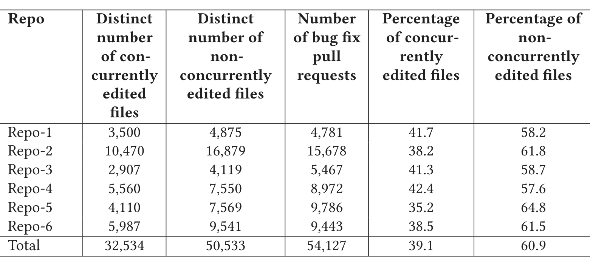

Table 1. Distribution of Concurrently and Non-concurrently Edited Files Per Repository

We compare how the percentage of edited files that are seen in bug fixes (within a day, a week, two weeks, and a month) varies with the nature of the edit (concurrent versus non-concurrent). Figure 1 shows the impact of concurrent versus non-concurrent edits on the number of bugs being introduced. Across all six repositories, the percentage of bug-inducing edits is consistently higher for concurrently edited files (blue bars) than for non-concurrently edited ones (orange bars).

### 3.3 RQ2: Edits in Files Versus Bug Fixes in Files

We use Spearman’s rank correlation to analyze how the total number of edits, concurrent edits, and non-concurrent edits to files each correlate with the number of bug fixes seen in those files.

While Figure 1 shows that more concurrently edited files are seen in bug fix pull requests (compared to non-concurrently edited ones), this might also be because these files are frequently edited and seen in bug fix pull requests naturally. To validate this, we performed Spearman rank correlation analysis for each file that is ever edited with respect to how many times it is seen in bug fixes (the numbers of data points from the six repositories are listed in Table 1):

- The total number of times a file is seen in all completed pull requests versus the number of bug fixes in which it is seen.
- The total number of times a file is seen in concurrent pull requests versus the number of bug fixes in which it is seen.
- The total number of times a file is seen in non-concurrent pull requests versus the number of bug fixes in which it is seen.

The results are in Table 2. We observe that concurrent edits (third column) consistently are correlated with bug fixes, more so than non-concurrent edits (column 4) and all edits (column 2). For all repositories except Repo-4, there exists almost no correlation between non-concurrent edits (column 4) and bug fixes.

For Repo-4, frequently edited files are not necessarily the ones seen in more bug fixes: there exists a negative correlation between total edits (column 2) and the number of bug fixes. However, files that are concurrently edited (column 3) do have a positive correlation with the number of bug fixes.

The variety in the correlations can be explained by the fact that concurrent editing is just one of many factors related to the need for bug fixing. Other factors might include the level of modularization, developer skills, the test adequacy, engineering system efficiency, and so on.