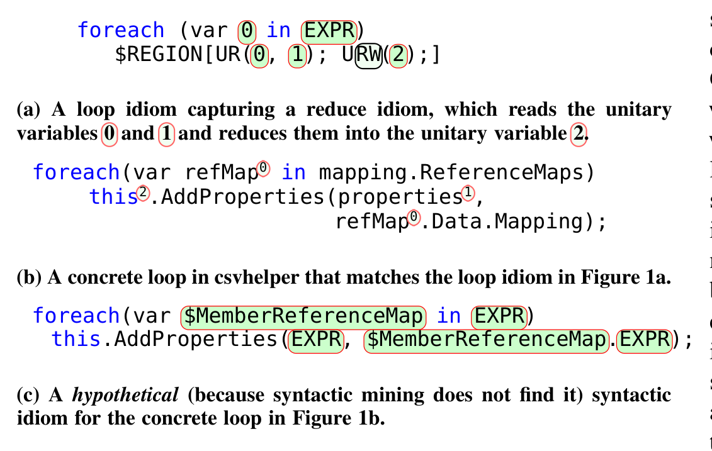
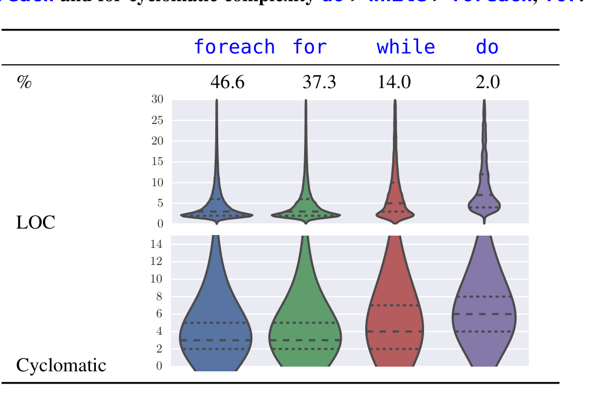
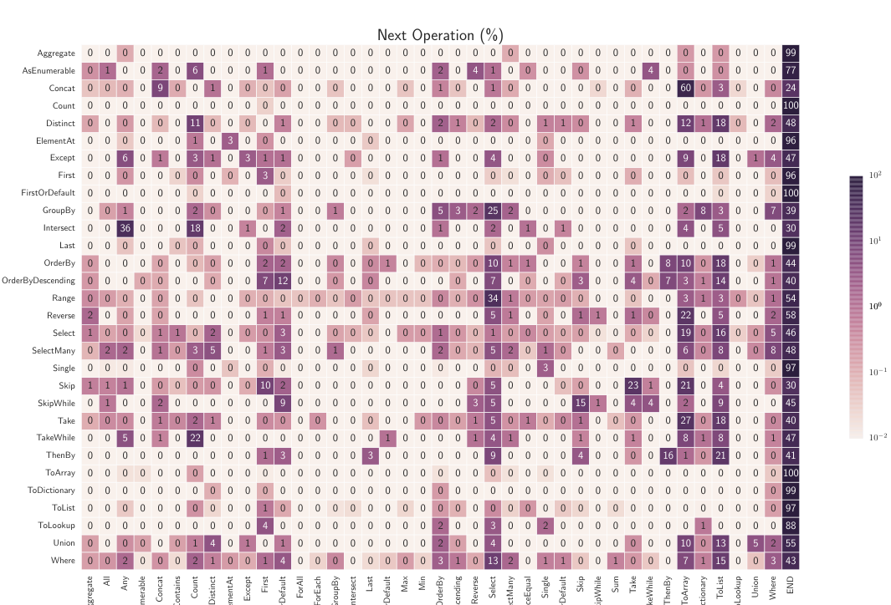
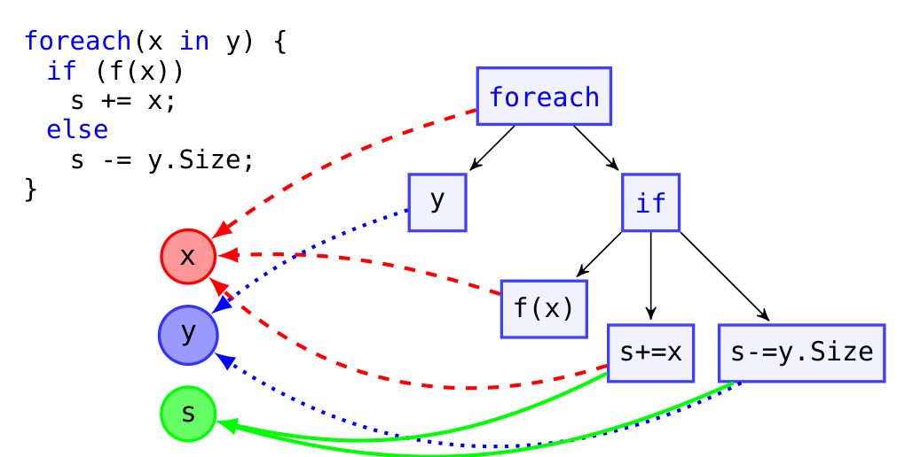
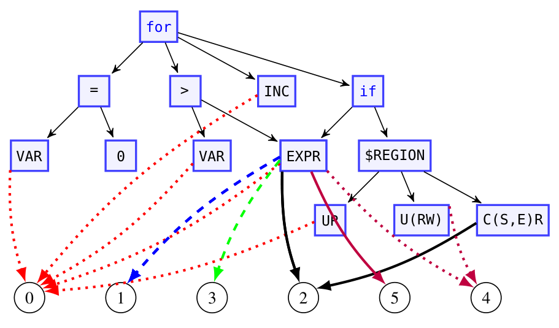
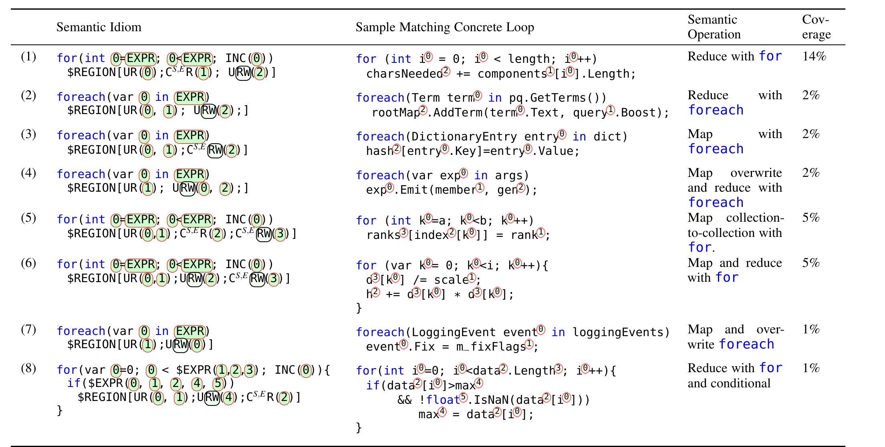
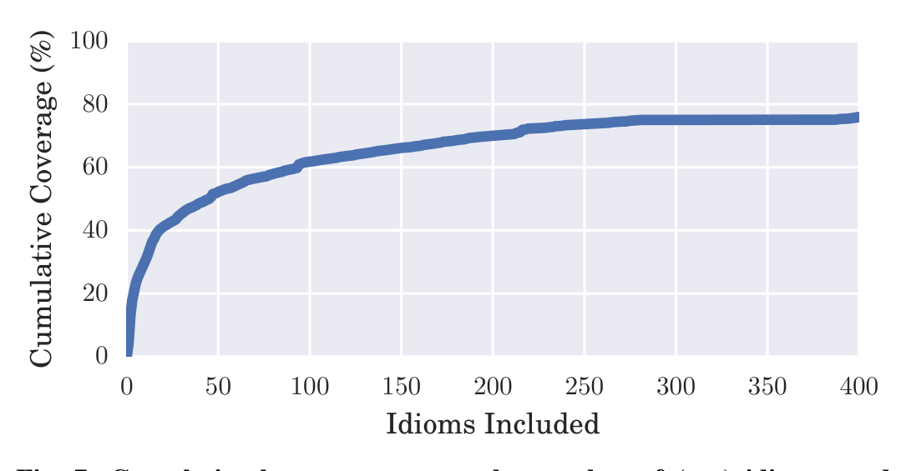
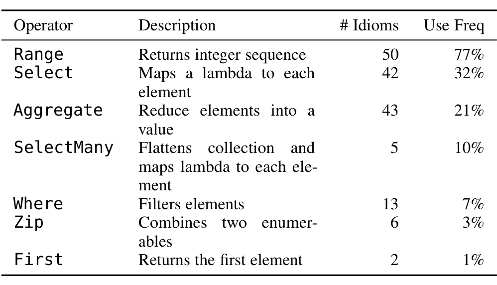

# Mining Semantic Loop Idioms

Miltiadis Allamanis, Member, IEEE, Earl T. Barr, Member, IEEE, Christian Bird, Member, IEEE, Premkumar Devanbu, Member, IEEE, Mark Marron, Member, IEEE, and Charles Sutton, Member, IEEE

Abstract—To write code, developers stitch together patterns, like API protocols or data structure traversals. Discovering these patterns can identify inconsistencies in code or opportunities to replace these patterns with an API or a language construct. We present coiling, a technique for automatically mining code for semantic idioms: surprisingly probable, semantic patterns. We specialize coiling for loop idioms, semantic idioms of loops. First, we show that automatically identifiable patterns exist, in great numbers, with a large-scale empirical study of loops over 25 MLOC. We find that most loops in this corpus are simple and predictable: 90% have fewer than 15 LOC and 90% have no nesting and very simple control. Encouraged by this result, we then mine loop idioms over a second, buildable corpus. Over this corpus, we show that only 50 loop idioms cover 50% of the concrete loops. Our framework opens the door to data-driven tool and language design, discovering opportunities to introduce new API calls and language constructs. Loop idioms show that LINQ would benefit from an Enumerate operator. This can be confirmed by the existence of a StackOverflow question with 542k views that requests precisely this feature.

> Index Terms—data-driven tool design, idiom mining, code patterns
> (cid:70)

## 1 INTRODUCTION

In the big data era, data is abundant; the problem is finding useful patterns in it. Language designers seek to discover patterns whose replacement with language constructs would increase the concision and clarity of code. Tool developers, like those who write compiler optimizations or refactorings, seek to prioritize handling those patterns that maximize the coverage and utility of their tools. Evidence-based language design and tool building promises languages and tools that more closely fit developer needs and expectations at less cost.

Kaijanaho [31]'s dissertation makes this case at length. A recent Dagstuhl seminar [36] concurs and, indeed, unsubstantiated empirical claims are common in the design proposals of various languages, underscoring both their importance and the current difficulty of substantiating them. For example, multiple C# language proposals make claims of the form "a relatively common request" [22], "It is very common when..." [14], "It is common to name an argument that is a literal..." [15]. Similarly in Java, we see "...but could result in a startup penalty for the very common case..." [25] and "However, the Deprecated annotation ended up being used for several different purposes. Very few deprecated APIs..." [42], unbacked by concrete statistics. Although we do expect the designers' intuitions to be mostly correct, designers are human and have biases.

Part of the problem is tooling. Currently, language designers and tool developers often rely on grep, supplemented with manual inspection and user feedback to discover and prioritize patterns. Existing tools, such as grep, do not search for patterns at the right level of abstraction, since they usually exactly match a pattern and require their users to have a priori knowledge about a target pattern. Worse, existing tools do not provide a statistical measure of the importance of a pattern and make it hard to reason about whether shrinking or expanding a pattern would be fruitful.

To address these issues, we propose adding semantic idiom mining to their toolbox. Semantic idioms are patterns over both syntax and semantics. This fusion allows the discovery of information-rich, interpretable patterns, in the face of data sparsity and noise. Semantic idioms allow a developer to reason about, and write tools to operate on, all the concrete loops that a particular semantic idiom matches. We extract semantic idioms from an abstract syntax tree (AST) augmented with semantic properties encoded as nodes in the AST and abstracting syntactic details. We call the process of semantically enriching an AST coiling; coiling builds a coiled AST, or CAST (Section 4.3). We then mine these CASTs using probabilistic tree substitution grammars (pTSG), a powerful machine learning technique for finding salient (rather than merely frequent) patterns (Section 2).

Allamanis and Sutton [3] were the first to formulate the idiom mining problem as the unsupervised problem of finding interpretable patterns that compactly encode the training set using Bayesian inference, specifically pTSG inference. Allamanis and Sutton [3] mined purely syntactic idioms, directly from conventional ASTs. Because they are oblivious to semantics, syntactic idioms tend to capture shallow, uninterpretable patterns and fail to capture widely used idioms, as those found in Section 5. For example, in the top 200 syntactic idioms of Allamanis and Sutton [3], we fail to find any idioms that summarize the semantic properties of an underlying, concrete loop. The root cause is data sparsity, here caused by the extreme variability of code.

As an anti-sparsity measure, we instantiate coiling for mining loop idioms, semantic idioms rooted at loop headers (Section 4.3). We focus on loops because of their centrality to programming and program analysis. The semantic annotations that coiling adds, like RW in Figure 1a, make semantic properties visible for training a probabilistic tree substitution grammar. Our coiling abstraction also removes syntactic information, such as variable and method names, while retaining loop-relevant properties like loop control.

- M. Allamanis was with the University of Edinburgh, UK and part of this work was done during an internship in Microsoft Research, USA. E-mail: miallama@microsoft.com
- M. Allamanis, C. Bird and M. Marron are with Microsoft Research. E. Barr is at University College London, UK and part of this work was done while visiting Microsoft Research, USA.
- P. Devanbu is with University of California, Davis, USA.
- C. Sutton is at the University of Edinburgh, UK and the Alan Turing Institute, UK.

Manuscript received XXX; revised YYY.

---



> **Image description:** The figure is three-part: (a) a coiled (semantic) loop idiom for a reduce pattern, (b) a concrete foreach loop from csvhelper that matches that idiom, and (c) a hypothetical syntactic idiom. The idiom in (a) shows a foreach over EXPR with a $REGION annotated as UR(0, 1); URW(2) — meaning two read-only unitary references (0 and 1) and one read‑write unitary reference (2), indicating a reduction into variable 2; references are numbered in lexical order. The concrete loop in (b) maps its actual names (refMap, properties, this.AddProperties) to those same reference roles so the semantic idiom abstracts over identifier differences (metavariables and EXPR placeholders are highlighted in green). Panel (c) contrasts a pure syntactic pattern that lacks mutability and reference annotations, illustrating why syntactic-only mining would miss this semantically meaningful reduce idiom.

Fig. 1: A loop idiom, a matching loop, and a hypothetical syntactic idiom. For more loop idiom samples, see Figure 6.

variables, collections, and variable mutability (Section 4). Loop idiom mining finds meaningful patterns, such as the simple reduce idiom in Figure 1a that matches the concrete loop of Figure 1b. Figure 1c shows a hypothetical syntactic idiom, which Allamanis and Sutton [4] introduced; for Figure 1b, syntactic idioms comprise syntactic code elements and non-terminal AST nodes. However, because syntactic idioms are oblivious to semantics, they must directly contend with the sparsity of the syntactic structures and tend to capture shallow, uninterpretable patterns. In particular, the syntactic mining does not find the hypothetical idiom in Figure 1c and it fails to capture widely used idioms, as Section 4 shows. Figure 6 shows more sample loop idioms and the concrete loops they match.

To further combat sparsity, we tailor idiom mining to the domain of source code. Instead of the simpler Dirichlet process, used by Allamanis and Sutton [3], we employ the more general Pitman–Yor process that provides control over the power-law tails of the mined idioms (Section 2). Flexible tail behavior is important in “natural” code — as in natural language — since we anticipate code to contain common idioms as well as a heavy tail of rare constructs. Additionally, we adapt the original mining method, as it was devised for natural language processing [53, 13], by removing the geometric distribution over the size of the idioms from the prior distribution. Empirically, this change vastly improved idiom quality, by allowing the mining of larger idioms.

In Section 5.4 to Section 5.6, we show how a data-driven approach, summarizing how a language is actually used, can guide a designer who is working on language and API evolution (rather than de novo design). Academics often use existing code to validate the commonality of patterns [52, 27]. Our work differs in two important aspects. First, our CASTs provide an abstract, but semantically expressive form, useful for matching patterns, as we show via our case studies in Section 5.3, Section 5.4, Section 5.5 and Section 5.6. Second, contrary to existing tools, which provide information about a given pattern but require their user to already know the pattern, idiom mining learns the common idioms directly from the data without any need for a priori intuition about the patterns.

We introduce a novel form of testing, which we call property modulo testing (PMT), to approximate semantic properties. PMT tests snippets of a program for properties, like purity (freedom from observable side-effects), that hold over a nontrivial proportion of a program’s run and yet may not be entailed by the program’s specification. Testing, in practice, is fast enough to scale up to large codebases. Beller et al. [9] found that 75% of the top projects in GitHub require less than 10 minutes to execute the full test suites, which often include more than 500 tests. Essentially, we check whether a property holds modulo a test suite. Unsound methods, like PMT, are difficult to combine with other logico-deductive static analysis methods. In contrast, machine learning models — including the one we present in this work — are designed to handle noisy inputs while maintaining their robustness, especially given big data. Our evaluation (Section 5) demonstrates the successful exploitation of imprecise semantic information when mining loop idioms; we conjecture that other, novel machine learning-based source code analysis techniques can rely on efficiently collecting accurate, albeit imprecise, semantic information which will be key to scaling up machine learning methods over very large codebases.

First, we study the search space of loop patterns to validate that such patterns exist in sufficient numbers and with sufficient diversity to justify mining them for loop idioms. To this end, we conducted a large-scale empirical study of loops across a corpus of 25.4 million LOC containing about 277k loops (Section 3). Our key finding is that real-life loops are mostly simple and repetitive. For example, 90% of loops have no nesting, are less than 15 LOC long and contain very simple control-structure. Despite their regularity, loops also have a heavy tail of diversity, exhibiting nontrivial variability across domains: on average, 5%, and, for some projects, 18% of loops are domain-specific. For example, we find that loops in testing code are much shorter than loops in serialization code, while math-related loops exhibit more nesting than loops that appear in error handling (Table 2).

Loop idioms capture sufficient detail to identify useful patterns despite this diversity. To show this, we build a second smaller corpus of programs we can build so we can apply PMT (Section 5.1). Against this corpus, we show that loop idioms identify opportunities to replace loops with functional operators, while retaining sufficient generality to cover most loops: 100 idioms capture 62% and 200 idioms capture 70% of all loops in our corpus.

To demonstrate the utility of mining and ranking semantic loop idioms, we present three case studies that exploit loop idioms to suggest refactorings, new language constructs, or APIs. For the first case study, we build and evaluate an engine (Section 5.3) that uses loop idioms to map a concrete loop to a functional construct in LINQ. It is not a refactoring engine; its aim is to prioritize refactorings for a tool developer. Nonetheless, when we manually mapped the top 25 idioms to LINQ statements in our corpus within 12 hours, this engine covered 45.4% of all the concrete loops and correctly suggested LINQ replacements for loops 89% of the time as judged by human annotators.

Second, mining semantic idioms identifies opportunities for new API features that can significantly simplify existing code (Section 5.6). For example, we found that in lucene.net developers consistently use a common loop idiom that requires them to loop over a collection of documents to invoke the AddDocument method. This identifies an opportunity: adding a simple API method, possibly called AddDocuments, that accepts a collection of elements, would simplify the code. This, in turn, would simplify many loops, making the code even more readable and “idiomatic”.

Finally, semantic idioms can guide programming language design (Section 5.4). Java’s foreach and multicatch constructs sim-

1. Language Integrated Query (LINQ) is a .NET extension that provides functional-style operations, such as map-reduce, on streams of elements and is widely used in C# code.

---

simplify common idioms that our framework identifies automatically. Had our framework been available, designers might have seen the need for these constructs earlier, speeding their implementation and deployment. Our idiom mining has identified such opportunities in C# and LINQ. A common operation is tracking the index of each element in a collection during traversal. Adding an Enumerate operator to C#, similar to Python’s, would simplify 12% of loops in our 25.4 MLOC corpus.

This paper presents a principled and data-driven approach for mining semantic idioms (i.e. rich code patterns) to help tool developers conceive and implement code transformation tools. Increasing the productivity of tool developers promises to bring domain-specific, even project-specific, tools within reach at reasonable cost; it also is a first step toward data-driven language and API design. Our principal contributions follow:

- We introduce semantic idiom mining, a new technique for mining code for semantic idioms, and specialize it for loop idioms, based on coiling: a new code abstraction technique that transforms code to create tailored training sets to improve the performance of machine learning models, here probabilistic tree substitution grammar inference (Section 4);
- We conduct two loop studies to motivate loop idioms: first, we show, over a large-scale study of 277k loops in a corpus of 25.4 MLOC, that most loops are surprisingly simple with 90% of them having less than 15 LOC and no nesting (Section 3) and therefore amenable to abstraction to patterns; and then conduct a second study over a smaller, buildable corpus to show how effectively loop idioms cover concrete loops, finding that the top 25 loops cover 45% of concrete loops (Section 5.1); and
- We demonstrate the utility of loop idioms for tool and language construction via three case studies: prioritizing loop-to-LINQ refactorings, identifying calls to add to an API, and identifying constructs to add to a language.

Section 6 presents related work and Section 7 concludes. Our data and code is available online at http://groups.inf.ed.ac.uk/cup/semantic-idioms/.

Section 2 presents background material on statistical methods used in this work, notably probabilistic tree substitution grammars, which Allamanis and Sutton [4] first applied to software engineering problems. To be useful, loop idioms must occur 1) sufficiently often and 2) cover sufficiently many concrete loops. To answer whether they occur sufficiently often, we conduct a large scale empirical study of the search space of loop patterns over the first corpus we collect. Section 3, entitled “There are Idioms in Them Thar Hills”, describes this study and affirms the prevalence of interesting loop characteristics out of which patterns, and therefore idioms, are built. Section 4 presents our core contribution, semantic idiom mining, as realized for loop idioms, and the coiling and property modulo testing techniques on which that mining rests. Against a second, smaller corpus of programs that we can build (a necessary condition for our property modulo testing), Section 5 answers the second question; it makes the case for the utility of loop idioms. Section 5.1 quantifies the coverage of loop idioms, showing that the top 25 cover 45% of all concrete loops. Section 5.2 presents example loop idioms; Section 5.3 and the next sections present three examples that illustrate how to use loop idioms:

2. We adapted this title from “There’s gold in them thar hills” in Mark Twain’s The American Claimant, 1892.

## 2 BACKGROUND: STATISTICAL METHODS

In this work, we follow Allamanis and Sutton [4] and employ probabilistic tree substitution grammar (pTSG) inference to automatically and exhaustively capture the idioms needed to reconstruct a forest of ASTs. Here, we augment these ASTs with annotations that record semantic properties, like variable mutability. We now summarize pTSG inference, starting with explaining why powerful statistical methods are necessary for mining syntactic and semantic idioms, rather than simpler methods that are easier to apply.

### 2.1 Why These Methods?

Previous work mined frequent patterns to find meaningful patterns. Unfortunately, the “a priori principle” states that the larger a pattern, the smaller its support, i.e. the number of objects covered by that pattern [2, Chap. 5]. Further, frequent pattern mining does not capture statistical dependence among the mined elements. Thus, filtering patterns based on frequency triggers pattern explosion, returning an unwieldy number of patterns that differ only trivially [2, 18, Chap. 5]. In contrast, idiom mining needs to take into account the trade-offs involved. Adding one idiom, “steals” support (viz. probability mass) from another idiom. Therefore, idiom mining balances the frequency of a pattern with how surprising the pattern is to achieve a reasonable balance and select the patterns that most effectively maximize the likelihood of the training data. For a concrete problematic example for frequency-based methods consider foreach (var _ in EXPR) { BODY } which has an unspecified loop body. It is a very frequent, but meaningless, pattern. In short, frequent patterns are rarely meaningful to developers and tend to miss many patterns that are present in the data [38].

One might also ask: why employ a probabilistic model here? The reason is that probabilities provide a natural quantitative measure of the quality of a proposed idiom. Imagine that we create two different models, M1 that contains a proposed idiom and M2 without it. Then we rank M1 and M2 under the posterior distribution. A proposed idiom is worthwhile only if, when we add it to a pTSG, it increases the probability that the pTSG assigns to the training corpus. This encourages the method to avoid identifying idioms that are frequent but trivial and meaningless. As we show below, the statistical procedure that we, in fact, employ is quite a bit more involved, but this is a good basic intuition. Second, it may seem odd that we apply grammar learning methods when the grammar of the programming language is already known. However, our aim is not to re-learn the known grammar, but rather to learn probability distributions over ASTs from a known grammar. These distributions represent which rules from the grammar are used more often and, crucially, which sets of rules tend to be used contiguously.

### 2.2 Representing Idioms

A tree substitution grammar (TSG) [30, 13, 53] is a simple extension to a context-free grammar (CFG), in which productions expand into tree fragments rather than simply into a list of symbols. Formally, a TSG is also a tuple G = (Σ, N, S, R), where Σ, N, S are exactly as in a CFG, but now each production r ∈ R takes the form X → T_X, where T_X is a tree fragment rooted at the nonterminal X.

---

To produce a string from a TSG, we begin with a tree containing only S, and recursively expand the tree top-to-bottom, left-to-right as in CFGs — the only difference is that some rules can increase the height of the tree by more than 1. A probabilistic tree substitution grammar (pTSG) G [13, 53] augments a TSG with probabilities, in an analogous way to a probabilistic CFG (PCFG). A pTSG is G = (Σ, N, S, R, Π), which augments a TSG with Π, a set of distributions P_TSG(T | X) for all X ∈ N, each of which is a distribution over the set of all rules X → T in R that have left-hand side X.

The key reason that we use pTSGs for idiom mining is that each tree fragment T_X can be thought of as describing a set of context-free rules that are typically used in sequence. This is exactly what we are trying to discover in the idiom mining problem. In other words, our goal is to induce a pTSG in which every tree fragment represents a code idiom if the fragment has depth greater than 1 — we call these rules fragment rules. The remaining TSG rules, those whose RHS has depth 1, are less interesting, as they are simply the productions from the original CFG of the programming language. As a simple example, consider the probabilistic CFG:

```
E → E + E    (prob 0.7)    T → F * F    (prob 0.6)
E → T        (prob 0.3)    T → F        (prob 0.4)
F → (E)      (prob 0.1)    F → id       (prob 0.9)
```

where E, T, and F are non-terminals, and E is the start symbol. Note that the probabilities of all productions of each non-terminal symbol sum up to one, i.e., define a probability distribution for expanding the non-terminal. Now, suppose that we are presented with a corpus of strings from this language that include many instances of expressions like id*(id+id) and id*(id+(id+id)). Then, we might choose to add a single pTSG rule to this grammar, like

```
E → F * (T + T)    (prob 0.4)
```

When we add the pTSG rule, we adjust the probabilities of the previous rules so that all of E’s productions sum to 1 as shown. Essentially, this allows us to represent a correlation between the rules E → T + T and T → F * F. Finally, note that every CFG can be written as a TSG where all productions expand to trees of depth 1. Conversely, every TSG can be converted into an equivalent CFG by adding extra non-terminals (one for each TSG rule X → T). So TSGs are, in some sense, fancy notation for CFGs. This notation will prove very useful, however, when we describe the learning problem next.

### 2.3 Inferring Idioms

To solve the idiom mining problem, a natural idea is to search for subtrees that occur often in a corpus. However, this naïve method does not work well, for the simple reason that frequent patterns are often meaningless. This is a well-known problem in data mining [2, Chap. 5]. To return to our previous example, the foreach semantic loop idiom

```
1 foreach(var 0 in EXPR) {
2   $REGION[UR(0, 1); URW(2);]}
```

occurs commonly, but it would be hard to argue that the significantly more common

```
1 foreach(var 0 in EXPR) { BODY }
```

on its own (with no body) is an interesting pattern. Instead, Allamanis and Sutton [4] suggest a different principle: interesting

patterns are those that help to explain the code that programmers write. It is when it comes to quantifying the phrase “help to explain” that the machinery of statistical natural language processing becomes necessary. Essentially the goal is that each returned idiom corresponds to a group of syntactic rules that often co-occur. To formalize this intuition, the idea is to infer a pTSG that is equivalent to the original language grammar in the sense of generating the same set of strings, but provides a better explanation of the data in the statistical sense. We do this by learning a pTSG that best explains a large quantity of existing source code. We consider as idioms the tree fragments that appear in the learned pTSG. We learn the pTSG using a powerful framework called nonparametric Bayesian methods.

Nonparametric Bayesian methods provide a theoretical framework to infer how complex a model should be from data. Adding parameters (which correspond to pTSG fragment rules in our case) to a machine learning model increases the risk of overfitting the training data, simply by memorizing it. But if we allow too few parameters, then the model will be unable to find useful patterns (i.e., underfit). Bayesian statistics [23, 48] provides a simple and powerful method to manage this trade-off. The basic idea is that whenever we want to estimate an unknown parameter θ from a dataset x1, x2, …, xN, we should not only treat the data as random variables — as in classical statistics — but also θ as well. To do this, we must choose a prior distribution P(θ) encoding any prior knowledge about θ, and then a likelihood P(x1 … xN | θ) that describes a model of how the data can be generated given θ. Once we define a prior and a likelihood, we can infer θ via its conditional distribution P(θ | x1 … xN) by Bayes’ rule. This distribution is called the posterior distribution and encapsulates all of the information that we have about θ from the data. We can compute summaries of the posterior to make inferences about θ. For example, if we want to estimate θ by a single vector, we might compute the mean of P(θ | x1 … xN). To summarize, applications of Bayesian statistics have three steps: 1) choose a prior P(θ); 2) choose a likelihood P(x1 … xN | θ); and 3) compute P(θ | x1 … xN) using Bayes’ rule.

As a simple example, suppose the data x1 … xN are real numbers, distributed independently according a Gaussian distribution with variance 1 but unknown mean θ. Then we might choose a prior P(θ) to be Gaussian with mean 0 and a large variance, to represent the fact that we do not know much about θ before we see the data. Our beliefs about the data indicate that p(xi | θ) is Gaussian with mean θ and variance 1. By applying Bayes’ rule, it is easy to show that P(θ | x1 … xN) is also Gaussian, whose mean is approximately equal to N^{-1} ∑_i x_i and whose variance is approximately 1/N. This distribution represents a Bayesian’s belief about the unknown mean θ, after seeing the data.

Nonparametric Bayesian methods handle the more complex case where the number of parameters is unknown as well. They focus on developing prior distributions over infinite-dimensional objects (e.g. the infinite set of possible pTSG rules in our case), which are then used within Bayesian statistical inference. Bayesian nonparametrics have been the subject of intense research in statistics and machine learning [24, 64]. To infer a pTSG G using Bayesian inference, our prior distribution must be a probability distribution over probabilistic grammars, which we call P(G). A sample from P(G) is a pTSG, which is specified by the set of fragments F_X that are rooted at each nonterminal X, and a

3. The exact value depends on precisely what variance we choose in P0(θ), but the formula is simple.

---

distribution P_TSG(T | X) over the rules that can be used to expand each non-terminal X. Sampling this pTSG gives us full trees.

The specific prior distribution that we use is called a Pitman–Yor process [24, 64]. This choice was based on previous work in applying pTSGs to natural language [53, 13]. The Pitman–Yor process prior has the following properties: 1) It places no a priori upper bound on the size (the number of rules) of the pTSG (that is, the method is nonparametric). 2) It favors small grammars, discouraging the method from memorizing the training set. 3) It allows modeling production usage as a Zipfian distribution. This last property is particularly important, since it is well known that both source code and natural language exhibit Zipfian properties. Here, we differ from Allamanis and Sutton [4] in two ways: we use the more general Pitman–Yor process (instead of its simpler Dirichlet process) and we do not assume a geometric distribution over the number of productions in the prior. The Pitman–Yor process is a “stick-breaking process” [58] where a stick of size 1 (the probability space) is split into countably infinite parts (each part represents a pTSG rule in our case). Formally, we have

Pr[T ∈ F_X] = ∑_{k=1}^∞ π_k δ_{T=T_k},     T_k ~ P_0   (1)

π_k = u_k ∏_{j=1}^{k-1} (1 − u_j),     u_k ~ Beta(1 − d, α + k d)   (2)

where δ_{T=T_k} is a delta function, i.e., a probability distribution over T that generates T_k with probability 1. Setting d = 0 retrieves the Dirichlet process. We define our prior distribution P_0(G) as the PCFG distribution of our corpus. We found that removing the geometric distribution, used in related work [3, 13, 53], was particularly important for mining longer idioms, since it imposed strict constraints on the size of the inferred tree fragments. We believe that, although this constraint is important for mining natural language trees, it is harmful for mining idioms from source code.

Given P_0(G), the prior distribution over pTSGs, we apply Bayes’ rule to obtain a posterior distribution P(G | T_1, T_2, …, T_N). Intuitively, this distribution represents, for every possible pTSG G, how much we should believe that G generated the observed data set. Applying Bayes’ rule, the posterior is

P(G | T_1, T_2, …, T_N) = (∏_{i=1}^N P(T_i | G) P_0(G)) / p(T_1, T_2, …, T_N)

i.e., it assigns high probability to grammars G that themselves assign high probability to the data (this is P(T | G)) and that receive a high score according to the prior distribution P_0(G). Unfortunately, the posterior distribution cannot be efficiently computed exactly, so — as is common in machine learning — we resort to approximations. The most commonly used approximations in the literature are based on Markov chain Monte Carlo (MCMC). MCMC is a family of randomized methods that runs for a user-specified number of iterations. At each iteration t, MCMC generates a pTSG G_t that has the special property that if t is taken to be large enough, eventually the sampled value G_t will be approximately distributed as P(G | T_1, T_2, …, T_N). In our work, we use an MCMC method [39] for as many iterations t as we can afford computationally and then extract idioms from the few final samples of the pTSG.

## 3 THERE ARE IDIOMS IN THEM THAR HILLS 4

This work rests on the claim that we can mine semantic idioms of code, specifically loop idiom, to provide data-driven knowledge to refactoring tool developers and API and language designers. To substantiate this claim, we demonstrate their prevalence in real world code and their coverage of concrete loops.

Probabilistic tree substitution grammars capture surprising patterns hidden in diverse data sets. For their application to make sense, a data set must be diverse to make patterns hard to find, but not so diverse as to lack patterns. Here, we conduct a large scale study of real-world loops to show that they are diverse, in no small part due to their domain-specificity. Humans do not need sophisticated tools to discover frequent patterns. It is finding patterns amid diversity that is hard; pTSG inference excels at this task, as we show in this work. Here, we first establish a necessary condition for these patterns to exist: that loops have sufficiently common, but also diverse, characteristics that indicate an underlying set of patterns. We show that these loop characteristics exhibit domain-specificity, implying the presence of domain-dependent loop idioms. Among the findings, we report below is the fact that serialization has large loop bodies and that testing code, in contrast, tends to have small loop bodies but is surprisingly deeply nested. LINQ functionalizes loops; LINQ statements form a type of loop idiom. One of our case studies is to mine mapping between loop patterns and LINQ patterns; if neither exhibits patterns, no such mapping could exist. Here, we demonstrate this necessary condition: both have minable patterns.

To this end, we conduct a large-scale empirical study of loops and LINQ statements on a large corpus of 25.4 MLOC. This study of loops contributes to a long-standing line of research. Knuth [35] analyzed 7,933 FORTRAN programs, finding that loops are mostly simple: 95% of them increment their index by one, 87% of the loops have no more than 5 statements and only 53% of the loops are singly nested. Here, we find comparable results but find that loop nesting is much more rare. Changes in coding practices, notably the dominance of structured programming and object-orientation, may account for this difference. Most recently, CLAPP [20] studied 4 million Android loops, seeking to characterize execution time. In contrast, our focus is on the semantic naturalness of the loop constructs. Nonetheless, both studies find similar proportions of simple loops.

### First Corpus

We collect our first corpus from GitHub. Using the GitHub Archive, we compile a list of all C# projects. We then compute the z score of the number of forks and watchers and sum them. We use this number as each project’s popularity score. Here, in Section 3, we use the top 500 projects to compute the reported results. This corpus contains 277,456 loops and 1,109,824 LINQ operations.

### Loop Statistics

We begin with some descriptive statistics over the top 500 projects that contain 277,456 loops within. Table 1 presents summary statistics for different types of loops, their sizes and complexities. The top row shows that foreach loops are the most popular. These foreach loops already represent a degree of abstraction, and their popularity suggests that programmers are eager to embrace it when available. The other loops (for, while) are less frequent, and do is relatively rare. The width of the violin plot gives an indication of the proportion of the sample which

4. As noted in the introduction, we have adapted this title from “There’s gold in them thar hills” in Mark Twain’s The American Claimant, 1892.

---

lies in that value range. The foreach, for, while loops are most often around 2 lines long, while do loops are a bit larger at the mode, around 5 lines. Cyclomatic complexity [44] measures the number of independent paths, and is used as a measure of code complexity; in our sample it is most often around 3 for foreach and for, and around 4 for while; this indicates that developers pack a conditional inside a short loop. do loops’ complexities are often a bit higher, presumably because they tend to be longer. These results show that loops are natural, i.e. simple and repetitive. This is the key finding on which our entire loop mining technique rests: patterns that are repetitive enough can be efficiently and effectively found.

Table 2 presents further characteristics of the loops. Leftmost, we see the nesting level of loops. The vast majority (90%) of the loops are singly nested; virtually all (99%) are at most 2 levels of nesting. In our corpus, virtually none at 3 levels of nesting. The second plot is the size of the loops, in LOC (we remove empty lines, comments and lines that contain only braces); 90% are under 15 LOC, and 99% under 58 LOC. The third plot shows the proportion of lines in code that are loops. On average, 4.6% of lines belong in a loop and 90% of the code has no more than 18% of loop density (i.e. the proportion of non-empty lines of code that are contained within loops). Finally, at rightmost we have the density of LINQ statements per kLOC in our corpus. We find that in most cases (90%) there are no LINQ constructs at all; and fully 99% of our samples have fewer than 25 LINQ statements per kLOC. These LINQ findings underscore the need for loop to LINQ refactoring and motivates case study on the utility of loop idioms for a developer seeking to write such a refactoring tool (Section 5.3). These statistics and their associated graphs in Table 2 verify that most loops are simple, and also illustrate the Zipfian distribution of relevant metrics. Knowing this fact helps us design and select models. Concretely, we used this fact to guide our selection of the Pitman–Yor process as described in Section 2.

### Loops per Topic

To get a sense of the domain-specificity of loops, we used topic analysis. To extract topics from source code, we parsed all C# files in our 25.4 MLOC corpus to collect all identifiers, except those in using statements5. We then split the identifiers on camel case and on underscores, lowercasing all subtokens. We remove any numerals. For the topic model, each file becomes a multiset of subtokens. We use MALLET [45] to train LDA and classify each file. For training, we used an asymmetric Dirichlet prior and hyperparameter optimization. After extracting the topics, we rank the topics by different descriptive statistics to analyze loops by topic. The appendix contains the inferred topic model.

The ordered lists in Table 2 offer a more qualitative look at the above statistics, giving insight into the prevalence of domain-specific loop characteristics. For example, the leftmost column suggests that loops in MVC (Model-View-Controller) settings tend to be very shallow in nesting, whereas loops in mathematical domains can be deeply nested (e.g. tensor operations). On the second column, we see topics ordered by size (LOC) of topical loops: testing loops are quite small, whereas loops relating to serialization are quite long (presumably serializing intricate container data structures within a loop).

The third column shows the loop density per topic. Security concerns, native memory, testing and GUI have few loops in the code. On the other hand, code that is concerned with collections, serialization, math, streams, and buffers contains a statistically
5. The using statement in C# is similar to import in Java and Python.

6
TABLE 1: Loop statistics per type. The statistically significant differences (p < 10−5) among the loops are: (a) average LOC do > while > for > foreach and for; cyclomatic complexity do > while > foreach, for.



> **Image description:** A pair of violin plots comparing four loop kinds (foreach, for, while, do) showing their prevalence and distributions of size (LOC) and cyclomatic complexity. The column headers show prevalence: foreach 46.6%, for 37.3%, while 14.0%, and do 2.0%. The top panel (LOC) shows modes near 2 lines for foreach, for, and while, with do loops having a larger mode (~5 LOC); the bottom panel (cyclomatic complexity) shows modes around 3 for foreach/for, around 4 for while, and higher complexity for do loops. The dashed lines inside each violin indicate summary statistics (median and quartiles), highlighting that most loops are short and have low control-flow complexity.



> **Image description:** A square heatmap showing transition percentages between LINQ operators: rows are the current operator and columns are the next operator (with a final “END” column indicating the operator terminates the sequence). Each cell contains the percent of times the row operator is immediately followed by the column operator, computed from 132,140 LINQ sequences; darker/purple cells denote higher percentages on a roughly logarithmic color scale. The plot is sparse: most operator pairs are 0% or near-zero, while a few pairs are common (for example, Select is often followed by ToArray (≈19%) or ToList, reflecting the common pattern of mapping then materializing a collection). The rightmost “END” column shows many operators frequently end a chain, so usage concentrates in a small set of recurring operator chains rather than being uniformly distributed across all possible pairs.

Fig. 2: Common pairs of LINQ operations in our corpus. The darker the color the more often the pair is used. Numbers show the percent of times that the current operation is followed by another. The last column suggests that the current operation is the last one. Data collected across 132,140 LINQ sequences from our corpus. Best viewed in screen. A larger version can be found in the appendix.

A significantly larger proportion of code within loops. In the last column, we present topics ordered by frequency of LINQ operator usage. We can see that LINQ operators are frequently used within session handling and testing, while it is more infrequently used for security, native memory handling, GUI and graphics.

These results show that loops are “natural” in that they are mostly simple and short, yet still have a long tail of highly diverse loops. This suggests that it is possible to mine loop idioms that can cover a large proportion of the loops, a fact that we exploit to show the utility of loop idioms in the next section. Additionally, across our 25 MLOC corpus we find that loop characteristics and usage differ significantly across domains, suggesting that different loop patterns are dominant in different domains. For example, a surprising finding is that testing code contains significantly more deeply nested and small (in LOC) loops. Also surprisingly, loops that deal with streams, buffers and databases tends to have much larger nesting compared to other domains. Therefore, data-driven loop idiom mining is needed to uncover domain-specific loop idioms that humans, relying solely on intuition to find common patterns, might miss.

### LINQ Operator Usage

Programming rests on iteration. Loops and LINQ expressions are two ways to express iteration in code.

---

IEEE TRANSACTIONS ON SOFTWARE ENGINEERING 7

TABLE 2: Loop and LINQ statistics for the top 500 C# GitHub projects (25.4 MLOC). Top high and low topics have a statistically significant difference (p < 10−3) using a Welsh t test for the first two columns and the z test for population proportions for the other two. A full list of the topic ranking can be found in the appendix.


> **Image description:** A four-panel figure showing distributions over (left to right) Nesting Level, Loop Body Size (LOC), Loop Density (% LOC), and LINQ Statements per 1kLOC for the top 500 C# projects. Each panel is a histogram (log-scaled frequency axis) with summary statistics shown beneath: nesting x̄ = 0.14 (p90 = 1, p99 = 2); body size x̄ = 7.7 lines (p90 = 15, p99 = 58); loop density x̄ = 4.6% (p90 = 18%, p99 = 56%); LINQ statements x̄ = 1.10 per kLOC (p90 = 0, p99 = 25). A topic-ranked table under the histograms lists the five topics with the lowest and highest values for each metric (e.g., for nesting: lowest = MVC/Events, Error Handling, Web/HTTP, Time/Scheduling, Session Handling; highest = Databases, Testing, Streams/Buffers, Graphics, Math/Temporaries; analogous lists appear for the other three metrics). The plots emphasize heavy-tailed/Zipf-like distributions: most loops are short and non-nested, loop LOC density is small in most files, and LINQ usage is concentrated in relatively few projects.


> **Image description:** A left-to-right flowchart showing how source code is converted into ranked semantic idioms. The red 'Corpus' box feeds both an 'ASTs' box (arrow right) and a 'Semantic Analysis' box (arrow down); the ASTs box then flows into a central 'Coiling' box. Coiling and the Semantic Analysis outputs both feed the 'pTSG Inference' stage, which passes results to 'Idiom Ranking' and finally to a blue 'Semantic Idioms' output box. The diagram encodes the paper's method: the corpus is parsed and analyzed (e.g., property modulo testing for mutability/purity), coiling merges syntactic trees with those semantic annotations (producing CASTs), a probabilistic tree substitution grammar (pTSG) mines recurring fragments, and a ranking step orders idioms by coverage and expressivity for presentation.

Fig. 3: The architecture of our semantic idiom mining system. As Section 5 demonstrates, semantic idioms enable code transformation tool developers and language designers to make data-driven decisions about which transformations to implement.

Thus, LINQ expressions are another data source on how humans think about iteration. Patterns in LINQ expressions strongly indicate patterns in semantically equivalent loops. For example, if we see a Map-Reduce LINQ statement, we should expect a similar loop idiom. But if we do not see a GroupBy-Map often in LINQ, we do not expect to see this in loops either. Figure 2 shows the probabilities of a bigram-like model of LINQ operations. The table essentially shows transition frequencies from one LINQ operator to the next. The darker the cell, the more frequent the indicated transition. The special END token denotes that no LINQ operation follows. For example, a common use of Select is to map data from a container into another container data structure; hence ToArray (19% of times) or ToList frequently follow Select. In one direction, this suggests new LINQ operators; in the other, it identifies common operations that we expect to find in loops, LINQ operations our loop idioms discover, as Section 5.1 shows.

## 4 MINING SEMANTIC IDIOMS

To mine interesting, expressive idioms in the face of data sparsity, we introduce semantic idioms. Semantic idioms improve upon syntactic idioms through a process we call coiling. Coiling is a graph transformation that augments standard ASTs with semantic information to yield coiled ASTs (CASTs). Coiling combats sparsity by (a) inferring semantic properties like variable mutability and function purity, using a novel testing-based analysis that we call property modulo testing (Section 4.1), (b) encoding these semantics properties into nodes (Section 4.2), and (c) transforming

CASTs into simpler trees through a combination of node fusion and projection (Section 4.3). Figure 3 depicts the workflow of semantic idiom mining: Given a corpus of code, we extract its ASTs and perform all semantic analyses needed to extract the relevant semantic information from code. Given this information, the corpus of ASTs is coiled into arbitrary tree structures that contain only the relevant syntactic and semantic information. The coiled corpus is then given to the idiom miner which mines the semantic idiom candidates. Finally, these candidates are ranked and presented to the tool developer or language designer.

### 4.1 Property Modulo Testing

Property modulo testing (PMT) is a novel testing technique, first presented here, that checks whether a property holds over all executions of a subject under test (SUT) over a test suite. In standard testing, each test can, and usually does, have its own test oracle that usually checks a test-specific property, which is derived from the SUT’s specification. In property modulo testing, all the tests share the same test oracle that checks a property that the SUT’s specification may not entail. PMT tests executable code fragments, like a loop, of a larger program for execution properties like variable mutability, functional purity, variable escape, aliasing [5, 55], or loop-carried dependencies. It is because these fragments are often implementation details relative to the larger program that contains them that the larger, containing program’s specification does not entail these properties.

Not all properties are amenable to PMT. It is well-suited for properties that must hold over a sufficiently large portion of program runs. “Sufficiently large” is a function of the testing resources one wishes to devote to the task of finding such a property. The intuition is that these frequent properties are hard to hide from random testing, by definition. The execution of each test can be seen as a throw of a biased coin which on one outcome (e.g. tails) reveals the SUT’s “true” nature. This describes a geometric distribution, which, in the limit, guarantees that we learn the ground truth. Of course, if the probability of revelation is small, we might need a huge number of trials. We mitigate this problem

---

by augmenting random testing with manual tests; humans tend to write tests that focus on the rare corner cases that are expensive for random testing to discover. Also, we are assuming the trials are independent. Although we do not do so here, we could strengthen the independence by running each test on a virtual machine that we reset to the same initial state before each run.

Like all testing methods, we lack the probability distribution over the SUT’s inputs. Property modulo testing uses the input distribution defined by a test suite, which may be arbitrarily different from the SUT’s actual input distribution, but is designed to exercise corner cases. So it is, intuitively, more likely to elicit violations. Since it is testing-based, property modulo testing underapproximates whether the checked property actually holds. If it finds a violation, it is sound; however, it is incomplete with respect to whether the checked property holds in general.

### Variable Mutability and Function Purity

A variable (or global) is immutable modulo a function when that function does not write that variable during its execution; otherwise it is mutable. A pure function has no observable side-effects. Variable mutability gives us function purity for free. To infer purity, we aggregate the mutability of all of a function’s variables and globals: if any global is mutable, the function is impure; otherwise it is pure. Here, we construe global broadly to include the environment, such as reading files, interacting with users, or reading network packets.

Loop idioms must encode variable mutability and function purity because our main use-case — prioritizing concrete loops for a tool designer who is creating a tool to convert loops to LINQ statements (Section 5.1) — relies on it: you can only replace a loop with a functional operator if it is pure. Beyond purity, variable mutability allows us to recognize if a loop performs a reduce operation or a map requires us to know which variables are read and which are written. For most variables, only a few runs of a function are necessary to reveal its mutability, because code must be carefully written to hide the mutability of its variables and there is rarely any reason to do so. Thus, exercising a function against its program’s test suite is likely to detect the mutability of its variables. Armed with this intuition, we implement an approximate dynamic variable mutability and function purity detection technique, which we then embed into CASTs tailored for loop idioms, described next.

Given a method and a test suite that invokes that method, we run the test suite and snapshot memory before and after each invocation of the method. A variable (or global) is immutable modulo the test suite if its contents are unchanged across all its invocations during the execution of the test suite; otherwise it is mutable. As noted above, a method is pure modulo a test suite if it does not mutate any of its globals under the test suite; otherwise it is impure.

To snapshot the stack and the heap, we traverse them starting from the SUT’s reference arguments and globals. We traverse the heap breadth-first, ignoring backedges, to compute its hash. We snapshot and hash memory before and after each invocation. We compare the before and after hashes of an invocation to infer variable mutability. If the test suite does not execute the method, the mutability of its variables and globals and therefore its purity are unknown. Otherwise, the SUT’s arguments and globals are (possibly) immutable until marked mutable. As noted above, our technique may report false positives (incorrectly reporting a variable as immutable, when it is not) but not false negatives6.

Our dynamic analysis underapproximates variable mutability and is imprecise, but allows us to scale to industrial codebases simply by leveraging their test suites. Static analysis also contends with imprecision [67]. The mining of other idioms may require soundness; for this reason, we designed our mining procedure so that we can easily replace our dynamic analysis of purity and mutability with any sound static analysis [63, 43, 12]. Also, we emphasize that our PMT technique combines random testing with human-generated tests, which tend to test corner cases, thereby testing both the common cases that humans tend to neglect and the rare corner cases that random testing is unlikely to trigger. In any case, we are using this imprecise mutability information as input to a machine learning algorithm that can handle noise in the form of variables mislabeled immutable.

We instrument every method to realize our technique. First, we wrap its body in a try block, so that we can capture all the ways the function might exit in a finally block. At entry and in the finally block, we snapshot a method’s immutable-so-far arguments and globals and compute their hash. In the finally block after the snapshot, we compare the hashes and mark any variables whose value binding changed as mutable. Once a variable is marked mutable, we no longer check its mutability.

To speed our inference of variable mutability and avoid the costly memory traversals, we use exponential backoff: if a method has been tested n times and has not mutated any of its variables or globals, then we test its variable mutability and purity only with probability p^n. We used p = 0.9. As a further optimization and to avoid stack overflows, we assume that GetHashCode() and Equals(object) are pure and do not mutate their arguments and ignore them. These methods execute very frequently, so instrumenting them is costly. Our method does not detect when a variable is overwritten with the same value. This causes false positives if such identity rewritings imply variable mutability.

Since we cannot easily rewrite and rebuild libraries, our technique cannot assess the variable mutability of their functions and therefore the purity of calls into them. However, they are frequent in code, so we manually annotated the variable mutability and purity of about 1,200 methods and interfaces in core libraries, including CoreCLR. These annotations encompass most operations on common data structures such as dictionaries, sets, lists, strings, etc. These methods and interfaces are those used by our second corpus. To annotate each method, one author manually examined their source and their .NET documentation. A second author verified those annotations and fixed a few mistakes. Determining the variable mutability of CoreCLR methods is relatively easy, thanks to their strict adherence to an accurate and meaningful API naming convention. For example, all methods that start with subtokens like Get, Find and Is never modify their arguments, whereas methods containing subtokens such as Set, Add and Clear do modify some of their arguments.

To evaluate the accuracy of our dynamic variable mutability analysis, we randomly sampled 100 instrumented methods and manually assessed the correctness of the analysis. From the 100 methods, we found 91 to be correct for all globals and variables they use; for two of the methods we could not reach a conclusion within the maximum of 10 minutes allotted to each method and therefore excluded them from this analysis. The 7 incorrect cases were related to either non-exercised paths within the test suite or to accesses to native memory that our analysis cannot reach. This suggests that our dynamic variable mutability analysis achieves an accuracy of 92.9% ± 5% at a 95% confidence level.

6. With the rare exception of code that uses unmanaged memory.

---



> **Image description:** The image juxtaposes a concrete C# foreach loop (left) — "foreach (x in y) { if (f(x)) s += x; else s -= y.Size; }" — with its coiled abstract syntax tree (right). The AST shows a root foreach node with children for the collection (y) and an if node that branches to the condition f(x) and the two branches s += x and s -= y.Size. To the left of the tree are three colored circular reference nodes (red x, blue y, green s); multiple colored/dashed arrows from AST nodes point to these reference nodes to indicate every use of each variable (e.g., x appears as the loop element, in the predicate, and in the s+= write; y appears as the collection and in y.Size; s is written in both branch bodies). These artificial reference nodes are introduced by coiling to canonicalize variable uses across the CAST and so reduce sparsity for the pTSG idiom miner; the different arrow colors and line styles are merely visual aids to distinguish the multiple reference links.

Fig. 4: Abstract syntax tree with references.

## 4.2 Encoding Semantic Properties

Our pTSG mining infers patterns from the annotated nodes of a tree. This approach requires semantic properties to be exposed to the mining process through labeled subtrees. Say we are interested in mining idioms containing invocations that may return null, because we want to transform their concrete loops to check for a null pointer dereference. To coil this semantic property of call sites, we could apply a nullability analysis and replace MethodInvocation nodes with either MethodInvocationNullable or MethodInvocationNonNullable, as determined by the analysis. Indeed, in Section 4.3 below, we use this technique to distinguish single and multi-exit code blocks.

Node labels are not enough; pTSG inference merges and splits trees under the assumption that their labels, like MethodInvocationNonNullable, are fixed. Thus, pTSG cannot decompose node labels nor reason about the similarity of two labels. As a result, encoding semantic properties solely as labels can exacerbate sparsity. So, when we want the mining process to efficiently “decide” whether semantic properties are part of an idiom or not, we encode those properties into nodes. For example, to separate variables into scalars or collections, we add a Scalar or a Collection child node to each variable node in an AST, rather than appending Scalar or Collection to their node label.

Semantically annotated subtrees increase the expressivity and richness of idioms, but can exacerbate data sparsity. Coiling’s pruning phase tackles data sparsity by removing nodes irrelevant to the semantic properties we are currently interested in from a CAST. For example, coiling tailored for loop idioms (introduced next) retains only subtrees rooted at loop headers. Coiling also fuses nodes. For example, if we are not interested in exception handling details, we can replace all catch subtrees in a CAST with a general catch node.

Conventional ASTs label nodes with raw variable names. These names introduce spurious sparsity to idiom mining. To combat this source of sparsity, we could α-rename variable names in every subtree, including overlapping trees, to canonicalize them. Rather than rewrite all subtrees or employ fuzzy node matching, we introduce references. A reference is an artificial AST node that connects references to (i.e. uses of) a particular variable. In Figure 4, the reference for x is pointed to by the foreach, cond, and the else body nodes. The fact that coiling collapses straight line code into uninterpreted functions (Section 4.3 means that many references share node sets. To further combat sparsity, our pTSG inference fuses these references.

As discussed in Section 2, pTSG inference uses the Pitman–Yor process (Equation 1), a statistical process that defines a non-parametric distribution over an infinitely large event space. In some cases, including pTSGs, Pitman–Yor marginalizes to a Chinese restaurant process [21]. Let I = (L, R) be a TSG rule. In the standard pTSG formulation, there is a restaurant for each nonterminal (or root, in the pTSG nomenclature) L and each table represents a potential expansion (RHS) R of L. The customers seated at a table represent the support for R in the corpus. Equation 3 below determines whether or not to seat a new customer at a table with other customers or at a new table during sampling. Equation 3’s shape and notation are standard [13]. In this equation, α and d are scalar hyperparameters of the process; count(I) counts the uses of I in the current state of the MCMC sampler, i.e. the number of times the sampler expanded L to R or the number of customers seated at R; countRoot(I) counts how many customers are in the restaurant, i.e. the total support of all rules rooted at L. Below, we let I[I] = [count(I) = 0] be an indicator function that captures this decision. Finally, k is the number of rules with non-zero support that share the same root (i.e. total non-empty tables in the restaurant). We compute the posterior probability of a rule I as

P_post(I) = ((1 - I[I]) (count(I) - d) + I[I] d k + α P0(I−)) / (countRoot(I) + α)   (3)

This equation differs from its standard use in I−, the parameter to P0. Normally, P0, count, and countRoot all take the same parameter I. Unfortunately, coiled ASTs are not trees, because references violate the tree property, as Figure 4 illustrates. We cannot drop references, as they are crucial to the accuracy of our idiom mining. For example, for the integer variables x, y, consider the simple expressions “x + x” and “x + y”, where x ≠ y. Without references, the idiom miner would unify these into a single idiom, as integer + integer; references distinguish these two expressions by mapping x and y to distinct references.

To solve this problem, we hide the references from our PCFG prior and define P over I−, but retain references everywhere else, so that the idiom miner can learn them. We do this by defining I− to be the tree formed from I by stripping references and their incident edges: in Figure 4, removing the edges to the reference nodes x, y, z on the left forms I−. We also extend the standard definitions of count and countRoot to take directed acyclic graphs, defining I’s root to be the node that has zero indegree. Computing the idiom prior over I− and the use of Pitman–Yor differentiates Equation 3 from Allamanis and Sutton [4, §3.2]. Using I− in the prior introduces an approximation to our statistical mining method, but is nevertheless sufficiently accurate for our purposes.

Deciding which nodes to prune and which node to fuse during coiling involves trial and error, guided by human intuition. When successful, coiling heuristically removes spurious sparsity and allows us to fully exploit pTSG inference. In this work, we mine loop idioms, semantic idioms restricted to loop constructs. We focus on loops because they are a ubiquitous code construct that resists analysis and we define loop-focused CASTs that track variable mutability and remove loop-irrelevant variability, like names and operators used in loop bodies. Within our idiom mining framework, the full circle of writing a transformation and viewing the coiled result takes less than 30 minutes for someone familiar with the framework. Of course, this does not account for any additional time needed to implement a program analysis, like our variable mutability analysis.

## 4.3 Coiling Loops

In this work, we are interested in mining loop idioms to capture universal semantic properties of loops. Thus, we specialize coiling’s

---

rewriting phrase to record variable mutability and to distinguish collections from other variables and its pruning phase to keep only AST subtrees rooted at loop headers and to abstract expressions and control-free statement sequences, as detailed next.

### Expressions
Loop expressions are quite diverse in their concrete syntax, due to the diversity of variable names, but often share variable access patterns. For example, many expressions read only two variables and never write. Since our goal is to discover universal loop properties, we abstract loop expressions into a single EXPR node, labeled with the variables that it uses. This removes idiom-disrupting sparsity, such as exact API invocations, comparison operations etc., while retaining high-level information that mining useful loop idioms requires.

Loop control expressions are the exception, since we want our idiom mining to learn them. Thus, we do not collapse increment, decrement, and loop termination expressions into a single EXPR node. Because C’s pre and post increment and decrement operators introduce spurious diversity, we abstract all increment or decrement operations to the single INC/DEC node. We preserve the top-level operator of a termination expression and rewrite its operands to EXPR nodes, with the exception of the common bounding expressions, which we identify with a whitelist, that compute a size or length of a collection, which we rewrite to a SizeOf node and label it with the reference to the measured collection variable.

### Regions
A region (basic block) is a control-free sequence of statements. Regions are quite diverse, so we collapse their subtrees into a single node labeled with references to the variables they use; in effect, we treat regions as uninterpreted functions during idiom mining. To make our pTSG inference aware of the mutability of a region’s variables, we encode the mutability of each of the region’s variables as children of the region’s node. We label each child node with its variable’s reference and give it a node type that indicates its mutability in the region. The mutability node types are R, W, and RW. Region collapsing is crucial: without it, we would mine almost no idioms since nearly all regions are unique.

### Collections
Loops usually traverse collections, so we distinguish collections from unitary (primitive or non-collection) variables. U denotes a unitary variable. We separate a collection variable C into its spine — the references (e.g. a next pointer in a list) that interconnect the elements — and the data elements it contains. Our mutability analysis separately tracks the mutability of a collection’s spine CS and its elements CE. We refer to both the spine and its elements as CS, E. This notation allows us to detect that a collection has changed when the same number of elements have been added and removed, without comparing its elements to the elements in a snapshot. In practice, the spine and the elements change together most often and only 9 idioms of the top 200 idioms (with total coverage 1.2%) have loops that change the elements of a collection, but leave the spine intact. Using annotations to separate collections and unitary variables again removes sparsity while retaining the distinction between these two broad categories. Maintaining this distinction allows us to mine loop idioms that are sufficiently rich to convert a loop into a functional (e.g. LINQ) expression.

### Blocks
Blocks — the code that appears between { and } delimiters in a C-style language — can have multiple exits, including those, like break or continue statements, that exit the loop. Coiling transforms block nodes into two types of nodes: single and multi-exit blocks. This allows our pTSG inference to infer loop idioms that distinguish single exit blocks, whose enclosing loops are often easier to refactor or replace. Our consequent finding confirms the simplicity of most loops: only 6 of the top 200 idioms, with total coverage of concrete loops of 0.9%, are multi-exit blocks.



> **Image description:** A coiled abstract syntax tree (CAST) for a for-loop is shown with the root for node branching to four blue-labeled children: an initialization (=), a termination operator (>), an INC (increment) node, and an if node. The if’s subtrees are rendered as an abstract EXPR (the loop condition) and a $REGION (the if body), where $REGION expands to semantic children such as UP, a unitary variable marked U(RW) (read‑write), and a collection node C(S,E)R (spine/elements with read/write annotations). Numbered circular reference nodes (0, 1, 2, 3, 4, 5) along the bottom capture lexical variable bindings; colored and styled arrows connect AST nodes to these references to indicate which variables each expression or region uses (references are numbered in lexical appearance). The figure therefore visualizes how coiling collapses bodies into semantic region nodes, preserves loop control (INC, >), and encodes variable mutability and collection structure via explicit reference edges.

Fig. 5: The coiled AST for the idiom in Figure 6.8. The colors and line effects differentiate the arrows to references for readability.

### Pulling it all Together: A Coiled AST
Figure 5 shows the coiled AST of the for loop in Figure 6.8. $REGION corresponds to the if body max = data[i] in the concrete loop of Figure 6.8, whereas the middle EXPR node corresponds to the if condition. As you can see, this conditional uses four variables, which map to references 0, 1, 2, 4, and 5. Note that the references are numbered in the order of lexical appearance.

### Generalizability of Approach
Our coiling method is general and can encode other semantic loop properties, once such program analyses are implemented. For instance, coiling could use any off-the-shelf analysis, either static or dynamic. Currently, coiling uses our novel property modulo testing dynamic analysis, which uses testing to estimate whether a property holds. Property modulo testing could be adapted to approximate aliasing: we could assess whether variables ever alias against a test suite. Then, we would encode this aliasing information by merging references. Similarly, our property modulo testing could check for loop-carried dependencies against a test suite; coiling would encode this dependency as a special edge between references.

## 4.4 Idiom Ranking
We mine loop idioms from CASTs as described in Section 2. After mining the idioms, we rank them in order of their utility in characterizing the target constructs — loops in our case. The ranked list provides data-based evidence to interested parties (e.g. API designers, refactoring tool developers) augmenting their intuition when identifying the most important code constructs.

To mine idioms, we use a score that balances coverage and idiom expressivity. If we ranked idioms solely by coverage, we would pick very general and uninformative idioms, as happens with frequent tree mining. We want idioms that simultaneously maximize their information content and coverage. To score an idiom, we multiply its coverage and its cross-entropy gain. Cross-entropy gain measures the expressivity of an idiom and averages log-ratio of the posterior pTSG probability of the idiom over the probability yielded by the basic probabilistic context free grammar (PCFG) (Section 2). This ratio measures how much each idiom “improves” upon the base PCFG distribution.

To pick the top idiom, we use the following simple iterative procedure. First, we rank all idioms by their score (score = cross-entropy gain * coverage) and pick the top idiom. Then, we remove all loops that were covered by that idiom. We repeat

---

## 5 EVALUATION

this process until the remaining idioms cover no more loops. This greedy knapsack-like selection yields idioms that achieve both high coverage and are highly informative. Since variable mutability is explicitly encoded within the CASTs (as special nodes, as discussed in Section 4.3), this ranking considers variable mutability alongside the syntactic structure of each loop. Figure 1a and Figure 6 in Section 5 show example loop idioms.

Neither the prevalence nor the coverage of loop idioms is enough. Semantic idioms must also be sufficiently expressive, unlike frequent trees, that tool developers or language/API designers can read and reason about them without resorting to the concrete loops that they match and summarize. Popular idioms identify opportunities for identifying “natural” rewritings of code, those that are structurally similar and frequent enough to warrant the cost of abstracting and reusing its core. Therefore, highly ranked idioms can suggest a new language construct, a new API call or the left-hand side of a rewriting rule that implements a refactoring. For each idiom, one has to write the right-hand side of the rewriting rule. For example, loop idioms, our focus in this work, are well-suited for identifying opportunities for evolving APIs by rewriting APIs that involve complex loops, provide data-driven evidence for introducing new language constructs for the evolution of programming languages or allowing tool developers to create high-coverage refactoring tools that functionalize loops into LINQ statements. Because these rules are mined from actual usage, we refer to this process as prospecting.

In this section, we first quantify the prevalence of loop idioms, discuss examples to show the expressivity of loop idioms, then show how to use loop idioms for prospecting. We start with a case study detailing how loop idioms can be used for prospecting loop-to-LINQ rewritings: a developer wondering whether to write a refactoring engine would use loop idioms to validate the utility of embarking on the project and to prioritize the implementation of the specific refactorings. We then present two studies in which we show that loop idioms mine idioms human identified on StackOverflow with two highly requested language features in C# and LINQ. We close with a recommendation based on loop idioms: that lucenenet add an AddDocuments call that takes enumerations. All of these analyses give evidence that loop idioms can help with designing better APIs or provide data-driven arguments for introducing new language features.

### Second Corpus

To collect ASTs, we need to instrument for variable mutability and purity (Section 4.1) and thus need to be able to compile and run unit tests. From the top 500 projects, we sampled 30 projects uniformly at random. We then removed projects that we could not compile, do not have a NUnit [51] test suite or the test suite does not have any passing tests,7 or the projects cannot depend on the .NET 4.5 framework (e.g. Mono projects) that is needed for our dynamic analysis. We ended up with 11 projects (Table 3). Most of the projects are large, representing a corpus of 577kLOC, containing 34,637 runnable unit tests. We executed the test suite and retrieved variable mutability and purity information for 5,548 methods. Of course, this filtering could bias our sample, but this bias is unlikely to correlate with the properties of the idioms we mine. We base our claim that our corpus is representative and

TABLE 3: C# Projects (577kLOC) from GitHub that were used to mine loop idioms after collecting mutability and purity information by running their test suite (containing 34,637 runnable unit tests).


> **Image description:** A three-column table listing the 11 C# GitHub projects that constitute the paper’s second, buildable corpus: columns are Project, Git SHA (short commit hash), and a one-line Description. Rows include castleproject/Core, JoshClose/CsvHelper, dotliquid/dotliquid, libgit2/libgit2sharp, apache/logging-log4net, apache/lucenenet, mathnet/mathnet-numerics, etishor/metrics.net, mongodb/mongo-csharp-driver, jdiamond/Nustache, and Sandra/Sandra.Snow with their corresponding commit SHAs. These projects (the 11 that compiled and had runnable NUnit tests) together make the 577kLOC corpus used to run test suites and extract variable mutability/purity (enabling property-modulo-testing and mining of loop idioms), and they span diverse domains (templating, VCS bindings, logging, search, math, DB drivers) to support the claim that mined idioms generalize beyond a single codebase.

that our results generalize on our corpus selection process and the size of the individual benchmarks. The fact that we find generic, non-project specific, idioms suggests that our patterns generalize well. Furthermore, the included projects are projects developed by large teams and, as such, do not contain the idiosyncratic idioms of a single developer.

### 5.1 Loop Idiom Coverage

In Section 3, we established that loop patterns are prevalent. To be useful, they must cover, i.e. summarize, many concrete loops, or they provide no leverage over the concrete loops they match. To show this coverage, we build a second corpus and use it to establish that loop idioms effectively summarize many concrete loops.

#### Idiomatic Loops

Our idioms are mined from a large set of projects consisting of 577kLOCs (Table 3), which form our “training corpus”. Figure 7 shows the percent coverage achieved by the ranked list of idioms. With the first 10 idioms, 30% of the loops are covered, while with 100 idioms 62% of the loops are covered. This shows that idioms have a Pareto distribution — a core property of natural code — with a very few common idioms and a long tail of less common ones. This shows a useful property of the idioms. If a tool developer or a language or API feature designer uses the ranked list of idioms, she will be capturing the most useful loops but with diminishing returns as she goes down the list. In our case, the top 50 idioms capture about 50% of the loops, while the top 150 idioms increases the coverage only by another 20%. Therefore, our data-driven approach allows the prioritization of semantic idioms and helps to achieve the highest possible coverage with the minimum possible effort.

#### Nonidiomatic Loops

Figure 7 shows that about 22.4% of the loops are not covered by any of the idioms. Here, we perform a case study of these nonidiomatic loops. We sampled uniformly at random 100 loops that were not covered by any of the mined idioms and studied how they differed from idiomatic loops. We found that 41% of these loops were in test suites, while another 8% of the nonidiomatic loops were loops that were either automatically generated or were semi-automatically translated from other languages (e.g. Java and C). Another 13% of these loops were extremely domain-specific loops (e.g. compression algorithms, advanced math operations). The rest of the nonidiomatic loops were seemingly normal. However, we noticed they often contain rare combinations of control statements (e.g. a for with an if and another loop inside the else statement), convoluted control flow in the body of the loops or rare variable mutability. Some of these

7. This may happen when the test suite needs an external service e.g. a SQL or Redis server.

---



> **Image description:** The image is a table of eight automatically mined loop idioms (numbered 1–8). The left column shows each idiom as an abstract coiled-AST pattern using nonterminals (EXPR, INC, REGION) and semantic annotations for variables (e.g., UR = unitary read, URW = unitary read/write, CS/E = collection spine/elements). The middle column gives a representative concrete loop that the idiom matches, with small circled reference numbers that bind concrete variables to the idiom’s metavariables (green boxes mark EXPR nodes, INC marks increment nodes). The right columns label the semantic operation each idiom corresponds to (for example “Reduce with for”, “Map with foreach”) and report corpus coverage for each idiom — the top idiom (a for-loop reduce) covers 14% of loops, several idioms cover 2–5%, and the more complex conditional/reduce examples cover about 1% — illustrating that a small set of semantic idioms summarize a large portion of loops. The examples demonstrate that coiling encodes mutability and collection structure so the miner can distinguish map, reduce, overwrite, and conditional-reduction patterns (e.g., idiom 8 matches the reduce-with-conditional discussed in the text).

Fig. 6: Loop idioms automatically mined by our method and ordered using our ranking method. For each idiom we include a sample concrete loop it matches. Some concrete loops were slightly modified to fit the table and reduce their size (removed braces, shortened variable names). Idiom metavariables are highlighted with a colored box and a unique reference number is assigned to them. The same numbers appear within the concrete loops next to each variable, indicating each variable’s binding to a metavariable. Non-terminals (e.g. EXPR) are also denoted within the colored box. Idiom (2) is the one shown in Figure 1. The this unitary variable is implied in some contexts (e.g. in Figure 6.3).



> **Image description:** Line plot of cumulative coverage (%) on the y-axis versus the number of top-ranked idioms included on the x-axis (0–400). The curve rises very steeply at first (the paper reports the first 10 idioms cover ≈30%), then slows: ~50 idioms cover about 50% of loops and ~100 idioms cover ≈62%, with ~200 idioms reaching ≈70% coverage. The trace then flattens, indicating diminishing returns (a long tail of rarer idioms); the paper also notes about 22% of loops are not covered by any mined idiom, and the distribution follows a Pareto-like (high-inequality) pattern.

Idioms Included

Fig. 7: Cumulative loop coverage vs. the number of (top) idioms used. Given the diminishing returns, the distribution fits well into a Pareto distribution. The Gini coefficient is G = 0.785 indicating a high coverage inequality among idioms. When using 50 idioms, 50% of the loops can be covered and with 200 idioms 70% of the loops are covered. 22% of the loops in our corpus are non-idiomatic (i.e. are not covered by an idiom).

Rare combinations, like two consecutive if-else statements, are, in isolation, normal or frequent, but rare when enclosed in a loop rather than a method. We speculate these loops look normal to developers because human readers would find the code to be quite unsurprising given the context, but would not necessarily notice that the context per se might be rather unique or unusual. Knowing which loops are non-idiomatic and that they are rare is crucial, since it allows toolmakers to avoid wasting time on them.

### 5.2 Example Loop Idioms

Figure 6 shows example loop idioms, patterns mined after coiling, and concrete loops they match. Showing idioms, and not merely coiled code, allows us to illustrate both simultaneously. Loop idioms are simply a ranked selection of segments of coiled code. Map and reduce operations are quite common in our corpus.

We focus at the most complex idiom in Figure 6.8 (the 8th element in Figure 6) to explain the notation. The idiom contains the < operator, because our expression abstraction, discussed above, preserves the top-level operator in termination expressions. INC denotes the special node for increment expression. It contains a single block that, in turn, contains a single region that references at least (since we merge references with identical sets of nodes) four variables: 0, 1, 2, and 4. The first two are read-only unitary variables (denoted by UR); 2 is a collection with a read-only spine (defined in Section 3, Collections) and elements (denoted by CSR for the spine and CER for the elements); and 4 is a read-write unitary variable (denoted by URW).

The reader may appreciate some of the semantic details that idioms capture. For example, the idiom in Figure 6.7 performs a map operation and modifies the original collection elements. In our data, loops often perform multiple operations, e.g. the idiom matching the concrete loop of Figure 6.6 is a reduce operation in h and a map on d (the code generates the Householder vector for matrix factorization in MathNet.Numerics). As we discuss in Section 5.5, this is a common loop idiom that lacks an efficient functional LINQ replacement.

### 5.3 Prospecting Loop-to-LINQ Refactorings

Loop idioms can help in an important instance of refactoring: identifying loop patterns a refactoring tool could target to replace with functional operators. Since 2007, C# supports LINQ [46, 41], that provides functional-style operations, such as map-reduce, on streams of elements and is widely used in C# code. LINQ is concise and supports lazy operations that are often easy to

---

parallelize. For example, multiplying all elements of the collection y by two and removing those less than 1, in parallel, is `y.AsParallel().Where(x => x < 1).Select(x => 2 * x)`. We call a loop that can be replaced with a LINQ operator LINQable. LINQability has important implications for the maintainability and comprehensibility of code. LINQ’s more conceptually abstract syntax (1) manifests intent, making loops easier to understand and more amenable to automated reasoning and (2) saves space, in terms of keystrokes, as a crude measure of effort to compose and read code.

A testament to the importance of refactoring loops to functional operators is the fact that two tools already support such operations: LAMBDAFICATOR [27] targets Java’s Streams and JetBrains’s ReSharper [28] replaces loops with LINQ statements. Both of these tools have followed the classic development model of refactoring tools: they support rewritings that their tool developers decided to support from first principles: they first chose a set of preconditions, possibly verifying their intuition about which constructs are most common, and used textual matching.

In contrast, our approach complements the intuition of the tool makers and finds important patterns that a designer may not even be aware of. Therefore, it allows toolmakers to support refactorings that the tool authors would not envision without data, enabling the data-driven, inference-based, general or domain-specific development of refactorings. Additionally, data-driven inference allows discovery of project- or domain-specific semantic idioms without needing a deep knowledge of a domain or a specific project. This is important as our analysis suggests (Section 3) that loops have domain-specific characteristics.

Tool developers can build a refactoring tool using loop idioms as key elements to the rewritings that map loops to LINQ statements. In other words, we can use our pTSG inference to automatically identify loop constructs that could be replaced by a LINQ operator, i.e., are LINQ-able. In our corpus, at least 55% of all loops are LINQable.

To evaluate the fitness of our loop idiom mining for prospecting natural loop rewritings, we built an idiom-to-LINQ suggestion engine. The suggestion engine is not intended as a refactoring tool for actual developers. Instead, it is a proof-of-concept to demonstrate how loop idioms can be used by tool developers to easily build new refactoring tools, and also to demonstrate that the loop idiom has sufficient quality and conveys sufficient semantic information to support the construction of practical program rewriting tools. Its suggestions are not sound, since it simply matches an idiom to a concrete loop and does not check the preservation of semantics that an automatic replacement would entail. For example, our idiom-to-LINQ suggestion engine maps the idiom in Figure 6.8 to a reduce operation. Thus, for the concrete loop in Figure 6.8, the suggestion engine outputs the loop and its location, then replaces references with the concrete loop’s variable names and outputs the following suggestion:

> The loop is a reduce on 'max'. Consider replacing it with
> `data.Where(cond).Aggregate((elt, max) => accum)`
>
> 1. `Where(cond)` may not be necessary.
> 2. Replace `Aggregate` with `Min` or `Max`, if possible.

We know that this loop is a reduce because the matching idiom’s mutability information tells us that there is a read-write only on a unitary variable. When our suggestion engine accurately suggests a loop refactoring, a refactoring tool developer should find it easy to formalize a rewriting rule (e.g., identifying and checking the relevant preconditions) using loop idioms as a basis.

Table 4: Basic LINQ operators and coverage statistics from the top 100 loop idioms. #Idioms is the number of idioms our suggestion engine maps to a LINQ expression that uses each LINQ operator. Use frequency is the proportion of concrete loops that, when converted to LINQ, use the given LINQ operator.



> **Image description:** This table lists basic LINQ operators with a short description, the number of mined idioms mapped to a LINQ expression that uses each operator (# Idioms), and the use frequency (the proportion of concrete loops that, when converted to LINQ, use that operator) drawn from the top 100 loop idioms. The measured values are: Range — "Returns integer sequence" (50 idioms, 77% use); Select — "Maps a lambda to each element" (42 idioms, 32%); Aggregate — "Reduce elements into a value" (43 idioms, 21%); SelectMany — "Flattens collection and maps lambda to each element" (5 idioms, 10%); Where — "Filters elements" (13 idioms, 7%); Zip — "Combines two enumerables" (6 idioms, 3%); First — "Returns the first element" (2 idioms, 1%). These figures come from the authors’ idiom-to-LINQ mapping and quantify which LINQ operators are most commonly used when suggesting LINQ replacements for mined loop idioms.

In our example, a polished refactoring tool should refactor the loop in Figure 6.8 into `data.Where(x => !float.IsNaN(x)).Max()`.

We used the top 25 idioms that cover 45.4% of the loops in our corpus. We mapped 23 idioms, excluding 2 of the loop idioms (both while idioms, covering 1.5% of the loops) that have no corresponding LINQ expression. To map each idiom to an expression, we found the variables that match the references, along with the mutability and type information of each variable. We then wrote C# code to generate a suggestion template, as previously described. The process of mapping the top 23 idioms to LINQ took less than 12 hours.

With this map, our engine suggests LINQ replacements for 5,150 loops. Each idiom matches one or more loops and is mapped to a LINQ expression in our idiom-to-LINQ map. To validate the quality of these suggestions, we uniformly sampled 150 loops and their associated suggestions. For each of these loops, two authors assessed our engine’s suggestion accuracy. This should not be seen as an effort for a batch-refactoring tool, but rather as a means of evaluating the usefulness of the mined idioms. Our results show that the suggestions are correct 89% of the time. The inter-rater agreement was κ = 0.81 (i.e., agreed 96% of the time). So not only is our idiom-to-LINQ map easy to build, it also achieves good precision. This suggests that the mined idioms indeed learn semantic loop patterns that a refactoring tool could target.

Table 4 shows the percent of loops matched by an idiom whose LINQ expression uses the specified LINQ operator and explains the most common LINQ operations. It shows how a refactoring tool developer can easily use a loop idiom as the left-hand side of a refactoring rule. She can write extra code that checks for the correctness of the refactoring. Most importantly, this process prioritizes rewritings that provide the maximum codebase coverage.

Finally, we manually examined the cases where an incorrect refactoring suggestion was made with our simple idiom-to-LINQ map. We observed three failure modes. First, we found cases where the purity analysis had a false positive. Second, loop-carried dependencies are not captured by the current coiling mechanism, although if we were to employ an analysis that detects such dependencies, we can easily add it to the coiling process. Finally, since our program transformation suggestions were “best-effort” heuristics, one heuristic did not account for two corner cases. Again, our goal is not to build a refactoring tool but to evaluate the utility of the idioms we mine; for this purpose, such errors are not a problem.

---

## 5.4 Prospecting for New Language Features

Loop idioms can provide data-driven evidence for the introduction of new language features, providing data-driven evidence for the evolution of programming languages. For example, some of the top idioms suggest novel language features. For example, five top loop idioms with total coverage 12% have the form:

```c
for (int i = 0; i < collection.Length; i++)
    foo(i, collection[i])
```

where they are iterating over a collection but also require the index of the current element.

A potential new feature is the introduction of an Enumerate operation that jointly returns the index and the element of a collection. This resembles the `enumerate` function that Python already has and Ruby’s `each_with_index`. Interestingly, loop idioms identify a common problem faced by C# developers: in StackOverflow there is a related question for C# [61] with about 542k views and a highly voted answer (873 votes) that suggests a helper method for bypassing the lack of such a function.

## 5.5 Prospecting for New LINQ Operators

Mined loop idioms can inform the evolution of LINQ by informing the design of new LINQ operators. For example, while mapping loop idioms to LINQ, we found 5 idioms (total coverage of 5.4%) that could map to the rather cumbersome LINQ statement:

```csharp
Range(0, M).SelectMany(i => Range(0, N)
    .Select(j => foo(i, j)))
```

These idioms essentially are doubly nested `for` loops that perform some operation for each `i` and `j`. This suggests that a 2-d Range LINQ operator would be useful and would cover about 5.4% of the loops. In contrast, our data suggests that an n-d (n > 2) Range operator would be used very rarely and therefore no such operator needs to be added. We note that we have found two StackOverflow questions [59, 60] with 29k views that are looking for this functionality. Another example is a set of idioms (coverage 6.6%) that map to:

```csharp
Range(M, N).Select(i => foo(collection[i]))
```

essentially requiring a slice of an ordered collection. The common appearance of this idiom in 6.6% of the loops provides strong data-driven evidence that a new feature would be highly profitable to introduce. For example, to remove these loops or their cumbersome LINQ equivalent, we could introduce a new `Slice` feature that allows the more idiomatic `list.Slice(M, N).Select(foo)`. Indeed, the data has helped us identify a frequently requested functionality: this operation seems to be common enough that .NET 3.0 introduced the `slice` method, but only for arrays. Additionally, the need of such a feature — that we automatically identified through data — can be verified by the existence of a highly voted StackOverflow question [62] with 166k views and 15 answers (with 503 votes in total) asking about slicing, with some of the answers suggesting a `Slice` LINQ extension function.

Finally, we observe that some loops mutate multiple variables at a time (e.g. adding elements to two collections), while efficiently reusing intermediate results. To refactor this with LINQ statements an intermediate LINQ expression needs to be converted to an object (e.g. by using `ToList()`) to be consequently used in two or more other LINQ expressions, because of the laziness of LINQ operators.

8. This could also be mapped to the equally ugly `collection.Skip(M).Take(N-M).Select(foo)`.

This is not memory efficient and may create an unneeded bottleneck when performing parallel LINQ operations. A memoization LINQ operator (like `tee` in Python) that can distribute the intermediate value into two or more LINQ streams could remove such hurdles from refactoring loops into LINQ.

In our dataset, LINQ slicing seems to be a common idiom required across many projects, suggesting that an addition to core LINQ API could be reasonable. In contrast, the 2d Range is specific to mathnet-numerics, suggesting that a domain-specific helper/extension LINQ operator could be introduced in that project, as we discussed earlier.

## 5.6 Prospecting for New APIs

The top mined loop idioms are interesting semantic patterns of the usage of code. However, some of the common patterns may be hard to read and cumbersome to write. Since semantic idioms represent common operations, they implicitly suggest new APIs that can simplify how developers invoke some operation. Thus, the data-driven knowledge that can be extracted from semantic idiom mining can be used to drive changes in libraries, by introducing new API features that simplify common usage scenarios. Due to space limitation, we present only two examples in this section.

One common set of loop idioms (covering 13.7% of the loops) have the form:

```csharp
foreach (var element in collection)
    obj.DoAction(foo(element))
```

where each element in the `collection` is mapped using `foo` and then `obj` is written. The frequent usage of this loop idiom for an API provides strong indication that a new API feature should be added. For example, in lucenenet the following (slightly abstracted) loop appears:

```c
for (int i = 0; i < numDocs; i++) {
    Document doc = foo(i);
    writer.AddDocument(doc);
}
```

In this example, `AddDocument` does not support any operation that adds more than one object at a time. This forces the developers of the project to consistently write loops that perform this operation. Adding an API method `AddDocuments`, that accepts enumerables would lead to simpler, more readable and more concise code:

```csharp
writer.AddDocuments(collection.Select(foo))
```

We find similar issues in other libraries, such as in mathnet-numerics where the same operation (e.g. a test for a specific condition) is applied in all entries of a matrix using multiple loops. For example, in the testing code of mathnet-numerics there are 717 doubly nested `for` loops that test a simple property of each element in a 2d-array. Adding a new API that accepts a lambda for each location `i, j` would greatly simplify this code, replacing doubly nested loops with:

```csharp
matrix.AssertAll((i, j, elem) => ...)
```

which is more concise.

## 6 RELATED WORK

The semantic idiom mining method we use in this paper builds on the work of Allamanis and Sutton [4]. Allamanis and Sutton [4] sought to find meaningful patterns in big code by mining syntactic idioms, code patterns that do capture usage dependencies among

---

mined elements. Although syntactic idioms are more likely to be useful than frequent patterns, data sparsity, exacerbated by the commendable practice of code reuse (e.g. sorting algorithms), means that many syntactic idioms often fall short of being meaningful, as you can see in this example, from Allamanis and Sutton [4]:

```
FileSystem name = FileSystem.get($Path.toUri(), conf);
```

where `name` and `$Path` are meta-variables. Specifically, few syntactic idioms meaningfully contained loops at all, let alone a loop that performs a reduce operation.

Code clones [7, 32, 33] are related to idiom mining. Clone detection using ASTs has been studied extensively [8, 29, 37]. For a survey of clone detection methods, see Roy and Cordy [57], Roy et al. [56]. In contrast, code idiom mining searches for surprisingly frequent, rather than maximally identical subtrees [4] (Section 2.1). Additionally, code clones do not abstract over the semantic properties of code as we do in this work. Qiu et al. [54] instrumented the Java parser to count the usage of production rules across various releases of Java, but do not automatically find meaningful patterns. Another related area is API mining [1, 50, 68, 66]. API protocols are a type of semantic idiom; thus idiom mining is a general technique for pattern matching that we could specialize to API mining, by devising an appropriate coiling. In this work, we specialized coiling to loop idioms, so the coiling presented here abstracts away method calls (removing information about method names, instantiation of arguments etc.), which API mining needs, and tracks semantic information: e.g. variable mutability, purity, data, and control-flow information, which API mining does not.

Semantic idiom mining is directly applicable to rewritings, such as refactoring [19]. The most prominent area of research on refactoring focuses on developing tools to automatically identify locations to refactor and/or perform refactorings [11, 47, 16, 10, 34] with tremendous impact: nearly all popular IDEs (e.g. Eclipse, Visual Studio, NetBeans) include refactoring support of some kind. However, existing refactoring tools are underutilized [49]. One reason may be the fact that many refactoring tools cannot handle many of the constructs (such as loops) that developers actually write. This is the problem we tackle in this work, by giving tool developers the tools they need to make data-driven decisions. Tsantalis and Chatzigeorgiou [65] use machine-learning–like methods to find opportunities to apply existing refactoring operators. In contrast to this work, we mine, rank, and present loop idioms to refactoring tool developers as candidates for the left-hand sides (the pattern to replace) of new refactoring operators.

Multiple tools focus on loop rewritings. Relooper [17] automatically refactors loops on lists and arrays into parallelized loops. Resharper [28] provides refactorings to convert loops into LINQ expressions. Gyori et al. [27] refactor Java loops to Java 8 streams, which are similar to LINQ in C#. All these works use the classic approach that rests on the tool developer’s intuition — not data — to decide which rewritings to implement. For example, the tool of Gyori et al. [27] only handles four loop types, comprising 46% of the loops that they encountered, underscoring the challenges of refactoring loops and the importance and utility of functionalizing them. Since all these tools contain hard-coded refactorings, they may miss refactoring opportunities that are project-specific. Similarly, a study of vectorizing compilers, which rewrite sequential loops to use vector instructions, found that, while collectively the compilers successfully rewrote 83% of the benchmark loops, their individual performance ranged from 45–71% [40]. Our work complements such work; it helps tool developers and language designers to identify useful patterns by identifying and ranking idioms, including domain-, even project-, specific idioms.

## 7 CONCLUSION

Humans aggregate concepts and data into mental chunks [26]. Consider a compiler developer who has written a loop to algebraically simplify an instruction sequence. When talking to another developer, the developer might describe the loop as “algebraically simplifying arithmetic instructions”. We have defined semantic idioms to capture these mental chunks and presented a method for their unsupervised mining from a code corpus. We specialized our framework to loop idioms; semantic idioms root at loops by abstracting the AST and augmenting it with semantic facts, like variable mutability and function purity. We used loop idioms to show that idiom mining can cope with syntactic diversity to find and prioritize patterns whose replacement might improve a refactoring tool’s coverage and help language and API designers. Semantic idioms can also benefit other areas of program analysis and transformation, guiding the selection of heuristics and choice of corner cases with hard data, as in auto-vectorization [6].

## ACKNOWLEDGMENTS

M. Allamanis was supported by Microsoft Research through its PhD Scholarship Programme. E. Barr and P. Devanbu were supported by Microsoft Research through its Visiting Scholar Programme. C. Sutton was supported by the Engineering and Physical Sciences Research Council [grant number EP/K024043/1]. P. Devanbu was supported by the National Science Foundation award number 1414172.

## REFERENCES

[1] M. Acharya, T. Xie, J. Pei, and J. Xu, “Mining API patterns as partial orders from source code: from usage scenarios to specifications,” in ESEC/FSE, 2007.

[2] C. C. Aggarwal and J. Han, Frequent pattern mining. Springer, 2014.

[3] M. Allamanis and C. Sutton, “Mining source code repositories at massive scale using language modeling,” in Proceedings of the Tenth International Workshop on Mining Software Repositories. IEEE Press, 2013, pp. 207–216.

[4] ——, “Mining Idioms from Source Code,” in Symposium on the Foundations of Software Engineering (FSE), 2014.

[5] E. T. Barr, C. Bird, and M. Marron, “Collecting a heap of shapes,” in ISSTA, 2013.

[6] G. Barthe, J. M. Crespo, S. Gulwani, C. Kunz, and M. Marron, “From relational verification to SIMD loop synthesis,” in PPoPP, 2013.

[7] H. A. Basit and S. Jarzabek, “A data mining approach for detecting higher-level clones in software,” IEEE Transactions on Software Engineering, 2009.

[8] I. D. Baxter, A. Yahin, L. Moura, M. Sant’Anna, and L. Bier, “Clone detection using abstract syntax trees,” in International Conference on Software Maintenance, 1998.

[9] M. Beller, G. Gousios, and A. Zaidman, “Oops, my tests broke the build: An analysis of travis ci builds with github,” PeerJ Preprints, Tech. Rep., 2016.

---

[10] K. Beyls and E. H. D’Hollander, “Refactoring for data locality,” 2009.

[11] D. Binkley, M. Ceccato, M. Harman, F. Ricca, and P. Tonella, “Automated refactoring of object oriented code into aspects,” in ICSE, 2005.

[12] S. Cherem and R. Rugina, “A practical escape and effect analysis for building lightweight method summaries,” in Proceedings of the 16th International Conference on Compiler Construction, 2007.

[13] T. Cohn, P. Blunsom, and S. Goldwater, “Inducing tree-substitution grammars,” Journal of Machine Learning Research, vol. 11, Nov. 2010.

[14] J. Couvreur, “Async main,” https://github.com/dotnet/csharplang/blob/master/proposals/csharp-7.1/async-main.md, Sep. 2017. [Online]. Available: https://github.com/dotnet/csharplang/blob/master/proposals/csharp-7.1/async-main.md

[15] ——, “Non-trailing named arguments,” https://github.com/dotnet/csharplang/blob/master/proposals/csharp-7.2/non-trailing-named-arguments.md, Sep. 2017. [Online]. Available: https://github.com/dotnet/csharplang/blob/master/proposals/csharp-7.2/non-trailing-named-arguments.md

[16] D. Dig, “A refactoring approach to parallelism,” Software, IEEE, 2011.

[17] D. Dig, M. Tarce, C. Radoi, M. Minea, and R. Johnson, “Relooper: refactoring for loop parallelism in Java,” in OOPSLA, 2009.

[18] J. Fowkes and C. Sutton, “A subsequence interleaving model for sequential pattern mining,” KDD, 2016.

[19] M. Fowler, Refactoring: Improving the design of existing programs. Addison-Wesley Reading, 1999.

[20] Y. Fratantonio, A. Machiry, A. Bianchi, C. Kruegel, and G. Vigna, “CLAPP: Characterizing loops in Android applications,” in ESEC/FSE, 2015.

[21] B. A. Frigyik, A. Kapila, and M. R. Gupta, “Introduction to the Dirichlet distribution and related processes,” Department of Electrical Engineering, University of Washington, UWEETR-2010-0006, 2010.

[22] N. Gafter, “Binary literals,” https://github.com/dotnet/csharplang/blob/master/proposals/csharp-7.0/binary-literals.md, Feb. 2017. [Online]. Available: https://github.com/dotnet/csharplang/blob/master/proposals/csharp-7.0/binary-literals.md

[23] A. Gelman, J. B. Carlin, H. S. Stern, D. B. Dunson, A. Vehtari, and D. B. Rubin, Bayesian data analysis. CRC Press, 2013.

[24] S. J. Gershman and D. M. Blei, “A tutorial on Bayesian nonparametric models,” Journal of Mathematical Psychology, vol. 56, no. 1, pp. 1–12, 2012.

[25] B. Goetz, “State of the specialization,” http://cr.openjdk.java.net/~briangoetz/valhalla/specialization.html, Dec. 2014. [Online]. Available: http://cr.openjdk.java.net/~briangoetz/valhalla/specialization.html

[26] A. Guida, F. Gobet, and S. Nicolas, “Functional cerebral reorganization: a signature of expertise? Reexamining Guida, Gobet, Tardieu, and Nicolas’ (2012) two-stage framework,” Frontiers in Human Neuroscience, vol. 7, p. 590, 2013.

[27] A. Gyori, L. Franklin, D. Dig, and J. Lahoda, “Crossing the gap from imperative to functional programming through refactoring,” in FSE, 2013.

[28] JetBrains, “Resharper,” http://www.jetbrains.com/resharper/, 2015. [Online]. Available: http://www.jetbrains.com/resharper/

[29] L. Jiang, G. Misherghi, Z. Su, and S. Glondu, “Deckard: Scalable and accurate tree-based detection of code clones,” in ICSE, 2007.

[30] A. K. Joshi and Y. Schabes, “Tree-adjoining grammars,” in Handbook of Formal Languages. Springer, 1997.

[31] A.-J. Kaijanaho, “Evidence-based programming language design: a philosophical and methodological exploration,” Jyväskylä studies in computing 222, 2015.

[32] T. Kamiya, S. Kusumoto, and K. Inoue, “CCFinder: a multilingualistic token-based code clone detection system for large scale source code,” IEEE Transactions on Software Engineering, 2002.

[33] M. Kim, V. Sazawal, D. Notkin, and G. Murphy, “An empirical study of code clone genealogies,” in ACM SIGSOFT Software Engineering Notes, 2005.

[34] D. D. F. Kjolstad and M. Snir, “Bringing the HPC programmer’s IDE into the 21st century through refactoring,” in SPLASH, 2010.

[35] D. E. Knuth, “An empirical study of FORTRAN programs,” Software: Practice and Experience, vol. 1, no. 2, pp. 105–133, 1971.

[36] A. J. Ko, “Designing and evaluating programming languages: Dagstuhl trip report,” Feb. 2018. [Online]. Available: https://bit.ly/2HAfeJK

[37] R. Koschke, R. Falke, and P. Frenzel, “Clone detection using abstract syntax suffix trees,” in Working Conference on Reverse Engineering (WCRE), 2006.

[38] I. Kuzborskij, “Large-scale pattern mining of computer program source code,” Master’s thesis, University of Edinburgh, 2011.

[39] P. Liang, M. I. Jordan, and D. Klein, “Type-based MCMC,” in Human Language Technologies: The 2010 Annual Conference of the North American Chapter of the Association for Computational Linguistics. Association for Computational Linguistics, 2010.

[40] S. Maleki, Y. Gao, M. J. Garzaran, T. Wong, D. Padua et al., “An evaluation of vectorizing compilers,” in Parallel Architectures and Compilation Techniques (PACT), 2011 International Conference on. IEEE, 2011, pp. 372–382.

[41] F. Marguerie, S. Eichert, and J. Wooley, LINQ in Action. Manning, 2008.

[42] S. Marks, “Jep 277: Enhanced deprecation,” http://openjdk.java.net/jeps/277, Dec. 2017. [Online]. Available: http://openjdk.java.net/jeps/277

[43] M. Marron, D. Stefanovic, D. Kapur, and M. V. Hermenegildo, “Identification of heap-carried data dependence via explicit store heap models,” in Languages and Compilers for Parallel Computing, 2008.

[44] T. J. McCabe, “A complexity measure,” Software Engineering, IEEE Transactions on, no. 4, pp. 308–320, 1976.

[45] A. K. McCallum, “MALLET: A Machine Learning for Language Toolkit,” 2002.

[46] E. Meijer, “The world according to LINQ,” Queue, vol. 9, no. 8, p. 60, 2011.

[47] T. Mens and T. Tourwé, “A survey of software refactoring,” Software Engineering, IEEE Transactions on, vol. 30, no. 2, pp. 126–139, 2004.

[48] K. P. Murphy, Machine Learning: A Probabilistic Perspective. MIT Press, 2012.

[49] E. Murphy-Hill and A. P. Black, “Refactoring tools: Fitness

---

for purpose,” Software, IEEE, vol. 25, no. 5, 2008.
[50] T. T. Nguyen, H. A. Nguyen, N. H. Pham, J. M. Al-Kofahi, and T. N. Nguyen, “Graph-based mining of multiple object usage patterns,” in ESEC/FSE, 2009.
[51] NUnit, “NUnit: Unit testing framework for .NET,” http://nunit.org/, 2016.
[52] S. Okur, D. L. Hartveld, D. Dig, and A. v. Deursen, “A study and toolkit for asynchronous programming in C,” in Proceedings of the 36th International Conference on Software Engineering, 2014.
[53] M. Post and D. Gildea, “Bayesian learning of a tree substitution grammar,” in Proceedings of the Association for Computational Linguistics (ACL), 2009.
[54] D. Qiu, B. Li, E. T. Barr, and Z. Su, “Understanding the syntactic rule usage in Java,” Journal of Systems and Software, vol. 123, pp. 160–172, 2017.
[55] V. Raychev, M. Vechev, and E. Yahav, “Code completion with statistical language models,” in PLDI, 2014.
[56] C. K. Roy, J. R. Cordy, and R. Koschke, “Comparison and evaluation of code clone detection techniques and tools: A qualitative approach,” Science of Computer Programming, 2009.
[57] C. K. Roy and J. R. Cordy, “A survey on software clone detection research,” Queen’s University at Kingston, Ontario, Tech. Rep., 2007.
[58] J. Sethuraman, “A constructive definition of Dirichlet priors,” DTIC Document, Tech. Rep., 1991.
[59] StackOverflow, “Using LINQ with 2D array, Select not found,” http://stackoverflow.com/questions/3150678, Jun. 2010. [Online]. Available: http://stackoverflow.com/questions/3150678
[60] ——, “How to search in 2D array by LINQ?” http://stackoverflow.com/questions/18673822, Sep. 2013. [Online]. Available: http://stackoverflow.com/questions/18673822
[61] ——, “How do you get the index of the current iteration of a foreach loop?” https://stackoverflow.com/questions/43021, Sep. 2008. [Online]. Available: https://stackoverflow.com/questions/43021
[62] ——, “Array slices in C#,” http://stackoverflow.com/questions/406485, Jan. 2009. [Online]. Available: http://stackoverflow.com/questions/406485
[63] A. Sălcianu and M. Rinard, “Purity and side effect analysis for Java programs,” in Proceedings of the 6th International Conference on Verification, Model Checking, and Abstract Interpretation, ser. VMCAI’05, 2005, pp. 199–215.
[64] Y. W. Teh and M. I. Jordan, “Hierarchical Bayesian nonparametric models with applications,” in Bayesian Nonparametrics: Principles and Practice, N. Hjort, C. Holmes, P. Müller, and S. Walker, Eds. Cambridge University Press, 2010.
[65] N. Tsantalis and A. Chatzigeorgiou, “Identification of move method refactoring opportunities,” Software Engineering, IEEE Transactions on, vol. 35, no. 3, pp. 347–367, 2009.
[66] J. Wang, Y. Dang, H. Zhang, K. Chen, T. Xie, and D. Zhang, “Mining succinct and high-coverage API usage patterns from source code,” in Proceedings of the Tenth International Workshop on Mining Software Repositories. IEEE Press, 2013, pp. 319–328.
[67] H. Xu, C. J. F. Pickett, and C. Verbrugge, “Dynamic purity analysis for Java programs,” in Proceedings of the 7th ACM SIGPLAN-SIGSOFT Workshop on Program Analysis for Software Tools and Engineering, PASTE, 2007.

[68] H. Zhong, T. Xie, L. Zhang, J. Pei, and H. Mei, “MAPO: Mining and recommending API usage patterns,” in ECOOP 2009–Object-Oriented Programming. Springer, 2009, pp. 318–343.


> **Image description:** Color photograph showing a young adult man smiling directly at the camera in a casual, outdoor setting. He has short dark hair, light facial hair, and is wearing a zip-up jacket over a T-shirt with a backpack strap visible on one shoulder. The background is an urban street at dusk with softly lit historic buildings, shop windows, and blurred pedestrians, and the image is presented as an author biography portrait in the paper.
> Miltiadis Allamanis  
> Miltiadis Allamanis is a researcher at Microsoft Research in Cambridge, UK. He holds a Ph.D. from the University of Edinburgh. He focuses on applications of machine learning and natural language processing to software engineering and programming languages with the goal to create smart software engineering tools for developers. He has published in both machine learning and software engineering conferences.


> **Image description:** A color head‑and‑shoulders portrait showing a middle‑aged man looking directly at the camera with a warm smile. He wears a bright blue, collared casual shirt and has closely cropped, light‑colored hair. The background is softly blurred with natural, even lighting, producing a shallow depth of field that keeps attention on the subject’s face. The photograph is presented in the paper alongside the author biographies as an author portrait.
> Earl T. Barr  
> Earl Barr is a senior lecturer (associate professor) at University College London. He holds a Ph.D. from the University of California at Davis. Earl has published more than 50 peer‑reviewed papers on testing and program analysis, software engineering, and computer security. His recent work focuses on automated software transplantation (Gold medal at GECCO’s 2016 Humies), the application of empirical game theory to software processes, and the application of natural language processing and machine learning to software. He dodges vans and taxis on his bike commute in London.


> **Image description:** Color head-and-shoulders photograph of an adult man looking at the camera and smiling. He has short, dark hair and is wearing a dark collared shirt layered under a blue sweater; the background is an out-of-focus exposed-brick wall. The image is presented as an author-style biographical headshot in the paper (appearing on the author portrait pages) and is cropped tightly around the face and shoulders.
> Christian Bird  
> Christian Bird is a researcher in the Empirical Software Engineering group at Microsoft Research. He focuses on using qualitative and quantitative methods to both understand and help software teams. Christian received his Bachelor’s degree from Brigham Young University and his Ph.D. from the University of California, Davis. He lives in Redmond, Washington with his wife and three (very active) children.


> **Image description:** A head-and-shoulders portrait photograph of a middle-aged man shown in three-quarter view, smiling toward the camera. He has short dark hair, is wearing eyeglasses perched low on his nose and a blue shirt; the background is a warm wooden panel. The image is one of the author biography portraits included in the paper’s back matter and is cropped tightly around the face and upper torso with even, warm lighting.
> Prem Devanbu  
> Prem Devanbu is professor of Computer Science at UC Davis. His research interests are focused on the use of statistical methods and machine learning to exploit the naturalness of software to improve software tools and processes.

---


> **Image description:** A color head‑and‑shoulders photograph showing an adult man centered in a square crop, looking toward the camera. He wears rectangular eyeglasses and a light‑blue collared shirt, with short hair and a neutral facial expression against a plain, softly lit background. The image is presented as an author/contributor portrait in the paper’s biography section (page 18).

ON SOFTWARE ENGINEERING

### Mark Marron

Mark Marron is passionate about programming language and software engineering research. His recent focus has been on bringing innovative ideas from the research community into practical developer tools and is leading work on low-overhead diagnostic tracing and time-travel debugging tools at Microsoft Research. Mark received his Bachelor’s degree from the University of California, Berkeley and his Ph.D. from the University of New Mexico.


> **Image description:** A color head-and-shoulders portrait photograph showing a man indoors, likely in an office or study: he has short brown hair, rectangular eyeglasses, and a short beard and mustache, and he is smiling slightly. He wears a collared, blue-striped shirt under a dark blazer, and a bookshelf with books and objects is visible out of focus in the background. The image is presented as an author biography-style portrait in the paper (page 18), cropped to show the subject from the chest upward.

### Charles Sutton

Charles Sutton received the Ph.D. degree in computer science from the University of Massachusetts Amherst in 2008. His work received an Outstanding Dissertation Award from the department. Dr. Sutton is now a Reader in Machine Learning at the University of Edinburgh. He has published over 50 papers in probabilistic machine learning and deep learning, motivated by the demands of a broad range of applications, including natural language processing, analysis of computer systems, sustainable energy, data analysis, and software engineering. His work in software engineering has won an ACM Distinguished Paper Award. He has served as Director of the EPSRC Centre for Doctoral Training in Data Science at the University of Edinburgh. He is a Fellow of the Alan Turing Institute, the UK’s national research institute for artificial intelligence and data science. He has been a visiting researcher at Microsoft and Google.