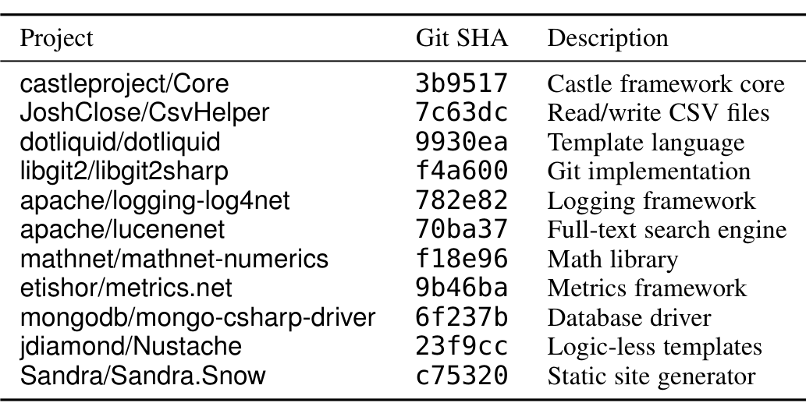

## 5 EVALUATION

this process until the remaining idioms cover no more loops. This greedy knapsack-like selection yields idioms that achieve both high coverage and are highly informative. Since variable mutability is explicitly encoded within the CASTs (as special nodes, as discussed in Section 4.3), this ranking considers variable mutability alongside the syntactic structure of each loop. Figure 1a and Figure 6 in Section 5 show example loop idioms.

Neither the prevalence nor the coverage of loop idioms is enough. Semantic idioms must also be sufficiently expressive, unlike frequent trees, that tool developers or language/API designers can read and reason about them without resorting to the concrete loops that they match and summarize. Popular idioms identify opportunities for identifying “natural” rewritings of code, those that are structurally similar and frequent enough to warrant the cost of abstracting and reusing its core. Therefore, highly ranked idioms can suggest a new language construct, a new API call or the left-hand side of a rewriting rule that implements a refactoring. For each idiom, one has to write the right-hand side of the rewriting rule. For example, loop idioms, our focus in this work, are well-suited for identifying opportunities for evolving APIs by rewriting APIs that involve complex loops, provide data-driven evidence for introducing new language constructs for the evolution of programming languages or allowing tool developers to create high-coverage refactoring tools that functionalize loops into LINQ statements. Because these rules are mined from actual usage, we refer to this process as prospecting.

In this section, we first quantify the prevalence of loop idioms, discuss examples to show the expressivity of loop idioms, then show how to use loop idioms for prospecting. We start with a case study detailing how loop idioms can be used for prospecting loop-to-LINQ rewritings: a developer wondering whether to write a refactoring engine would use loop idioms to validate the utility of embarking on the project and to prioritize the implementation of the specific refactorings. We then present two studies in which we show that loop idioms mine idioms human identified on StackOverflow with two highly requested language features in C# and LINQ. We close with a recommendation based on loop idioms: that lucenenet add an AddDocuments call that takes enumerations. All of these analyses give evidence that loop idioms can help with designing better APIs or provide data-driven arguments for introducing new language features.

### Second Corpus

To collect ASTs, we need to instrument for variable mutability and purity (Section 4.1) and thus need to be able to compile and run unit tests. From the top 500 projects, we sampled 30 projects uniformly at random. We then removed projects that we could not compile, do not have a NUnit [51] test suite or the test suite does not have any passing tests,7 or the projects cannot depend on the .NET 4.5 framework (e.g. Mono projects) that is needed for our dynamic analysis. We ended up with 11 projects (Table 3). Most of the projects are large, representing a corpus of 577kLOC, containing 34,637 runnable unit tests. We executed the test suite and retrieved variable mutability and purity information for 5,548 methods. Of course, this filtering could bias our sample, but this bias is unlikely to correlate with the properties of the idioms we mine. We base our claim that our corpus is representative and

TABLE 3: C# Projects (577kLOC) from GitHub that were used to mine loop idioms after collecting mutability and purity information by running their test suite (containing 34,637 runnable unit tests).

that our results generalize on our corpus selection process and the size of the individual benchmarks. The fact that we find generic, non-project specific, idioms suggests that our patterns generalize well. Furthermore, the included projects are projects developed by large teams and, as such, do not contain the idiosyncratic idioms of a single developer.

### 5.1 Loop Idiom Coverage

In Section 3, we established that loop patterns are prevalent. To be useful, they must cover, i.e. summarize, many concrete loops, or they provide no leverage over the concrete loops they match. To show this coverage, we build a second corpus and use it to establish that loop idioms effectively summarize many concrete loops.

#### Idiomatic Loops

Our idioms are mined from a large set of projects consisting of 577kLOCs (Table 3), which form our “training corpus”. Figure 7 shows the percent coverage achieved by the ranked list of idioms. With the first 10 idioms, 30% of the loops are covered, while with 100 idioms 62% of the loops are covered. This shows that idioms have a Pareto distribution — a core property of natural code — with a very few common idioms and a long tail of less common ones. This shows a useful property of the idioms. If a tool developer or a language or API feature designer uses the ranked list of idioms, she will be capturing the most useful loops but with diminishing returns as she goes down the list. In our case, the top 50 idioms capture about 50% of the loops, while the top 150 idioms increases the coverage only by another 20%. Therefore, our data-driven approach allows the prioritization of semantic idioms and helps to achieve the highest possible coverage with the minimum possible effort.

#### Nonidiomatic Loops

Figure 7 shows that about 22.4% of the loops are not covered by any of the idioms. Here, we perform a case study of these nonidiomatic loops. We sampled uniformly at random 100 loops that were not covered by any of the mined idioms and studied how they differed from idiomatic loops. We found that 41% of these loops were in test suites, while another 8% of the nonidiomatic loops were loops that were either automatically generated or were semi-automatically translated from other languages (e.g. Java and C). Another 13% of these loops were extremely domain-specific loops (e.g. compression algorithms, advanced math operations). The rest of the nonidiomatic loops were seemingly normal. However, we noticed they often contain rare combinations of control statements (e.g. a for with an if and another loop inside the else statement), convoluted control flow in the body of the loops or rare variable mutability. Some of these

7. This may happen when the test suite needs an external service e.g. a SQL or Redis server.