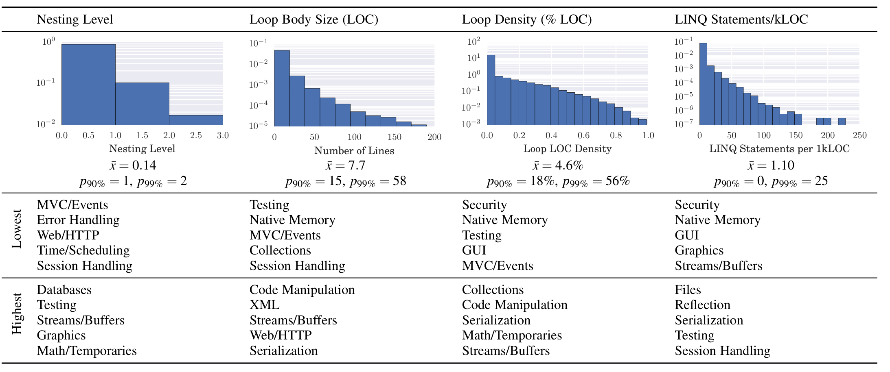
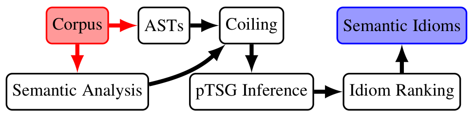

IEEE TRANSACTIONS ON SOFTWARE ENGINEERING 7

TABLE 2: Loop and LINQ statistics for the top 500 C# GitHub projects (25.4 MLOC). Top high and low topics have a statistically significant difference (p < 10−3) using a Welsh t test for the first two columns and the z test for population proportions for the other two. A full list of the topic ranking can be found in the appendix.

Fig. 3: The architecture of our semantic idiom mining system. As Section 5 demonstrates, semantic idioms enable code transformation tool developers and language designers to make data-driven decisions about which transformations to implement.

Thus, LINQ expressions are another data source on how humans think about iteration. Patterns in LINQ expressions strongly indicate patterns in semantically equivalent loops. For example, if we see a Map-Reduce LINQ statement, we should expect a similar loop idiom. But if we do not see a GroupBy-Map often in LINQ, we do not expect to see this in loops either. Figure 2 shows the probabilities of a bigram-like model of LINQ operations. The table essentially shows transition frequencies from one LINQ operator to the next. The darker the cell, the more frequent the indicated transition. The special END token denotes that no LINQ operation follows. For example, a common use of Select is to map data from a container into another container data structure; hence ToArray (19% of times) or ToList frequently follow Select. In one direction, this suggests new LINQ operators; in the other, it identifies common operations that we expect to find in loops, LINQ operations our loop idioms discover, as Section 5.1 shows.

## 4 MINING SEMANTIC IDIOMS

To mine interesting, expressive idioms in the face of data sparsity, we introduce semantic idioms. Semantic idioms improve upon syntactic idioms through a process we call coiling. Coiling is a graph transformation that augments standard ASTs with semantic information to yield coiled ASTs (CASTs). Coiling combats sparsity by (a) inferring semantic properties like variable mutability and function purity, using a novel testing-based analysis that we call property modulo testing (Section 4.1), (b) encoding these semantics properties into nodes (Section 4.2), and (c) transforming

CASTs into simpler trees through a combination of node fusion and projection (Section 4.3). Figure 3 depicts the workflow of semantic idiom mining: Given a corpus of code, we extract its ASTs and perform all semantic analyses needed to extract the relevant semantic information from code. Given this information, the corpus of ASTs is coiled into arbitrary tree structures that contain only the relevant syntactic and semantic information. The coiled corpus is then given to the idiom miner which mines the semantic idiom candidates. Finally, these candidates are ranked and presented to the tool developer or language designer.

### 4.1 Property Modulo Testing

Property modulo testing (PMT) is a novel testing technique, first presented here, that checks whether a property holds over all executions of a subject under test (SUT) over a test suite. In standard testing, each test can, and usually does, have its own test oracle that usually checks a test-specific property, which is derived from the SUT’s specification. In property modulo testing, all the tests share the same test oracle that checks a property that the SUT’s specification may not entail. PMT tests executable code fragments, like a loop, of a larger program for execution properties like variable mutability, functional purity, variable escape, aliasing [5, 55], or loop-carried dependencies. It is because these fragments are often implementation details relative to the larger program that contains them that the larger, containing program’s specification does not entail these properties.

Not all properties are amenable to PMT. It is well-suited for properties that must hold over a sufficiently large portion of program runs. “Sufficiently large” is a function of the testing resources one wishes to devote to the task of finding such a property. The intuition is that these frequent properties are hard to hide from random testing, by definition. The execution of each test can be seen as a throw of a biased coin which on one outcome (e.g. tails) reveals the SUT’s “true” nature. This describes a geometric distribution, which, in the limit, guarantees that we learn the ground truth. Of course, if the probability of revelation is small, we might need a huge number of trials. We mitigate this problem