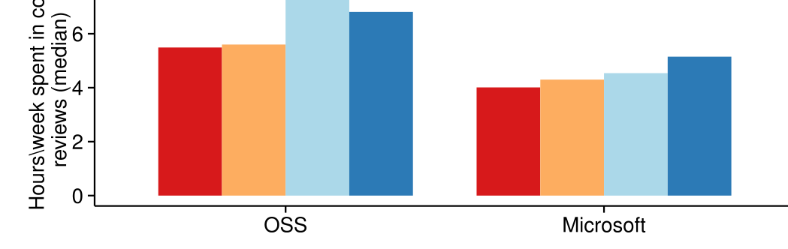
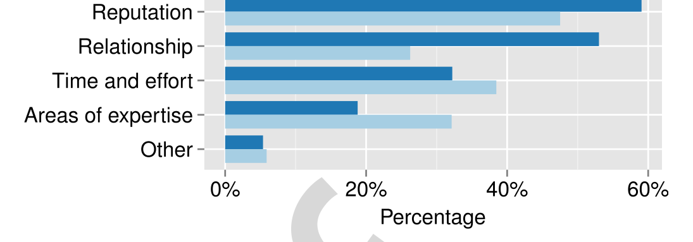

Fig. 3. Hours spent in code reviews versus Experience.

Fig. 4. Why the identity of a code author is relevant.

mentioned by both Microsoft respondents and OSS respondents, it was seen as very important in OSS projects.

> ..helps the developer feel part of the F/OSS community. It also provides a framework for participation, and allows people to voice opinions on submitted changes and feel involved. [OSS-39]

In addition, the inclusion of various stakeholders in the review process fosters collaboration among the team members.

> It enables collaborative contributions to the implementation of the system. Everyone on the team has a say on every part of the system. [MS-100]

Finally, code reviews also help developers gain a better perception of each others’ expertise and build relationships.

> Gives a sense of collaboration and camaraderie among engineers who would not typically work together (employees of competing companies, for instance). [OSS-37]

### 6.1.5 Identify Minor Errors, Typos

Developers often do not notice their own minor errors and typos. Without code reviews, identifying those minor issues may be time-consuming. In addition, developers may forget to keep comments updated, which is crucial for long term maintainability of the project. In most cases, the majority of the minor errors or typos are identified during code reviews.

> It helps catch human errors/typos. Two pairs of eyes are always better than one. [MS-182]

## 6.2 RQ2: How Much Time Is Spent in Code Reviews?

According to Q8, the median time spent in code review each week is five hours for OSS developers and four hours for Microsoft developers. Considering 40 work-hours per week, this result indicates that developers spend 10–15 percent of their time in code reviews. Moreover, OSS developers spend significantly more time in code review than Microsoft developers (Mann-Whitney U, p = 0.05).

Because a less experienced developer would be more likely to invite an experienced teammate to perform a code review, we hypothesize that experienced developers would spend more time performing code reviews. Fig. 3 shows development experience versus median hours spent in code review. Since the distribution of review hours per week significantly differs from a normal distribution, we used non-parametric ANOVA (i.e., Kruskal Wallis H), which indicates that those differences are statistically significant (OSS: χ2 = 8.16, p = 0.043; Microsoft: χ2 = 8.43, p = 0.038).

For the OSS respondents, the paid contributors spend significantly more time in code review than volunteer participants, median of five hours versus three hours (Mann-Whitney U, p < .001). This result makes sense because paid contributors often act as gatekeepers to maintain the integrity of the software by preventing buggy, unwanted, or malicious code. As a gatekeeper, the paid participant will therefore review code from many different peers and spend more time in code reviews. To support this observation, the results of Q9 indicate that paid contributors review code from significantly more peers each week than volunteers do, median of five peers versus four peers (Mann-Whitney U, p = .009).

## 6.3 RQ3: How Do Developers Decide Whether to Accept Review Request?

More than half of the OSS respondents and two-thirds of the Microsoft respondents indicated that the identity of the author was important in accepting a code review request (Q11). Fig. 4 shows the reasons why respondents found the code author’s identity important (Q7). Although the factors identified were common between the two surveys, the distribution of responses was significantly different (χ2 = 24.09, df = 4, p < .001). For example, the OSS respondents emphasized the non-technical factors (i.e., reputation and relationship), while the Microsoft respondents emphasized the technical factors (i.e., time/effort and expertise). This result reinforces the emphasis that OSS developer place on reputation and relationships found in other research [32], [41].

Conversely, the areas of expertise of the contributor and time/effort required for the review were the priority considerations for the Microsoft respondents. Discussions with developers shed some light on the reasons for this result. With respect to expertise, an experienced Microsoft developer often receives a large number of review requests. Therefore, to minimize review time, s/he is more likely to accept reviews for which s/he has expertise. In addition, since Microsoft developers must manage competing demands for their time and products have tight timelines, developers must frequently make decisions based on the time required to complete a task. Thus, the choice to participate in a code review depends heavily on the estimated time required. The following sections provide details on each factor.

### 6.3.1 Relationship with the Author

A reviewer’s relationship and history of interaction with the code author often affects the decision of whether to accept a review request. Relationship with the code author was very important particularly for the OSS developers who were