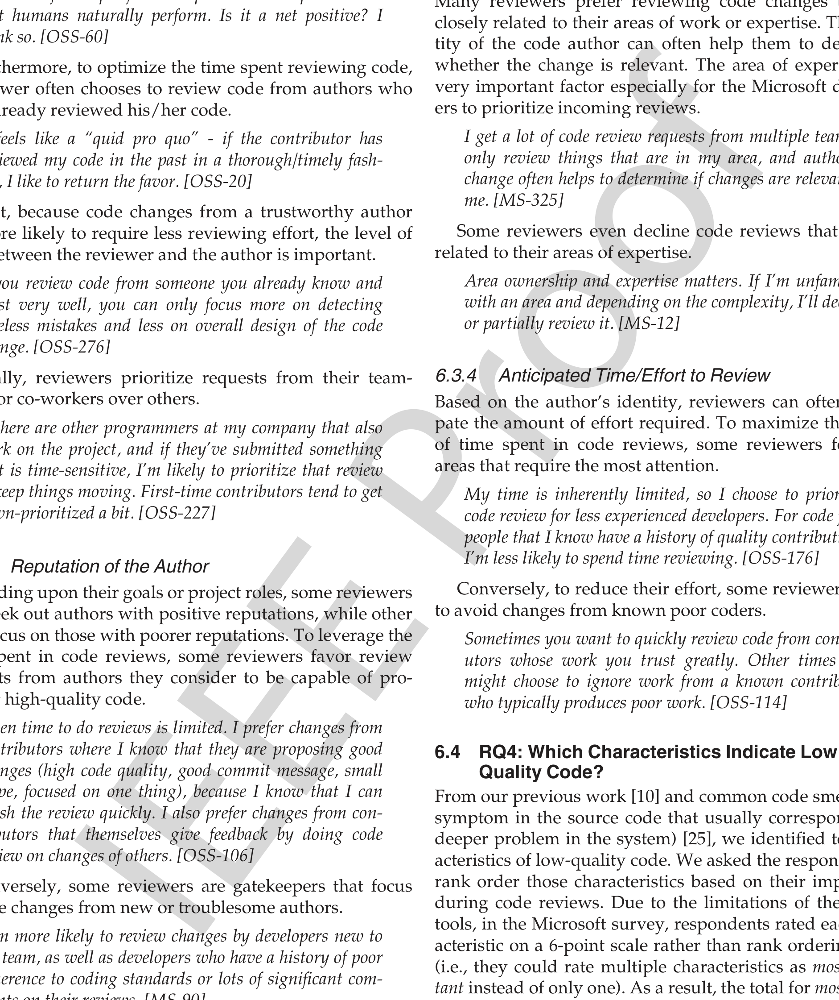

almost twice more likely than the MS developers to consider their relationship with the code authors when accepting code reviews.

> We know each other. We know each other's strengths and weaknesses and we can change the way we review to meet the needs of the specific developer. It is an optimization that humans naturally perform. Is it a net positive? I think so. [OSS-60]

Furthermore, to optimize the time spent reviewing code, a reviewer often chooses to review code from authors who have already reviewed his/her code.

> It feels like a “quid pro quo” - if the contributor has reviewed my code in the past in a thorough/timely fashion, I like to return the favor. [OSS-20]

Next, because code changes from a trustworthy author are more likely to require less reviewing effort, the level of trust between the reviewer and the author is important.

> If you review code from someone you already know and trust very well, you can only focus more on detecting careless mistakes and less on overall design of the code change. [OSS-276]

Finally, reviewers prioritize requests from their teammates or co-workers over others.

> ...there are other programmers at my company that also work on the project, and if they’ve submitted something that is time-sensitive, I’m likely to prioritize that review to keep things moving. First-time contributors tend to get down-prioritized a bit. [OSS-227]

### 6.3.2 Reputation of the Author

Depending upon their goals or project roles, some reviewers may seek out authors with positive reputations, while others may focus on those with poorer reputations. To leverage the time spent in code reviews, some reviewers favor review requests from authors they consider to be capable of producing high-quality code.

> Often time to do reviews is limited. I prefer changes from contributors where I know that they are proposing good changes (high code quality, good commit message, small scope, focused on one thing), because I know that I can finish the review quickly. I also prefer changes from contributors that themselves give feedback by doing code review on changes of others. [OSS-106]

Conversely, some reviewers are gatekeepers that focus on code changes from new or troublesome authors.

> I am more likely to review changes by developers new to the team, as well as developers who have a history of poor adherence to coding standards or lots of significant comments on their reviews. [MS-90]

Sometime the experience of the code author also influences the decision to accept or reject a review request. Developers will often accept review requests from experienced contributors expecting to learn about outstanding techniques or designs. Conversely, experts and/or code owners may be more likely to review code coming from inexperienced developers in an effort to maintain high code quality.

> Some people do stellar work, and I want to learn from them, so I review their CR to see what they did, even though I almost never find problems. [MS-319]

### 6.3.3 Area of Expertise

Many reviewers prefer reviewing code changes that are closely related to their areas of work or expertise. The identity of the code author can often help them to determine whether the change is relevant. The area of expertise is a very important factor especially for the Microsoft developers to prioritize incoming reviews.

> I get a lot of code review requests from multiple teams. I only review things that are in my area, and author of change often helps to determine if changes are relevant to me. [MS-325]

Some reviewers even decline code reviews that are not related to their areas of expertise.

> Area ownership and expertise matters. If I’m unfamiliar with an area and depending on the complexity, I’ll decline or partially review it. [MS-12]

### 6.3.4 Anticipated Time/Effort to Review

Based on the author’s identity, reviewers can often anticipate the amount of effort required. To maximize the utility of time spent in code reviews, some reviewers focus on areas that require the most attention.

> My time is inherently limited, so I choose to prioritize code review for less experienced developers. For code from people that I know have a history of quality contributions, I’m less likely to spend time reviewing. [OSS-176]

Conversely, to reduce their effort, some reviewers prefer to avoid changes from known poor coders.

> Sometimes you want to quickly review code from contributors whose work you trust greatly. Other times you might choose to ignore work from a known contributor who typically produces poor work. [OSS-114]

## 6.4 RQ4: Which Characteristics Indicate Low Quality Code?

From our previous work [10] and common code smells (any symptom in the source code that usually corresponds to a deeper problem in the system) [25], we identified ten characteristics of low-quality code. We asked the respondents to rank order those characteristics based on their importance during code reviews. Due to the limitations of the survey tools, in the Microsoft survey, respondents rated each characteristic on a 6-point scale rather than rank ordering them (i.e., they could rate multiple characteristics as most important instead of only one). As a result, the total for most important is greater than 100 percent for the Microsoft survey. However, we believe that this may not be an issue, since we are interested only in comparing the ranks of the characteristics between the two surveys. For the two surveys, we separately calculated the ranks of the characteristics using the number of top two ratings (i.e., Most important, and Second most important). Fig. 5 summarizes how the respondents rated the relative importance of each characteristic (Q17),