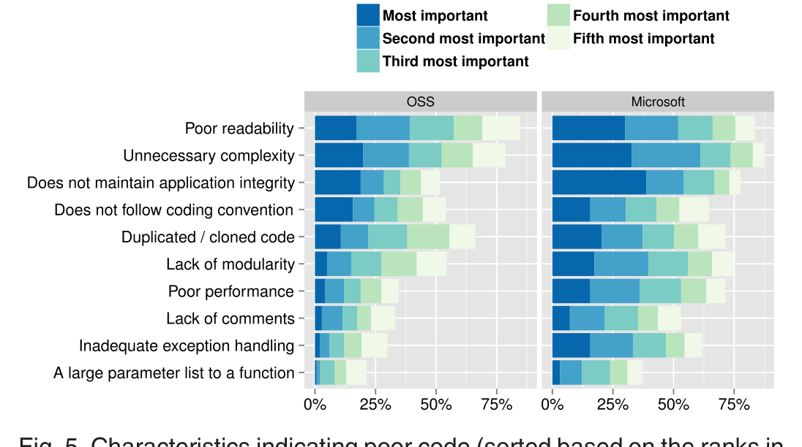
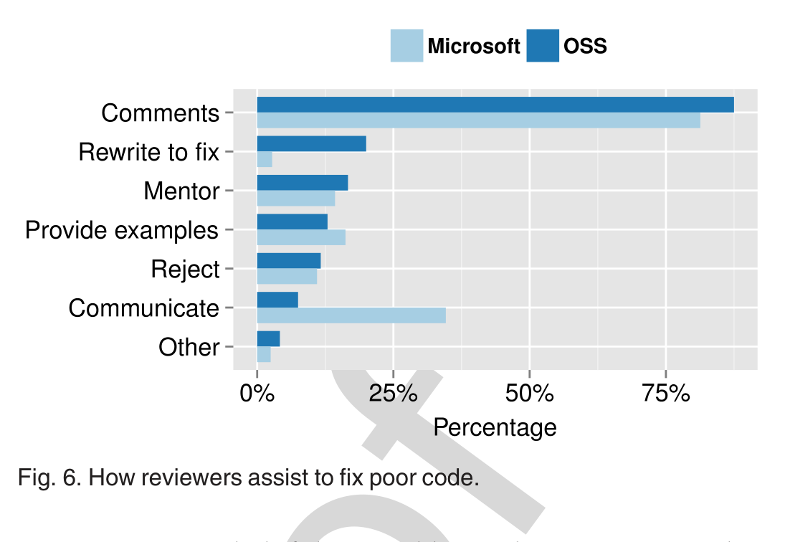

Fig. 5. Characteristics indicating poor code (sorted based on the ranks in the OSS survey).

Fig. 6. How reviewers assist to fix poor code.

where the characteristics are sorted based on their ranks in the OSS survey.

The fact that unnecessary complexity and poor readability were among the top three characteristics in each survey suggests that code which is simple (not complex) and readable is easier to review. It is interesting to note that lack of comments ranked very low (OSS: 8th and Microsoft: 9th) in both of the surveys. The combinations of these results suggest that reviewers expect code to be straightforward and self-documenting rather than requiring extensive comments to explain it. Because a reviewer has to understand the code to properly review it, a complex approach, even if well-commented, will likely take longer to review.

Does not maintain application integrity was also among the top three characteristics in both surveys. For long-term project maintenance a consistent design is very important. A feature that violates project design not only adds burden for future maintenance but also opens bugs or even vulnerabilities. Such code generally indicates either the author lacks knowledge about the project design, or the author lacks care/dedication for the project. Therefore, authors should be careful that submitted code changes maintain application design constraints.

The ranking of eight of the nine characteristics was similar for both surveys (with a difference of no more than two ranks). The exception was the characteristic: does not follow coding convention of the project (fourth in OSS and eighth in Microsoft). There are two possible explanations for this result. First, while Microsoft respondents may consider coding convention issues important, they may not judge code quality based on those problems because they are easier to fix. Second, because Microsoft developers often use automated tools to identify and fix coding convention issues, they may focus less on these issues during code review.

## 6.5 RQ5: How Do Developers Help Improve Low Quality Code?

Fig. 6 lists the approaches the respondents used to help poorly written code reach the level of quality required for inclusion in the project (Q15). The distribution of responses was significantly different between the OSS respondents and the Microsoft respondents (χ2 = 93.29; df = 6; p < .001). This difference was largely due to two factors.

First, the Microsoft respondents are more likely to communicate with the author using other channels (i.e., face-to-face, Skype, instant messenger, or email). They found those communications helpful in quickly resolving any misunderstandings. Conversely, face-to-face communication may not be an option in an OSS project. Interestingly, OSS developers could use some of the tools (e.g., Skype or other voice/video over internet technologies), but they do not.

Second, when other methods are unsuccessful, the OSS respondents are more likely to rewrite the code themselves. Because OSS participants may not be obliged to follow up, they may not make the changes required to make the code acceptable. If a code change is important, then the reviewer may choose to just fix the problem rather than waiting on the original author. Conversely, the Microsoft respondents rarely rewrite poor code themselves, for two primary reasons: 1) Microsoft developers are required to follow up, and 2) reviewers know that they have to mentor authors of low quality code to help them learn how to write better code.

### 6.5.1 Provide Comments

More than 80 percent of the respondents from each survey provide comments through the code review tool to help authors improve poorly-written code. The reviewers typically indicate specific shortcomings of the code and ask the author to fix those issues.

> For issues specific to the patch in question, or small coding style/convention issues, I'll reply to the patch with point-by-point feedback and suggestions. For major systemic issues, such as pervasive use of incorrect coding style/conventions, or fundamental architectural issues, I'll reply to the first instance of such an issue with a summary of the problems and an indication that many more exist that I didn't quote or comment on. [OSS-46]

Many reviewers provide hints or suggestions to refactor the code to make it more readable.

> I try and give syntax tips or suggest improvements (like rewriting a function to reduce complexity, pointing out where we have duplicate code and how it might be shared and suggesting to split a large function into smaller ones). [MS-403]

A few respondents also mentioned the importance of constructive criticism to avoid hurting the feelings of the code author.

> Critique the code, not the author. Describe better approaches, don't just denigrate the chosen one. Ask questions about why an approach was chosen, don't attack the