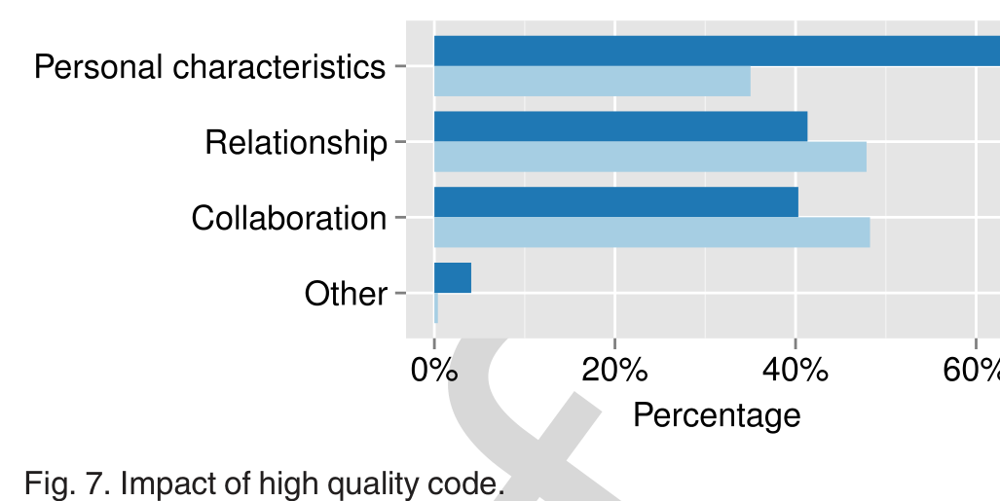

choice. Point out possible edge cases where they are overlooked. Refer directly to the coding standard where appropriate. [MS-73]

### 6.5.2 Rewrite/Fix the Code

In projects where authors are not required to respond to reviews, i.e., some OSS projects, some reviewers find it quicker to just fix the low-quality code rather than providing comments.

> ... in some circumstances I massage the code change myself and explain to the submitter why I have made the follow-up change. [OSS-276]

The reviewers do acknowledge that this practice may not be the best approach.

> Usually it boils down to rejecting it or fixing it by writing it myself. I am aware that this is not a good practice, but we're all volunteers. [OSS-154]

### 6.5.3 Provide Mentoring

In cases where the author of low-quality code lacks project or programming knowledge, mentoring may be the best approach to improve code quality.

> I try to provide design guidance to the contributor when I think it will benefit the project. I may also provide some language-specific mentoring or at least refer the contributor to relevant documentation I believe to be helpful. [OSS-71]

Another type of mentoring is to ask questions to help the author understand potential code problems.

> Ask questions such as what happens in scenarios to guide him through this understanding. If this is due to lack of understanding of fundamental technology then give pointers to bring up the knowledge. [MS-126]

### 6.5.4 Provide Examples

Some reviewers prefer providing example code or directing an author to other well-written code in the project.

> I will usually point the original author towards existing examples of code in the project to look at for reference. [OSS-58]

### 6.5.5 Reject Until Good

Some reviewers prefer to reject code changes until they meet the project quality standards.

> I do not sign off until I am convinced that the code change meets the team criteria for quality. If the author does not understand or agree with my feedback, I typically will sit down with them to discuss in detail. [MS-132]

### 6.5.6 Communicate with the Author

Over a quarter of the Microsoft respondents preferred discussing code changes via email or instant messenger rather than inside the code review tool. They found this type of communication helpful for avoiding long discussions in the code review tool and embarrassment of the author. This percentage was much higher than for the OSS respondents.

Fig. 7. Impact of high quality code.

> Sometimes, for more difficult issues, I create an email thread on the side to have a better back-and-forth discussion about the change as a whole instead of a discussion about one small part indicated in the review. If I consider the change very poorly written, I tend to keep the side-conversation more private to avoid embarrassing the author. [MS-145]

> If feasible, some Microsoft reviewers also prefer to meet the author face-to-face and discuss the issue to resolve potential misunderstandings. Usually the best option is to go to their office and see where they are coming from and whether they made oversights or were missing information. [MS-34]

## 6.6 RQ6: What Is the Impact of High Quality Code?

More than 85 percent of the respondents from each survey indicated that high quality code or use of an outstanding approach to solve a problem affects their perception of the code author (Q17). As shown in Fig. 7, the aspects of peer perceptions that are influenced by high quality code (Q18) differ significantly between OSS respondents and the Microsoft respondents (χ² = 25.81; df = 3; p < .001).

For the OSS respondents, the largest impact of high quality code is increase in positive impressions about the personal characteristics of the code author. Because of the lack of physical interaction among OSS participants, socio-technical interactions (e.g., via code reviews) become more influential in the formation of impressions about the personal characteristics of teammates [10]. The lower importance of this factor for Microsoft respondents may be because developers in industrial organizations have other methods of observing and assessing the characteristics of their peers, e.g., participating in face-to-face meetings, working in close proximity, communicating frequently, and participating in non-work social activities like lunch.

Conversely, the Microsoft respondents indicated that the largest impact of high quality code is stronger relationships and future collaborations with the code authors. Because approximately 75 percent of the code reviews at Microsoft are performed by teammates of the code author [14], the reviewers are likely already aware of the personal characteristics of an author. Instead, code reviews help the reviewers judge the intellect and coding skill of the code author. High quality code can lead to increased respect, admiration and trust.