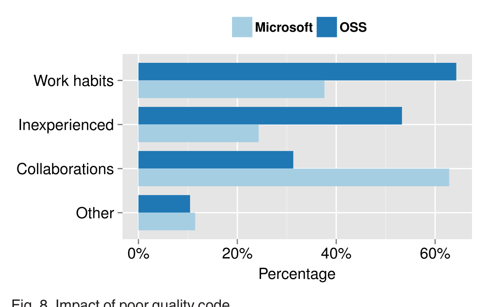

Fig. 8. Impact of poor quality code.

incompetent. They were less likely to collaborate with those authors in the future due to the expected increase in time and effort such collaborations would require.

### 6.7.1 Creates Negative Perceptions about the Work Habits

Approximately 62 percent of the OSS respondents and 38 percent of the Microsoft respondents indicated that low quality code negatively affects their perceptions about the work habits of the author. As before, Microsoft respondents were likely to find this factor less important than OSS respondents because of the many other ways that developers interact and are able to assess each other's characteristics and work habits. More specifically, reviewers consider the submission of low quality code to be a sign of the author's carelessness or lack of respect for his/her peers.

> Code that is poorly written, does not follow guidelines etc. makes a bad impression, it gives a sloppy impression, like the person writing the code does not take the time to provide the code with proper quality, yet expect it to be reviewed. Providing sloppy code is in my opinion a sign of lack of respect. [OSS-260]

Second, reviewers think that authors of low quality code were lazy or lacking dedication to the project.

> Author either didn't put enough time to investigate the task he is solving or does not have understanding of the system he is building. Either case he should have spent more time to understand what he is doing. [MS-41]

While low quality code does affect perception, reviewers realize that people do make mistakes, so they are likely to excuse the first few mistakes and begin forming a negative impression when the author is unable or unwilling to learn from previous mistakes.

> For occasionally poor code, not much effect — people have off days, or may just misunderstand the particular area of code they are modifying. But if the author continues to make similar mistakes, then that strongly degrades my opinion of their competence. [OSS-176]

Furthermore, not all the mistakes have the same impact. Reviewers are more accepting of mistakes due to lack of knowledge or understanding than they are of easily avoidable mistakes.

> It's ok if the code contains bugs and I will not think the author is careless. However if the code contains coding style, readability, duplicated code and other easily avoidable problems, I will think the author is careless and is not dedicated to the project. [OSS-197]

### 6.7.2 Suggests Inexperience

Approximately 51 percent of the OSS respondents and 24 percent of the Microsoft respondents indicated that low quality code suggests that the author is inexperienced in either the project or in programming.

> It can mean that they haven't yet reached understanding of how the code they are modifying works, and thus any contributions from them may need to be reviewed extremely carefully. [OSS-196]

Reviewers also think that the authors of low quality code may be incompetent or lacking intelligence.

> No matter what level of experience a programmer is at they can write clear, readable, robust code. Surprisingly people can go a long ways without learning to do this. It makes me question their native intelligence and dedication to the project. [OSS-25]

### 6.7.3 Impacts Future Collaborations

Approximately 62 percent of the Microsoft respondents and 27 percent of the OSS respondents indicated that the impressions formed about the authors of poorly written code affected their future collaborations. Many of the respondents doubted the abilities of the authors of poor code.

> Poorly written code usually indicates to me that the author is lacking coding experience or technical skill, which (negatively) affects how I perceive the author's general performance at work. [MS-45]

Loss of respect is another factor hampering future collaboration.

> Depending on the 'severity' of the bad code, I can feel that I lose respect for the person and their intelligence as a code author in extreme cases. For example thinking 'did they even try to build it/test it', or 'why did they think this is the right approach. It should be much simpler but they are too clueless to know'. [OSS-78]

In the extreme case, reviewers can lose trust in the author of low quality code and carefully examine future changes from that author.

> I trust the developer less, and know that I'll have to code review future changes in even greater detail. [MS-349]

Finally, because poorly written code takes longer to review, some reviewers are less likely to accept review requests from these authors.

> Poorly written changes also require more review time, so I feel that a person who consistently makes poorly written changes will waste a lot of people's time in the long run. I also end up expecting that person's changes to be poorly written and do not look forward to the prospect of reviewing the changes. [MS-166]