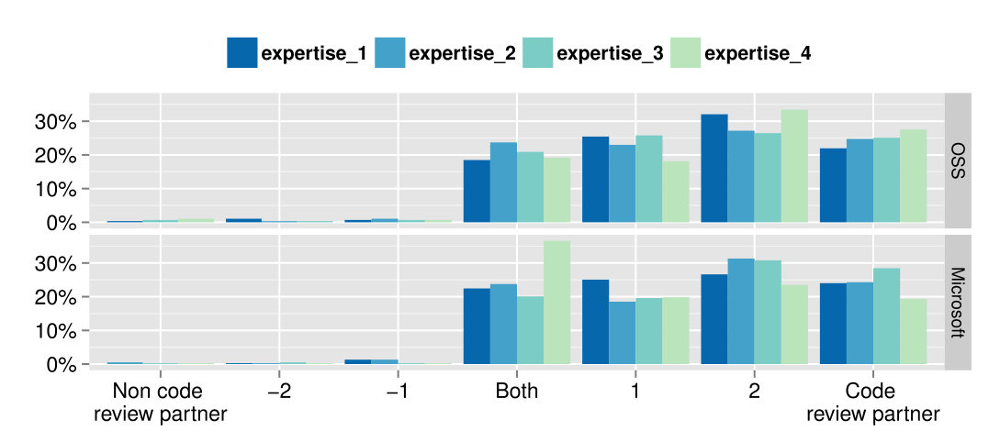

Fig. 9. Distribution of ratings for the scale items: Perception of expertise.

### TABLE 6 Behavioral Scale Means and Effects

| Construct | Scale Mean (OSS) | Scale Mean (Microsoft) | Effect Size (Cohen’s d*) (OSS) | Effect Size (Cohen’s d*) (Microsoft) |
|---|---:|---:|---:|---:|
| Trust | 0.699 | 0.843 | 0.76 | 0.93 |
| Perception of Expertise | 1.526 | 1.467 | 1.72 | 1.53 |
| Reliability | 1.023 | 1.088 | 1.11 | 1.04 |
| Friendship | 1.473 | 1.115 | 1.53 | 1.33 |

> *Cohen’s d interpretation: d ≥ .8 indicating large effect, d ≥ .5 indicating medium effect, and d ≥ .2 indicating small effect [17].

### 6.8 RQ8: What Is Code Review’s Effect on Peer Impressions?

Using behavioral scales, we focused on understanding the impact of code reviews on four aspects of peer impression formation: trust, reliability, perception of expertise, and friendship. To ease analysis and presentation of results, we recoded the scale to make the effect of the scale items on impression formation more evident. The recoded scale is: -3: describes a non-code review partner, NOT a code review partner; 0: describes both equally; and 3: describes a code review partner, NOT a non-code review partner. To avoid biasing the results with negative scale values, we did not use this scale during data collection.

As an example, Fig. 9 shows that for the four perception of expertise scale items, most of the respondents (approximately 70 to 80 percent) thought they had a better perception of the expertise of their code review partners than their non-code review partners. All four scales exhibited a similar trend.

Table 6 shows the item means for the four behavioral scale items for the two surveys. The scale means were positive and significantly higher13 than the mid-point of the scale (0 - Both Equally) in all cases. We did not observe any significant differences between the results of the two surveys for the behavioral scale questions. We also estimated effect size using Cohen’s d (rightmost two columns of Table 6). In seven out of the eight cases there were large effects. Only the trust scale in the OSS survey showed medium effect size. The results suggest that code review had overall large positive impact on building four types of peer impressions (i.e., trust, perception of expertise, friendship, and reliability) between code review participants in both OSS and Microsoft projects.

These results provide some insight into the results from RQ6 (impact of high quality code) and RQ7 (impact of poor code), which show that code reviews can have both positive and negative impacts on impression formation. This analysis shows that 1) code reviews have a large positive impact on impressions formation, and 2) the majority of the respondents had better perceptions of their code review partners than their non-code review partners.

### 7.1 Differences between OSS and Microsoft

The OSS respondents differ significantly from the Microsoft respondents in the aspects of code review emphasized as most important. The focus for OSS reviewers is on building relationships with core team members. When forming impressions of their teammates through code reviews, the OSS respondents indicated that the personal characteristics and work habits of the code author were most important. This emphasis makes sense because members of OSS teams may not have the opportunity to form impressions of their teammates through the more traditional types of interactions (i.e., face-to-face work and social interactions) that members of a commercial organization, like Microsoft, would have. As a result, code reviews become even more important for forming impressions of teammates. Conversely, the Microsoft respondents consider the knowledge dissemination aspects more important. Code reviews work as a medium to mentor new teammates about the project design, coding conventions, and available API or libraries.

Similarly, when deciding whether to accept a code review request, the most important factors for OSS respondents are their relationship with the code author and the reputation of the code author. This focus is driven by the desire to maintain current relationships and to improve relationships with reputed developers. Conversely, for Microsoft respondents, when deciding whether to accept a review, the most important factors were the expertise of the code author (i.e., if a developer writes good code that s/he can learn) and the effort required to review the change. When deciding who to invite to review their code, the most important factor was the expertise of the reviewer (i.e., whether s/he has expertise to review that code and will be able to provide useful feedback).

Other than the differences mentioned here, the results were similar for the OSS and Microsoft developers. Sections 7.2–7.5 describe results that were similar across the OSS respondents and the Microsoft respondents.

### 7.2 Benefits of Code Review

While there is empirical evidence that code review improves software quality [18], [57], the benefits of code review are much broader. Evidence about these other benefits has been mostly anecdotal. The results of these surveys begin to provide more evidence for these benefits. Nearly all survey respondents in both surveys found code reviews important for their projects for reasons including: knowledge dissemination, relationship building, better designs, and ensuring maintainable code. For large-scale and long-term projects, those benefits may be very important and hard to achieve.

## 7 DISCUSSION

This section provides further discussion on the detailed analysis of the survey results described in Section 6. In particular, this section highlights seven themes that emerged from the results.

13. one sample t-test, p < 0.001 in all cases.