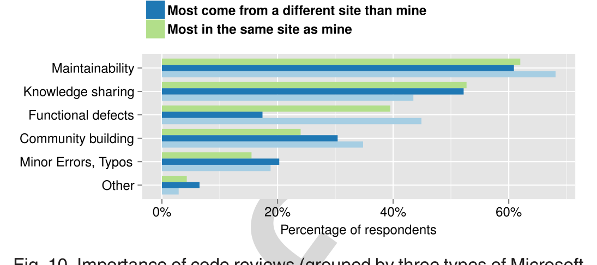

through other means. Therefore, even projects with highly-skilled developers who rarely commit low-quality changes can still benefit from the practice of code review.

### 7.3 Peer Impression Formation

One of the key non-technical benefits of code review for both OSS and MS participants is its role in impression formation, that is how developers form opinions of teammates. The results of the surveys show that the most important social factor of code reviews is in obtaining an accurate perception of the expertise of teammates. The quality of the code submitted for review is an important aspect of the formation of teammate perceptions. For example a code change that is simple, easy to understand, self documenting and requires minimum review time is highly appreciated by the reviewers and may lead to improved social status. Whether a developer is positive or negative towards a teammate may influence future code reviews. For example, respondents indicated that they perform more thorough reviews of code submitted by teammates who are untrustworthy than of code submitted by teammates they view as experts. In addition, the impressions formed during code review could also affect future collaborations, relationships, and work practices. Therefore, code review is a critical practice not only for ensuring the quality of code changes but also for forming the social underpinning of successful projects.

### 7.4 Effects on Future Collaborations

More than three-fourths of the code review participants from the both surveys had strong positive impressions about their peers, suggesting that code reviews may influence future collaborations. When a reviewer finds high quality code from an author it can increase collaborations in two ways. First, s/he is more likely to sign up to review the author's future changes in order to learn from them. Second, s/he considers the author an expert who is able to provide suggestions to improve his/her code and add the author as a reviewer for his/her changes. On the contrary, poorly written code often takes more effort to review and a reviewer may not accept future review requests from the author of poor code. Moreover, uncertainty about their level of expertise may lead a developer to avoid asking the author of poor code to review his/her code. Combining these two scenarios, a developer's code review partners are more likely those peers who s/he considers as good authors as well as experts. Conversely, the peers who s/he judged as poor code authors will become non-code review partners due to infrequent interactions.

### 7.5 Effects of Perceived Expertise

A reviewer's perception of the expertise of the code author not only influence the acceptance or rejection of code review requests but also influences the level of scrutiny for the code. First, in terms of accepting incoming code reviews (See Section 6.3), perceived expertise has mixed influence. Some respondents preferred to review code from experts to learn and to minimize time spent in reviews. Other respondents prioritized reviews from newcomers or focused on areas requiring the most attention. Both of these approaches may be correct, depending upon the expertise of the reviewer. Second, in terms of the level of scrutiny given to the code, if a reviewer is uncertain about a particular design choice,

Fig. 10. Importance of code reviews (grouped by three types of Microsoft respondents).

s/he is more likely to trust the design choice of experts and to question the rationale of non-experts. In addition, if a reviewer does not have adequate time to perform a thorough review of code from an expert author, s/he will approve that code after only a cursory review, based upon an assumption that the expert author implemented correctly, as usual. However, an author only receives this expert status after consistently submitting high-quality code changes.

### 7.6 Effects of Distributed versus Collocated Teams

One of the goals of replicating the survey with Microsoft developers was to investigate how much the distributed nature of OSS projects factored into the understanding and practice of code review. To investigate this effect, we surveyed members of distributed teams and members of collocated teams within Microsoft. We anticipated that members of distributed teams would emphasize the human relationship aspects of code review due to their limited ability to form these relationships in person (as members of collocated teams have). Interestingly, when analyzing the data from the Microsoft survey we found very little difference between the responses of developers from collocated teams and the responses of developers from distributed teams. For example, Fig. 10 shows how the three groups of Microsoft respondents considered code reviews to be important for their projects. In fact, there were much larger differences between respondents to the OSS survey and respondents to the Microsoft survey, in general (regardless of whether the respondent was on collocated team or a distributed team), as discussed in Section 7.1. Therefore, our initial hypothesis that respondents from distributed teams at Microsoft would respond similarly to respondents from OSS teams is not supported.

This surprising result suggests two possible explanations: 1) some types of impressions that are impacted by code reviews (e.g., coding ability) may not depend on face-to-face interactions, and 2) the code review process (e.g., review acceptance and future collaborations) may depend more on project culture (i.e., OSS projects have a different culture than commercial projects [28]) than on the physical location of the developers.

### 7.7 Paid versus Volunteer OSS Developers

The motivation of OSS participants may be affected by whether or not they receive financial compensation for their contributions. In addition, paid OSS participants may have different goals than volunteer OSS participants. Prior research