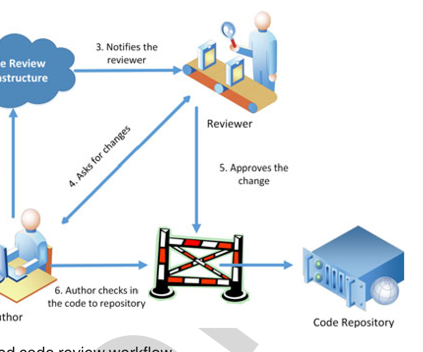

and 3) how code review impacts developers’ impressions of their peers. To gather this information, we rigorously designed and validated a survey instrument. We sent the survey to code review participants from 36 popular OSS projects and received 287 responses. We have already published the validation of the survey instruments along with partial results of the OSS survey [11].

Prior research has identified differences between the software engineering (SE) practices in OSS and commercial contexts [34], [42]. Because this prior work did not specifically address code review, we replicated the survey in a commercial context (i.e., Microsoft) to analyze whether there were any differences between OSS and a commercial organization relative to our study goal. To provide additional insight into the similarities or differences between OSS and Microsoft developers, we specifically recruited two types of survey participants from Microsoft: those that work on collocated projects and those that work on distributed projects. Because code review is an interactive process, we hypothesized that the Microsoft participants who work on distributed projects would have similar views about code as the OSS participants (whose projects are also distributed). Our Microsoft survey received 416 responses.

The primary contributions of this study are:
- A better understanding of developers’ perception about contemporary code review;
- A better understanding of why and how developers collaborate during code reviews;
- Empirical evidence regarding the perceived non-technical benefits of code reviews;
- A comparison of code review practices between OSS and Microsoft projects; and
- An illustration of the process of systematically designing and analyzing a software engineering survey.

The remainder of the paper is organized as follows. Section 2 provides a brief description of contemporary code review process and prior literature on code reviews. Section 3 defines the research questions. Section 4 describes the research method. Section 5 characterizes the study participants. Section 6 provides the results. Section 7 discusses the implications of the results. Section 8 describes the threats to validity. Finally, Section 9 provides directions for future work and concludes the paper.

## 2 BACKGROUND

This section provides a brief background and prior research on contemporary code review.

### 2.1 Contemporary Code Review Workflow

One key aspect of contemporary code review is that it is tool-based. Some popular code review tools include: Gerrit,5 Phabricator,6 and ReviewBoard.7 Fig. 1 provides a simplified overview of the contemporary code review workflow. First, the author creates a patch-set (i.e., all files added or modified in a single revision), along with a description of

Fig. 1. Simplified code review workflow.

of the changes, and submits that information to the code review tool. Then the author (or someone else) selects the reviewer(s) for the patch-set. The code review tool then notifies the reviewer(s) about the incoming review. During the review, the tools highlight the changes between revisions in a side-by-side display. The reviewers and the author can insert comments into the code. After the review, the author can address the comments and upload a new patch-set to initiate a new review iteration. This review cycle repeats until either the reviewers approve the changes or the author abandons the change. If the reviewers approve the changes, then the author commits the patch-set or asks a project committer to commit the patch-set to the project repository.

### 2.2 Overview of Contemporary Code Review Research

In recent years, there have been several studies on understanding contemporary code review practice. Rigby has published a series of studies examining informal peer code review practices in OSS projects [46], [47], [48], and comparing the review practices between commercial and open source projects [45]. To characterize the code review practices, Rigby and German proposed a set of code-review metrics (i.e., acceptance rate, reviewer characteristics, top reviewer versus top committer, review frequency, number of reviewers per patch, and patch size) [46]. Other researchers calculated similar metrics for five OSS projects and concluded that code review practices vary across OSS projects based on age and culture of the projects [1]. However, these findings were contradicted in a later study, which found that despite large differences among five OSS projects and several commercial projects, their code review metrics were largely similar [45].

After seeing the successful adoption of code review practices by OSS projects, many commercial organizations have recently adopted peer code review practices [2], [3], [44], [53]. Contrary to OSS projects, code review participants at Microsoft use both synchronous and asynchronous communication media. They also consider communications during code reviews essential for understanding code changes and design rationale. Microsoft developers expressed a need to retain code review communications for later information needs [53]. Another study at Microsoft found that although finding defects is a primary motivation for code reviews, other benefits (e.g., knowledge dissemination, team awareness, and identifying better solutions) may be more

5. https://www.gerritcodereview.com/  
6. http://phabricator.org/  
7. https://www.reviewboard.org/