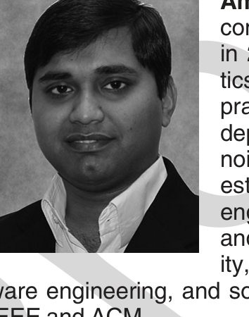

[24] B. Flyvbjerg, “Five misunderstandings about case-study research,” Qualitative Inquiry, vol. 12, no. 2, pp. 219–245, 2006.

[25] M. Fowler, Refactoring: Improving the Design of Existing Code. Boston, MA, USA: Addison-Wesley Professional, 1999.

[26] T. Gilb, D. Graham, and S. Finzi, Software Inspection. Boston, MA, USA: Addison-Wesley Longman Publishing Co., Inc., 1993.

[27] L. Harjumaa, I. Tervonen, and A. Huttunen, “Peer reviews in real life—motivators and demotivators,” in Proc. 5th Int. Conf. Quality Softw., 2005, pp. 29–36.

[28] E. v. Hippel and G. v. Krogh, “Open source software and the ‘private-collective’ innovation model: Issues for organization science,” Organ. Sci., vol. 14, no. 2, pp. 209–223, 2003.

[29] P. M. Johnson, “Reengineering inspection,” Commun. ACM, vol. 41, no. 2, pp. 49–52, 1998.

[30] C. Johnson-George and W. C. Swap, “Measurement of specific interpersonal trust: Construction and validation of a scale to assess trust in a specific other,” J. Personality Soc. Psychol., vol. 43, no. 6, pp. 1306–1317, 1982.

[31] K. Lakhani, B. Wolf, J. Bates, and C. DiBona, The Boston Consulting Group Hacker Survey. Boston, MA, USA: The Boston Consulting Group, 2002.

[32] K. Lakhani and R. G. Wolf, “Why hackers do what they do: Understanding motivation and effort in free/open source software projects,” MIT, Cambridge, Massachusetts, MA, USA, MIT Sloan Work. Paper, 2003, Paper no. 4425-03.

[33] Y. Lee, How Facebook ships code, 2011. [Online]. Available: https://framethink.wordpress.com/2011/01/17/how-facebook-ships-code/

[34] J. Lerner and J. Tirole, “Some simple economics of open source,” J. Ind. Econ., vol. 50, no. 2, pp. 197–234, 2002.

[35] C. Lewis, Z. Lin, C. Sadowski, X. Zhu, R. Ou, and E. J. Whitehead, “Does bug prediction support human developers? Findings from a Google case study,” in Proc. 2013 Int. Conf. Softw. Eng., 2013, pp. 372–381.

[36] M. S. Litwin, How to Measure Survey Reliability and Validity, vol. 7. Thousand Oaks, CA, USA: Sage Publications, 1995.

[37] D. J. McAllister, “Affect- and cognition-based trust as foundations for interpersonal cooperation in organizations,” Acad. Manage. J., vol. 38, no. 1, pp. 24–59, 1995.

[38] S. McIntosh, Y. Kamei, B. Adams, and A. E. Hassan, “The impact of code review coverage and code review participation on software quality: A case study of the qt, VTK, and ITK projects,” in Proc. 11th Work. Conf. Min. Softw. Repositories, 2014, pp. 192–201.

[39] E. Murphy-Hill, T. Zimmermann, C. Bird, and N. Nagappan, “The design space of bug fixes and how developers navigate it,” IEEE Trans. Softw. Eng., vol. 41, no. 1, pp. 65–81, Jan. 2015.

[40] A. Porter, L. G. Votta Jr, V. R. Basili, “Comparing detection methods for software requirements inspections: A replicated experiment,” IEEE Trans. Softw. Eng., vol. 21, no. 6, pp. 563–575, Jun. 1995.

[41] E. Raymond, “The cathedral and the bazaar,” Knowl. Technol. Policy, vol. 12, no. 3, pp. 23–49, 1999.

[42] E. S. Raymond, “Homesteading the Noosphere,” vol. 3, no. 10, 1998.

[43] J. K. Rempel, J. G. Holmes, and M. P. Zanna, “Trust in close relationships,” J. Personality Soc. Psychol., vol. 49, no. 1, pp. 95–112, 1985.

[44] P. Rigby, B. Cleary, F. Painchaud, M.-A. Storey, and D. German, “Contemporary peer review in action: Lessons from open source development,” IEEE Softw., vol. 29, no. 6, pp. 56–61, Nov./Dec. 2012.

[45] P. C. Rigby and C. Bird, “Convergent contemporary software peer review practices,” in Proc. 2013 9th Joint Meet. Found. Softw. Eng., 2013, pp. 202–212.

[46] P. C. Rigby and D. M. German, “A preliminary examination of code review processes in open source projects,” Univ. Victoria, Victoria BC V8P 5C2, Canada, Tech. Rep. DCS-305-IR, Jan. 2006.

[47] P. C. Rigby, D. M. German, and M.-A. Storey, “Open source software peer review practices: A case study of the Apache server,” in Proc. 30th Int. Conf. on Softw. Eng., 2008, pp. 541–550.

[48] P. C. Rigby and M.-A. Storey, “Understanding broadcast-based peer review on open source software projects,” in 2011, pp. 541–550.

[49] J. Robinson, L. Wrightsman, and F. Andrews, Measures of Personality and Social Psychological Attitudes, vol. 1. Cambridge, USA: Academic Press, 1991.

[50] D. Rombach, M. Ciolkowski, R. Jeffery, O. Laitenberger, F. McGarry, and F. Shull, “Impact of research on practice in the field of inspections, reviews and walkthroughs: Learning from successful industrial uses,” ACM SIGSOFT Softw. Eng. Notes, vol. 33, no. 6, pp. 26–35, 2008.

[51] J. B. Rotter, “A new scale for the measurement of interpersonal trust,” J. Personality, vol. 35, no. 4, pp. 651–665, 1967.

[52] S. S. Shapiro and M. B. Wilk, “An analysis of variance test for normality (complete samples),” Biometrika, vol. 52, pp. 591–611, 1965.

[53] A. Sutherland and G. Venolia, “Can peer code reviews be exploited for later information needs?” in Proc. 31st Int. Conf. Softw. Eng. – Companion, 2009, pp. 259–262.

[54] L. G. Votta, Jr., “Does every inspection need a meeting?” in Proc. 1st ACM SIGSOFT Symp. Found. Softw. Eng., 1993, pp. 107–114.

[55] J. Waldo, Code reviews, 2009. [Online]. Available: https://blogs.oracle.com/scalinggames/entry/code_reviews

[56] M. Welsh, My love affair with code reviews, 2012. [Online]. Available: http://matt-welsh.blogspot.com/2012/02/my-love-affair-with-code-reviews.html

[57] K. E. Wiegers, Peer Reviews in Software: A Practical Guide. Boston, MA, USA: Addison-Wesley, 2002.

[58] C. Wohlin, M. Höst, and K. Henningsson, “Empirical research methods in software engineering,” in Empirical Methods and Studies in Software Engineering, ser. Lecture Notes in Computer Science, R. Conradi and A. Wang, Eds. Berlin, Germany: Springer, 2003, pp. 7–23, 2765.

Amiangshu Bosu received the PhD degree in computer science from the University of Alabama in 2015 with a thesis identifying the characteristics and benefits of contemporary code review practices. He is an assistant professor in the Department of Computer Science, Southern Illinois University, Carbondale. His research interests lie in the areas of empirical software engineering, peer code review, software security, Android security, malware detection, cybersecurity, mining software repositories, empirical software engineering, and social network analysis. He is a member of the IEEE and ACM.

Jeffrey C. Carver received the PhD degree in computer science from the University of Maryland in 2003. He is an associate professor in the Department of Computer Science, University of Alabama. His main research interests include empirical software engineering, peer code review, human factors in software engineering, software quality, software engineering for science, and software process improvement. He is a Senior Member of the IEEE Computer Society and the ACM. Contact him at carver@cs.ua.edu.

Christian Bird received the bachelor’s degree from Brigham Young University and the PhD degree from U.C. Davis. He is a researcher in the Empirical Software Engineering group at Microsoft Research. He focuses on using qualitative and quantitative methods to both understand and help software teams.