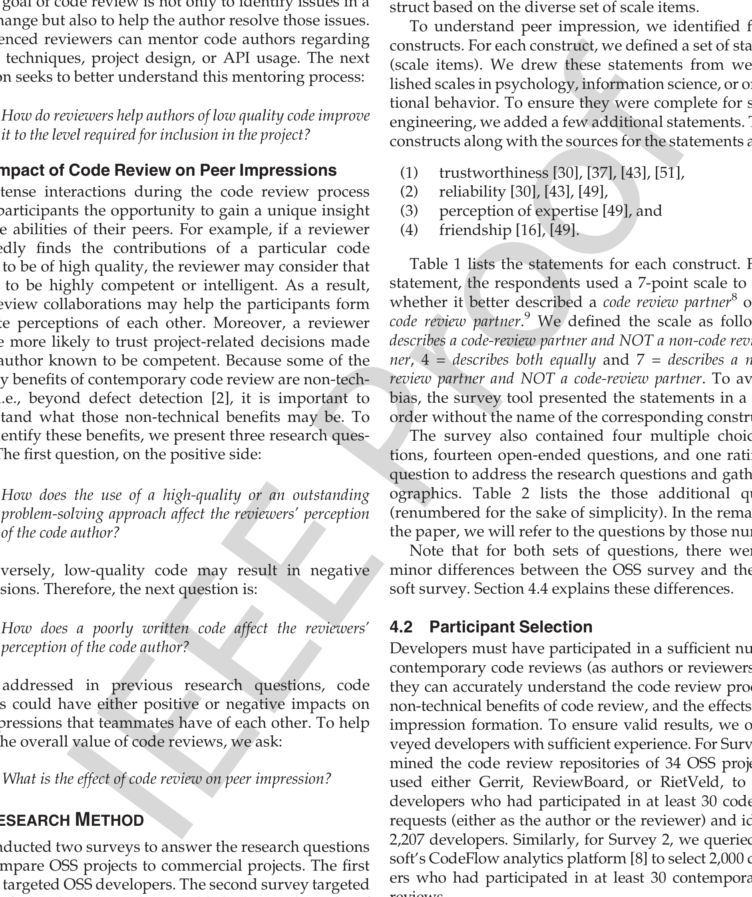

coding style on quality [14]. The next research question seeks to better understand these factors:

**RQ4:** Which code characteristics are indicative of low quality code?

The goal of code review is not only to identify issues in a code change but also to help the author resolve those issues. Experienced reviewers can mentor code authors regarding coding techniques, project design, or API usage. The next question seeks to better understand this mentoring process:

**RQ5:** How do reviewers help authors of low quality code improve it to the level required for inclusion in the project?

### 3.3 Impact of Code Review on Peer Impressions

The intense interactions during the code review process allow participants the opportunity to gain a unique insight into the abilities of their peers. For example, if a reviewer repeatedly finds the contributions of a particular code author to be of high quality, the reviewer may consider that author to be highly competent or intelligent. As a result, code review collaborations may help the participants form accurate perceptions of each other. Moreover, a reviewer may be more likely to trust project-related decisions made by an author known to be competent. Because some of the primary benefits of contemporary code review are non-technical, i.e., beyond defect detection [2], it is important to understand what those non-technical benefits may be. To help identify these benefits, we present three research questions. The first question, on the positive side:

**RQ6:** How does the use of a high-quality or an outstanding problem-solving approach affect the reviewers’ perception of the code author?

Conversely, low-quality code may result in negative impressions. Therefore, the next question is:

**RQ7:** How does a poorly written code affect the reviewers’ perception of the code author?

As addressed in previous research questions, code reviews could have either positive or negative impacts on the impressions that teammates have of each other. To help judge the overall value of code reviews, we ask:

**RQ8:** What is the effect of code review on peer impression?

## 4 RESEARCH METHOD

We conducted two surveys to answer the research questions and compare OSS projects to commercial projects. The first survey targeted OSS developers. The second survey targeted Microsoft developers. We have published partial results of the first survey [11]. The remainder of this section describes the survey design process, participant selection criteria, pilot tests, data collection, and data analysis methods.

### 4.1 Survey Design

Because our goal was to measure peer impression constructs, we followed well-regarded social and behavioral

research methods to build scales [20], [23]. In this approach, rather than directly asking the participants about each of the constructs of interest, the researchers define a number of scale items that focus on different aspects of the same underlying construct. Then, during analysis, the researchers are able to gain a more complete understanding of the construct based on the diverse set of scale items.

To understand peer impression, we identified four key constructs. For each construct, we defined a set of statements (scale items). We drew these statements from well-established scales in psychology, information science, or organizational behavior. To ensure they were complete for software engineering, we added a few additional statements. The four constructs along with the sources for the statements are:

1. trustworthiness [30], [37], [43], [51],
2. reliability [30], [43], [49],
3. perception of expertise [49], and
4. friendship [16], [49].

Table 1 lists the statements for each construct. For each statement, the respondents used a 7-point scale to indicate whether it better described a code review partner8 or a non-code review partner.9 We defined the scale as follows: 1 = describes a code-review partner and NOT a non-code-review partner, 4 = describes both equally and 7 = describes a non-code-review partner and NOT a code-review partner. To avoid any bias, the survey tool presented the statements in a random order without the name of the corresponding construct.

The survey also contained four multiple choice questions, fourteen open-ended questions, and one rating-scale question to address the research questions and gather demographics. Table 2 lists those additional questions (renumbered for the sake of simplicity). In the remainder of the paper, we will refer to the questions by those numbers.

Note that for both sets of questions, there were some minor differences between the OSS survey and the Microsoft survey. Section 4.4 explains these differences.

### 4.2 Participant Selection

Developers must have participated in a sufficient number of contemporary code reviews (as authors or reviewers) before they can accurately understand the code review process, the non-technical benefits of code review, and the effects on peer impression formation. To ensure valid results, we only surveyed developers with sufficient experience. For Survey 1, we mined the code review repositories of 34 OSS projects that used either Gerrit, ReviewBoard, or Rietveld, to identify developers who had participated in at least 30 code review requests (either as the author or the reviewer) and identified 2,207 developers. Similarly, for Survey 2, we queried Microsoft’s CodeFlow analytics platform [8] to select 2,000 developers who had participated in at least 30 contemporary code reviews.

One of the study goals was to analyze whether developers from a commercial organization behaved differently depending on whether their project was collocated or distributed. We

8. a person who reviews your code or whose code you review on a regular basis.  
9. a person who has been a peer for some time, but you have rarely reviewed their code.