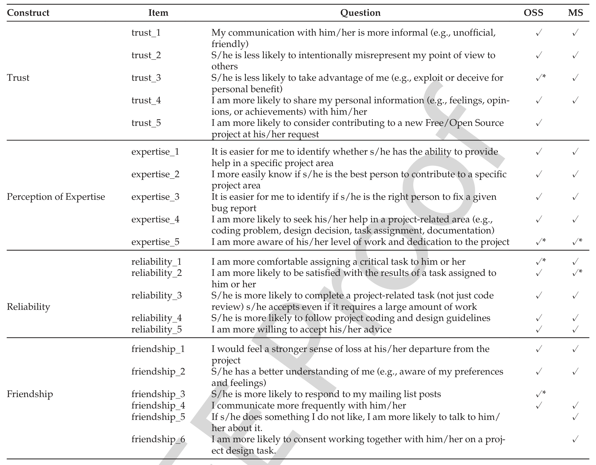

## TABLE 1
Behavioral Scale Questions

* – items dropped during analysis of that survey to improve the internal consistencies of scales.

hypothesized that commercial developers who worked on distributed projects would be more likely to behave like OSS developers (whose projects are also distributed). To test this hypothesis across all research questions, we specifically recruited Microsoft developers from two types of projects: 1) projects in which most developers are collocated, 2) projects in which most developers are distributed.

### 4.3 Pilot Tests

To ensure the comprehensibility and validity of the scale items (statements) with respect to the constructs, we conducted five pilot tests. First, researchers from Psychology, Computer Science, and Management Information Systems reviewed the questions. This review led to several changes, including: (1) increasing the rating scales from 5- to 7-point, (2) rewording some questions to remove bias, and (3) adding questions for a broader perspective of the code review process.

Second, software engineering graduate students piloted the survey to identify any difficulties in understanding the questions and to estimate the time required to complete the survey.

Third, we sent the survey to 20 OSS code review participants from two projects in our database. The completion rate of this version of the survey was low. To address this problem, we rephrased some questions, reformatted the behavioral scale questions (Table 1) so they would appear less daunting, and reordered some questions.

Fourth, we sent the improved survey to 24 OSS code review participants from another project in our database. We received enough responses to analyze the internal consistencies of the four peer impression constructs. This analysis indicated that the reliability scale had questionable internal consistency. Therefore, we added two questions to that construct.

Finally, we sent the survey to 117 OSS code review participants from 11 other projects. The completion rate was near 20 percent and the internal consistency of each construct was sufficient (Cronbach’s α > 0.7). Therefore, we

10. Chronbach’s α is widely used to calculate the internal consistency of multiple-item measurements (e.g., the behavioral scale constructs). The results of this test are interpreted as follows: α ≥ .9 → excellent, α ≥ .8 → good, α ≥ .7 → acceptable, and α < .7 → questionable.