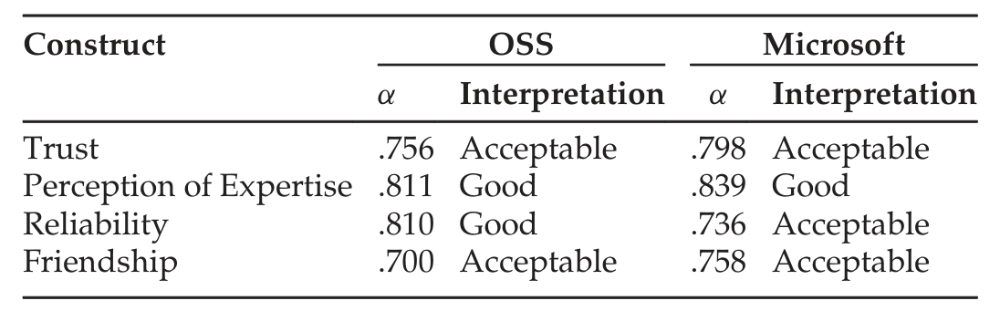
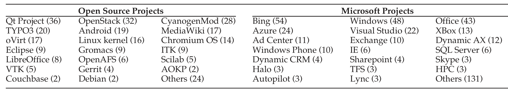

TABLE 3  
Coefficient Alpha (Cronbach’s α) of the Scales

We added two items to the friendship scale. The last two columns of Table 1 indicate exactly which items were included in each survey. In September 2013, we sent an invitation to the revised survey to 2,000 Microsoft developers who had participated in contemporary code review. After one week, we closed the survey. We received 416 responses (response rate of ≈21 percent).

### 4.5 Data Processing and Analysis

The following sections describe the data processing and analysis steps for the behavioral scale questions and the five open-ended questions.

#### 4.5.1 Behavioral Scale Questions

We analyzed three forms of validity for the survey. First, we used expert researchers from Psychology, Management, and Computer Science to review the survey question for face validity [36]. Second, we carefully chose appropriate items from prior validated scales to ensure content validity [36]. Finally, we performed a principal components analysis with VARIMAX rotation to measure the construct validity [36] of the scale items. Table 3 reports the α coefficients measures for the scales and their interpretations based on the two surveys.

This approach ensured high reliability and validity of the behavioral scales used in this study. In a prior article, we have detailed the reliability and validity measures of the survey instruments [11]. We also validated the reliability and validity of the four modified scales used in the Microsoft survey using a similar process.

#### 4.5.2 Open-Ended Questions

For the open-ended questions, we followed a systematic qualitative data analysis process. First, two analysts (Research Experience for Undergraduates (REU) students) extracted the general theme from each response to the OSS survey. Next, the first two authors worked with those analysts to develop an agreed-upon coding scheme for each question. Using these coding schemes, the two analysts independently coded the responses. After coding, they examined their results to identify any discrepancies. They discussed and resolved those discrepancies. For the Microsoft survey, the last two authors used the same process to analyze the qualitative data. For the five open-ended questions in the two surveys, we coded a total of 2,626 responses.

## 5 DEMOGRAPHICS

To provide proper context for the results, this section describes the demographics of the projects represented by the respondents and of the respondents themselves.

### 5.1 Projects Represented

Table 4 provides the results to Question Q1 (Table 2) about respondents’ primary projects. The number in parenthesis represents the number of respondents who listed that project. As an indication of the frequency of code review in these projects, approximately 83 percent of the OSS respondents and 90 percent Microsoft respondents indicated that more than 75 percent of the code changes in their projects undergo code review. Furthermore, almost two-thirds of the respondents in both surveys indicated that they submit every code change for code reviews. Therefore, the survey respondents are actively using contemporary code review.

### 5.2 Respondent Demographics

Table 5 shows the results from survey questions 2, 8 and 9. In each case, we grouped the responses into four categories by analyzing the frequency distributions of the responses. We then checked these categories to ensure they also made logical sense.

For the OSS survey, 60 percent of the respondents were paid to work on the project and 40 percent were volunteers (Q5). The percentage of paid participants is not surprising because the list of projects we drew from included some large sponsored projects (e.g., Android, Chromium OS, Qt project, and OpenStack), in which most of the participants are employees of the sponsoring companies. This distribution is slightly higher, but in the same range as previous OSS surveys that had 40–50 percent paid OSS participants [10], [31].

For the Microsoft survey, approximately 69 percent of the respondents indicated that most of the code review requests come from developers at the same site, 13 percent come from a different site, and the remainder are equally split.

## 6 RESULTS

The following sections describe the results of the two surveys. For each of the eight research questions introduced in

TABLE 4  
Respondents’ Primary Projects

