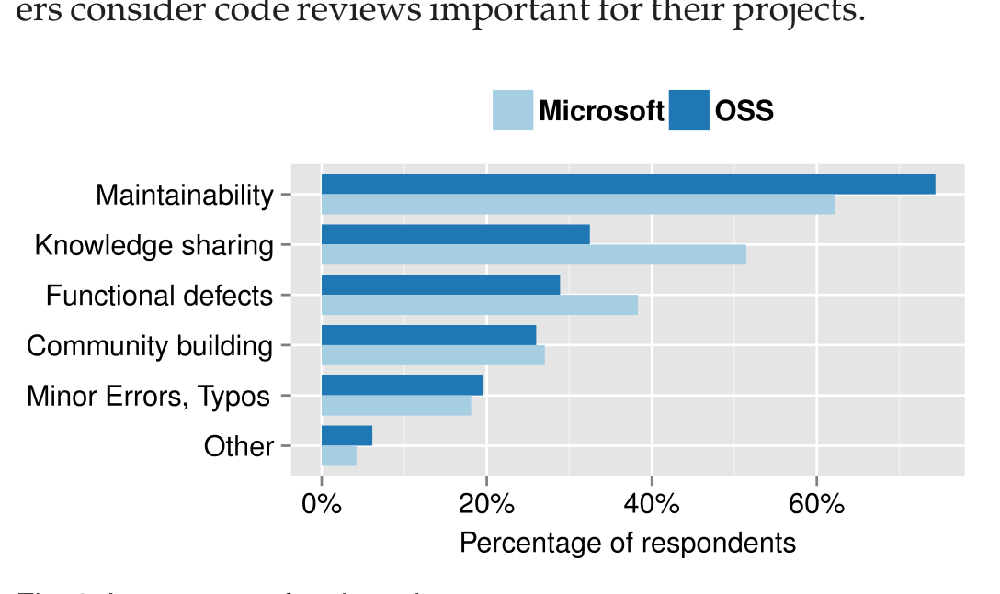

## TABLE 5 Demographics of the Respondents

| Question | Mean (OSS) | Mean (Microsoft) | Median (OSS) | Median (Microsoft) | Category description | % of Respondents (OSS) | % of Respondents (Microsoft) |
|---|---:|---:|---:|---:|---|---:|---:|
| Q2. Experience in software development | 7 years | 10.7 years | 5 years | 9 years | Low: Less than 2 years; Medium: 3 to 5 years; High: 6 to 10 years; Veteran: More than 10 years | Low: 20%; Medium: 33%; High: 26%; Veteran: 21% | Low: 8%; Medium: 19%; High: 33%; Veteran: 40% |
| Q8. Average number of hours per week spent in reviewing other contributors' code | 6.4 hours | 4.7 hours | 5 hours | 4 hours | Low: Less than 2 hours; Medium: 3 to 5 hours; High: 6 to 10 hours; Very High: More than 10 hours | Low: 30%; Medium: 32%; High: 26%; Very High: 12% | Low: 26%; Medium: 48%; High: 21%; Very High: 5% |
| Q9. Number of contributors' code reviewed each week | 6.3 peers | 5.5 peers | 5 peers | 5 peers | Small: Less than 2 peers; Medium: 3 to 5 peers; High: 6 to 10 peers; Very High: More than 10 peers | Small: 20%; Medium: 45%; High: 27%; Very High: 8% | Small: 12%; Medium: 58%; High: 25%; Very High: 5% |

Section 3, we compare the results from the OSS survey with the results from the Microsoft survey. To help clarify the results, we also include excerpts from the qualitative responses to the open-ended questions. In this section, we identify each of the respondents using a unique identifier, with OSS-XXX and MS-XXX indicating respondents from the OSS Survey and the Microsoft Survey, respectively. Unless explicitly stated, the opinions of the OSS and Microsoft respondents were similar. Therefore, the chosen quotations best represent the set of responses from both samples (OSS and Microsoft).

As a result of the coding process (Section 4.5.2), each of the open-ended questions had a large number of detailed categories. For this presentation of the results, we abstracted the detailed categories into a smaller number of high-level categories. Further analysis of the data using the more detailed categories can be found on a supplemental web site.12 In a qualitative analysis, each open-ended response could match multiple codes. Therefore, the sum of the percentages can be greater than 100 percent.

For each question, we tested the normality of the answer distribution using the Shapiro-Wilk test [52]. In cases where the distribution was non-normal, we used non-parametric statistics.

Therefore, OSS reviewers have to focus more on maintaining consistent code quality. Conversely, there is less quality variation in code from Microsoft developers. Therefore, Microsoft respondents are able to focus more on finding defects and improving project awareness during code reviews.

Microsoft developers told us that knowledge sharing is one of the primary purposes of code review. Newcomers to a team often are included on reviews so they can learn more about the codebase and how code reviews are conducted. In some cases, there is an explicit mentor–mentee relationship between an expert and a less experienced developer that is manifested in code reviews. We are unaware of a similar use for code reviews in OSS projects.

Interestingly, eliminating functional defects was only the third most important reason for code reviews in both surveys. This result is consistent with earlier findings that the other benefits of contemporary code review, i.e., knowledge transfer and identifying better solutions, may be more important than defect detection [2]. Prior research on software inspection also reported the following benefits provided by software inspections: defect identification [27], [50], knowledge sharing [15], [50], [57], increased project awareness [15], [50], and reduced development costs [26], [40]. Moreover, our prior work found that approximately half of code review comments relate to maintainability issues, with less than a quarter related to functional defects [14]. The following sections provide details on the reasons why developers consider code reviews important for their projects.

### 6.1 RQ1: Why Are Code Reviews Important?

In response to Q6, 98.6 percent of the OSS respondents and 100 percent of the Microsoft respondents considered code reviews to be important for their project. Fig. 2 shows the reasons why the respondents found code reviews to be important for code quality (Q7). Although the relative order of the responses was the same in both surveys, the distribution of answers was significantly different between the OSS respondents and the Microsoft respondents (χ² = 21.38; df = 5; p < .001).

The OSS respondents emphasized maintainability slightly more than the Microsoft respondents did. Because OSS participants come from diverse locations, backgrounds and expertise levels, the quality of submitted code can vary greatly.

12. http://carver.cs.ua.edu/Data/Journals/CodeReviewSurvey/ Fig. 2. Importance of code reviews.