# DeepMerge: Learning to Merge Programs

Elizabeth Dinella, Member, IEEE; Todd Mytkowicz, Member, IEEE; Alexey Svyatkovskiy, Member, IEEE; Christian Bird, Distinguished Scientist, IEEE; Mayur Naik, Member, IEEE; Shuvendu Lahiri, Member, IEEE

Abstract—In collaborative software development, program merging is the mechanism to integrate changes from multiple programmers. Merge algorithms in modern version control systems report a conflict when changes interfere textually. Merge conflicts require manual intervention and frequently stall modern continuous integration pipelines. Prior work found that, although costly, a large majority of resolutions involve re-arranging text without writing any new code. Inspired by this observation we propose the first data-driven approach to resolve merge conflicts with a machine learning model. We realize our approach in a tool, DeepMerge, that uses a novel combination of (i) an edit-aware embedding of merge inputs and (ii) a variation of pointer networks, to construct resolutions from input segments. We also propose an algorithm to localize manual resolutions in a resolved file and employ it to curate a ground-truth dataset comprising 8,719 non-trivial resolutions in JavaScript programs. Our evaluation shows that, on a held-out test set, DeepMerge can predict correct resolutions for 37% of non-trivial merges, compared to only 4% by a state-of-the-art semistructured merge technique. Furthermore, on the subset of merges with up to 3 lines (comprising 24% of the total dataset), DeepMerge can predict correct resolutions with 78% accuracy.

## 1 INTRODUCTION

In collaborative software development settings, version control systems such as “git” are commonplace. Such version control systems allow developers to simultaneously edit code through features called branches. Branches are a growing trend in version control as they allow developers to work in their own isolated workspace, making changes independently, and only integrating their work into the main line of development when it is complete. Integrating these changes frequently involves merging multiple copies of the source code. In fact, according to a large-scale empirical study of Java projects on GitHub [11], nearly 12% of all commits are related to a merge.

To integrate changes by multiple developers across branches, version control systems utilize merge algorithms. Textual three-way file merge (e.g., present in “git merge”) is

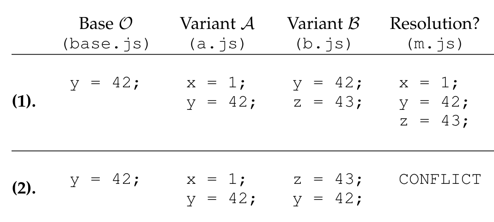

Figure 1: Two examples of unstructured merges.

the prevailing merge algorithm. As the name suggests, three-way merge takes three files as input: the common base file O, and its corresponding modified files, A and B. The algorithm either:

1. declares a “conflict” if the two changes interfere with each other, or  
2. provides a merged file M that incorporates changes made in A and B.

Under the hood, three-way merge typically employs the diff3 algorithm, which performs an unstructured (line-based) merge [27]. Intuitively, the algorithm aligns the two-way diffs of A (resp. B) over the common base O into a sequence of diff slots. At each slot, a change from either A or B is incorporated. If both programs change a common slot, a merge conflict is produced, and requires manual resolution of the conflicting modifications.

Figure 1 shows two simple code snippets to illustrate examples of three-way merge inputs and outputs. The figure shows the base program file O along with the two variants A and B. Example (1) shows a case where diff3 successfully provides a merged file M incorporating changes made in both A and B. On the other hand, Example (2) shows a case where diff3 declares a conflict because two independent changes (updates to x and z) occur in the same diff slot.

When diff3 declares a conflict, a developer must intervene. Consequently, merge conflicts are consistently ranked as one of the most taxing issues in collaborative, open-source software development, “especially for seemingly less experienced developers” [13]. Merge conflicts impact developer productivity, resulting in costly broken builds that stall the continuous integration (CI) pipelines for several hours to days. The fraction of merge conflicts as a percentage of merges range from 10% — 20% for most collaborative

- Elizabeth Dinella is with the University of Pennsylvania, Philadelphia, Pennsylvania, USA. E-mail: edinlla@seas.upenn.edu. Elizabeth Dinella performed this work while employed at Microsoft Research.  
- Todd Mytkowicz is with Microsoft Research, Redmond, Washington, USA. E-mail: toddm@microsoft.com  
- Alexey Svyatkovskiy is with Microsoft, Redmond, Washington, USA. E-mail: alsvyatk@microsoft  
- Christian Bird is with Microsoft Research, Redmond, Washington, USA. E-mail: cbird@microsoft.com  
- Mayur Naik is with the University of Pennsylvania, Philadelphia, Pennsylvania, USA. E-mail: mhnaik@cis.upenn.edu  
- Shuvendu Lahiri is with Microsoft Research, Redmond, Washington, USA. E-mail: shuvendu@microsoft.com

---

projects. In several large projects, merge conflicts account for up to 50% of merges (see [11] for details of prior studies).

Merge conflicts often arise due to the unstructured diff3 algorithm that simply checks if two changes occur in the same diff slot. For instance, the changes in Example (2), although textually conflicting, do not interfere semantically. This insight has inspired research to incorporate program structure and semantics while performing a merge. Structured merge approaches [3], [21], [32] and their variants treat merge inputs as abstract syntax trees (ASTs), and use tree-structured merge algorithms. However, such approaches still yield a conflict on merges such as Example (2) above, as they do not model program semantics and cannot safely reorder statements that have side effects. To make matters worse, the gains from structured approaches hardly transfer to dynamic languages, namely JavaScript [32], due to the absence of static types. Semantics-based approaches [37], [28] can, in theory, employ program analysis and verifiers to detect and synthesize the resolutions. However, there are no semantics-based tools for synthesizing merges for any real-world programming language, reflecting the intractable nature of the problem. Current automatic approaches fall short, suggesting that merge conflict resolution is a non-trivial problem.

This paper takes a fresh data-driven approach to the problem of resolving unstructured merge conflicts. Inspired by the abundance of data in open-source projects, the paper demonstrates how to collect a dataset of merge conflicts and resolutions.

This dataset drives the paper’s key insight: a vast majority (80%) of resolutions do not introduce new lines. Instead, they consist of (potentially rearranged) lines from the conflicting region. This observation is confirmed by a prior independent large-scale study of Java projects from GitHub [13], in which 87% of resolutions are comprised exclusively from lines in the input. In other words, a typical resolution consists of re-arranging conflicting lines without writing any new code. Our observation naturally begs the question: Are there latent patterns of rearrangement? Can these patterns be learned?

This paper investigates the potential for learning latent patterns of rearrangement. Effectively, this boils down to the question:

Can we learn to synthesize merge conflict resolutions?

Specifically, the paper frames merging as a sequence-to-sequence task akin to machine translation.

To formulate program merging as a sequence-to-sequence problem, the paper considers the text of programs A, B, and O as the input sequence, and the text of the resolved program M as the output sequence. However, this seemingly simple formulation does not come without challenges. Section 5 demonstrates an out-of-the-box sequence-to-sequence model trained on merge conflicts yields very low accuracy. In order to effectively learn a merge algorithm, one must:

1. represent merge inputs in a concise yet sufficiently expressive sequence;
2. create a mechanism to output tokens at the line granularity; and

1. We ran jdime [21] in structured mode on this example after translating the code snippet to Java.

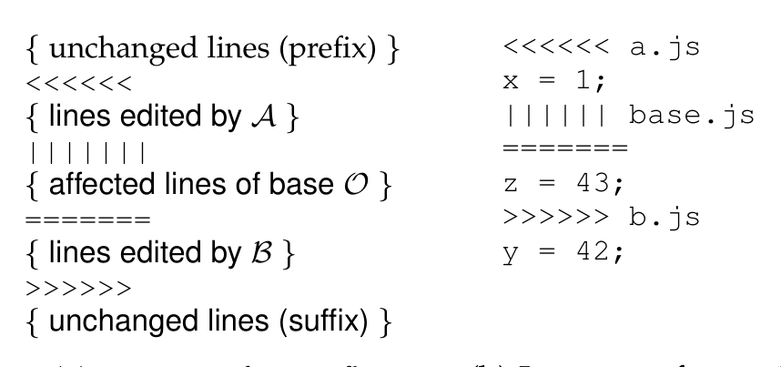

unchanged lines (suffix)

(a) Format of a conflict. (b) Instance of a conflict.

Figure 2: Conflict format and an instance reported by diff3 on Example (2) from Figure 1.

3. localize the merge conflicts and the resolutions in a given file.

To represent the input in a concise yet expressive embedding, the paper shows how to construct an edit-aware sequence to be consumed by DEEPMERGE. These edits are provided in the format of diff3, which is depicted in Figure 2(a) in the portion between markers "<<<<<<<" and ">>>>>>>". The input embedding is extracted from parsing the conflicting markers and represents A’s and B’s edits over the common base O.

To represent the output at the line granularity, DEEPMERGE’s design is a form of a pointer network [34]. As such, DEEPMERGE constructs resolutions by copying input lines, rather than learning to generate them token by token. Guided by our key insight that a large majority of resolutions are entirely comprised of lines from the input, such an output vocabulary is sufficiently expressive.

Lastly, the paper shows how to localize merge conflicts and the corresponding user resolutions in a given file. This is necessary as our approach exclusively aims to resolve locations in which diff3 has declared a conflict. As such, our algorithm only needs to generate the conflict resolution and not the entire merged file. Thus, to extract ground truth, we must localize the resolution for a given conflict in a resolved file. Localizing such a resolution region unambiguously is a non-trivial task. The presence of extraneous changes unrelated to conflict resolution makes resolution localization challenging. The paper presents the first algorithm to localize the resolution region for a conflict. This ground truth is essential for training such a deep learning model.

The paper demonstrates an instance of DEEPMERGE trained to resolve unstructured merge conflicts in JavaScript programs. Besides its popularity, JavaScript is notorious for its rich dynamic features, and lacks tooling support. Existing structured approaches struggle with JavaScript [32], providing a strong motivation for a technique suitable for dynamic languages. The paper contributes a real-world dataset of 8,719 merge tuples that require non-trivial resolutions from nearly twenty thousand repositories in GitHub. Our evaluation shows that, on a held-out test set, DEEPMERGE can predict correct resolutions for 37% of non-trivial merges. DEEPMERGE’s accuracy is a 9x improvement over a recent semi-structured approach [32], evaluated on the same dataset. Furthermore, on the subset of merges with up to 3 lines (comprising 24% of the total dataset), DEEPMERGE can predict correct resolutions with 78% accuracy.

Contributions. In summary, this paper:

---

1) is the first to define merge conflict resolution as a machine learning problem and identify a set of challenges for encoding it as a sequence-to-sequence supervised learning problem (§2).  
2) presents a data-driven merge tool DEEPMERGE that uses edit-aware embedding to represent merge inputs and a variation of pointer networks to construct the resolved program (§3).  
3) derives a real-world merge dataset for supervised learning by proposing an algorithm for localizing resolution regions (§4).  
4) performs an extensive evaluation of DEEPMERGE on merge conflicts in real-world JavaScript programs. And, demonstrates that it can correctly resolve a significant fraction of unstructured merge conflicts with high precision and 9x higher accuracy than a structured approach.

## 2 DATA-DRIVEN MERGE

We formulate program merging as a sequence-to-sequence supervised learning problem and discuss the challenges we must address in solving the resulting formulation.

### 2.1 Problem Formulation

A merge consists of a 4-tuple of programs (A, B, O, M) where A and B are both derived from a common O, and M is the developer resolved program.

A merge may consist of one or more regions. We define a merge tuple ((A, B, O), R) such that A, B, O are (sub)programs that correspond to regions in A, B, and O, respectively, and R denotes the result of merging those regions. Although we refer to (A, B, O, R) as a merge tuple, we assume that the tuples also implicitly contain the programs that they came from as additional contexts (namely A, B, O, M).

**Definition 1 (Data-driven Merge).** Given a dataset of M merge tuples,

D = {(Ai, Bi, Oi, Ri)}_{i=1}^M

a data-driven merge algorithm merge is a function that maximizes:

sum_{i=1}^M merge(Ai, Bi, Oi) = Ri

treating Boolean outcomes of the equality comparison as integer constants 1 (for true) and 0 (for false).

In other words, merge aims to maximize the number of merges from D. Rather than constraining merge to exactly satisfy all merge tuples in D, we relax the objective to maximization. A perfectly satisfying merge function may not exist in the presence of a real-world noisy dataset D. For instance, there may be (Ai, Bi, Oi, Ri) ∈ D and (Aj, Bj, Oj, Rj) ∈ D for i ≠ j, Ai = Aj, Bi = Bj, Oi = Oj but Ri ≠ Rj. In other words, two merge tuples consist of the same edits but different resolutions.

Example 1. Figure 3(a) shows a merge instance that we will use as our running example throughout. This instance is formulated in our setting as the merge tuple (A, B, O, R) depicted in Figure 3(b). R contains only lines occurring in the input. The two lines in R correspond to the first line of B and the third line of A. For this example, the R also incorporates the intents from both A and B intuitively, assuming b does not appear in the rest of the programs. □

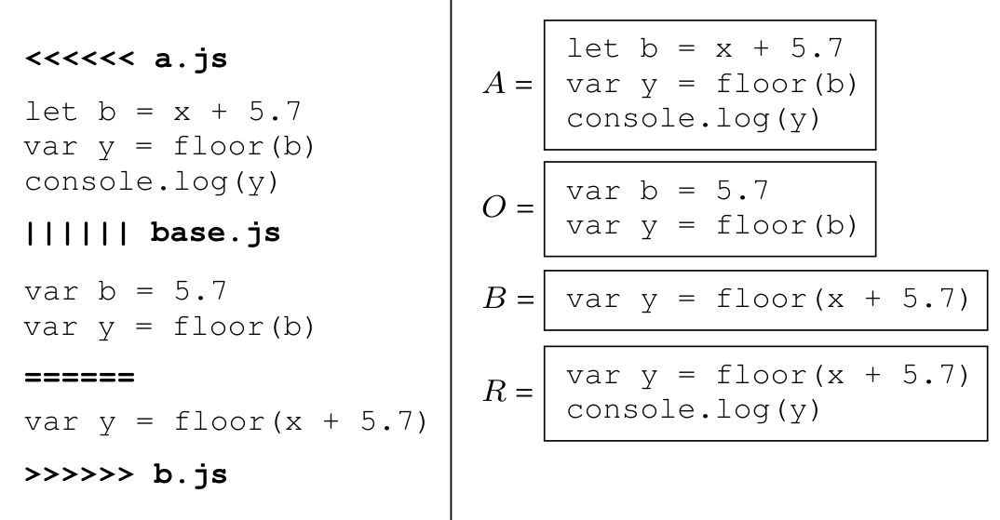

(a) A merge instance. (b) Corresponding merge tuple.

Figure 3: Formulation of a merge instance in our setting.

One possible way to learn a merge algorithm is by modeling the conditional probability

p(R | A, B, O) (1)

In other words, a model that generates the output program R given the three input programs.

Because programs are sequences, we further decompose Eq (1) by applying the chain rule [29]:

p(R | A, B, O) = ∏_{j=1}^N p(R_j | R_{<j}, A, B, O)

This models the probability of generating the j-th element of the program, given the elements generated so far. There are many possible ways to model a three-way merge. However, the above formulation suggests one obvious approach is to use a maximum likelihood estimate of a sequence-to-sequence model.

### 2.2 Challenges

Applying a sequence-to-sequence (Seq2seq) model to merge conflict resolution poses unique challenges. We discuss three key challenges, concerning input representation, output construction, and dataset extraction.

#### 2.2.1 Representing the Merge Inputs as a Sequence.

In a traditional sequence-to-sequence task such as machine translation, there is a single input sequence that maps to a single output sequence. However, in our case, we have three input sequences of varying sizes, corresponding to the three versions of a program involved in a merge conflict. It is not immediately evident how to determine a suitable token granularity and encode these sequences in a manner that is amenable to learning. One obvious solution is to concatenate the tokens of the three sequences to obtain a single sequence. However, the order of concatenation is unclear. Furthermore, as we show in Section 3.2, such a naive representation not only suffers from information loss and truncation, but also poor precision by being unaware of A and B’s edits over common base O. In summary, we have:

---

> CH1: Encode programs A, B, and O as the input to a Seq2Seq model.

### 2.2.2 Constructing the Output Resolution
Our key insight that a majority of resolutions do not introduce new lines leads us to construct the output resolution directly from lines in the conflicting region. This naturally suggests the use of pointer networks [34], an encoder-decoder architecture capable of producing outputs explicitly pointing to tokens in the input sequence. However, a pointer network formulation suggests an equivalent input and output granularity. In Section 3.2, we show that the input is best represented at a granularity far smaller than lines.

Thus, the challenge is:
> CH2: Output R at the line granularity given a non-line granularity input.

### 2.2.3 Extracting Ground Truth from Raw Merge Data
Finally, to learn a data-driven merge algorithm, we need real-world data that serves as ground truth. Creating this dataset poses non-trivial challenges. First, we need to localize the resolution region and corresponding conflicting region. In some cases, developers performing a manual merge resolution made changes unrelated to the merge. Localizing resolution regions unambiguously from input programs is challenging due to the presence of these unrelated changes. Second, we need to be able to recognize and subsequently filter merge resolutions that do not incorporate both the changes. In summary, we have:
> CH3: Identify merge tuples {(A_i, B_i, O_i, R_i)}_{i=1}^M given (A, B, O, M).

## 3 THE DEEPMERGE ARCHITECTURE
Section 2 suggested one way to learn a three-way merge is through a maximum likelihood estimate of a sequence-to-sequence model. In this section we describe DEEPMERGE, the first data-driven merge framework, and discuss how it addresses challenges CH1 and CH2. We motivate the design of DEEPMERGE by comparing it to a standard sequence-to-sequence model, the encoder-decoder architecture.

### 3.1 Encoder Decoder Architectures
Sequence-to-sequence models aim to map a fixed-length input ((X_N)_{N∈N}), to a fixed-length output, ((Y_M)_{M∈N}). The standard sequence-to-sequence model consists of three components: an input embedding, an encoder, and a decoder.

Input embedding: An embedding maps a discrete input from an input vocabulary V (x_n ∈ |V|), to a continuous D dimensional vector space representation (x_n ∈ R^D). Such a mapping is obtained by multiplication over an embedding matrix E ∈ R^{D×|V|}. Applying this for each element of X_N gives X^N.

Encoder: An encoder, encode, processes each x_n and produces a hidden state, z_n, which summarizes the sequence up to the n-th element. At each iteration, the encoder takes as input the current sequence element x_n, and the previous hidden state z_{n−1}. After processing the entire input sequence, the final hidden state, z_N, is passed to the decoder.

Note: 2. Note that M is not necessarily equal to N.

Decoder: A decoder, decode, produces the output sequence Y^M from an encoder hidden state Z_n. Similar to encoders, decoders work in an iterative fashion. At each iteration, the decoder produces a single output token y_m along with a hidden summarization state h_m. The current hidden state and the previous predicted token y_m are then used in the following iteration to produce y_{m+1} and h_{m+1}. Each y_m the model predicts is selected through a softmax over the hidden state:
p(y_m | y_1, ..., y_{m−1}, X) = softmax(h_m)

DEEPMERGE is based on this encoder-decoder architecture with two significant differences.

First, rather than a standard embedding followed by encoder, we introduce a novel embedding method called Merge2Matrix. Merge2Matrix addresses CH1 by summarizing input programs (A, B, O) into a single embedding fed to the encoder. We discuss our Merge2Matrix solution as well as less effective alternatives in Section 3.2.

Second, rather than using a standard decoder to generate output tokens in some output token vocabulary, we augment the decoder to function as a variant of pointer networks. The decoder outputs line tuples (i, W) where W ∈ {A, B} and i is the i-th line in W. We discuss this in detail in Section 3.4.

Example 2. Figure 4 illustrates the flow of DEEPMERGE as it processes the inputs of a merge tuple. First, the raw text of A, B, and O is fed to Merge2Matrix. As the name suggests, Merge2Matrix summarizes the tokenized inputs as a matrix. That matrix is then fed to an encoder which computes the encoder hidden state z_N. Along with the start token for the decoder hidden state, the decoder takes z_N and iteratively (denoted by the ···) generates as output the lines to copy from A and B. The final resolution is shown in the green box.

### 3.2 Merge2Matrix
An encoder takes a single sequence as input. As discussed in Section 2.2, a merge tuple consists of three sequences. This section introduces Merge2Matrix, an input representation that expresses the tuple as a single sequence. It consists of embedding, transformations to summarize embeddings, and finally, edit-aware alignment.

#### 3.2.1 Tokenization and Embedding
This section discusses our relatively straightforward application of both tokenization and embedding.

Tokenization. Working with textual data requires tokenization whereby we split a sequence of text into smaller units referred to as tokens. Tokens can be defined at varying granularities such as characters, words, or sub-words. These units form a vocabulary which maps input tokens to integer indices. Thus, a vocabulary is a mapping from a sequence of text to a sequence of integers. This paper uses byte-pair encoding (BPE) as it has been shown to work well with source code, where tokens can be formed by combining different words via casing conventions (e.g. snake_case or

---

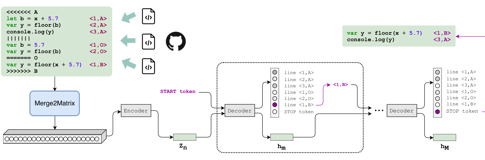

Figure 4: Overall DEEPMERGE framework. The dotted box represents repetition of decode until m = M i.e. the {STOP} token is predicted. In this example, we have omitted m = 2 in which the call to decode outputs y2 = {3, A}.

Embedding. Given an input sequence X_N, and a hyperparameter (embedding dimension) D, an embedding transformation creates X_N. As described in Section 3.1, the output of this embedding is then fed to an encoder. Because a merge tuple consists of three inputs (A, B, and O), the following sections introduce novel transformations that summarize these three inputs into a format suitable for the encoder.

### 3.2.2 Merge Tuple Summarization

In this section, we describe summarization techniques that are employed after embedding. Before we delve into details, we first introduce two functions used in summarization.

Suppose a function that concatenates embedded representations:

concat_s : (R^{D×N} × ··· × R^{D×N}) → R^{D×sN}

that takes s similarly shaped tensors as arguments and concatenates them along their last dimension. Concatenating these s embeddings increases the size of the encoder’s input by a factor of s.

Suppose a function linearize that linearly combines s embedded representations. We parameterize this function with learnable parameters θ ∈ R^{s+1}. As input, linearize takes an embedding x_i ∈ R^D for i ∈ 1..S. Thus, we define

linearize(x_1, ..., x_s) = θ_1 · x_1 + ··· + θ_s · x_s + θ_{s+1}

where all operations on the inputs x_1, ..., x_s are pointwise. linearize reduces the size of the embeddings fed to the encoder by a factor of s.

Now that we have defined two helper functions, we describe two summarization methods.

Naïve. Given a merge tuple’s inputs (A, B, O), a naïve implementation of Merge2Matrix is to simply concatenate the embedded representations (i.e., concat_3(A, B, O)). Traditional sequence-to-sequence models often suffer from information forgetting; as the input grows longer, it becomes harder for encoder to capture long-range correlations in that input. A solution that addresses CH1 must be concise while retaining the information in the input programs.

Linearized. As an attempt at a more concise representation, we introduce a summarization we call linearized. This method linearly combines each of the embeddings through our helper function: linearize_θ(A, B, O). In Section 5 we empirically demonstrate better model accuracy when we summarize with linearize_θ rather than concat_s.

### 3.2.3 Edit-Aware Alignment

In addition to input length, CH1 also alludes that an effective input representation needs to be “edit aware”. The aforementioned representations do not provide any indication that A and B are edits from O.

Prior work, Learning to Represent Edits (LTRE) [38] introduces a representation to succinctly encode two-way diffs. The method uses a standard deterministic diffing algorithm and represents the resulting pair-wise alignment as an auto-encoded fixed-dimension vector.

A two-way alignment produces an “edit sequence”. This series of edits, if applied to the second sequence, would produce the first. An edit sequence, Δ_AO, is comprised of the following editing actions: = representing equivalent tokens, + representing insertions, − representing deletions, ↔ representing a replacement. Two special tokens ∅ and | are used as a padding token and a newline marker, respectively. Note that these Δs only capture information about the kinds of edits and ignore the tokens that make up the edit itself (with the exception of the newline token). Prior to the creation of Δ, a preprocessing step adds padding tokens such that equivalent tokens in A (resp. B) and O are in the same position. These sequences, shown in Figure 5 are denoted as A′ and AO′ (resp. B′ and BO′).

Example 3. Consider B’s edit to O in Figure 5 via its preprocessed sequences B′, BO′, and its edit sequence Δ_BO. One intuitive view of Δ_BO is that it is a set of instructions that describe how to turn B′ into BO′ with the aforementioned semantics. Note the padding token ∅ introduced into Δ_BO represents padding out to the length of the longer edit sequence Δ_AO.

We now describe two edit-aware summarization methods based on this edit-aware representation. However, our setting...

---

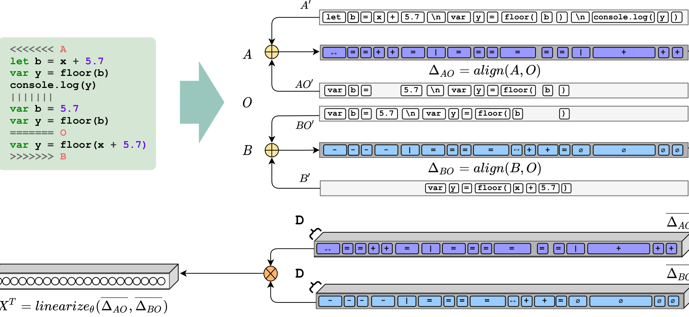

Figure 5: Merge2Matrix: implemented with the Aligned Linearized input representation used in DEEPMERGE.

differs from the original LTRE setting as we assume three input sequences and a three-way diff. In the following summarization methods, we assume that A, B, O are tokenized, but not embedded before invoking Merge2Matrix.

Aligned naïve. Given ∆AO and ∆BO, we embed each to produce ∆AO and ∆BO, respectively. Then we combine these embeddings through concatenation and thus concat2(∆AO, ∆BO) is fed to the encoder.

Aligned linearized. This summarization method is depicted in Figure 5, invoking linearize to construct an input representation over edit sequences. First, we apply alignment to create ∆AO and ∆BO. This is portrayed through the ⊕ operator. Following construction of the ∆s, we apply embedding and subsequently apply our edit-aware linearize ⊗ operation. Thus, we summarize embeddings with linearize(∆AO, ∆BO) and feed its output to the encoder. As we demonstrate in Section 5, this edit-aware input representation significantly increases the model’s accuracy.

LTRE. Finally, for completeness, we also include the original LTRE representation. We modify this to our setting by creating two 2-way diffs. The original LTRE has a second key difference from our summarization methods. LTRE includes all tokens from the input sequences in addition to the edit sequences. That is, LTRE summarizes A, A0, AO, ∆AO, B, B0, BO, and ∆BO. Let A, A0 and ∆AO (resp. B, B0, BO, and ∆BO) be the embedding of a two-way diff. Then, the following summarization combines all embeddings: concat(∆AO, A, A0, ∆BO, B, B0, BO, ∆BO).

### 3.3 The Encoder

The prior sections described Merge2Matrix which embeds a merge into a continuous space which is then summarized by an encoder. DEEPMERGE uses a bi-directional gated recurrent unit (GRU) to summarize the embedded input sequence. We empirically found that a bi-directional GRU was more effective than a uni-directional GRU.

### 3.4 Synthesizing Merge Resolutions

This section summarizes DEEPMERGE’s approach to solving CH2. Given a sequence of hidden vectors Z_N produced by an encoder, a decoder generates output sequence Y_M. We introduce an extension of a traditional decoder to copy lines of code from those input programs.

Denote the number of lines in A and B as Li_A and Li_B, respectively. Suppose that L = 1..(Li_A + Li_B); then, a value i ∈ L corresponds to the i-th line from A if i ≤ Li_A, and the (i − Li_A)-th line from B, otherwise.

Given merge inputs (A, B, O), DEEPMERGE’s decoder computes a sequence of hidden states H_M, and models the conditional probability of lines copied from the input programs A, B, and O by predicting a value y_m ∈ Y_M:

p(y_m | y_1, ..., y_{m−1}, A, B, O) = softmax(h_m)

where h_m ∈ H_M is the decoder hidden state at the m-th element of the output sequence and the argmax(y_m) yields an index into L.

In practice, we add an additional <STOP> token to L. The <STOP> token signifies that the decoder has completed the sequence. The <STOP> token is necessary as the decoder may output a variable number of lines conditioned on the inputs.

This formulation is inspired by pointer networks, an encoder-decoder architecture that outputs an index that explicitly points to an input token. Such networks are designed to solve combinatorial problems like sorting. Because the size of the output varies as a function of the input, a pointer network requires a novel attention mechanism that applies attention weights directly to the input sequence. This differs from traditional attention networks which are applied to the outputs of the encoder Z_N. In contrast, DEEPMERGE requires no change to attention. Our architecture outputs an index that points to the abstract concept of a line, rather than an explicit token in the input. Thus, attention applied to Z_N, a summarization of the input, is sufficient.

---

### 3.5 Training and Inference with DEEPMERGE

The prior sections discussed the overall model architecture of DEEPMERGE. This section describes hyperparameters that control model size and how we trained the model. We use an embedding dimension D = 1024 and 1024 hidden units in the single-layer GRU encoder. Assume the model parameters are contained in θ; training seeks to find the values of θ that maximize the log-likelihood

arg max_θ log p_θ(R | A, B, O)

over all merge tuples ((A, B, O), R) in its training dataset. We use standard cross-entropy loss with the Adam optimizer. Training takes roughly 18 hours on a NVIDIA P100 GPU and we pick the model with the highest validation accuracy, which occurred after 29 epochs.

Finally, during inference time, we augment DEEPMERGE to use standard beam search methods during decoding to produce the most likely k top merge resolutions. DEEPMERGE predicts merge resolutions up to C lines. We set C = 30 to tackle implementation constraints and because most resolutions are less than 30 lines long. However, we evaluate DEEPMERGE on a full test dataset including samples where the number of lines in M is ≥ C.

## 4 REAL-WORLD LABELED DATASET

This section describes our solution to CH3: localizing merge instances (A, B, O, R)_i from (A, B, O, M). Since a program may have several merge conflicts, we decompose the overall merge problem into merging individual instances. As shown in Figure 3, A, B, and O regions can be easily extracted given the diff3 conflict markers. However, reliably localizing a resolution R involves two sub-challenges:

1) How do we localize individual regions R unambiguously?  
2) How do we deal with trivial resolutions?

In this section, we elaborate on each of these sub-challenges and discuss our solutions. We conclude with a discussion of our final dataset and its characteristics.

Algorithm 1 denotes a method to localize merge tuples from a corpus of merge conflict and resolution files. The top-level procedure EXTRACTMERGETUPLES takes C, the diff3 conflict file with markers, along with M, the resolved file. From those inputs, it extracts merge tuples into MT. The algorithm loops over each of the conflicted regions in C, and identifies the input (A, B, O) and output (R) of the tuple using GETCONFLICTCOMPONENTS and LOCALIZERESREGION respectively. Finally, it applies a filter on the extracted tuple (lines 5–14). We explain each of these components in the next few subsections.

### 4.1 Localization of Resolution Regions

Creating a real-world merge conflict labeled dataset requires identifying the "exact" code region that constitutes a resolution. However, doing so can be challenging; Figure 6 demonstrates an example. The developer chooses to perform a resolution baz(); that does not correspond to anything from the A or B edits, and the surrounding context also undergoes changes (e.g., changing var with let which restricts the scope in the prefix). To the best of our knowledge, there is no known algorithm to localize R for such cases.

### Algorithm 1 Localizing Merge Tuples from Files for Dataset

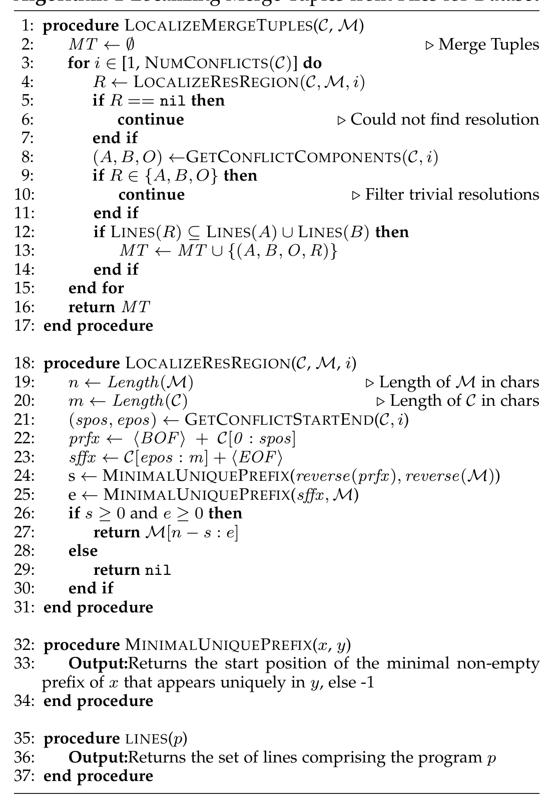

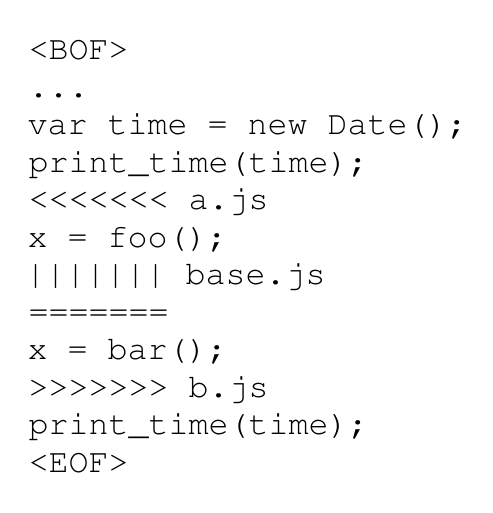

(a) A merge instance.

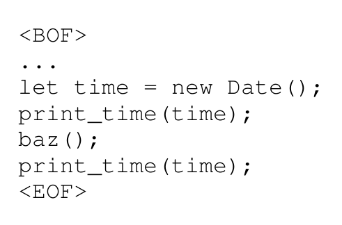

(b) Resolution.

Figure 6: Challenging example for localizing resolution.

LOCALIZERESREGION is our method that tries to localize the i-th resolution region R, or returns nil when unsuccessful. Intuitively, we find a prefix and suffix in a merge instance and use this prefix and suffix to bookend a resolution. If we cannot uniquely find those bookends, we say the resolution is ambiguous.

The method first obtains the prefix prfx (resp. suffix sffx) of the i-th conflict region in C in line 22 (resp. line 23). We add the start of file (BOF) and end of file (EOF) tokens to

---

After localizing the resolution regions, we have a set of merge instances of the form (A, B, O, R). We can use our R definition from Section 2 to label a merge tuple (A, B, O, R).

### 4.2 Filtering Trivial Resolutions

Upon examining our dataset, we found a large set of merges in which A was taken as the resolution and B was entirely ignored (or vice versa). These trivial samples, in large, were the product of running git merge with “ours” or “theirs” command-line options. Using these merge options indicates that the developer did not resolve the conflict after careful consideration of both branches, but instead relied on the git interface to completely drop one set of changes. The aforementioned command-line merge options are typically used when the commit is the first of many fix-up commits to perform the full resolution.

We appeal to the notion of a “valid merge” that tries to incorporate both the syntactic and semantic changes from both A and B. Thus, these samples are not valid as they disregard the changes from B (resp. A) entirely. Furthermore, these trivial samples comprised 70% of our “pre-filtering” dataset. Previous work confirmed our observation that a majority of merge resolutions in GitHub Java projects (75% in Table 13 [11]) correspond to taking just A or B. To avoid polluting our dataset, we filter such merges (A, B, O, R) where R ∈ {A, B, O} (line 9 in Algorithm 1). Our motivation to filter the dataset of trivial labels is based on both dataset bias and the notion of a valid merge.

### 4.3 Final Dataset

We crawled repositories in GitHub containing primarily JavaScript files, looking at merge commits. To avoid noise and bias, we select projects that were active in the past one year (at the time of writing), and received at least 100 stars (positive sentiment). We also verified that the dataset did not contain duplicate merges. We ignore minified JavaScript files that compress an entire JavaScript file to a few long lines.

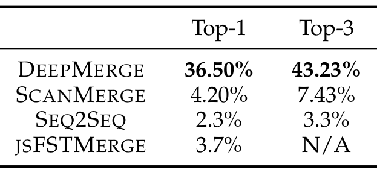

Table 1: Evaluation of DEEPMERGE and baselines: resolution synthesis accuracy (%).

few long lines. Finally, note that Algorithm 1 filters away any resolution that consists of new segments (lines) outside of A and B as our technique targets resolutions that do not involve writing any new code. After applying filters, we obtained 8,719 merge tuples. We divided these into a 80/10/10 percent training/validation/test split. Our dataset contains the following distribution in terms of total number of lines in A and B: 45.08% ([0,5]), 20.57% ([6,10]), 26.42% ([11,50]), 4.22% ([51,100]) and 3.70% (100+).

## 5 EVALUATION

In this section, we empirically evaluate DEEPMERGE to answer the following questions:

- RQ1 How effective is DEEPMERGE at synthesizing resolutions?
- RQ2 How effective is DEEPMERGE at suppressing incorrect resolutions?
- RQ3 On which samples is DEEPMERGE most effective?
- RQ4 How do different choices of input representation impact the performance of DEEPMERGE?

### 5.1 RQ1: Effectiveness of Resolution Synthesis

In this section, we perform an evaluation to assess DEEPMERGE’s effectiveness of synthesizing resolutions. Our prediction, R̂, is considered correct if it is an exact (line-for-line, token-for-token) match with R.

Evaluation metrics. DEEPMERGE produces a ranked list of predictions; we define top-1 (resp. top-3) accuracy if the R is present in first (resp. top 3) predictions. This is a lower bound, as multiple resolutions may be “correct” with respect to the semantics of the changes being merged (e.g., in some cases, switching two declarations or unrelated statements has no impact on semantics).

Quantitative Results. Table 1 shows the performance of DEEPMERGE on a held out test set. DEEPMERGE has an overall top-1 accuracy of 36.5%, correctly generating more than one in three resolutions as its first ranked choice. When we consider the top-3 ranked resolutions, DEEPMERGE achieves a slightly improved accuracy of 43.23%.

Baselines. Table 1 also includes a comparison of DEEPMERGE to three baselines. We compare to a heuristic based approach (SCANMERGE), an off-the-shelf sequence-to-sequence model (SEQ2SEQ), and a structured AST based approach (JSFSTMERGE).

Our first baseline SCANMERGE is a heuristic based approach designed by manually observing patterns in our dataset. SCANMERGE randomly samples from the space of sub-sequences over lines from A and B that are: (i) syntactically valid and parse, (ii) include each line from

---

A and B, and (iii) preserve the order of lines within A and B. These heuristic restrictions are based on manual observations that a large fraction of resolutions satisfy these conditions. Table 1 shows SCANMERGE’s performance averaged over 10 trials. DEEPMERGE performs significantly better in terms of top-1 resolution accuracy (36.50% vs 4.20%). SCANMERGE only synthesizes one in 20 resolutions correctly. In contrast, DEEPMERGE correctly predicts one in 3 resolutions. On inputs of 3 lines or less, SCANMERGE only achieves 12% accuracy suggesting that the problem space is large even for small merges.

We also compared DEEPMERGE to an out of the box sequence-to-sequence encoder-decoder model [30] (SEQ2SEQ) implemented with FAIRSEQ 3 natural language processing library. Using a naïve input (i.e., concat_3(A, B, O)), tokenized with a standard byte-pair encoding, and FAIRSEQ’s default parameters, we trained on the same dataset as DEEPMERGE. DEEPMERGE outperforms the sequence-to-sequence model in terms of both top-1 (36.5% vs. 2.3%) and top-3 accuracy (43.2% vs. 3.3%). This is perhaps not surprising given the precise notion of accuracy that does not tolerate even a single token mismatch. We therefore also considered a more relaxed measure, the BLEU-4 score [26], a metric that compares two sentences for “closeness” using an n-gram model. The sequence-to-sequence model achieves a respectable score of 27%, however DEEPMERGE still outperforms with a BLEU-4 score of 50%. This demonstrates that our novel embedding of the merge inputs and pointer network style output technique aid DEEPMERGE significantly and outperform a state of the art sequence-to-sequence baseline model.

Lastly, we compared DEEPMERGE to JSFSTMERGE [32], a recent semistructured AST based approach. JSFSTMERGE leverages syntactic information by representing input programs as ASTs. With this format, algorithms are invoked to safely merge nodes and subtrees. Structured approaches do not model semantics and can only safely merge program elements that do not have side effects. Structured approaches have been proven to work well for statically typed languages such as Java [3], [21]. However, the benefits of semistructured merge hardly translate to dynamic languages such as JavaScript. JavaScript provides less static information than Java and allows statements (with potential side effects) at the same syntactic level as commutative elements such as function declarations.

As a baseline to compare to DEEPMERGE, we ran JSFSTMERGE with a timeout of 5 minutes. Since JSFSTMERGE is a semistructured approach we apply a looser evaluation metric. A resolution is considered correct if it is an exact syntactic match with R or if it is semantically equivalent. We determine semantic equivalence manually. JSFSTMERGE produces a correct resolution on 3.7% of samples which is significantly lower than DEEPMERGE. Furthermore, JSFSTMERGE does not have support for predicting Top-k resolutions and only outputs a single resolution. The remaining 96.3% of cases failed as follows. In 92.1% of samples, JSFSTMERGE was not able to produce a resolution and reported a conflict. In 3.3% of samples, JSFSTMERGE took greater than 5 minutes to execute and was terminated. In the remaining 0.8% JSFSTMERGE

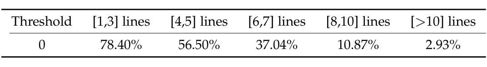

Table 2: Evaluation of DEEPMERGE: accuracy vs input size (%).

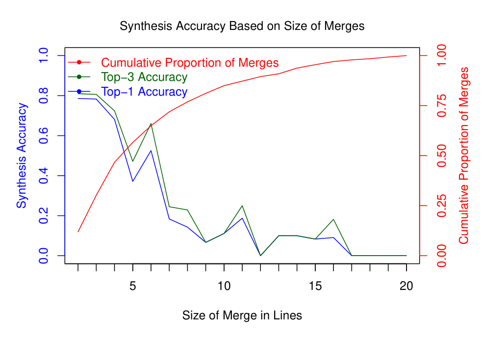

Figure 7: DEEPMERGE’s performance vs merge input size. Cumulative distribution of merge sizes in red.

produced a resolution that was both syntactically and semantically different than the user’s resolution. In addition to effectiveness, DEEPMERGE is superior to JSFSTMERGE in terms of execution time. Performing inference with deep neural approaches is much quicker than (semi) structured approaches. In our experiments, JSFSTMERGE had an average execution time of 18 seconds per sample. In contrast, sequence-to-sequence models such as DEEPMERGE perform inference in under a second.

### Sensitivity to Input Merge Conflict Size

We observe that there is a diverse range in the size of merge conflicts (lines in A plus lines in B). However, as shown in Figure 7, most (58% of our test set) merges are small, consisting of 7 or less lines. As a product of the dataset distribution and problem space size, DEEPMERGE performs better for smaller merges. We present aggregate Top-1 accuracy for the input ranges in Table 2. DEEPMERGE achieves over 78% synthesis accuracy on merge inputs consisting of 3 lines or less. On merge inputs consisting of 7 lines or less (58% of our test set) DEEPMERGE achieves over 61% synthesis accuracy.

## 5.2 RQ2: Effectiveness of Suppressing Incorrect Resolutions

The probabilistic nature of DEEPMERGE allows for accommodating a spectrum of users with different tolerance for incorrect suggestions. “Confidence” metrics can be associated with each output sequence to suppress unlikely suggestions. In this section, we study the effectiveness of DEEPMERGE’s confidence intervals.

In the scenario where DEEPMERGE cannot confidently synthesize a resolution, it declares a conflict and remains silent without reporting a resolution. This enables DEEPMERGE to provide a higher percentage of correct resolutions (higher precision) at the cost of not providing a resolution for every merge (lower recall). This is critical for practical

---

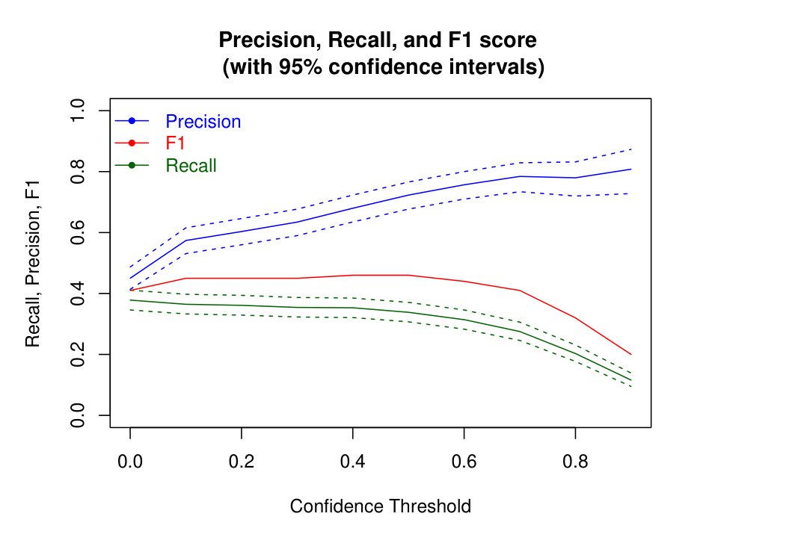

Figure 8: Top-1 precision and recall by confidence threshold.

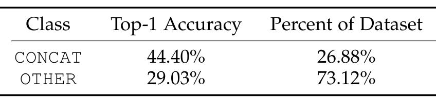

Table 3: Accuracy and Distribution of classes.

use, as prior work has shown that tools with a high false positive rate are unlikely to be used by developers [17]. Figure 8 depicts the precision, recall, and F1 score values for various confidence thresholds (with 95% confidence intervals). We aim to find a threshold that achieves high precision without sacrificing too much recall. In Figure 8, the highest F1-Score of 0.46 is achieved at 0.4 and 0.5. At a threshold of 0.5, DEEPMERGE’s top-1 precision is 0.72 with a recall of 0.34. Thus, while DEEPMERGE only produces a resolution one third of the time, that resolution is correct three out of four times. Compared to DEEPMERGE with no thresholding, at a threshold of .5 DEEPMERGE achieves a 2x improvement in precision while only sacrificing a 10% drop in recall. Thresholds of 0.4 and 0.5 were identified as best performing on a held-out validation set. We then confirmed that these thresholds were optimal on the held-out test set reported in Figure 8.

### 5.3 RQ3: Categorical Analysis of Effectiveness

We now provide an analysis of DEEPMERGE’s performance. To understand which samples DEEPMERGE is most effective at resolving, we classify the dataset into two classes: CONCAT and OTHER. The classes are defined as follows:

1. CONCAT - resolutions of the form AB or BA. Specifically:
   - R contains all lines in A and all lines in B.
   - There is no interleaving between A’s lines and B’s lines.
   - The order of lines within A and B is preserved.

2. OTHER - resolutions not classified as CONCAT. OTHER samples can be any interleaving of any subset of lines.

Table 3 shows the performance of DEEPMERGE on each class. DEEPMERGE performs comparably well on each category, suggesting that DEEPMERGE is effective at resolving conflicts beyond concatenation.

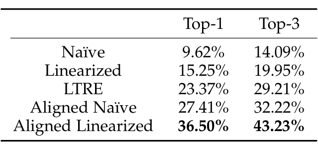

Table 4: Accuracy of different input representation choices.

### 5.4 RQ4: Impact of Input Representation

We now evaluate the use of Merge2Matrix and show the benefit of the Aligned Linearized implementation used in DEEPMERGE.

We evaluate DEEPMERGE on each combination of summarization and edit-aware alignment described in Section 3.2: Naïve, Linearized, LTRE, Aligned naïve, and Aligned Linearized. Table 4 shows the performance of each input representation on detection and synthesis. The edit-aware input formats: LTRE, Aligned Naïve, and Aligned Linearized attain an improvement over the edit-unaware formats. Our Aligned representations are more succinct and contribute to a large increase in accuracy over the edit-unaware formats. Aligned Naïve increases accuracy over our best edit-unaware format by 12.16% for top-1 and 12.27% for top-3. We believe this is due to the verbosity of including the underlying tokens as well as the Δ edit sequence. The combination of our edit-aware and summarization insights (Aligned Linearized) yields the highest accuracy.

### 5.5 Summary of Results

Our evaluation and baselines indicate that the problem of synthesizing resolutions is a non-trivial task, even when restricted to resolutions that rearrange lines from the conflict. DEEPMERGE not only can synthesize resolutions for more than a third of times, but can also use its internal confidence to achieve high precision (72%). DEEPMERGE can synthesize resolutions significantly more accurately than heuristic-based, neural, and structured approaches. We also illustrate the need for edit-aware aligned encoding of merge inputs to help deep learning be more effective synthesizing non-trivial resolutions.

## 6 RELATED WORK

Our technique is related to several existing works in both program merging and deep learning for code.

### 6.1 Source Code Merging

The most widely used method for merging changes is diff3, the default for most version control systems. One reason for its popularity is that diff3 is purely text based and therefore language agnostic. However, its behavior has been formalized and Khanna et al. showed that the trust developers have in it may be misplaced [20], including the examples in Figure 1.

There have been many attempts to improve merge algorithms by taking language specific analyses into account (see the work of Mens for a broad survey [23]). Westfechtel et al. use the structure of the source code to reduce merge

---

### 6.2 Deep Learning on Source Code

Conflicts [36]. Apel et al. noted that structured and unstructured merge each has strengths and weaknesses. They developed JSFSTMERGE, a semi-structured merge, that alternates between approaches [4]. They later introduced JDIME, an approach that automatically tunes a mixture of structured and unstructured merge based on conflict locations [2]. Sousa et al. introduced a verification approach, SAFEMERGE, that examines the base program, both changed programs, and the merge resolution to verify that the resolution preserves semantic conflict freedom [28].

The key difference between DEEPMERGE and these structured or semi-structured merge approaches is that they require a priori knowledge of the language of the merged code in the form of a parser or annotated grammar (or more advanced program verification tools). Further, structured merge tools cannot conservatively merge changes made within method bodies. Finally, Pan et al. [24] explore the use of program synthesis for learning repeated resolutions in a large project. The approach requires the design of a domain-specific languages inspired by a small class of resolutions (around imports and macros in C++). In contrast to both these approaches, DEEPMERGE only requires a corpus of merge resolutions in the target language, and can apply to all merge conflicts. However, we believe that both these approaches are complementary and can be incorporated into DEEPMERGE.

We leverage deep neural network based natural language processing methods to address the challenge of three-way merge resolution. We discuss related works in sequence-to-sequence learning that inspired our model and applications of deep learning for the software engineering domain.

Pointer networks [34] use attention to constrain general sequence-to-sequence models [30], [6]. Recent works incorporate a copy mechanism in sequence-to-sequence models by combining copying and token generation [14], adding a copying module in the decoder [39], and incorporating it into the beam search [25]. In contrast to DEEPMERGE, none of these approaches address the challenges described in Section 2 in a three-way merge.

Deep learning has been successfully used on source code to improve myriad software engineering tasks. These include code completion and code generation [31], [8], code search [15], software testing [12], defect prediction [35], and code summarization [1]. Deep learning has been used in program repair using neural machine translation [33], [5], sequence-editing approaches [25], and learning graph transformations [9]. For a deeper review of deep learning methods applied to software engineering tasks, see the literature reviews [22], [10].

While neural sequence-to-sequence models are utilized in most of those applications, they consume only one input sequence, mapping it to a single output sequence. Edit-aware embeddings [38] introduced LTRE method to encode two program variants to model source code edits. As we demonstrate, our edit-aware encoding Aligned Linearized is inspired by this approach but significantly outperforms LTRE in the context of data-driven merge.

## 7 CONCLUSION

We motivated the problem of data-driven merge and highlighted the main challenges in applying machine learning. We proposed DEEPMERGE, a data-driven merge framework, and demonstrated its effectiveness in resolving unstructured merge conflicts in JavaScript. We chose JavaScript as the language of focus in this paper due to its importance and growing popularity and the fact that analysis of JavaScript is challenging due at least in part to its weak, dynamic type system and permissive nature [16], [19]. We believe that DEEPMERGE can be easily extended to other languages and perhaps to any list-structured data format such as JSON and configuration files. We plan to combine program analysis techniques (e.g., parsing, typechecking, or static verifiers for merges) to prune the space of resolutions, and combine structured merge algorithms with machine learning to gain the best of both techniques. Furthermore, we plan to generalize our approach beyond line level output granularity.

## REFERENCES

[1] U. Alon, O. Levy, and E. Yahav. code2seq: Generating sequences from structured representations of code. In International Conference on Learning Representations, 2019.

[2] S. Apel, O. Leßenich, and C. Lengauer. Structured merge with auto-tuning: balancing precision and performance. In Proceedings of the 27th IEEE/ACM International Conference on Automated Software Engineering, pages 120–129, 2012.

[3] S. Apel, J. Liebig, B. Brandl, C. Lengauer, and C. Kästner. Semistructured merge: Rethinking merge in revision control systems. In ACM SIGSOFT Symposium on Foundations of Software Engineering, pages 190–200, 2011.

[4] S. Apel, J. Liebig, C. Lengauer, C. Kästner, and W. R. Cook. Semistructured merge in revision control systems. In VaMoS, pages 13–19, 2010.

[5] S. Chakraborty, M. Allamanis, and B. Ray. Tree2tree neural translation model for learning source code changes. CoRR, abs/1810.00314, 2018.

[6] K. Cho, B. van Merriënboer, C. Gulcehre, D. Bahdanau, F. Bougares, H. Schwenk, and Y. Bengio. Learning phrase representations using RNN encoder–decoder for statistical machine translation. In Proceedings of the 2014 Conference on Empirical Methods in Natural Language Processing (EMNLP), pages 1724–1734, Doha, Qatar, Oct. 2014. Association for Computational Linguistics.

[7] K. Cho, B. van Merrienboer, C. Gulcehre, D. Bahdanau, F. Bougares, H. Schwenk, and Y. Bengio. Learning phrase representations using rnn encoder-decoder for statistical machine translation, 2014.

[8] C. Clement, D. Drain, J. Timcheck, A. Svyatkovskiy, and N. Sundaresan. Pymt5: Multi-mode translation of natural language and python code with transformers. In Proceedings of the 2020 Conference on Empirical Methods in Natural Language Processing (EMNLP), pages 9052–9065, 2020.

[9] E. Dinella, H. Dai, Z. Li, M. Naik, L. Song, and K. Wang. Hoppity: Learning graph transformations to detect and fix bugs in programs. In International Conference on Learning Representations, 2020.

[10] F. Ferreira, L. L. Silva, and M. T. Valente. Software engineering meets deep learning: A literature review. arXiv preprint arXiv:1909.11436, 2019.

[11] G. Ghiotto, L. Murta, M. de Oliveira Barros, and A. van der Hoek. On the nature of merge conflicts: A study of 2,731 open source java projects hosted by github. IEEE Trans. Software Eng., 46(8):892–915, 2020.

[12] P. Godefroid, H. Peleg, and R. Singh. Learn&fuzz: Machine learning for input fuzzing. In 2017 32nd IEEE/ACM International Conference on Automated Software Engineering (ASE), pages 50–59. IEEE, 2017.

[13] G. Gousios, M. D. Storey, and A. Bacchelli. Work practices and challenges in pull-based development: the contributor’s perspective. In Proceedings of the 38th International Conference on Software Engineering, ICSE 2016, Austin, TX, USA, May 14-22, 2016, pages 285–296. ACM, 2016.

---

[14] J. Gu, Z. Lu, H. Li, and V. O. Li. Incorporating copying mechanism in sequence-to-sequence learning. In Proceedings of the 54th Annual Meeting of the Association for Computational Linguistics (Volume 1: Long Papers), pages 1631–1640, Berlin, Germany, Aug. 2016. Association for Computational Linguistics.

[15] X. Gu, H. Zhang, and S. Kim. Deep code search. In Proceedings of the 40th International Conference on Software Engineering, ICSE ’18, pages 933–944, New York, NY, USA, 2018. Association for Computing Machinery.

[16] S. H. Jensen, A. Møller, and P. Thiemann. Type analysis for JavaScript. In International Static Analysis Symposium, pages 238–255. Springer, 2009.

[17] B. Johnson, Y. Song, E. Murphy-Hill, and R. Bowdidge. Why don’t software developers use static analysis tools to find bugs? In 2013 35th International Conference on Software Engineering (ICSE), pages 672–681. IEEE, 2013.

[18] R.-M. Karampatsis, H. Babii, R. Robbes, C. Sutton, and A. Janes. Big code != big vocabulary: Open-vocabulary models for source code. In Proceedings of the ACM/IEEE 42nd International Conference on Software Engineering, ICSE ’20, pages 1073–1085, New York, NY, USA, 2020. Association for Computing Machinery.

[19] V. Kashyap, K. Dewey, E. A. Kuefner, J. Wagner, K. Gibbons, J. Sarracino, B. Wiedermann, and B. Hardekopf. Jsai: a static analysis platform for JavaScript. In Proceedings of the 22nd ACM SIGSOFT international symposium on Foundations of Software Engineering, pages 121–132, 2014.

[20] S. Khanna, K. Kunal, and B. C. Pierce. A formal investigation of diff3. In International Conference on Foundations of Software Technology and Theoretical Computer Science, pages 485–496. Springer, 2007.

[21] O. Leßenich, S. Apel, and C. Lengauer. Balancing precision and performance in structured merge. Automated Software Engineering, 22(3):367–397, 2015.

[22] X. Li, H. Jiang, Z. Ren, G. Li, and J. Zhang. Deep learning in software engineering. arXiv preprint arXiv:1805.04825, 2018.

[23] T. Mens. A state-of-the-art survey on software merging. IEEE Transactions on Software Engineering, 28(5):449–462, 2002.

[24] R. Pan, V. Le, N. Nagappan, S. Gulwani, S. K. Lahiri, and M. Kaufman. Can program synthesis be used to learn merge conflict resolutions? An empirical analysis. In 43rd IEEE/ACM International Conference on Software Engineering, ICSE 2021, Madrid, Spain, 22–30 May 2021, pages 785–796. IEEE, 2021.

[25] S. Panthaplackel, M. Allamanis, and M. Brockschmidt. Copy that! Editing sequences by copying spans, 2020.

[26] K. Papineni, S. Roukos, T. Ward, and W.-J. Zhu. BLEU: a method for automatic evaluation of machine translation. In Proceedings of the 40th annual meeting of the Association for Computational Linguistics, pages 311–318, 2002.

[27] R. Smith. Gnu diff3. Distributed with GNU diffutils package, April 1998.

[28] M. Sousa, I. Dillig, and S. K. Lahiri. Verified three-way program merge. Proc. ACM Program. Lang., 2:165:1–165:29, 2018.

[29] I. Sutskever, O. Vinyals, and Q. V. Le. Sequence to sequence learning with neural networks. In Z. Ghahramani, M. Welling, C. Cortes, N. Lawrence, and K. Q. Weinberger, editors, Advances in Neural Information Processing Systems, volume 27, pages 3104–3112. Curran Associates, Inc., 2014.

[30] I. Sutskever, O. Vinyals, and Q. V. Le. Sequence to sequence learning with neural networks. In Proceedings of the 27th International Conference on Neural Information Processing Systems - Volume 2, NIPS’14, page 3104–3112, Cambridge, MA, USA, 2014. MIT Press.

[31] A. Svyatkovskiy, Y. Zhao, S. Fu, and N. Sundaresan. Pythia: AI-assisted code completion system. In Proceedings of the 25th ACM SIGKDD International Conference on Knowledge Discovery and Data Mining, KDD ’19, page 2727–2735, New York, NY, USA, 2019. Association for Computing Machinery.

[32] A. T. Tavares, P. Borba, G. Cavalcanti, and S. Soares. Semistructured Merge in JavaScript Systems, page 1014–1025. IEEE Press, 2019.

[33] M. Tufano, C. Watson, G. Bavota, M. D. Penta, M. White, and D. Poshyvanyk. An empirical study on learning bug-fixing patches in the wild via neural machine translation. ACM Trans. Softw. Eng. Methodol., 28(4), Sept. 2019.

[34] O. Vinyals, M. Fortunato, and N. Jaitly. Pointer networks. In C. Cortes, N. Lawrence, D. Lee, M. Sugiyama, and R. Garnett, editors, Advances in Neural Information Processing Systems, volume 28, pages 2692–2700. Curran Associates, Inc., 2015.

[35] S. Wang, T. Liu, and L. Tan. Automatically learning semantic features for defect prediction. In 2016 IEEE/ACM 38th International Conference on Software Engineering (ICSE), pages 297–308. IEEE, 2016.

[36] B. Westfechtel. Structure-oriented merging of revisions of software documents. In Proceedings of the 3rd international workshop on Software configuration management, pages 68–79, 1991.

[37] W. Yang, S. Horwitz, and T. Reps. A program integration algorithm that accommodates semantics-preserving transformations. ACM Trans. Softw. Eng. Methodol., 1(3):310–354, 1992.

[38] P. Yin, G. Neubig, M. Allamanis, M. Brockschmidt, and A. L. Gaunt. Learning to represent edits. In International Conference on Learning Representations, 2019.

[39] Q. Zhou, N. Yang, F. Wei, and M. Zhou. Sequential copying networks. In AAAI, 2018.