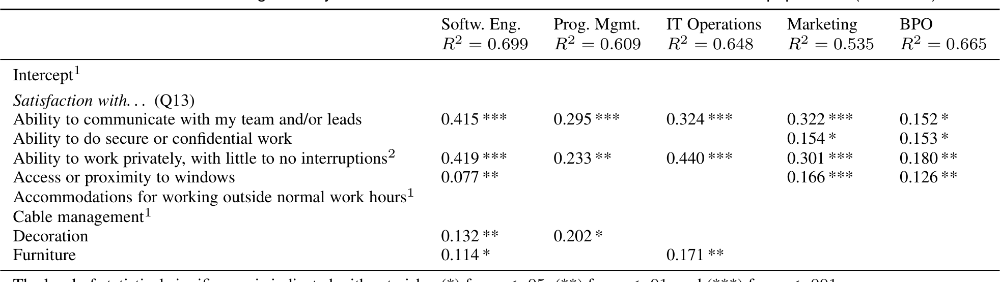
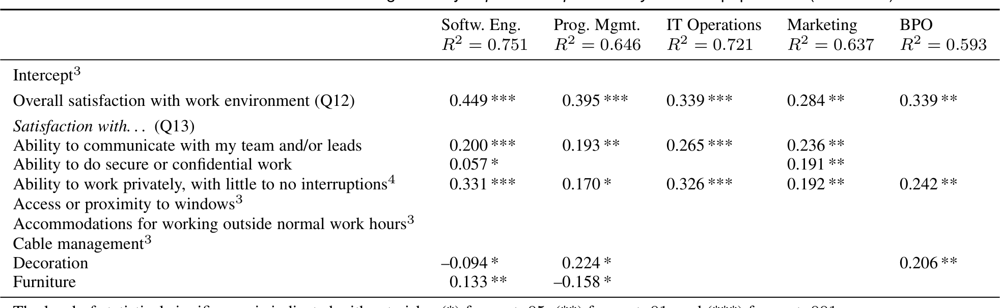

## TABLE 3
Factors that contributed significantly to overall satisfaction with the work environment for each population. (Model S1)

Furniture 0.114* 0.171**

The level of statistical significance is indicated with asterisks: (*) for p < .05, (**) for p < .01, and (***) for p < .001.  
1 The Intercept and the factors “Accommodations for working outside normal work hours” and “Cable management” were not statistically significant in any of the models.  
2 The factors “Ability to personalize workspace” and “Noise control” were not included in the model because of high correlations with the factor “Ability to work privately, with little to no interruptions”.

## TABLE 4
Satisfaction factors that contributed significantly to perceived productivity for each population. (Model M1)

Furniture 0.133** –0.158*

The level of statistical significance is indicated with asterisks: (*) for p < .05, (**) for p < .01, and (***) for p < .001.  
3 The Intercept and the factors “Access or proximity to windows”, “Accommodations for working outside normal work hours” and “Cable management” were not statistically significant in any of the models.  
4 The factors “Ability to personalize workspace” and “Noise control” were not included in the model because of high correlations with the factor “Ability to work privately, with little to no interruptions”.

### 5.2 Productivity Models M1 and M2
For each of the five populations (job disciplines), we built two models for perceived productivity.

- The first model describes the relationship between perceived productivity and satisfaction with the work environment.
- The second model describes the relationship between perceived productivity and environment factors such as number of people in environment and the presence of social norms.

The dependent variable for both models was the Likert score agreement with “I feel most productive in my work space” (Q14).

### M1: Relationship between perceived productivity and satisfaction with the work environment
Table 4 shows the factors that were statistically significant. The level of statistical significance is indicated with asterisks: (*) for p < .05, (**) for p < .01, and (***) for p < .001. We make the following observations:

- The “Overall satisfaction” factor was significant and made a high contribution (between 0.284 and 0.449) to perceived productivity in all five populations. The coefficient was high (0.449) for the software engineering population, which suggests that the overall satisfaction with the work environment contributes substantially to productivity. This finding suggests that workplace satisfaction is a key contributor to productivity of software engineers. This finding is consistent with previous research that found a relationship between satisfaction and productivity [67].

- Other contributors to software engineer productivity are the “Ability to work privately, with little or no interruptions” (0.331) and the “Ability to communicate with my team and/or leads” (0.200). The ability to communicate with team members had a smaller contribution than expected, possibly because of a wide variety of communication tools that are available to software engineers such as email, instant messaging, voice calls, screen sharing, and asynchronous code review tools.

- The factors “Furniture” (0.133), “Ability to do secure or confidential work” (0.057), and “Decoration” (–0.094) also contributed to perceived productivity in the statistical model; however, at a less stringent level of statistical significance.

In the models M1 for perceived productivity and satisfaction with the work environment, we included both the satisfaction with individual aspects of the work environment (Q13) as well as the overall satisfaction with the work environment (Q12).