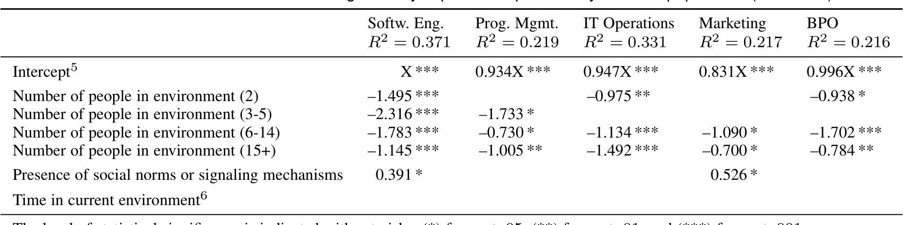

## TABLE 5
Environment factors that contributed significantly to perceived productivity for each population. (Model M2)  
Softw. Eng. | Prog. Mgmt. | IT Operations | Marketing | BPO

Time in current environment

The level of statistical significance is indicated with asterisks: (*) for p < .05, (**) for p < .01, and (***) for p < .001.  
5 The Intercept is anonymized with X in the models for Software Engineering model; the other intercepts are reported relative to X.  
6 The factor “Time in current environment” was not statistically significant in any of the models.

- We included the satisfaction with the individual work environment factors (Q13) because they can have a direct relationship with productivity and that relationship can be different from the factors’ relationship with overall satisfaction.
- We included the overall satisfaction (Q12) in the model because previous research found a substantial relationship between satisfaction and productivity [67]. While the satisfaction with individual work environment factors (Q13) already explains a significant portion of the variance of overall satisfaction (Q12), they do not entirely explain the overall satisfaction with work environments; a large portion of the variance is still unexplained (between 0.301 and 0.465 based on the R2 values between 0.535 and 0.699 of the models for S1; see Table 3) because of factors we did not observe. To account for any unobserved factors related to satisfaction, we included the actual self-reported overall satisfaction (Q12) in the model.

Including both Q12 and Q13 in the models may lead to issues with collinearity. To avoid any problems with collinearity in the resulting models, we checked for high correlations and high Variable Inflation Factors (VIF) as described in Section 3.3 (Data Analysis). Based on these checks, we removed some factors (ability to personalize, noise control) but overall satisfaction survived in the models for M1. Among the factors in the final model (Table 4), none had high correlations with each other and no factor had a VIF score higher than 5, most VIF scores were lower than 2.5.

### M2: Relationship between perceived productivity and environment factors (number of people and time in current environment, social norms).
Table 5 shows the factors that were statistically significant. The level of statistical significance is indicated with asterisks: (*) for p < .05, (**) for p < .01, and (***) for p < .001. We make the following observations:

- The intercept was statistically significant in all five populations; it corresponds to the productivity that an employee has who just moved into a personal office with no social norms or signaling mechanisms. The exact values are anonymized for confidentiality. The intercept was highest in the software engineering population (X) and lowest in the Marketing population (0.831X).
- For all five populations, the negative coefficients for 6–14 and 15+ people suggest that in the survey employees in environments with 6 or more people felt less productive.

- Software engineers in any shared environment, even with only 2 or 3–5 people, felt less productive compared to software engineers in private offices. In the statistical models, the effect size on productivity is between −1.145 and −2.316 Likert points for software engineers.
- When social norms are present, they have a significant positive relationship (0.391) with perceived productivity of software engineers. Among software engineers, 35.9% reported the presence of social norms and signaling mechanisms.

To summarize, software engineers in private offices felt more productive than software engineers in shared offices.

### 5.3 Summary
Table 6 summarizes the findings from Sections 4 and 5 and relates them to other empirical studies outside the software engineering domain.

## 6 CAN OPEN ENVIRONMENTS WORK?
The debate is ongoing as to whether open work environments are effective and if so, what makes them effective. Our findings have shed some light on what environmental factors affect productivity in open work environments for software engineers. In short, it is possible for software engineers to feel productive in an open work environment; however, we found a number of factors that could help or hurt productivity in open environments. Although our findings are based on populations from one company, they are the beginning of a more detailed understanding of how to improve work environments for software engineers.

The ability to easily communicate with team members contributed substantially to perceived productivity in our study, for both open environments and private offices and for any population. For some people, the best way to facilitate communication is by working together in a shared work environment; for software engineers in open environments, our findings indicate that sharing the space with their team is important to their productivity. P3 provided an interesting distinction between an effective open environment and non-effective work environment, stating:

> “I like the open shared space, I don’t like open plan if that makes sense. I like our 6-pack, I like having a room sort of this size and people in there... I think when you just have whole floors of rows of people spread out, I think noise travels far. I think you never have any privacy, you never have any sense of this is my space.”