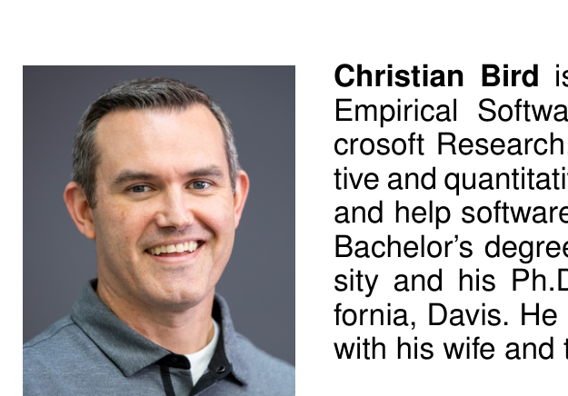

the 12th ACM/IEEE International Symposium on Empirical Software Engineering and Measurement, ESEM ’18, pages 9:1–9:10, New York, NY, USA, 2018. ACM.

[107] H. Sharp, N. Baddoo, S. Beecham, T. Hall, and H. Robinson. Models of motivation in software engineering. Information and Software Technology, 51(1):219–233, 2009.

[108] L. Singer, F. Figueira Filho, and M.-A. Storey. Software engineering at the speed of light: How developers stay current using Twitter. In Proceedings of the 36th International Conference on Software Engineering, ICSE 2014, pages 211–221, New York, NY, USA, 2014. ACM.

[109] D. Šmite, C. Wohlin, T. Gorschek, and R. Feldt. Empirical evidence in global software engineering: a systematic review. Empirical Software Engineering, 15(1):91–118, Feb 2010.

[110] P. E. Spector. Job satisfaction: Application, assessment, causes, and consequences, volume 3. Sage publications, 1997.

[111] D. Spencer. Card sorting: Designing usable categories. Rosenfeld Media, 2009.

[112] S. E. Staff. Workers’ physical environment impact bottom line, 2002.

[113] D. Stokols and T. Scharf. Developing standardized tools for assessing employees’ ratings of facility performance. In Performance of buildings and serviceability of facilities. ASTM International, 1990.

[114] N. J. Stone and A. J. English. Task type, posters, and workspace color on mood, satisfaction, and performance. Journal of Environmental Psychology, 18(2):175–185, 1998.

[115] M.-A. Storey, L.-T. Cheng, I. Bull, and P. Rigby. Shared waypoints and social tagging to support collaboration in software development. In Proceedings of the 2006 20th anniversary conference on Computer supported cooperative work, pages 195–198. ACM, 2006.

[116] M.-A. Storey, L. Singer, B. Cleary, F. Figueira Filho, and A. Zagalsky. The (r) evolution of social media in software engineering. In Proceedings of the on Future of Software Engineering, FOSE 2014, pages 100–116, New York, NY, USA, 2014. ACM.

[117] M.-A. Storey, A. Zagalsky, F. F. Filho, L. Singer, and D. M. German. How social and communication channels shape and challenge a participatory culture in software development. IEEE Transactions on Software Engineering, 43(2):185–204, 2017.

[118] G. P. Sudhakar, A. Farooq, and S. Patnaik. Measuring productivity of software development teams. Serbian Journal of Management, 7(1):65–75, 2012.

[119] A. Trendowicz and J. Münch. Factors influencing software development productivity — state-of-the-art and industrial experiences. Advances in Computers, 77:185–241, 2009.

[120] J. A. Veitch, K. E. Charles, K. M. Farley, and G. R. Newsham. A model of satisfaction with open-plan office conditions: Cope field findings. Journal of Environmental Psychology, 27(3):177–189, 2007.

[121] J. C. Vischer. The effects of the physical environment on job performance: towards a theoretical model of workspace stress. Stress and Health, 23(3):175–184, 2007.

[122] P. Vitharana. Risks and challenges of component-based software development. Communications of the ACM, 46(8):67–72, 2003.

[123] B. Waber, J. Magnolfi, and G. Lindsay. Workspaces that move people, 2014. https://hbr.org/2013/11/research-cubicles-are-the-absolute-worst/.

[124] S. Wagner and M. Ruhe. A structured review of productivity factors in software development. Technical Report TUM-I0832, Institut für Informatik der Technischen Universität München, 2008.

[125] S. Wagner and M. Ruhe. A systematic review of productivity factors in software development. In Proceedings of 2nd International Workshop on Software Productivity Analysis and Cost Estimation (SPACE 2008). State Key Laboratory of Computer Science, Institute of Software, 2008.

[126] J. P. Wanous, A. E. Reichers, and M. J. Hudy. Overall job satisfaction: how good are single-item measures? Journal of Applied Psychology, 82(2):247, 1997.

[127] L. Wasserman. All of statistics: a concise course in statistical inference. Springer Science & Business Media, 2013.

[128] M. Wells and L. Thelen. What does your workspace say about you? the influence of personality, status, and workspace on personalization. Environment and Behavior, 34(3):300–321, 2002.

[129] M. M. Wells. Office clutter or meaningful personal displays: The role of office personalization in employee and organizational well-being. Journal of Environmental Psychology, 20(3):239–255, 2000.

[130] R. D. Williams, A. B. Pyster, E. D. Stuckle, M. H. Penedo, and B. W. Boehm. A software development environment for improving productivity. IEEE Computer, 17(06):30–44, 1984.

[131] T. A. Wright and R. Cropanzano. Psychological well-being and job satisfaction as predictors of job performance. Journal of Occupational Health Psychology, 5(1):84, 2000.

[132] M. Yilmaz and R. V. O’Connor. An empirical investigation into social productivity of a software process: An approach by using the structural equation modeling. In Systems, Software and Service Process Improvement, pages 155–166. Springer, 2011.

[133] M. Zhou and A. Mockus. Developer fluency: Achieving true mastery in software projects. In Proceedings of the Eighteenth ACM SIGSOFT International Symposium on Foundations of Software Engineering, FSE ’10, pages 137–146. ACM, 2010.

[134] T. Zimmermann. Card-sorting: From text to themes. In T. Menzies, L. Williams, and T. Zimmermann, editors, Perspectives on Data Science for Software Engineering, page 137–141. Morgan Kaufmann, 2016.

> Brittany Johnson is a postdoctoral researcher at University of Massachusetts, Amherst. Her research interests include human–computer interaction, software tools and environments, and machine learning. She holds a Ph.D. in Computer Science from North Carolina State University. Contact her at bjohnson@cs.umass.edu; http://brittjay.me

> Thomas Zimmermann is a Senior Researcher at Microsoft Research. He received his Ph.D. degree from Saarland University in Germany. His research interests include software productivity, software analytics, and recommender systems. He is a Senior Member of the IEEE Computer Society and Distinguished Member of the ACM. His homepage is http://thomas-zimmermann.com.

> Christian Bird is a Senior Researcher in the Empirical Software Engineering group at Microsoft Research. He focuses on using qualitative and quantitative methods to both understand and help software teams. Christian received his Bachelor’s degree from Brigham Young University and his Ph.D. from the University of California, Davis. He lives in Redmond, Washington with his wife and three (very active) children.