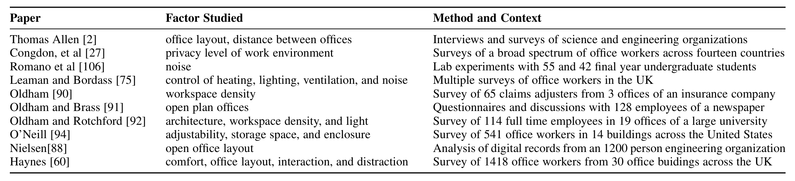

### TABLE 1
Related work examining the impact of various workplace factors on productivity.

and colleagues conducted an in situ study on the effects of noise on productivity in the context of college seniors performing industrial software engineering tasks [106]. They observed that noise had a negative impact on students asked to fix faults in Java code but did not observe a statistically significant effect on students asked to comprehend functional requirements. Leaman and Bordass explored the value of employees having control over their environment in terms of heating and cooling, noise, ventilation, and lighting [75]. For each of those factors except for lighting, control over the factor had a statistically significant positive impact on productivity.

Oldham studied workspace density (the amount of square feet per employee) in the context of office moves and reported that employees who moved from a higher density open space to a lower density open space or to partitioned offices showed statistically significant increases in task and communication privacy, crowding, and office satisfaction [90]. Oldham and Brass studied the impact of moving to open plan offices. They found that self-reported satisfaction and ability to concentrate both declined to a statistically significant degree after an organization moved to an open workspace layout [91]. In a later study, Oldham and Rotchford examined the architectural accessibility, workspace density, and light in the workplace. They concluded that dark offices are correlated with low satisfaction. Dense offices with fewer square feet per employee led to increased conflict and less satisfaction [92].

O’Neill looked at adjustability, storage space, and characteristics of the enclosure in offices [94]. The findings were that storage and adjustability of the physical office workspace contributed directly to satisfaction and productivity. The enclosure played only a minor role in predicting satisfaction and productivity. Nielsen studied the differences in a team before and after moving to an open office layout at Microsoft [88]. Nielsen observed that when engineers moved to open workspaces, they experienced increased collaboration and less travel time to meetings due to decreased distance between them. Haynes explored the impact of comfort, office layout, interaction, and distraction on self-assessed productivity and concluded that interaction and distraction have the greatest positive and negative influences on productivity.

## 2.2 Software Productivity

A significant amount of research investigated how to measure productivity in software development [82], [124], [97], [96], [118], [105]. Most research in software engineering defines productivity in terms of the rate of output per unit of input, often time-based. To give a few examples:

- number of modification requests and added lines of code per year [85],
- number of tasks per month [133],
- number of function points per month [66],
- number of source lines of code per hour [38],
- number of lines of code per person month of coding effort [14],
- number of editing events to number of selection and navigation events needed to find where to edit code [72].

In this paper, we do not use automated productivity measures because there is no consensus on the “right” measurement of productivity [97]. Furthermore, it is difficult to measure and analyze productivity on a large scale across teams because it is impossible to control for all factors that can influence productivity measurements, for example, job role, vacation, management responsibilities, project type, release cycles, etc. Instead we ask software engineers and office workers to self-report their perceived productivity. This enables us to do comparisons across disciplines, e.g., are the same factors important for employees in the software engineering discipline as in the marketing discipline. Perceived productivity is commonly used in research on physical work environments [60] and software engineering [57]. There is evidence that self-reported productivity converges to observed, measured productivity [57].

Several papers identified factors that can affect software productivity. Wagner and Ruhe conducted a systematic literature review of 400 papers to better understand the relationship between factors that can affect productivity [125]. They gathered a few factors related to work environment such as suitability for creativity and team member distribution. Based on a literature review of 126 publications, Trendowicz and Münch found that the productivity of software development processes depends significantly on the capabilities of software engineers as well as on the tools and methods they use [119]. Paiva and colleagues identified a collection of factors that affect productivity from literature and ranked the factors based on a survey of software developers [95]. A silent and comfortable work environment was ranked as a high positive influence factor for productivity.

## 2.3 Satisfaction in Software Engineering

Simply put, job satisfaction is whether an employee likes the job or not. A more formal definition of satisfaction is “a pleasurable or positive emotional state resulting from the appraisal of one’s job or job experiences” [78]. Historically, job satisfaction has been studied since the 1930s, for example by Hoppock [62] who studied how job satisfaction is affected by both the nature of the job and