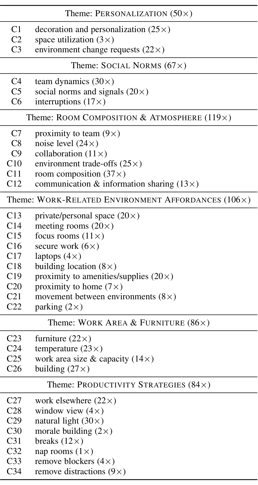

19 interviewees, 11 were male and 8 female; 8 were software engineers and 11 program managers; 15 shared offices and 4 had personal offices.

### Data Analysis

Once we completed the interviews, we extracted statements (quotes) that participants made about their work environment. The first author listened to each interview and transcribed the parts of the interview that were related to work environments. The quotes were extracted from the entire interview, that is, all questions (positive aspects, negative aspects, and improvements), because the goal of the analysis was to identify themes related to work environments in general.

The author only transcribed quotes that were relevant to work environments and excluded irrelevant quotes. For example, one participant shared a five minute story about open home designs which eventually led to a complaint about some aspect of open work environments. Rather than transcribing the entire story, we only transcribed the parts of the story that were relevant to her reasoning for not liking open work environments. We expect that our decision to exclude off-topic discussions at transcription time has very little to no impact on the validity and reliability of the results, since the quotes would have been discarded in the subsequent card sorting step anyway. We do not expect that any context information was lost because the transcription was done by the first author who attended and led every interview. Thus she was able to focus on the points of interest for work environments while situating quotes in the context of the interview as a whole.

Once all relevant portions of each interview had been transcribed, we employed open card sorting to identify themes in the data [63], [134]. Card sorting is a technique that is widely used to create mental models and derive taxonomies from data [111]. Card sorting has three phases: preparation, execution, and analysis.

In the preparation phase, we put each quote on its own note card; in total, we had 589 cards. Next in the execution phase, we used a two-pass approach to sort cards into groups of similar cards. Each group was given a descriptive title (code).

1. The first pass was completed by four people: the first and second author along with two other colleagues (who are not authors of this paper). The card sort began with collaboratively sorting the cards into groups and discussing these examples for clarity. Once everyone agreed on the groups in the first batch, each person sorted a subset of the remaining cards independently. As new groups emerged, we discussed each and what kind of cards should go into that pile. The first pass yielded 33 groups. We discarded cards that did not directly relate to the work environment into an “off-topic” pile; for example, a couple of participants mentioned how they do their to-do lists, which is not a physical environment related issue.

2. The first author did a final validation pass to check for consistency and to make sure that each card was sorted into the correct pile. In this pass, two groups were added (Space Utilization and Movement Between Environments) and one code was removed (Work/Life Balance); cards that fell under Work/Life Balance were moved to the Private/Personal Space or Breaks groups. As a result, the number of groups increased from 33 to 34. The 34 groups C1...C34 are expanded on at the end of the paper in Section 12.

Finally, in the analysis phase, we derived a set of six themes from the 34 groups. A theme is a higher level of abstraction of the topics brought up in the interviews. Table 2 shows the mapping of the final list of groups (C1...C34) to the six themes: personalization, social norms, room composition & atmosphere, work-related environment affordances, work area & furniture, and productivity strategies. The six themes will be discussed in Section 4.

We include the count of cards for each group for completeness. Note that the count should not be mistaken as importance of a group or theme. For the interviews, we focused on selecting a diverse group of employees, which is not necessarily representative of the entire population. Furthermore, since we followed a semi-structured interview protocol, some prompts may have inflated the count of cards in a group. Quantifying inherently qualitative data such as responses to open-ended questions carries some risks. For example, when the Pew Research Center asked about the single issue that mattered most in deciding how participants voted for president, 35% responded the economy in an open-ended question; however, when the economy was explicitly offered in a multiple-choice question, 58%, more than half, chose the economy [98].

### TABLE 2

The six themes derived from 34 groups. The count of cards in each theme/group is reported in parenthesis.

