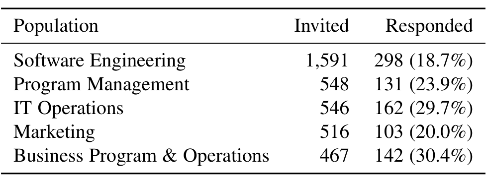

## 3.3 Follow-up Survey

**Protocol.** Using the themes that emerged from interviews, we designed a survey on work environments that would help validate our interview findings and potentially yield new findings. Because there is a large body of research that exists on work environments, we designed our survey to build on existing findings and answer questions existing research has not yet explored. For example, there exists research that has explored workspace personalization that focuses on the ability or inability to personalize and how much personalization is permitted [77]. To build on these findings, we asked questions on our survey to determine if and how employees personalize and reasons they have for not personalizing their work area. Other factors we included based on prior work include ability to easily communicate with coworkers [2], [112], the ability to work privately [91], [120], proximity to windows and natural light [75], [92], [41], accommodations for working outside normal working hours [15], decorations in the workplace [94], furniture [123], and noise control [22], [106]. We also included two additional factors that came up repeatedly in our interviews: the ability to easily do secure or confidential work and cable management.

**Survey Design.** In total the survey had 29 questions. This includes demographic questions (years at Microsoft, age, gender, has experience with shared environments), questions about their work area (building, number of people in current work environment), and a few open-ended questions (e.g., tasks that the work environment is most fit to accommodate). The following three questions were central to the survey and answers were required to complete the survey.

- Q12: Overall, how satisfied are you with your work environment? (Very Satisfied, Satisfied, Neutral, Dissatisfied, Very Dissatisfied)

- Q13: Please denote your satisfaction with the following aspects of your work environment: (Very Satisfied, Satisfied, Neutral, Dissatisfied, Very Dissatisfied, Not Applicable)
  - Ability to communicate with my team and/or leads
  - Ability to do secure or confidential work
  - Ability to personalize work space
  - Ability to work privately, with little to no interruptions
  - Access or proximity to windows
  - Accommodations for working outside normal work hours
  - Cable management
  - Decoration
  - Furniture
  - Noise control

- Q14: Please rate the following statements in terms of your agreement with each: (Strongly Agree, Agree, Neutral, Disagree, Strongly Disagree, Not Applicable)
  - I feel most productive in my work space.
  - I can easily find a focus room or meeting room when I need one.
  - (11 additional statements not used to report findings in this paper)

Although question Q14 asked agreement with thirteen statements, for this paper we only considered the statement “I feel most productive in my work space” in order to build productivity models and “I can easily find a focus room or meeting room when I need one.” to analyze the availability of meeting rooms.

> As mentioned before, in addition to the above questions, we had questions about topics that emerged from the interviews such as social norms, signaling, productivity strategies, personalization, furniture, noise control, and room composition. Most of these were Likert-scale questions. We piloted the survey with a small group of employees to avoid misunderstandings and ambiguous interpretations of the questions. The full survey text is available as a technical report [65].
>
> **Participants.** We sent the survey to over 3,000 randomly selected employees within Microsoft and got 843 responses (response rate 28.1%). For this survey, we invited employees in the Software Engineering and Program Management job disciplines as well as employees from the non-engineering professions of IT Operations, Marketing, and Business Program & Operations (BPO) to facilitate comparison with software engineers.
>
> 

For completing the survey, participants could enter a drawing of one of four $100 Amazon.com gift certificates. In the survey, about 70% of participants identified as male and roughly 30% female. Participants’ time working at Microsoft ranged from less than a year to 26 years (median 7.5 years), with age ranging from 22 to 63 years old.

Data Analysis #1 (Models). We conducted a variety of analyses on the survey data to determine and quantify factors in the work environment that affect perceived productivity and satisfaction.

- To model satisfaction, we used linear regression to build a satisfaction model S1. We used the agreement to the question “Overall, how satisfied are you with your work environment?” from the survey as the dependent variable; the independent variables were the individual satisfaction scores for the factors from Q13. Linear regression is a standard, statistical technique to analyze and model data [127].

- To model perceived productivity, we used linear regression to build two productivity models M1 and M2. For both productivity models, we used the agreement to the statement “I feel most productive in my work space” (from Q14) as dependent variable. In the first productivity model M1, we used as independent variable the overall satisfaction (Q12) and the satisfaction with the individual factors from Q13. In the second productivity model M2, we used as independent variables the number of people in the office, the presence of social norms, and the time in the current environment in years.

We computed the models S1, M1, and M2 for each of the five job disciplines: Software Engineering, Program Management, IT Operations, Marketing, and Business Program & Operations (BPO). The results will be discussed in Section 5.

We treated Likert scores as numeric values from 1 (Strongly Disagree/Very Dissatisfied) to 5 (Strongly Agree/Very Satisfied). This assumes that the scale is interval-based, i.e., the distance between Strongly Agree and Agree is the same as between Agree and Neutral. This assumption may not always be true and in fact