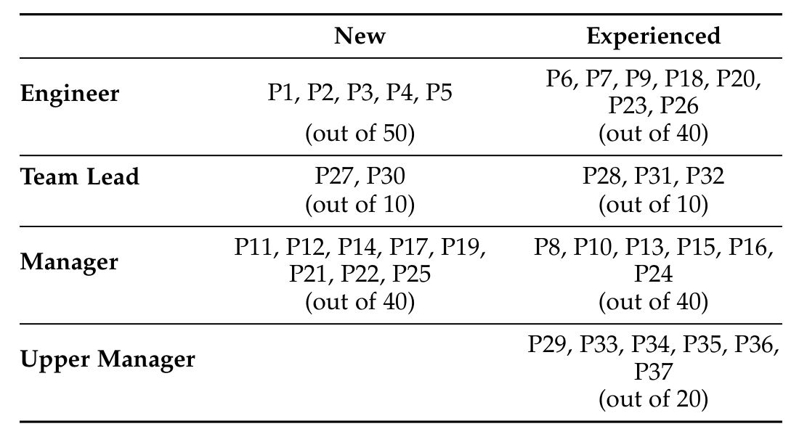
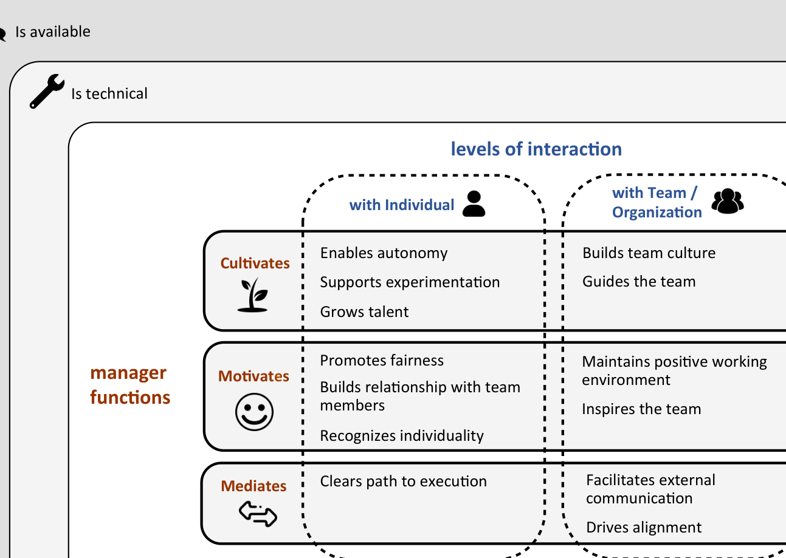
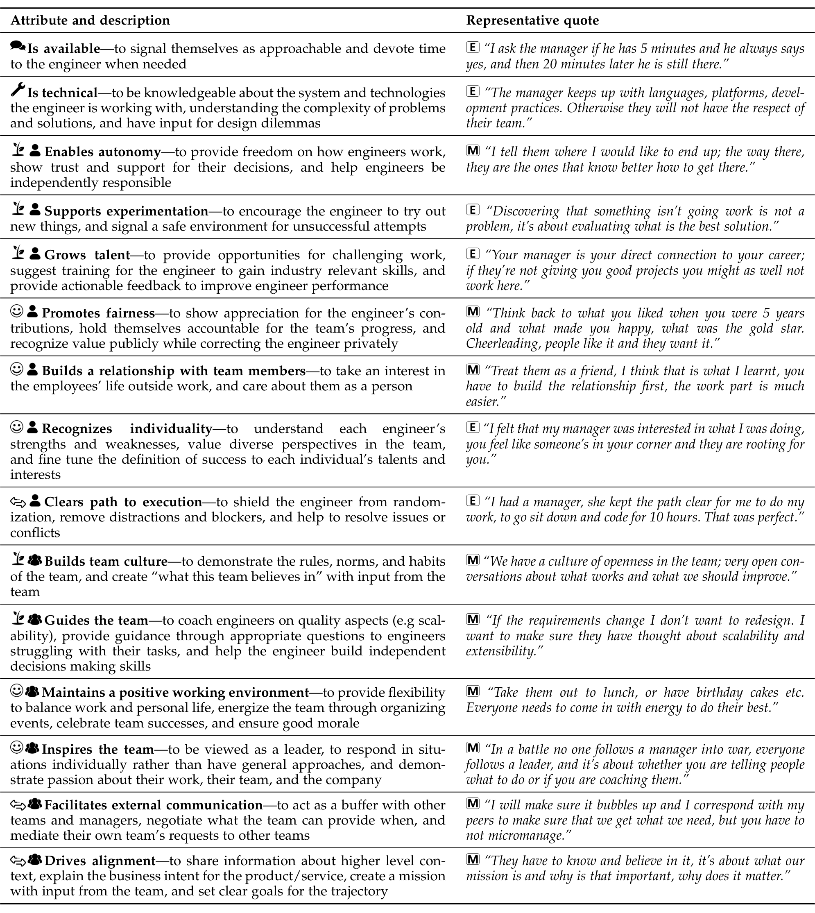
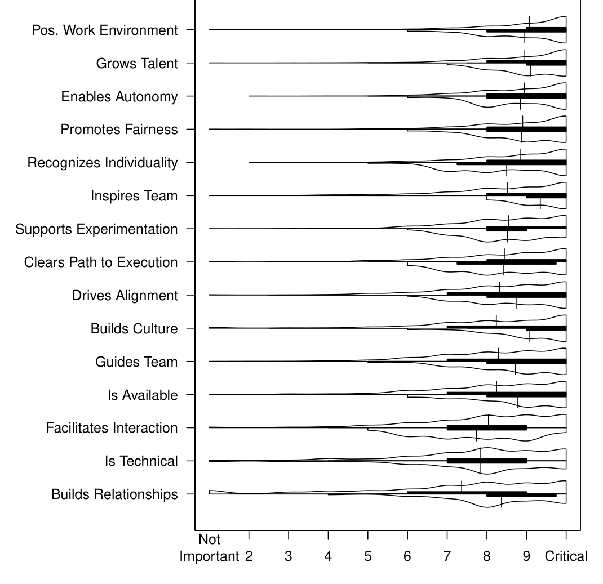
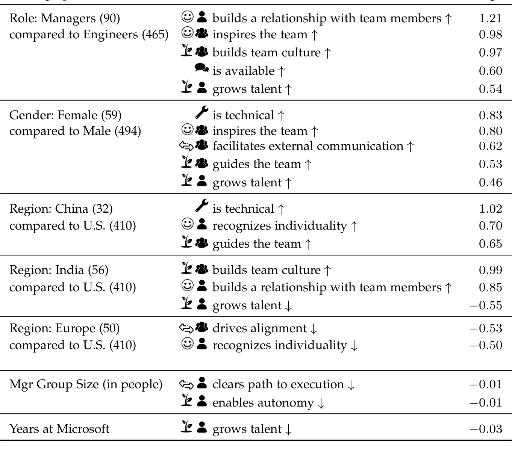
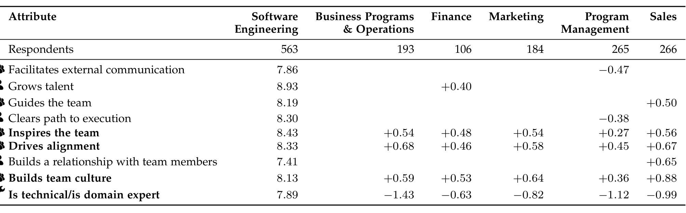
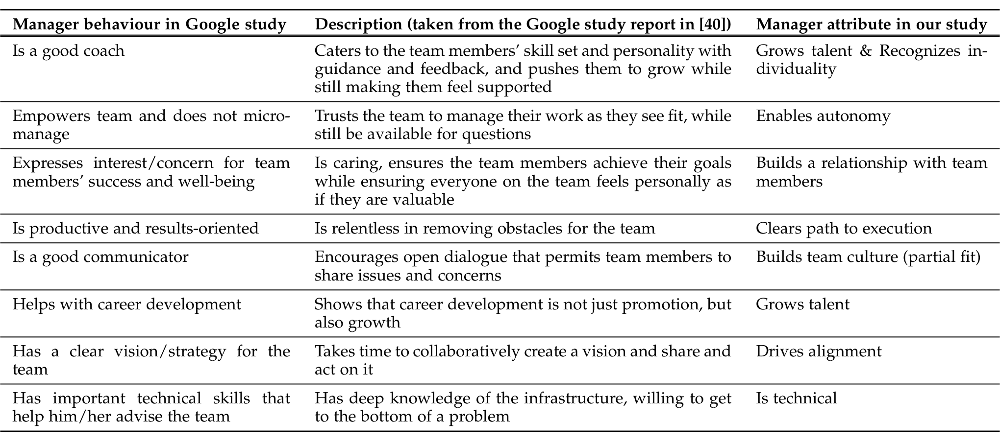
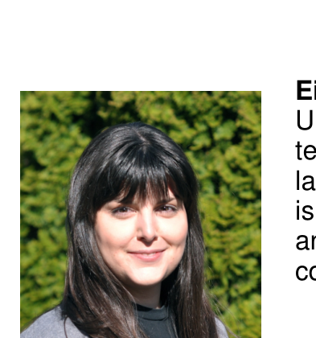
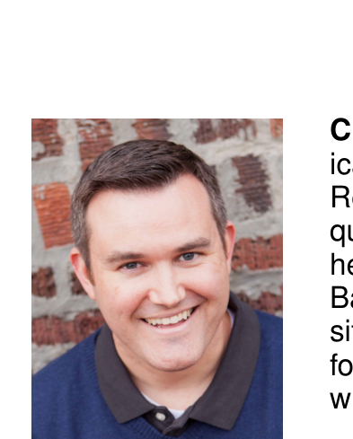
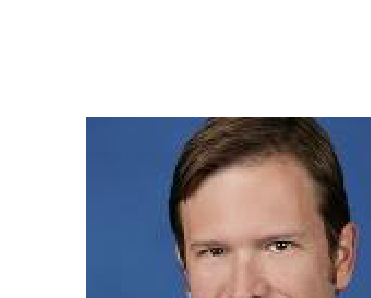

## What Makes a Great Manager of Software Engineers?

Eirini Kalliamvakou, Student member, IEEE, Christian Bird, Member, IEEE, Thomas Zimmermann, Member, IEEE, Andrew Begel, Member, IEEE, Robert DeLine, Member, IEEE, Daniel M. German

### Abstract
Abstract—Having great managers is as critical to success as having a good team or organization. In general, a great manager is seen as fuelling the team they manage, enabling it to use its full potential. Though software engineering research studies factors that may affect the performance and productivity of software engineers and teams (like tools and skill), it has overlooked the software engineering manager. The software industry’s growth and change in the last decades is creating a need for a domain-specific view of management. On the one hand, experts are questioning how the abundant work in management applies to software engineering. On the other hand, practitioners are looking to researchers for evidence-based guidance on how to manage software teams. We conducted a mixed methods empirical study of software engineering management at Microsoft to investigate what manager attributes developers and engineering managers perceive important and why. We present a conceptual framework of manager attributes, and find that technical skills are not the sign of greatness for an engineering manager. Through statistical analysis we identify how engineers and managers relate in their views, and how software engineering differs from other knowledge work groups in its perceptions about what makes great managers. We present strategies for putting the attributes to use, discuss implications for research and practice, and offer avenues for further work.

Index Terms—software engineering management; empirical studies; software companies

### 1 INTRODUCTION
Case studies from diverse industries show that great managers make a significant difference in the performance of teams and organizations [1], [2], [3]. Conversely, the wrong person in a manager role has detrimental effects on employee engagement, productivity, and the quality of produced results [4]. As software development today is done in teams, managers are essential to organize the effort of creating good software and manage the people that carry it out.

The manager’s role is multifaceted. One of their responsibilities is to deliver a product that makes the organization successful. This is generally captured by various metrics of productivity, performance, profitability etc. The manager is also responsible for creating conditions where employees feel motivated and productive. Success here is captured in the employees’ perceptions, which studies show determine behaviour and impact organizational outcomes [5], [6], [7]. Thus understanding what impacts engineers’ perceptions of their managers is of high importance. Unfortunately, we still don’t know what to look for in a great software engineering manager, and how to further develop their skills to support the teams they manage.

As the software industry undergoes tremendous change every year, researchers must continually rethink the factors that affect the traditional concept of productivity1. In this vein, our research goal is to understand how software engineering managers function and what is perceived to make them great. Great managers positively impact motivation and engagement [8]; we aim to raise awareness of these aspects, as they can affect software engineering outcomes, even if in a second-order manner. We look for attributes that are perceived to characterize great software engineering managers, how and why these attributes are important, and how they are used specifically in this domain.

The study we report in this paper used a mixed methods approach. We conducted 37 semi-structured interviews with engineers and managers of varied demographics at Microsoft. We then used their input to create and deploy a survey to 3,646 engineers and managers, using a questionnaire grounded on contextualized information. We found that the engineering manager guides engineers to make decisions, motivates them, and mediates their presence in the organization. To that end, a sufficient level of technical knowledge is necessary but people management skills are critical for great software engineering managers. Comparing the perceptions of managers to engineers in our analysis, we found general alignment but also identified specific differences that can help tailor management approaches.

Our results have novelty for software engineering, but also link to organizational psychology and behaviour, and apply to other knowledge work domains. Through a separate survey, we reviewed how the perceptions in software engineering relate to those in other knowledge worker groups within Microsoft. Identifying the similarities and differences between domains’ perceptions can help us understand what conditions are likely to make manager practices effective.

In this paper:
1. Rethinking Productivity in Software Engineering: https://www.dagstuhl.de/en/program/calendar/semhp/?semnr=17102

---

- we contribute a conceptual framework of fifteen attributes that characterize great engineering managers
- we offer contextual examples of how these attributes are put into action, and discuss the role of technical knowledge for managers to be great
- we provide quantitative evidence about how the attributes rank in perceived importance, what demographic differences exist, and how the findings from software engineering compare to other knowledge work domains.

Our study has implications for both practice and research. Our conceptual framework can be used by new and existing engineering managers, or those in training, to highlight which attributes they should focus on to improve. The identified attributes also fuel further work, to measure their impact on organizational or engineering outcomes.

## 2 RELATED WORK

In this paper, we set out to explore how software engineering management works in practice at a large software company, and identify the particular aspects which are relevant today. Our work draws on multiple perspectives, and we relate our findings to other knowledge work groups.

Many theories have been developed around how to manage organizations in general. Originally, these theories focused on how workers perform tasks. In the 1920s, works by Taylor [9], the Gilbreths (described in [10]) and Gantt [11] formed the classic era of management, when studies of how to speed up production offered advice to managers on how to organize the tasks and environment for factory workers to be efficient. Between the 1920s–1950s, the field of management turned its attention to how workers thought and felt about their work (see [12] for a detailed overview) aiming to motivate employees to identify with organizational goals [13], [14], and improve performance [15].

Two milestones have been key to shifting the focus of management on managing people. The first one was the introduction of psychology and sociology theories in management, researching factors that impact human needs [16] to better understand workers’ motivation [17] and engagement [18]. Especially after the 1960s—considered the modern era of management—the focus is on employee work attitudes and motivation [19] and the recognition of people management as separate from work organization or project management [20]. The second milestone was the rise and increased mobility of knowledge workers, which turned attention towards the behavioural aspects of employees [21]. Peter Drucker [22] led management thinkers to see the corporation as a social institution and workers as assets, challenging existing management principles as fit only for manual labour.

After decades of research on management in general, there are a large number of theories that describe managers and their behaviors in the organization. However, if one wants to apply these theories in a particular domain such as software engineering, the factors in their models must be reduced to practice. A recent review of this literature was done by Lenberg et al., describing the intersection of organizational psychology with “behavioral software engineering” [23]. They found 23 relevant papers on leadership of software teams since 1997, and concluded that still more human-oriented studies are needed in software engineering.

Although software engineering management is often equated to project management [24], [25], [26], some books about software engineering project management also mention people management; for example, Lister and DeMarco’s Peopleware [27] discussed such issues in software projects early on. Beecham et al. conducted a systematic literature review of motivation in software engineering and reported studies that show a strong impact of managers and their practices on engineers’ motivation [28]. Other books focus on advising developers on how to act in a more collaborative or socially-aware manner [29]; or take an entrepreneurial view on management [30]; or are anecdotal and based entirely on the (admittedly extensive) experience of the author [31]. Stories of bad managers are widespread, often showing how their behavior contributes to product failures [32].

In the majority though, literature on software engineering management focuses on prescribing formalized approaches (e.g. the Spiral and Waterfall models) or alternative approaches (e.g. Agile and Lean) to scheduling, planning, and delivering software products on time and budget. The Software Engineering Body of Knowledge [33] briefly addresses group dynamics and teamwork, but overlooks the management of teams and their members.

Looking to the popular press for inspiration, some authors have a cynical view of management theories and prescriptions [34] while some offer anecdotal evidence and advice for management behaviour that they believe led to their success [35]. Other experts focus on the relevance of management principles in domains that undergo rapid growth and change [36] (such as in the technology and software industry [37]).

There seems to be a need for studies to understand people management in software engineering and how management principles apply or relate to the software engineering domain. The study we present in this paper aims to address this. While we acknowledge and draw on research on general management, we set out to explore how engineering management works in practice and which aspects are relevant today, without presupposing. We have also drawn on multiple perspectives, and related our findings to other knowledge work groups.

Two studies have discussed aspects of management, specifically in software engineering organizations.

Our study shares some similarity of purpose and findings with a study from Li et al. [38], which investigated software engineering expertise. The study identified 53 attributes of great software engineers. Some of the attributes that were found important for engineers were recognized as potentially inspired or facilitated by the manager; for example, creating shared success for everyone on the team, or creating a safe haven where engineers could make mistakes without repercussions. Our study independently identified these as important attributes for engineering managers too, and also uncovered complementary ones and strategies to enact them.

Recently, researchers at Google (a software engineering company of comparable size to Microsoft) investigated the question, "Do managers matter?" [39], [40] and found 8 be-

---

behaviors for great managers in their organization. In a follow-up study of what makes effective teams, Google found it is important that team members feel psychologically safe [41], and have clarity about their purpose and goals [42]; these are aspects that the manager can influence in a positive way. We refer back to these studies in Section 9, and discuss how they relate to the findings we present in this paper.

Virtual teams often provide a context in which management proficiencies and deficiencies can have a strong impact on the team. Saxena and Burmann [43] looked at the special needs of virtual and globally distributed teams, especially focusing on task-related and culturally-related attributes that affect team performance. Managers must facilitate communication and effective interactions between far-flung team members and empower them to make decisions independently (due to time zone differences). Kayworth and Leidner also focus on virtual teams, identifying factors such as mentoring and empathy, which help make managers more effective leaders [44]. Zhang et al. identify how managers evolve from controlling virtual teams, to coordinating work among team members. Becoming an effective delegator, even of management functions and decision-making, is a key factor to making virtual teams successful [45].

## 3 METHODOLOGY

Our research methodology comprised two high level phases. In the first, exploratory, phase, we interviewed 37 software engineers and engineering managers to identify perceived important attributes of great software engineering managers. In the second, confirmatory, phase, we developed and deployed a survey to a larger population.

### 3.1 Interviews

We used interviews to identify the important attributes that make a great software engineering manager, as well as understand why such attributes are seen as critical and how they manifest in software engineering contexts.

#### Participant selection

We purposely sought to interview a diverse group to capture as many varying opinions and experiences as possible. To that end, we used a stratified purposeful sampling approach [46] to recruit interviewees. This selection strategy is a form of Maximum Variation Sampling [46] and is appropriate when “the goal is not to build a random and generalizable sample, but rather to try to represent a range of experiences related to what one is studying.” To capture multiple perspectives, we interviewed software engineers (those being managed), and managers at multiple levels.

#### Software engineering manager

Software engineering manager (or simply, engineering manager) is the name of a particular role at Microsoft. According to the job description, these managers are responsible for delivering results through one or more teams of engineers; they assist the team with goal setting, handle hiring decisions, manage resources for the team(s), and are responsible for guiding the engineers’ professional development and reviewing their performance. As part of communicating business direction to their team(s), engineering managers liaise with other teams and meet with upper management. Before major releases, engineering managers represent their team in cross-team discussions about project status, and decisions on the features that ship to customers.

Although our study focuses on the engineering manager role, we elicited the perspectives of managers at multiple levels. These included team leads (often owning a feature with a small number of engineers reporting to them), engineering managers, and upper level managers (those that hire, advise, and review engineering managers). Since we found that responses were in alignment across the different management roles, we make no distinction in the remainder of the paper; we simply divide those interviewed and surveyed into engineers and engineering managers.

For both engineers and managers, we selected participants along the dimensions of experience (new to the role—hired in the last 6 months—or long time in their current role—longer than 5 years), number of employers (has their entire career been at Microsoft or have they worked elsewhere), gender, organizational level (engineer, team lead, engineering manager, and upper level manager), and product group (e.g., Windows, Office, Azure).

We sent recruitment emails to a random sample ranging between 10 and 50 people, depending on the size of the stratum. For those that accepted (37 persons), we sent a follow up email asking them to select and rank the top five most important attributes from a list of 16 manager attributes (we refer to those as seed attributes in the rest of the paper). Table 1 shows the role and experience of the 37 interviewees. In the parentheses we provide the number of participants that we sent invitations to from that stratum.

We asked only for the top five attributes knowing that due to the cognitive load of rankings individuals usually pay more attention to the top few choices rather than carefully ranking all alternatives, resulting in additional noise in the lower rankings [47]. The online survey tool we used allowed the participants to drag attributes as separate items and place them in the order that represented their ranking.

The list of seed attributes was compiled based on two sources. First, we used the 11 attributes used in the annual company poll where Microsoft employees evaluate their manager; most of the Microsoft Poll attributes can be traced back to management literature. The second source of seed attributes was our review of additional management literature [48], [49], [22], [50], [39] (5 attributes); we added attributes found in the literature that were not already included in the company poll or very similar to those. We also provided space for the participants to add other attributes that they felt were important.

Interview protocol. We asked all participants—regardless of their level—to refer to and talk about the engineering manager role. We asked interviewees basic demographic questions; the information collected was the participants’ number of years of professional experience, the number of different companies they worked in, and their current role at Microsoft. Next, we had an in-depth discussion of three of the attributes we selected from their top five seed and write-in attributes. We determined that a discussion of three attributes could pragmatically fit in the time we had with the participants to both collect all the information we needed, and not rush their answers. This was confirmed as a fitting strategy after the first few interviews. The attributes were selected for discussion based on

---

**TABLE 1: Participants in the role and experience dimensions**

the ranking given by the participant; we chose the highest ranking attributes. When interviewees had provided write-in attributes that they felt were more important, we gave these priority in our discussion. Gradually, as we achieved saturation regarding some of the attributes, we intentionally picked for discussion attributes that we had less information about as long as the participants had highlighted them as important (i.e. were in the top five).

We asked why they felt each attribute was important for great managers to have. We also asked about strategies to gain or utilize the attribute (for managers) to ensure our understanding of the nature of the attributes, and to offer actionable insights from our study. We intentionally used the abstract term “great” without providing a definition so as not to bias interviewees and instead gain an understanding of what it meant to them. We accomplished this by employing a “War Story” elicitation procedure to explore concrete experiences from the interviewee related to the attribute [51]. We explained that we were interested in experiences they had any time during their development career, not limited to Microsoft, and also asked them not to use names or indicate whether various experiences, thoughts, etc. referred to their current or prior teams or managers. Interviews lasted from 30 minutes to an hour and were recorded with the interviewee’s permission.

#### Analysis

The interviews were transcribed; we then identified all attributes brought up during the interviews and performed an open card sort to identify categories and organized them into themes [52], [53]. Each card represented an attribute that was described in an interview, either seed ones or those that emerged from the participants; we sorted 83 cards into 15 categories. The card sorting was performed by two of the authors (one of them was a Microsoft employee), in two rounds. For each category, we examined the context for every card in that category and came up with a name and a short list of examples for the attribute. The interview transcriptions were then coded according to these categories.

### 3.2 Survey

We designed a survey based on interview results to validate, and see how the attributes generalize to a broader population.

#### Survey instrument

The survey’s primary purpose was to assess the importance of each of the identified attributes from the interviews and determine if there were additional ones to add. We asked respondents to rate each attribute of engineering managers on a ten point scale from “not important” to “critical”. The displayed order of the attributes was random for each respondent. We provided the name of each attribute with a short description of examples demonstrating it in practice (see Table 2 for the text of each). We provided a write-in question for respondents to provide attributes that they felt were important; we received 123 responses to that question. We reviewed the responses manually and found that they were paraphrasing or giving concrete examples of one of the 15 attributes or identifying a subcase of one of the attributes and did not generate new input.

As with the interviews, all participants were instructed to discuss the engineering manager role. That means that engineers and team leads were discussing a role that is organizationally above them, the engineering managers were discussing their own role, and the upper level managers were discussing a role that is organizationally below them.

We probed the attribute being technical more with a scenario-based question, asking respondents to pick one of two candidates for a manager position, and justify their choice. The first candidate was described as excellent technically and competent socially while the second one as competent technically and excellent socially.

We collected gender demographics, geographical location, role of the respondent, role of the person the respondent directly reports to, size of the team the respondent is in or manages, number of years the respondent has been in their current role, and number of years they have been at Microsoft in total. This allowed us to check for differences in opinions from various demographics (e.g., gender, role).

We used Kitchenham and Pfleeger’s guidelines for personal opinion surveys in software engineering research [54]. We followed the practices suggested by Morrel-Samuels for workplace surveys [55] such as avoiding terms with strong associations, using response scales with numbers at regular intervals with words only at each end, and avoiding questions that require rankings. We piloted the survey [56], with 199 randomly selected developers, team leads, and engineering managers. The pilot included an additional question at the end of the survey asking if anything was unclear, hard to understand, or should be modified in any way. We received 26 responses (13% response rate) and based on feedback, we clarified the wording of several questions. The full survey can be found in our supplemental materials [57].

We sent the final survey to 3,646 people in the software engineering discipline spread across the strata described. The survey was anonymous, as this increases response rates [58], [55] and leads to more candid responses. We received 563 responses, leading to a 15% response rate. This is comparable to online software engineering surveys, which usually report 14% to 20% response rates [59]. A power analysis indicated that for confidence intervals of 5% at 95% confidence level, 384 responses are needed [60], which are exceeded by our 563 responses.

#### Knowledge worker survey

To relate the findings in software engineering to other knowledge worker domains, we deployed a second survey in knowledge worker disciplines at Microsoft that are not software engineering.

---

We selected to survey both managers and individual contributors (those who do not manage others) in "Marketing", "Finance", "Sales", "Program Management", and "Business Programs & Operations". The survey was identical except for a few small changes. We added a question asking which discipline the respondent works in. We changed occurrences of "developer" to "employee" and "engineering manager" to "manager". Due to concerns that the attribute "Is Technical" might be too domain specific we changed the name of the attribute to "Is a Domain Expert". The survey was deployed to 7,100 employees and received 1,082 responses (15% response rate).

Analysis. We used descriptive statistics to rank attributes and regression modelling techniques to identify demographics that positively or negatively influence the perceived importance of the manager attributes. The details will be discussed in Section 7.

We present our findings in the following five sections. In Section 4 we introduce and describe the conceptual model that emerged from our qualitative analysis, while in Section 5 we give details about each of the attributes, providing representative quotes and examples. The attribute of being technical is presented separately in Section 6. In Section 7 we present quantitative evidence of the ranking of the attributes by importance, as well as identified demographic differences in perceptions on engineering management. Finally, in Section 8 we review the findings from software engineering relative to other knowledge worker groups.

All the empirical evidence we present and discuss in the rest of the paper about great engineering managers reflects the perceptions of the participants about attributes, actions and strategies. Hence, when we mention "the great engineering manager" we mean what engineers and managers perceive as important for engineering managers that are seen as great. We use the former for brevity, and to avoid repetition.

## 4 CONCEPTUAL FRAMEWORK FOR GREAT ENGINEERING MANAGERS

We identified 15 high level attributes of great software engineering managers; they are listed in Table 2 with a description for each and a quote capturing the participants' impression.

We have organized the attributes into a conceptual framework in Figure 1. The 83 attributes identified during the interviews and surveys were qualitatively analyzed and card-sorted in the 15 attributes we present in this paper. Of these final 15 attributes, 6 (40%) map back to seed attributes; 4 (27%) to the Microsoft Poll and 2 (13%) to the management literature. The remaining 9 attributes (60%) were write-in attributes provided by the participants.

The framework is organized along two dimensions, labeled on Figure 1: the levels of interaction, and the engineering manager’s functions. We found the engineering manager interacting on two levels; with the individual engineer, and with the engineering team or other entities in the organization. We symbolize this at the top of each column in Figure 1. The vertical, dashed-lined grouping in the framework shows the relevant attributes for each interaction.

A second categorization of the attributes surfaced from our data, around three functions of the engineering manager; these reflect the perceptions of the involved parties, not just the job description. We note that identifying and grouping attributes is an inherently subjective activity and we often referred to feedback and contextual information from participants during the process [61]. Certainly there is no single objective correct way to group them; for example, the literature on Job Design [62] considers autonomy to be connected to motivation while our respondents often related autonomy to growing and cultivating engineers. The horizontal grouping with solid lines in Figure 1 show the relevant attributes; we present all identified attributes in detail in Section 5.

Throughout the paper, we use icons to indicate the dimensions the attributes belong to. For the level of interaction, we distinguish whether the interaction is with the team ( ) or the individual ( ). For the manager function, we signal when the attribute relates to the manager cultivating engineering wisdom ( ), motivating the engineers ( ), or mediating communication ( ).

Two attributes—being technical and being available—are relevant in all interactions and functions. We note this because these attributes were often mentioned by participants as being pre-requisites to, or supportive of, the other attributes (e.g., a manager would need to be technical to facilitate external communication with another team about a dependency between modules). To indicate this, in the framework we show these two attributes encompassing all the rest.

We hasten to note that while we identified 15 attributes from coding the 83 that emerged from our interviews, they are not completely independent of each other and inter-relationships exist between them. For instance, the attribute supports autonomy may enable the attribute of grows talent. As this paper is an initial exploratory foray into identifying and characterizing these attributes, we do not explore the subtle relationships between them.

In an effort to evaluate how well the identified attributes and our conceptual framework represent the ideas of participants of our study, we conducted member checks — a technique used by researchers to evaluate the internal validity or "fittingness" of a study [63]. We reached out to those we had interviewed to elicit feedback on the attributes and conceptual framework. Of the 37 individuals interviewed, 31 were still employed at Microsoft and not on leave. Of these, 16 provided feedback (ten managers, three leads, and three engineers). All indicated that the attributes and framework accurately captured their views and experiences. Many were enthusiastic about our results and asked to share preliminary drafts of this paper with others.

## 5 THE FUNCTIONS OF GREAT ENGINEERING MANAGERS

In this section we present qualitative evidence for the attributes. We use representative cases, examples, and quotes that came out of coding a discussion of each particular attribute with interviewees. Our findings are thus contextualized, showing why attributes are considered important and how they are instantiated. We indicate whether a quote

---

Fig. 1: Conceptual framework for great software engineering managers

### 5.1 Cultivates engineering wisdom

comes from an engineer (E) or manager (M), and the participant ID. The attributes are presented following the horizontal grouping in Figure 1: cultivates, motivates, and mediates.

The attribute is available has a simple description (see Table 2) and we have not included it in our detailed presentation of the attributes below. Yet, it was reported as important for helping engineering managers achieve the other attributes.

Developers and managers described great engineering managers enabling the autonomy of engineers. The manager communicates and explains the desired outcome (see Drives alignment later), but the engineer is seen as the expert of implementation and owns decisions such as picking tasks and tools. One manager described this, linking it to higher speed in their team:

> M “We inherited a pile of code, and discovered one piece was entirely busted. Should we fix it or should we rewrite it? The guidance was ‘get this thing to work 100% bulletproof’. We started rewriting it from the ground up with TDD [Test Driven Development], the team made that decision. We got it figured out in an afternoon when it usually takes a person a week.” [P11]

The engineer needs context informing their decision making to enact autonomy [64]. A common way described in interviews was involving the engineer in discussions traditionally exclusively owned by managers, e.g. deadlines.

> M “I leave almost every decision to the engineer if they feel strongly enough about it. Say a partner needs something by a particular deadline, even then I would give a lot of leeway. I would not say ‘we have to have this done by this time’, I would present the rationale and ask how we can meet this, or if meeting this is even the right thing for us to do.” [P13]

Autonomy also manifests on the team level, with room for the engineers to collectively decide on coding conventions, and development process.

Engineers develop their skills as they try new things [65], while newcomers can familiarize themselves with a project’s landscape [66]; the great engineering manager supports experimentation. Both new hires — for whom experimentation is necessary to gain skills — and senior developers — interested in keeping up to date with new technologies — favoured this attribute. However, experimentation should be safe and the engineering manager needs to signal that.

> E “Nobody wants to report failures. Then it’s less stressful to do what other people do, rather than try something new. It has to be somehow communicated that we will let you try out stuff with the assumption that if it doesn’t work it’s fine.” [P7]

Managers agreed experimentation with safe haven is important for getting good ideas on the table, but also try to be cautious of potentially introducing technical debt.

> M “We built someone’s fun project into a product. Since we rely on that tool we have debt now to pay because the person did it as a hobby and wanted to make progress fast and not disturb any project work. We encourage that but if we don’t do it with some quality gates, we inherit more debt later.” [P14]

The room for autonomy and experimentation supports another attribute of the great engineering manager, that of growing talent. Our interviewees reported three main ways to enable talent growth.

First, by providing opportunities for challenging work; the great manager picks the scope and priorities for the team to have impact towards overall goals, and provide learning and experience.

> E “You want to advance and grow and not necessarily do test automation for 10 years. I think that’s where they need to look out”

---

TABLE 2: Attributes of great software engineering managers, each with a short description and representative quote.

for you and make sure you are working on something that will advance your skills.” [P2]

Second, by providing timely and actionable feedback to improve the engineer’s performance; developers see such feedback as a signal that the manager is invested in their progress and career, and helps establish trust toward them. Managers commented that giving negative feedback is a tough process but that postponing giving negative feedback is a property of bad managers; the delay only leaves less time to the engineer to address their performance issues.

Third, managers described creating experiences for the engineer to learn something on the job, instead of telling them how to approach it, resulting in empowerment. One manager said:

> M “I ask a new hire to take difficult tasks on. By failing we are going to find out where you need the help and then you will go to person X and ask them for help.” [P31]

While managers find that such a strategy works, they cautioned about people too introverted to collaborate with others or ask for help—especially if they have strong technical knowledge themselves. The great engineering manager establishes and demonstrates the habits of the team, and what the team believes in;

---

In this sense they build the team culture. The culture covers issues that have to do with the quality of work the team aspires to:

> M "Messaging to the team that 'our goal is to ship a product with 0 known bugs' is a very aspirational goal, but it should be everybody's goal. You may not know what the bug is or how to fix it, that's a different thing, but there should be no concept in people's head that it's okay to ship with bugs." [P21]

The great engineering manager guides the team by coaching developers on quality aspects; implementation decisions are left to engineers, but the manager ensures that software quality aspects like reliability, scalability, availability, and extensibility are considered.

Similar to enabling autonomy, the technique that managers agree works better is to ask questions rather than give directives, and involve the team.

> M "It's more about asking questions instead of providing direct answers, getting the team together for brainstorming to determine direction instead of making decisions for people. Even if you already know the outcome you need the team to get to, you can help them arrive to the same conclusion and guide the conversation that way." [P27]

Developers and managers pointed out the importance for the developers to be convinced about the direction, connecting it to job satisfaction and turnover in the team:

> M "If the engineers don't feel they are doing something important it doesn't matter if it's going to get them a promotion or money because they will feel they are doing nothing with their lives, because they spend so much time at work. If they don't hear from my boss that something is important to do it's hard for them to buy into the idea of doing this, and that guarantees churn." [P14]

### 5.2 Motivates the engineers

Developers and managers agreed that a great engineering manager promotes fairness in their interaction with the individual engineer. One perceived component of fairness was actively showing appreciation for the engineers' work:

> E "They value your contributions, they give you feedback that what you have done is helpful, or brought success to the team or the organization. That is great motivation to engineers." [P18]

Email—especially if upper management can be included in the communication to give more exposure to the work—and meetings were the commonly mentioned venues. Managers give opportunities to the individual engineers to present their work in team meetings where they can give positive reinforcement in front of the whole team.

Managers highlighted that showing appreciation for the engineers' contributions is important, following a maxim of "Praise publicly; correct privately" which has positive impact on the developers' trust and motivation. Great managers hold themselves accountable for mishappenings; doing this acts as a form of proof that helps developers be candid when having work challenges. A manager gave the following example:

> M "Sometimes they forget tests for a scenario and there will be an email from management about it. I will take the responsibility, and then talk individually to the person to make sure we do a better job. They know they didn't get hit at that point and they trust you; you protected them rather than passing blame." [P28]

An extension of demonstrating appreciation is that the great engineering manager builds a relationship with each team member. Knowing about personal interests beyond work helps create common ground and empathy between the developer and the engineering manager; it contributes to motivate engineers, and helps build trust with the engineering manager. Managers especially insisted on how important this attribute is to great engineering managers, and how it is frequently overlooked. Managers mentioned a different approach to how they meet with engineers, based on this attribute.

> M "Having 1-1 meetings in their office is better, it gives them home field advantage so that they don't feel like they are going to the principal's office. We might talk about life and things at work, it goes back and forth. It makes them comfortable and allows them to open up about work things because we have camaraderie." [P31]

The great engineering manager recognizes the individuality of each engineer; this attribute helps the manager tailor the work to the interests and skills of the engineer, and build a team with complementing skills. A developer described how this can impact productivity:

> E "I had a manager asking me what I was interested in and giving me work related to that and I felt a lot more comfortable and happier. I had a manager try to mold [sic] me to their definition of what a good engineer does and I was probably working the hardest and yet my output was probably the least." [P9]

The great engineering manager takes steps to maintain a positive working environment for the team. One example is the flexibility to achieve work-life balance; it signals a manager personally interested and invested in the well-being of the engineer beyond the professional level. A second example of maintaining a positive working environment is energizing the team. One of the managers mentioned that the general feeling in the stand up meetings shows the team's health.

> M "We do daily scrum meetings that are about making fun of each other, making jokes at 10 in the morning. We can tell in the meeting a certain amount of health, and if people are happy they are generally good with their job. They will also talk to me if something is off." [P31]

Finally, echoing the trait of showing appreciation on the individual level, managers pointed out that celebrating team successes is good for morale, and linked it to job satisfaction.

> M "There is a lot of job satisfaction that comes from knowing that people care about what you're doing. Celebrations can also be about transparency, I share all the feedback that we get from higher up—good and not so good—people like to see a direct line between what they do on a daily basis to senior leadership." [P35]

Engineers also described the importance of having a positive working environment, sometimes even more so than the work they do:

---

> E “I would compromise on the work or the product if the team has a positive working environment which I think the manager influences deeply.” [P9]

The great engineering manager inspires the team. This attribute was almost exclusively mentioned by managers; they felt that the engineering managers that are great are viewed as leaders, although in organizational culture, management and leadership are seen as different functions [67]. The simplest way to explain the difference between manager and leader was by drawing the line between enabling and giving a directive.

> M “Managers issue decrees, whereas leaders encourage everyone to move to a certain direction. Are you telling them what to do in a way that they are on board with it, they get it, and they see it as a growth opportunity, not as a directive?” [P33]

### 5.3 Mediates communication

The engineering team has dependencies and communication needs with other teams in the organization [68]. A great engineering manager mediates information flow between their team and other stakeholders.

First, the great engineering manager clears the path to execution. Engineering managers recognized that any type of interruption can be detrimental to the engineers’ productivity:

> M “The operational space for engineers is that flow moment where they are deep into writing code. The last thing they need is some random person—business person, or the manager—going ‘hey, have you got a second?’, you just killed half their day in that moment. Giving them the space to focus is important, just be the person that tells other people to go away. Defend their time.” [P36]

The concept of “flow”—originally introduced by Csikszentmihalyi [69]—has been popularized and is now well-known and frequently cited in software engineering practice. In a state of flow, the software engineer is focused on their work and their performance is optimized [70]; unfortunately, the state of flow is fragile, and a developer whose concentration is broken needs significant time to recover. The concept of “flow” in this paper is distinct from how “flow” is described in lean manufacturing and product development where it refers to a sequence of development actions, each clearly adding value to the creation of a product [71] (citing [72]).

The great engineering manager acts as a noise filter, protecting the developers’ flow state and keeping the path to execution clear for them. A manager described this further during the member checking:

> M “[...] as an Engineering Manager I often feel that my job is to shield the team from distractions, among other things, basically to get out of their way, keep the business out of their way, and let them execute against clearly communicated/understood/shared goals.” [P14]

One strategy mentioned by the interviewees was for the engineering manager to filter incoming requests to the developer, and discuss with them individually if and how to prioritize them. The engineering manager also handles requests or changes coming from upper management, in the service of flow. Developers and managers see the great engineering manager shielding the team from changing requirements (“randomization”, in corporate lingo), and manage upwards to negotiate workload. Through insulation from randomization, the engineering manager helps the team maintain its collective flow and performance.

The great engineering manager also facilitates external communication; with other engineering teams, and with upper management.

Often, the engineering team has outgoing requests for other teams; the great engineering manager pushes to get what their team needs, especially if it is critical to work that is underway. In facilitating communication with external entities the manager is not bypassing the engineer or limiting their autonomy; the manager is instead using their status and connections to achieve results on behalf of their team. The other forms of external communication are performance reviews and other meetings with upper management, where the engineering manager represents the team.

The great engineering manager navigates the two attributes, clearing path to execution and facilitating external communication with upper management. On the one hand, to shield their team, the engineering manager may prioritize requests from upper management lower, or decline them. On the other hand, to advocate the teams’ work, the engineering manager needs to showcase the team’s impact on achieving organizational goals, which are closely related to upper management requests. To balance between the two situations data and prior success are persuasive factors.

> M “For stopping randomization I bring soft data: names, efforts assigned to them, show we don’t have capacity for more, just different priorities. Sometimes management may ask for things that are, regardless of our capacity, probably wrong, not timed right, or not scoped enough. Then I bring a deeper analysis of what the problem space is.” [P14]

The engineers’ focus is on implementation details and delivery of features; there lies a risk that the goals they see are removed from the strategic vision of the organization because they are unaware of business drivers [73]. The great engineering manager actively drives alignment between individual output and the organizational scope. By sharing strategic information about goals, and clearly explaining the intent and desired outcome, the engineering manager ensures that effort is channeled in the right direction, and that engineers know enough to make informed decisions as part of their autonomy on implementation. An engineering manager explained:

> M “Every team member are the experts of their area, they know the best things that can come out, but they can push in different directions. Those are their personal contributions and they feel ownership to them. My goal is to see how we can align these contributions in a way that they still feel like their own and they are now all pushing in the same direction, helping the organization move the business forward.” [P13]

As with guiding the team, the great engineering manager consults with the team about achieving the higher level goals and does not enforce a certain path.

---

Fig. 2: What participants described falls under being technical

> “I pose a question like ‘hey, here are some of the challenges our business is facing, how do you think you can help in these respects? Here are some seeds of lines of thinking, but help us to come up with a strategy together, what are things we can do to get there.’” [P13]

## 6 BEING TECHNICAL

The attribute of “being technical” emerged consistently in the interviews, but in an unexpected way that warranted more careful examination.

By the respondents’ account the engineering manager, as a rule, does not produce technical output, i.e. does not write code. In fact, respondents were explicit about a great engineering manager not making technical decisions; rather the engineers do.

What, then, is the role of technical knowledge for an engineering manager? According to the interviewees, a technical engineering manager:
- is respected by the team,
- may be more vigilant about quality issues,
- would be a fair evaluator of the engineers’ work,
- empathizes with engineers and clears their path to execution, and
- would represent the team better, both to other teams and to upper management.

We noticed all interviewees using the same, albeit abstract, lingo of the engineering manager “being technical”. To address the possibility that the interviewees meant different things concealed by the use of the same term, we contacted them and asked them to clarify what “being technical” meant for them. We heard back from 25 interviewees. The overlap in their responses signals they originally meant similar things; we mind mapped their input in Figure 2. “Being technical” was described in terms of what the engineering manager should be in a position to comprehend, and how it helps.

The engineering manager needs to have enough technical knowledge to understand the engineers’ work, the tools and technologies they are working with, and the system they are building (languages and frameworks were the most cited examples of technologies). The engineering manager should also understand the tasks engineers work on, the complexity of problems they report to their manager, and the proposed solutions. With a nuanced view of the engineers’ work, the engineering manager can facilitate their growth; they mentor and set the standards of quality through code reviews and feedback.

Comprehension also helps the engineering manager facilitate discussion of approaches to implementation, or what to build next. An engineering manager with enough technical knowledge can explain the rationale between alternatives, and ask the right questions about why one is preferable to another.

Engineers often encounter design dilemmas [74], and discuss them with the engineering manager, who is expected to act as an arbiter. In an iterative process the engineering manager makes suggestions and helps the engineer navigate their way out of the dilemma by spotting flaws and raising concerns. Overall then, “being technical” means that the engineering manager has enough knowledge to hold informed discussions that will help the engineer make decisions. Developers particularly mentioned that having enough knowledge cannot be faked, and that they can tell even from a very brief conversation if someone has enough technical understanding.

> “It is very easy for the engineer to understand if the other person is technical or not. For example I may talk about something that I am working on and then I will say what I will do and how long it will take. When you discuss there will be some technical details, and they will be unable to say if you need some help or parts from other teams.” [P18]

There is an underlying tension at this point. Engineers at Microsoft (and most companies in the tech industry2) are usually promoted to managerial posts because of their technical excellence; this explains why they find “letting go” challenging as one manager of managers explained.

> “The biggest piece is giving up the need to jump in and do. New managers see this all the time; it may take the engineer 3 days to do something and the manager one. They have to step back and let the other person do it in 3 for the long term success of the team, otherwise that’s not people management. That’s counter-intuitive to someone who was promoted the first time because they were the best technical person on the team. You think as a software company as you move up the most senior person should be the most technical person; that probably is true from an intellect perspective but that’s not how they spend their time.” [P29]

2. http://spectrum.ieee.org/at-work/tech-careers/from-engineer-to-manager-how-to-cope-with-promotion

---

Engineering managers who kept on producing technical output when they became managers described situations of exhaustion and burnout; they also recognized that when they continue to do technical work there are fewer opportunities for the engineers to grow. This highlighted that while a level of technical knowledge is required for an engineering manager—enough to cover the items in Figure 2—technical excellence is not the most critical factor for greatness.

We explored this point further in our survey with the scenario-based question described in our methodology. The majority of respondents (75%) indicated they would hire someone with average technical skills and excellent social skills (social manager, henceforth for brevity), over the reverse (technical manager), as an engineering manager. When elaborating on their choice in their response, the reasons they gave are congruent with what was explained to us in the interviews, especially under the “tends to the motivational aspects” grouping. For example, the following quote from a survey participant’s response to the hiring question captures the general sentiment of the participants that chose the “social” manager:

> “Even though he is not technically 100% great, this is something which he/she can learn fast. Inspiring others is not something you can learn overnight and this skill is precious.”

We provide additional details from the survey about the being-technical attribute in the following section.

Fig. 3: Violin plots of the distributions of importance given to each attribute. For each attribute, the top portion shows data from engineers and the bottom from engineering managers. The thicker horizontal bar indicates the interquartile range and the vertical line indicates the mean.

## 7 QUANTITATIVE SUPPORT THROUGH SURVEY RESULTS

Here we provide survey results about the attributes’ relative importance, and the view of attributes across demographic groups. We only display statistically significant results (p < 0.05) in our tables and figures; in the text we provide coefficients in parentheses. Our analysis is based exclusively on the data from the software engineering survey.

Figure 3 shows the distributions of the importance score for each of the attributes, in descending order of mean score. For each attribute, the top portion shows a violin plot for data from engineers and the bottom from managers. The thicker horizontal bar for both top and bottom indicates the interquartile range and the small vertical line indicates the mean.

A Principal Component Analysis showed that while there is non-trivial personal tendency to responses (personal tendencies appear to account for 33% of the variance), the responses for the attribute ratings were largely independent [75]. 13 of the 15 principal components are required in order to capture 95% of the variance in the responses and (except for the first, which captured personal tendency) each component had exactly one dominant attribute that had a weight of over 0.5. This provides quantitative evidence that the attributes capture ideas with little overlap and they are largely independent. All attributes are rated quite high, with even the lowest, builds relationship with team members, receiving an average rating of 7.47. The information in Figure 3 corresponds to the views of all types of respondents in the engineering discipline. Ratings were fairly consistent as well, as the interquartile range for eleven attributes was only two units and for the others, three units.

The highest rated attribute for great engineering managers is maintains a positive working environment (mean of 9.05), which was part of the motivational aspect of managers. Grows talent (8.98) and enables autonomy (8.91) follow in rating, demonstrating the importance of the engineering manager helping engineers develop their talents and allowing them to organize their work.

Being technical (7.84) ranked as 14th of the 15 identified attributes for great engineering managers; agreeing with input from interviews that technical knowledge is important, but not the most important attribute.

We also related the respondents’ hiring choice of a social manager (vs. a technical manager) with two logistic regression models. The first model related the hiring decision to demographics. Our results show that engineering managers (+1.17) are more strongly in favor of hiring a social manager as compared to engineers. The second model related the hiring decision to the attribute ratings. Here 5 attributes had significant coefficients. Positively linked to the choice of a social manager were inspires the team (+0.18), maintains a positive working environment (+0.24), builds team culture (+0.15), and being available (+0.17); that is, respondents with higher ratings for these attributes were more likely to hire a social manager. On the other hand, and not surprisingly, respondents who place more importance on the attribute being technical are less likely to hire a social manager (-0.71).

The results of the interviews and survey taken together point to the following conclusion: great engineering managers need a sufficient level of technical knowledge—not excellence—while people management attributes are essential. We further discuss this finding and its implications.

---

TABLE 3: Change in ratings of attribute by demographic. Each demographic’s rating for an attribute is compared to the ratings for that attribute for the majority class in that demographic category. For instance, females are compared to males and India is compared to the U.S. Each difference shown is statistically significant. Coefficients for Mgr Group Size is the change per additional person in the group being managed and for Years at Microsoft is the change per additional year at Microsoft.

Positive coefficients indicate higher importance. Negative coefficients indicate lower importance.

in 9.2.

We looked for demographic differences in the importance rating for the attributes. For each attribute we built a linear regression model using the demographics (gender, location, role, group size, experience) as independent variables and the importance rating of the attribute as the dependent variable. Table 3 summarizes the results and shows only the statistically significant coefficients, grouped by demographic. Each coefficient indicates the change in importance for an attribute relative to an artificial baseline (intercept) constructed as the majority class for each categorical demographic (e.g., gender, region, etc.) and a value of zero for numerical values; the regression model intercept corresponds to a male engineer, working in the U.S. in a team of zero people with no years of experience at Microsoft. In interpreting the magnitude of the change, recall that since the interquartile range of responses for most attributes was just 2 units3, a 1 unit increase is a non-trivial change. The change indicated for engineering manager group size and years at Microsoft is the change when the demographic increases by one. For example, engineers in a team of 100 people value enables autonomy 0.90 units less than those in a team of 10 people.

A finding that stood out was that female participants rated being technical as more important (+0.84), relative to male participants. Coupled with other attributes that female participants rated more important for engineering managers—grows talent (+0.46) and guides the team (+0.53)—the findings indicate that female participants seek to learn from technically stronger managers.

One of the goals in our study was to investigate how engineers and engineering managers compare in their views of what attributes are important for engineering management. While there is alignment in views, our statistical analysis shows differences between the two groups; engineering managers consider certain attributes more important than engineers do. Referring to Table 3, the attributes with the largest coefficients (ranked more important by managers than engineers) are related to motivational aspects; these are building a relationship with team members (+1.21), inspiring the team (+0.98), and building team culture (+0.97). Engineering managers thus appear to rank attributes that create a feeling of being part of a team higher than the engineers do.

Growing talent is another attribute that engineering managers seem to value as more important, compared to engineers (+0.54). However, grows talent ranked second (out of the 15 attributes) in importance for either group, with managers seeing it as slightly more important.

3. See the thicker horizontal bars in Figure 3.

## 8 PERCEPTIONS IN SOFTWARE ENGINEERING RELATIVE TO OTHER KNOWLEDGE WORK GROUPS

We viewed the perceptions on management held in software engineering in light of other knowledge work domains; the

---

differences are shown in Table 4. As before, we only display statistically significant results (p < 0.05).

We selected the five disciplines with the most Microsoft employees for comparison and included both managers and non-managers. For the analysis, we built a linear regression model for the importance of the attributes using the demographics as control and the knowledge work domains as dummy variables. Each number in Table 4 shows the change in importance of an attribute for a knowledge work group, relative to the software engineering discipline. A positive value means that the knowledge work discipline rated the importance of a particular attribute higher than the software engineering discipline, while a negative value indicates that the importance is rated lower by the knowledge work discipline.

Software engineering values being technical more, relative to all the knowledge groups we investigated. However, as explained in 3.2, we used different wording for this attribute between disciplines and this may account for the difference we see. As a result we refrain from drawing conclusions; we identify this aspect as one of our validity threats in Section 10.

Disregarding being technical, the largest difference relates to building team culture, which seems to be valued less highly as a management attribute in Software Engineering (between 0.36 to 0.88 points lower compared to other disciplines). This attribute surfaced as important for great engineering managers in the interviews and survey, with managers viewing it as more important. It appears, however, that while the software engineering domain sees value in great managers building team culture, it does not value it as highly as any of the other knowledge work domains. It would be interesting to investigate if this relates to the incremental nature of feature work that developers usually engage in and if, as development is increasingly seen as a team-based activity, the gap in perception between domains is closing.

Software engineering also regards driving alignment as less important (between 0.45 to 0.68 points lower), with the largest difference compared to Business Programs & Operations and Sales. In business literature, Sales are considered a key area that needs to be aligned with Operations [76] and Marketing [77], for an organization to achieve its financial goals; this may explain why driving alignment is seen as more important by the respondents in the Sales discipline.

Driving alignment seems also more valued in Program Management; this can be explained by the fact that this discipline is typically concerned with managing clusters of related projects. Interestingly, although alignment is important to Program Management, mediating inter-team interaction is seen as more important in software engineering (0.47 points higher in Software Engineering than in Program Management). This is in line with business literature that has found that the program management discipline—despite its nature of handling dependencies—neglects inter-organizational issues and inter-project coordination, as well as the interplay between the temporary and the permanent organization [78].

Builds team culture, drives alignment, and inspires the team were consistently ranked lower in importance by the software engineering discipline, compared to all other knowledge work groups.

One potential tension highlighted by our findings is that Software Engineering sees clearing path to execution as more important (0.38 points higher), relative to the Program Management discipline. This indicates the importance engineers place on being able to work uninterrupted and on maintaining a productive state of flow. Program Management usually has requests of the engineering teams that affect their workload, and seeing clearing path to execution as less important may have implications for how the two disciplines coordinate with each other.

## 9 DISCUSSION

Practitioners in the software industry are looking for concrete insight on how to manage software teams and are currently getting their information from consultancy studies4. Management is by no means a new discipline, yet the transferability of long-standing management principles has recently been put to question [36]. We see this as a call for a domain-specific view on management; our study aimed to help understand the role of management in software engineering currently.

Given the interest to practitioners, there is an abundance of anecdotal information on the web about what it means to manage engineers and how one can be successful in it. However, the software engineering practice deserves a thorough, specific, and contextual understanding of software engineering management. The software engineering research community can use its expertise and high academic standards to provide concrete empirical advice to engineering managers, that is scientifically compiled.

In this study, we started this process by building a view of the aspects and attributes perceived as important in real-world software engineering rather than general management principles alone. Our study makes a timely and significant contribution by rigorously establishing what is relevant for managers of software engineering teams.

### 9.1 Implications for research

The goal of this study was to understand how software engineering managers function and what people management aspects are perceived important.

In describing their perceptions and experiences (as presented in sections 4 and 5) the interviewees alluded to links between a manager’s attributes and the outcomes of the team. For example, in their quotes participants mentioned the manager’s impact on productivity through motivation, software quality through facilitating the team’s technical work, and helping developers grow their skills. While these are useful indications of the manager’s impact on outcomes, we have not probed further into this aspect. Future work should assess each of the attributes we have identified and their degree of contribution to the final product of development. Our findings can inform research seeking to model the software development activity (e.g. the Intermediate COCOMO model [79]), or empirical studies studying developer and team productivity [80], [81], [82].

4. https://hbr.org/2016/10/leaders-need-different-skills-to-thrive-in-tech

---

TABLE 4: Differences in importance placed on the manager attributes by each discipline in the knowledge worker survey, relative to the Software Engineering discipline. The importance placed by Software Engineers was folded into the intercept of the regression model and is reported in the column "Software Engineering". For the other columns, a positive value indicates that a discipline places a higher importance on that attribute than the Software Engineering discipline; a negative value indicates a lower importance on that attribute. For bold attributes, all knowledge worker domains showed a statistically significant difference in the same direction compared to Software Engineering.

While our findings have novelty for software engineering, our attributes relate to research in management and organizational psychology; that enhances the validity of our attributes and helps us understand why they apply in software engineering. The attributes of guiding the team and enabling autonomy remind us of certain constructs of psychological empowerment [83]. Psychological empowerment is a form of increased intrinsic task motivation, and is influenced by meaning (the purpose an employee sees in their work) and self-determination (an employee having a choice in actions that relate to their work). Indeed, our interviewees described autonomy from the manager and getting to do challenging work as empowering and motivating. Research in organizational behaviour has found that psychological empowerment correlates to innovative behaviour [83] and organizational commitment [84]; such relationships can guide further work to measure management impact.

The attributes of builds a relationship with engineers, and maintains a positive working environment share similarities in spirit with employee perceived fit with the organization, and may be affected by it. Employee perceived fit has been found to correlate to organizational commitment, job satisfaction, and turnover intention [85]. Finally, the attribute of promotes fairness is similar to the perception of procedural justice, known to correlate with job satisfaction and, in turn, with performance [86]. Such similarities demonstrate how prior work in other domains can—in conjunction with our findings—lead to testable hypothesis for further empirical studies.

By reviewing the differences in perceptions between engineers and managers, we found that managers rate higher attributes that relate to the team (inspires the team and builds team culture), or make engineers feel part of a team (builds relationship with team members). One explanation could be that the difference in perceptions is the result of the evolution in the managers’ views due to their role; they may see an influence of these attributes on outcomes. Another possible explanation is that, as engineering managers have undergone management training, their different views may be an artifact of materials or resources they became acquainted with. Future research can investigate these aspects further.

There are conflicting views about whether managing software engineers is the same as other knowledge workers; this can cause confusion for both research and practice. Software engineers fit the definition of knowledge workers [87], but their similarities to other knowledge work groups have so far been assumed, or informally argued (e.g. [88], citing [89]). At the same time, there are those who claim that the creativity and high skill level of software engineers makes managing them a special challenge [90]. Reports from consulting companies seem to support the view that managing people in the tech industry has unique features [91] (reporting on a study by VitalSmarts [92]).

The perception that engineers are different often makes them reluctant to follow management practices from other domains, if at all. Google faced this problem [39] when its engineering-focused leadership team believed management is unnecessary. The internal study to assess if the belief is true [39] ended up showing that managers are impactful; Google then proceeded to study what its employees value in their managers. While their results may have strong resemblance to other domains, it was enough evidence for Google employees and managers to change their disposition.

Our study discussed the similarity of managing software engineers to other knowledge workers. On the one hand, we presented how the shared beliefs with other knowledge work domains are appropriated in software engineering. On the other hand, we identified differences between the domains; this implies that not everything from management literature can be applied directly in a software engineering context. Based on our findings we can now articulate the attributes that are considered relevant for software engineering in the words of developers and managers, and give examples grounded in their experience. Hopefully this will convince the skeptics and, more importantly, will provide guidelines for researchers to ask further questions and practitioners to tailor management training and approaches.

The similarities to other knowledge work domains are rooted in the theoretical contributions of areas such as organizational theory and psychology. We urge software en-

---

engineering researchers and practitioners interested in the potential effects of management to educate themselves about theories coming from these areas; they appear to heavily influence the software engineering management practice, and—given the overlap across domains—may reflect “universal” people management principles.

## 9.2 Implications for practice/managers

Our framework can provide guidelines to engineering managers; it can be read as a matrix showing which attributes are relevant in different combinations of conditions. New and existing engineering managers could benefit from our framework by knowing what are the desired attributes for great engineering managers, highlighting that social and motivational aspects are important.

One of the unexpected findings in our study was the role of being technical for a great engineering manager; if it is not the defining characteristic of the engineering manager, what is? Developers and managers highlighted people management skills as the critical element of the great engineering managers; however, these are not skills they have prior knowledge or training in:

> "It's a big career choice to choose management or technical because as much as people think you can do both, you can't. Most engineers tend to be introverts and that's how they got into technology. To just automatically assume they are going to be great people persons by giving them a new title is not true generally. It takes a lot of work to learn some of those behaviors that are not natural as a technical person." [P29].

This view is consistent with discussions among software engineering practitioners about how engineers find the transition to managerial roles difficult 5. One of the identified issues is that the necessary people management skills are in fact not what got engineers promoted in the first place.

There seems to be a concept of diminishing returns of technical excellence for engineering managers; while some level of technical knowledge (enough to cover the elements in Figure 2) is needed to understand and facilitate engineering work, after a point the focus on technical matters can jeopardize the people management aspect. This finding runs almost opposite to usual reward and promotion systems in large organizations, a paradox often satirically referred to as “the Peter principle” [93]. The fact that the engineering manager does not need to be the most technical person on the team raises questions about how to select engineering managers, and our findings provide food for thought about which traits to look for.

There is an isolated case giving a different view on the role of technical competence. A study by Artz et al. [94] from economics reported that “a boss’s technical competence is the single strongest predictor of employee well-being”. The study was based on 35,000 randomly selected employees from various workplaces. Although the study was published in 2016, the data it used comes from National Longitudinal Surveys of Youth6: two in Britain (in 1990 and 2000) and one in the United States (covering the time 1979–1988). It is, however, unclear which professions are included in the survey or what part of the population corresponds to software engineers.

In addition to how our findings may have impact on how to select engineering managers, they can also inform how to train them. We highlighted that the people management aspect is for the most part foreign to engineers, yet critical for engineering managers; interviewees identified needing guidance in communication and generally “soft” skills. At the same time, we found that, compared to other knowledge work disciplines, the software engineering domain places lower importance on aspects such as inspiring the team, and building team culture. Our input could be used to augment and tailor management training programs based on the needs and beliefs that are relevant for software engineering management specifically.

## 9.3 Connection to related work

Our findings agree with the conclusion of Li et al. [38] that productivity is not the only criterion for excellence and that the decision making behind how engineering is conducted is important. The engineering manager seems to introduce the developer to other aspects of engineering that matter by maintaining an environment that allows the engineer to act autonomously, to experiment safely, to work with and ask for help from others. With attributes such as enables autonomy, supports experimentation, guides the team, and through arbitrating decisions supported by being technical, the engineering manager cultivates effective decision making behaviour to engineers, getting them from good to great.

Our findings are also in line with the 8 behaviours that Google identified as key to its managers [39]. In the course of a year, Google coded and analyzed interviews (both with current employees and employees leaving the organization), quarterly performance reviews, feedback surveys, and data on team performance to understand manager behaviours and their impact. While the wording of the findings may differ between the two studies, the spirit of the behaviours/attributes is similar. Our study has independently identified the 8 behaviours in the Google study, as attributes of great managers; we provide the mapping between the two studies in Table 5.

Furthermore, our study has identified additional attributes; for example, our participants placed importance on how the manager inspires the team, how they support experimentation, and how they facilitate external communication. As Google’s study drew on insights about managers in several departments in the company—not specifically software engineering—the attributes in our study reflect what is perceived as most relevant to the particular discipline. Our study also provided a ranking of the attributes, by perceived importance. Further research should include the study of more organizations to identify additional attributes and check the applicability of the ones we have offered here.

The Harvard Business Review publishes articles on management behaviour that is considered effective, in domains outside software engineering; the results have similarities with our study’s findings. Valcour [95] describes great managers as understanding individual motivation, helping

5. http://spectrum.ieee.org/at-work/tech-careers/from-engineer-to-manager-how-to-cope-with-promotion
6. https://www.nlsinfo.org/content/cohorts/nlsy79

---

### TABLE 5: Comparison of findings with Google’s study of managers

employees connect their work to the company’s mission, providing timely feedback, and helping employees learn and grow. These manager qualities map to the attributes recognizes individuality, drives alignment, and grows talent in our study. Sturt [96] reported that recognizing employees’ great work is one of the great manager’s important traits; in our study interviewees reported a manager showing appreciation for the engineers’ work as part of the attribute promotes fairness. Similar findings to Sturt [96] were reported by Beck & Harter [4] summarizing research from Gallup. Buckingham [97], reporting on a large-scale study he conducted for Gallup, found that great managers “discover what is unique about each person and then capitalize on it”. A similar quality for a great engineering manager was described in our study as recognizes individuality. Finally, some of the attributes we uncovered have a strong relationship to those already brought to light, albeit in a more general context, in the “Rethinking Project Management” movement [98]. For instance, the attribute drives alignment is similar in nature to “aligning a project’s value with the firm’s strategic business priorities” [99].

We ensured that the participants came from a range of projects and backgrounds and had various tenures and levels of seniority. Such a selection strategy is called Maximum Variation Sampling [46] and is appropriate, as in this case, when a sample may be limited and “the goal is not to build a random and generalizable sample, but rather to try to represent a range of experiences related to what one is studying.” We then used these to inform our survey which was deployed broadly enough to provide representativeness and a sample large enough for statistical significance. Within the strata we identified, the interview participants were self-selected; even so, all 37 interviewees belonged to different teams. Despite this diversity, it is impossible to cover the entire variety of teams that work on Microsoft products and services. As a result, some types of teams may not be represented in our study (e.g., multi-disciplinary teams). The fact that the interviewees came from different teams, however, gives us confidence that we have covered as much ground as possible, given pragmatic restrictions of time and access. Another effect of self-selection may be that participants with strong opinions about manager attributes may have been more likely to participate in the study; we can only rely on what the participants reported given their time and motivation to participate in the study. We solicited the views of members of multiple organizational levels in our study, to enhance the richness of our data. While the engineers (most of the time) have not been in a managerial position, the engineering managers and upper managers have been engineers in the past. We have made a point of reminding the participants—both verbally and in writing—that they are asked their perspectives about the engineering manager role. Still, it is likely that the managers’ views incorporate elements from both perspectives; we see this as part of the natural evolution of the participants’ perspective, rather than a differentiator between them. This is reflected in our findings, where we found that responses were in alignment across the different management roles. Because one of our primary instruments was a survey,

## 10 THREATS TO VALIDITY

As with any empirical study, there may be threats and/or limits to our methods and findings [100].

The phrase “great software engineering manager” means different things to different people. While we intentionally left it undefined during our investigation in an effort to rely on participants’ own perceptions, there is clearly no universal definition and thus our results aggregate the views of people with diverse experiences. In future work, we hope to explore the actual and different meanings of this phrase as different perspectives using an approach similar to França et al. [101].

While we interviewed many people, our goal was not to capture a purely random sample. Rather, we chose a stratified sampling approach in an effort to capture a wide range.

---

We were concerned that the right questions were included and presented the right way [102]. To address construct validity [103], our survey questions were informed primarily from analysis of our interviews with software engineers and software engineering managers. We also deployed a pilot survey which led to feedback that allowed us to fine tune the questions in the final survey.

Since we built one regression model per attribute from our survey data, there is the possibility of making false discoveries due to multiple statistical tests. According to McDonald [104], there is “no universally accepted approach for dealing with the problem of multiple comparisons”. Any correction brings trade-offs between false and missed discoveries. Section 4.C is exploratory and therefore more liberal with including discoveries. Any discovery needs further validation, no matter how low/significant the p-values are. In an effort to address the topic of false discoveries, we computed the false discovery rate value for our analysis. The resulting value of 0.1705 is an acceptable value according to McDonald [104]. We also have made the 15 full regression models including p-values available in a GitHub repository associated with this paper to allow for alternative corrections [57].

With regard to external validity [105], our analysis comes wholly from one software organization. This makes it unlikely that our results are completely representative of the views of software managers and engineers in general. While studies of multiple organizations are valuable, the sensitive nature of management and access needed to data and employees makes studies across multiple organizations difficult, and responses may not be as candid if the investigators are “outsiders”. We talked to employees of other software companies but were told that the employees could not discuss management practices outside the company. Most studies in the management literature involve a single organization for this reason and are considered valuable contributions. Single-case empirical studies are historically supported by evidence as contributing to scientific discovery [106], and intense observation has delivered insights in the social sciences [107, pp. 95]. Microsoft employs tens of thousands of software engineers, works on diverse products in many domains, and uses many tools and processes, so we believe that our approach of randomly sampling improves generalizability. That being said, our results likely generalize more for large software organizations and less for small software organizations, organizations in which software is not the primary focus (e.g., the software department in a bank or healthcare company), or organizations that are moving towards self-organized and self-managed teams (such as Zappos [108]). These are all worthy of study and in an effort to increase external validity and encourage replication, we have made our survey instrument available so that others can deploy it in different organizations and contexts [57].

## 11 CONCLUSION

In this paper we presented an exploration of the engineering manager role and highlighted which attributes are perceived important by engineers and managers. Our study makes the following contributions, opening opportunities for further work:

> - It offers a framework of engineering manager attributes, together with actionable strategies for enacting them. This can help both research and practice understand how the engineering manager impacts the software engineering process and team. Future work can look into how widespread these perceptions are by studying more companies. Empirical studies can also find ways to measure some or all of the attributes we identified, to operationalize engineering management and its impact on developer productivity and software quality. We demonstrated similarity between attributes in our study and variables identified in organizational psychology which correlate to several organizational outcomes; future work can use these as testable hypotheses and develop additional ones.
> - It brings empirical evidence of the similarities and differences in perceptions about management between software engineering and other domains of knowledge work. To the best of our knowledge our study is the first to empirically investigate this aspect. Future work can compare with additional knowledge work groups.
> - Our findings about the role of technical excellence for engineering managers provide input to consider for selecting and training engineering managers. Future work can use our findings to further create management training and assessment processes, tailored to the software engineering domain.

## REFERENCES

[1] J. Yang, Z.-X. Zhang, and A. S. Tsui, “Middle manager leadership and frontline employee performance: Bypass, cascading, and moderating effects,” Journal of Management Studies, vol. 47, no. 4, pp. 654–678, 2010.

[2] F. O. Walumbwa and C. A. Hartnell, “Understanding transformational leadership/employee performance links: The role of relational identification and self-efficacy,” Journal of Occupational and Organizational Psychology, vol. 84, no. 1, pp. 153–172, 2011.

[3] C. Groscurth, “Great managers can fix broken performance management systems,” http://www.gallup.com/businessjournal/183770/great-managers-fix-broken-performance-management-systems.aspx, June 2015.

[4] R. Beck and J. Harter, “Why great managers are so rare,” http://www.gallup.com/businessjournal/167975/why-great-managers-rare.aspx, March 2014.

[5] Center for Advanced Human Resource Studies, “Perception is reality: How employees perceive what motivates HR practices affects their engagement, behavior and performance,” CAHRS ResearchLink, 2011.

[6] G. C. Green, A. R. Hevner, and R. W. Collins, “The impacts of quality and productivity perceptions on the use of software process improvement innovations,” Information and Software Technology, vol. 47, no. 8, pp. 543–553, 2005.

[7] A. Howell, A. Kirk-Brown, and B. K. Cooper, “Does congruence between espoused and enacted organizational values predict affective commitment in Australian organizations?” The International Journal of Human Resource Management, vol. 23, no. 4, pp. 731–747, 2012.

[8] J. K. Harter, F. L. Schmidt, and C. L. Keyes, “Well-being in the workplace and its relationship to business outcomes: A review of the Gallup studies,” Flourishing: Positive psychology and the life well-lived, vol. 2, pp. 205–224, 2003.

[9] F. W. Taylor, The Principles of Scientific Management. New York: Harper & Row, Publishers, Incorporated, 1911.

[10] F. B. Gilbreth and L. M. Gilbreth, Fatigue Study: The Elimination of Humanity’s Greatest Unnecessary Waste. Macmillan, 1919.

---

[11] H. L. Gantt, Organizing for Work. New York: Harcourt, Brace & Howe, 1919.

[12] S. Crainer, The management century: A critical review of 20th century thought and practice. Jossey-Bass, 2000.

[13] E. Schein, Organizational Culture and Leadership. San Francisco: Jossey-Bass, 1985.

[14] A. L. Kristof, “Person-organization fit: An integrative review of its conceptualizations, measurement, and implications,” Personnel Psychology, vol. 49, no. 1, pp. 1–49, 1996.

[15] R. M. Ryan and E. L. Deci, “Self-determination theory and the facilitation of intrinsic motivation, social development, and well-being,” American Psychologist, pp. 68–78, 2000.

[16] A. Maslow, “A Theory of Human Motivation,” Psychological Review, vol. 50, pp. 370–396, 1943.

[17] S. G. Benson and S. P. Dundis, “Understanding and motivating health care employees: integrating Maslow’s hierarchy of needs, training and technology,” Journal of Nursing Management, vol. 11, no. 5, pp. 315–320, 2003.

[18] J. K. Harter, F. L. Schmidt, and T. L. Hayes, “Business-unit-level relationship between employee satisfaction, employee engagement, and business outcomes: A meta-analysis,” Journal of Applied Psychology, vol. 87, no. 2, pp. 268–279, 2002.

[19] D. McGregor, The Human Side of the Enterprise. New York: McGraw-Hill, 1960.

[20] A. Paul and R. Anantharaman, “Impact of people management practices on organizational performance: analysis of a causal model,” International Journal of Human Resource Management, vol. 14, no. 7, 2003.

[21] W. Kiechel, “The management century,” Harvard Business Review, vol. 90, no. 11, pp. 62–75, 2012.

[22] P. F. Drucker, Management challenges for the 21st century. Routledge, 2007.

[23] P. Lenberg, R. Feldt, and L. G. Wallgren, “Behavioral software engineering: A definition and systematic literature review,” Journal of Systems and Software, vol. 107, pp. 15–37, 2015.

[24] T. Gilb and S. Finzi, Principles of software engineering management. Addison-Wesley Reading, MA, 1988, vol. 11.

[25] R. N. Charette, Software engineering risk analysis and management. Intertext Publications New York, 1989.

[26] W. S. Humphrey, Managing the software process. Addison-Wesley Longman Publishing Co., Inc., 1989.

[27] T. DeMarco and T. Lister, Peopleware: productive projects and teams. Addison-Wesley, 2013.

[28] S. Beecham, N. Baddoo, T. Hall, H. Robinson, and H. Sharp, “Motivation in software engineering: A systematic literature review,” Information and Software Technology, vol. 50, no. 9, pp. 860–878, 2008.

[29] B. Fitzpatrick and B. Collins-Sussman, Team Geek: a software developer’s guide to working well with others. O’Reilly Media, Inc., 2012.

[30] A. S. Grove, High output management. Vintage Books New York, NY, 1985.

[31] M. Lopp, Managing Humans: Biting and Humorous Tales of a Software Engineering Manager. Apress, 2016.

[32] R. E. Kraut and L. A. Streeter, “Coordination in software development,” Communications of the ACM, vol. 38, no. 3, pp. 69–81, 1995.

[33] P. Bourque, R. E. Fairley et al., Guide to the software engineering body of knowledge (SWEBOK(R)): Version 3.0. IEEE Computer Society Press, 2014.

[34] G. James, “The 8 stupidest management fads of all time,” http://www.cbsnews.com/news/the-8-stupidest-management-fads-of-all-time/, October 2010, accessed: 2017-08-07.

[35] “4 ways to be a better boss,” https://www.randstadusa.com/workforce360/workforce-insights/4-ways-to-be-a-better-boss/229/, accessed: 2016-08-23.

[36] A. Murray, The Wall Street Journal Essential Guide to Management: Lasting Lessons from the Best Leadership Minds of Our Time, 1st ed. HarperBusiness, August 2010.

[37] G. C. O’Connor and R. W. Veryzer, “The nature of market visioning for technology-based radical innovation,” Journal of Product Innovation Management, vol. 18, no. 4, pp. 231–246, 2001.

[38] P. L. Li, A. J. Ko, and J. Zhu, “What makes a great software engineer?” in Proceedings of the 37th International Conference on Software Engineering—Volume 1, ser. ICSE ’15. IEEE Press, 2015, pp. 700–710.

[39] D. A. Garvin, “How Google sold its engineers on management,” Harvard Business Review, vol. 91, no. 12, pp. 74–82, 2013.

[40] D. Garvin, A. B. Wagonfeld, and L. Kind, “Google’s Project Oxygen: Do Managers Matter?” Harvard Business School Case 313-110, Tech. Rep., 01 2013.

[41] A. Edmondson, “Psychological safety and learning behavior in work teams,” Administrative Science Quarterly, vol. 44, no. 2, pp. 350–383, 1999.

[42] C. Duhigg, “What Google learned from its quest to build the perfect team,” The New York Times Magazine, 2016.

[43] A. Saxena and J. Burmann, “Factors affecting team performance in globally distributed setting,” in Proceedings of the 52nd ACM Conference on Computers and People Research, ser. SIGSIM-CPR ’14. ACM, 2014, pp. 25–33.

[44] T. R. Kayworth and D. E. Leidner, “Leadership effectiveness in global virtual teams,” J. Manage. Inf. Syst., vol. 18, no. 3, pp. 7–40, Jan. 2002.

[45] S. Zhang, M. Tremaine, J. Fjermestad, A. Milewski, and P. O’Sullivan, “Delegation in virtual team: the moderating effects of team maturity and team distance,” 2006 1st IEEE International Conference on Global Software Engineering, vol. 00, pp. 62–68, 2006.

[46] M. Q. Patton, Qualitative evaluation and research methods, 3rd ed. SAGE Publications, Inc., 2001.

[47] M. Ben-Akiva, T. Morikawa, and F. Shiroishi, “Analysis of the reliability of preference ranking data,” Journal of Business Research, vol. 24, no. 2, pp. 149–164, 1992.

[48] S. Menon, “Employee empowerment: An integrative psychological approach,” Applied Psychology, vol. 50, no. 1, pp. 153–180, 2001.

[49] J. R. Hackman and G. R. Oldham, “Development of the job diagnostic survey,” Journal of Applied Psychology, vol. 60, no. 2, p. 159, 1975.

[50] M. Sutherland and W. Jordaan, “Factors affecting the retention of knowledge workers.” Journal of Human Resource Management, 2004.

[51] W. G. Lutters and C. Seaman, “The value of war stories in debunking the myths of documentation in software maintenance,” Information and Software Technology, vol. 49, no. 6, pp. 576–587, 2007.

[52] S. Merriam, Qualitative research: A guide to design and implementation. John Wiley & Sons, 2009.

[53] D. Spencer, Card sorting: Designing usable categories. Rosenfeld Media, 2009.

[54] B. A. Kitchenham and S. L. Pfleeger, “Personal opinion surveys,” in Guide to Advanced Empirical Software Engineering. Springer, 2008, pp. 63–92.

[55] P. Morrel-Samuels, “Getting the truth into workplace surveys,” Harvard Business Review, vol. 80, no. 2, pp. 111–118, 2002.

[56] I. Brace, Questionnaire design: How to plan, structure and write survey material for effective market research. Kogan Page Publishers, 2008.

[57] “Artifacts for the Engineering Manager Study,” https://github.com/cabird/Engineering Manager Study, 2017.

[58] P. K. Tyagi, “The effects of appeals, anonymity, and feedback on mail survey response patterns from salespeople,” Journal of the Academy of Marketing Science, vol. 17, no. 3, pp. 235–241, 1989.

[59] T. Punter, M. Ciolkowski, B. Freimut, and I. John, “Conducting on-line surveys in software engineering,” in Empirical Software Engineering, 2003. ISESE 2003. Proceedings. 2003 International Symposium on. IEEE, 2003, pp. 80–88.

[60] J. Cohen, Statistical power analysis for the behavioral sciences. Hillsdale, N.J.: L. Erlbaum Associates, 1988.

[61] J. Saldaña, The coding manual for qualitative researchers. Sage, 2015.

[62] J. R. Hackman and G. R. Oldham, “Motivation through the design of work: Test of a theory,” Organizational Behavior and Human Performance, vol. 16, no. 2, pp. 250–279, 1976.

[63] D. Yanow and P. Schwartz-Shea, Interpretation and method: Empirical research methods and the interpretive turn. Routledge, 2015.

[64] G. Ruhe, “Software engineering decision support – a new paradigm for learning software organizations,” in LSO, ser. Lecture Notes in Computer Science, S. Henninger and F. Maurer, Eds., vol. 2640. Springer, 2002, pp. 104–113.

[65] T. Dybå, “Improvisation in small software organizations,” IEEE Software, vol. 17, no. 5, pp. 82–87, 2000.

[66] B. Dagenais, H. Ossher, R. K. Bellamy, M. P. Robillard, and J. P. De Vries, “Moving into a new software project landscape,” in Proceedings of the 32nd ACM/IEEE International Conference on Software Engineering—Volume 1. ACM, 2010, pp. 275–284.

---

[67] G. George, R. G. Sleeth, and M. A. Siders, “Organizing culture: Leader roles, behaviors, and reinforcement mechanisms,” Journal of Business and Psychology, vol. 13, no. 4, pp. 545–560, 1999.

[68] A. Begel, N. Nagappan, C. Poile, and L. Layman, “Coordination in large-scale software teams,” in Proceedings of the 2009 ICSE Workshop on Cooperative and Human Aspects on Software Engineering, ser. CHASE ’09. Washington, DC, USA: IEEE Computer Society, 2009, pp. 1–7.

[69] M. Csikszentmihalyi, Flow: The Psychology of Optimal Experience. New York, NY: Harper Perennial, March 1991.

[70] P. A. O’Keefe and L. Linnenbrink-Garcia, “The role of interest in optimizing performance and self-regulation,” Journal of Experimental Social Psychology, vol. 53, pp. 70–78, 2014.

[71] B. Fitzgerald and K.-J. Stol, “Continuous software engineering: A roadmap and agenda,” Journal of Systems and Software, vol. 123, pp. 176–189, 2017.

[72] J. P. Womack and D. T. Jones, Lean Thinking: Banish Waste and Create Wealth in Your Corporation. Free Press, 2003.

[73] G. Van Waardenburg and H. Van Vliet, “When agile meets the enterprise,” Information and Software Technology, vol. 55, no. 12, pp. 2154–2171, 2013.

[74] B. Curtis, H. Krasner, and N. Iscoe, “A field study of the software design process for large systems,” Commun. ACM, vol. 31, no. 11, pp. 1268–1287, 1988.

[75] I. Jolliffe, Principal Component Analysis. Wiley Online Library, 2002.

[76] R. Oliva and N. Watson, “Cross-functional alignment in supply chain planning: A case study of sales and operations planning,” Journal of Operations Management, vol. 29, no. 5, pp. 434–448, 2011.

[77] W. M. Strahle, R. L. Spiro, and F. Acito, “Marketing and sales: Strategic alignment and functional implementation,” Journal of Personal Selling & Sales Management, vol. 16, no. 1, pp. 1–20, 1996.

[78] K. Artto, M. Martinsuo, H. G. Gemünden, and J. Murtoaro, “Foundations of program management: A bibliometric view,” International Journal of Project Management, vol. 27, no. 1, pp. 1–18, 2009.

[79] Y. Miyazaki and K. Mori, “Cocomo evaluation and tailoring,” in Proceedings of the 8th International Conference on Software Engineering, ser. ICSE ’85. Los Alamitos, CA, USA: IEEE Computer Society Press, 1985, pp. 292–299.

[80] R. Premraj, M. Shepperd, B. Kitchenham, and P. Forselius, “An empirical analysis of software productivity over time,” in 11th IEEE International Software Metrics Symposium (METRICS’05), 2005, pp. 10–37.

[81] T. R. Coupe and M. N. Onodu, “An empirical evaluation of the impact of CASE on developer productivity and software quality,” Journal of Information Technology, vol. 11, no. 2, pp. 173–181, 1996.

[82] A. N. Meyer, T. Fritz, G. C. Murphy, and T. Zimmermann, “Software developers’ perceptions of productivity,” in Proceedings of the 22nd ACM SIGSOFT International Symposium on Foundations of Software Engineering, ser. FSE 2014. ACM, 2014, pp. 19–29.

[83] G. M. Spreitzer, “Psychological empowerment in the workplace: Dimensions, measurement, and validation,” Academy of Management Journal, vol. 38, no. 5, pp. 1442–1465, 1995.

[84] B. J. Avolio, W. Zhu, W. Koh, and P. Bhatia, “Transformational leadership and organizational commitment: Mediating role of psychological empowerment and moderating role of structural distance,” Journal of Organizational Behavior, vol. 25, no. 8, pp. 951–968, 2004.

[85] D. M. Cable and T. A. Judge, “Person–organization fit, job choice decisions, and organizational entry,” Organizational Behavior and Human Decision Processes, vol. 67, no. 3, pp. 294–311, 1996.

[86] S. P. Brown and R. A. Peterson, “Antecedents and consequences of salesperson job satisfaction: Meta-analysis and assessment of causal effects,” Journal of Marketing Research, vol. 30, no. 1, p. 63, 1993.

[87] P. F. Drucker, “Knowledge-Worker Productivity: The Biggest Challenge,” California Management Review, vol. XLI, no. 2, pp. 79–94, 1999.

[88] A. Kelly, “The prototype of future knowledge workers,” http://allankelly.blogspot.ca/2014/04/the-prototype-of-future-knowledge.html, April 2014.

[89] —, Changing Software Development: Learning to Become Agile. John Wiley & Sons, 2008.

[90] J. H. Rainwater, Herding Cats: A Primer for Programmers Who Lead Programmers. Apress, 2002.

[91] J. Grenny and D. Maxfield, “Leaders need different skills to thrive in tech,” Harvard Business Review Blog, October 2016.

[92] D. Maxfield, J. Grenny, and M. Chase, “Managing Tech Teams: Four Unique Roles for Success,” https://p.widencdn.net/htihz3/Managing-Tech-Teams, September 2016.

[93] L. J. Peter and R. Hull, The Peter Principle: Why Things Always Go Wrong. New York: William Morrow & Company, 1969.

[94] B. M. Artz, A. H. Goodall, and A. J. Oswald, “Boss competence and worker well-being,” ILR Review, p. 0019793916650451, 2016.

[95] M. Valcour, “You can’t be a great manager if you’re not a good coach,” Harvard Business Review Blog, 2014. [Online]. Available: https://hbr.org/2014/07/you-cant-be-a-great-manager-if-youre-not-a-good-coach

[96] D. Sturt, “The easiest thing you can do to be a great boss,” Harvard Business Review Blog, 2015. [Online]. Available: https://hbr.org/2015/11/the-easiest-thing-you-can-do-to-be-a-great-boss

[97] M. Buckingham, “What great managers do,” IEEE Engineering Management Review, vol. 33, no. 2, pp. 3–10, 2005.

[98] P. Svejvig and P. Andersen, “Rethinking project management: A structured literature review with a critical look at the brave new world,” International Journal of Project Management, vol. 33, no. 2, pp. 278–290, 2015.

[99] K. Jugdev, J. Thomas, and C. Delisle, “Rethinking project management—old truths and new insights,” Project Management Journal, vol. 7, pp. 36–43, 2001.

[100] N. Golafshani, “Understanding reliability and validity in qualitative research,” The Qualitative Report, vol. 8, no. 4, pp. 597–606, 2003.

[101] C. França, H. Sharp, and F. Q. Da Silva, “Motivated software engineers are engaged and focused, while satisfied ones are happy,” in Proceedings of the 8th ACM/IEEE International Symposium on Empirical Software Engineering and Measurement. ACM, 2014, p. 32.

[102] F. J. Fowler Jr, Survey Research Methods. Sage Publications, 2013.

[103] M. S. Litwin, How to Measure Survey Reliability and Validity. Sage Publications, 1995, vol. 7.

[104] J. H. McDonald, Handbook of Biological Statistics. Sparky House Publishing, Baltimore, MD, 2009, vol. 2.

[105] J. Siegmund, N. Siegmund, and S. Apel, “Views on internal and external validity in empirical software engineering,” in Software Engineering (ICSE), 2015 IEEE/ACM 37th IEEE International Conference on, vol. 1. IEEE, 2015, pp. 9–19.

[106] B. Flyvbjerg, “Five misunderstandings about case-study research,” Qualitative Inquiry, vol. 12, no. 2, pp. 219–245, 2006.

[107] A. Kuper, The Social Science Encyclopedia. Routledge, 2013.

[108] E. Bernstein, J. Bunch, N. Canner, and M. Lee, “Beyond the holacracy hype,” Harvard Business Review, vol. 94, no. 7/8, pp. 38–49, 2016.

> Eirini Kalliamvakou is a graduate student at the University of Victoria, Canada. Her research interest is in the human and social aspects of collaboration in software engineering teams. She is currently focused on software development and management practices in modern software companies.

> Christian Bird is a researcher in the Empirical Software Engineering group at Microsoft Research. He focuses on using qualitative and quantitative methods to both understand and help software teams. Christian received his Bachelor’s degree from Brigham Young University and his Ph.D. from the University of California, Davis. He lives in Redmond, Washington with his wife and three (very active) children.

---

> Thomas Zimmermann is a Senior Researcher at Microsoft. He received his Ph.D. degree from the Saarland University in Germany. His research interests include empirical software engineering, data science, and mining software repositories. His work focuses on software productivity, software analytics, and recommender systems for software development. He is a member of the IEEE Computer Society. His homepage is http://thomas-zimmermann.com.

> Andrew Begel is a Senior Researcher at Microsoft. He studies software engineers to understand how communication, collaboration and coordination behaviors impact their effectiveness in collocated and distributed development. He then builds software tools that incentivize problem-mitigating behaviors.

> Robert DeLine is a Principal Researcher at Microsoft.

> Daniel M. German is Professor in the Department of Computer Science at the University of Victoria, where he does research in the areas of mining software repositories, open source software ecosystems and the impact of intellectual property in software engineering.