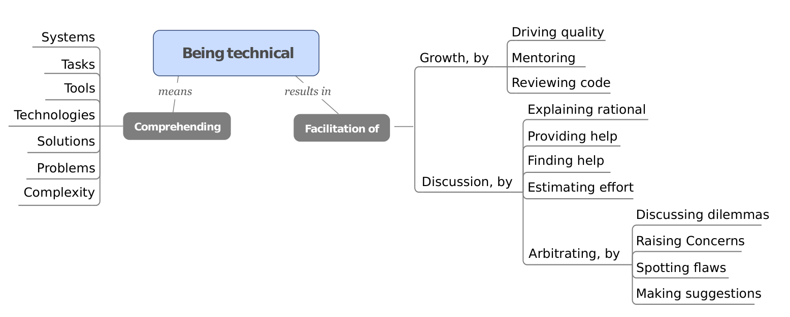

Fig. 2: What participants described falls under being technical

> “I pose a question like ‘hey, here are some of the challenges our business is facing, how do you think you can help in these respects? Here are some seeds of lines of thinking, but help us to come up with a strategy together, what are things we can do to get there.’” [P13]

## 6 BEING TECHNICAL

The attribute of “being technical” emerged consistently in the interviews, but in an unexpected way that warranted more careful examination.

By the respondents’ account the engineering manager, as a rule, does not produce technical output, i.e. does not write code. In fact, respondents were explicit about a great engineering manager not making technical decisions; rather the engineers do.

What, then, is the role of technical knowledge for an engineering manager? According to the interviewees, a technical engineering manager:
- is respected by the team,
- may be more vigilant about quality issues,
- would be a fair evaluator of the engineers’ work,
- empathizes with engineers and clears their path to execution, and
- would represent the team better, both to other teams and to upper management.

We noticed all interviewees using the same, albeit abstract, lingo of the engineering manager “being technical”. To address the possibility that the interviewees meant different things concealed by the use of the same term, we contacted them and asked them to clarify what “being technical” meant for them. We heard back from 25 interviewees. The overlap in their responses signals they originally meant similar things; we mind mapped their input in Figure 2. “Being technical” was described in terms of what the engineering manager should be in a position to comprehend, and how it helps.

The engineering manager needs to have enough technical knowledge to understand the engineers’ work, the tools and technologies they are working with, and the system they are building (languages and frameworks were the most cited examples of technologies). The engineering manager should also understand the tasks engineers work on, the complexity of problems they report to their manager, and the proposed solutions. With a nuanced view of the engineers’ work, the engineering manager can facilitate their growth; they mentor and set the standards of quality through code reviews and feedback.

Comprehension also helps the engineering manager facilitate discussion of approaches to implementation, or what to build next. An engineering manager with enough technical knowledge can explain the rationale between alternatives, and ask the right questions about why one is preferable to another.

Engineers often encounter design dilemmas [74], and discuss them with the engineering manager, who is expected to act as an arbiter. In an iterative process the engineering manager makes suggestions and helps the engineer navigate their way out of the dilemma by spotting flaws and raising concerns. Overall then, “being technical” means that the engineering manager has enough knowledge to hold informed discussions that will help the engineer make decisions. Developers particularly mentioned that having enough knowledge cannot be faked, and that they can tell even from a very brief conversation if someone has enough technical understanding.

> “It is very easy for the engineer to understand if the other person is technical or not. For example I may talk about something that I am working on and then I will say what I will do and how long it will take. When you discuss there will be some technical details, and they will be unable to say if you need some help or parts from other teams.” [P18]

There is an underlying tension at this point. Engineers at Microsoft (and most companies in the tech industry2) are usually promoted to managerial posts because of their technical excellence; this explains why they find “letting go” challenging as one manager of managers explained.

> “The biggest piece is giving up the need to jump in and do. New managers see this all the time; it may take the engineer 3 days to do something and the manager one. They have to step back and let the other person do it in 3 for the long term success of the team, otherwise that’s not people management. That’s counter-intuitive to someone who was promoted the first time because they were the best technical person on the team. You think as a software company as you move up the most senior person should be the most technical person; that probably is true from an intellect perspective but that’s not how they spend their time.” [P29]

2. http://spectrum.ieee.org/at-work/tech-careers/from-engineer-to-manager-how-to-cope-with-promotion