# Moving from Closed to Open Source: Observations from Six Transitioned Projects to GitHub

Pavneet Singh Kochhar, Eirini Kalliamvakou, Nachiappan Nagappan, Member, IEEE, Thomas Zimmermann, Member, IEEE, and Christian Bird, Member, IEEE

## Abstract
Open source software systems have gained a lot of attention in the past few years. With the emergence of open source platforms like GitHub, developers can contribute, store, and manage their projects with ease. Large organizations like Microsoft, Google, and Facebook are open sourcing their in-house technologies in an effort to more broadly involve the community in the development of software systems. Although closed source and open source systems have been studied extensively, there has been little research on the transition from closed source to open source systems. Through this study we aim to: a) provide guidance and insights for other teams planning to open source their projects and b) to help them avoid pitfalls during the transition process. We studied six different Microsoft systems, which were recently open-sourced i.e., CoreFX, CoreCLR, Roslyn, Entity Framework, MVC, and Orleans. This paper presents the transition from the viewpoints of both Microsoft and the open source community based on interviews with eleven Microsoft developers, five Microsoft senior managers involved in the decision to open source, and eleven open-source developers. From Microsoft’s perspective we discuss the reasons for the transition, experiences of developers involved, and the transition’s outcomes and challenges. Our results show that building a vibrant community, prompt answers, developing an open source culture, security regulations and business opportunities are the factors which persuade companies to open source their products. We also discuss the transition outcomes on processes such as code reviews, version control systems, continuous integration as well as developers’ perception of these changes. From the open source community’s perspective, we illustrate the response to the open-sourcing initiative through contributions and interactions with the internal developers and provide guidelines for other projects planning to go open source.

Index Terms—Empirical Study, GitHub, Open-source, Microsoft

## 1 INTRODUCTION
Open source software systems have seen significant growth over the past few years. Open source software (OSS) development follows a somewhat different way of building and deploying software systems ranging from small to very large scale, with contributors spread out in different parts of the world. Over the past two decades or so, OSS development has produced several high-quality projects such as the Linux operating system, Mozilla browser, MySQL database system, and Hadoop framework. Social coding websites such as GitHub, which has over 26 million users and more than 74 million repositories, provide a new way for developers to collaborate. GitHub’s user-friendly interface and its wide adoption by millions of users has attracted even large software organizations to adopt it as their development platform.

Recently, large software companies like Microsoft, Google, and Facebook have joined the open source community and have open sourced some of their proprietary software such as Microsoft’s ASP.NET framework, Facebook’s React JavaScript library [1], and Google’s Android platform.

The reasons often cited by these companies include fostering innovation, engaging the community, and additional benefits for the organization as well as the community [2], [3]. There have been several studies which investigate open source development models and their attractiveness to developers (see [4], [5] for a small sample). Hauge et al. cite several ways that organizations can adopt OSS, such as deploying OSS products within the company, adopting OSS software development practices, participating in external open source projects, and providing their own projects to the community [6]. However, there is lack of research exploring the reasons for making proprietary software open source, the engineering challenges during the open sourcing process, developers’ views before and after the transition, and the OSS community’s response to the open-sourcing of a project by a large organization. To fill this gap, this paper aims to help understand the reasons to open-source, the transition process, challenges, and learnings from a qualitative and quantitative perspective to expand our knowledge for the whole transition process. In this study, we investigate the transition of six projects developed at Microsoft: CoreFX, CoreCLR, Roslyn, Entity Framework, MVC, and Orleans.

We follow a three-pronged approach: a) Interviews — We interview senior managers who were involved in the decision-making process of open sourcing these projects and the internal and external (Non-Microsoft) developers who have actively contributed to the project. b) Survey — We survey all the internal developers working on these open sourced projects to validate our findings from the interviews. c) Quantitative Analysis - We perform quantitative

- P. S. Kochhar is with the Singapore Management University, Singapore, 178902. E-mail: kochharps.2012@smu.edu.sg.
- E. Kalliamvakou is with University of Victoria, BC V8P 5C2. E-mail: ikalliam@uvic.ca.
- N. Nagappan is with Microsoft Research, Redmond, WA 98502. E-mail: nachin@microsoft.com.
- T. Zimmermann is with Microsoft Research, Redmond, WA 98502. E-mail: tzimmer@microsoft.com.
- C. Bird is with Microsoft Research, Redmond, WA 98502. E-mail: cbird@microsoft.com.

---

TRANSACTIONS ON SOFTWARE ENGINEERING, MANUSCRIPT ID  
TABLE 1: Projects Description (Data collected from the projects’ open-sourcing initiative until August 16, 2018)

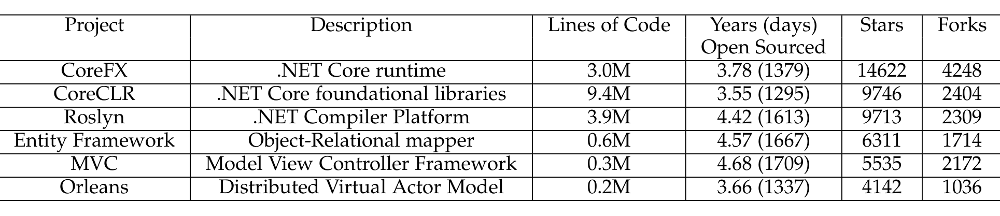

> **Image description:** A tabular summary of the six Microsoft projects analyzed (CoreFX, CoreCLR, Roslyn, Entity Framework, MVC, Orleans) showing each project’s one-line description, estimated lines of code, time since open-sourcing (years and days), and GitHub popularity metrics (stars and forks) as of the study. CoreCLR is the largest by code (9.4M LOC) while CoreFX (3.0M) and Roslyn (3.9M) are also substantial; the smallest are MVC (0.3M) and Orleans (0.2M). By community attention CoreFX had the most stars (14,622) and forks (4,248), followed by CoreCLR and Roslyn with roughly 9.7K stars each; Orleans had the fewest stars (4,142) and forks (1,036). The projects had been public for about 3.5–4.7 years (1295–1709 days) at the time the data were collected (through August 16, 2018).

Analysis to analyze the contributions from developers as well as members of the community (who we call external developers).

This paper makes the following contributions:
- We provide a qualitative and quantitative analysis of the transition of projects from closed source to open source.
- We identify the motivations for the decision to make the transition.
- We describe the challenges faced, the process changes required, and the developers’ perceptions during the transition.
- We present an in-depth discussion of both closed source and open source features from the developers’ perspectives and provide guidelines for projects planning to go open source.

The structure of the remainder of this paper is as follows. In Section 2, we explain the methodology. We present the transition reasons in Section 3. We discuss the transition process and its outcomes in Sections 4 and 5. In Section 6, we describe the community response. We give suggestions for teams planning to move to open source and threats to validity in Section 7. Related work and conclusion are presented in Sections 8 and 9.

## 2 METHODOLOGY

In this section, we discuss our interview and survey methodology. Table 1 gives the description of projects in our dataset. We selected these projects as they are big in size, have significant history before and after the transition, and have been actively followed and forked by developers on GitHub. Figure 1 shows the overall process of our study.

### 2.1 Internal Interviews

Protocol. For interviews, we want to explore the reasons for the transition, the changes during the transition process, and the outcomes. The interviews were conducted into two phases: (1) Microsoft developers working on the projects and (2) senior Microsoft managers involved in the decision to open source the projects.

In the first phase, we interviewed Microsoft developers who had the highest number of commits in their respective projects. We used the git logs for each project to extract the number of commits made by each developer to the respective project. We emailed these developers to invite them to interviews. The authors personally interviewed these developers.

Each developer went through a semi-structured interview, structured in two parts. In the first part, the interviewer asked a few demographic questions such as total work experience at Microsoft and any prior experience with open source projects. In the second part, the interviewer asked a broad set of questions to better understand the transition process when the project moved from being closed source to open source. The high-level questions included the following:
- (a) How was the transition process?
- (b) What were some of the things developers had to do prior to the transition?
- (c) What were some of the process changes due to transition?
- (d) What are some of the positives and negatives about the system after the transition?
- (e) How has been the response of the open source community?

The developers were encouraged to talk in detail about any question or any parts of the transition our questions did not cover. Before concluding the interviews, we asked developers about any suggestions or learnings they would like to give to other project teams which are planning to transition to open source. We also asked developers to identify a senior manager who was involved in the decision making to open source the project. Interviews lasted approximately 30 minutes and the audio was recorded and later transcribed.

In the second phase, we contacted the managers who played a key role during the process before and after the transition as identified by the developers. These managers also regularly interacted with the senior management at Microsoft. Our main focus with these interviews was to understand the reasons behind open sourcing these projects. We let the interviewees talk in detail about the reasons for the transition. Interviews lasted approximately 20 minutes and the audio was recorded and later transcribed.

Participants. In the first phase, we interviewed eleven developers, each working on one or more of the six projects we investigated. The average experience of these developers at Microsoft was 8.36 years. For the second phase, we interviewed five senior managers. These developers and managers cover all the six projects (some worked on both CoreFX and CoreCLR). Table 2 and 3 show the demographics of internal participants from various projects.

Data Analysis. After the interviews, we coded all the transcripts. For each interview, we generated cards containing the key points. We then performed open and axial coding. Open coding involves reading the data several times and creating conceptual labels for segments of data to denote the concept they represent. Axial coding involves

---

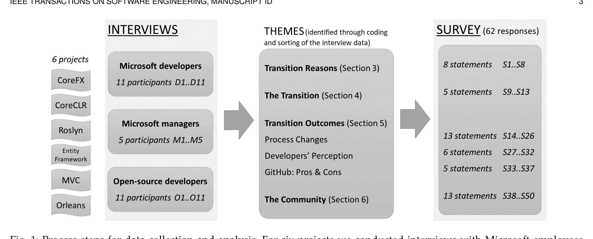

> **Image description:** A left-to-right flow diagram showing the study’s data collection and analysis. The left column lists the six Microsoft projects analyzed (CoreFX, CoreCLR, Roslyn, Entity Framework, MVC, Orleans) feeding into interviews: 11 Microsoft developers (D1–D11), 5 Microsoft managers (M1–M5), and 11 external open‑source developers (O1–O11). Interview transcripts were coded and sorted into four overarching themes (center box) — Transition Reasons (Sec. 3), The Transition (Sec. 4), Transition Outcomes (Sec. 5, with subtopics Process Changes, Developers’ Perception, GitHub: Pros & Cons), and The Community (Sec. 6) — which then informed a survey. The right box shows the survey (62 responses) and the statement groups used to validate interview findings: 8 statements (S1–S8), 5 (S9–S13), 13 (S14–S26), 6 (S27–S32), 5 (S33–S37), and 13 (S38–S50).

Fig. 1: Process steps for data collection and analysis. For six projects we conducted interviews with Microsoft employees and Open-source contributors. With open and axial coding and card sorting we identified four themes: transition reasons, the transition, transition outcomes, and the community. We followed up on the results from the interviews with a survey.

### TABLE 2: Demographics of internal developers

| Participant ID | Project                        | Experience in Microsoft (years) |
|---------------:|-------------------------------:|--------------------------------:|
| D1             | CoreCLR, CoreFX                | 14                              |
| D2             | CoreCLR, CoreFX                | 6.5                             |
| D3             | CoreCLR, CoreFX                | 5                               |
| D4             | Entity Framework               | 3                               |
| D5             | CoreCLR                        | 9                               |
| D6             | Roslyn                         | 1.5                             |
| D7             | Roslyn                         | 8.5                             |
| D8             | CoreFX                         | 9                               |
| D9             | Entity Framework               | 8.5                             |
| D10            | Entity Framework               | 15                              |
| D11            | Orleans                        | 12                              |

### TABLE 3: Demographics of internal managers

| Participant ID | Project         |
|---------------:|-----------------|
| M1             | Entity Framework |
| M2             | Roslyn          |
| M3             | Orleans         |
| M4             | CoreCLR         |
| M5             | MVC             |

## 2.2 External Interviews

We conducted interviews with external developers after our interviews with Microsoft employees. Our aim was to gauge the community’s perspective beyond what was captured on social media and forums. To that end, we invited participants to share with us their experience of collaborating with Microsoft development teams and being part of discussions on the projects’ direction.

As the purpose was to explore the community’s view, we aimed to conduct a round of interviews with two external developers per project to determine, after analysis, if performing data analysis to adjust further data collection is common in exploratory qualitative studies [7].

**Protocol.** We opened the interviews by asking basic demographic questions. We then asked interviewees about their motivation to contribute to the Microsoft project of their choice, and how they discovered the project had been open sourced and hosted on GitHub.

Regarding their own contribution, interviewees described any challenges they faced and whether the challenges had been addressed. Given our insights from Microsoft developers that some projects had changed their build and testing processes as part of open sourcing, we asked the external developers if they had observed any changes during their contribution time. We also asked the interviewees to comment on their perception of the project’s code quality, and how they have seen the community’s contributions impact the project.

We then proceeded to ask interviewees their impressions from participating in project discussions; giving us examples of good and bad discussions they had seen or taken part in. To gauge impressions, we asked the external developers if and how their experience of contributing to the Microsoft projects has changed their view of Microsoft, or the community. Finally, we concluded the interview by asking participants if they would like Microsoft to change something in the process it is following for the project they contribute to. To ensure our understanding we prompted

identifying relationships among the codes or the process of forging links between a category and its emerging subcategories. All the authors were involved in the coding process. Initially, cards were divided among the authors and each card was read and assigned to an existing category or a new category was created. After all the cards were categorized, a second pass was done together by all the authors to make sure cards are correctly categorized and category names aptly represent the cards under it. The categories were not predefined but rather chosen during the card sort and were used to define the headings of various sections: Transition Reasons (Section 3); The Transition (Section 4); Transition Outcomes (Section 5), Process Changes (Section 5.1); Developers’ Perception (Section 5.2); GitHub: Pros & Cons (Section 5.3); and The Community (Section 6).

---

TRANSACTIONS ON SOFTWARE ENGINEERING, MANUSCRIPT ID

### Table 4: Demographics of external developers

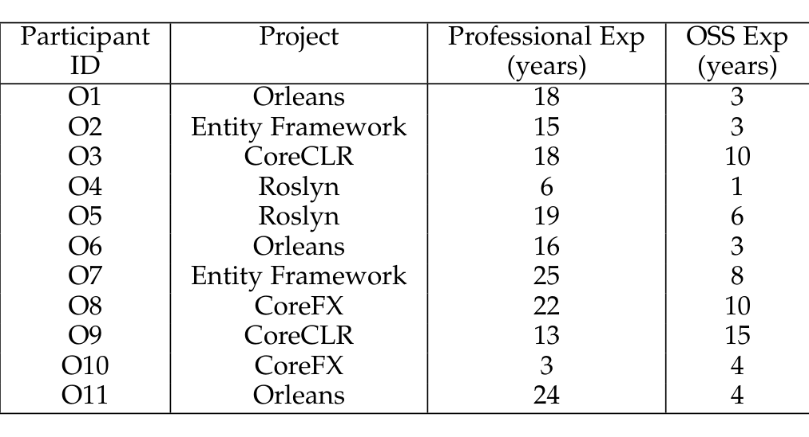

> **Image description:** Table of 11 external interviewees (Participant IDs O1–O11) listing the project they contributed to (Orleans, Entity Framework, CoreCLR, Roslyn, CoreFX) and two experience columns: Professional Exp (years) and OSS Exp (years). The sample includes 3 contributors for Orleans and 2 each for Entity Framework, CoreCLR, Roslyn and CoreFX. Professional experience ranges from 3 to 25 years (mean ≈16.3, median 18), while OSS experience ranges from 1 to 15 years (mean ≈6.1, median 4), with several participants (e.g., O3, O8, O9) reporting particularly high OSS exposure (10–15 years). These values summarize the varied seniority and open-source backgrounds of the external developers interviewed for the study.

the interviewees to provide concrete examples throughout the interview, as relevant.

Interviews were conducted online; they lasted from 45 minutes to an hour and were recorded with the interviewee’s permission. 3 out of the 11 interviewees submitted their responses to the interview questions in writing and provided clarifications and examples in follow-up emails.

**Participants.** All interviewees in this part of the study were external developers. We invited them via email. We built our participant pool gradually, sending invitations to batches of 3 to 5 external developers in a project at a time, adding a batch if we didn’t get responses.

Since the aim of the interviews was to understand the community’s perspective on collaborating with Microsoft, we primarily invited external developers with high levels of contribution. However, we also sent invitations to casual external developers, who had contributed at earlier stages or had only made a few commits.

For each of the six projects, we used the contribution information in the GitHub repositories as well as git logs to identify external developers with high and low levels of committing activity, disregarding Microsoft employees. Replies to our invitations came from 9 external developers with high activity in the projects they contributed to, and 2 external developers that contributed casually. We were unable to recruit interviewees from the MVC project, but reached saturation after analyzing the 11 interviews covering the remaining 5 projects. Table 4 provides demographics of the interviewees from the six projects. Participants had on average 16 years of professional experience as developers, and 6 years of experience contributing to open source projects. The majority (8 participants) were employed as software or IT engineers, while 2 participants were Chief Technology Officers and 1 was a .NET consultant.

**Data Analysis.** The recorded interviews were transcribed. We used thematic analysis techniques [8] to process the interview data. We first grouped our data assigning codes that matched areas covered by the interview questions (e.g. motivation, discoverability, challenges, impressions etc.). We refined the coding scheme by adding codes to account for emerging aspects and performed an open card sort [9] to further combine or split codes into themes.

### 2.3 Survey

**Protocol.** Based on our findings from the interviews, we created a survey to validate and further understand the reasons behind the transition, the work involved before

and after, the outcomes, and the community response. Our survey aimed to quantify the qualitative responses from the interviews.

We followed Kitchenham and Pfleeger’s suggestions for designing surveys [10]. We kept the questions optional to encourage respondents to complete the survey, without them feeling forced to answer every question. The survey had 8 statements about the reasons for transition, 7 statements about the prior steps to transition, 27 related to transition outcomes (process changes, developer perceptions, GitHub pros & cons), and 13 statements about the community response. For Likert scales we used Strongly Agree, Agree, Neutral, Disagree, Strongly Disagree, and Not Applicable. We also collected demographic information such as total experience at Microsoft. The survey was anonymous.

**Participants.** We surveyed all the Microsoft developers working on the six projects. We found their information from the git logs and invited the developers who had committed to these projects to participate in our survey.

We piloted our survey before sending it to 192 developers in Microsoft. We received 8 out of office responses and 62 developers completed the survey. However, 14 of them expressed that they were not part of the team when the project was open sourced. We excluded these responses from our analysis. Thus, our response rate was 26.09%. The average experience of these respondents at Microsoft was 9.33 years and only 22.92% of the respondents had prior experience of contributing to open source projects outside Microsoft.

**Data Analysis.** We analyzed the distribution of Likert responses and for each hypothesis, we present the percentage of respondents that belong to each category - Strongly Agree, Agree, Neutral, Disagree, Strongly Disagree and Not Applicable, respectively, in Table 5(a)-(f). Whenever we present survey results, we give reference to Table 5, for example, (S6) refers to the hypothesis “To help find and hire potential employees.”

## 3 TRANSITION REASONS

In this section, we describe the primary reasons reported in the study regarding open-sourcing the six projects. Table 5(a) shows the list of transition reasons and the corresponding survey responses.

**a) Vibrant Community:**  
Historically, all six projects were developed within the organization and the vast majority of external users used to consume those products. By excluding these potential open source developers from the discussions, the projects were missing out on valuable feedback and experience that external developers can bring with them. While there were people active in the community, there was a significant barrier to contribute. To ensure that Microsoft is developing the right product for its customers, it was considered important to involve community members. A respondent mentioned:

> “The community is one part of making sure that we are delivering the best value to our customers.” (M2)

Suggestions from the community members can provide directions to the technology/product. “Those guys don’t represent the whole community but they are the ones who set the trends. They can tell you the

---

IEEE Transactions on Software Engineering, Manuscript ID 5

TABLE 5(a): List of hypotheses and survey responses (in %). SA - Strongly Agree, A - Agree, N - Neutral, D - Disagree, SD - Strongly Disagree

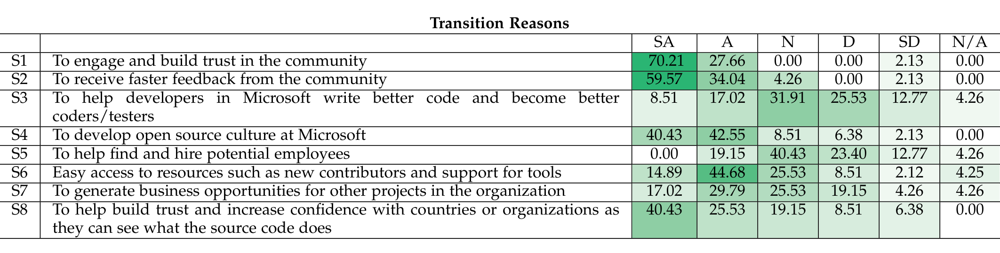

> **Image description:** A table of survey percentages (columns SA, A, N, D, SD, N/A) for eight hypotheses (S1–S8) about why Microsoft projects were open-sourced. The strongest endorsements are S1 “To engage and build trust in the community” (70.21% Strongly Agree, 27.66% Agree — ~97.9% combined) and S2 “To receive faster feedback from the community” (59.57% SA, 34.04% A — ~93.6% combined). Other notable results: S4 “To develop open source culture” has 40.43% SA and 42.55% A, while S6 “Easy access to resources (new contributors/tools)” is mainly Agree (44.68%) with 14.89% SA. In contrast S3 “To help Microsoft developers write better code” and S5 “To help find and hire potential employees” received much weaker support (S3: 8.51% SA, 17.02% A; S5: 0% SA, 19.15% A with 40.43% Neutral), indicating these were less-consensual motivations among respondents.

way to design software to be fruitful and productive. You should go in this direction and they set the standards for everyone else to follow." (M1) Ultimately, involving open source developers helps in overall growth of the community.

Furthermore, open sourcing the code can help external developers have a say as well as help companies build trust with users and developers, which is likely to attract more contributors. One manager indicated that such a strategy allows "To make ourselves one with the community and participate more." (M1). Over 97% of the respondents agree that the project was open-sourced to engage and build trust in the community (S1).

### b) Prompt Answers:
With the emergence of platforms like GitHub, the open source community has been growing at a rapid pace. Developers get exposure for their projects and can receive comments from the community early on regarding new features. As expressed by Eric Raymond, "Given enough eyeballs, all bugs are shallow" [11], meaning in this case that developers internal to an organization might not be able to solve all the issues, whereas putting code in the open will expose the issues to the community which can help find and solve bugs faster. "By getting this in front of them early on, they can catch this stuff to make sure we are not making any big mistakes. Some of our best bugs come from the community." (M2). More than 93% agree or strongly agree that open-sourcing helps in receiving faster feedback from the community (S2).

### c) Better Code, Better Coders:
Open-sourcing projects exposes developers to new toolsets and fresh ideas from the community. Internal developers communicate with external developers on a regular basis: "We have gotten really close to a lot of these guys in the community." (M2) Eventually, this helps internal developers do things which they might not have thought before and helps make the community stronger. "It made my team better coders and better testers." (M2) This not only benefits the product and improves its scope but also opens up career opportunities for the developers. Thus, better developers will help write better code and build products which matter to the community.

### d) Develop Culture:
Developers working on open source projects can act as agents of change to adopt open source processes and tools [12]. Some of our interviewees had experience at different organizations where they were involved in open sourcing their products. As a result, they sought to develop an open source culture within Microsoft. Furthermore, to open source more products in the future, it is imperative that a culture needs to be developed within the company. An interviewee mentioned, "To be a better company, we need to move in that direction." (M2). 82.98% of the survey respondents agreed that developing open-source culture was one of the reasons (S4).

### e) Potential Employees:
There are developers in the community who are willing to put in their time and effort to contribute and build good products. By giving an opportunity to these members to contribute, organizations can leverage these connections to hire potential employees. One of our interviewees was an external developer who was hired based on the contributions made to the project: "I came from the community. I was one of the guys that started giving feedback on EF [Entity Framework] before EF was public and I ended up being hired." (M1) The increased exposure that comes with open-sourcing a project, and the need for credibility can also lead to hire talent within the organization. Some of the teams hired developers from other teams. "We have picked up talent internally because of this project" (M4) and rather than following the traditional interview process, developers were given some tasks to be accomplished in the open to give them a feel of what the job would look like, which the interviewee termed as "interview through open source contributions" (M4). If the work the candidates did was satisfactory, they were subsequently hired.

### f) Limited Resources:
Organizations have limited resources in terms of number of developers in the team as well as the amount of time they have to implement something. Open sourcing code provides the opportunity to a large number of community members to contribute and provide valuable feedback. From a company's perspective, hiring good developers takes up significant amount of time, while at the same time there are people in the community who have expertise to accomplish project tasks. A respondent mentioned, "It kills us sometime. We have a really great idea and we can't develop it simply because we don't have enough bodies to do it. We have to do three things well than do five things in a mediocre fashion. The community lets us do five things well." (M2) while another reported, "We don't have the resources to test on different operating systems ... backport to older versions of Linux. We just can't do that with the number of people we have currently." (D3). 59.57% of the respondents agree that open-sourcing can give easy access to resources such as new contributors and support for tools (S6).

---

IEEE TRANSACTIONS ON SOFTWARE ENGINEERING, MANUSCRIPT ID 6

TABLE 5(b): List of hypotheses and survey responses (in %). SA - Strongly Agree, A - Agree, N - Neutral, D - Disagree, SD - Strongly Disagree

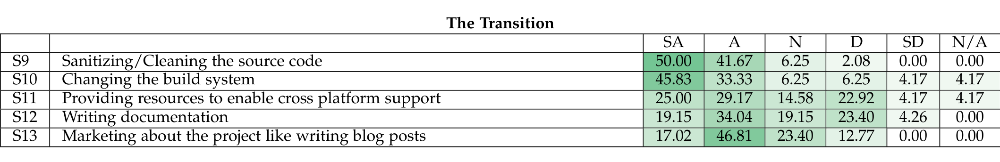

> **Image description:** This table reports survey percentages for five transition activities (S9–S13) across Likert categories (SA, A, N, D, SD, N/A). Sanitizing/cleaning the source (S9) received the strongest endorsement (50.00% SA, 41.67% A, 6.25% N, 2.08% D), followed by changing the build system (S10: 45.83% SA, 33.33% A, with small shares of D/SD/N/A). Providing resources for cross‑platform support (S11) and writing documentation (S12) had more mixed responses (S11: 25.00% SA, 29.17% A, 22.92% D; S12: 19.15% SA, 34.04% A, 23.40% D), indicating notable neutral/disagreement proportions. Marketing the project (S13) was more often rated as Agree than Strongly Agree (17.02% SA, 46.81% A, 23.40% N), suggesting publicity is seen as useful but less critical than code sanitization and build changes.

### g) Business Opportunities:
A project in an organization might bring new customers or business opportunities for other projects when these two projects are somehow interrelated. If an open source project runs on a platform provided by the organization, users of the project would need the platform to run their applications. Thus, open sourced projects can indirectly generate revenue for the organization.

### h) Building Trust:
When a project’s source code is not available freely, it makes it difficult for countries, government agencies and other organizations to trust what the software does. The organizations who are using the software want to ensure that their privacy is maintained especially in the cases of software such as a compiler, which takes in source code and creates binaries. By opening their code to the public companies help build trust, so that other entities are ensured that the confidentiality of their data is maintained. One of the developers quoted, “There are a number of agencies out there who would not pick us up unless they can trust the code base.” (M2). 65.96% agree that the project was open-sourced to help build trust and increase confidence with countries or organizations as they can see what the source code does (S8).

## 4 THE TRANSITION
Open-sourcing a project involves more than uploading the source code to GitHub. We found that teams took many steps during the transition to increase the likelihood of success. This section describes the steps. Table 5(b) shows the various hypotheses for the steps taken during transition.

### a) Preparation for the transition:
**Code, Tools & Documentation:** Since the six projects were being put in the open and anyone would be able to read the code, it was important to sanitize the code to remove confidential or sensitive terms in comments or identifiers. Over 90% agreed that sanitizing was important and as expressed by one of the developers (S9) — “A big part of it is sanitizing the existing source bases.” (D3). Developers emphasized that it is important to make the code readable as it will be easier for external developers to read, understand and contribute to the project. Therefore, it was very important to clean the code. “Lot of it was really cleaning up the code. We wanted to provide a much clearer, more understandable code base” (D11).

Before the projects were open-sourced, developers had to consider aspects of the development process. For example, how do developers build? How do they do basic testing? Developers reported putting in significant amounts of time to get the code and accompanying artifacts ready to be used by open source developers as well. Internally, some projects use MSBuild [13], the Microsoft Build Engine. Development teams had to move to a different build system to facilitate external developers using it together with GitHub. 79.16% of the respondents mentioned changing build system as an important step (S10). One of the developers mentioned, “Bunch of workarounds. Refactor how the source tree is laid out. We used internal MSBuild system. We probably spent about 2 or 3 months ... 5 or 6 engineers from different disciplines getting things ready. Moving to a new build system, changing the layer of the tree” (D2). Open-sourcing also meant that the project team had to provide resources to the community to develop and use the product on different platforms as expressed by a developer — “Lot of work was done to enable cross-platform support.” (D3) and supported by 54.17% of the survey respondents (S11).

Documentation is an important part of supporting developers/users to get an understanding of a project. Good documentation makes it easier for novices as well as experienced developers who would like to build and contribute to the project. Project teams had to put in significant amount of time to ensure that there is proper documentation present with the project. A developer mentioned, “There was quite a bit of effort not to clean the code but writing this documentation. We were reasonably good at that before but there were still lot of gaps in that particularly when it came to the question of extensibility and the framework and you write this type of extension and that type of extension.” (D11). In the survey, 53.19% of the respondents mention writing documentation as an important step during the transition (S12).

**Publicity:** When projects were open sourced, open source developers were given the opportunity to now contribute to the projects they have been using or they would want to use. Therefore, project teams announced the open-sourcing on different media platforms so that open source community knows that Microsoft is trying to engage with it. As one of the developers expressed, “When we open sourced, we wanted it to be a big deal like prepare a blog post so that we can have a media blitz.” (D2). In the survey, 64% agreed that marketing about the project like writing blog posts is an important step before the transition (S13).

### b) Transition to Open source:
Before moving to GitHub, Microsoft had its own open source project hosting site CodePlex [14], which supported the Git version control system. Roslyn and Entity Framework were initially moved to CodePlex before moving to GitHub, whereas other projects were directly open-sourced on GitHub. When projects were in CodePlex only the source code was visible to the external developers whereas most of the tools to build and test the software were internal, which acted as a barrier of entry for developers. Thus, the

---

IEEE Transactions on Software Engineering, Manuscript ID 7

TABLE 5(c): List of hypotheses and survey responses (in %). SA - Strongly Agree, A - Agree, N - Neutral, D - Disagree, SD - Strongly Disagree

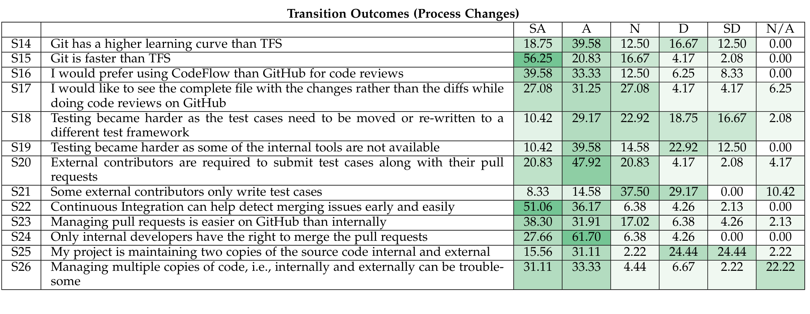

> **Image description:** This table reports Likert-response percentages (SA/A/N/D/SD/N•A) for 13 process-change hypotheses (S14–S26) after projects moved to GitHub, with darker green cells indicating stronger agreement. Key strong agreements: S22 (Continuous Integration helps detect merging issues) had 51.06% SA and 36.17% A (≈87% agree); S24 (only internal developers have merge rights) had 27.66% SA and 61.70% A (≈89% agree); and S15 (Git is faster than TFS) had 56.25% SA and 20.83% A (≈77% agree). Respondents also favored internal code-review tooling over GitHub (S16: 39.58% SA, 33.33% A → ≈73% agree) and required external contributors to include tests with PRs (S20: 20.83% SA, 47.92% A → ≈69% agree). Views were mixed on testing burdens and repository duplication: S18 (tests needed rewriting/moving) shows modest agreement (≈39.6% agree) while S25 (maintaining two copies of source) is split (≈46.7% agree vs. ≈48.9% disagree), reflecting the paper’s discussion about CI benefits, review-tool gaps, and the operational friction of dual internal/external repositories.

contributions from external developers in CodePlex were minimal. Microsoft developers made changes to the internal repository which was replicated to CodePlex. “The changes were actually made on the closed side and replicated to the open and that process was somewhat fragile.” (D1) In contrast, GitHub’s user-friendly platform was seen as potentially better support for the community to contribute. “CodePlex is very buried in the UI like how to submit a pull request whereas GitHub is very first class like ‘Oh fork this project’. They have really good help.” (D4) Also, developers indicated that the large community on GitHub motivated them to move the code base from CodePlex. The open source community shared this view also. An external developer commented, “Choosing to go on GitHub was a big thumbs up, CodePlex was much more difficult to use.” (O1).

Moving code and tests involved transitioning from internal tools to open source tools. Initially, projects only ported the source code and did not accept any changes to ensure that the project doesn’t break. “In the beginning, we moved the product without moving the tests because tests were much more work. In this case, we were not taking any pull request for that code until we have tests on GitHub.” (D5)

Overall, most of the projects had a smooth transition. As one developer put it, “Every single project that I have seen it’s gone very well.” (D3)

## 5 TRANSITION OUTCOMES

This section discusses the transition outcomes, divided into three parts: Process Changes, Developers’ Perception and views of developers about GitHub. The corresponding hypotheses are shown in Table 5(c), 5(d) and 5(e).

### 5.1 Process Changes

#### a) Version Control System:

Prior to the transition, the projects in our dataset used Team Foundation Server (TFS) [15], which is a collaboration platform for application lifecycle management. After the projects were open sourced, they had to move to Git, which is the basis for GitHub. TFS is a centralized version control system (CVCS), whereas Git is a distributed version control system (DVCS). As Muslu et al. [16] point out, DVCSs have a high learning curve but provide significant benefits such as the ability to work offline and managing multiple contexts. Developers echoed a similar sentiment: “There is a learning curve but once you get past that, it works a lot smoother” (D3) and was agreed by more than 58% of the respondents (S14). 77% of the survey respondents agreed that Git is faster than TFS (S15) and a developer mentioned: “We like it a lot because it [is] just faster and more decoupled system. There are many level and tiers in which you can work. You can work on the bus, on the plane. You just sync your stuff later. It's just that flexibility helps us.” (D1).

#### b) Code Reviews:

Microsoft developers use CodeFlow, an internal tool, to perform code reviews. Since CodeFlow only partially supports GitHub, code reviews may become a challenge for developers. A developer mentioned: “I’m still missing code review tools. CodeFlow doesn’t work with GitHub. It can read from GitHub but the comments I post don’t go to GitHub and that’s not useful.” (D6). Over 72% of the respondents preferred CodeFlow over GitHub for code reviews (S16). GitHub provides a simple user interface and it is good for small reviews but doesn’t perform well for large reviews. As one of the developers mentions: “Code reviews it’s a mixed bag. We do basically all our code reviews now on TFS through the pull request workflow. For small changes it’s much better just because they come in quickly, you can review them on your phone, and you just hit the merge button and that’s really great. For larger changes GitHub UI doesn’t seem to be designed for CodeFlow like in-depth code review. I wish that we had something like CodeFlow that could talk to TFS for more in-depth stuff” (D2). Furthermore, GitHub only shows the diffs of changes made to the code rather than the entire file which makes it harder for developers to understand the context in which these changes were made. Being able to see the file with marked changes would make it much easier to understand and analyze the changes. A developer quoted, “It tends to put it as a diff so you get these little windows on the changes and sometimes it is really hard to see what the context of this overall change.” (D11). More than 58% of the respondents mention that during code review they would like to see the complete

---

file with changes instead of diffs (S17).

### c) Testing:
Microsoft developers use internal tools for testing applications. As these are proprietary tools which were not open sourced along with the project, developers had to switch to open source tools such as xUnit. Developers reported that testing became harder as they had to move or rewrite the test cases to a new framework. Almost half of the respondents agreed that testing became harder (S19) and a developer opined: “We internally had our own test framework. We have moved to xUnit. We basically do all of our unit testing through xUnit.” (D2). When a project is open sourced, it is harder to perform similar testing as when done internally in the organization, due to unavailability of resources. A developer mentioned: “The big thing that you lose at least for developing externally is that you lose a big portion of testing. We just can’t move all the CoreCLR testing over. It will take a lot of time to build that stuff up to the point where we can look at a product outside and can say this is good enough to ship based on the testing that exists externally. A lot of time we spend building up these tools that move the code back into TFS and test it using the old processes, which is inefficient and prone to error.” (D3)

Resources such as introducing a test framework, showing example test suites, or providing learning materials to first-time contributors can help in communicating the testing culture of the project [17]. Over 68% of the developers agree that they had a good culture where everyone (internal or external developer) had to submit unit tests along with their pull request (S20). “If you send a pull request without adequate testing, we are not going to take it even internally. So, when we went open source, we just expected that from our contributors” (D4). This corroborates previous research where existence of testing code in the pull-request is considered as a positive signal and project integrators are more likely to reject pull-requests that do not have test cases [18], [19]. The interviewees reported that if the project team felt that there was a need for additional testing, they would assign a developer to thoroughly test the changes. Furthermore, there were developers who planned to make changes in the long-term but are currently focused only on testing. “There are external contributors who do primarily test. They plan to do changes to the code, but they agree it would not be comfortable to do changes without adequate tests” (D1). This was echoed by a community member, “a lot of the testing stuff was done from another contributor, the dashboard which is still sitting off of the Orleans contributions has become so useful most of our QA staff have to use it all the time.” (O1)

### d) Continuous Integration:
Continuous Integration (CI) is a development practice that requires developers to integrate their working copy of the code with the main repository several times a day [20]. Each check-in is automatically tested before merging, which helps developers detect issues early. Using CI, the development teams can effectively manage pull requests; reject fewer pull requests from external developers and find errors quickly and more easily [21]. 87.23% of the respondents agreed that CI can help detect merging issues early and easily (S22). Developer D5 mentioned, “It’s because we have this CI which is checking every single pull request. Before you even check in, you would know if this request is OK or not. It’s much easier to see if it was your fault or someone else’s.” Projects using CI on different operating systems can check if their project is running on all these platforms. “We are running continuous integration on Windows, Linux, and Mac. Now, we are more certain that it works well because it runs on all these systems.” (D6)

### e) Code Check In:
Projects have moved to GitHub’s pull request mechanism, where everyone on the team, internal or external, follows the same procedure. GitHub’s pull request mechanism provides increased opportunities for community engagement and reduces time to incorporate contributions [22]. Over 70% of the developers expressed that they liked how easy managing pull requests is on GitHub (S23). When a developer submits a change, people discuss if the PR should be accepted or if any changes need to be made. Using this procedure, developers get varied and timely opinions about the change. If there are no issues, two senior Microsoft employees who are part of the project team need to provide approval. This is done to ensure that the change satisfies the project guidelines and does not break the original product. A developer mentioned, “Even inside the team we have an agreement that a pull request must be OKed by two senior members before it goes in. There must be reasons to bypass that. It’s not enforced but everyone tries to play within these rules unless there are reasons.” (D1). An external developer commented, “It was clearer what the issues are and who is working on them, and easier to submit pull requests. Back in CodePlex, when people submitted pull requests, they just got closed, and the Roslyn people would get the changes and put them in the internal tools and publish that back to the CodePlex repo. In GitHub, they just merge the pull requests.” (O4)

### f) Multiple Copies:
Some projects maintain two copies of the code i.e., the GitHub one and the internal one. The changes take place in one of the repositories and are mirrored to the other repository automatically. “We have two copies of the code: internal one and the public part of the code” (D5). This can create issues as developers need to ensure that both copies are properly updated at all times. Apart from code, some teams are also duplicating other items such as tracking bugs internally and externally, since moving all the previously logged bugs is difficult. Thus, developers have to manage both tracking systems. A developer mentioned, “Historically, we had lot of bugs in TFS. We ported some of them and still some of them are in TFS. We are still managing bugs in two different universes.” (D8)

## 5.2 Developers’ Perception
During the interviews, developers expressed their views of the transition process and its impact on them. We present the perceptions of developers in this section.

### a) Simple Build:
Before open-sourcing, the six projects used internal build systems such as MSBuild. Developers wanted a simple build procedure which makes it easier for community members to contribute. A developer mentioned: “We just wanted simple self-contained build as vanilla as possible like File → New Project. We had that setup beforehand. I would actually wish that more people would stick to the vanilla stuff like what most of our

---

IEEETRANSACTIONS ON SOFTWARE ENGINEERING, MANUSCRIPT ID 9

TABLE 5(d): List of hypotheses and survey responses (in %). SA - Strongly Agree, A - Agree, N - Neutral, D - Disagree, SD - Strongly Disagree  
Transition Outcomes (Developers’ Perception)  
SA | A | N | D | SD | N/A

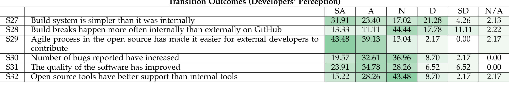

> **Image description:** The table lists survey statements S27–S32 about developers’ perceptions after open-sourcing and shows the percentage of respondents in each Likert category (SA, A, N, D, SD, N/A). Strongest consensus is on S29 ("Agile process...easier for external developers"): 43.48% strongly agree and 39.13% agree (82.61% combined). S27 ("Build system is simpler") has majority agreement (31.91% SA, 23.40% A → 55.31%), while S31 ("The quality of the software has improved") is also viewed positively (23.91% SA, 34.78% A → 58.69%). S30 ("Number of bugs reported have increased") is split but leans toward agreement (19.57% SA, 32.61% A → 52.18%), whereas S28 ("Build breaks happen more often internally than externally on GitHub") has many neutrals (44.44%) indicating uncertainty. S32 ("Open source tools have better support than internal tools") shows a plurality neutral (43.48%) with roughly equal smaller shares agreeing (15.22% SA, 28.26% A) and disagreeing, reflecting mixed views on tooling support.

customers do. They don’t write these crazy MSBuilds, libraries such as all these awesome stuffs. It’s useful but I think it can be a bit of a barrier” (D4). 55.31% of the respondents mention that the build system now is simpler than the internal one (S27). TFS also has an automated build engine which was used by the project teams to build the project. As developers moved to a simple build system on GitHub, build breaks became less frequent. “Internally, the build breaks happen much more often. I would say much, much more often. I saw only like three build breaks on GitHub” (D5).

### b) Agile Process:
After the six projects were open sourced, they adopted the agile development methodology [23], which makes the development process faster and encourages flexibility. A significant percentage (82.61%) of developers agreed that the agile process made it easier for external developers to contribute to the project (S29). “I think it’s definitely a big benefit for us. Partially, because our toolset has changed and the new model is more agile than before which is [an] indirect effect of open source.” (D1).

### c) Bug Quality:
As open source developers have access to the source code, there are more people looking at the code which increases the chances of finding bugs. Developers reported that the quality of bugs filed by community members has increased. “I think there are more bugs reported” (D5), while another said, “Basically the turnaround and quality of bugs is clearly [an] improvement from open source” (D1), as supported by over 58% of the respondents (S31). Furthermore, there were high-quality bug fixes as one community member expressed, “I saw some high quality fixes. It is hard to imagine these huge technologies being re-written from scratch and being at the level of stability they are now without those bug fixes.” (O2)

### d) Code Quality:
As more people are reviewing the code, there is potential for higher code quality as well. As expressed by one of the external developers, “there won’t be a difference in quality between something that was contributed by community or something implemented internally..., because everything gets reviewed together by MS developers and also by community members, so you get this 4-eye check on every single change.” (O6). Similar views were expressed by Dabbish et al. [24], i.e., projects which get more attention are of higher quality. Microsoft developers also ensured that the code has comments and follows coding standards to make it easier for external developers to contribute as well as maintain the high-quality code on GitHub. An external developer pointed out, “I think the software has proven to be overall of very good quality. The code had comments and follows coding guidelines, and the coding standards used are popular. When I contributed, I tried to keep the same standards and conventions myself.” (O11)

Developers inside organizations often face schedule constraints as they have to work under strict deadlines and deliver high-quality product to the customers. This leaves little time for them to perform code cleanup, which would increase the readability of the code. Organizations can leverage the strength of the open source community as there are large numbers of developers available who can contribute without the pressure of the same time constraints. A developer mentioned: “Letting the community take the low hanging fruit, I think it’s a benefit. We have had people who have done cleanup on our comments or clean up in the code or I ran a static analyzer and I found a bunch of warnings and I fixed them. From a business point of view, that doesn’t have a benefit but as a dev I think our codebase health is improving and we have a bunch of people who want to make little improvements.” (D2)

### e) Increased Developer Awareness:
The open source development community uses a wide array of tools for development and testing software. When a project is open sourced, it exposes internal developers to tools they may not use within the organization. Peer interaction, such as recommendation or observations, can help developers discover and adopt new tools [25], [26]. Thus, the transition helps make developers aware of available tools and provides opportunity to experiment with these tools. A developer mentioned, “Moving to open source world was [an] eye opening experience to alternative tool chains and some of them are better like the whole process of accepting pull requests. Initially, it was reserved for third party contributions but now we all go through pull requests because it’s just easier.” (D1)

### f) Tool Support:
Some open source tools have a large user base, which increases the support for these tools in terms of new features, improving the existing ones or finding bugs. With such community support tools are modified to run on various systems and platforms. One developer commented, “The open source workforce is standardized and several tools which are well-known. If they are not maintained by us, they are maintained by somebody because they are publicly released” (D1) while another commented “It is very unusual where open-source infrastructure breaks whereas closed source is fragile and complicated” (D1). However, developers also expressed their dissatisfaction about some internal tools which are not available in the open source world.

### g) Discoverability:
When any of the six projects was open-sourced, Microsoft announced it on several mediums such as Hacker News, Reddit, Microsoft Build etc., which made it easier for

---

IEEETRANSACTIONSONSOFTWAREENGINEERING,MANUSCRIPTID 10

TABLE 5(e): List of hypotheses and survey responses (in %). SA- Strongly Agree, A- Agree, N- Neutral, D- Disagree, SD- Strongly Disagree

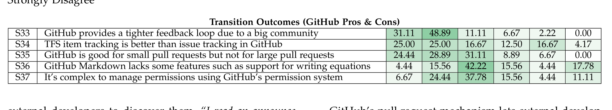

> **Image description:** The table reports percentage distributions for five hypotheses about GitHub (S33–S37) across Likert categories: Strongly Agree, Agree, Neutral, Disagree, Strongly Disagree, and Not Applicable. S33 (“GitHub provides a tighter feedback loop …”) shows strong support: 31.11% strongly agree and 48.89% agree (≈80% combined). Views are more mixed for S34 (TFS bug tracking is better): 25.00% strongly agree, 25.00% agree but also 16.67% strongly disagree and 12.50% disagree. S35 (GitHub good for small but not large PRs) has a majority leaning toward agree (24.44% SA, 28.89% A) with 31.11% neutral; S36 (Markdown lacks features) and S37 (permissions are complex) show low agreement and large neutral or N/A responses (S36: 42.22% neutral, 17.78% N/A; S37: 37.78% neutral, 11.11% N/A), indicating uncertainty or inapplicability for many respondents.

external developers to discover them. “I read an announcement on either HackerNews or Reddit” (O5), “It was all over the news sites I read. Hard to miss really.” (O9) Several developers were actively following Microsoft on different channels such as GitHub, Twitter, blogs etc. through which they discovered the six projects. “I got interested in the project before so I think I was following Sergei on Twitter and he announced it before it was announced in Build.” (O6) Another developer mentioned, “I was actively following the MS open source thing at the time, so I was subscribed to dotnet logs for years, and I found out through there.” (O2)

### 5.3 GitHub: Pros & Cons

All the projects we investigated in this study were moved and are now hosted on GitHub. GitHub hosts millions of projects and provides various features such as forking a repository, a push-pull mechanism and an issue tracking system. From the developer interviews, we found that there are some GitHub characteristics which developers like, whereas some developers preferred using the internal systems. We discuss these aspects below. Table 5(e) shows the hypotheses related to GitHub pros and cons. Some of these were mentioned in the previous studies [18], [27].

GitHub is known to and accessible by a large community of developers with expertise in different areas. Such an environment increases the likelihood that a hosted project may be successful. GitHub also provides social transparency which promotes increased awareness [24] and makes it easier for teams to find developers with relevant experience as well as help developers in finding projects they would like to contribute to. Teams can get faster feedback which can help them tackle situations such as solving bugs faster. One developer mentioned, “GitHub gives a tighter feedback loop with technically minded individuals in the community” (D2) and was agreed by 80% of the respondents (S33).

GitHub has its own integrated issue tracking system. It provides features such as labels for issues, prioritized issues, voting, and closing issues from commit messages. The projects we studied were using TFS to manage bugs before open-sourcing. Developers reported that GitHub issue tracking is not as powerful as the one in TFS – especially when there is a large number of bugs – and prioritization is easier in TFS. A developer mentioned:

> “Bug management is not as good as we used to. What GitHub provides issue tracking/bug management is different and so far doesn’t seem to be as powerful. It’s good for everyday. But when you have to do triage, you have to sort through hundreds of bugs and figure out what action needs to be taken and who will address them and when and how. The tools are not as powerful.” (D1)

50% of the respondents agreed that TFS item tracking is better (S34) and similar views were expressed by professional developers using GitHub for commercial projects [12].

GitHub’s pull request mechanism lets external developers contribute to the project by pushing changes to a repository. The project team can review the changes submitted, give suggestions and push code to the repository. Developers express that GitHub is good when they receive small pull requests but it becomes difficult for large requests. “Gets slow in Chrome if you have big PRs that you are trying to work on” (D2). Over 53% of the respondents agreed that GitHub is good for smaller pull requests (S35).

GitHub provides support for Markdown, which allows users to write using a user-friendly plain text format which is then converted to HTML for viewing GitHub in the browser. Although Markdown was preferable to publishing word documents, it provided limited features as one developer pointed out:

> “The problem is that markdown is very basic. I cannot put equations in it. I can draw some tables but not anything fancy. That kind of limits the way I can make specs more readable and better.” (D6)

GitHub provides a system of giving permissions whereby the developer or team managing the account provides permission to new developers to contribute to the project. Such an authorization system works well when the project is created by an individual developer or a small organization but makes it difficult for large organizations having a large number of open source projects on GitHub. For example, if an organization has 50 projects on GitHub, the account owner has to give permission to any developer joining any of the projects whereas giving rights to individual teams of a particular project would make the process much smoother. One developer mentioned:

> “What we would like is a group of contributors to our project but the way GitHub organization model works, all the control is very flat at the top. To add a person to any list, you have to get the organization owner to make this change for you.” (D11)

## 6 THE COMMUNITY

The open source community has grown in leaps and bounds in the past few years with the evolution of platforms like GitHub. Developers are actively collaborating on different types of projects ranging from test frameworks, operating systems, mobile and web applications, gaming software etc. Organizations are open sourcing their software in order to leverage the strengths of an ever-growing community. One developer mentioned: “You are going to go where the community is. I think a lot of the open source community especially the .NET open source community seems to have adopted GitHub. It made sense to be there.” (D2). More than 93% of the respondents agree that GitHub is the right place due to big community (S38). Table 5(f) shows the hypotheses related to this section.

---

IEEETRANSACTIONS ON SOFTWARE ENGINEERING, MANUSCRIPT ID 11

## TABLE 5(f): List of hypotheses and survey responses (in %). SA - Strongly Agree, A - Agree, N - Neutral, D - Disagree, SD - Strongly Disagree

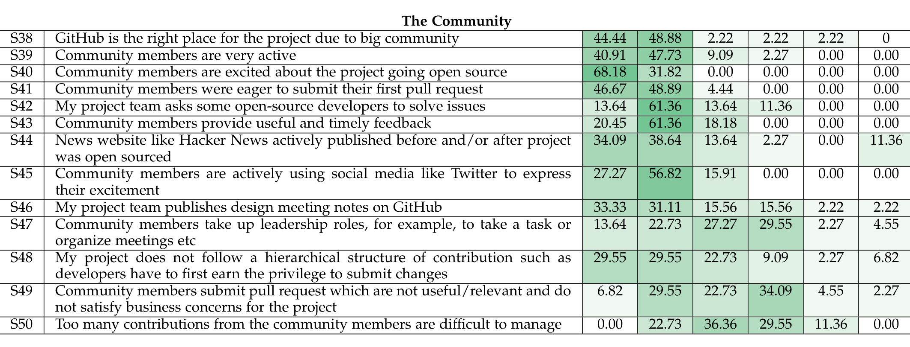

> **Image description:** A contingency table of survey responses for hypotheses S38–S50 about the community, with columns showing percentages for Strongly Agree, Agree, Neutral, Disagree, Strongly Disagree, and Not Applicable. Strong consensus appears for statements that GitHub is the right place (S38: 44.44% SA, 48.88% A), that community members are excited (S40: 68.18% SA, 31.82% A) and eager to submit a first pull request (S41: 46.67% SA, 48.89% A); community activity and timely feedback also score high (S39: 40.91% SA, 47.73% A; S43: 20.45% SA, 61.36% A; S45: 27.27% SA, 56.82% A). Project teams asking external contributors to solve issues (S42) and publishing design notes (S46) show majority agreement (S42: 13.64% SA, 61.36% A; S46: 33.33% SA, 31.11% A), while questions about community leadership, contribution hierarchy, and relevance/volume of contributions are mixed or divided (e.g., S47 has 29.55% Disagree and only 36.37% combined Agree; S49 shows 36.37% combined Agree vs 38.64% combined Disagree; S50 — whether too many contributions are hard to manage — is largely Neutral/Disagree with 36.36% Neutral, 29.55% Disagree, and 22.73% Agree).

## TABLE 6: Mean number of issues (open and closed) by Microsoft developers & the community

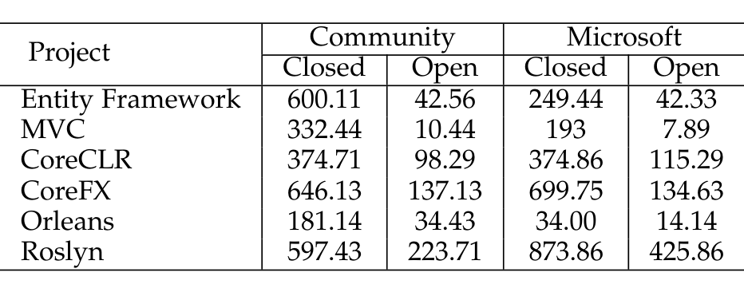

> **Image description:** The table reports mean numbers of closed and open issues filed by the community and by Microsoft developers for six projects (Entity Framework, MVC, CoreCLR, CoreFX, Orleans, Roslyn). For Entity Framework, MVC and Orleans the community filed more closed issues than Microsoft (e.g., EF community closed 600.11 vs Microsoft closed 249.44; MVC 332.44 vs 193; Orleans 181.14 vs 34.00), while for Roslyn and CoreFX Microsoft filed the most closed issues (Roslyn Microsoft closed 873.86 vs community 597.43; CoreFX Microsoft closed 699.75 vs community 646.13); CoreCLR’s closed-issue counts are nearly equal (community 374.71, Microsoft 374.86). Open-issue counts follow similar patterns but are much smaller in most projects (for example Roslyn Microsoft open 425.86 and community open 223.71, CoreFX community open 137.13 vs Microsoft open 134.63). These values show that community issue reporting was substantial for several projects, but the relative contribution varied by project.

## TABLE 8: Mean number of pull requests (merged, closed and open) by Microsoft developers & the community

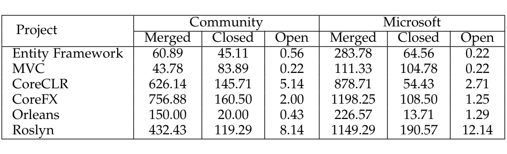

> **Image description:** Table of mean pull-request counts for six Microsoft projects, broken down by source (Community vs Microsoft) and by outcome (Merged = accepted, Closed = rejected, Open = pending). Microsoft developers have higher mean merged PR counts in every project (e.g., CoreFX 1198.25 vs community 756.88; CoreCLR 878.71 vs 626.14; Roslyn 1149.29 vs 432.43), while community merged contributions are still substantial for CoreFX, CoreCLR and Roslyn but much smaller for Entity Framework and MVC (EF: 283.78 MS vs 60.89 community; MVC: 111.33 MS vs 43.78 community). Closed counts vary by project (MVC shows more community-closed than merged), and open PRs are uniformly low across projects (maximums ~12.14 for Microsoft and ~8.14 for community in Roslyn), indicating most PRs were resolved during the measured period.

## TABLE 7: Mean number of comments on issues (open and closed) by Microsoft developers & the community

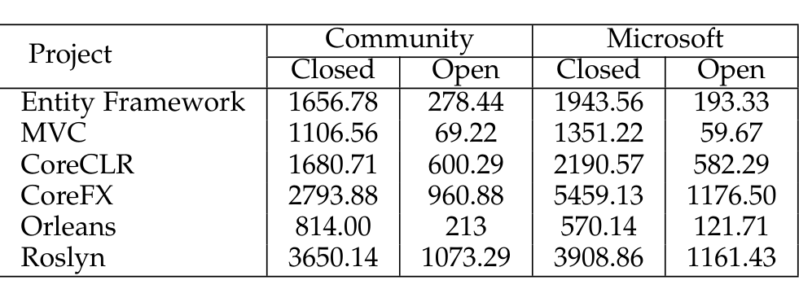

> **Image description:** The table shows, for six projects (Entity Framework, MVC, CoreCLR, CoreFX, Orleans, Roslyn), the mean number of comments on issues attributed to the community and to Microsoft developers, separated into closed and open issues. In nearly every project the mean comment count is substantially higher for closed issues than for open ones (e.g., CoreFX community: closed 2793.88 vs open 960.88; Microsoft: closed 5459.13 vs open 1176.50). Roslyn and CoreFX exhibit the highest engagement overall (community closed 3650.14 and 2793.88; Microsoft closed 3908.86 and 5459.13), whereas MVC shows the lowest mean comments on open issues (community 69.22; Microsoft 59.67). The table therefore indicates both Microsoft and external contributors discuss and comment far more on issues that are ultimately closed, with the relative contribution between community and Microsoft varying by project.

## TABLE 9: Mean number of comments on pull requests (merged, closed and open) by Microsoft developers & the community

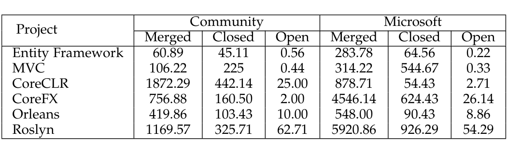

> **Image description:** Table of mean numbers of comments on pull requests (merged, closed, open) for six Microsoft projects, separated into Community and Microsoft authors. For merged PRs Microsoft-generated comments are very large for Roslyn (≈5920.86) and CoreFX (≈4546.14), while community merged-PR comments peak at CoreCLR (≈1872.29) and Roslyn (≈1169.57). Closed-PR comment counts are generally lower but notable for Microsoft on MVC (≈544.67) versus the community (225.00). Open (still-open) PRs have much smaller mean comment counts across projects (mostly under ~63), e.g., Roslyn community ≈62.71 and Microsoft ≈54.29, showing that the bulk of commenting occurs on merged or closed requests.

With more Microsoft projects being open sourced, the community has been responding positively through contributions on GitHub. 88.64% of the developers mentioned that community members are very active (S39). Table 6 and 7 show the number of issues and the number of comments on those issues (both open and closed), submitted by Microsoft developers and the community, respectively. From Table 6, we observe that the number of issues logged by Non-Microsoft developers are higher than Microsoft developers for Entity Framework, MVC and Orleans, and similar to Microsoft developers for CoreFX, CoreCLR and Roslyn. Following Eric Raymond [11], this shows that the community has been actively participating in finding issues for the open-sourced systems. Similarly, Table 8 and 9 show the number of pull requests (PRs) and the corresponding comments on these PRs. We consider all the pull requests — merged, closed and open. PRs that are accepted are marked as merged whereas the rejected ones are marked as closed. We observe that the number of pull requests by the community have either increased (e.g., CoreFX, CoreCLR, Roslyn) or remained more or less the same (e.g., EF, MVC). Furthermore, we observe that most of the community PRs are accepted to be merged. From Figure 2, we can observe that the community has been actively submitting issues and pull requests. Orleans, Entity Framework and MVC received more than 50% of the issues from the community, whereas CoreCLR, Orleans and CoreFX received more than 40% of the pull requests from the community. From Figure 3, we can observe that there is a continuous influx of new developers from the community after the projects are open-sourced. CoreCLR and Orleans observe a drop in the number of new developers, whereas for the rest of the projects there are new developers even after 36–48 months from open-sourcing. Furthermore, we observe that few developers (MVC - 25%, Entity Framework - 12.5%, CoreFX - 11%, Roslyn - 10%, Orleans - 2.3%, CoreCLR - 2.15%) from the community that joined these projects within 6 months after open-sourcing are still contributing after 4–5 years.

### a) Developer Excitement:

Open source developers are excited about the code of the six projects released to the community. All the survey respondents (100%) agreed that the community is excited

---

(S40). GitHub provides social transparency, which can be leveraged by developers to improve their technical skills, coordinate with other developers and manage their reputation [24]. GitHub also provides an embeddable badge, which shows the number of public repositories, number of followers, number of forks etc. This provides increased exposure for developers looking to contribute to other projects. One developer mentioned: “Surprising how quickly the first pull request comes in — within like a couple of hours you have the first pull request of somebody fixing typos. They want their little badge on the GitHub page” (D3). More than 95% of the survey respondents agreed that the community members were eager to submit their first pull-request (S41).

Through active contributions, developers have gained recognition in the community. Microsoft has embraced open source and developer teams often approach community members to provide help: “Can you review this? What do you think about doing this? We have this problem with Mac, we don’t know what to do. What do you think our approach is? We do get some good feedback from that” (D2). In the survey, 75% of the respondents agreed that their team asks open-source developers to solve issues (S42). This not only helps to improve the product but also gives sense of belonging to members; they are valued for their contributions and the company builds stronger ties with the community. A Roslyn developer from the community mentioned, “I looked at the issue tracker and found some bugs that were labelled ‘up for grabs’, tried to reproduce and then I looked at the code to see what’s going wrong. I also found other bugs and submitted the fixes.” (O4)

### b) Active Engagement:

Microsoft developers and external developers often engage in active discussions that are to the point and provide camaraderie. Some of the excerpts from external developers demonstrate this: “In all the discussions the MS people have been very nice, polite and they focus on the topic. The community is also nice too.” (O4), “My interactions so far are high quality, the MS people are very respectful of the minor platforms, half of them had never heard of NetBSD before but they were respectful of my contribution, and they make the patches quickly.” (O3), “There tend to be a lot of discussions, they are not chatty like in open source forums. They do tend to stay on topic.” (O8)

Open source community members have a gamut of experience of working on different types of projects. These developers can provide valuable and timely feedback which can improve the overall community. As one developer puts it: “The feedback we get and the people who are using it, I think it’s a huge benefit because we used to go all the way to the end and we release it and people say that is not what we want. Now, we get the feedback way earlier than that which I think is very valuable. We actually provide things that people want.” (D7). Over 81% of the respondents agreed that the community members provide useful and timely feedback (S43). An external developer mentioned, “there is very good discussion going on and in the community some people have very strong feelings about what the team should prioritize, I think there is fruitful discussion, although the team cannot do everything everyone wants. Having this discussion definitely helps them prioritize better.” (O7)

These developers are putting in time and effort to make projects work on different platforms. As one of the developers comments: “The people who are working on it are really excited. CoreCLR now runs on FreeBSD and that was done entirely by the community and they were super excited to see that they can not only make it run on FreeBSD but we made a conscious decision that we would keep it working by testing it actively with each pull request and each commit so that we don’t break them. As long as we keep on sending that message that we care about what people are doing, things will get better.” (D3). A community developer mentioned, “the MS people are very respectful of the minor platforms, half of them had never heard of NetBSD before but they were respectful of my contribution, and they make the patches quickly.” (O3).

News about Microsoft’s open-source project was actively shared on social news websites such as Hacker News. Over 72% of the respondents agree that websites like Hacker News actively published about these projects (S44). Developers often express their excitement on social media websites such as Twitter. External developers also feel that Microsoft developers have been actively responding to their requests. “There was very quick response time to my pull requests or issues, sometimes a matter of hours, few days maximum.” (O3). Another developer mentioned, “The longer feature I have been working on over a few weeks, there is a bit of delay because of the time difference, but the responsiveness of the guys is phenomenal.” (O6)

### c) Transparency:

Some of the projects we studied published design meeting notes and filed bugs in the open in addition to open-sourcing their code. Such action gives more confidence to the open source community that the project wants the community to get involved. Through these materials, external developers keep themselves aware of what is going on in the project. One developer mentioned: “Third parties can get involved a lot earlier in the process instead of waiting for internal preview build to go to all of our MVPs. Because we are working in the open, they see all the bugs we file, we publish our design meeting notes so when we discuss something as a team, we publish those and they can comment this is great and if you consider this, it really helps build the product.” (D4). Over 64% of the survey respondents agreed that their team publishes design meeting notes on GitHub (S46). An external developer mentioned, “I can get a very good understanding of where the project is going, what features are planned for the future, how they will be implemented, how the project will evolve in the short and long term, and I can align my work in my business along the project, because I know where the project is going. I’m not really surprised at the Build conference, I already know about it upfront.” (O6). Our results corroborate past studies which find that transparency on GitHub helped identify user skills and needs, allowed work to progress and projects to evolve [24].

### d) Ownership:

Community members actively looked for ways to communicate with each other and provide updates about what they are doing. Members in the project Orleans started webcasts to share ideas: “Some of the community members took a leadership role upon themselves to organize monthly community hangouts. They have organized a series of monthly webcasts. People just volunteer like I will present about this next month” (D11). Over 35% of the respondents mention that community members took up leadership positions (S47). Apart from using GitHub to have communication about

---

> **Image description:** Two stacked horizontal bar charts compare the percent of issues (a) and pull requests (b) opened by Microsoft developers versus the external community for six projects (Roslyn, CoreFX, CoreCLR, MVC, Entity Framework, Orleans), with each bar summing to 100%. For issues (left), the community reported the majority for Orleans (81.74%), Entity Framework (68.78%) and MVC (63.06%), whereas Microsoft reported more issues for Roslyn (61.28%) and narrowly more for CoreFX (51.58%) and CoreCLR (50.89%). For pull requests (right), Microsoft authored the largest shares in Entity Framework (76.59%), Roslyn (70.72%) and MVC (62.85%), while the community contributed substantial PR proportions for CoreCLR (45.36%), Orleans (41.37%) and CoreFX (41.28%). These distributions support the paper’s observation that community engagement (issues vs. PRs) varies substantially by project.

(a) Issues (b) Pull Requests  
Fig. 2: Contribution of Microsoft developers and the community.

> **Image description:** Six stacked line plots show the monthly count of new community (non‑Microsoft) developers for CoreFX, CoreCLR, Roslyn, Entity Framework, MVC and Orleans after each project was open‑sourced (x‑axis: months since open‑sourcing; y‑axis: number of new developers). All projects show an early surge in new contributors within the first 6–12 months; CoreFX and CoreCLR have the largest initial peaks (roughly ~140 and ~120 new developers around month 6), Roslyn peaks more modestly (~50–60 new devs around months 10–12), and Entity Framework, MVC and Orleans exhibit smaller spikes. After the initial wave, patterns diverge: CoreCLR and Orleans decline steadily toward low levels by ~48 months, CoreFX and Roslyn show later secondary bumps (around months 30–42), and MVC/Entity Framework display intermittent smaller spikes but slower decline. These trends support the paper’s observation that most projects continued to attract new community developers for 36–48 months, while CoreCLR and Orleans experienced drops. 

Fig. 3: Number of new community developers vs. Number of months since open-sourcing.

The project, Microsoft developers and external developers leveraged different communication channels to share ideas. “We also set up a Gitter chat. There are a lot of people regularly logging there and there has been a lot of interaction talking about ideas. Really kind of helping the community to shape the ideas we have.” (D11) This practice provides opportunity to chat with other developers and get instant answers, as one of the community members expressed, “If Gitter was not there, I don't think that this project would be working the way that it is for us.” (O1).

Furthermore, the community has taken initiatives to develop tools for project such as Roslyn. Some of the community-driven projects that are a part of The Fellowship of the Roslyn Project - C# pad, CodeConnect.io, DuoCode etc. [28].

### e) Recognition System:
The open source community follows an onion structure where longtime contributors make up the core and have the highest reputation, whereas others support the core group by reporting issues, submitting patches and adding documentation [29]. As developers reported during interviews and survey, Microsoft teams do not follow any particular recognition system for contributions (S48). Our results are in line with the findings of Jergensen et al. [30] who found little support for the traditional onion model. However, there are developers who are very active in the community: “There are people who hang out in the issues and are passionate about their areas.” (D2), whereas others contribute occasionally, “There have definitely been things when some random person shows up with a pull request. We look at it, it's great we merge it in and we never see him again” (D2).

### f) Relevant Contributions:
Although open source developers seem excited about the opportunity to contribute to the six projects, it is not easy for the project team to accept all contributions. Incoming code must be appropriate for the project [31]; otherwise project teams might have to reject the contributions. Therefore, it is up to the Microsoft teams to set the right expectations so that they can receive valuable contributions from the community. “It's hard sometimes but I think when you have something on GitHub, people have an expectation that like you are going to be taking almost anything. It just needs to stand on its technical merits like there isn't this business concern behind it.” (D2). However, there are cases of developers submitting changes which do not match the guidelines even when the team explicitly specifies them. “Even we explicitly had the guidelines; don't submit the change that changes the style. We have specific style. If it's not captured there, keep it as it is and don't change style arbitrarily. Still, people submit changes with style. So, we reject them.” (D6)

Some external developers contribute patches which might be useful to them but not to the community of users as a whole. Such patches are often rejected by the project team as they do not bring benefits for the project. “I think a lot of those type pull requests are just: ‘Hey I was doing this on my fork to enable my product. I thought it might be useful to you guys in general.’ We look at it and say this is nice for your scenario but it is missing all these other things around it.” (D4). A community developer opined, “Not all ideas are valid and accepted but there is always very clear rationale given about why going a certain path is not a good idea.” (O11). Finally, the number of incoming

---

contributions can overwhelm the Microsoft developers as they need to perform testing and ensure that the new patch request does not break the software. A developer mentioned, “It may be a good thing that there are no swell of changes coming because you need to evaluate every single change. Even contributions within the team take considerable amount of time of my day. For e.g., if there were ten more people contributing at the same rate, I think it would be hard to manage.” (D8). Only 22% of the respondents agree that too many contributions from the community is hard to manage (S50).

## 7 DISCUSSION

As more and more organizations are interested in open-sourcing internal projects, it is important to ensure that the transition is smooth. Organizations must provide resources which will make it easier for internal developers to transition and aid external developers to contribute to the project. Based on our study findings, we provide some recommendations below for project teams to avoid pitfalls during the transition process. Furthermore, we perform statistical test on the hypotheses used in our survey.

### 7.1 Ratings of Hypotheses

In this section, we present the results of Scott-Knott Effect Size Difference (ESD) test, which is used for comparison of treatment means. Among the 50 hypotheses in our survey, we want to understand which hypotheses are considered more important by the survey respondents. This information will be useful for organizations planning to go open-source to prioritize and consider hypotheses which are higher ranked. Furthermore, the test statistically confirms the results observed in the survey.

Table 10 presents the hypotheses as ranked by the Scott-Knott Effect Size Difference (ESD) test [32] according to their Likert scores. The Scott-Knott test uses hierarchical clustering to divide the sample treatment means into statistically distinct groups (α = 0.05). As shown in [32], the original Scott-Knott test assumes data is normally distributed and it may create groups that are trivially different from one another. Scott-Knott ESD corrects the non-normal distribution of the dataset and merge two statistically distinct groups that have negligible effect size as per Cohen’s d.

We observe that the top 3 most highly rated hypotheses (Group 1) are:
- S1: To engage and build trust in the community
- S9: Sanitizing/Cleaning the source code
- S2: To receive faster feedback from the community

Next 3 highly rated hypotheses (Group 2) are:
- S15: Git is faster than TFS
- S40: Community members are excited about the project going open source
- S22: Continuous Integration can help detect merging issues early and easily

From the top ranked hypotheses (S1, S2, S15), we observe that community involvement is important and Microsoft developers want to make sure that community gets the platform to actively contribute and be engaged. The community has also reciprocated by getting actively involved and contributing through opening issues, submitting pull requests and posting comments on GitHub (see Figure ??-2).

### 7.2 Recommendations for Organizations

#### Infrastructure Support
As one of the developers described, projects need to differentiate between “developing in the open” and “developing open source”. “Developing in the open” means projects simply place their code on a publicly accessible platform without providing any means for the community to contribute. In contrast, “Developing open source” means a project solicits contributions from external developers and the project team provides resources to the community to facilitate the contribution process. “It’s not just dump the code in the open. You have to provide the ways to build and test it.” (D1) When Roslyn’s and Entity Framework’s source code was made open on CodePlex, most of the building and testing infrastructure was internal, making it difficult for external developers to contribute. Thus, a project that is considering open-sourcing should put in place infrastructure which will make it easy for external developers to seamlessly contribute to the project.

A developer said:
> “Prepare the infrastructure first. If they have any internal processes, just expect to put them in the open as soon as possible. If we have an internal process like our API review, they should tell three or four people on how to do it. Also, write some guidelines on how to contribute.” (D5)

#### Clear Goals
When a project is open-sourced, it is important to have a long-term vision of what the organization wants out of the project. Concise explanation of the goals of the project to the community can attract developers who would like to make significant contributions to the project, whereas unclear goals can drive away the developers from actively participating. A developer mentioned, “When you open source you kind of really need to understand how you are going to interact with the community. I don’t think we have done a great job of explaining to the community of where we are and where we want to go ... people from the community get upset about that sometime. It’s like I want to help but I don’t know how to.” (D2)

#### Uniform Processes
When an organization plans to open source multiple projects, it is important to keep uniform processes across the projects. This makes it easier for internal as well as external developers to contribute across projects without learning a new set of tools and techniques. It also persuades community members who have contributed to one project, to contribute to another as they only need to know the project details but not a new process. A developer mentioned, “... between CoreCLR, CoreFX and a bunch of other projects, we are using the same test harnesses xUnit. I know if I look at the WCF project, it’s going to work same as the CoreFX project. I can move between the two projects and contribute both places without learning a new set of processes.” (D3)

#### Hosting Platform
Choosing the right platform to host an open-sourcing project increases the chances of getting more participation from the community. Open source platform like GitHub provide social transparency and tools for developers to collaborate, which can enhance the project’s visibility and provide avenues for the developers to contribute. Recall that some of the Microsoft projects were

---

IEEE Transactions on Software Engineering, Manuscript ID

## TABLE 10: Hypotheses ranked according to Scott-Knott ESD test

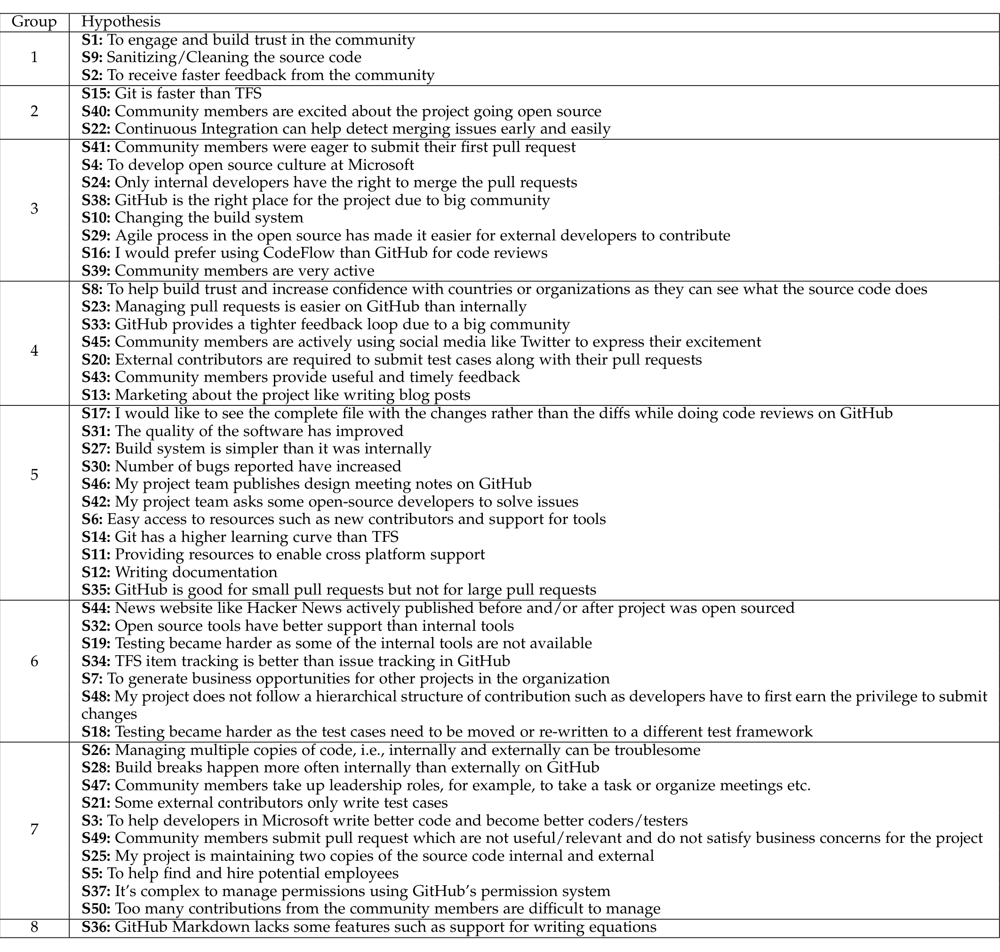

> **Image description:** A table (Table 10) that clusters the 50 survey hypotheses (labeled S1..S50) into eight statistically distinct groups using the Scott‑Knott Effect Size Difference test, ranking them by Microsoft developers’ Likert responses. Group 1 (the highest‑ranked) contains S1, S9 and S2 — respectively: “engage and build trust in the community,” “sanitizing/cleaning the source code,” and “to receive faster feedback from the community.” Group 2 highlights tool/process priorities such as S15 (Git is faster than TFS), S40 (community excitement), and S22 (CI helps detect merging issues), while middle groups list items about contribution workflows, code review and documentation; the lowest group (Group 8) contains S36 (GitHub Markdown lacks some features). The table therefore summarizes which transition concerns developers considered most important (community engagement, code hygiene and feedback speed) versus less critical issues according to the survey and Scott‑Knott grouping.

Originally moved to CodePlex. However, the little or no response from the community led to these projects move to GitHub. “When we moved from CodePlex to GitHub, we get far more pull requests, I think it’s so much easier to do on GitHub. It’s like a big part of the culture.” (D4). Similar sentiments were echoed by the community members, “The actual process of contributing code was very easy, it was just the GitHub process, which is in itself a great thing that MS chose to go with it, because everyone knows it.”

Transition Time: Project Roslyn was initially partially open-sourced and then later completely open-sourced when most of the development had taken place. Developers recommend transitioning the whole project early on in its lifecycle so that the project team can get input from external developers. The project was initially open sourced on Microsoft’s platform, CodePlex, but it was harder to contribute as most of the tools were still internal. Therefore, developers could see the code but it increased barriers for contributions.

A developer said: “In my opinion, it was significant distraction. So, I would recommend doing this thing in a more planned manner and more quiet time like in the beginning of the product cycle not when we are trying to shut down.” (D8)

### 7.3 Recommendations for Developers & Managers

Developing Culture: Developers in software organizations often do not interact with the customers on a regular basis. Senior management does most of such interactions. However, when open-sourcing, developers regularly collaborate with the external developers, some of whom are customers as well. Developers may lack skills to effectively communicate with external community members. To that end, managers should promote this culture internally by giving developers an opportunity to interact with external

---

members which will help increase confidence and rapport between different stakeholders.

Harmonious Attitude: Community members voluntarily invest time and effort to contribute to projects. It is important for internal team members to be receptive to comments or feedback from the community. Such a practice helps build trust and projects can attract more developers as community members share their experiences with their counterparts through various means such as social media websites.

> "Try to be open to that constructive feedback. You can learn a lot by just listening to the community, listening to what they want, connecting with them and the closer you can be, the more open you can be, the more present you can be as a development team to where they are talking this, the more you will learn." (D11)

Documenting Best Practices: When a project is open sourced, team members without any prior experience of working with OSS learn several best practices followed by the community, which might be different from the best practices within the organization. Such practices are not always documented. We recommend documenting the incoming best practices from the open source community, which would be helpful for other projects planning to open-source.

> "At first I didn’t know what the labels on the issues mean, but they later updated the wiki and explained that." (O4)

Decoupled Parts: For various reasons (e.g., the use by other internal teams) only a part of a project may be open-source. If software is open-sourced in parts and the open source and closed source components are tightly coupled, it becomes difficult for the project team to manage both repositories.

> "It’s OK to have open source components and closed components sources. You want to make sure there is not too much coupling between them because otherwise they will tend to gravitate to where the bigger mass is." (D1)

However, it is better if the project and its resources are maintained in a single place.

### 7.4 Threats to Validity

Threats to External Validity. Threats to external validity relate to the generalizability of our results. In this study, we investigated six large projects, which Microsoft open-sourced recently. Every project is different and [32] project teams may face different issues during the transition. Our findings may not generalize to projects outside Microsoft. However, we do find several similarities between these projects as expressed by developers during the interviews.

Threats to Internal Validity. These threats relate to the conditions under which the study is performed. We conducted semi-structured interviews with the developers. The interview questions could have biased the developers although we tried to keep the questions open-ended and let developers give a holistic picture of the transition process. Since we recorded the interviews, developers might have behaved differently. However, we did the recording after getting consent from the developer. To reduce the bias during the card sort, we involved non-authors to help us. The authors and developers being from Microsoft might have introduced some bias, however, to counter this we have interviewed 11 developers from the community. We believe

that these responses along with that of Microsoft developers give an in-depth explanation of the transition process. We do not present the transition period (i.e., preparations and the actual time to transition) as it varies from project to project on several factors such as amount of code, number of engineers involved, software lifecycle stage during the transition, parts of code open-sourced etc. For example, D2 mentioned:

> "We probably spent about 2 or 3 months on that and 5 or 6 engineers from different disciplines getting things ready." (D2)

whereas D5 said,

> "In the beginning, we moved the product without moving the tests because tests were much more work." (D5)

## 8 RELATED WORK

In this section, we summarize prior empirical studies on transition to open-source and attractiveness of open-source to both developers and organizations.

### 8.1 Closed Source to Open Source

Pinto et al. studied eight projects to understand the challenges of open-sourcing proprietary software projects [33]. They surveyed developers through means of opening issues or mailing lists for the eight projects in GitHub and solicited responses from the active members of these projects. They found that the rise of contributions is not straightforward, and they observe a newcomer’s wave, i.e., a high number of newcomers make a few contributions initially but do not contribute again. They also observed an increase in the number of pull-requests and issues after the projects were open-sourced. They also observed a growth in popularity by measuring the number of stars against top-2500 most starred public projects.

In our study, we address the similar problem of understanding reasons to open-source, the transition process, challenges, and learnings. However, there are several differences between ours and previous study. Instead of asking questions on GitHub, we conduct interviews with the developers and managers involved in the projects, which gives us an opportunity to get deeper insights. While previous study only targets developers, we also interview managers to understand the reasons for transition. We further survey developers to validate findings from the interviews. We also describe the transition outcomes and community response through qualitative and quantitative measures. Compared with the above study, we find similar results: the number of pull requests increase after the transition and a significant number is from the community, the number of issues increase and developers put in effort to close them as soon as possible. While the previous study provides mostly quantitative analysis, we also combine qualitative data to back up the numbers.

Several online blogs provide suggestions for developers or organizations planning to go open source and why organizations open source proprietary software. Todorov gave several suggestions such as cleaning code, self-contained modules, code refactoring, external dependencies, providing documentation, testing standalone deployments etc. before making the code public [34]. A blog by Shopsys Framework gives several reasons to open-source a project based on their past experience such as finding best developers, getting expert advice, helping fellow developers to reuse your

---

code, increasing the standards on the code substantially etc. [35]. Another blog gives several reasons to open source such as advertisement for the company, faster development, and attracting talent and retaining talent [36]. A blog by Google gives several reasons for organizations to open source such as long-term returns, sharing your work, establishing or supporting an open standard, paradigm shift, and recruiting developers from the community [37]. Increasingly, large organizations have open-sourced their artificial intelligence (AI) systems such as Amazon Alexa, Google TensorFlow, Facebook M, Microsoft Cognitive Toolkit [38]. DARPA, the research arm of the U.S. Department of Defense, has also published a catalog of state-of-the-art machine learning, visualization and other technologies that can be used to build custom AI tools [38]. A blog gives a set of activities that need to be done to open-source a product: publish the source code under an open-source license, publish the software build environment, accept contributions and build a genuine community [39]. Furthermore, there is work needed to be done to make a software publishable: critical review of the source, investment in communication channels, easy tools to support contributions etc. [39]. The above studies give suggestions and reasons to move open source based on their past experiences. We find some similarities such as taking steps before open-sourcing (cleaning the code, refactoring, providing tools, documentation etc.), various reasons to open-source (finding developers, getting advice, code reuse, long-term returns etc.). Furthermore, several blogs have similar viewpoints that open-sourcing a project helps in building the community. However, they do not follow a scientific methodology of taking opinions from both internal and external developers. Furthermore, previous studies are based on one project, whereas we analyse transition of six different projects.

### 8.2 Attractiveness of Open Source

Santos et al. developed a model to evaluate the factors that increase attractiveness of open source projects and lead to higher contributions and maintenance activities [40]. They found that available resources and license restrictiveness are the main factors that impact activities; however, higher activity in a project slows down tasks like adding new features. Hauge et al. presented a classification framework describing how companies adopt OSS [6]. Some of the ways they found were deploying OSS products in their environment, integrating OSS components into their own systems, providing their products to the community and using software development practices within their organization. Krogh et al. performed a review of studies of what makes developers contribute to open source and developed a new framework that considers interplay of good, social institutions and practices [5]. Their findings showed peer review and quick feedback improves quality in OSS, software organizations can find future employees working on OSS, and social practices can promote loyalty and motivate developers to contribute.

Agerfalk et al. studied customer and community obligations for a healthy relationship and success of the project in the open source world [41]. They found that organizations should provide commitment from senior management, should not try to dominate and control the project, and aid in developing an open and trusted ecosystem. At the same time, community members should promote democratic authority structures, show professionalism and show loyalty and commitment to the project. Zhou et al. studied three hybrid projects that are supported by companies and used literature, online materials and interviews to understand policies and actions taken by companies to attract and retain contributors [42]. They find three models of commercial involvement: hosting: when a company has full control; supporting: when a company supports a project, but it is controlled by another OSS organization; and collaborating: when a company has a shared control with other organizations.

Homscheid et al. surveyed Linux kernel developers to understand turnover intention factors of firm-sponsored open source projects [43]. They found that perceived external reputation of the employing organization reduces turnover intention towards the company while perceived own reputation dampens turnover intention directed towards the OSS community. Riehle et al. studied the Linux kernel and projects on Ohloh to understand the amount of open source development that is paid against volunteer work [44]. They found that 50% of all contributions have been paid work and many small projects are fully paid for. They further observed a healthy mixture of paid and volunteer work in larger projects.

Bleek et al. studied the transition of a web-based community system in three phases: closed source, transition to open source and completely open source using the Capability Maturity Model (CMM) [45]. They found that extreme change to the organizational structure of the project can be detrimental for the project quality, but migration to open source is an appropriate decision to maintain high quality of the project. Hst et al. conducted a systematic literature review to understand the research conducted on usage of open source components and participation of companies in open source development [46]. Their findings showed four types of categories: usage of open source as component-based software engineering, organizations’ business models with open source, organizations’ participation in open source and usage of open source processes within an organization. Oruevi-Alagi et al. presented a study on the changes of static software quality metrics such as lines of code, cyclomatic complexity, the amount of comments etc. as a proprietary database management system was open sourced [47]. The results of their study showed that over half of the changes were made to the front-end components and there was an increase in the quality metrics for code developed by the open source community.

Stol et al. present several factors related to product, process, and organization before adopting inner source, i.e., using open-source practices inside the organization [48]. The factors fall into three categories: product suitability, practices and tools, and people and management. Adopting inner source might be the first step for some organizations to get a taste of practices followed by the open-source community before they plan to open-source their internal software. While inner source describes practices that will be adopted by an organization internally, in our study, we try to understand the outcomes and challenges that come with open-sourcing a software. We find similar results with some

---

of the studies above such as feedback improves OSS quality, finding potential employees, increased code quality, building healthy community through support of the organization etc. We further provide several reasons to open-source along with challenges and opportunities. Furthermore, we also verify the results of the interviews by conducting a survey.

### 8.3 Qualities of Open Source

Paulson et al. compared three closed source projects to three open source projects, i.e., Linux, Apache and GCC to analyze the similarities and differences in the two models of development [49]. They compared five different characteristics and found that open source projects foster creativity and generally have fewer bugs. Mockus et al. used email archives of source code change history and issue reports to analyze several aspects such as code ownership, productivity, defect density etc. [50]. They hypothesized that a large group of developers will find and repair defects and exhibit faster responses to customer issues. They also suggested a hybrid model of development where a core team has the right to commit code, whereas a large number of developers contribute. We observed similar trends in our study as most of the external developers contributed and Microsoft developers had the right to merge the code to the product. Bonaccorsi and Rossi studied recent theories to explain the motivation, coordination in the absence of central authority and diffusion of open source software in the presence of network externality [4]. They also developed a simulation model to identify important factors in the diffusion of the technology. Raghunathan et al. studied quality improvements for open source and closed-source approaches using game theoretic analysis and compared these two models in monopolistic and competitive markets [51]. They found quality depends on the nature of the market. However, open source programmers have better opportunity to gain recognition and exhibit their talent to potential employers. Furthermore, finding bugs is a fun activity for open source developers and it motivates them to improve software.

## 9 CONCLUSION

Open source software has attracted the attention of developers and researchers alike. In the two decades or so, the open source community has produced several high-profile software systems, which are being developed, supported and used by a large number of developers. In this paper, we studied the transition of six large Microsoft projects from being closed source to open source. We interviewed five senior managers and eleven Microsoft developers who were involved in these projects before and after the transition. Furthermore, we also interviewed eleven community members who have contributed to these six projects.

1. Engaging the community, prompt responses, developing culture, security regulations, business opportunities, limited resources, making better coders and hiring potential employees were factors for open-source projects.
2. The transition causes process changes such as for testing, code reviews, version control, and continuous integration.
3. Developers described the adoption of an agile process, simple builds, improved bug quality, exposure to tools, increased awareness and cleaner code as some of the positive effects of the transition.
4. The open source community has been actively contributing through new features, finding and fixing bugs, giving fast feedback, and taking the lead to organize community events.

In the future, we plan to study more systems to analyze if our findings generalize to other projects.

## ACKNOWLEDGMENTS

The authors would like to thank all the developers and managers who provided their valuable feedback during the interviews and survey.

## REFERENCES

[1] “React, a javascript for building user interfaces.” https://reactjs.org/. Accessed: 2018-08-13.

[2] “Facebooks head of open source gives 3 reasons why the company open-sources its technology.” https://venturebeat.com/2015/06/12/facebooks-head-of-open-source-gives-3-reasons-why-the-company-open-sources-its-technology/. Accessed: 2018-08-13.

[3] “Microsoft’s open sourcing of .net: The back story.” https://www.zdnet.com/article/microsofts-open-sourcing-of-net-the-back-story/. Accessed: 2018-08-13.

[4] A. Bonaccorsi and C. Rossi, “Why open source software can succeed,” Research Policy, vol. 32, no. 7, pp. 1243–1258, 2003.

[5] G. V. Krogh, S. Haefliger, S. Spaeth, and M. W. Wallin, “Carrots and rainbows: Motivation and social practice in open source software development,” MIS Quarterly, vol. 36, no. 2, pp. 649–676, 2012.

[6] O. Hauge, C. Ayala, and R. Conradi, “Adoption of open source software in software-intensive organizations - a systematic literature review,” Information and Software Technology, vol. 52, no. 11, pp. 1133–1154, 2010.

[7] J. Lawrence and U. Tar, “The use of grounded theory technique as a practical tool for qualitative data collection and analysis,” vol. 11, pp. 29–40, 2013.

[8] A. Strauss and J. Corbin, Basics of qualitative research: Techniques and procedures for developing grounded theory (2nd ed.). Thousand Oaks, CA, US: Sage Publications, Inc., 1998.

[9] D. Spencer and J. Garrett, Card Sorting: Designing Usable Categories. Rosenfeld Media, 2009.

[10] B. A. Kitchenham and S. L. Pfleeger, Personal Opinion Surveys, pp. 63–92. Springer London, 2008.

[11] E. S. Raymond, The Cathedral and the Bazaar: Musings on Linux and Open Source by an Accidental Revolutionary. O’Reilly & Associates, Inc., 2001.

[12] E. Kalliamvakou, D. Damian, K. Blincoe, L. Singer, and D. M. German, “Open source-style collaborative development practices in commercial projects using github,” in Proceedings of the 37th International Conference on Software Engineering - Volume 1, pp. 574–585, 2015.

[13] “Msbuild, the microsoft build engine.” https://msdn.microsoft.com/en-us/library/dd393574.aspx. Accessed: 2018-08-13.

[14] “Codeplex, project hosting for open source software.” https://archive.codeplex.com/. Accessed: 2018-08-13.

[15] “Team foundation server.” https://visualstudio.microsoft.com/tfs/. Accessed: 2018-08-13.

[16] K. Muşlu, C. Bird, N. Nagappan, and J. Czerwonka, “Transition from centralized to decentralized version control systems: A case study on reasons, barriers, and outcomes,” in Proceedings of the 36th International Conference on Software Engineering, pp. 334–344, 2014.

[17] R. Pham, L. Singer, O. Liskin, F. Figueira Filho, and K. Schneider, “Creating a shared understanding of testing culture on a social coding site,” in Proceedings of the 2013 International Conference on Software Engineering, pp. 112–121, 2013.

---

[18] G. Gousios, A. Zaidman, M.-A. Storey, and A. van Deursen, “Work practices and challenges in pull-based development: The integrator’s perspective,” in Proceedings of the 37th International Conference on Software Engineering (ICSE) - Volume 1, pp. 358–368, 2015.

[19] I. Steinmacher, G. Pinto, I. S. Wiese, and M. A. Gerosa, “Almost there: A study on quasi-contributors in open source software projects,” in Proceedings of the 40th International Conference on Software Engineering (ICSE), pp. 256–266, 2018.

[20] P. Duvall, S. Matyas, P. Duvall, and A. Glover, Continuous Integration: Improving Software Quality and Reducing Risk. Addison-Wesley, 2007.

[21] B. Vasilescu, Y. Yu, H. Wang, P. Devanbu, and V. Filkov, “Quality and productivity outcomes relating to continuous integration in GitHub,” in Proceedings of the 2015 10th Joint Meeting on Foundations of Software Engineering (FSE), pp. 805–816, 2015.

[22] G. Gousios, M. Pinzger, and A. v. Deursen, “An exploratory study of the pull-based software development model,” in Proceedings of the 36th International Conference on Software Engineering (ICSE), pp. 345–355, 2014.

[23] J. Highsmith and A. Cockburn, “Agile software development: The business of innovation,” Computer, vol. 34, no. 9, pp. 120–122, 2001.

[24] L. Dabbish, C. Stuart, J. Tsay, and J. Herbsleb, “Social coding in GitHub: Transparency and collaboration in an open software repository,” in Proceedings of the ACM 2012 Conference on Computer Supported Cooperative Work (CSCW), pp. 1277–1286, 2012.

[25] E. Murphy-Hill and G. C. Murphy, “Peer interaction effectively, yet infrequently, enables programmers to discover new tools,” in Proceedings of the ACM 2011 Conference on Computer Supported Cooperative Work (CSCW), pp. 405–414, 2011.

[26] S. Xiao, J. Witschey, and E. Murphy-Hill, “Social influences on secure development tool adoption: Why security tools spread,” in Proceedings of the 17th ACM Conference on Computer Supported Cooperative Work & Social Computing (CSCW), pp. 1095–1106, 2014.

[27] G. Gousios, M.-A. Storey, and A. Bacchelli, “Work practices and challenges in pull-based development: The contributor’s perspective,” in Proceedings of the 38th International Conference on Software Engineering (ICSE), pp. 285–296, 2016.

[28] “A journey through open source: The trials & triumphs in Roslyn’s first year of open source.” https://blogs.msdn.microsoft.com/dotnet/2015/04/06/a-journey-through-open-source-the-trials-triumphs-in-roslyns-first-year-of-open-source/. Accessed: 2018-08-22.

[29] A. Mockus, R. T. Fielding, and J. D. Herbsleb, “Two case studies of open source software development: Apache and Mozilla,” ACM Transactions on Software Engineering and Methodology (TOSEM), vol. 11, no. 3, pp. 309–346, 2002.

[30] C. Jergensen, A. Sarma, and P. Wagstrom, “The onion patch: Migration in open source ecosystems,” in Proceedings of the 19th ACM SIGSOFT Symposium and the 13th European Conference on Foundations of Software Engineering (ESEC/FSE), pp. 70–80, 2011.

[31] J. Tsay, L. Dabbish, and J. Herbsleb, “Let's talk about it: Evaluating contributions through discussion in GitHub,” in Proceedings of the 22nd ACM SIGSOFT International Symposium on Foundations of Software Engineering (FSE), pp. 144–154, 2014.

[32] C. Tantithamthavorn, S. McIntosh, A. E. Hassan, and K. Matsumoto, “An empirical comparison of model validation techniques for defect prediction models,” IEEE Transactions on Software Engineering, vol. 43, no. 1, pp. 1–18, 2017.

[33] G. Pinto, I. Steinmacher, L. F. Dias, and M. Gerosa, “On the challenges of open-sourcing proprietary software projects,” Empirical Software Engineering, 2018.

[34] “10 steps to migrate your closed software to open source.” https://opensource.com/business/14/5/10-steps-migrate-closed-to-open-source. Accessed: 2018-08-13.

[35] “6 reasons why we moved from closed to open-source and you should too.” https://blog.shopsys.com/6-reasons-why-we-moved-from-closed-to-open-source-and-you-should-too-9d7007cd71f8. Accessed: 2018-08-13.

[36] “5 reasons your company should open source more code.” https://readwrite.com/2015/01/28/open-source-code-5-reasons-to-open-up/. Accessed: 2018-08-28.

[37] “Why open source?” https://opensource.google.com/docs/why/. Accessed: 2018-08-28.

[38] “Why big tech companies are open-sourcing their AI systems.” https://www.iflscience.com/technology/why-big-tech-companies-are-open-sourcing-their-ai-systems/. Accessed: 2018-08-28.

[39] “An in-depth guide to turning a product into an open source project.” https://opensource.com/business/16/5/how-transition-product-open-source-project. Accessed: 2018-08-28.

[40] C. Santos, G. Kuk, F. Kon, and J. Pearson, “The attraction of contributors in free and open source software projects,” The Journal of Strategic Information Systems, vol. 22, no. 1, pp. 26–45, 2013.

[41] P. J. Gerfalk and B. Fitzgerald, “Outsourcing to an unknown workforce: Exploring open sourcing as a global sourcing strategy,” MIS Quarterly, vol. 32, no. 2, pp. 385–409, 2008.

[42] M. Zhou, A. Mockus, X. Ma, L. Zhang, and H. Mei, “Inflow and retention in OSS communities with commercial involvement: A case study of three hybrid projects,” ACM Transactions on Software Engineering and Methodology (TOSEM), vol. 25, no. 2, pp. 13:1–13:29, 2016.

[43] D. Homscheid and M. Schaarschmidt, “Between organization and community: Investigating turnover intention factors of firm-sponsored open source software developers,” in 8th International ACM Web Science Conference, 2016.

[44] D. Riehle, P. Riemer, C. Kolassa, and M. Schmidt, “Paid vs. volunteer work in open source,” in 2014 47th Hawaii International Conference on System Sciences, pp. 3286–3295, 2014.

[45] W.-G. Bleek, M. Finck, and B. Pape, “Towards an open source development process — evaluating the migration to an open source project by means of the capability maturity model,” in Proceedings of the First International Conference on Open Source Systems, pp. 37–43, 2005.

[46] M. Høst and A. Orucevic-Alagic, “A systematic review of research on open source software in commercial software product development,” Information and Software Technology, vol. 53, no. 6, pp. 616–624, 2011.

[47] A. Orucevic-Alagić and M. Höst, “A case study on the transformation from proprietary to open source software,” in Open Source Software: New Horizons, pp. 367–372, Springer Berlin Heidelberg, 2010.

[48] K. Stol and B. Fitzgerald, “Inner source — adopting open source development practices in organizations: A tutorial,” IEEE Software, vol. 32, no. 4, pp. 60–67, 2015.

[49] J. W. Paulson, G. Succi, and A. Eberlein, “An empirical study of open-source and closed-source software products,” IEEE Transactions on Software Engineering (TSE), vol. 30, no. 4, pp. 246–256, 2004.

[50] A. Mockus, R. T. Fielding, and J. Herbsleb, “A case study of open source software development: The Apache server,” in Proceedings of the 22nd International Conference on Software Engineering (ICSE), pp. 263–272, 2000.

[51] S. Raghunathan, A. Prasad, B. K. Mishra, and H. Chang, “Open source versus closed source: software quality in monopoly and competitive markets,” IEEE Transactions on Systems, Man, and Cybernetics - Part A: Systems and Humans, vol. 35, no. 6, pp. 903–918, 2005.