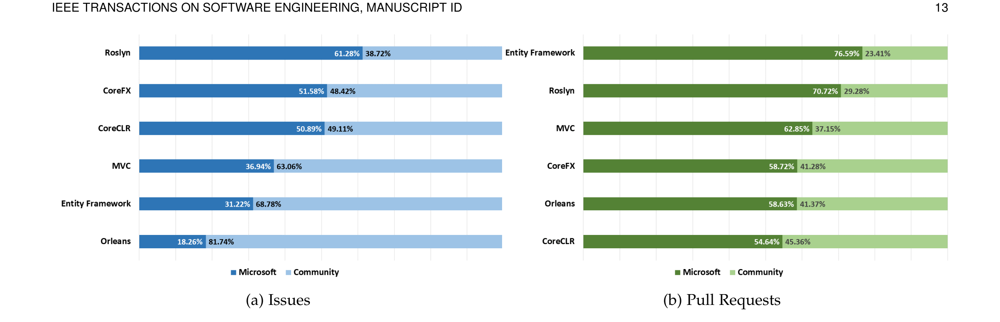
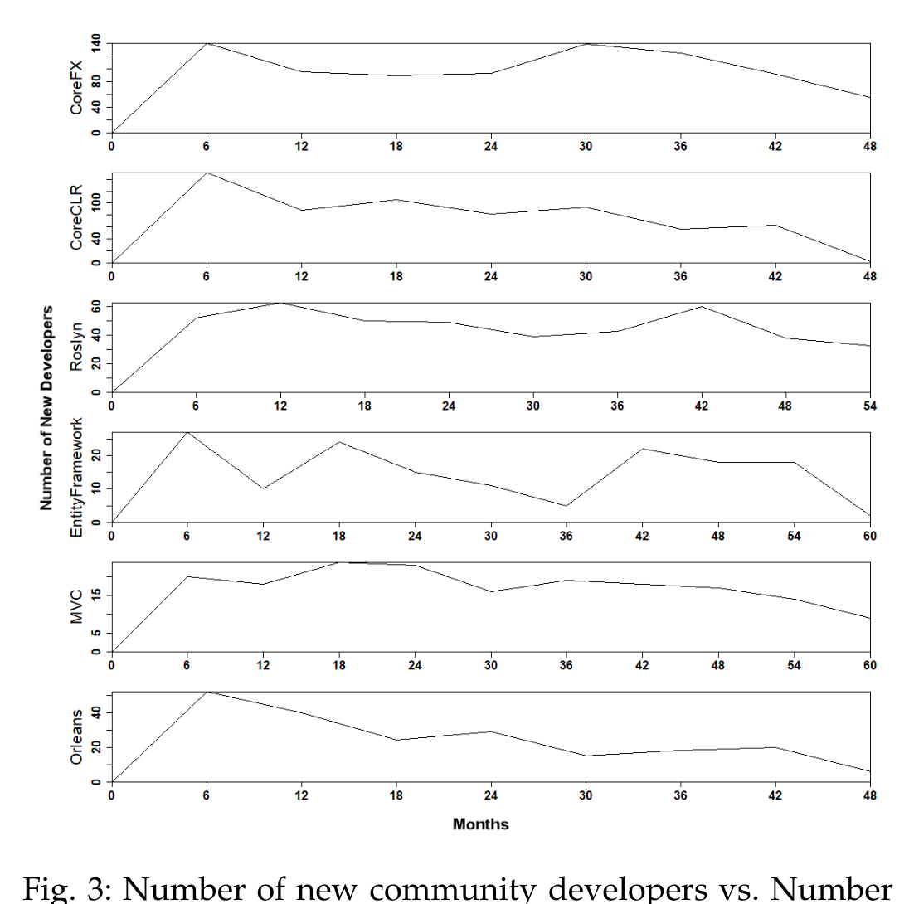

(a) Issues (b) Pull Requests  
Fig. 2: Contribution of Microsoft developers and the community.

Fig. 3: Number of new community developers vs. Number of months since open-sourcing.

The project, Microsoft developers and external developers leveraged different communication channels to share ideas. “We also set up a Gitter chat. There are a lot of people regularly logging there and there has been a lot of interaction talking about ideas. Really kind of helping the community to shape the ideas we have.” (D11) This practice provides opportunity to chat with other developers and get instant answers, as one of the community members expressed, “If Gitter was not there, I don't think that this project would be working the way that it is for us.” (O1).

Furthermore, the community has taken initiatives to develop tools for project such as Roslyn. Some of the community-driven projects that are a part of The Fellowship of the Roslyn Project - C# pad, CodeConnect.io, DuoCode etc. [28].

### e) Recognition System:
The open source community follows an onion structure where longtime contributors make up the core and have the highest reputation, whereas others support the core group by reporting issues, submitting patches and adding documentation [29]. As developers reported during interviews and survey, Microsoft teams do not follow any particular recognition system for contributions (S48). Our results are in line with the findings of Jergensen et al. [30] who found little support for the traditional onion model. However, there are developers who are very active in the community: “There are people who hang out in the issues and are passionate about their areas.” (D2), whereas others contribute occasionally, “There have definitely been things when some random person shows up with a pull request. We look at it, it's great we merge it in and we never see him again” (D2).

### f) Relevant Contributions:
Although open source developers seem excited about the opportunity to contribute to the six projects, it is not easy for the project team to accept all contributions. Incoming code must be appropriate for the project [31]; otherwise project teams might have to reject the contributions. Therefore, it is up to the Microsoft teams to set the right expectations so that they can receive valuable contributions from the community. “It's hard sometimes but I think when you have something on GitHub, people have an expectation that like you are going to be taking almost anything. It just needs to stand on its technical merits like there isn't this business concern behind it.” (D2). However, there are cases of developers submitting changes which do not match the guidelines even when the team explicitly specifies them. “Even we explicitly had the guidelines; don't submit the change that changes the style. We have specific style. If it's not captured there, keep it as it is and don't change style arbitrarily. Still, people submit changes with style. So, we reject them.” (D6)

Some external developers contribute patches which might be useful to them but not to the community of users as a whole. Such patches are often rejected by the project team as they do not bring benefits for the project. “I think a lot of those type pull requests are just: ‘Hey I was doing this on my fork to enable my product. I thought it might be useful to you guys in general.’ We look at it and say this is nice for your scenario but it is missing all these other things around it.” (D4). A community developer opined, “Not all ideas are valid and accepted but there is always very clear rationale given about why going a certain path is not a good idea.” (O11). Finally, the number of incoming