# Does reviewer recommendation help developers?

Vladimir Kovalenko, Nava Tintarev, Evgeny Pasynkov, Christian Bird, and Alberto Bacchelli

Abstract— Selecting reviewers for code changes is a critical step for an efficient code review process. Recent studies propose automated reviewer recommendation algorithms to support developers in this task. However, the evaluation of recommendation algorithms, when done apart from their target systems and users (i.e., code review tools and change authors), leaves out important aspects: perception of recommendations, influence of recommendations on human choices, and their effect on user experience. This study is the first to evaluate a reviewer recommender in vivo. We compare historical reviewers and recommendations for over 21,000 code reviews performed with a deployed recommender in a company environment and set out to measure the influence of recommendations on users’ choices, along with other performance metrics. Having found no evidence of influence, we turn to the users of the recommender. Through interviews and a survey we find that, though perceived as relevant, reviewer recommendations rarely provide additional value for the respondents. We confirm this finding with a larger study at another company. The confirmation of this finding brings up a case for more user-centric approaches to designing and evaluating the recommenders. Finally, we investigate information needs of developers during reviewer selection and discuss promising directions for the next generation of reviewer recommendation tools. Preprint: https://doi.org/10.5281/zenodo.1404814

Index Terms— Code Review, Reviewer Recommendation, Empirical Software Engineering.
(cid:70)

## 1 INTRODUCTION

Code Review, i.e., manual inspection of source code changes, has become a standard step in software engineering [1], [2]. The inspection approaches have evolved over the last decades and these days developers commonly conduct change-based code reviews using dedicated tools [2], [3]. This lightweight, change- and tool-based approach to code review, commonly used in the software industry, is also referred to as Modern Code Review (MCR) in literature [2], [4], [5], [6].

Code review tools provide developers with a convenient environment to read and discuss code changes. The tools have evolved to support the reviewers with more features, such as integration with bug trackers and continuous integration tools [7], [8], [9]. The research community has proposed techniques that utilize historical data about development activity to optimize the code review process and tools further. A notable example of such technique is automatic reviewer recommendation — the focus of this study.

Automatic reviewer recommendation consists in having an algorithm that identifies the optimal reviewer(s) for a given changeset and provides a suggestion accordingly. Selecting the right reviewers for a changeset, as previous studies reported [2], [10], is a critical step in the code review process, because the knowledge and ability of reviewers can dramatically impact the quality of a review [2]. The common idea behind the automatic reviewer recommendation is modeling developers’ experience to identify those developers who are the most experienced with the code under review. This expertise is thought to ensure their capability of providing good feedback [2], and it is commonly identified by analyzing the history of developers’ code changes as well as participation in prior code reviews.

Academic researchers have proposed several approaches and models for automatic reviewer assignment and reviewer recommendation. Examples include recommendations based on prior reviewers of files with similar paths in the same project [5], on cross-project work experience of potential reviewers and estimation of their expertise in specific technologies [11], and on analysis of the history of file changes at line level [12]. Most approaches demonstrate high accuracy, sometimes as high as 92% for top-5 [12].

The analysis and the comparison of the performance of reviewer recommendation approaches have been largely based on evaluating how well these approaches can produce recommendations that match the historical records of actual reviewers. In practice, the evaluation consists in measuring how precisely the reviewer recommendation approach would have recommended the developers who actually did the review for a given changeset in the past, given the information available in the moment the review was requested. This evaluation is based on the assumption that reviewers who did review the code under the change before are (among) the best candidates to review it. Such an offline evaluation [13], performed on a historical dataset of reviews, is convenient because it enables the parallel comparison of multiple algorithms on the same data, does not require human input, and does not interfere with the observed phenomenon.

- V. V. Kovalenko is with the Software Engineering Research Group, Delft University of Technology, Delft, The Netherlands. E-mail: V.V.Kovalenko@tudelft.nl
- N. Tintarev is with the Web Information Systems Group, Delft University of Technology, Delft, The Netherlands.
- E. Pasynkov is with JetBrains GmbH, Munich, Germany.
- C. Bird is with Microsoft Research, Microsoft, Redmond, USA.
- A. Bacchelli is with ZEST, University of Zurich, Zürich, Switzerland.

Manuscript received ...; revised ...

---

Reflecting on the primary goal of a reviewer recommendation system, we see that such a system should help developers make their choice of a reviewer for a change-set. This help is the most valuable in scenarios where this choice is not completely clear. Consequently, the effect of a reviewer recommender system can be described as positively influencing the users' behavior by mitigating their difficulties with making an informed choice.

Offline evaluation leaves this critical aspect out of the picture. Influence from the recommender system on users' decision is particularly likely to occur when the user does not have an intention to select a particular person as a reviewer beforehand; in such cases recommendations can serve as hints, directing users' choices towards recommended options. Evaluating recommendation algorithms against actual reviewers from historical data does not allow to account for this effect, because the users do not interact with the recommender in this case. This limitation is not specific to reviewer recommendation, but is typical for all recommender systems [13].

Another effect that is not taken into account by existing evaluation techniques for reviewer recommendation is whether and how the recommendations play a different role for different users. For example, novice developers or newcomers to a team may find a recommendation more helpful, since these users are known to benefit from guidance and mentoring the most [14]. In contrast, for experienced members of a small team, where codebase ownership is clearly split between developers, reviewer recommendation may be a less useful or even redundant feature, as also hypothesized by Baum et al. [15]. The ability of recommendation models to take the individual user's needs into account may be no less important for the real-world tool context than how suitable the recommended reviewers are for corresponding changes. However, existing evaluation methods omit these aspects, focusing solely on comparing the alignment of recommendations with reviewers from historical data.

Acknowledging these aspects, which are specific for scenarios where a recommender is deployed, looks like the next important step in the evolution of reviewer recommendation. Moreover, these arguments fall in line with state of the art in the research field of recommender systems, where the idea of considering a broader set of metrics beyond accuracy of algorithms has recently been gaining traction [16], [17].

The increasing adoption of reviewer recommendation in industrial tools (e.g., [18], [19], [20]) brings an unprecedented opportunity to bridge the gap between offline evaluation of reviewer recommendation algorithms and their actual value for the code review process. This study is our take on this opportunity. In collaboration with two companies (JetBrains [21] and Microsoft [22]), we conduct, for the first time, a longitudinal, in vivo study to explore the experience of users with reviewer recommendation in the setting of commercial software companies.

In our study, we use a mixed quantitative/qualitative approach. In the first, quantitative stage at JetBrains, we analyze the history of over 21,000 code reviews that were performed in the company's internal instance of Upsource.1

1. Upsource is a code review tool developed by JetBrains, which is available as a commercial product and also used for code review by the developers at JetBrains.

By reproducing the historical recommendations from Upsource, we set out to measure the accuracy of a deployed reviewer recommender and identify the impact of recommendations on users' choices. Thanks to a change of the recommendation model amid the longitudinal data period, we have an opportunity to seek evidence of such impact by observing the trend of recommendation accuracy, relative to choices of users, around the point of the model change. Unexpectedly, we find no evidence of such impact: the accuracy does not noticeably change with the change of a deployed model.

In the second stage, to gain a deeper understanding of reviewer recommendation beyond its accuracy, we turn to the users. Through four interviews and a survey of 16 respondents at JetBrains, we explore how the developers perceive and use the reviewer recommendations. We find that, despite being generally perceived as relevant, automatic reviewer recommendations are often not helpful for the users at JetBrains. To validate this unexpected finding, we conduct a more extensive survey at Microsoft (508 responses to a survey consisting of 22 questions, both Likert scale and open), which generally confirms the result in another company.

Overall, our results suggest that accepted evaluation measurements misalign with the needs of most developers in the company settings we investigated. This misalignment highlights the importance of carefully considering the context when developing reviewer recommender mechanisms and when selecting the corresponding evaluation techniques. Indeed, our setting is an example of environments where the established means of evaluation do not match well the value of the recommendations for users.

Finally, we use the responses from Microsoft to identify scenarios of demand for reviewer recommendation and propose a new, more user-centric and context-aware take on this problem.

Our study makes the following contributions:
- The first in vivo evaluation of reviewer recommendation as a code review tool feature, in the context of two commercial software companies, investigating empirical accuracy (RQ1), influence on reviewer choices (RQ1), and added value for users (RQ2);
- Empirical evidence on the importance of metrics beyond accuracy for the evaluation of reviewer recommendation systems (RQ1);
- Analysis of users' perception of reviewer recommendation features, which challenges the universality of the use case for reviewer recommendation in commercial teams and underlines the importance of context (RQ2);
- An investigation of the information needs of developers when selecting reviewers, suggesting directions for further evolution of reviewer recommendation approaches (RQ3);
- Empirical evidence on categories of developers with more difficulties selecting reviewers than others (RQ3).

## 2 BACKGROUND AND MOTIVATION

### 2.1 Code Review

Code review is a practice of manual examination of source code changes. Its primary purpose is early detection of defects and code quality improvement [2]; other goals include

---

Distribution of knowledge and increase team awareness, as well as promotion of shared code ownership [2], [23].

In modern development environments, code review is typically performed on code changes, before these changes are put into production, and is done with dedicated tools [23]. Code review tools mostly provide logistic support: packaging of changes, textual diffing (for reading the changes), inline commenting (to facilitate discussions among authors and reviewers), and accept/reject decisions. A few tools provide additional features to extend user experience. Examples of such features include code navigation (e.g., [8]), integration of static analysis results (e.g., [8], [24]), and code repository analytics (e.g., [8], [25]).

### 2.2 Recommender systems

The research field of recommender systems investigates how to provide users with personalized advice in various information access environments. Prominent applications for these techniques are online marketing [26], web search [27], social media content filtering [28], and entertainment services [29], [30], [31]. Another line of research is dedicated to recommending experts for various applications in knowledge-heavy contexts, such as academic research and software development [32], [33]. In particular, recommender systems are proposed in a variety of software engineering related scopes and are targeted towards improving the efficiency of development and quality assurance activities. Examples of problems tackled with recommendation approaches include bug triaging [34], defect localization [35], identification of related Q&A threads [36], and recommendation of code reviewers [5].

Most of the research in the broader field of recommender systems had focused on devising core recommendation algorithms able to predict the choices of users — for example, predicting the books that were eventually bought or rated as high quality by a given user. Design of such algorithms and their evaluation are typically conducted on historical datasets (e.g., by splitting the data in temporal order for training and evaluation [37]), and do not require actual interaction of users with the evaluated algorithm. Hence, such evaluation techniques are called offline experiments. Such experiments do not allow to capture the factors influencing user satisfaction, or what happens with the quality or perception of the predictions over time [38], [39], [40], [41], or aspects of user interaction with the recommender.

A more powerful alternative is live user experiments, which are essential to evaluate finer aspects of recommendation quality, user experience, and business metrics based on outcomes of the interactions [42]. However, live user studies of recommender systems are rare. Large-scale live user experiments, that should involve interaction of real users with the recommender, are costly: an experiment requires a long-running infrastructure to support the data collection for high-quality predictions, and poses the risk that some interventions may lead to worse recommendations for subgroups of users (e.g., in the case of A/B testing).

A common measure for evaluation of recommendation engines, which is typically a focus of offline evaluation, is accuracy — the measure of recommender’s ability to model actual choices of users, thus providing an output that is relevant to them. Thanks to the rising adoption of recommendation engines in consumer services and tools, researchers could start moving beyond accuracy as they consider complementary metrics for evaluation. This includes considering factors such as diversity [43], [44], [45], novelty [42], [46], and serendipity [16], [47] alongside accuracy. Along with the expansion of the spectrum of evaluation metrics, the nature of interactions between users and recommender systems, and the influence that user interface and interaction style have on user behaviour and overall recommendation experience [48], [49], [50] have also been attracting more attention.

One particular gap in this literature is lack of investigations of change of the quality of recommendations over time, and how this change influences interaction of the users with the recommenders [51]. This gap can be attributed to the high cost of obtaining longitudinal data at large scale. Nguyen et al. found that recommender systems decrease the diversity of content that users consume over time [51], and Bakshy et al. found that both algorithms and users contribute to over-tailoring of recommendations [52].

Recommendations based on historical data (which also includes several models of code reviewer recommendation) are subject to feedback once deployed — the recommended items that were chosen by the user have a higher chance to be recommended in the future. Impact of this effect on the value of the recommender systems is double-sided. Learning users’ preferences through interaction history can reduce user effort [53]; however, relying too heavily on recommender systems may result in a negative effect for other factors, such as sales diversity [54]. In more complicated information retrieval contexts, the long-term impact of feedback is also controversial. For example, in online social media content filtering, feedback can undermine the diversity of users’ interaction scopes [55].

### 2.3 Reviewer recommendation

Researchers provided evidence that inappropriate selection of reviewers can slow down the review process [5]. As a consequence, recent work in software engineering research is dedicated to building reviewer recommendation approaches to support developers during the critical step of reviewer selection. The common idea behind these approaches is to automatically identify potential reviewers who are the most suitable for a given change. The main proxy for suitability estimation is expertise (or familiarity) of candidates with code under review, which is estimated through analysis of artifacts of developers’ prior work, such as histories of code changes and review participation [4], [12], [56].

The exact mechanics of reviewer recommendation vary between approaches. Some techniques are based on scoring of candidates, either based on changes history at line level [12] or on analysis of historical reviewers for files with similar paths [56]. Another approach is machine learning on change features [57]. Other studies incorporate additional information, such as socio-technical relationships [6], reviewer activity information from past reviews [4], social interactions between developers [58], and expertise of potential reviewers with similar contexts in other projects [11], [59].

---

## 2.4 Practical motivation

Existing research in a broader scope of recommender systems suggests that evaluation of recommendation algorithms should go beyond offline evaluations and accuracy measures: there is demand for methods that consider the real-world impact of recommender systems. Such methods are essential to gain a deeper understanding of long-term effects of recommendation systems, and to facilitate their adoption. In this work, we set out to shed light on the value of reviewer recommendation for users of code review tools, by conducting the first live user evaluation and taking a more user-centric approach to this increasingly popular topic. By using the records of development activity and interviewing developers at two software companies, we are particularly focusing on the accuracy and perception of a reviewer recommender in commercial teams.

A particularly interesting effect in the context of reviewer recommendation is the influence that the recommendations may have on choices of the users exposed to a recommender. A similar effect was described by Cosley et al. [60]: users of a movie recommendation tool, when asked to rate movies, displayed a small but significant bias towards a predicted rating. Presence of such effect in the interaction of users with a recommender system could lay the foundation for the collaboration tools to help with controlling large-scale characteristics of software projects, such as the distribution of code ownership.

## 3 RESEARCH QUESTIONS AND SETTING

In this section, we present the research questions, the research settings, and an overview of the research method.

### 3.1 Research questions

We organize our results along three research questions (and corresponding sub-questions), which we have iteratively refined during the investigation.

> RQ1: How does a reviewer recommendation system perform in practice? (Section 4)

**RQ1.1 Do the recommendations influence the choice of reviewers?** Investigating the performance of a reviewer recommender system in a deployed tool is interesting from the perspective of identifying potential effects that are specific to an online scenario. In RQ1.1, we are looking for evidence of the most important of such effects: influence of recommendations on choices of users.

**RQ1.2 How accurate are the recommendations of a deployed recommender?** In RQ1.2, we focus on the accuracy of reviewer recommendations. While a number of previous studies cover the accuracy aspect, it is important to evaluate it in our online scenario separately: feedback from recommendations to choices can possibly inflate observed accuracy of a deployed recommender.

**RQ1.3 What are other performance properties of the deployed recommender?** RQ1.3 is dedicated to performance properties of the recommender apart from accuracy. We find it a worthwhile question to formulate, because common metrics for evaluation of reviewer recommenders are limited to accuracy figures. Accuracy-centric approach is obsolete with regard to recent achievements in the Recommender Systems research field, where it is now established that other properties of a recommender are no less critical for a real-world system than its accuracy.

Afterwards, we investigate the perception of the reviewer recommender by users. Through interviews and surveys, we aim to understand if developers perceive the recommendations as accurate, relevant, and helpful:

> RQ2. How do developers perceive and use reviewer recommendations? (Section 5)

**RQ2.1 Do developers need assistance with reviewer selection?** With this question, we investigate to what extent the reviewer selection process is challenging for developers.

**RQ2.2 Are the reviewer recommendations perceived as relevant?** With this question, rather than comparing recommendations against choices, we ask users about their perception of recommendation quality — in particular, whether the recommendations appear relevant.

**RQ2.3 Do the recommendations help with reviewer selection?** This question addresses the role of reviewer recommendations in the process of reviewer selection. To provide additional value, a recommender system does not only have to be accurate, but it should also be helpful with regard to the information needs of the users.

The information needs during reviewer assignment may (1) be different for different users and (2) be not satisfied by current reviewer recommender systems. To provide suggestions for further improvement of reviewer recommendation approaches, we investigate the information needs of developers who select reviewers for a change.

> RQ3. What are the information needs of developers during reviewer assignment? (Section 6)

**RQ3.1 What kinds of information do developers consider when selecting reviewers?** This question aims to better understand the reviewer selection process by figuring out the most relevant types and sources of information.

**RQ3.2 How difficult to obtain are the different kinds of information needed for reviewer selection?** Some of the important information may be more difficult to obtain for the user. It is an important factor for the design of recommendation systems, as they are capable of obtaining and aggregating information that is harder for users to get otherwise, such as modification history of files. With this question, we aim at identifying such types of information for reviewer selection.

**RQ3.3 When is it more difficult to choose a reviewer?** The task of reviewer selection may be more challenging in some scenarios, such as when changing the legacy code, or for a new team member. Future reviewer recommendation approaches could also consider the context of changes — for example, by only offering recommendations when there is a clear demand for them. With this question, we aim to identify such situations, in which a recommender could be more helpful.

---

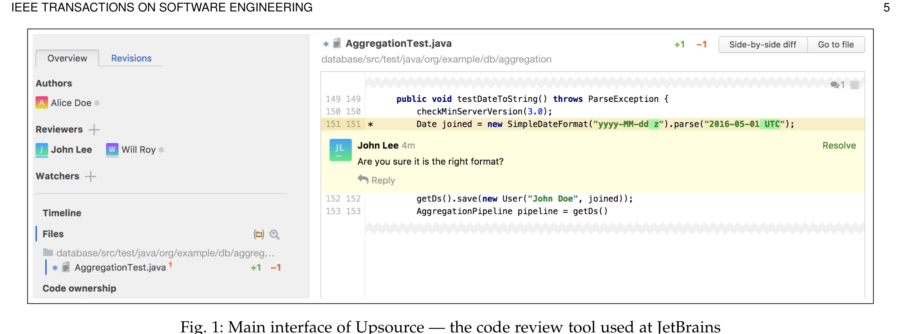

Fig. 1: Main interface of Upsource — the code review tool used at JetBrains

### 3.2 Research Settings

The study we conducted to answer the research questions took place with professional developers, managers, and data from two commercial software companies.

JetBrains: The first subject company is a vendor of software tools for a niche area of professional software developers. The company has over 700 employees, most of whom are located in several development centers across Europe. Upsource, a code review tool, is one of the products of the company and includes a recommender for reviewers. Different teams at JetBrains have been using Upsource for code review since its early releases in 2014 and, subsequently, have used the reviewer recommender since it was implemented in Upsource. However, with no centralized code review policy in place, adoption of Upsource inside the company and within individual teams is underway.

Microsoft: The second subject company is a large corporation that develops software in diverse domains. Each team has its own development culture and code review policies. Over the past eight years, CodeFlow — a homegrown code review tool at Microsoft — has achieved company-wide adoption. As it represents a standard solution for code review at the company (over 50,000 developers have used it so far) and offers an integrated reviewer recommendation engine, we focused on developers who use this tool for code review.

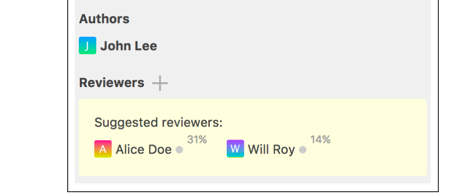

Fig. 2: Instant reviewer suggestions in Upsource

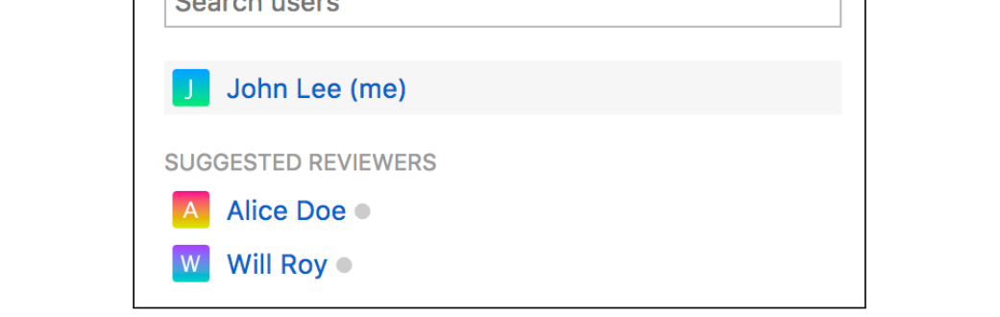

Fig. 3: Reviewer suggestions in search form in Upsource

#### Code review tools

The functioning and features of code review tools, including Upsource and CodeFlow, are substantially the same. Here we explain the functioning by considering Upsource as an example.

Upsource is a commercially available code review tool. It provides code discussion facilities, code highlighting and navigation, and repository browsing features. Figure 1 is a screenshot of the code review interface in Upsource.

Apart from these standard features, Upsource is capable of recommending reviewers for code changes. This feature is central for this work. When a new review is created from a set of commits, the tool analyzes the history of changes and reviews of changed files and ranks the potential reviewers according to their relevance. Then Upsource presents a list of relevant developers to be quickly selected as reviewers with one click (Figure 2). The user can opt to use a search form to add reviewers manually. In such case, the history-based recommendations are presented in the search results as well (Figure 3). We detail the internal structure of the recommendation algorithm in Section 4.2.

Both in Upsource and CodeFlow, the reviewers can be added to a review by any user with corresponding rights, which are typically held by all team members. The standard scenario in the code review workflow both at Microsoft and JetBrains is that it is the author of the change who initiates the review and selects the colleagues whom they prefer to invite as reviewers.

A distinguishing feature of CodeFlow (the code review tool used at Microsoft) is the option to configure the recommendations according to the policy of a team. For example, one team can decide that all the reviews for certain files are sent to an alias visible by all developers in a specific team.

---

### 3.3 Study overview

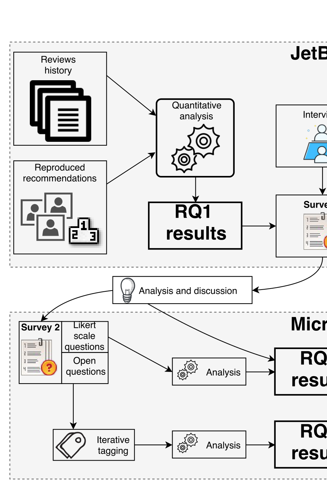

Fig. 4: Overview of the research method

Figure 4 presents a schematic view of the research method employed for investigating the research questions. We briefly describe our method in the following and provide details by research question in the next sections.

Our study followed a mixed-method (qualitative and quantitative) approach [61]. We collected and analyzed data from different sources for triangulation and validation. We conducted our study in three phases.

In the first two phases, we teamed up with JetBrains. In the first of these two phases, with the help of Upsource developers and with a team of Upsource users at JetBrains, we reproduced reviewer recommendations that were given to the users in over 21,000 reviews that took place across the period of 2.5 years. To evaluate recommendation accuracy, we also collected the records of actual reviewers in those reviews. In the second of these two phases, we conducted interviews and sent a survey to JetBrains developers to collect data on developers’ perception and usage of recommendations. In the third phase we turned to Microsoft: we expanded the scope of the investigation and validated our outcomes from the first two phases through a separate structured survey, by targeting the developers working at Microsoft.

We used the quantitative data from the deployed recommender system at JetBrains to answer RQ1. Responses from interviews at JetBrains and surveys at both companies were the primary data sources for RQ2. RQ3 was based on the responses to a large-scale survey at Microsoft.

## 4 RQ1: PERFORMANCE OF THE DEPLOYED RE- VIEWER RECOMMENDER SYSTEM

Our first research question seeks to empirically investigate the performance of a deployed reviewer recommender.

### 4.1 Data collection

To answer this research question, we have reproduced the recommendations for reviews in the codebase of JetBrains’ flagship product — IntelliJ IDEA Ultimate. To extract the necessary dataset from the backup files of the internal Upsource instance at JetBrains, the first author of this article devised a custom build of Upsource, which included a custom module for reproducing the recommendations and dumping the data.

For every completed review, we identify the events of a reviewer being manually added to a review. For each of these events, we reproduce the recommendations that were given to the user who added the reviewer. We identify historical recommendations by sandboxing the components of the actual recommender system and reproducing its output.

Each observation in the dataset represents an event of manual selection of a reviewer. For each of these events, the dataset contains records of the selected user, the user who made the selection, and the recommendations made by two different models. In contrast with studies where the list of recommendations is usually compared against a list of actual reviewers in the whole review, our observations are more fine-grained because a single review can contain multiple addition events. This data structure is mostly dictated by the recommendation algorithm (described in Section 4.2), and it also imposes limitations on the metrics that can be used to evaluate recommendation accuracy (as we explain in Section 4.4.1).

### 4.2 Reviewer recommender internals

Figure 5 presents the scheme of the reviewer recommendation system in Upsource.

For every review, (1) recommendations are calculated based on the changes that are included in this review. For every modified file in the change set, (2) Upsource retrieves the history of all the previous commits affecting these files. For each of these commits, the recommender gathers the (3) VCS meta-data, such as the author and timestamp of the commit and the list of developers who reviewed them. This information is compiled into (4) the input data for the recommendation model. To disambiguate several versioning system aliases of the same user, we associate the aliases with user profiles in an external user management tool.

Based on this input data, for every author and reviewer of the past versions of the files, the recommender model computes a relevance score, based on recency, count, and magnitude of developers’ prior contributions (both as authors and as reviewers) to the files under review. The score is designed to represent the degree of familiarity of each developer with the code under review. This approach is aligned with state of the art in reviewer recommendation [62], [4].

The recommender system filters the list of potential recommendations (5) to remove irrelevant candidates: users who already participate in the review as reviewers (such as

---

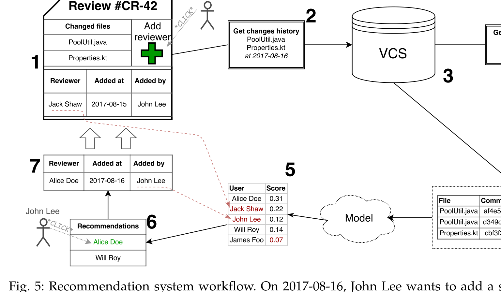

Fig. 5: Recommendation system workflow. On 2017-08-16, John Lee wants to add a second reviewer to his change (1) in addition to Jack Shaw, who is already a reviewer. Upsource collects history of changes for files under review and history of reviews for these changes (4). Based on this data, the recommendation model scores potential reviewers (5). The scored list is filtered, leaving out the current reviewers (Jack), the author (John), and users with low scores (James). The remaining users are converted into a list of recommendations (6). Here a recommended user (Alice) is selected from a list of 2 recommendations, yielding precision of 0.5, recall of 1, and MRR of 1.

'Jack Shaw' in Figure 5, users who have no review access (e.g., because they left the company), users with a score that is too low (such as 'James Foo'), and the author of the change to be reviewed. Finally, (6) the recommender presents at most three of the remaining candidates to the user, who may select one (as in this case) or more, or add someone else through manual search.

### 4.2.1 Two recommendation models

The scoring algorithm, which is at the heart of the recommender system in Upsource, was changed one year and a half after it was deployed. The change in the scoring algorithm, made along with a refactoring and a performance optimization of the recommendation backend, was triggered by user feedback indicating occasional irrelevant recommendations: “It is better not to recommend anyone than to recommend a random person” — Upsource dev lead, thus the change focused on reducing the number of recommendations.

For our study, this change of the scoring algorithm amid the longitudinal data period is a ripe opportunity to observe the effects of this change on the overall performance of the recommender system.

We refer to the first and the second versions as Recency model and Recency+Size model, respectively. The Recency model weights individual contributions of a user to every file, based on their recency: The more recent changes are given more priority to account for the temporal decay of user's expertise [63]. The size of a change does not influence the weight of a contribution in Recency model, and reviewing a change is considered an equally strong contribution as authoring it. The Recency+Size model, in contrast, takes the sizes of contributions into account; furthermore, authoring a

change is considered a stronger contribution than reviewing it, and a different temporal decay function is used.

## 4.3 RQ1.1 — Do the recommendations influence the choice of reviewers?

### 4.3.1 Detecting the influence on choosing the reviewers

In an online setup, without a controlled experiment, it is impossible to directly measure the impact of recommendations on choices made by users. However, the change of recommendation model amid the data period (Section 4.2.1) gives us a chance to seek evidence of such impact.

If the recommendations played a significant role in determining the choice, the set of selected reviewers (also, the output against which the model is evaluated) would be partially defined by the recommendations. As a consequence, the influence of the recommender would lead to an increase in the observed accuracy of the recommendations.

We illustrate the nature of this effect with an exaggerated hypothetical example. Consider Alice, who always decides whether to ask Bob or Charlie to review her changes by tossing a coin. Also consider an isolated reviewer recommender system, that is as simple as tossing another coin and recommending the corresponding reviewer. If we evaluated such a recommender system offline on the history of reviewers of Alice’s changes, in the long run, its precision would converge to 0.5 — the odds of two coins landing on the same side. However, if Alice indeed used that recommender, and followed its recommendations (rather than her own coin) at least once in a while, evaluation of the output of the recommender on historical data would yield higher precision values, because the recommended and the chosen reviewer would match beyond random occasions.

We have reproduced the recommendations provided by both models for the whole period. Given that the outputs

---

### 4.3.2 Results

If the models are different, if we consider the moment in which the deployed model changes, a change of accuracy at this moment would indicate an influence of the recommendations on choices. For example, if choices are biased towards recommendations of the Recency model, its observed accuracy would experience a drop at the moment the Recency+Size model gets deployed instead. A similar argument works for the Recency+Size model — its accuracy should increase once it is deployed, if the recommender influences the choices of users.

Considering the explanation above, we explore the accuracy trend around the model change date to conclude whether we can observe the influence.

As a first step, we compare the output of the two models to ensure that they are dissimilar for the same input, so that we could see a difference in case of influence of the model. The outputs of the two models are indeed dissimilar: The mean value of Jaccard similarity index [64] between the recommendation lists provided by the two models for the same event is 0.502.2

If the recommendations had a significant influence on the choice of reviewers, we would expect the models to demonstrate higher precision when evaluated during the period of their deployment, than during the period when another recommendation model was in place, as an effect of the influence of recommendations on the choices (Section 4.3.1). Figures 6 and 7 indicate lack of such effect: we do not see any increase in precision in Figure 7 at the moment when the Recency+Size model was deployed. On the one hand, the increase in precision could be dampened by the increase of the pool of potential reviewers: it is harder for the model to select a few relevant users from a bigger pool, which could cause precision to degrade. However, coverage figures (Section 4.5.1) suggest that it is unlikely to be the case, and the recommendations from Recency+Size model is actually more focused: Recency+Size model recommends the smaller proportion of the pool (only two in three active users ever got recommended by Recency+Size model), and these recommendations are picked more often: “intersection/recommended” and “match/recommended” ratios are higher than those of Recency model. Another argument towards the lack of influence is that we do not see a decrease of precision of similar nature in Figure 6 at the point when the Recency model went out of use. From this observation, we conclude that the increase in the number of active users does not directly decrease precision, and lack of shift in the precision of one model at the point where the deployed model has changed can be interpreted as an indication of the weakness of influence of model’s recommendations on users’ choices.

We expected to see a noticeable shift in precision values at the moment of change of the deployed model, as a sign of the influence of recommendations on choices. Figures 6 and 7 display no such shift.

2. For calculating the Jaccard index, we only consider the events where at least one of the two models provided a non-empty recommendation list, because (1) we only consider such events for calculating the accuracy metrics and (2) computing the Jaccard index for two empty sets would imply division by zero.

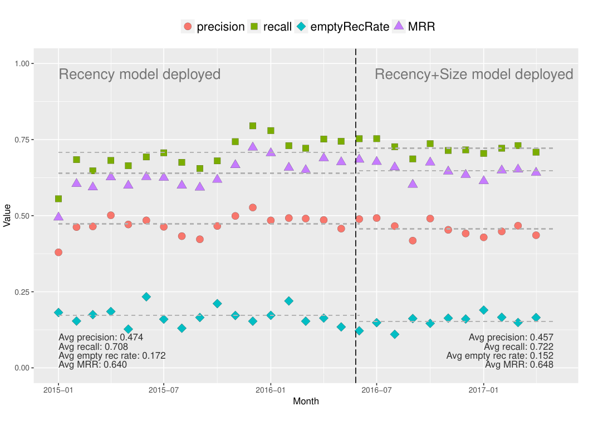

Fig. 6: Accuracy of the Recency model relative to user choices. During the second period, a different recommendation model (Recency+Size) was in use. However, difference in accuracy values between the two periods is well within monthly variance.

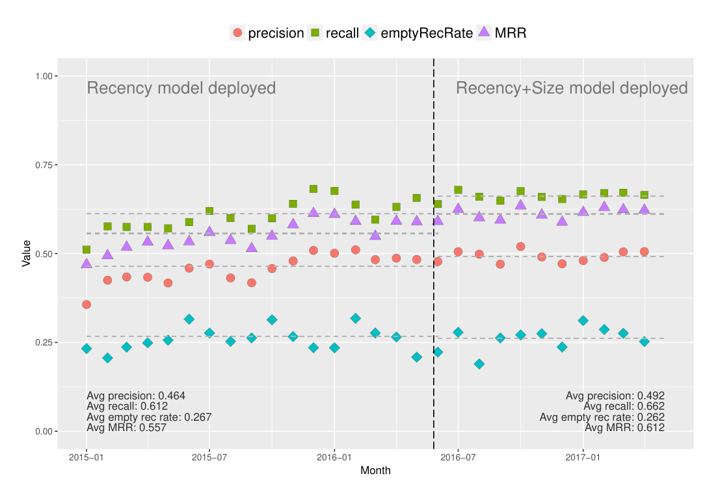

Fig. 7: Accuracy of the Recency+Size model relative to user choices. During the first period, a different recommendation model (Recency) was in use. However, difference in accuracy values between the two periods is well within monthly variance.

## 4.4 RQ1.2 — How accurate are the recommendations of a deployed recommender?

### 4.4.1 Adjusted accuracy metrics

The commonly used metrics to quantify the accuracy of recommendations are top-k accuracy and MRR. These are reasonable metrics of list similarity, which makes them a good choice when the task is to compare two lists — recommended and selected items. However, these metrics are not a good fit for our event-based data. In our case, at every event of reviewer addition, a list of recommendations should be evaluated against exactly one selected user. Because the scope of recommendations in our target system is one review, it might seem reasonable to merge all observations for a given review into one list and use the conventional metrics. It is, however, not feasible for a thorough evaluation: the recommendation output is influenced

---

both by the user who adds a new reviewer and by a set of previously added reviewers. Thus, if the recommendations for a given review were compiled in a list, every item in that list would be defined, among other things, by order of the previous elements in this list. Thus, the only feasible option is to define and calculate accuracy per individual event, and then aggregate these numbers over time periods.

In line with previous investigations on recommender systems for software engineering [4], [34], we calculate the two widely used accuracy metrics — precision and recall, adjusted to our specific case of calculating the match between a set of recommendations and exactly one chosen user. In addition, we calculate adjusted MRR and use it to complement the recall values: unlike recall, MRR considers ranking of recommendations in the list.

Specifically, precision for a recommender system is defined as the fraction of relevant items among all recommended items. In our specific case, as the recommendations are calculated from scratch for every new added reviewer, exactly one item is selected at a time. Thus, for each event, given a non-empty recommendation set Recs for an event where a user U was added as a reviewer, adjusted precision P is defined as:

Precision P = { 1 / |Recs| if U ∈ Recs; 0 otherwise }

Adjusted recall R, the measure of how fully the recommendations cover the relevant items, is defined in a similar way to P:

Recall R = { 1 if U ∈ Recs; 0 otherwise }

While, as described above, MRR would not be a good primary metric for the recommendation accuracy, it complements the recall by penalizing the recommender for placing the correct recommendation below the top position in the recommendation list. Therefore, alongside precision and recall, we calculate the MRR, adjusting it to our scenario of a single recommendation:

MRR = { 1 / rank of U in Recs if U ∈ Recs; 0 otherwise }

### 4.4.2 Results

Figure 8 presents average values of the three accuracy metrics for non-empty recommendations, as well as the frequency of empty recommendations, over the monthly periods. Evaluated during the deployment period, both models demonstrate accuracy values within the known range of prototypes. The Recency+Size model, due to a different scaling formula, is more conservative with recommendations — compared to the Recency model, it is 52% more likely not to produce any recommendations. It leads to a 6.5% lower mean recall and a 4% higher mean precision than for the Recency model. The mean MRR value for the Recency+Size model is 4% lower. Notably, the difference in average accuracy metrics between the two models is within the range of variance of these metrics between consecutive monthly periods for each of the models.

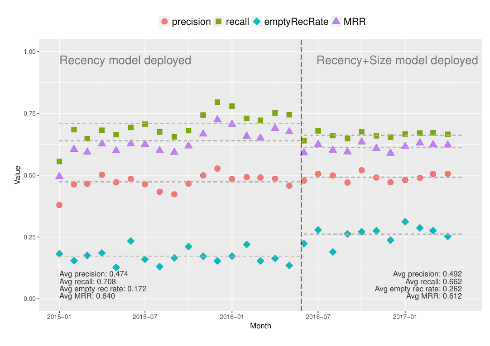

Fig. 8: Accuracy metrics for non-empty recommendations and rate of empty recommendations over 1-month periods

## 4.5 RQ1.3 — What are other performance properties of the recommender?

### 4.5.1 Recommendation count and coverage metrics

Precision and recall are only defined when the set of recommendations is not empty. Thanks to internal filtering in the recommender (described in Section 4.2), it is possible that in some cases the model gives no recommendations. To account for events with empty recommendation lists, where precision and recall cannot be defined, we use frequency of empty recommendations and count of recommendations as auxiliary metrics.

In addition to recommendations count, we augment the accuracy numbers with numbers of catalog coverage — a measure of how many of the users who can hypothetically be recommended do get recommended. In the absence of other studies that consider this parameter of a reviewer recommender, and of a steady definition of the catalog in this context, we use several metrics related to the catalog coverage. For the periods of deployment of each of the two recommendation models, we calculate the following:

- Number of developers who made the code changes in the project in and before the period. This number represents the pool of users who can potentially be recommended.
- Number of developers who were recommended as a reviewer at least once during the period.
- Number of developers who were selected as a reviewer at least once.
- Size of the intersection of the previous two sets.
- Number of developers who have been selected as a reviewer in at least one event where they have also been recommended.

Comparing these numbers adds to the understanding of the difference in behavior of the two recommendation models.

### 4.5.2 Results

Figure 9 presents the recommendation list sizes of the two models. The average count of recommendations from the Recency+Size model is 21% less than for the Recency model.

---

A lower ratio of average lengths of non-empty recommendation lists between two models suggests that a higher rate of empty recommendations largely defines the difference.

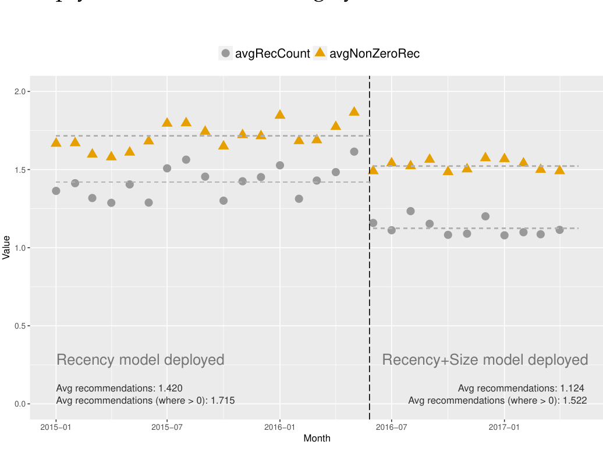

Fig. 9: Average recommendation list size over 1-month periods

Figure 10 presents coverage of recommendation and selection of users, relative to all active users. The numbers demonstrate the value of this metric in addition to accuracy metrics: with analysis based strictly on accuracy metrics, the lower value of recall that Recency+Size model demonstrates, along with only marginal change in precision, would be interpreted as degraded performance compared to Recency model. However, the higher "intersection/recommended" and "match/recommended" ratios that Recency+Size model demonstrates despite a lower "picked/active" ratio, suggest that the smaller subset of active users whom Recency+Size model presents as recommendations appears more relevant to the users, making the recommendations of Recency+Size model more likely to be followed.

### 4.6 RQ1 - Summary

The deployed models’ accuracy is in line with existing results obtained through offline evaluation. The models are slightly different in terms of accuracy metrics. Recency+Size model on average gives less recommendations and reaches a slightly lower average recall. There are no noticeable changes in precision, evaluated for one model, at the moment of the deployed model change. A possible reason for lack of this effect is lack of influence of recommendations on choices of users, which contradicts our expectations about a deployed reviewer recommendation model. To shed light on how the users in our considered setting perceive the recommendations, we turn to a qualitative investigation of this aspect, which we describe in the next section.

## 5 RQ2: DEVELOPERS’ PERCEPTION AND USE OF REVIEWER RECOMMENDATIONS

We dedicate our second research question to understanding the perception of relevance and helpfulness of recommendations by developers. To do so, we turn to the developers with interviews and surveys.

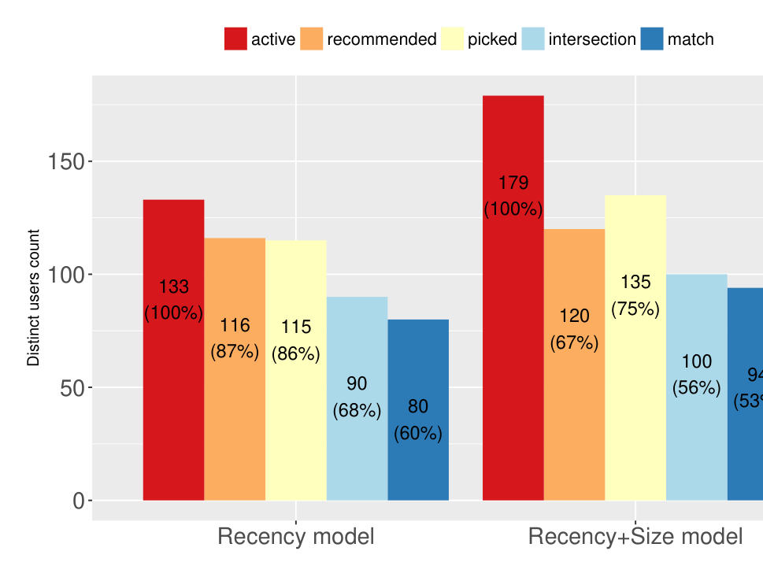

- “active”: number of developers who made code changes in and before the corresponding period;
- “recommended”: number of developers who were recommended as reviewers at least once during the period;
- “picked”: number of developers who were picked as reviewers at least once during the period;
- “intersection”: size of the intersection of “recommended” and “picked” sets;
- “match”: number of developers who were selected in at least one event where they were also recommended.

Fig. 10: Recommendations coverage for the two periods.

### 5.1 Data Collection and Analysis

First, we conducted semi-structured interviews at JetBrains with four developers who routinely use the recommender system. To further explore preliminary themes that emerged during the interviews, we ran an online survey among JetBrains developers. Finally, we sent another, large-scale online survey—augmented with questions addressing the themes that emerged at JetBrains—to developers at Microsoft who perform code review and possibly use the available reviewer recommender system.

Interviews. We conducted a series of online one-to-one interviews with professional developers at JetBrains, each taking approximately 20 minutes. To select participants, we focused on developers from the IntelliJ IDEA team, whose review activity was the subject for quantitative investigation in RQ1. The first author of this paper, who used to work at JetBrains before conducting this work, reached out to several developers from his past professional network. To mitigate the risk of moderator acceptance bias [65], the author selected only developers who provided him with frank feedback on his work at the company on past occasions.

The same author conducted the interviews [66] in a semi-structured form. This form of interviews makes use of an interview guide that contains general groupings of topics and questions rather than a pre-determined fixed set and order of questions. Such interviews are often used in an exploratory context to “find out what is happening [and] to seek new insights” [67]. The guideline was initially based on the main topics that emerged from the analysis of the recommender system’s behavior; then it was iteratively refined after each interview. With consent, we recorded the audio, assuring the participants of anonymity. Since the interviewing author had both backgrounds in software development

---

and practices at JetBrains, he could quickly understand the context and focus on the relevant topics, thus reducing the length of the interviews. We have transcribed the audio recording of each interview for subsequent analysis.

After the first four developers, the interviews started reaching a saturation point [68]: interviewees were providing insights very similar to the earlier ones. For this, we decided to design the first survey that we ran at JetBrains.

### Surveys

The first survey, deployed at JetBrains, was aimed at further exploring the concepts emerged from the data analysis and the interviews. We sent the first survey to all 62 developers working on the product for which we collected the quantitative data at JetBrains. All these developers are using Upsource and are exposed to the recommendation system. This was a short, 5-minute survey, comprising 5 demographic information questions and 4 open-ended questions intermingled with 5 multiple choice or Likert scale questions. The questions were focused on perceived relevance and usefulness of the recommendations. We received 16 valid answers (26% response rate).

The second survey, deployed at Microsoft, was aimed at validating and generalizing our conclusions, by reaching a large number of respondents working in different teams, products, and contexts. For the design of the surveys, we followed Kitchenham and Pfleeger’s guidelines for personal opinion surveys [69]. Both surveys were anonymous to increase response rates [70]. The second survey was split into 4 sections:
- (1) demographic information about the respondent,
- (2) demographic information about the current team of the respondent, multiple choice and Likert scale questions (intermingled with open-ended fields for optional elaboration on the answers) on
- (3) reviewer selection, and
- (4) relevance as well as helpfulness of the reviewer recommendation.

Excluding demographic questions, the second survey consisted of 4 Likert scale questions with several items to scale (complemented by one or two optional open-ended responses) and 3 open-ended questions. The survey could be completed in less than 15 minutes.

We have sent the second survey to 2,500 randomly chosen developers who sign off on at least three code reviews per week on average. We used the time frame of January 1, 2017 to August 1, 2017 to minimize the amount of organizational churn during the time period and identify employees’ activity in their current role and team. As we have found that incentives can increase participation [71], survey participants were entered into a raffle for four $25 gift cards. We received 507 valid answers (20% response rate). The response rates for both surveys are in line with other online surveys in software engineering, which have reported response rates ranging from 14% to 20% [72].

In the rest of this section, when quoting interviewees’ responses, we refer to interviewees from JetBrains as (I#) and to respondents to the JetBrains survey as (S#).

3. Available at https://doi.org/10.5281/zenodo.1404755

## 5.2 RQ2.1 — Do developers need assistance with reviewer selection?

In the interviews, we have asked developers at JetBrains about their criteria of reviewer selection. The answers indicate that the primary characteristic of the desired reviewers is their familiarity with the context of change: “[desired reviewer] is the person who usually works with this [changed] part” (I1), “the person who wrote a lot of code in the subsystem I am changing, or has recently been ‘digging’ into this subsystem — there are fresh non-trivial changes by them” (I3). Along the responses, interviewees refer to the codebase as divided between the developers, each responsible for their subsystem: “someone else’s subsystem and [...] it’s not my subsystem”, “most of the work I do is in my subsystems” (I2), “there is the part of the codebase that I’m responsible for” (I1). This detail suggests the presence of strong code ownership practices at JetBrains.

The answers also indicate that the respondents are usually well aware of who is responsible for the code they are changing, thus often knowing the reviewers in advance. Developers say: “I always know who will be reviewing my changes because I know which subsystem I’m changing and who owns this part” (I1), “it is, from the experience, established who does [code review for my changes]” (I2), “Almost always I know [the future reviewer]” (I3).

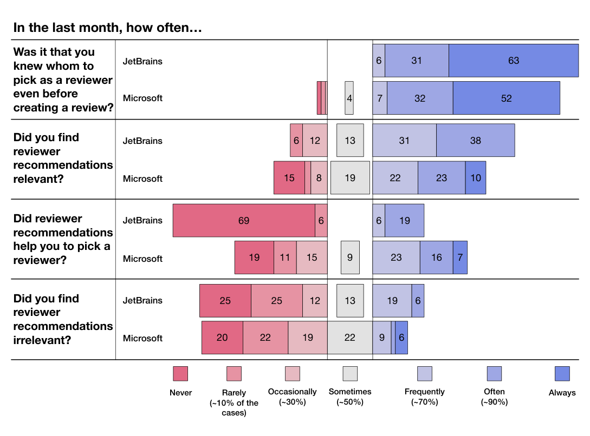

Fig. 11: Distributions of answers to Likert scale questions about relevance and helpfulness of recommendations from Microsoft and JetBrains. Numbers represent the distribution of the responses in percent, rounded to nearest integer.

Results of the survey at JetBrains (presented in Figure 11) confirm this point: To the question “How often do you know whom to pick as a reviewer before even creating a review?” 63% of developers replied that they “Always” know the future reviewer, and 31% answered “Usually (90%)”. The one remaining response was “Frequently (70%)”. The Microsoft survey reveals a similar picture that is only slightly less extreme: 92% of respondents at Microsoft reported that they “Always”, “Usually”, or “Frequently” knew whom to pick as a reviewer before creating a review.

## 5.3 RQ2.2 — Are the reviewer recommendations perceived as relevant?

In the interviews, we have asked JetBrains developers whether they consider the recommendations given by Upsource relevant. The answers indicate that the recommendations are often relevant, and, moreover, it is usually clear why a particular person is recommended. “in about 80% of the cases [recommendations] are relevant”, “I understand why

---

it suggests "these or those people" (I3), "he's a code owner in many places, so that's why it happens" (I2). On the other hand, all interviewees also report the scenarios of irrelevant recommendations. Such cases reportedly occur after changes in subsystem ownership that are not yet widely reflected in change history, or after bulk code modifications (such as API migrations), which have a short-term effect on the recommendation relevance score. "There is a lot of code that's written by people who don't maintain that code anymore, so people who don't even work in the project anymore are sometimes recommended" (I2); "sometimes it happens so that it's absolutely not the right fit—say, someone who left for a different team"; "[apart from the 80% of relevant recommendations] the rest — 20% — are [events] touching old code or code with no 'bright' owner." (I3).

In the JetBrains survey, to the question "How often do you find recommendations by Upsource relevant?", 6 users replied "Usually (90%)", 5 replied "Frequently (70%)", with the rest of answers spread between "Occasionally (30%)" and "Sometimes (50%)". The answers to an open-ended question, that invited the respondents to elaborate on irrelevant recommendations, confirm that users perceive the recommender as not capable of quickly capturing changes in subsystem ownership, which is indeed its Achilles' heel: "suggested people sometimes don't even work for the team (or in this subsystem)" (S3), "sometimes suggested person does not work on this code anymore" (S10), "person is not actively responsible for subsystem anymore" (S16).

The responses from Microsoft, presented in Figure 11, are well aligned with these numbers: most respondents find the recommendations mostly relevant. However, only 10% of respondents find them relevant in all cases.

### 5.4 RQ2.3 — Do the recommendations help with reviewer selection?

Given that developers are often already familiar with the information that the recommender provides, it is essential to assess the added value of the recommendation system. In the interviews, we asked whether the recommendation feature was perceived as useful by the developers. Interviewees report that, in some cases, even while being relevant, recommendations did not provide any useful information. "When I open Upsource, I know who I'll assign, so Upsource doesn't really help me to choose" (I3), "I don't change anything in other parts of codebase — [other subsystems]. If I would change code there, I wouldn't know whose code it is, and would rely on Upsource. But I don't!" (I1). The interviews bring another important aspect to the surface: because some of the recommendations are irrelevant, it is harder to rely on the recommender in general. "It is not very useful. Moreover, it [is wrong] often.", "It is a useful feature [in general], but in my case it [not always] worked correctly" (I1).

Some interviewees mention a scenario when the recommendation is useful, even though they already know the reviewer: when the recommendation matches their intention, they would add the desired reviewer in one click from the recommendations popup (Figure 2), instead of using the search form. "Sometimes I use [recommendations]. Usually I know who will review, so I just click on their icon not to make multiple clicks and search" (I1), "the most convenient part is when the suggested person is already 'kind of' in reviewers list and you just have to click them, I think it's cool" (I2), "Upsource doesn't really help me to choose, but it helps me to click! [...] instead of looking for a user, just click the suggestion and you're done — that's how it's convenient." (I3).

In the survey at JetBrains, 69% of respondents reported that reviewer recommendation "Never" helps them to find a reviewer. On the other hand, 19% of respondents reported that it "Always" helped. This polarity in perceived helpfulness may be attributed to the ambiguity of the question: the "shortcut" scenario may not be considered a case of helpful recommendation by some of the respondents. One respondent to the survey explicitly mentioned the "shortcut" case: "I use it as a quick way of adding a person I have in mind when it's on the list. If it isn't, I just ignore suggestions and use [search]." (S4).

The responses on usefulness from Microsoft (Figure 11) are more smoothly distributed across the frequency scale, with a slight incline towards lower frequencies: the recommendations are "never" or "rarely" helpful for 30% of respondents, 23% find them "usually" or "always" helpful.

### 5.5 RQ2 - Summary

This research question was dedicated to a qualitative investigation of how software developers in the two considered commercial software companies perceive and use code reviewer recommendations. The results of the investigation indicate that developers at both companies very often do not experience problems with reviewer selection. In fact, the vast majority of respondents at both Microsoft and JetBrains report to usually know the future reviewer even before creating a review for new changes. Most survey respondents (56% at Microsoft and 69% at JetBrains) find the recommendations more often relevant than not. However, reviewer recommendation features for reviewer selection were reported to be more often helpful than not by only 46% of respondents at Microsoft and by only 25% at JetBrains. These results suggest that — in the setting of the two considered commercial software companies — reviewer recommendation features in their current state are not perceived as essential for code review tools, since most of the developers usually do not experience any valuable support from recommenders.

The results also call for a deeper investigation on information needs of developers during reviewer selection, to identify other data sources that may be more helpful for future recommendation approaches. The results from RQ2 also call to identify whether recommendations can provide more value and be more helpful in certain situations than on average. We set out to explore these aspects in RQ3. We describe the methodology and results in Section 6.

## 6 RQ3: INFORMATION NEEDS DURING REVIEWER SELECTION

Our third research question aims to better understand the reviewer selection process by figuring developers' information needs when selecting reviewers for a code change.

---

## 6.1 Data Collection and Analysis

We have dedicated a part of the survey at Microsoft to questions regarding information needs of developers during the selection of reviewers. For each of 13 different kinds and sources of information (defined by two authors through brainstorming based on interview transcripts, existing studies on reviewer recommendation, and general knowledge of modern software development environment), we have asked developers:
1. whether they consider it when selecting reviewers;
2. whether they find it relevant for selection of reviewers; and
3. how difficult it is for them to obtain when selecting a reviewer.

To identify other information needs of developers beyond the fixed list, we have included three open-ended questions in the Microsoft survey:
- Please describe other information that you consider when selecting reviewers.
- If there is information that you would like to consider that you aren’t able to obtain, please tell us what information you would like.
- When do you find it most difficult to determine the right reviewers for a changeset that you send out for review?

To structure and quantify the answers to open-ended questions, we have used iterative content analysis sessions [73]. In the first iteration, the first and the last authors of this paper have independently assigned one to three tags to each of the answers. The tags were derived from the answers during the process. After the first iteration, through comparison of the sets of tags and discussion, the authors agreed on the set of categories and fine-grained tags for the final iteration. Finally, the first author repeated the tagging with the new tags for all answers. The last author repeated the process on a random sample of answers for each of the questions (in total for 149 of 617 answers, or 24%).

To estimate consistency of tagging between authors, we calculated Cohen’s Kappa [74] as a measure of inter-rater agreement. Keeping in mind that the number of tags per response could differ, we only took into account the first tag each author marked the response with, as it represents the strongest point in the response. For the fine-grained tags, the Kappa values for the samples are 0.852, 0.747 and 0.814 for respective questions. Calculating agreement measure for categories of tags — thus allowing fine-grained tags to differ if categories match — yields even higher Kappa values of 0.916, 0.851 and 0.859, respectively. Thus, agreement of authors about tag categories can be interpreted as “almost perfect” according to Cohen, and only for fine-grained tags in one of the questions as slightly lower “substantial.” As we do not make any quantitative statements based on exact proportions of different tags in responses, but only rely on these numbers for understanding needs and concerns of developers, a high degree of agreement between authors suggests that the results of tagging are strong and reliable.

## 6.2 RQ3.1 — What kinds of information do developers consider when selecting reviewers?

The answers to the multiple choice question are presented in Figure 12. The most important factor considered by developers during the selection of reviewers is the involvement of the candidate reviewer with the code under change.

Three related categories of information, from generic “the person is still involved with the code” through ownership of files to authorship of recent changes, are reported as considered at least sometimes by 82–91% of the respondents. Another important aspect is whether the potential reviewer works in the area dependent on the changed code: 79% of the respondents report considering it. Other factors that are often (yet slightly less) considered include: the history of past reviews; working on code that the changed code depends on; opting in for reviews in the code area; availability of the person; prior review requests for code under change; and swiftness of response to code review requests. These factors are considered by 56–69% of the respondents. The three least popular categories are: working in directory surrounding files in change (38%); physical proximity of workplace (34%); and, surprisingly reported as irrelevant by nearly half of the respondents, current activity and load level of potential reviewers, which is taken into account at least sometimes by only 32% of the respondents.

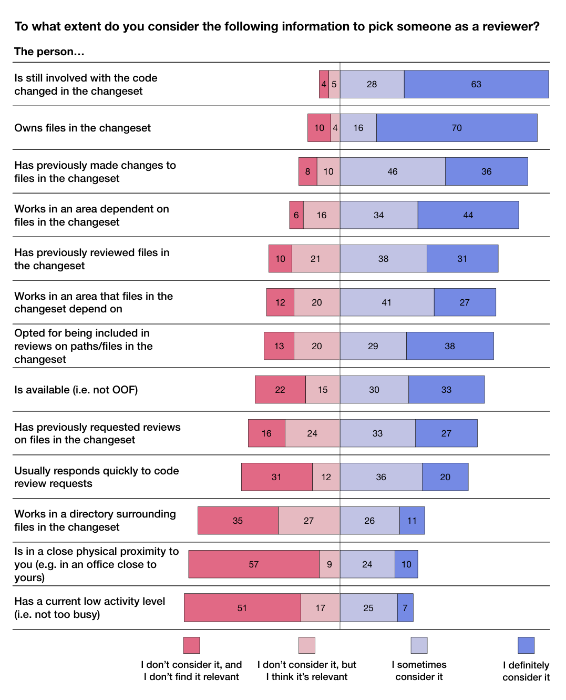

Fig. 12: Information considered during reviewer selection, as reported by Microsoft developers. Numbers represent the distribution of the responses in percent, rounded to the nearest integer.

The second question about considered information is open-ended, inviting the respondents to describe other information that they consider in free form. The answers were processed with iterative tagging (described in Section 6.1). The categories and tags of the answers are presented in Table 1. While being invited to describe other sources of information in relation to the previous question with predefined options, many of the responses correspond to one of these

---

options. We did not filter out such responses. Respondents often make several different points in one response. Such responses are impossible to put in a single category, so we assigned 1 to 3 category tags to each response. In total, we have tagged 270 valid responses with 373 tags, yielding 1.38 tags per answer, on average. We report both the relative frequency of tags and the fraction of responses marked with a tag, while giving priority to the latter when explaining and discussing the results. We refer to individual responses by their ID, e.g. (#329).

### Knowledge
Almost 30% of responses indicate the importance of a potential reviewer's knowledge of one kind or another. These responses refer to knowledge of the area of code: "Person has expertise in the area, so can understand the algorithm changes. I work in [an area] where a lot of background is usually needed." (#54), to high-level or general knowledge: "I'll seek out opinion of known smart folks for some changes." (#498), knowledge of context: "Experts who have solved similar problems." (#192), and specific technical knowledge: "Area of expertise. If person is good in SQL, those types of changes will be reviewed better by that person." (#406).

### None
25% of the respondents said that they do not consider any specific information. A common assignment strategy described in such responses is to broadcast a review request to the immediate team, or to another mailing list: "I send [the review] to the whole team and whoever is available and sees the email/PR first completes it." (#158). Six respondents of 270 reported that they follow some policy to select a reviewer: "Team lead and two other team members are mandatory. Others are optional." (#480).

### Seniority
23% of the respondents mention seniority of a potential reviewer. The categories of reported selection strategies comprise preferring a person higher in hierarchy: "manager of person who owns the file or recently did changes" (#445); a more experienced or skilled person: "I tend to select who I believe are better developers." (#358); selecting a less experienced person to provide a learning opportunity: "I sometimes include new members of the team to review my change and to learn from it." (#349); and delegating the selection of reviewer to a colleague, often a more senior one: "Sometimes I add based on suggestions from other code reviewers, or from my manager." (#26).

### Stakeholder
22% of responses describe the potential reviewer as a stakeholder of code. Some of these responses vaguely mention involvement with a project or feature: "I consider who wrote the files I'm changing, and who is currently working with me on my project." (#382), or relation to change: "People working on deliverables for the same slice." (#466). More concrete answers mention the authorship of recent changes to code under review: "Generally it's who I see in git blame in that area of the code I'm changing." (#279); requesting the change under current review: "The (internal) customer who requested the change being made." (#491); authoring the code or helping with the current change: "If that person was involved in any way during investigation of the problem or he/she was involved in developing this fix." (#164); and working with code that depends on the changed code: "people that depend on that change or are impacted." (#191).

### Reviewer qualities
18.5% of responses refer to qualities of the reviewer without mentioning their relation to code.

The most important quality, mentioned by 34 respondents, is thoroughness of the reviewer, usually known from the track record of quality reviews from their side: "Mostly I look for who can provide the best feedback on the set of changes." (#273). Other qualities include availability: "If the change is simple, I try to load balance based on other work they are doing." (#261) and swiftness of their responses: "I think area interest and responsiveness is most important. Sometimes people can be knowledgeable about an area but fail to respond in a timely way." (#356). Two people mention the physical proximity of the reviewer's workplace, and two more people prefer their changes reviewed by someone whom they see as a nice person: "Someone that I trust and that is not a jerk :)" (#13).

### Ownership
Despite code ownership being mentioned in the multiple-option question, 12.6% of responses refer to this concept at different levels. Most of such responses refer to ownership of the area under change: "Ownership of the area if you know is helpful in deciding whom to add for review." (#152). A few other respondents mention ownership of a feature: "It's mostly the person who is owning the functionality." (#325); predefined ownership of a file or component: "We have owners.txt files in all of our service repositories which identify a base set of reviewers." (#503). Several responses also mention ownership of a service or a repository.

TABLE 1: Other information considered during reviewer selection, as reported by Microsoft developers in responses. Data from responses to an open question. Counts of tags and tagged responses are reported separately: each valid response was assigned one to three tags.

Please describe other information that you consider when selecting reviewers.

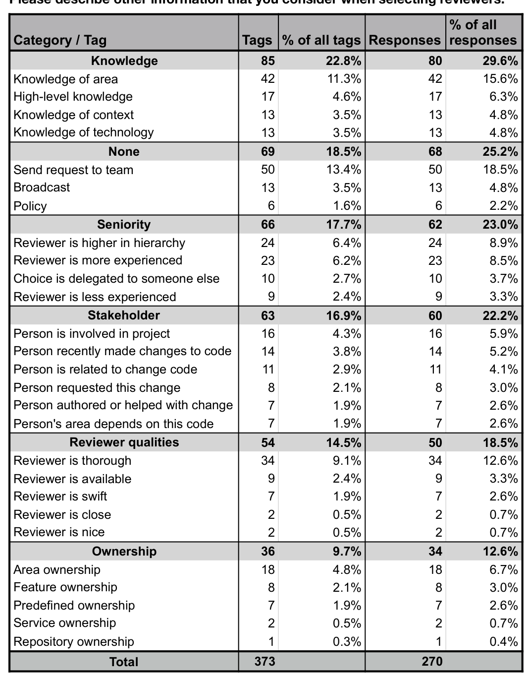

---

In total, nearly 75% of developers at Microsoft reported relying on specific kinds of information when selecting a reviewer for their changes. Various types of information serve to ensure three distinct properties of the potential reviewer: they are qualified to review this change (Knowledge and Seniority categories), are interested in reviewing the changes (Stakeholder and Ownership), and are capable of providing a quality review (Reviewer Qualities).

### 6.3 RQ3.2 — How difficult to obtain are the different kinds of information needed for reviewer selection?

Similarly to the previous research question, which investigated different kinds of information that developers rely on when selecting reviewers, ease of access to different kinds of information was targeted by two questions in the survey at Microsoft: a Likert scale question, which invited respondents to rate each of 13 categories of information by ease of access during reviewer selection, and an open-ended question, which invited respondents to describe what information they miss when selecting reviewers.

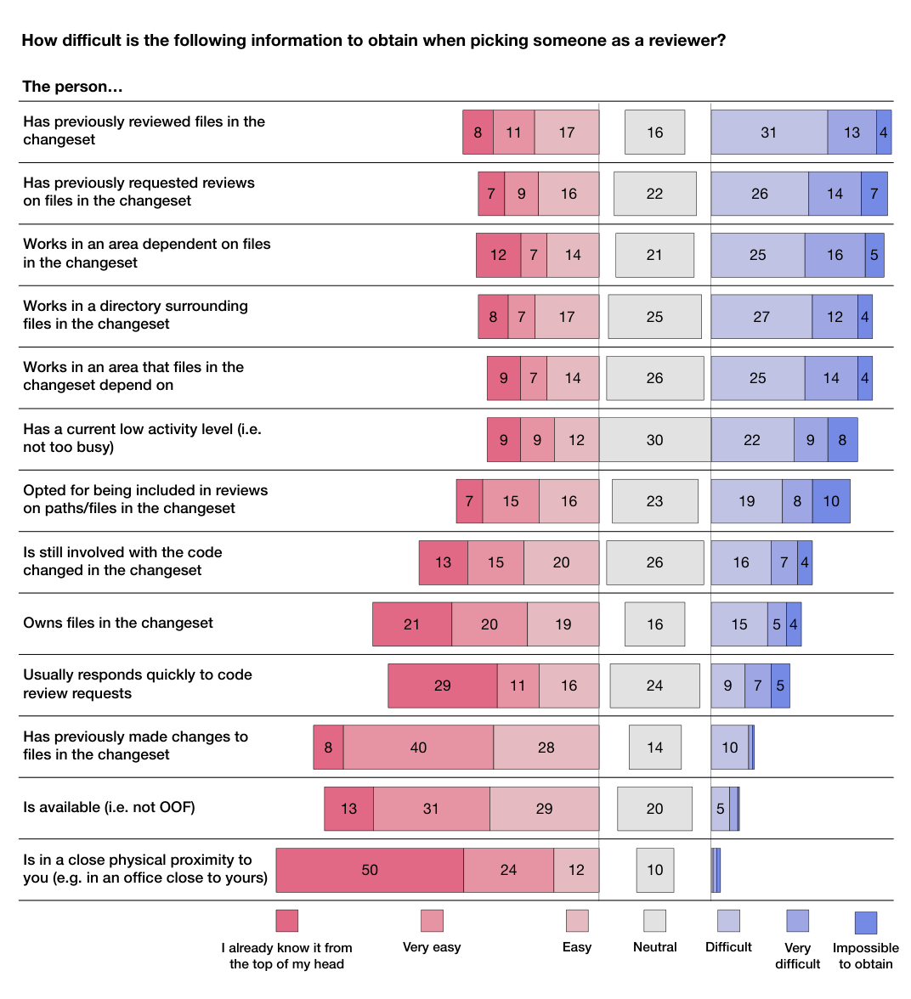

Fig. 13: Difficulty in obtaining different kinds of information during reviewer selection, as reported by Microsoft developers. Numbers represent the distribution of the responses in percent, rounded to nearest integer.

Figure 13 presents the aggregated answers to the Likert scale question. The information that is reported as the most difficult to obtain is the history of past reviews of the files in the changeset, both in terms of performed reviews (reported as difficult to some extent by 48% of the respondents) and of review requests (47%). However, responses display notable diversity — these types of information were classified as easy to obtain by other 38% and 31% of the respondents, accordingly. Another kind of information that is often reported as difficult to obtain is the connection of

potential reviewers’ area to the code in the changeset in terms of codebase proximity or dependency, either as a consumer or a producer. This information is reported as difficult to obtain by 43–46% of the respondents, and as easy by other 30–33%. Other kinds of information, including code ownership, involvement with code under change, and personal qualities of reviewers, are rather easy to obtain for most of the respondents. Notably, history of changes is hard to obtain for only 11% of the respondents, while reviews history is ranked as the hardest. This inequality might be caused by imbalance in tool support for retrieval of histories for changes and reviews — open-text responses about considered information often mention usage of git blame to identify reviewers, with no similar tool existing for the history of reviews.

The second, open-ended question was inviting developers to name other kinds of information that they would like to consider, but are not able to obtain during reviewer selection. We received 74 valid answers and the results are presented in Table 2.

TABLE 2: Information missing during reviewer selection, as reported by Microsoft developers in responses to open questions. Counts of tags and tagged responses are reported separately: each response was assigned one to three tags.

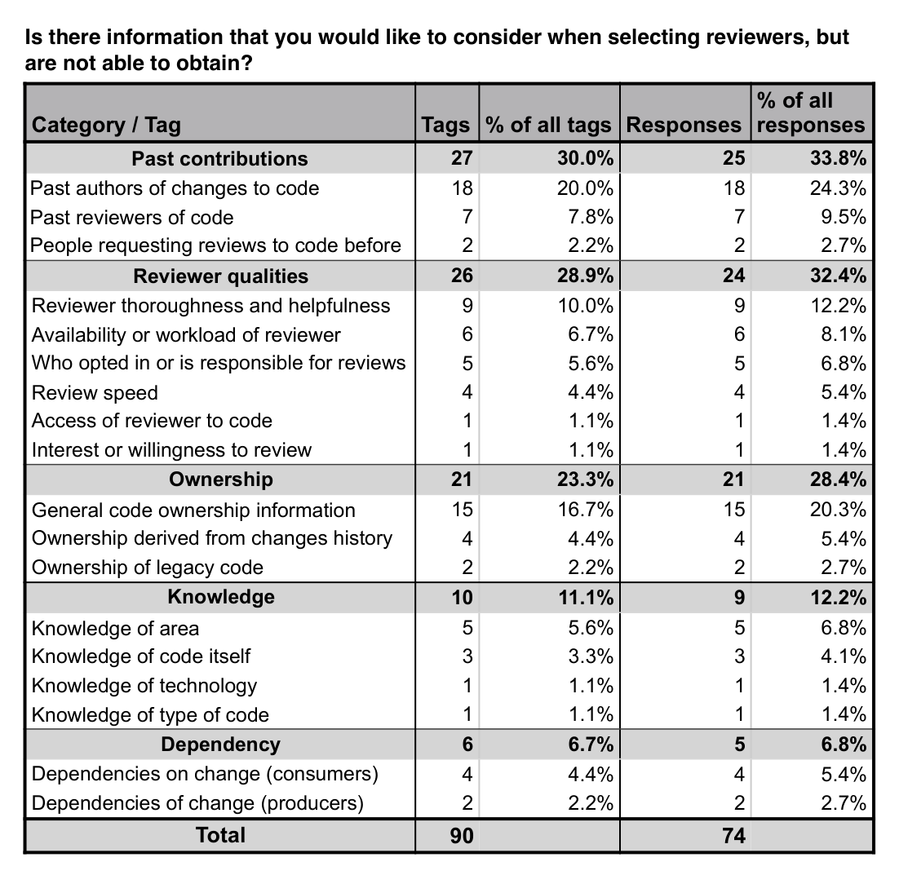

Past contributions. One in three developers (25 of 74) reported missing information about past contributions. History of past changes demonstrates the highest demand with 25% respondents mentioning it. “File history from before the review started (just the git commit comments would be great)” (#45). Some respondents also mentioned missing information about the history of reviews.

Reviewer qualities. 32% of the respondents miss information about reviewer qualities, with the most critical aspect being their thoroughness and helpfulness: “It would be nice to get some sense of whether other developers consider a reviewer’s input valuable” (#120). This result is in line with the results

---

of the question about considered information (RQ 3.1), where reviewer thoroughness is as well reported as the most important quality. Multiple respondents would also like to be aware of reviewers opting in for code areas: “I really want to be able to opt in to say, ‘I want to be included on any review that touches a specific tree/directory/file’” (#260), reviewer availability and their swiftness to respond: “how many other reviews are pending them and how quickly they tend to turn around code reviews.” (#321).

**Ownership.** 28% of the respondents report missing ownership information, with 4 people explicitly mentioning ownership data derived from changes history: “Owners of past changes related to the changeset (most important to consider) is tedious to get even though history does help. If there an auto selection of such owners, that would be great.” (#175), and two respondents mentioning ownership information in the context of selecting a reviewer for legacy code: “File ownership is very nebulous. [...] many of those developers have moved onto other teams and there are enough reorg’s that it’s not clear who is responsible for the code. The hardest part of that information to obtain is transfer of ownership when people move on (be it leave company or team, or reorg to a new project).” (#262).

**Knowledge.** 9 of 74 respondents (12%) mentioned missing information about different aspects of knowledge: “I would like to include people who have significant knowledge about the code being changed, but that’s not always easy to figure out.” (#179).

**Dependency.** 5 responses (7%) mention information about code dependencies, both of changed code and on it: “who are the dependent people working on the same or dependent files at that time” (#473); “I would like to know all authors who have touched the code on which the changeset depends or code that depends on the changeset — automatically.” (#138)

### 6.4 RQ3.3 — When is it more difficult to choose a reviewer?

We identified the more challenging scenarios for reviewer selection with an open-ended question in Microsoft survey. The results are presented in Table 3.

**Uncommon context.** Over a half of the respondents (146 out of 273) reported having a harder time selecting reviewers for changes done in unusual contexts. 92 of these responses (34%) mention changes in areas outside of typical work scope: “When working in feature areas that you do not own, that your team does not own, and that you usually don’t spend time in” (#235). 40 respondents (15%) specifically mention having issues with selecting reviewers for legacy code: “When the code is in a ‘legacy’ area with prior contributors or owners who have changed roles or no longer work at the company. Some code is not actively ‘owned’ at all [...]” (#40). 31 respondents (11%) report problems with selecting reviewers as newcomers to a new team or code area: “When I am new to a team and have not yet built up a mental map of area experts and dependencies between feature areas.” (#46).

**Special ownership.** 100 of 273 responses (37%) specifically mention special cases of code ownership distribution as a trigger for more difficult reviewer selection. 47 responses (17%) describe situations when ownership of code under the change is unclear due to technical issues or transfer of component ownership between teams: “When the code being changed is old and ownership has changed many times since” (#206). 21 responses (8%) mention parts of code shared between teams as a challenging scope to find a reviewer for: “When I make a change on a unusual part of the codebase that is shared with other teams.” (#465); “There are multiple shared files, which gets altered by multiple folks (like app initialization order ...). It is very difficult to find out who is the prime owner of these files.” (#436). 20 respondents (7%) reported having issues with reviewer selection when developing a new feature or component from scratch: “When it is a new logic or code being started and not many in the team are aware of the design and process.” (#423). 12 respondents mentioned difficulties finding a reviewer for changes in code that only they are familiar with: “When it's a component that I pretty much exclusively own [...] People don’t have the bandwidth to deeply learn a new component for the purposes of code review.” (#265).

**Reviewer availability.** 41 of 273 respondents (15%) mentioned issues related to the availability of a potential reviewer as factors for a more challenging selection process. 19 respondents (7%) describe situations when the potential reviewer is not available at the moment, if they are very busy or are on vacation: “When the only other backend developer on the project is out on vacation or otherwise priority tasked on something different.” (#22). 14 respondents (5%) report a harder choice of reviewer when the person typically responsible for a specific piece of the codebase has left the team: “When all the people who worked on the code/reviewed it in the past have left the team/company.” (#77). 5 people (2%) reported situations when no one was willing to review code: “When no one else wants to take ownership of the review. But usually some does or the team takes a call on who it should be.” (#116). 3 of 273 respondents mentioned that it is harder to select a reviewer when they do not know the candidates personally: “If I haven’t personally met everyone on the dev team yet.” (#147).

**Uncommon impact.** 22 respondents (8%) mention unusually high potential impact of their changes, due to presence of dependent code, as a challenging factor for selection: “when changing files in public APIs that are consumed by external teams, it’s difficult to know all the scenarios and the persons to cover for the code changes.” (#125); “when I make changes to code that many people depend on, I send the review to everyone.” (#138).

**Uncommon content.** Only 18 of 273 respondents (7%) reported cases in which the content of the change makes it more difficult to find a reviewer. 10 respondents (4%) mentioned that the choice is more challenging if the review of the change requires specific expertise that few of the colleagues possess: “When I need an expert to figure out if I’m doing the right thing and they aren’t among the folks I know of.” (#504). 6 respondents (2%) talk about unusually large changes: “When the change set is large in terms of number of files or amount of change.” (#175). 2 respondents (1%) said it is more difficult to find a reviewer for changes with complex logic: “Usually when a change is extremely complex.” (#190).

### 6.5 RQ3 - Summary

With this research question, we explored the types of information that software developers need and rely on when selecting reviewers for their changeset.

---

IEEETRANSACTIONS ON SOFTWARE ENGINEERING

TABLE 3: Most difficult situations to choose a reviewer, as reported by Microsoft developers in responses to open questions. Counts of tags and tagged responses are reported separately: each response was assigned one to three tags. When do you find it most difficult to determine the right reviewers? % of all

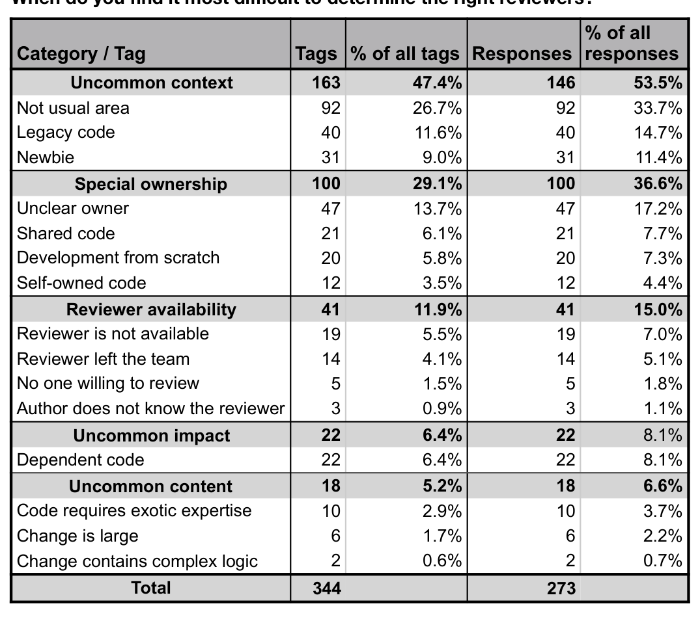

In the first part (Section 6.2), we asked developers about information that they consider for selection of reviewers. The most commonly considered information is involvement of potential reviewers with code under the changeset when selecting reviewers. Such involvement, defined either through formal ownership of code or by regular changes and reviews of the code, is often considered during reviewer selection by the vast majority (69–91%) of the respondents. Such high demand suggests that the standard mechanism of reviewer recommendation approaches (i.e., the identification of involved developers through an analysis of the history stored in software repositories) is indeed targeted to maximize the most important qualities of potential reviewers. Many developers also reported relying on other kinds of information, such as code dependencies and availability of reviewers, which are not yet considered by existing approaches to reviewer recommendation. The open-ended question revealed more categories of relevant information for reviewer selection, such as seniority and personal qualities of potential reviewers.

The second part of this research question (Section 6.3) was dedicated to the difficulty in obtaining the different kinds of information. The most difficult information to obtain is related to the history of reviews and code dependency: 43–48% of developers find this information rather difficult to obtain. The easiest information is code authorship history, availability of colleagues, and physical proximity of their workplaces. Responding to the open-ended question regarding the information developers would like to consider but are not able to obtain, respondents reported missing history of past contributions, information on reviewer personal qualities, knowledge, and code ownership.

In the third part (Section 6.4), we analyzed the most difficult situations for selection of reviewers, as reported by developers in open text responses. The most prominent category of responses mentions reviews for changes in an unknown codebase, including modifying legacy code and being new to a team. Other difficult scenarios include changes in code with an unclear owner, development of new code from scratch, changing code with external dependencies, and situations when the usual reviewer is not available. The insights from this research question indicate directions for improvement of future reviewer recommendation algorithms. We discuss these results in Section 7.3.

## 7 DISCUSSION

### 7.1 RQ1: Performance of a deployed reviewer recommender

The initial result of this study is the first ever evaluation of the performance of a reviewer recommender in action, as opposed to the customary approach of benchmarking isolated prototypes on historical data. Due to limitations imposed by the practical context, we were unable to use the common metrics for recommender evaluation, such as top-k accuracy and MRR, as the primary measures of recommendation performance. Instead, we were looking at each individual event of reviewer addition, and aggregated adjusted precision, recall, and MRR over monthly periods.

The values of the accuracy metrics slightly change throughout the longitudinal data period, which can be attributed to the growth of the user base of Upsource at JetBrains. At the same time, comparison of coverage metrics (Figure 10) reveals that there is a substantial difference between the two recommendation models, which, however, does not result in a drastic change of precision values as the deployed model is changed (Figure 8). This supports the notion (increasingly popular in the Recommender Systems field) of the importance of metrics beyond accuracy for evaluating recommender systems, and demonstrates its applicability to the problem of reviewer recommendation. It also suggests that future efforts in reviewer recommendation should carefully consider the specific, real-world software engineering context, and not count out the potential effects specific to deployed recommenders.

One of such effects is the influence of recommendations on choices of users. While our attempt on identifying it was not straightforward from a methodological point of view (Section 4.3.1) and yielded a negative result, this result was the main inspiration for the other two research questions in this study. While reliably detecting such effects in practice is indeed a hard task due to a need of longitudinal monitoring and A/B testing, our example demonstrates that, in some cases, key insights are possible to gain without expensive experiments.

### 7.2 RQ2: Perception of the recommender by users

In the second research question, we investigated the perception of relevance and usefulness of recommendations by collecting user feedback in two different commercial environments. Developers generally perceive recommendations as relevant. However, developers report that recommendations are not always helpful. It is explained by the fact that developers report to quite often know the future to select reviewer in advance.

---

Evidence of this imbalance is, in our opinion, one of the most important outcomes of this study for researchers. Quite a few studies focus on building new approaches for reviewer recommendation. Researchers strive to improve accuracy over existing algorithms, and in recent work, their efforts go beyond straightforward scoring techniques based on history to building expertise models, which involves more sophisticated methodology [6]. Existing studies on reviewer recommendation argue that tool assistance during the stage of reviewer selection can improve the efficiency of the code review process, which implies that a reviewer recommender is a valuable tool in practical contexts. For example, Thongtanunam et al. [5] found that “[in selected open source projects] 4%–30% of reviews have code-reviewer assignment problem” and concluded: “A code-reviewer recommendation tool is necessary in distributed software development to speed up a code review process”. Our results suggest that code reviewer assignment is indeed problematic in certain contexts (Section 6.4) such as for developers not familiar with code under the change. It is therefore vital to first understand and study the context of application of the recommendation, and then select the appropriate set of evaluation measurements that align with that context, in order to develop helpful recommendation algorithms.

Industrial code review tools, like other work instruments, generally develop in a very pragmatic way by first offering support for actually existing issues. While recent adoption of reviewer recommendation features in several popular code review tools supports the notion of the importance of recommendation as a tool feature, our results strongly challenge the assumption that it is a universally valuable and helpful feature for the users. We believe that research efforts in reviewer recommendation would have a stronger practical impact if they focused on user experience rather than accuracy. A particularly important direction of future work would be to investigate the added value of a reviewer recommender in open source environments: different patterns of contribution frequency and degree of involvement with the project and the team could cause a recommender to be perceived differently from the company settings in our study.

### 7.3 RQ3: Information needs for reviewer selection

Results from our third research question provide insights on reviewer selection process, along with strong indications on the further design of data-driven support in review tools.

Information considered when selecting reviewers. The types of information most commonly taken into account during reviewer selection by developers at Microsoft (Figure 12, Table 1) are related to scopes of responsibility and recent contribution of developers, code ownership, and knowledge of code and involved technologies by individual contributors. Existing approaches to reviewer recommendation estimate the relevance of potential reviewers based on history of changes and prior reviews for files in the current changeset. The history is either used directly to identify prior authors and reviewers of changes similar to the current [4], [12], [56], [57], or as a basis for more complex methods to estimate reviewer relevance. Examples of such methods include using a search-based approach to identify the optimal set of expert reviewers [6], and extracting additional data, such as a social graph of prior developer interactions from comments in prior reviews [58], or records of developers’ experience with technologies and libraries specific to the current changeset, from previous pull requests in the current project [11], [59]. Thus, the results from the survey confirm that prior approaches to reviewer recommendation are well aligned with the most prominent information needs of developers.

However, our results from RQ3 also indicate that, apart from knowledge and prior involvement with code under review, developers consider a more extensive range of factors including codebase dependency information, hierarchy in organizational structure, personal qualities of colleagues, and others. To be more helpful for users and for a broader set of users, future reviewer recommendation approaches could incorporate a broader spectrum of information, beyond histories of changes and reviews and data derived from these histories, into their underlying models as well. Examples of such information could include graphs of code dependencies within the project, records of organizational structure and workplace proximity from HR information systems, or traces of developer communication beyond code review comments, such as emails and messengers.

Prior research [2] established that expectations and outcomes of code review process go beyond elimination of defects and codebase quality control in general. Developers and managers report that benefits of code review also include ensuring knowledge transfer and team awareness of changes in the codebase. Responses from our survey at Microsoft support this point. Some respondents mentioned that they sometimes look for less experienced peers as reviewers to provide a learning opportunity. Concerning awareness, some respondents also mentioned that they are looking for people using their code as a dependency to perform the review, thus ensuring their awareness of changes. Reviewer recommendation systems could promote knowledge transfer and team awareness by not solely focusing on finding developers who already are the most familiar with the code, but also promoting knowledge transfer by recommending less experienced people as reviewers. In our vision, this idea suggests a particularly interesting direction for future research.

We found that personal qualities and hierarchical position of potential reviewers are often considered important factors for the choice. The most important of these factors is the track record of quality reviews from an individual. This highlights the importance of personal qualities and reputation of the engineers for the collaborative activity of software engineering in teams.

Availability of information for reviewer selection. We found that developers find some kinds of information, that is required for reviewer selection, more difficult to obtain. These results suggest opportunities for meaningful tool support of this process. History of prior changes and reviews are reported among the most commonly considered information for reviewer selection (Figure 12). At the same time, options corresponding to the history of reviews are named as the hardest kinds of information to obtain, while change history is among the easiest (Figure 13). As respon-

---

Respondents often directly mention using git blame to identify best reviewers; this imbalance in ease of access to information is likely to be caused by inequality in tool support for retrieval of historical data. Efforts of researchers and practitioners can be targeted at mitigating this inequality. Expanding this notion further, many other difficult-to-obtain information types, such as dependency information, workload level of colleagues, swiftness of review activities of an individual, and proximity of their working area to a given change, can potentially be aggregated by a code review tool. While it might not be feasible to compile all these data into a single universal model for reviewer suitability, merely presenting some of this information to the user during reviewer selection will make it not necessary for users to acquire this information by themselves, thus being a valuable feature to improve the efficiency of the code review process.

### More difficult situations for reviewer selection

Our results reveal that in some situations it is harder for developers to find a suitable reviewer. Examples of such situations (Table 3) include making changes in code outside the normal work area, being new to the company or a team, and having external code depending on the area of change. An implication of this for researchers and developers is the possibility to tailor recommendation tools to users’ needs and reduce noise by making the recommender only trigger when a given user needs assistance. In such situations, the user is more likely to find a recommendation helpful.

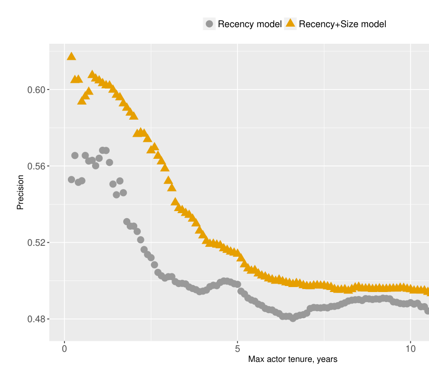

Fig. 14: Precision of recommendations as function of maximum tenure of the developer receiving the reviewer recommendation (i.e., the author of the changeset).

To support this point, we have attempted to discover the potential difference in perception of recommendations by new developers and by others through quantitative analysis. In the data that we used for RQ1, for each event we have additionally estimated the tenure of the receiver of the recommendation (i.e., the author of the changeset), by calculating the time since the first trace of their activity in the historical data, be it a contribution to the codebase or participation in a review. For threshold values varying from zero to lifetime of the project, we have filtered out the events by receivers of the recommendation with tenure above the threshold and calculated average precision of the model across the whole longitudinal period for the rest of the events. Figure 14 presents the picture of precision as a function of maximum tenure of the event actor: for each time threshold, we discard the events where the receiver of the recommendation is more experienced than the threshold, and calculate the average precision across the remaining events. The chart shows that the precision is higher for actors with low experience. Considering that the model does not take characteristics of the receivers of the recommendation into account and that the picture is similar for both models, the effect of high precision for lower-experienced users might be explained by their higher likelihood to follow the recommendations.

Unfortunately, we cannot claim from this observation alone that the less tenured developers are more likely to follow the recommendations: developers report that the responsibility scopes of developers at JetBrains rarely intersect, so the difference in the precision might as well be rooted in the difference of the codebase that they work on. The unstable precision trend, in the left part of Figure 14, suggests that variance in precision between individual actors is high: the trend stabilizes as events by more and more actors contribute to the overall picture. Moreover, a further analysis of the survey responses along with demographic data of the respondents revealed no connection between developers’ tenure in the current team and perceived relevance or usefulness of the recommendations.

For these reasons, a stronger evidence of connection between actors’ tenure and alignment of their choices with recommendations requires designing and running a controlled experiment to be able to control for the confounding factor of difference in their work scopes: we would need to observe many developers with different levels of experience interacting with recommendations given for the same code, which goes beyond the scope of this study where we only use the historical data but do not set up an experiment. Nevertheless, the trend in Figure 14 suggests that conducting such an experiment could be a fruitful direction for future work.

Triangulating the signal above on the potential connection between the experience of the actor and the empirical accuracy with the responses on the most difficult situations for choosing a reviewer (Section 6.4), it seems reasonable to conclude that existing recommendation models and evaluation metrics may be a good fit for scenarios in which a project receives a lot of contributions from external people, such as open source projects and large teams where newcomer onboarding is a frequent procedure. This reasoning would also be in line with the recommendation by Thongtanunam et al., which are based on data from large open source projects [5].

## 7.4 Overview

The results from RQ1 indicate that the choices of reviewers are not strongly influenced by the recommendations. RQ2 reveals that the recommendations are commonly perceived as relevant, yet do not play a major role for most of the developers during reviewer selection. With RQ3 we find that, while the most prominent information needs of developers during reviewer selection — namely, involvement and experience of the colleagues with code under review — are

---

already targeted by the recommendation algorithms, there are other information needs that the future recommendation models could cover, such as information on code dependency and team hierarchy.

The mechanics of the current reviewer recommendation models are well aligned with the information most commonly considered by developers. In fact, the recommendations are perceived as relevant by the majority of the developers (RQ2.2). This means that the developers could benefit from the recommendations as a way to confirm their judgments with data. Moreover, some developers report that they find the recommendations widget useful to quickly add a reviewer they already have in mind (RQ2.3).

At the same time, the results of the surveys demonstrate that the recommendations are not helpful for many developers, as it is common for them to know the reviewers in advance. This calls for development of recommendation techniques that take the development context into account and try to satisfy the information needs of a broader range of developers during reviewer selection that are not covered by existing recommendation approaches, such as code dependency information and team hierarchy. Such more advanced recommenders could be helpful in the complex reviewer selection scenarios. Moreover, future recommenders could not only target the selection of the most relevant reviewers for the given changes, but also optimize for other goals of code review, such as transfer of knowledge within teams and promotion of shared code ownership and responsibility.

## 8 LIMITATIONS AND THREATS TO VALIDITY

The scope of our analysis is limited to the two subject companies, which, due to the exceptional diversity of software engineering environments, cannot be considered representative of the whole range of practices. Despite the difference in scale of the companies, policies and organizational structure, and cultural origin of the respondents, results, where comparable, are highly consistent in the two subject companies.

However, it is essential to underline the role of the study context and its impact on the generalizability of our results beyond the considered development environments. Our results reveal that the conventional means of evaluation of reviewer recommendation systems do not completely align with the needs of developers in the commercial company settings that we studied. An average respondent to the survey at Microsoft works in a team of 12 people, and has been in the team for 2.25 years. Average tenure of a developer in our target team at JetBrains is 5 years. In community-driven open source projects, which accept external contributions, the results may be different, as may be the needs for reviewer recommendation. In fact, the demand for reviewer recommendation might be higher in the projects that often receive one-time or infrequent contributions from people who are less familiar with the codebase and the scopes of responsibility of fellow developers. Such developers may represent a significant number of contributors, compared to the group of core developers. We can expect only core members of open source communities to be familiar with the codebase to the degree that is typical for a developer in a commercial team, as the peripheral contributors commonly devote less time and effort to the project, thus having little chance to gain such familiarity. In larger commercial teams current reviewer recommender models might as well be perceived as a more valuable tool, as for a member of a large team it is harder to be aware of responsibility scopes of the colleagues than for someone whose team is small. In addition, larger teams more often have newcomers, who may especially benefit from the recommender during onboarding. Thus, in different contexts the misalignment between the evaluation techniques for reviewer recommendation and its value for users may be less pronounced, if at all. For these reasons, the value of reviewer recommendation in such contexts deserves a separate dedicated study. Moreover, codebases of some open source ecosystems consist of multiple interconnected projects. In such settings, optimal performance of recommendations might be ensured by other algorithms than in single-repository settings (for example, by algorithms that use history of multiple repositories to recommend reviewers for code in a given repository). We find this another interesting direction for future work.

The authors who tagged the open-ended answers work as researchers, but not as software engineers. Occupation might impose some bias on the interpretation of responses.

We used a weakly formalized method to identify feedback from recommendations on users. Thus, we cannot claim that no feedback is present, but only that it is too subtle to be detected without a controlled experiment; setting up such experiment would require a lot of resources. However, lack of evidence of feedback inspired the other two research questions.

## 9 CONCLUSION

In this study, we have explored multiple aspects of reviewer recommendation algorithms as features of code review tools. We have conducted the first in vivo performance evaluation of a reviewer recommender, explored the perception of relevance and helpfulness of recommendations by users, and investigated the information needs of developers in the process of reviewer selection, in a company setting. The results of this study suggest directions for the future evolution of reviewer recommendation approaches by bringing out the most common information needs of developers in two commercial teams. Our results also provide insights that are valuable in a broader context of the evaluation of data-driven features in developer tools. We further separate the two characteristics: accuracy of an isolated algorithm and its value for the users when deployed, and demonstrate that the two are, to an extent, misaligned in our setting. We interpret this misalignment as a signal of importance of selecting the evaluation techniques with the practical context in mind: in our setting, the common recommendation accuracy measures did not represent the value of the tool for users well. However, in other contexts these techniques may still work well. Our findings emphasize the importance of deeply investigating the context before designing and evaluating reviewer recommender systems.

We hope that the example of this study could serve as an inspiration for other researchers to employ more user- and context-centric methodology when evaluating prototypes of

---

tools that are ultimately motivated by the need to optimize software developers' routine tasks. We believe that studies that are more focused on practical aspects ultimately bring the academic research closer to the software engineering industry.

## 10 ACKNOWLEDGEMENTS

The authors are grateful to all participants of surveys and interviews at JetBrains and Microsoft for their input. Vladimir thanks the amazing people at JetBrains for making the data mining possible. Special thanks to Ekaterina Stepanova for arranging the process from the legal side, and to Upsource team for their help with the technical aspects. We thank Arie van Deursen for his comments on the drafts of this paper.

Bacchelli gratefully acknowledges the support of the Swiss National Science Foundation through the SNF Project No. PP00P2_170529.

## REFERENCES

[1] G. Gousios, M. Pinzger, and A. v. Deursen, “An exploratory study of the pull-based software development model,” in Proceedings of the 36th International Conference on Software Engineering, ser. ICSE. New York, NY, USA: ACM, 2014, pp. 345–355. [Online]. Available: /pub/exploration-pullreqs.pdf

[2] A. Bacchelli and C. Bird, “Expectations, outcomes, and challenges of modern code review,” in Proceedings of the 2013 international conference on software engineering. IEEE Press, 2013, pp. 712–721.

[3] P. C. Rigby, “Open source peer review–lessons and recommendations for closed source,” 2012.

[4] M. B. Zanjani, H. Kagdi, and C. Bird, “Automatically recommending peer reviewers in modern code review,” IEEE Transactions on Software Engineering, vol. 42, no. 6, pp. 530–543, 2016.

[5] P. Thongtanunam, C. Tantithamthavorn, R. G. Kula, N. Yoshida, H. Iida, and K.-i. Matsumoto, “Who should review my code? A file location-based code-reviewer recommendation approach for modern code review,” 2015.

[6] A. Ouni, R. G. Kula, and K. Inoue, “Search-based peer reviewers recommendation in modern code review,” in Software Maintenance and Evolution (ICSME), 2016 IEEE International Conference on. IEEE, 2016, pp. 367–377.

[7] N. Ayewah, D. Hovemeyer, J. D. Morgenthaler, J. Penix, and W. Pugh, “Using static analysis to find bugs,” IEEE Software, vol. 25, no. 5, 2008.

[8] “Code review, project analytics, and team collaboration – features | Upsource,” https://www.jetbrains.com/upsource/features/, accessed: 2018-02-08.

[9] “Crucible – features | Atlassian,” https://www.atlassian.com/software/crucible/features, accessed: 2018-02-08.

[10] O. Kononenko, O. Baysal, L. Guerrouj, Y. Cao, and M. W. Godfrey, “Investigating code review quality: Do people and participation matter?” in Software Maintenance and Evolution (ICSME), 2015 IEEE International Conference on. IEEE, 2015, pp. 111–120.

[11] M. M. Rahman, C. K. Roy, and J. A. Collins, “CORRECT: code reviewer recommendation in GitHub based on cross-project and technology experience,” in Software Engineering Companion (ICSEC), IEEE/ACM International Conference on. IEEE, 2016, pp. 222–231.

[12] V. Balachandran, “Reducing human effort and improving quality in peer code reviews using automatic static analysis and reviewer recommendation,” in Software Engineering (ICSE), 2013 35th International Conference on. IEEE, 2013, pp. 931–940.

[13] J. L. Herlocker, J. A. Konstan, L. G. Terveen, and J. T. Riedl, “Evaluating collaborative filtering recommender systems,” ACM Transactions on Information Systems (TOIS), vol. 22, no. 1, pp. 5–53, 2004.

[14] A. Begel and B. Simon, “Novice software developers, all over again,” in Proceedings of the Fourth international Workshop on Computing Education Research. ACM, 2008, pp. 3–14.

[15] T. Baum and K. Schneider, “On the need for a new generation of code review tools,” in Product-Focused Software Process Improvement: 17th International Conference, PROFES 2016, Trondheim, Norway, November 22-24, 2016, Proceedings 17. Springer, 2016, pp. 301–308.

[16] M. Ge, C. Delgado-Battenfield, and D. Jannach, “Beyond accuracy: Evaluating recommender systems by coverage and serendipity,” in Recommender Systems, 2010.

[17] S. M. McNee, J. Riedl, and J. A. Konstan, “Being accurate is not enough: how accuracy metrics have hurt recommender systems,” in CHI’06 extended abstracts on Human factors in computing systems. ACM, 2006, pp. 1097–1101.

[18] GitHub Help, “About pull request reviews,” https://help.github.com/articles/about-pull-request-reviews/.

[19] “Choosing reviewers – Atlassian documentation,” https://confluence.atlassian.com/crucible/choosing-reviewers-298977465.html, accessed: 2018-02-08.

[20] “Requesting a code review – Help | Upsource,” https://www.jetbrains.com/help/upsource/codereview-author.html, accessed: 2018-07-06.

[21] “JetBrains: Developer tools for professionals and teams,” https://www.jetbrains.com/, accessed: 2018-02-08.

[22] “Microsoft – official home page,” https://www.microsoft.com/en-us/, accessed: 2018-02-08.

[23] P. C. Rigby and C. Bird, “Convergent contemporary software peer review practices,” in Proceedings of ESEC/FSE 2013 (9th Joint Meeting on Foundations of Software Engineering), ser. ESEC/FSE 2013. ACM, 2013, pp. 202–212.

[24] “Code quality – GitHub marketplace,” https://github.com/marketplace/category/code-quality, accessed: 2018-02-08.

[25] “Repository statistics | GitHub developer guide,” https://developer.github.com/changes/2013-05-06-repository-stats/, accessed: 2018-02-08.

[26] K. Wei, J. Huang, and S. Fu, “A survey of e-commerce recommender systems,” in Service systems and service management, 2007 international conference on. IEEE, 2007, pp. 1–5.

[27] K. McNally, M. P. O’Mahony, M. Coyle, P. Briggs, and B. Smyth, “A case study of collaboration and reputation in social web search,” ACM Transactions on Intelligent Systems and Technology (TIST), vol. 3, no. 1, p. 4, 2011.

[28] A.-T. Ji, C. Yeon, H.-N. Kim, and G.-S. Jo, “Collaborative tagging in recommender systems,” AI 2007: Advances in Artificial Intelligence, pp. 377–386, 2007.

[29] W. Carrer-Neto, M. L. Hernández-Alcaraz, R. Valencia-García, and F. García-Sánchez, “Social knowledge-based recommender system: application to the movies domain,” Expert Systems with Applications, vol. 39, no. 12, pp. 10990–11000, 2012.

[30] S. K. Lee, Y. H. Cho, and S. H. Kim, “Collaborative filtering with ordinal scale-based implicit ratings for mobile music recommendations,” Information Sciences, vol. 180, no. 11, pp. 2142–2155, 2010.

[31] Z. Yu, X. Zhou, Y. Hao, and J. Gu, “TV program recommendation for multiple viewers based on user profile merging,” User Modeling and User-Adapted Interaction, vol. 16, no. 1, pp. 63–82, 2006.

[32] D. Ma, D. Schuler, T. Zimmermann, and J. Sillito, “Expert recommendation with usage expertise,” in Software Maintenance, 2009. ICSM 2009. IEEE International Conference on. IEEE, 2009, pp. 535–538.

[33] E. Davoodi, M. Afsharchi, and K. Kianmehr, “A social network-based approach to expert recommendation system,” Hybrid Artificial Intelligent Systems, pp. 91–102, 2012.

[34] J. Anvik, L. Hiew, and G. C. Murphy, “Who should fix this bug?” in Proceedings of the 28th international conference on Software engineering. ACM, 2006, pp. 361–370.

[35] J. Zhou, H. Zhang, and D. Lo, “Where should the bugs be fixed? more accurate information retrieval-based bug localization based on bug reports,” in Proceedings of the 34th International Conference on Software Engineering. IEEE Press, 2012, pp. 14–24.

[36] R. Venkataramani, A. Gupta, A. Asadullah, B. Muddu, and V. Bhat, “Discovery of technical expertise from open source code repositories,” in Proceedings of the 22nd International Conference on World Wide Web. ACM, 2013, pp. 97–98.

[37] V. W. Anelli, V. Bellini, T. Di Noia, W. La Bruna, P. Tomeo, and E. Di Sciascio, “An analysis on time- and session-aware diversification in recommender systems,” in Proceedings of the 25th Conference on User Modeling, Adaptation and Personalization. ACM, 2017, pp. 270–274.

[38] P. Resnick, N. Iacovou, M. Suchak, P. Bergstrom, and J. Riedl, “GroupLens: An open architecture for collaborative filtering of netnews,” in CSCW ’94, Proceedings of the Conference on Computer Supported Cooperative Work, Chapel Hill, NC, USA, October 22–26, 1994, 1994, pp. 175–186. [Online]. Available: http://doi.acm.org/10.1145/192844.192905

---

[39] Y. Koren and R. M. Bell, “Advances in collaborative filtering,” in Recommender Systems Handbook, 2015, pp. 77–118.

[40] B. Smyth, “Case-based recommendation,” in The Adaptive Web, Methods and Strategies of Web Personalization, 2007, pp. 342–376.

[41] S. Chang, F. M. Harper, and L. G. Terveen, “Crowd-based personalized natural language explanations for recommendations,” in Proceedings of the 10th ACM Conference on Recommender Systems. ACM, 2016, pp. 175–182.

[42] J. L. Herlocker, J. A. Konstan, L. Terveen, and J. T. Riedl, “Evaluating collaborative filtering recommender systems,” ACM Trans. Inf. Syst., vol. 22, no. 1, pp. 5–53, 2004.

[43] B. Smyth and P. McClave, “Similarity vs. diversity,” Case-Based Reasoning Research and Development, pp. 347–361, 2001.

[44] L. McGinty and B. Smyth, “On the role of diversity in conversational recommender systems,” in International Conference on Case-Based Reasoning. Springer, 2003, pp. 276–290.

[45] K. McCarthy, J. Reilly, L. McGinty, and B. Smyth, “An analysis of critique diversity in case-based recommendation,” in Proceedings of the Eighteenth International Florida Artificial Intelligence Research Society Conference, Clearwater Beach, Florida, USA, I. Russell and Z. Markov, Eds. AAAI Press, 2005, pp. 123–128. [Online]. Available: http://www.aaai.org/Library/FLAIRS/2005/flairs05-021.php

[46] Workshop on Novelty and Diversity in Recommender Systems (DiveRS 2011), 2011.

[47] L. Iaquinta, M. de Gemmis, P. Lops, G. Semeraro, M. Filannino, and P. Molino, “Introducing serendipity in a content-based recommender system,” in Hybrid Intelligent Systems, 2008.

[48] B. P. Knijnenburg, M. C. Willemsen, Z. Gantner, H. Soncu, and C. Newell, “Explaining the user experience of recommender systems,” User Modeling and User-Adapted Interaction, vol. 22, no. 4–5, pp. 441–504, 2012.

[49] P. Pu, B. Faltings, L. Chen, J. Zhang, and P. Viappiani, “Usability guidelines for product recommenders based on example critiquing research,” in Recommender Systems Handbook. Springer, 2011, pp. 511–545.

[50] N. Tintarev and J. Masthoff, “Explaining recommendations: Design and evaluation,” in Recommender Systems Handbook, 2nd ed., F. Ricci, L. Rokach, and B. Shapira, Eds. Berlin: Springer, 2015.

[51] T. T. Nguyen, P.-M. Hui, F. M. Harper, L. Terveen, and J. A. Konstan, “Exploring the filter bubble: the effect of using recommender systems on content diversity,” in Proceedings of the 23rd international conference on World Wide Web. ACM, 2014, pp. 677–686.

[52] E. Bakshy, S. Messing, and L. A. Adamic, “Exposure to ideologically diverse news and opinion on Facebook,” Science, vol. 348, pp. 1130–1132, 2015.

[53] A. M. Rashid, I. Albert, D. Cosley, S. K. Lam, S. M. McNee, J. A. Konstan, and J. Riedl, “Getting to know you: learning new user preferences in recommender systems,” in Proceedings of the 7th international conference on Intelligent User Interfaces. ACM, 2002, pp. 127–134.

[54] D. Fleder and K. Hosanagar, “Blockbuster culture’s next rise or fall: The impact of recommender systems on sales diversity,” Management Science, vol. 55, no. 5, pp. 697–712, 2009.

[55] E. Rader and R. Gray, “Understanding user beliefs about algorithmic curation in the Facebook news feed,” in Proceedings of the 33rd Annual ACM Conference on Human Factors in Computing Systems. ACM, 2015, pp. 173–182.

[56] P. Thongtanunam, R. G. Kula, A. E. C. Cruz, N. Yoshida, and H. Iida, “Improving code review effectiveness through reviewer recommendations,” in Proceedings of the 7th International Workshop on Cooperative and Human Aspects of Software Engineering. ACM, 2014, pp. 119–122.

[57] G. Jeong, S. Kim, T. Zimmermann, and K. Yi, “Improving code review by predicting reviewers and acceptance of patches,” Research on Software Analysis for Error-free Computing Center TechMemo (ROSAEC MEMO 2009-006), pp. 1–18, 2009.

[58] Y. Yu, H. Wang, G. Yin, and T. Wang, “Reviewer recommendation for pull-requests in GitHub: What can we learn from code review and bug assignment?” Information and Software Technology, vol. 74, pp. 204–218, 2016.

[59] M. M. Rahman, C. K. Roy, J. Redl, and J. A. Collins, “Correct: Code reviewer recommendation at GitHub for Vendasta technologies,” in Automated Software Engineering (ASE), 2016 31st IEEE/ACM International Conference on. IEEE, 2016, pp. 792–797.

[60] D. Cosley, S. K. Lam, I. Albert, J. A. Konstan, and J. Riedl, “Is seeing believing?: How recommender system interfaces affect users’ opinions,” in Proceedings of the SIGCHI conference on Human factors in computing systems. ACM, 2003, pp. 585–592.

[61] J. W. Creswell, Research Design: Qualitative, Quantitative, and Mixed Methods Approaches, 3rd ed. Sage Publications, 2009.

[62] C. Hannebauer, M. Patalas, S. Stünkelt, and V. Gruhn, “Automatically recommending code reviewers based on their expertise: An empirical comparison,” in Automated Software Engineering (ASE), 2016 31st IEEE/ACM International Conference on. IEEE, 2016, pp. 99–110.

[63] C. Lewis, Z. Lin, C. Sadowski, X. Zhu, R. Ou, and E. J. Whitehead Jr., “Does bug prediction support human developers? Findings from a Google case study,” in Proceedings of the 2013 International Conference on Software Engineering. IEEE Press, 2013, pp. 372–381.

[64] P. Jaccard, “Étude comparative de la distribution florale dans une portion des alpes et des jura,” Bull Soc Vaudoise Sci Nat, vol. 37, pp. 547–579, 1901.

[65] A. Furnham, “Response bias, social desirability and dissimulation,” Personality and Individual Differences, vol. 7, no. 3, pp. 385–400, 1986.

[66] B. Taylor and T. Lindlof, Qualitative Communication Research Methods. Sage Publications, Incorporated, 2010.

[67] R. Weiss, Learning from Strangers: The Art and Method of Qualitative Interview Studies. Simon and Schuster, 1995.

[68] B. Glaser, Doing Grounded Theory: Issues and Discussions. Sociology Press, 1998.

[69] B. Kitchenham and S. Pfleeger, “Personal opinion surveys,” Guide to Advanced Empirical Software Engineering, pp. 63–92, 2008.

[70] P. Tyagi, “The effects of appeals, anonymity, and feedback on mail survey response patterns from salespeople,” Journal of the Academy of Marketing Science, vol. 17, no. 3, pp. 235–241, 1989.

[71] E. Smith, R. Loftin, E. Murphy-Hill, C. Bird, and T. Zimmermann, “Improving Developer Participation Rates in Surveys,” in Proceedings of the International Workshop on Cooperative and Human Aspects of Software Engineering. IEEE, 2013.

[72] T. Punter, M. Ciolkowski, B. Freimut, and I. John, “Conducting on-line surveys in software engineering,” in International Symposium on Empirical Software Engineering. IEEE, 2003.

[73] W. Lidwell, K. Holden, and J. Butler, Universal Principles of Design, revised and updated: 125 ways to enhance usability, influence perception, increase appeal, make better design decisions, and teach through design. Rockport Pub, 2010.

[74] J. Cohen, “A coefficient of agreement for nominal scales,” Educational and Psychological Measurement, vol. 20, no. 1, pp. 37–46, 1960.

Vladimir Kovalenko is pursuing a Ph.D. in Software Engineering at Delft University of Technology in the Netherlands. His work is supervised by Alberto Bacchelli and Arie van Deursen. His interests are centered around the idea of making the software development process more efficient with smarter team collaboration tools, by studying user needs and bottlenecks of existing processes and designing data-driven features for future tools. Vladimir received an M.Sc. in Software Engineering from Academic University of the Russian Academy of Sciences, and a B.Sc. in Astrophysics from Saint Petersburg Polytechnic University.

---

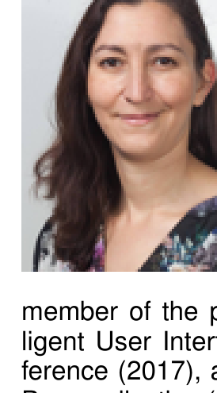

Nava Tintarev is an Assistant Professor and Technology Fellow at Delft University of Technology. Nava completed her Magister at the University of Uppsala, and her PhD at the University of Aberdeen. She was previously an assistant professor at Bournemouth University (UK), a research fellow at Aberdeen University (UK), and a research engineer for Telefonica Research (Spain). Her research looks at how to improve the transparency and decision support for recommender systems. This year she is a senior member of the program committee for the ACM Conference on Intelligent User Interfaces (2018), the ACM Recommender Systems Conference (2017), and the Conference on User Modeling, Adaptation and Personalization (2017). She will be serving as a program co-chair for the Intelligent User Interfaces conference in 2020.

Evgeny Pasynkov is a software engineer and team lead at JetBrains GmbH, creator of intelligent, productivity-enhancing tools for software developers. He received his M.Sc. in Mathematics from Saint Petersburg State University, Russia, and the Ph.D. in Applied Mathematics from Saint Petersburg University of Water Communications, Russia. With more than 25 years of experience in software development, his interests include innovative development paradigms and creation of cutting-edge tools for developers.

Christian Bird is a researcher in the Empirical Software Engineering group at Microsoft Research. He focuses on using qualitative and quantitative research methods to both understand and help software teams. Christian received his Bachelor's degree from Brigham Young University and his Ph.D. from the University of California, Davis. He lives in Redmond, Washington with his wife and three (very active) children.

Alberto Bacchelli is an SNSF Professor in Empirical Software Engineering in the Department of Informatics in the Faculty of Business, Economics and Informatics at the University of Zurich, Switzerland. He received his B.Sc. and M.Sc. in Computer Science from the University of Bologna, Italy, and the Ph.D. in Software Engineering from the Università della Svizzera Italiana, Switzerland. Before joining the University of Zurich, he has been assistant professor at Delft University of Technology, The Netherlands, where he was also granted tenure. His research interests include peer code review, empirical studies, and the fundamentals of software analytics.