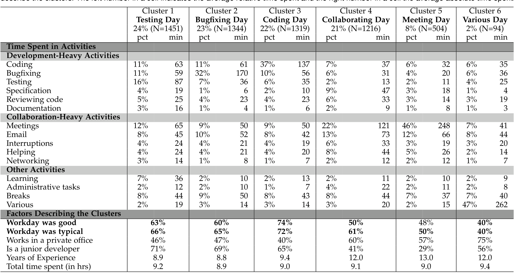
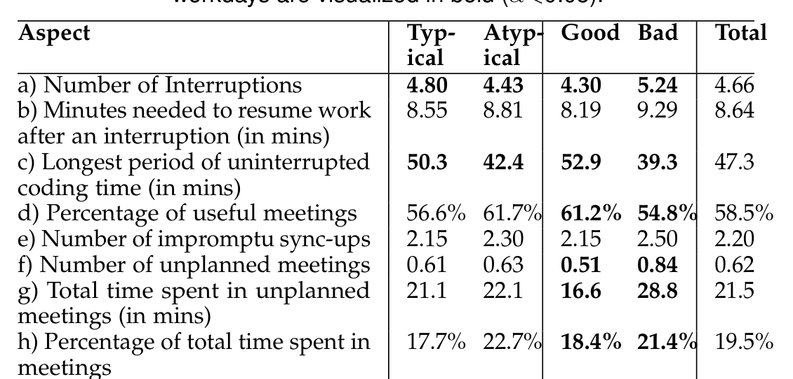
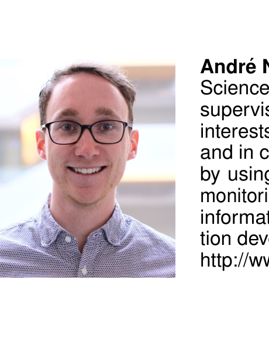

# Today was a Good Day:  
The Daily Life of Software Developers

André N. Meyer, Earl T. Barr, Christian Bird, Member, IEEE, and Thomas Zimmermann, Member, IEEE

## Abstract—  
What is a good workday for a software developer? What is a typical workday? We seek to answer these two questions to learn how to make good days typical. Concretely, answering these questions will help to optimize development processes and select tools that increase job satisfaction and productivity. Our work adds to a large body of research on how software developers spend their time. We report the results from 5,971 responses of professional developers at Microsoft, who reflected about what made their workdays good and typical, and self-reported about how they spent their time on various activities at work. We developed conceptual frameworks to help define and characterize developer workdays from two new perspectives: good and typical. Our analysis confirms some findings in previous work, including the fact that developers actually spend little time on development and developers’ aversion for meetings and interruptions. It also discovered new findings, such as that only 1.7% of survey responses mentioned emails as a reason for a bad workday, and that meetings and interruptions are only unproductive during development phases; during phases of planning, specification and release, they are common and constructive. One key finding is the importance of agency, developers’ control over their workday and whether it goes as planned or is disrupted by external factors. We present actionable recommendations for researchers and managers to prioritize process and tool improvements that make good workdays typical. For instance, in light of our finding on the importance of agency, we recommend that, where possible, managers empower developers to choose their tools and tasks.

Index Terms—Software Developer Workdays, Productivity, Job Satisfaction, Good Workdays, Typical Workdays, Quantified Workplace.

## 1 INTRODUCTION

Satisfied developers are more productive and write better code [1], [2], [3], [4]. Good workdays increase developer job satisfaction [5]. Understanding what differentiates good workdays from other days, especially atypical days, will help us make good days typical. This work seeks just this understanding. Understanding typical and atypical workdays will enable us to establish a baseline for comparison with other developer workdays and make more informed decisions about process improvements.

Development is a multistage process with complicated interactions across the stages. These interactions mean that we cannot consider each stage in isolation, but need consider the process as a whole. We need a holistic understanding of how software developers spend their time at work. Without a holistic understanding, one might think that developers, because they “develop”, spend most of their time writing code. However, developers spend surprisingly little time with coding, 9% to 61% depending on the study [6], [7], [8], [9], [10], [11], [12]. Instead, they spend most of their time collecting the information they need to fulfill development tasks through meetings, reading documentation or web searches, helping co-workers, and fulfilling administrative duties. The conventional wisdom is that email is a big source of distraction and frustration. We show that, to the contrary, email activity has little effect on a workday’s perceived goodness (Section 5.1). Hence, focusing just on one development activity can miss important opportunities for productivity improvements.

We have therefore set out to better understand how to make good days typical to increase developer job satisfaction and productivity. Since a review of existing research revealed no work that attempted to define or quantify what a good and typical developer workday is, we studied developers’ workdays from these two new perspectives1. We conducted a large-scale survey at Microsoft and asked professional software developers whether they consider their previous workday to be good and typical, and related their answers and reflections to their self-reports of the time spent on different activities at work. From now on, when we describe good and typical developer workdays, we refer to developers’ self-reports; we discuss the validity of this method in Section 4.3. We received 5,971 responses from professional software developers across a four month period. From these responses, we developed two conceptual frameworks to characterize developers’ good and typical workdays. When we quantitatively analyzed the collected data, we found that two main activities compete for developers’ attention and time at work: their main coding tasks and collaborative activities. On workdays that developers consider good (60.6%) and typical (64.2%), they manage to find a balance between these two activities. This highlights the importance of agency, one of our key findings that describes developers’ ability to control their workdays, and how much they are randomized by external factors such as unplanned bugs, inefficient meetings, infrastructure issues.

Our work provides researchers and practitioners with a holistic perspective on factors that influence developers’ workdays, job satisfaction and productivity. In the paper, we discuss five main recommendations for managers to make good workdays typical. Overall, it is important to

- A. N. Meyer is with the Department of Informatics, University of Zurich. E-mail: ameyer@ifi.uzh.ch.
- E. Barr is with the University College London. E-mail: e.barr@ucl.ac.uk.
- C. Bird and T. Zimmermann are with Microsoft Research. E-mail: christian.bird@microsoft.com, tzimmer@microsoft.com.

Manuscript submitted August 8, 2018. Revised February 11, 2019. Accepted March 8, 2019.

1. We intentionally do not list our own definitions of good and typical workdays since one aim of this work is to understand the characteristics of these workdays, and how developers assess and define them.

---

Remove and reduce obstacles that block developers from creating value and making progress. Our findings confirm and extend recent related work (e.g. [9], [13], [14]), including that the most important impediments that require attention are inefficient meetings, constant interruptions, unstable and slow systems and tools, and administrative workloads. Conversely, some factors believed anecdotally to be a problem, such as email, in fact have little effect on how good or typical a workday is perceived to be. Since we found evidence that meetings and interruptions are not bad overall as their impact depends on the project phase, we conclude that they do not have to be minimized at all times. For instance, we can better support the scheduling of meetings and help find more optimal slots depending on the project phase or current workday type. Also, improving developers' perceptions of the importance and value of collaborative work can reduce their aversion against activities that take time away from coding. For example, managers can include developers' contributions to other teams or (open-source) projects when they evaluate them in performance reviews. Finally, giving developers enough control over how they manage their work time is important to foster job satisfaction at work. This can, for instance, be achieved by allowing flexibility in selecting appropriate work hours, locations of work, and tasks to work on.

The main contributions of this paper are:
- Two conceptual frameworks that characterize developers' workdays from two new perspectives: what makes developers consider workdays good and typical.
- Results from 5971 self-reports from professional software developers about how they spend their time at work. The number of responses is an order of magnitude bigger than previous work and allows us to replicate results from previous work at scale, and to uncover nuances and misconceptions in developers' work.
- Quantitative evidence identifying factors that impact good and typical workdays for software developers and the relationships between these factors, workday types, and time per activity.
- Recommendations that help researchers and practitioners to prioritize process and tool improvements that make good workdays typical.

## 2 RESEARCH QUESTIONS

Our research is guided by the following main research question: What is a good and typical workday for developers? We formulated subquestions to approach the main research question from different perspectives. First, we want to find out qualitatively what factors impact what developers consider as good and typical in a workday:

> [RQ1] What factors influence good and typical developer workdays and how do they interrelate?

While much related work has looked into how much time developers spend on various work activities (Section 3), we want to investigate how developers spend their time differently on days they consider good and typical:

> [RQ2] How do developers spend their time on a good and typical workday?

The large dataset of 5971 survey responses allows us to compare the time a developer spends on different activities with other developers. We want to group developers with similar workdays together and use other responses from the survey to describe and characterize these groups as workday types:

> [RQ3] What are the different types of workdays and which ones are more often good and typical?

As described in the related work section, developers spend a lot of time at work in development-unrelated activities, such as meetings and interruptions. We want to further investigate the impact of these collaborative aspects on good and typical workdays.

> [RQ4] How does collaboration impact good and typical workdays?

## 3 RELATED WORK

Guaranteeing software is written on time, with high quality and within the budget is challenging [15]. Hence, researchers and practitioners are working both on improving the way code is written, e.g. by improving tools and programming languages, but also on how people write the software, e.g. their motivation, skills, and work environments. The work we discuss below gives insights into how developers spend their time at work, factors that influence their work, and how different work habits correlate to job satisfaction and productivity.

### 3.1 Developer Workdays

Recent work on how developers spend their time has focused on what developers do in the IDE, their execution of test cases, usage of refactoring features, and time spent on understanding code versus actually editing code [16], [17], [18], [19]. Other work has investigated developer workdays more holistically, looking at how they spend their time overall on different activities, and through various means: observations and interviews [6], [7], [8], [9], [10], [11], self-reporting diaries [6], and tracking computer usage [10], [12]. These studies commonly found that developers spend surprisingly little time working on their main coding tasks, and that the times reported on development and other activities varies greatly. For example, in 1994, Perry and colleagues found that developers spend about 50% of their time writing code [6], while, in 2011, Goncalves et al. found that it is only about 9%, with the rest being spent collaborating (45%) and information seeking (32%) [7]. Recently, Astromskis et al. reported the highest fraction of time spent coding (61%) compared to other activities [12].

There could be many reasons for these differing results. One reason could be differences in how the studied companies and teams organize their work, in how their products are built and in the type and complexity of software they develop. The shift to agile development might further explain why newer studies report higher time spent in collaborative activities. The exact definition of what accounts a coding activity and the method of capturing the data is another possible explanation. Observation and diary studies are typically shorter, as they require more time from study participants and have a higher risk of influencing them [20]. Or, the timing of the study captured a time when developers were extraordinarily busy (e.g. before a deadline), wrapping up a project, or for some other reason.

---

In our work, we further explore this challenging space of understanding developers’ workdays using self-reporting at scale and by including two new perspectives of workdays: whether they are good and typical. A number of findings from previous work (e.g., very little coding time, costly interruptions, inefficiency of emails) rest on small samples, usually on the order of 10–20 participants, from observational, diary, and tracking studies. We validate and replicate these findings at scale, transmuting them into solid findings. The scale of our dataset also provides the resolution to enable uncovering nuances and misconceptions in what makes developers’ workdays positive and productive.

### 3.2 Factors that Impact Workdays

A vast body of research exists on factors that influence developers’ workdays and what effect they have on developer productivity (e.g., efficiency at work, output, quality) and well-being (e.g., anxiety, stress level). For example, interruptions, one of the most prominent factors influencing developers’ work, have been shown to lead to a higher error rate, slower task resumption, higher anxiety and overall lower task performance [14], [21], [22], [23]. Emails were shown to extend workdays [24] and be a source of stress, especially with higher amounts of emails received [25] and longer time spent with emails [26].

What is often left out from research about factors influencing workdays are human aspects, such as developers’ job satisfaction and happiness. Job satisfaction is a developer’s attitude towards the general fulfillment of his/her expectations, wishes and needs from the work that he/she is performing. One important factor that influences job satisfaction is the sum of good and bad workdays, which we define as the degree to which a developer is happy about his/her immediate work situation on the granularity of a single day. The developer’s affective states, such as subjective well-being, feelings, emotions and mood, all impact the assessment of a good or bad workday. Positive affective states are proxies of happiness and were previously shown to have a positive effect on developers’ problem solving skills and productivity [1], [2], [4], [27]. Similarly, aspects of the job that motivate developers or tasks that bring them enjoyment were also shown to lead to higher job satisfaction and productivity [28], [29]. Self-reported satisfaction levels of knowledge workers [30], and more specifically, self-reported affective states of software developers [3], have further been shown to be strongly correlated with productivity and efficiency. Similarly, developers’ moods have been shown to influence developers’ performance on performing programming tasks, such as debugging [31]. However, it is unclear how these and other factors influencing developers’ workdays affect their assessment of whether a workday is good or bad. Ideally, we would use this knowledge to increase the number of good, positive workdays and reduce the negative ones.

Previous psychological research connected positive emotions with good workdays [4] and satisfaction [32]. When studying the relationship between positive emotions and well-being, hope was found to be a mediator [33], [34]. Positive emotions at work were further shown to increase workers’ openness to new experiences [35], to broaden their attention and thinking [34], [36], and to increase their level of vigor and dedication [34], yielding higher work engagement and better outcomes. Sheldon et al. have further shown that on good days, students feel they have higher levels of autonomy and competence, which also results in better outcomes [5].

One goal of the reported study is to learn how developers assess good workdays and what factors influence their assessment. Amongst other results, we found that on good workdays, developers succeed at balancing development and collaborative work, and feel having spent their time efficiently and worked on something of value (Section 5.1).

There is also research indicating that good and typical workdays are related. For example, knowledge workers were shown to be more satisfied when performing routine work [37], [38]. Contrarily, a literature review on what motivates developers at work, conducted by Beecham et al., found that the variety of work (differences in skills needed and tasks to work on) are an important source of motivation at work [28]. Similarly, recent work by Graziotin et al. found that one of the main sources of unhappiness are repetitive and mundane tasks [13]. In this paper, we also investigate the factors that make developers perceive their workdays as typical (Section 5.2), and explore the relationship between good and typical workdays (Section 6).

## 4 STUDY DESIGN

To answer our research questions, we studied professional software developers at Microsoft. Microsoft employs over thirty thousand developers around the globe with more than a dozen development centers worldwide. The teams follow a broad variety of software development processes, develop software for several platforms, develop both applications and services, and target private consumers and enterprise customers.

### 4.1 Survey Development Using Preliminary Interviews

To study developer workdays in a subsequent survey, we needed a taxonomy of activities they pursue. We started with the taxonomy of activities by LaToza et al. [16] in their study of developer work habits. To validate and potentially enrich this taxonomy, we contacted a random sample of developers at various levels of seniority across many teams and scheduled half an hour to interview them about their activities at work, conducting ten interviews in total. In each interview, we first asked the developer to self-report and describe all of the activities that they engaged in during the previous workday, including the type of activity, the reasons for the activity, the time spent in the activity, and what time of day the activity occurred. We encouraged them to use email, calendars, diaries etc. as these act as “cues” [39] and have been shown to reduce interview and survey measurement error [40], [41], [42], [43], [44]. We then asked interview participants to list additional activities that they engage in, regardless of frequency or duration.

After gaining the approval of Microsoft’s internal privacy and ethics board, we conducted interviews with developers until the data saturation point was reached [45]. That is, once new interviews yield no additional information, further interviews will yield only marginal (if any) value [46]. The set of activities saturated after seven interviews, but we conducted ten to increase our confidence that we had captured all relevant activities. Once we had collected all of

---

the activities, two of the authors grouped them into activity categories using a card sorting approach [47].

## 4.2 Final Survey Design and Participants

To increase our understanding of developers’ workdays and what makes them good and typical, we broadly deployed a survey to developers at Microsoft. We followed Kitchenham and Pfleeger’s guidelines for surveys in software engineering [48] and based the questions on our insights from the interviews. Our survey comprised four main sections:
1. We first asked about demographics, including team, seniority, and development experience.
2. Next we presented respondents a list of activities (those we developed in the interviews) and asked them to indicate how much time they spent in each activity on their previous workday. We allowed respondents to write in additional activities if they had an activity that was not covered by our taxonomy.
3. Third, we asked if the previous workday was a typical day or not and if they considered it to be a good day. In both cases, we asked them to explain why as an open response.
4. Finally, we asked a number of additional questions about their day, including how many times they were interrupted, and how many impromptu meetings occurred.

In an effort to minimize the time required to complete the survey and avoid participant fatigue, only a random subset of the questions in the fourth category were shown to each respondent. In total, each question in the fourth category was answered by a random 10% subset of respondents. Our goal for the survey was to take only five to ten minutes to complete. After the study was completed, the online survey tool indicated that the median time to complete the survey was just over seven minutes.

First, Microsoft’s ethics and privacy board reviewed our survey. To pilot the survey and identify any potential problems, we then sent the survey to 800 developers over the course of one week with an additional question asking if any aspect of the survey was difficult or confusing and soliciting general feedback. After examining the responses, we made small wording changes for clarity and also confirmed that our activity list was complete. Since the changes were very minor, we also included the pilot responses in our analysis. In an effort to make our study replicable, we provide the full survey in the supplementary material2.

We then sent out 37,792 invitations to complete the survey by sending approximately 500 invitations on a daily basis over the course of roughly 4 months. Developers were selected randomly with replacement, meaning that it was possible that a developer would receive the survey multiple times over the course of the study (though never more than once on a given day). Each developer received a personalized invitation via email that explained who we were and the purpose of the survey. To encourage honest responses and improve participation rate, survey responses were anonymous. In the invitation email and survey description, we explicitly stated that participation is voluntary, the survey is completely anonymous, all questions are optional, and that only aggregated and no individual data will be shared with collaborators at Microsoft. Participants could also contact us in case they had any questions or concerns. Even though the survey was anonymous, 43.8% of respondents chose to reveal their identity. Among them, only 6.6% responded twice and none repeated more than once. In Section 8, we discuss potential threats of this study design choice. We analyzed the responses in the unit of a workday, not a developer.

We used a one sample continuous outcome confidence interval power analysis to determine our required sample size [49]. To achieve a confidence level of 95% for a 5% confidence interval, the power analysis indicated that we needed 385 responses. Since we were not sure ahead of time the exact ways that we would be partitioning and comparing the responses, we aimed for ten times that amount. In total, we sent 37,792 survey invitations and received 5,971 responses. This is a response rate of 15.5%, which is in line with response rates reported by other surveys in software engineering literature [50]. From the 5,971 responses we collected in the survey, 59.1% of the developers stated they are junior and 40.5% senior developers. 0.4% (or 26) did not specify their seniority level. Respondents reported an average of 10.0 years (±7.48, ranging from 0.5 to 44) of experience working in software development.

2. Supplementary material: https://doi.org/10.5281/zenodo.1319812

## 4.3 The Validity of Self-Reported Data

Collecting time-use data can be achieved through various methods, including observations, automated tracking, and self-reporting. We decided to ask developers for self-reports, for the following reasons: self-reports (1) scale better than observations to have a representative sample, (2) they collect a more holistic view compared to using time tracking software that misses time away from the computer (which was shown to be on average about half of a workday for developers [10]), and (3) since we investigate developers’ individual perceptions of good and typical workdays, it makes sense to compare those perceptions with their own estimations of how they spend time. Further, self-reported data is also common in large-scale time-use surveys, such as the American Time Use Survey [51]. However, self-reports on behaviors and time spent are profoundly influenced by the question wording, format and context, and can, thus, be unreliable [44]. To overcome these risks, we carefully designed the self-report questions based on recommendations from related work, especially Schwarz et al. [44], [52], and we test-ran our questions first with ten interviewees before running the actual survey study.

We intentionally asked respondents to self-report about the activities of the previous workday instead of asking more generally. This was a conscious methodological design decision based on the following reasons. First, the previous day is recent, thereby increasing recollection accuracy. This holds true even if the self-report is about the Friday the week before in case respondents answer on a Monday. According to Tourangeau et al., by far the best-attested fact about autobiographical memory is that the longer the interval between the time of the event and the time of the interview or survey, the less likely that a person will remember it [39]. Second, a day is a short period of time to recall, and a large body of research on surveying and recollection has found that when the reference period is long, respondents tend to use heuristics and estimation of frequencies rather than concrete occurrences [44], [52], [53], [54]. This can decrease validity, as Menon found that “to the extent that behavioral frequencies are reported based on inferential heuristics, they

---

are judgements and are subjective” [52]. Being asked how many times one went out to eat last week, most people will likely count concrete instances, whereas if the reference period is last year, they will almost certainly estimate based on heuristics. Lastly, even if a respondent does recount concrete events, larger reference periods can fall prey to a phenomenon known as “telescoping” whereby a notable event is remembered as occurring more recently than it actually did [55], [56]. By using the period of a single day, events are less likely to cross a “night boundary” and be attributed to the wrong day [54].

We encouraged participants in the interviews and survey to use their email clients, calendars, task lists, diaries etc. as “cues” [39] to improve their recall of their previous workday and reduce measurement errors [40], [41], [42], [43], [44]. Finally, we asked respondents to self-report the times spent in minutes rather than hours so that they were forced to recall the events in more detail, as the unit of time in response has shown to have an impact on recollection accuracy [44], [57].

## 5 Conceptual Frameworks

In this section, we answer RQ1 and present the results from investigating survey respondents’ self-reports of what made their previous workday good and typical. We organized the factors influencing developers’ workdays as conceptual frameworks and describe them using representative quotes and examples.

### 5.1 Developers’ Good Workdays

To identify factors that influence what a good workday is to developers, how they relate to each other, and how important each factor is, we asked survey respondents the following question: “Would you consider yesterday a good day? Why or why not?”.

#### 5.1.1 Data Analysis

We coded the responses to the question to a binary rating of either good or not good. Due to the formulation of the question, not good workdays could either refer to an average or a bad workday. From now on, we describe not good workdays as bad for better readability. 5,013 participants answered the question; 60.6% (N = 3,039) stated their previous workday was good and 39.4% (N = 1,974) stated it was bad.

We qualitatively analyzed the cleaned responses from participants who provided an explanation for what made their workdays good or bad (21.1% did not provide an explanation). We developed a coding strategy, applying Open Coding, Axial Coding, and Selective Coding as defined by Corbin and Strauss’ Grounded Theory, as follows [58]. The first author Open Coded the entire set of 4,005 responses on what made participants’ previous workday good or bad, using a quote-by-quote strategy where multiple categories could be assigned to each quote. Responses that could not distinctively be mapped to a category were discussed with the other authors. Before starting the first Axial and Selective Coding iteration, the authors familiarized themselves with

the categories that resulted from the Open Coding step, by looking at 10–30 representative responses (i.e., quotes) per category and the number of responses that the first author Open Coded to each category. We then discussed the relationships between these categories in the team (usually with three or all four authors present). This included drawing out the factors and their relationships on a whiteboard, which we collected as memos. During that process, we heavily relied on the quotes and regularly consulted them for additional context and details about the identified relationships. The process was iterative, meaning that whenever the Axial and Selective Coding steps resulted in updates to the Open Coding categories, the first author re-coded participants’ responses, and we did another iteration of Axial and Selective coding. After five iterations, we used the memos, factors that resulted from the Axial Coding and high-level factors (that resulted from the Selective Coding) to create a conceptual framework to characterize developers’ good workdays.

### 5.1.2 Conceptual Framework

From applying our coding strategy, we identified 11 factors impacting developers’ assessment of a good workday. We organized these factors into three high-level factors, (1) value creation, (2) efficient use of time, and (3) sentiment. The first two high-level factors were fairly obvious since respondents usually described good workdays when they considered their work as meaningful and/or did not waste their time on meaningless activities. A few important factors, however, did not fit into these two high-level factors. They are related to respondents’ personal feelings and perceptions of their overall work, which we grouped as the third high-level factor. Initially, we thought that quality is another important factor, since some respondents described good workdays as days they improved the quality of the software or did not break something. However, we realized that these statements on quality were very rare (0.3% of responses) and that respondents described them as one form of working on something of value.

In Figure 1, we visualize the conceptual framework for good workdays. Each of the 11 factors (light gray) influences one of the three high-level factors (dark gray), and they in turn influence whether developers perceive a workday as good. The numbers in parentheses are counts for the number of responses that we categorized into each high-level factor (total N = 4,005). Since the identified factors are based on responses to an open question, the reported numbers and percentages in this section should only serve to give a feeling about how prevalent each factor is in respondents’ assessment of good workdays, rather than exact measures (reality might be higher).

Now, we provide representative examples and quotes to describe the factors and explain how we derived the conceptual framework based on survey responses.

#### Value Creation

To decide whether their workday was good, respondents most often evaluated if they were effective and if they created something of value (68.0%, N = 2,725 of the 4,005 responses to the question). Creating value, however, means different things to developers. In 35.6% (N = 1,425) of the responses, developers considered their workday good when they managed to produce some form of outcome or accomplishment. Participants typically described a good

---

> **Image description:** Diagram showing a layered conceptual framework with a central blue circle labeled “Good or Bad Workday” and three surrounding high-level factors that influence it. The left block, “Value Creation (2725)”, contains six subfactors in light-gray circles: Making Progress, Working in Code, Meaningful Work, Constructive Discussions, Learning New Things, and Helping Others (the number is the count of responses coded to this factor). The top-right block, “Efficient Use of Time (2164)”, lists Meeting Expectations and Ability to Work Focused; the bottom-right block, “Perception (372)”, lists Productivity, Time Pressure & Stress, and Overtime. The visual layout conveys that the outer factors and their subcomponents (represented by the circles and response counts) feed into the central judgment of whether a developer’s day was good or bad.

Fig. 1. Conceptual framework for good workdays. The 3 high-level factors are visualized as square layers; outer layers influence the inner layers.

workday being one when they make a lot of progress on or complete their main tasks (similar to previous work [4]):

> “Made some good progress, [the] project is coming together, checked in some tests.” - S105 [good]

Many responses (13.8%, N = 553) mentioned that developers feel good about their workday when they can spend parts of it working in code, rather than on other activities, such as meetings, interruptions, or administrative tasks. For 6.4% of all responses (N = 257), creating value was described as working on something developers deem important and meaningful enough to spend their time on. This could be tasks that let the project progress, process improvements that make the team more efficient, improving the quality of the product, or a feature that they consider valuable for end users:

> “I was able to help influence a decision that I thought was important.” - S1658 [good]

While meetings were often not considered a good use of their time (as discussed in more detail in Section 5.1.2), 189 responses (4.7%) described a good workday to be when developers participated in good, constructive discussions, when important decisions on the project were made, or when connections could be made that are valuable in the future:

> “Meetings were productive, and we made some new connections with partners that seem promising. I also had a good chat with a former manager/mentor.” - S483 [good]

Workdays where developers learned something new or that increased their understanding of the project or codebase were also considered good, as 4.7% (N = 188) of the responses described learning a valuable investment into the developers’ or project’s future. Similarly, days when developers could help a co-worker to learn something new or unblock someone from a problem they are stuck with was generally considered positive and rewarding (4.7%, N = 188). However, spending too much time helping others reduces the time they can spend on making progress on their own tasks:

> “I spent too much time helping team members and not enough on my scheduled tasks.” - S1880 [bad]

### Efficient Use of Time

A second high-level factor for considering what a good workday is, is how efficiently developers manage to spend their time (54.0%, N = 2164). A developer’s workday can be organized in various ways, and there are numerous external and personal aspects that compete with each other for the developer’s attention and time. This impacts whether a workday goes as expected and influences the developer’s ability to focus on the main coding tasks. Respondents mentioned that changes to their planned work or deviations from their usual workday are often negatively perceived. Especially, unexpected, urgent issues in a deployed system put pressure on developers to resolve them quickly (11.6%, N = 464):

> “Started off with a live-site issue (still unresolved), then went to a [different] live-site issue (still unresolved), then I actually got a few minutes to work on the [main] task.” - S3158 [bad]

Interruptions from co-workers and distractions such as background noise in open-plan offices were described in 13.8% (N = 552) of the responses to negatively influence developers’ ability to focus or work as planned:

> “Too many interruptions/context switches. I need a continuous block of time to be really productive as a coder, but I find I get distracted/interrupted more than I’d like.” - S1066 [bad]

Similarly, long meetings or meetings spreading over the whole day, with very little time in-between to work focused, were another regularly mentioned reason (12.2%, N = 491).

10.3% (N = 411) of the remaining responses mentioned further reasons for bad workdays that were not numerous enough to be coded into a new category. This includes time lost due to infrastructure issues, outdated documentation, spending too much time to figure out how something works and being blocked or waiting for others (similar to [13]). Unlike what one might expect from previous work [24], [25], [26], emails were surprisingly only rarely mentioned as a reason for not being a good workday (1.7%, N = 69).

### Perception

9.3% (N = 372) of all responses about good workdays were related to developers’ positive or negative perceptions of their overall work; their productivity, time pressure, and working hours. For example, in 4.7% (N = 187) of the responses developers mentioned that they felt productive or unproductive on a particular workday, and not specifying what factors contributed to their feeling.

> “Yes, I was productive and felt good about what I’d done.” - S322 [good]

In 102 (2.5%) responses, developers considered workdays to be better when they had a good balance of handling stress. This includes not trying to meet a tight deadline and not having a too high time pressure:

> “Considering we are not [on] a tight deadline, working in a relaxed fashion and coding were quite enjoyable.” - S1654 [good]

Time pressure was recently also shown as a major cause of unhappiness of developers [13]. 2.2% (N = 87) of the responses described workdays requiring to work overtime as bad. Reasons for what causes overtime work are tight deadlines and having full task lists.

In Section 7, we make recommendations about how to leverage these results to make good workdays typical.

## 5.2 Developers’ Typical Workdays

To learn how different factors impact developers’ assessment of typical workdays, we asked survey respondents the following question: “Was yesterday typical?”. To answer the question, they could either select yes or no. Respondents who picked no were asked to provide a reason for their assessment in a free-form textbox.

---

### 5.2.1 Data Analysis

5876 participants responded to the question; 64.2% (N=3770) considered their workday as typical and 35.8% (N=2106) as atypical. 2008 of these 2106 participants (95.3%) then explained what made their workdays atypical. To qualitatively analyze these factors and their relationships, we used the same coding strategy that we described in Section 5.1.1 to characterize good workdays.

### 5.2.2 Conceptual Framework

Here, we describe how we developed the conceptual framework that characterizes typical workdays. As respondents were very vocal about meetings and interruptions to describe main reasons for atypical workdays, we initially thought that a key component for the assessment is whether the developer has control over the factor. However, from our discussions and after coding all responses, we realized that the key component is the match between a developer’s expectation of how a workday will be and how it actually was in reality. Externally influenced factors are just one factor to influence this match. If the mismatch is large, developers consider the workday atypical. Also, we initially thought that the resulting 7 high-level factors that we identified through our Axial and Selective Coding all directly influence the assessment of typical workdays. However, we noticed that they also influence each other: the current project phase impacts the distribution over the different workday types. The workday type and subsequent factors (external, tasks, location and personal) in turn influence the developer’s expectation of how much time is spent in activities. We noticed that it was usually not the activity itself that impacted the assessment, but whether the developer spent more, less, or about the same amount of time on it than usual and what the developer expects. The relationships between the layers (i.e., factors) were discovered through extensive discussions in the whole team during the Axial Coding steps, where we discussed the categories that resulted from the Open Coding process in relation with the representative quotes from each category.

In Figure 2 we visualize the conceptual framework, including the 7 high-level factors as gray layers. The different gray shades show how each layer influences the inner layers above. The counts in parentheses denote the number of participants whose response we coded into the factor (total N=2008). We explain the conceptual framework by providing representative examples and quotes to describe the factors.

#### Project Phase

In 28.6% (N=575) of the responses, developers assessed their previous workday as atypical, providing the current project phase as the reason. In agile software development, an iteration usually starts with a planning and specification phase, is followed by a development or quality/stabilization phase, and then finalized with the release phase. Respondents, however, often perceived their workdays as atypical when the phase was not development (22.3%, N=448). Since non-development phases occur less frequently, are usually shorter, and often let developers code less than in development phases, they are perceived atypical:

> “We are in the planning phase now and each day is different: There is a lot more focus on evaluations, specs, meetings during this phase. This would significantly differ from our workday during coding milestones.” - S2243

> **Image description:** A nested-layer diagram that visualizes how multiple factors influence whether a developer labels a day typical or atypical. The outermost layer is Project Phase (575 responses), which shapes inner factors such as Type of Workday (83) and External factors (678, e.g., meetings/interruptions); Location (116), Main Work Tasks (145) and Personal factors (43) appear around an inner swath labeled Time Spent on Activities (1040), the most frequently cited factor. At the center a blue flow shows developers comparing Expectation and Reality (via an ≈ node) and producing the judgement Typical or Atypical Workday, indicating that mismatches between expected and actual time allocation drive atypical assessments.

Fig. 2. Conceptual framework characterizing typical workdays. The main factors are visualized as layers; the outer layers influence all inner layers.

These non-development phases are perceived as “slower”, which is why developers spend more time on activities that usually fall short during development phases, such as training, evaluating frameworks, writing documentation, or working on low-priority tasks.

Since developers often describe meetings and interruptions as unproductive, prior work concluded that they are bad overall [9], [14], [21], [22], [23], [61]. We are refining these earlier findings with our results that suggest the impact of meetings and interruptions on productivity depends on the project phase. Respondents described that during phases of specification, planning and releases, they are common, but constructive:

> “In planning stage, not development stage. Spent way more time in meetings than normal, but they were productive meetings.” - S1762

As some teams at the studied organization do not employ separate teams dedicated to operations, developers also have to take part in a servicing phase, usually for about one week every couple of weeks. During that week, they are on-call for urgent and unexpected issues, which respondents often also regarded as atypical:

> “I am currently on-call as [an] incident manager. It was typical for on-call rotation, but that happens only once every 12 weeks.” - S2447

While many respondents described the current phase to be atypical, few mentioned that the amount of time they spent on certain activities was unusual for the phase they are currently in. For example, spending an unusually high amount of time with coding during a planning phase felt atypical.

#### Type of Workday

The workday type is another factor that influences whether a developer considers a workday as typical. While this factor is not as prominent as the project phase that influences it, the workday type was emphasized in 4.1% (N=83) of the responses. Certain teams or individuals organize their work into days where they mainly focus on a single activity, such as coding, bug-fixing, planning or training. During these days, developers avoid pursuing activities that distract them from their main activity, such as emails or meetings. Specific days where the team would not schedule any meetings were mentioned most prominently:

---

> “We're not allowed to schedule meetings on Thursdays.” - S419
> 
> “On Mondays I have a late night coding night.” - S159

These well-appreciated “no-meeting days” were often scheduled during development phases to allow developers to focus primarily on making progress on their coding tasks.

### External.
In 33.8% (N = 678) of the responses, developers mentioned external factors they have little control over that contribute to an atypical workday, as they often divert developers from making progress on their main tasks towards other responsibilities. Among these, meetings were most often mentioned (20.5%, N = 411), especially when they are unplanned, very long, or concerning an unusual topic:

> “I had literally no meetings and spent the entire day refactoring legacy code. That is unusual.” - S2394

Lack of knowledge, e.g., when having to work on a task in an unfamiliar codebase or with a new framework, is another factor that can make workdays atypical (3.9%, N = 78), as developers have to stop working on their tasks and spend time learning or attending trainings about a topic:

> “I was working in a very unfamiliar system; so I spent a lot of time struggling with how to do basic things like building. Normally, I work in a system that I'm familiar with.” - S1490

Fixing infrastructure problems or performing maintenance (e.g., internet issues, installing updates) were described as the reason for an atypical workday by 3.9% (N = 78) of the responses:

> “Hardware maintenance/setup is not part of my typical responsibilities. I don't think that I am typically randomized to this extent.” - S1306

Similar to our finding on what makes a good workday, emails were only rarely mentioned as a reason for an atypical workday (1.4%, N = 28). Finally, respondents mentioned other factors that make their work more fragmented and divert them away from their main work tasks, including long or topic-unrelated interruptions (3.6%, N = 72), and being blocked on a task and having to wait for others (0.5%, N = 11).

### Location.
As developers typically work at the organization's location on-campus, any other location they work on is often considered atypical (5.8%, N = 116):

> “I worked from home and was able to make much better progress than normal.” - S4679

When developers are not working in their usual location, they either work from home, at a client's or partner's office, or they are traveling to their team's remote location in case it is distributed. Working from home was uniformly described as a well-appreciated opportunity to get tasks done with minimal interruptions, as it is one way to regain some control over the external factors that can randomize a workday.

### Main work tasks.
7.2% (N = 145) of responses mentioned the task itself impacts whether they consider workdays typical. This is the case for unusual tasks, such as preparing for a demo or presentation, very easy tasks, such as routine work, or very challenging tasks:

> “I am not normally prepping for a presentation.” - S1554

As most development teams at the studied organization plan work by assigning work items in Scrum meetings, unplanned and urgent tasks are another reason for sidetracking developers:

PRE-PRINT

> “No, there was a high priority issue. Normally I would try to spend a little bit more time coding.” - S5057

These unplanned tasks impact developers’ workload and can make it harder to meet deadlines, which often results in longer than usual workdays:

> “16 hour work days are insane, a big chunk of time was spent troubleshooting a sideways deployment to [product].” - S5309

### Personal.
Few of the responses (2.1%, N = 43) used personal factors to explain what made a workday atypical. The only personal reasons that were mentioned are health related, e.g., feeling sick or having a doctor's appointment. After identifying the importance of personal factors for the framework about good workdays, we more closely inspected responses describing typical and atypical workdays from that perspective. No respondent described personal factors such as mood, sleep quality or the ability to focus as factors that impact typical workdays.

This surprised us, since previous work identified that these more personal factors can impact the workday organization, focus and productivity of knowledge workers [1], [13], [23], [62], and thus, presumably, also their assessment of a typical or atypical workday. As respondents did reveal personal factors when characterizing good and bad workdays, and as we ensured respondents' anonymity (see Section 4.2), reasons for the lack of personal details in this question might be that the survey setting did not prompt them explicitly enough to reflect about personal factors or the other identified factors are more prevalent and have a bigger influence on their assessment of a typical workday.

### Time spent on activities.
Finally, the high-level factors described above influence how much time developers spend on different activities. For example, during the development phase, developers typically spend more time writing code, days with many unplanned meetings reduce the time spent on main coding tasks, and unplanned urgent tasks could force a developer to work overtime. We categorized all cases where 51.8% (N = 1040) of the responses contained descriptions of spending more or less time than usual on a certain activity and visualized the top 5 in Table 1. On atypical workdays, respondents mostly reported spending more than usual time in meetings and debugging or fixing bugs.

### 5.3 Interrelationship Between Good and Typical Days
In our analysis of related work, we found an interconnection between job satisfaction, goodness, routine, typicality and productivity. First, we developed conceptual frameworks to better understand these factors in isolation. Now, we describe our main qualitative observations on the interrelationship between good and typical workdays, and present quantitative results in Section 6.

One key finding is the importance of control, i.e. developers’ ability to control their workday and whether it goes as planned/expected or is disrupted by external factors, such as unplanned bugs, inefficient meetings, or infrastructure issues. While our findings replicate some results from previous work, they help to better understand nuances in developers’ work and sort out misconceptions. For example, when we looked more closely at why developers are very vocal about meetings and interruptions being one of the main

---

TABLE 1

Top 5 activities where respondents reported spending more or less than usual time on atypical workdays. Percentages are based on all 2008 responses to the question.

| Activity Category | More than Usual | Less than Usual |
| --- | --- | --- |
| Meetings | 10.2% (N=205) | 5.8% (N=116) |
| Debugging/Fixing Bugs | 6.5% (N=131) | 1.3% (N=27) |
| Coding | 3.9% (N=78) | 5.1% (N=102) |
| Planning/Specification | 1.6% (N=33) | 0.2% (N=5) |
| Learning/Tutoring | 1.5% (N=30) | 0.1% (N=3) |

detriments to unproductive work, we found that during non-development phases, they are better accepted and more productive. Another insight from studying factors that influence good and typical workdays was that the time spent on email (as opposed to email content) is rarely the reason for bad or atypical workdays. Finally, developers described personal factors only very rarely as reasons for their assessment. This might suggest that developers are not very aware of how their private lives, health and mood impact their work, or they chose not to disclose these factors since they are too personal.

## 6 Quantitative Analysis

We provide a quantitative analysis of the relationship between good and typical workdays, by comparing them with the time spent in activities (RQ2), with workday types (RQ3), and with collaborative activities (RQ4). Each analysis reuses the same binary ratings for good and typical workdays that were used to develop the conceptual frameworks.

### 6.1 Correlation Between Typical and Good Workdays

First, we created a contingency table (see Table 3) to investigate the correlation between good and typical workdays. A Fisher’s exact test shows strong statistical significance (p = 0.00001324, 95% confidence interval). This means that although typical and atypical workdays are both more likely to be considered good than bad, the percentage of typical workdays that were considered good (62.9%, good typical days over all typical days) is higher than the percentage of atypical workdays that were considered good (56.7%, good atypical days over all atypical days) to a statistically significant degree. Similarly, from studying emotions developers express when writing and commenting issue reports, Murgia et al. found that surprise, which could be more often experienced on atypical workdays, is associated with negative events [63].

### 6.2 Time Spent on Activities at Work

Previous research on how developers spend their time at work did not consider whether developers think they were good and typical, or whether they were an unusual representation of work [6], [7], [8], [9], [10]. Hence, optimizing processes and tools without this knowledge is risky, since we might draw wrong conclusions and optimize for bad or atypical workdays. For example, from previous studies we could get the impression that reducing the email workload of developers is of very high importance. However, our study showed that while developers spend time with emails, they do not consider them an important factor that makes workdays bad or atypical. Hence, to answer RQ2 we asked participants to self-report the time they spent on various activities at work and related them to their assessments of good and typical workdays.

Data Analysis. In the survey, respondents filled out a table with the minutes spent in predefined activity categories. They also had the option to add other activity categories in case they were missing. For the quantitative analysis, we only used responses where the total time spent was greater than zero and smaller than 24 hours. We then calculated the mean and relative time spent per activity category for all respondents, for respondents who reported they had a typical or atypical workday, and respondents who reported they had a good or bad workday.

Results. In Table 2, we visualize the mean number of minutes and relative time (in percent) participants reported having spent on each activity on their previous workday. Column 2 lists an average over all participants, while Columns 3 and 4 consider typical and atypical workdays, and Columns 5 and 6 consider good and bad workdays. In total, developers spent on average slightly more than 9 hours at work on their previous workday. While this includes an average of 44 minutes non-work time spent at lunch and with bio breaks, the time spent at work is nonetheless higher than the often considered 8 hours for a regular workday (e.g. [64]). Since developers at the studied organization can freely organize their work hours, this might be an indication of developers working overtime, an observation that was previously made for German and Finnish workers who had autonomy over their working time and worked overtime [65], [66]. Overall, the self-reported 9 hours spent at work is in line with our previous work, where we found that developers’ work activities span across 8.5 hours on average, identified through computer interaction time tracking [10].

Activities are grouped into Development-heavy, Collaboration-heavy and Other activities. A few activities could be grouped into multiple groups, e.g. pair programming and code reviewing. Hence, we define a development-heavy activity as an activity usually performed by the developer alone, and a collaboration-heavy as an activity that usually involves multiple people. Activities categorized as Other are usually not directly related to development tasks or working with other people.

Most of the time is spent with development-heavy activities, such as reading or writing code (15%, 84 mins), debugging or fixing bugs (14%, 74 mins) and testing (8%, 41 mins). Developers also spent time collaborating with others, including meetings (15%, 85 mins), emails (10%, 53 mins), and helping or mentoring others (5%, 26 mins).

Comparing quantitative self-reports on time spent on activities across good and typical workdays confirms the previously established qualitative characteristics of good and typical workdays (see Sections 5.1 and 5.2). Both on good and typical workdays, developers spend considerably more time with development-related activities. For example, the time spent with reading and writing code is 22 minutes higher on typical (compared to atypical) workdays and 30 minutes higher on good (compared to bad) workdays. On typical workdays, developers also spend slightly less time in meetings, with planning or working on requirements, and with learning or in trainings. And on good workdays, they spend about half an hour less in collaborative activities than on bad workdays.

---

PRE-PRIN

TABLE 2
Mean and relative time spent on activities on developers’ previous workdays (WD). The left number in a cell indicates the average relative time spent (in percent) and the right number in a cell the absolute average time spent (in minutes).
All  Typical WD  Atypical WD  Good WD  Bad WD

> **Image description:** A tabular summary of average relative (%) and absolute (minutes) time developers reported spending on activities during the previous workday (N≈5,928), grouped into Development‑Heavy, Collaboration‑Heavy, and Other activities. The overall average workday length is 9.08 hours; coding (reading/writing code and tests) is 15% overall (84 min) but rises to 17% (92 min) on typical days and 18% (96 min) on good days versus 13% (70 min) on atypical and 11% (66 min) on bad days. Meetings account for about 15% overall (85 min) and are higher on atypical/bad days (17%/90 min and 18%/95 min) and lower on good days (14%/79 min); email remains roughly constant at ~10% (≈53 min) across conditions. Other notable entries: debugging/bugfixing 14% (74 min), testing 8% (41 min), interruptions ~4% (24 min), and breaks ~8% (44 min); these values support the paper’s quantitative finding that good and typical days allocate more time to coding and slightly less to collaborative interruptions and meetings, while email time changes little.

TABLE 3
Contingency table for the relationship between good and typical workdays (WD). The left number in a cell indicates the percentage and the right number in a cell the total number of responses.
Typical WD  Atypical WD  Total

> **Image description:** A 2x2 contingency table (N = 4,997) cross-tabulates respondents’ binary ratings of their previous workday as Good/Bad (rows) against Typical/Atypical (columns), showing both cell percentages and absolute counts. Marginals: 63.3% (3,164) of days were reported as Typical and 36.7% (1,833) as Atypical; 60.6% (3,026) of days were rated Good and 39.4% (1,971) Bad. Breakdown by column: of Typical days 62.9% (1,989) were Good and 37.1% (1,175) Bad; of Atypical days 56.7% (1,037) were Good and 43.3% (796) Bad. The paper reports this association as statistically significant (Fisher’s exact test p = 0.00001324), i.e., typical days are more likely to be judged good than atypical days.

### 6.3 Workday Types

Looking at average relative time spent in activities for all responses results in the impression that good/bad and typical/atypical workdays are very similar overall. However, respondents described that not all workdays look the same, e.g. when they have no-meeting days, and that this type of workday often influences whether they consider a workday as typical or atypical. Since we did not prompt them to discuss workday types, only 4.1% (N = 83) of respondents mentioned it. To evaluate similarities and trends in developers’ workdays and to answer RQ3, we reused our dataset (see Section 6.2) to group responses together where respondents reported spending their time at work with similar activities. We then used responses to other questions to characterize these groups as workday types.

Data Analysis. To identify groups of developers with similar workdays, we run a cluster analysis following steps:

1) For the clustering, we used respondents’ self-reports of the relative time spent in each activity category. The data cleaning process is the same as described before in Section 6.2. To group the respondents, we used the Partitioning Around Medoids (PAM) clustering algorithm [67] in the pamk implementation from the fpc package4 in R. We varied the number of clusters (k) from one to twenty. The pamk function is a wrapper that computes a clustering for each k in the specified range and then returns the clustering with the optimum average silhouette. In our case, the optimal number of clusters was k = 6.

2) To describe the inferred six clusters, we used responses to other questions from the survey, including developers’ assessments of good and typical workdays, their experience (senior versus junior developer (as defined by the organization position) and number of years of development experience) and their office environment (private versus open-plan office).

3) Finally, we used the cluster descriptions to develop workday types.

4. https://cran.r-project.org/web/packages/fpc

Results. In Table 4, we present the resulting six clusters, the amount of time developers in each cluster spend on different activities, and additional factors to describe the clusters. Clusters 1 to 3 (C1–C3) are development-heavy workdays, while clusters 4 and 5 (C4–C5) include more collaborative aspects. In the following, we describe the clusters as workday types and characterize them considering the factors mentioned above. We also name each workday type to make referencing them easier in the paper.

On a "Testing Day" (C1), developers overall spend considerably more time with testing compared to the other days. As testing often requires to also debug and fix code, they also spend more time with coding and debugging compared to other non-development-heavy days (C4–C6). On "Testing Days", developers spend more time learning new things than the other days. The majority of the developers in this cluster (in our sample, 71%) are junior developers, with 66% considering it a typical workday and 63% a good workday respectively.

On a "Bugfixing Day" (C2), developers spend significantly more time debugging or fixing bugs (almost 3 hours on average). Similar to the "Testing Day", mostly junior developers are experiencing this workday type (69%), and the developers in this cluster generally thought it was fairly typical (65%) and good (60%).

A "Coding Day" (C3) is a workday where developers spend a lot of their time reading and writing code, on average about 2.3 hours, and is perceived as good by more developers than the other workdays (74%). This workday type has a higher chance to be perceived as typical, with 72% considering their previous coding day as typical. 65% of the developers in this cluster are juniors and most of the developers in this cluster do not sit in private offices (60%).

The "Collaborating Day" (C4) entails spending more time on collaborative activities,

---

PRE-PRINT

TABLE 4

The six workday type clusters. Each column corresponds to a cluster and each row either to the time spent in activities or factors considered to describe the clusters. The left number in a cell indicates the average relative time spent and the right number in a cell the average absolute time spent.

Cluster 1  Cluster 2  Cluster 3  Cluster 4  Cluster 5  Cluster 6

> **Image description:** A table of six clusters (C1–C6) summarizes average relative (%) and absolute (minutes) time spent per activity, cluster prevalence and descriptive factors (N per cluster). Clusters 1–3 are development-heavy: Testing Day (C1, 24%, N=1451) shows 16%/87min testing and 11%/63min coding; Bugfixing Day (C2, 23%, N=1344) is dominated by bugfixing at 32%/170min; Coding Day (C3, 22%, N=1319) has the highest coding share at 37%/137min and the largest proportion of days judged “good” (74%) and “typical” (72%). Clusters 4–5 emphasize collaboration: Collaborating Day (C4, 21%, N=1216) has 22%/121min in meetings and more time on email (13%/73min), while Meeting Day (C5, 8%, N=504) has 46%/248min in meetings and is concentrated among senior developers; Cluster 6 (Various Day, 2%, N=94) is dominated by heterogeneous “Various” tasks (47%/262min), is the rarest and shows lower good/typical ratings (40% each). The bottom rows report cluster-level descriptors (percent reporting the day as good/typical, office type, junior fraction, years experience, and total hours) that align with the paper’s finding that development-heavy days are more often seen as good and typical, while collaboration- and meeting-heavy days are more common for senior staff.

especially in meetings, with emails and helping others, than on development-heavy days (C1–C3). Meetings, however, account only for about half the time compared to a "Meeting Day". This workday was only perceived as good by half the respondents (50%) and is experienced more often by senior (59%) than junior (41%) developers. On a "Meeting Day" (C5), developers spend on average more than 4 hours, or 46% of their workday, in meetings. The majority of developers in this cluster are senior developers (71%). Also, time spent with emails is higher than on workdays with a bigger focus on development (C1–C3). Overall, developers who experience a meeting workday spend on average just about one and a half hours in development-related activities. Only 50% of the developers in this cluster perceived their previous "Meeting Day" as typical. As only 8.5% of the respondents (N = 504) belong to this cluster, developers are less likely to experience a meeting day. Finally, on a "Various Day" (C6), developers spend more than 4 hours with activities mapped to the category Various. This includes setting up the infrastructure, working in support, and on a deployment. With only 1.6% (N = 94) respondents belonging into the cluster it is the rarest workday type, the longest workday, and the workday that was most often considered as atypical and bad.

We make the following observations based on the results:
- The number of good workdays in each cluster confirms again that many developers feel more positive on workdays they can work alone and focus most of their time on development-related activities.
- What developers consider a good workday also varies with their seniority. Similarly, senior developers experience more atypical days than junior developers.
- Developers experienced development-heavy workdays (C1–C3) as more typical than the other workdays.
- Senior developers have more days that include collaboration, such as meetings, planning and specification and are less likely to have development-heavy workdays (C1–C3).
- Overall, average workday lengths are very similar, differing only up to half an hour.
- On average, respondents who experienced a development-heavy workday (C1–C3) have about 3 years less development experience.

### 6.4 Collaboration

Previous work has described interruptions as one of the biggest impediments to productive work [22], [23]. Also, meetings have been shown to account for a big chunk of a developer’s workday, but their usefulness and value is often questioned [9]. Since most of the time developers spend in development-unrelated activities is of a collaborative nature, we wanted to better understand how the two most frequent collaborative aspects, meetings and interruptions, impact good and typical workdays (RQ4). Note that we did not include the project phase in this analysis, as respondents were not specifically asked to report it in the survey.

Data Analysis. To study how collaboration impacts developers’ assessments of good and typical workdays, we selected 8 aspects related to interruptions and meetings. For each aspect, we asked a random 10% subset of respondents to self-report the time needed, total number, or percentage. After cleaning the data and removing a few outliers (<1% per aspect), we correlated the aspect with respondents’ assessments of good and typical workdays. To test whether there is a significant statistical difference between each good and typical workday, and the aspect, we use non-parametric Wilcoxon signed-rank tests (95% confidence interval). We corrected all p-values for multiple hypothesis testing, using the Benjamini-Hochberg correction [68]. In the results that follow, we describe the relationship as significant if the p-

---

value is less than 0.05. In these cases, we include the p-value of the Wilcoxon test inline.

Results. The mean values for each aspect, presented for good, typical and combined workdays, are shown in Table 5. We present some key observations:

(5a) Overall, developers had on average 4.66 interruptions on their past workday. Surprisingly, on typical workdays, the number of interruptions are significantly higher than on atypical workdays (p < 0.001). There is also strong evidence (i.e. a significance correlation) that interruptions are lower on good workdays (p < 0.001). Developers who perceived their workday as good experienced about one interruption less than developers on a bad workday.

(5b) Previous work has found that developers typically take around 15 minutes to resume after an interruption [69]. In our survey, respondents self-reported it took them on average less than ten minutes. Overall, the time needed to resume an interruption is similar, independent of whether it is perceived as good and typical.

(5c) The longest period developers could work on code without an interruption was 47.3 minutes, on average. On good (p < 0.001) and typical (p = 0.002) workdays, developers get significantly longer chunks of uninterrupted coding time. On atypical and bad workdays, it is on average around 40 minutes.

(5d) Developers see meetings often as an inefficient use of time. While the results presented above indicate developers are preferring coding over meetings, they still consider the majority of meetings as useful, independently of whether it was a good and typical day. The percentage of useful meetings has a significant impact on if a workday is considered good (p = 0.035), but not on if it was typical. On atypical workdays, meetings are generally seen as a bit more valuable, probably because they are more irregular and less routine meetings.

(5e) Impromptu sync-up meetings are short interruptions from co-workers in the developers’ office to answer a question. Respondents experienced on average about two impromptu sync-up meetings on their previous workday.

(5f) Unplanned meetings are more formal and less ad-hoc than impromptu sync-ups, but are not stored as calendar appointments like planned meetings. Developers rarely have unplanned meetings, overall less than one a day. On good workdays, the number of unplanned meetings is significantly lower than on bad days (p = 0.002).

(5g) When they do happen, unplanned meetings account for slightly more than a quarter hour on good and almost half an hour on bad workdays. On these bad workdays, unplanned meetings take significantly more time (p = 0.001).

(5h) Of the total time spent at work, developers spent around 20% in (and preparing) meetings. On good and typical workdays, the percentage of time spent in meetings is slightly lower (only significant for good workdays, p = 0.002). The highest percentage of time spent in meetings is on days developers perceive as good and atypical, suggesting that the unusual meetings (those that happen on atypical days) are often considered as constructive and valuable (see Section 5.1.2).

## 7 MAKING GOOD DAYS TYPICAL

Our findings contribute new knowledge about factors that impact good and typical workdays and how developers’

PRE-PRINT  
TABLE 5  
How meetings and interruptions influence good and typical workdays. Significant relationships between the aspect and good or typical workdays are visualized in bold (α < 0.05).

> **Image description:** The table lists eight collaboration/interruptions aspects (a–h) with mean values for Typical, Atypical, Good, Bad, and all responses. Key values: mean number of interruptions is 4.80 on typical days and 4.43 on atypical days (overall 4.66), with good days showing fewer interruptions (4.30) than bad days (5.24) — a significant difference (p < 0.001). Time to resume after an interruption is about 8–9 minutes across conditions (total 8.64 min). The longest uninterrupted coding stretch averages 47.3 min overall, but is substantially longer on typical (50.3) and good (52.9) days versus atypical (42.4) and bad (39.3) days (significant for good: p < 0.001; for typical: p = 0.002). Meetings are judged useful 58.5% of the time overall; the percentage is higher on atypical (61.7%) and good (61.2%) days than on bad days (54.8%), with the goodness difference significant (p = 0.035). Unplanned meetings are rarer and shorter on good days (0.51 meetings, 16.6 min) than on bad days (0.84 meetings, 28.8 min) (p = 0.002 and p = 0.001 respectively). Developers report about two impromptu sync-ups per day and spend ~19.5% of time in meetings on average, with a slightly lower meeting share on good days (18.4%) than bad days (21.4%) (goodness difference significant, p = 0.002).

work differs on these days. In this section, we discuss how researchers and managers can apply them to make good days typical and to improve developers’ productivity and job satisfaction in the workplace.

### 7.1 Optimizing Developer Workdays

Our results provide insights into factors that impact how developers’ good and typical workdays are perceived and how they define them. This allows individuals, team leads and managers to prioritize and target actions that improve processes and tools, and ultimately productivity. For example, many developers are unhappy when they work on mundane or repetitive tasks [13]. On the contrary, time pressure and deadlines were found to be major causes for stress [37], [38] and unhappiness [13]. Our results suggest ways to reduce these bad days and make good days typical (i.e. more routine). Generally, it is advisable to minimize administrative tasks and infrastructure issues, and reduce interruptions and meetings. Developers gain back time they can spend on their coding tasks and increase their job satisfaction. This is especially important for junior developers, who tend to spend most of their time with development-heavy activities such as coding, testing and bugfixing. During these tasks, they need to be able to focus for long chunks of time, without interruptions. Uninterrupted work might be easier to achieve in smaller offices shared with only a few colleagues, rather than the currently omnipresent open-plan offices. During phases or days that require a lot of collaboration, coordination and many meetings (e.g. planning, specification and release phase), the team could move to an open-plan office. To accommodate these changing needs for office space, teams could switch with another team that is working with reversed phases.

Our results further suggest ways to make atypical days good, e.g. by working from home on tasks that require a lot of attention and focus, by scheduling no-meeting days, by planning to do little coding during planning phases, or by using slow times (e.g. project wrap-up) for side-projects. Working from home was previously shown to increase knowledge worker job satisfaction, since it increases flexibility of working at one’s own pace, allows planning active working hours at times of higher focus and motivation, and in quieter work environments [70], [71], [72]. Days on which meetings are grouped together allow teams to collaborate, discuss and plan intensively, and days when no meetings are scheduled allow teams to work more focused,

---

reducing context-switching and interruptions [73], [74].

Common in these examples is that individuals and teams organize their work to be atypical on purpose, which made these days more positive and productive. In our analysis of workday types (see Section 6.3), we found that senior developers experience more atypical workdays than junior developers. This is likely the case because they experience more “collaborating days” and “meeting days”, making it more difficult to plan out and control one’s workday. Besides the beforementioned approaches on making meetings more efficient, other research focused on approaches that reduce the amount of time senior developers need to spend with randomization and helping out, leaving more time to work on their main coding tasks. This includes expert-finding systems to interrupt fewer people with inquiries (e.g. [75], [76]), more efficiently exchanging knowledge and learnings (e.g. [77], [78]), increasing team awareness (e.g. [79], [80], [81]), and more efficiently dealing with emails (e.g. [82], [83]). Finally, spending more quality time on activities most described as good days (e.g. coding and learning) could further make senior developers’ often randomized, atypical workdays good.

From our work, it remains unclear how much consistency over days developers expect and how often they appreciate non-routine atypical workdays. We could imagine that occasionally breaking the routine will also avoid boredom and will make work more exciting overall. However, the ever-changing project phases and various activities pursued at work might already be sufficient to avoid routine. Having now a better understanding of the factors that influence developers’ assessments of good and typical workdays, future work could explore how the company culture, development processes, developers’ gender (e.g. GenderMag [84]) and personas (e.g. Developers’ Productivity Perception Personas [85]) influence how pronounced these factors are. For example, standardized questionnaires from psychology could be leveraged to include perspectives on developers’ personality (e.g. BFI-2 [86]), impulsivity (e.g. UPPS [87]) or ability to self-control (Cognitive Absorption Scale [88]). Getting more insights into the distinctness of these factors could help individuals, teams and managers to prioritize improvements at the workplace better.

## 7.2 Agency: Manage Competition for Attention & Time

Our results highlight that developers face a constant competition for attention and time between their main coding tasks (i.e. individual productivity) and collaborating with their team (i.e. team productivity). While they generally understand the importance of team collaboration, not every developer perceived it as an efficient and productive use of their time. Developers’ workdays are often disrupted by activities they have little control and autonomy over (e.g. meetings scattered over the day, interruptions from co-workers asking for help). These disruptions fragment developers’ workdays, allowing them to only spend little time focused on their coding tasks before switching to the next topic [10], [61]. This increases frustration and tensions in the team. Thus, being able to freely control how to best organize one’s workday and whether it goes as planned/expected or is disrupted by external factors is important. For example, allowing developers to “veto” meeting requests can help avoid scattering meetings across the workday that leave very little time to make progress in-between them.

In Sociology, this notion is known as agency, and describes “the capacity of individuals to act independently and to make their own free choices” [89]. The finding of the importance of agency is in line with previous work in psychology, in which increased autonomy in a high-variety task led to increased satisfaction [90]. Similarly, a study with students showed that higher levels of autonomy are related to higher well-being and better outcomes [5]. Agency is related to the concept of daily job crafting, the self-induced changes that employees make in their job demands and resources to meet and/or optimize their work goals [91]. These changes can have positive impacts on motivation [92] and performance [91].

Previous work has suggested a plurality of approaches that allow knowledge workers to better manage their own workdays and improve collaboration. This includes avoiding interruptions from co-workers at inopportune moments [93], reducing distractions from communication channels [94], [95], having flexible work hours [96], improving the scheduling of meetings between timezones [97], [98], and making distributed meetings more efficient [99], [100]. Since these examples are founded in other knowledge work settings, future work could study how to adapt them to the software engineering domain and allow developers to better control and optimize their time.

Our work refines previous work that found developers consider most meetings and interruptions as unproductive. We found that during non-development phases, they are common and (usually) productive. We should actively work on reducing interruptions and meetings during the development phase (and on development-heavy days), and encourage them at times when collaboration is most crucial, such as phases of planning/specification, testing and release. Finally, we learnt that senior developers appreciate collaboration generally more than junior developers, suggesting the value of collaboration changes with experience. This finding is in line with recent work that found motivation and job satisfaction at work is changing as individuals age [72].

## 7.3 Evaluation of Contributions at Work

The competing interests between individual productivity and team productivity also highlight potential issues in how we evaluate success and measure productivity at work. Our findings indicate that developers who reflect about successful work mostly consider the produced output, and value collaborative work much lower. This is why on good and typical days, the majority of developers reported making a lot of progress on their coding tasks and producing a lot of output (49.4%), rather than focussing on contributing something meaningful (6.4%), learning something new (4.7%), or helping a team-mate to make progress (4.7%).

Initial discussions with a few project managers at the corporation confirmed this interpretation. According to them, many teams are starting to consider developers’ support to other team-members, and contributions to other teams and even external (open-source) projects when evaluating the performance in job reviews and salary discussions. This is similar to reports from industry, where developers are not only evaluated by their managers but also their peers, or

---

where developers can recommend a small monetary bonus to another developer for great work done [101].

While our study with software developers showed that learning something new was rarely (4.7%) mentioned as a reason for a successful day, a study focusing on Korean knowledge workers found that career satisfaction is predicted by an organization’s learning culture and goal orientation [102]. According to Hofstede’s dimension of masculinity/femininity, masculine cultures focus more on competition and success, while more feminine ones on doing what one likes [103]. These examples suggest that reflecting about (successful) work needs to be considered as a separate variable in future work, to better understand how differences in company culture, job profile, goal orientation and gender could impact how developers reflect about their work.

## 8 Threats to Validity

### 8.1 External Validity

The main threat to the generalizability and validity of our results is the external validity. Since our survey was conducted at only one large organization, it is unclear how representative our results are of the views of all software developers, especially from smaller companies or open-source projects. Microsoft employs over thirty thousand developers, who are working on various projects targeting private and commercial users, and at different stages of their projects. Survey respondents work in teams of different sizes, at various locations, using varying technology and processes. Many teams in the organization have come from acquisitions of smaller companies or startups, and their development processes and tools have remained largely untouched. According to Microsoft’s yearly diversity report 5, the distribution of developers in the United States (US) was the following in 2018: 50.9% Caucasian, 39.2% Asian, 4.5% Hispanic, 2.8% African-American, and 2.6% other. 19.9% identify as female, 80% male, and 0.1% as other. At the time of taking our survey, all participants resided in the greater Seattle area in Washington state, US. Thus, while all of the developers we studied are part of a single organization, we are confident to achieve some level of external validity and generalizability, based on the variation in participants’ context, environment, culture, and experience, as well as the large sample size. Finally, single-case empirical studies have been shown to contribute to scientific discovery [104]. Nonetheless, future work could consider additional variables, such as the company culture and size, and developers’ gender, personality, and goal orientation.

### 8.2 Construct Validity

In Section 5.1.1, we described how we analyzed the survey responses using methods common in the Grounded Theory approach by Corbin and Strauss [58]. One potential threat could be that the Open Coding step was performed by one author only. To reduce bias, we discussed 10–30 representative quotes for each coded category as a team, and collectively mapped all responses that could not distinctively be mapped to a category. All subsequent steps, including Axial and Selective Coding and the development of the conceptual

frameworks, were performed iteratively with three or all four authors present.

### 8.3 Internal Validity

Selecting developers randomly with replacement when sending out the survey invitations via email might pose a risk to internal validity. Since all responses were anonymous, we cannot know the exact number of people who took the survey more than once and how much time was between the two responses. We, however, expect the number to be low, since from the 43.8% of participants who voluntarily revealed their identity, only 6.6% responded twice, and no one repeated more than once. Since the survey invitations were sent out over the course of 4 months, we further also expect the number of responses from the same participant within subsequent days to be very low. Thus, we believe that the large amount of participants (N = 5971) reporting at random workdays and varying stages of their projects is a fairly representative sample of how developer workdays look like. Future work could consider how developers’ decision to participate in the survey and, more importantly, their answers are affected by their experiences of the previous workday and their personality. For example, previous work showed that well-being on the preceding day can affect the well-being on the subsequent day [5] and, hence, could have affected our respondents’ self-reports of how good their previous workday was. Similarly, and with respect to personality, people who are generally more likely to respond to surveys are conscientious [105], agreeable [105], [106], [107] and open to new experiences [106], [107]. Our sample might not accurately represent developers who do not fit into these personality groups.

Another limitation of our study could be that we studied developers’ workdays based on their self-reports and only on one day (and in a few cases two days) per developer. We discuss our rationale behind the study design in detail in Section 4. We are confident of the soundness of our design, also because our results replicate comparable findings (e.g. time spent on activities and the high cost of interruptions and meetings) from previous work that applied differing methods (e.g. observations, tracking).

The survey structure and formulation might be a source of further risks to internal validity. For example, asking developers whether they consider their workday as good and typical after asking them to self-report their time spent at work might have framed participants. Another potential framing threat is the positioning of the demographic questions in the beginning of the survey, which might have caused a Stereotype Threat [108]. For example, a developer working in an open-plan office and not liking this might have been reminded of the fact when answering the survey. Future work should redress this threat by placing the demographic questions at the end of the survey [109], [110].

We also acknowledge that typicality and goodness of workdays are not binary ratings in reality, as several factors could influence the assessment of a workday to be rather typical or rather atypical, for example. However, for the sake of first identifying the factors that influence what contributes to a good and typical workday, we decided that using a dichotomous variable makes more sense. Dichotomization was also described as a standard practice in empirical

5. https://www.microsoft.com/en-us/diversity/inside-microsoft/default.aspx

---

research, to avoid nominal scale violations [111]. In the interviews, we noticed that there is no consensus between whether writing code and debugging is the same activity. Hence, in the survey, we asked developers to distinguish between writing code and debugging when reporting the time spent. An additional control question revealed that 58% distinguish between writing code and debugging, while 42% do not.

## 9 CONCLUSION

We extend previous work on understanding developer workdays by adding two new perspectives: what makes a workday good and typical. We report on aspects that characterize what makes developers consider workdays good and typical, and how managers can leverage them to make good workdays typical. On good workdays, developers make progress and create value on projects they consider meaningful, and spend their time efficiently, with little randomization, administrative work and infrastructure issues. What makes a workday typical is primarily assessed by the match between developers’ expectations and the reality. Amongst other aspects, this match is heavily influenced by the time they spend on different activities, external factors they have little control over, and the current development phase. Since developers often complain meetings and interruptions are unproductive, prior work concludes that they are bad overall. Surprisingly, we find that their impact on productivity and job satisfaction depends on the development phase: during specification/planning and release phases, they are common, but constructive. Another key finding is the importance of agency, control over one’s workday and whether it goes as planned and expected, or is disrupted by external factors. Our work provides a holistic perspective on how developers think these aspects influence their workdays and helps prioritize process and tool improvements. For example, one unexpected finding is to de-emphasize email, contrary to what was suggested by related work.

Our results stem from a large-scale survey with 5,971 responses, where professional software developers reflected about what made their workdays good and typical, and where they self-reported how they spent their time on the previous workday. In contrast to related work using primarily automated tracking, by using self-reports we capture unanticipated events in each developer’s own classification at scale. Our scale also gives us the resolution to uncover nuances, e.g. what makes developers happy and satisfied varies with their seniority.

## 10 ACKNOWLEDGEMENTS

We thank our study participants for their participation. We also thank the anonymous reviewers and our editor for their valuable feedback.

## REFERENCES

[1] D. Graziotin, X. Wang, and P. Abrahamsson, “Happy software developers solve problems better: psychological measurements in empirical software engineering,” PeerJ, vol. 2, p. 289, 2014.

[2] ——, “Software developers, moods, emotions, and performance,” IEEE Software, vol. 31, no. 4, pp. 24–27, 2014.

[3] ——, “Do feelings matter? on the correlation of affects and the self-assessed productivity in software engineering,” Journal of Software: Evolution and Process, vol. 27, no. 7, pp. 467–487, 2015.

PRE-PRIN

[4] T. Amabile and S. Kramer, The progress principle: Using small wins to ignite joy, engagement, and creativity at work. Harvard Business Press, 2011.

[5] K. M. Sheldon, R. Ryan, and H. T. Reis, “What makes for a good day? competence and autonomy in the day and in the person,” Personality and social psychology bulletin, vol. 22, no. 12, pp. 1270–1279, 1996.

[6] D. E. Perry, N. A. Staudenmayer, and L. G. Votta, “People, organizations, and process improvement,” IEEE Software, vol. 11, no. 4, pp. 36–45, 1994.

[7] M. K. Gonçalves, L. de Souza, and V. M. González, “Collaboration, information seeking and communication: An observational study of software developers’ work practices,” Journal of Universal Computer Science, vol. 17, no. 14, pp. 1913–1930, 2011.

[8] J. Singer, T. Lethbridge, N. Vinson, and N. Anquetil, “An examination of software engineering work practices,” in CASCON First Decade High Impact Papers, ser. CASCON ’10. IBM Corporation, 2010, pp. 174–188.

[9] A. N. Meyer, T. Fritz, G. C. Murphy, and T. Zimmermann, “Software developers’ perceptions of productivity,” in Proceedings of the 22Nd ACM SIGSOFT International Symposium on Foundations of Software Engineering, ser. FSE 2014. ACM, 2014, pp. 19–29.

[10] A. N. Meyer, L. E. Barton, G. C. Murphy, T. Zimmermann, and T. Fritz, “The Work Life of Developers: Activities, Switches and Perceived Productivity,” Transactions of Software Engineering, pp. 1–15, 2017.

[11] X. Xia, L. Bao, D. Lo, Z. Xing, A. E. Hassan, and S. Li, “Measuring Program Comprehension: A Large-Scale Field Study with Professionals,” IEEE Transactions on Software Engineering, pp. 1–26, 2017.

[12] S. Astromskis, G. Bavota, A. Janes, B. Russo, and M. D. Penta, “Patterns of developers’ behaviour: A 1000-hour industrial study,” Journal of Systems and Software, vol. 132, pp. 85–97, 2017.

[13] D. Graziotin, F. Fagerholm, X. Wang, and P. Abrahamsson, “On the Unhappiness of Software Developers,” in Proceedings of the 21st International Conference on Evaluation and Assessment in Software Engineering. ACM, 2017, pp. 324–333.

[14] G. Mark, D. Gudith, and U. Klocke, “The Cost of Interrupted Work: More Speed and Stress,” in CHI 2008: Proceedings of the SIGCHI Conference on Human Factors in Computing Systems, 2008, pp. 107–110.

[15] F. P. Brooks Jr, The Mythical Man-Month: Essays on Software Engineering, Anniversary Edition, 2/E. Pearson Education India, 1995.

[16] T. D. LaToza, G. Venolia, and R. DeLine, “Maintaining mental models: a study of developer work habits,” in Proceedings of the 28th international conference on Software engineering. ACM, 2006, pp. 492–501.

[17] R. Minelli, A. Mocci, and M. Lanza, “I Know What You Did Last Summer – An Investigation of How Developers Spend Their Time,” Proceedings of ICPC 2015 (23rd IEEE International Conference on Program Comprehension), pp. 25–35, 2015.

[18] S. Amann, S. Proksch, S. Nadi, and M. Mezini, “A study of visual studio usage in practice,” in Proceedings of the 23rd IEEE International Conference on Software Analysis, Evolution, and Reengineering (SANER ’16), 2016.

[19] M. Beller, G. Gousios, A. Panichella, S. Proksch, S. Amann, and A. Zaidman, “Developer Testing in The IDE: Patterns, Beliefs, and Behavior,” IEEE Transactions on Software Engineering, vol. 14, no. 8, pp. 1–23, 2017.

[20] E. Goodman, M. Kuniavsky, and A. Moed, “Observing the user experience: A practitioner’s guide to user research (second edition),” IEEE Transactions on Professional Communication, vol. 56, no. 3, pp. 260–261, 2013.

[21] C. Parnin and S. Rugaber, “Resumption strategies for interrupted programming tasks,” Software Quality Journal, vol. 19, no. 1, pp. 5–34, 2011.

[22] B. P. Bailey, J. A. Konstan, and J. V. Carlis, “The effects of interruptions on task performance, annoyance, and anxiety in the user interface.” in Interact, vol. 1, 2001, pp. 593–601.

[23] M. Czerwinski, E. Horvitz, and S. Wilhite, “A diary study of task switching and interruptions,” in Proceedings of the SIGCHI conference on Human factors in computing systems. ACM, 2004, pp. 175–182.

[24] M. Mazmanian, “Avoiding the trap of constant connectivity: When congruent frames allow for heterogeneous practices,” Academy of Management Journal, vol. 56, no. 5, pp. 1225–1250, 2013.

[25] L. A. Dabbish and R. E. Kraut, “Email overload at work: an analysis of factors associated with email strain,” in Proceedings

---

[26] S. R. Barley, D. E. Meyerson, and S. Grodal, “E-mail as a source and symbol of stress,” Organization Science, vol. 22, no. 4, pp. 887–906, 2011.

[27] S. C. Müller and T. Fritz, “Stuck and frustrated or in flow and happy: Sensing developers’ emotions and progress,” in Software Engineering (ICSE), 2015 IEEE/ACM 37th IEEE International Conference on, vol. 1. IEEE, 2015, pp. 688–699.

[28] S. Beecham, N. Baddoo, T. Hall, H. Robinson, and H. Sharp, “Motivation in software engineering: A systematic literature review,” Information and Software Technology, vol. 50, no. 9, pp. 860–878, 2008.

[29] Y.-h. Kim and E. K. Choe, “Understanding personal productivity: How knowledge workers define,” in Proceedings of the 2019 CHI Conference on Human Factors in Computing Systems - CHI ’19, May, 2019.

[30] G. Mark, S. T. Iqbal, M. Czerwinski, P. Johns, and A. Sano, “Neurotics Can’t Focus: An in situ study of online multitasking in the workplace,” in Proceedings of the SIGCHI Conference on Human Factors in Computing Systems, 2016, pp. 1739–1744.

[31] I. A. Khan, W.-P. Brinkman, and R. M. Hierons, “Do moods affect programmers’ debug performance?” Cognition, Technology & Work, vol. 13, no. 4, pp. 245–258, 2010.

[32] C. D. Fisher, “Mood and emotions while working: missing pieces of job satisfaction?” Journal of Organizational Behavior, vol. 21, no. 2, pp. 185–202, 2000.

[33] B. L. Fredrickson, M. A. Cohn, K. A. Coffey, J. Pek, and S. M. Finkel, “Open hearts build lives: positive emotions, induced through loving-kindness meditation, build consequential personal resources,” Journal of Personality and Social Psychology, vol. 95, no. 5, p. 1045, 2008.

[34] E. Ouweneel, P. M. LeBlanc, W. B. Schaufeli, and C. I. van Wijhe, “Good morning, good day: A diary study on positive emotions, hope, and work engagement,” Human Relations, vol. 65, no. 9, pp. 1129–1154, 2012.

[35] B. E. Kahn and A. M. Isen, “The influence of positive affect on variety seeking among safe, enjoyable products,” Journal of Consumer Research, vol. 20, no. 2, pp. 257–270, 1993.

[36] B. L. Fredrickson, “What good are positive emotions?” Review of General Psychology, vol. 2, no. 3, p. 300, 1998.

[37] G. Mark, S. T. Iqbal, M. Czerwinski, and P. Johns, “Bored mondays and focused afternoons: The rhythm of attention and online activity in the workplace,” in Proceedings of the SIGCHI Conference on Human Factors in Computing Systems. ACM, 2014, pp. 3025–3034.

[38] S. Melamed, I. Ben-Avi, J. Luz, and M. S. Green, “Objective and subjective work monotony: Effects on job satisfaction, psychological distress, and absenteeism in blue-collar workers,” Journal of Applied Psychology, vol. 80, no. 1, p. 29, 1995.

[39] R. Tourangeau, L. J. Rips, and K. Rasinski, The psychology of survey response. Cambridge University Press, 2000.

[40] N. M. Bradburn, “Recall period in consumer expenditure surveys program,” 2010.

[41] R. L. Hudson and J. L. Davis, “The effects of intralist cues, extralist cues, and category names on categorized recall,” Psychonomic Science, vol. 29, no. 2, pp. 71–75, 1972.

[42] F. S. Bellezza and T. C. Hartwell, “Cueing subjective units,” The Journal of Psychology, vol. 107, no. 2, pp. 209–218, 1981.

[43] E. Tulving and Z. Pearlstone, “Availability versus accessibility of information in memory for words,” Journal of Verbal Learning and Verbal Behavior, vol. 5, no. 4, pp. 381–391, 1966.

[44] N. Schwarz and D. Oyserman, “Asking Questions About Behavior: Cognition, Communication, and Questionnaire Construction,” American Journal of Evaluation, vol. 22, no. 2, pp. 127–160, 2001.

[45] E. Babbie, The practice of social research. Nelson Education, 2015.

[46] G. Guest, A. Bunce, and L. Johnson, “How many interviews are enough? An experiment with data saturation and variability,” Field Methods, vol. 18, no. 1, pp. 59–82, 2006.

[47] D. Spencer, Card sorting: Designing usable categories. Rosenfeld Media, 2009.

[48] B. A. Kitchenham and S. L. Pfleeger, “Personal opinion surveys,” in Guide to advanced empirical software engineering. Springer, 2008, pp. 63–92.

[49] W. W. Daniel and C. L. Cross, Biostatistics: a foundation for analysis in the health sciences. Wiley, 2018.

[50] T. Punter, M. Ciolkowski, B. Freimut, and I. John, “Conducting on-line surveys in software engineering,” in Empirical Software Engineering, 2003. ISESE 2003. Proceedings. 2003 International Symposium on. IEEE, 2003, pp. 80–88.

[51] L. L. Stinson, “Measuring how people spend their time: a time-use survey design,” Monthly Lab. Rev., vol. 122, p. 12, 1999.

[52] G. Menon, “Judgments of behavioral frequencies: Memory search and retrieval strategies,” in Autobiographical Memory and the Validity of Retrospective Reports, N. Schwarz and S. Sudman, Eds. Springer, 1994, pp. 161–172.

[53] E. Blair and S. Burton, “Cognitive processes used by survey respondents to answer behavioral frequency questions,” Journal of Consumer Research, vol. 14, no. 2, pp. 280–288, 1987.

[54] N. M. Bradburn, L. J. Rips, and S. K. Shevell, “Answering autobiographical questions: The impact of memory and inference on surveys,” Science, vol. 236, no. 4798, pp. 157–161, 1987.

[55] S. Sudman and N. M. Bradburn, “Effects of time and memory factors on response in surveys,” Journal of the American Statistical Association, vol. 68, no. 344, pp. 805–815, 1973.

[56] J. Neter and J. Waksberg, “A study of response errors in expenditures data from household interviews,” Journal of the American Statistical Association, vol. 59, no. 305, pp. 18–55, 1964.

[57] R. A. LeBoeuf and E. Shafir, “Anchoring on the ‘here’ and ‘now’ in time and distance judgments,” Journal of Experimental Psychology: Learning, Memory, and Cognition, vol. 35, no. 1, p. 81, 2009.

[58] A. Strauss and J. Corbin, Basics of Qualitative Research: Techniques and Procedures for Developing Grounded Theory. Sage Publishing, 1998.

[59] K. Charmaz, Constructing grounded theory. Sage, 2014.

[60] K.-J. Stol, P. Ralph, and B. Fitzgerald, “Grounded theory in software engineering research,” Proceedings of the 38th International Conference on Software Engineering - ICSE ’16, no. Aug 2015, pp. 120–131, 2016.

[61] V. M. González and G. Mark, “Constant, constant, multi-tasking craziness: Managing multiple working spheres,” in Proceedings of the SIGCHI Conference on Human Factors in Computing Systems, ser. CHI ’04. ACM, 2004, pp. 113–120.

[62] T. Althoff, E. Horvitz, R. W. White, and J. Zeitzer, “Harnessing the web for population-scale physiological sensing: A case study of sleep and performance,” in Proceedings of the 26th International Conference on World Wide Web. International World Wide Web Conferences Steering Committee, 2017, pp. 113–122.

[63] A. Murgia, P. Tourani, B. Adams, and M. Ortu, “Do developers feel emotions? An exploratory analysis of emotions in software artifacts,” in Proceedings of the 11th Working Conference on Mining Software Repositories, ser. MSR 2014. ACM, 2014, pp. 262–271.

[64] M. Claes, M. V. Mäntylä, M. Kuutila, and B. Adams, “Do programmers work at night or during the weekend?” in Proceedings of the 40th International Conference on Software Engineering. ACM, 2018, pp. 705–715.

[65] Y. Lott and H. Chung, “Gender discrepancies in the outcomes of schedule control on overtime hours and income in Germany,” European Sociological Review, vol. 32, no. 6, pp. 752–765, 2016.

[66] I. Kandolin, M. Härmä, and M. Toivanen, “Flexible working hours and well-being in Finland,” Journal of Human Ergology, vol. 30, no. 1–2, pp. 35–40, 2001.

[67] L. Kaufman and P. Rousseeuw, Clustering by means of medoids. North-Holland, 1987.

[68] Y. Benjamini and Y. Hochberg, “Controlling the false discovery rate: a practical and powerful approach to multiple testing,” Journal of the Royal Statistical Society. Series B (Methodological), pp. 289–300, 1995.

[69] R. Van Solingen, E. Berghout, and F. Van Latum, “Interrupts: just a minute never is,” IEEE Software, no. 5, pp. 97–103, 1998.

[70] T. J. Van Der Voordt, “Productivity and employee satisfaction in flexible workplaces,” Journal of Corporate Real Estate, vol. 6, no. 2, pp. 133–148, 2004.

[71] J. Ruostela, A. Lönnqvist, M. Palvalin, M. Vuolle, M. Patjas, and A.-L. Raij, “‘New ways of working’ as a tool for improving the performance of a knowledge-intensive company,” Knowledge Management Research & Practice, vol. 13, no. 4, pp. 382–390, 2015.

[72] M. Rožman, S. Treven, and V. Čančer, “Motivation and satisfaction of employees in the workplace,” Business Systems Research Journal, vol. 8, 09 2017.

[73] P. G. Lange, “Interruptions and intertasking in distributed knowledge work,” NAPA Bulletin, vol. 30, no. 1, pp. 128–147, 2008.

[74] B. Donohue, “Three-day no-meeting schedule for engineers,” https://medium.com/@PinterestEngineering/three-day-no-meeting-schedule-for-engineers-fca9f857a567, 2019.

[75] A. Mockus and J. D. Herbsleb, “Expertise browser: a quantitative approach to identifying expertise,” in Proceedings of the 24th

---

International Conference on Software Engineering. ICSE 2002, 2002, pp. 503–512.

[76] K. Balog, L. Azzopardi, and M. de Rijke, “Formal models for expert finding in enterprise corpora,” in Proceedings of the 29th Annual International ACM SIGIR Conference on Research and Development in Information Retrieval, ser. SIGIR ’06. ACM, 2006, pp. 43–50.

[77] T. Fritz and G. C. Murphy, “Using information fragments to answer the questions developers ask,” in Proceedings of the 32nd ACM/IEEE International Conference on Software Engineering - Volume 1, vol. 1. ACM Press, 2010, p. 175.

[78] M. Robillard, R. Walker, and T. Zimmermann, “Recommendation systems for software engineering,” IEEE Software, vol. 27, no. 4, pp. 80–86, 2010.

[79] J. T. Biehl, M. Czerwinski, G. Smith, and G. G. Robertson, “FastDash: A visual dashboard for fostering awareness in software teams,” in Proceedings of the SIGCHI Conference on Human Factors in Computing Systems, ser. CHI ’07. ACM, 2007, pp. 1313–1322.

[80] A. Sarma, Z. Noroozi, and A. Van Der Hoek, “Palantír: raising awareness among configuration management workspaces,” in Software Engineering, 2003. Proceedings. 25th International Conference on. IEEE, 2003, pp. 444–454.

[81] M. R. Jakobsen, R. Fernandez, M. Czerwinski, K. Inkpen, O. Kulyk, and G. G. Robertson, “Wipdash: Work item and people dashboard for software development teams,” in IFIP Conference on Human-Computer Interaction. Springer, 2009, pp. 791–804.

[82] G. Mark, S. T. Iqbal, M. Czerwinski, P. Johns, and A. Sano, “Email Duration, Batching and Self-interruption: Patterns of Email Use on Productivity and Stress,” in Proceedings of the 2016 CHI Conference on Human Factors in Computing Systems (CHI ’16), vol. 21, no. 1, 2016, pp. 98–109.

[83] M. Sappelli, G. Pasi, S. Verberne, M. De Boer, and W. Kraaij, “Assessing e-mail intent and tasks in e-mail messages,” Information Sciences, vol. 358–359, pp. 1–17, 2016.

[84] M. Burnett, S. Stumpf, J. Macbeth, S. Makri, L. Beckwith, I. Kwan, A. Peters, and W. Jernigan, “Gendermag: A method for evaluating software’s gender inclusiveness,” Interacting with Computers, vol. 28, no. 6, pp. 760–787, 2016.

[85] A. N. Meyer, T. Zimmermann, and T. Fritz, “Characterizing Software Developers by Perceptions of Productivity,” in Empirical Software Engineering and Measurement (ESEM), 2017 International Symposium on, 2017.

[86] C. J. Soto and O. P. John, “The next big five inventory (bfi-2): Developing and assessing a hierarchical model with 15 facets to enhance bandwidth, fidelity, and predictive power,” Journal of Personality and Social Psychology, vol. 113, no. 1, pp. 117–143, 2017.

[87] S. P. Whiteside and D. R. Lynam, “The five factor model and impulsivity: Using a structural model of personality to understand impulsivity,” Personality and Individual Differences, vol. 30, no. 4, pp. 669–689, 2001.

[88] R. Agarwal and E. Karahanna, “Time Flies When You’re Having Fun: Cognitive Absorption and Beliefs about Information Technology Usage,” MIS Quarterly, vol. 24, no. 4, pp. 665–694, 2000.

[89] C. Barker, Cultural studies: Theory and practice. Sage, 2003.

[90] N. G. Dodd and D. C. Ganster, “The interactive effects of variety, autonomy, and feedback on attitudes and performance,” Journal of Organizational Behavior, vol. 17, no. 4, pp. 329–347, 1996.

[91] M. Tims, A. B. Bakker, and D. Derks, “Development and validation of the job crafting scale,” Journal of Vocational Behavior, vol. 80, no. 1, pp. 173–186, 2012.

[92] P. Petrou, E. Demerouti, M. C. Peeters, W. B. Schaufeli, and J. Hetland, “Crafting a job on a daily basis: Contextual correlates and the link to work engagement,” Journal of Organizational Behavior, vol. 33, no. 8, pp. 1120–1141, 2012.

[93] M. Züger, C. Corley, A. N. Meyer, B. Li, T. Fritz, D. Shepherd, V. Augustine, P. Francis, N. Kraft, and W. Snipes, “Reducing Interruptions at Work: A Large-Scale Field Study of FlowLight,” in Proceedings of the 2017 CHI Conference on Human Factors in Computing Systems (CHI ’17), 2017, pp. 61–72.

[94] M.-A. Storey, A. Zagalsky, F. Figueira Filho, L. Singer, and D. M. German, “How social and communication channels shape and challenge a participatory culture in software development,” IEEE Transactions on Software Engineering, vol. 43, no. 2, pp. 185–204, 2017.

[95] G. Mark, M. Czerwinski, and S. T. Iqbal, “Effects of Individual Differences in Blocking Workplace Distractions,” in CHI ’18. ACM, 2018.

PRE-PRINT

[96] F. Origo and L. Pagani, “Workplace flexibility and job satisfaction: Some evidence from Europe,” International Journal of Manpower, vol. 29, pp. 539–566, 09 2008.

[97] S. Whittaker and H. Schwarz, “Meetings of the board: The impact of scheduling medium on long term group coordination in software development,” Computer Supported Cooperative Work (CSCW), vol. 8, no. 3, pp. 175–205, 1999.

[98] J. C. Tang, C. Zhao, X. Cao, and K. Inkpen, “Your time zone or mine?: A study of globally time zone-shifted collaboration,” in Proceedings of the ACM 2011 conference on Computer supported cooperative work. ACM, 2011, pp. 235–244.

[99] M. A. Babar, B. Kitchenham, and R. Jeffery, “Comparing distributed and face-to-face meetings for software architecture evaluation: A controlled experiment,” Empirical Software Engineering, vol. 13, no. 1, pp. 39–62, 2008.

[100] J. Sutherland, A. Viktorov, J. Blount, and N. Puntikov, “Distributed scrum: Agile project management with outsourced development teams,” in System Sciences, 2007. HICSS 2007. 40th Annual Hawaii International Conference on. IEEE, 2007, pp. 274a–274a.

[101] L. Goler, J. Gale, and A. Grant, “Let’s not kill performance evaluations yet,” https://hbr.org/2016/11/lets-not-kill-performance-evaluations-yet, 2019.

[102] B. K. B. Joo and S. Park, “Career satisfaction, organizational commitment, and turnover intention: The effects of goal orientation, organizational learning culture and developmental feedback,” Leadership & Organization Development Journal, vol. 31, no. 6, pp. 482–500, 2010.

[103] G. H. Hofstede, G. Hofstede, and W. A. Arrindell, Masculinity and femininity: The taboo dimension of national cultures. Sage, 1998, vol. 3.

[104] B. Flyvbjerg, “Five misunderstandings about case-study research,” Qualitative Inquiry, vol. 12, no. 2, pp. 219–245, 2006.

[105] S. G. Rogelberg, J. Conway, M. E. Sederburg, C. Spitzmuller, S. Aziz, and W. E. Knight, “Profiling active and passive nonrespondents to an organizational survey,” The Journal of Applied Psychology, vol. 88, pp. 1104–1114, 01 2004.

[106] T. L. Tuten and M. Bosnjak, “Understanding differences in web usage: The role of need for cognition and the five factor model of personality,” Social Behavior and Personality: an international journal, vol. 29, no. 4, pp. 391–398, 2001.

[107] B. Marcus and A. Schütz, “Who are the people reluctant to participate in research? Personality correlates of four different types of nonresponse as inferred from self- and observer ratings,” Journal of Personality, vol. 73, no. 4, pp. 959–984, 2005.

[108] C. Steele and J. Aronson, “Stereotype threat and the intellectual test-performance of African-Americans,” Journal of Personality and Social Psychology, vol. 69, pp. 797–811, 12 1995.

[109] L. J. Stricker and W. C. Ward, “Stereotype threat, inquiring about test takers’ ethnicity and gender, and standardized test performance,” Journal of Applied Social Psychology, vol. 34, no. 4, pp. 665–693, 2004.

[110] K. Danaher and C. S. Crandall, “Stereotype threat in applied settings re-examined,” Journal of Applied Social Psychology, vol. 38, no. 6, pp. 1639–1655, 2008.

[111] B. A. Kitchenham and S. L. Pfleeger, “Personal opinion surveys,” in Guide to advanced empirical software engineering. Springer, 2008, pp. 63–92.

> **Image description:** A cropped color head-and-shoulders portrait photograph of an author used in the paper’s biography section. The subject appears as a young adult male with short brown hair, rectangular dark-framed glasses, and a light patterned button‑down shirt, smiling toward the camera; the background is softly blurred with warm indoor lighting. The photo is left-aligned on the page, leaving white space at the right for the adjacent biographical text.

André N. Meyer is a Ph.D. student in Computer Science at the University of Zurich, Switzerland, supervised by Prof. Thomas Fritz. His research interests lie in developers’ productivity and work, and in creating tools that foster productive work by using persuasive technologies such as self-monitoring and goal-setting. He also works in the information technology industry as an application developer and consultant. His homepage is http://www.andre-meyer.ch.

---

> **Image description:** Color head-and-shoulders photograph of a smiling adult man in a bright blue collared shirt with short, light hair, looking directly at the camera against a softly blurred outdoor background. The image is a high-resolution, professionally framed author portrait (tight on face and upper torso) and is presented with other author biographies in the paper’s author section (pages 17–18). The subject’s smiling expression and direct eye contact present a friendly, professional headshot typical for an academic bio.

### Earl T. Barr

Earl T. Barr is a senior lecturer (associate professor) at the University College London. He received his Ph.D. at UC Davis in 2009. Earl's research interests include bimodal software engineering, testing and analysis, and computer security. His recent work focuses on automated software transplantation, applying game theory to software process, and using machine learning to solve programming problems. Earl dodges vans and taxis on his bike commute in London.

> **Image description:** Close-cropped head-and-shoulders portrait of an adult man taken outdoors against a pale blue sky. He wears rectangular glasses and a blue collared shirt, has short dark hair and light facial stubble, and offers a slight smile; the lighting is natural and even. The framing is tight (showing part of the forehead, left ear and cheek) and the image appears alongside the paper’s author biography section.

### Thomas Zimmermann

Thomas Zimmermann is a Senior Researcher at Microsoft Research. He received his Ph.D. degree from Saarland University in Germany. His research interests include software productivity, software analytics, and recommender systems. He is a member of the IEEE Computer Society. His homepage is http://thomas-zimmermann.com.

> **Image description:** Color head-and-shoulders portrait photograph of a male author used in the paper’s author biographies (appears on page 18). The subject looks directly at the camera with a broad smile, short dark hair, and light skin, wearing a collared shirt under a dark sweater; the image is cropped tightly around the head and upper torso. A textured brick wall provides a shallow, out-of-focus background, giving the photo a casual-professional, approachable appearance.

### Christian Bird

Christian Bird is a researcher in the Empirical Software Engineering group at Microsoft Research. He focuses on using qualitative and quantitative methods to both understand and help software teams. Christian received his Bachelor's degree from Brigham Young University and his Ph.D. from the University of California, Davis. He lives in Redmond, Washington with his wife and three (very active) children.