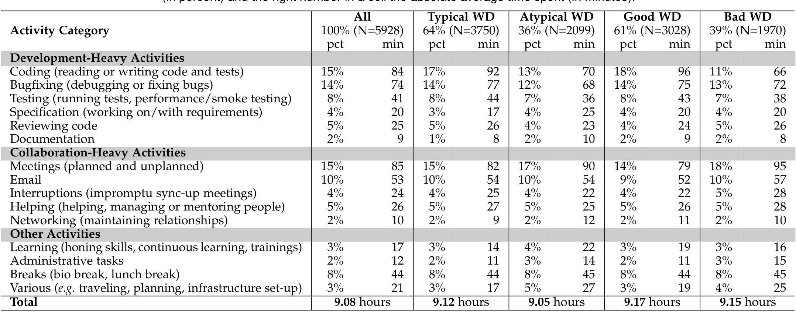
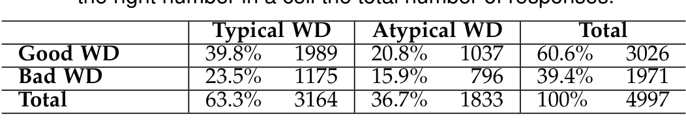

PRE-PRIN

TABLE 2
Mean and relative time spent on activities on developers’ previous workdays (WD). The left number in a cell indicates the average relative time spent (in percent) and the right number in a cell the absolute average time spent (in minutes).
All  Typical WD  Atypical WD  Good WD  Bad WD

TABLE 3
Contingency table for the relationship between good and typical workdays (WD). The left number in a cell indicates the percentage and the right number in a cell the total number of responses.
Typical WD  Atypical WD  Total

### 6.3 Workday Types

Looking at average relative time spent in activities for all responses results in the impression that good/bad and typical/atypical workdays are very similar overall. However, respondents described that not all workdays look the same, e.g. when they have no-meeting days, and that this type of workday often influences whether they consider a workday as typical or atypical. Since we did not prompt them to discuss workday types, only 4.1% (N = 83) of respondents mentioned it. To evaluate similarities and trends in developers’ workdays and to answer RQ3, we reused our dataset (see Section 6.2) to group responses together where respondents reported spending their time at work with similar activities. We then used responses to other questions to characterize these groups as workday types.

Data Analysis. To identify groups of developers with similar workdays, we run a cluster analysis following steps:

1) For the clustering, we used respondents’ self-reports of the relative time spent in each activity category. The data cleaning process is the same as described before in Section 6.2. To group the respondents, we used the Partitioning Around Medoids (PAM) clustering algorithm [67] in the pamk implementation from the fpc package4 in R. We varied the number of clusters (k) from one to twenty. The pamk function is a wrapper that computes a clustering for each k in the specified range and then returns the clustering with the optimum average silhouette. In our case, the optimal number of clusters was k = 6.

2) To describe the inferred six clusters, we used responses to other questions from the survey, including developers’ assessments of good and typical workdays, their experience (senior versus junior developer (as defined by the organization position) and number of years of development experience) and their office environment (private versus open-plan office).

3) Finally, we used the cluster descriptions to develop workday types.

4. https://cran.r-project.org/web/packages/fpc

Results. In Table 4, we present the resulting six clusters, the amount of time developers in each cluster spend on different activities, and additional factors to describe the clusters. Clusters 1 to 3 (C1–C3) are development-heavy workdays, while clusters 4 and 5 (C4–C5) include more collaborative aspects. In the following, we describe the clusters as workday types and characterize them considering the factors mentioned above. We also name each workday type to make referencing them easier in the paper.

On a "Testing Day" (C1), developers overall spend considerably more time with testing compared to the other days. As testing often requires to also debug and fix code, they also spend more time with coding and debugging compared to other non-development-heavy days (C4–C6). On "Testing Days", developers spend more time learning new things than the other days. The majority of the developers in this cluster (in our sample, 71%) are junior developers, with 66% considering it a typical workday and 63% a good workday respectively.

On a "Bugfixing Day" (C2), developers spend significantly more time debugging or fixing bugs (almost 3 hours on average). Similar to the "Testing Day", mostly junior developers are experiencing this workday type (69%), and the developers in this cluster generally thought it was fairly typical (65%) and good (60%).

A "Coding Day" (C3) is a workday where developers spend a lot of their time reading and writing code, on average about 2.3 hours, and is perceived as good by more developers than the other workdays (74%). This workday type has a higher chance to be perceived as typical, with 72% considering their previous coding day as typical. 65% of the developers in this cluster are juniors and most of the developers in this cluster do not sit in private offices (60%).

The "Collaborating Day" (C4) entails spending more time on collaborative activities,