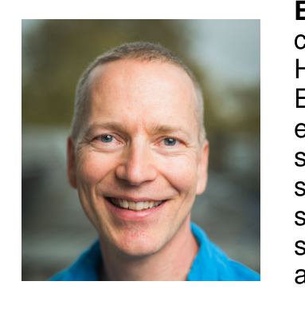
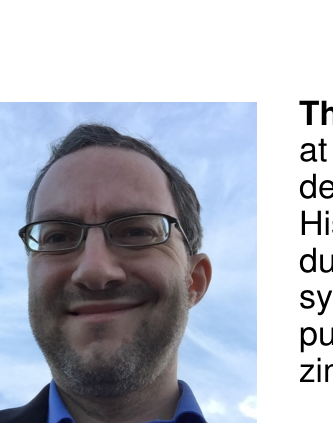
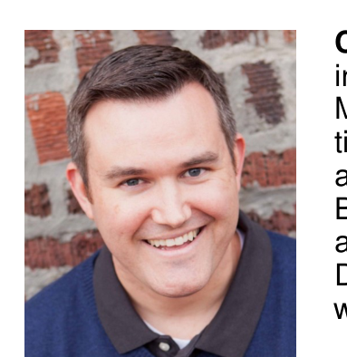

### Earl T. Barr

Earl T. Barr is a senior lecturer (associate professor) at the University College London. He received his Ph.D. at UC Davis in 2009. Earl's research interests include bimodal software engineering, testing and analysis, and computer security. His recent work focuses on automated software transplantation, applying game theory to software process, and using machine learning to solve programming problems. Earl dodges vans and taxis on his bike commute in London.

### Thomas Zimmermann

Thomas Zimmermann is a Senior Researcher at Microsoft Research. He received his Ph.D. degree from Saarland University in Germany. His research interests include software productivity, software analytics, and recommender systems. He is a member of the IEEE Computer Society. His homepage is http://thomas-zimmermann.com.

### Christian Bird

Christian Bird is a researcher in the Empirical Software Engineering group at Microsoft Research. He focuses on using qualitative and quantitative methods to both understand and help software teams. Christian received his Bachelor's degree from Brigham Young University and his Ph.D. from the University of California, Davis. He lives in Redmond, Washington with his wife and three (very active) children.