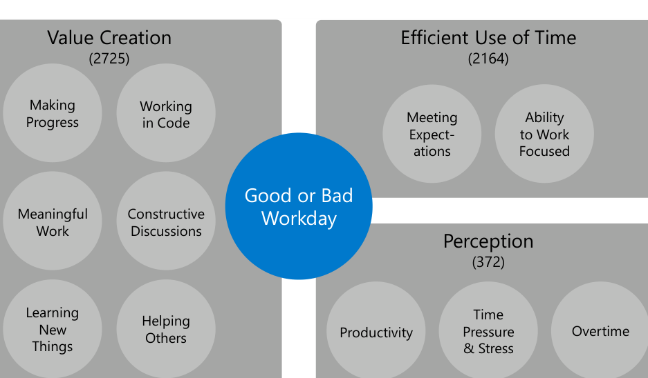

Fig. 1. Conceptual framework for good workdays. The 3 high-level factors are visualized as square layers; outer layers influence the inner layers.

workday being one when they make a lot of progress on or complete their main tasks (similar to previous work [4]):

> “Made some good progress, [the] project is coming together, checked in some tests.” - S105 [good]

Many responses (13.8%, N = 553) mentioned that developers feel good about their workday when they can spend parts of it working in code, rather than on other activities, such as meetings, interruptions, or administrative tasks. For 6.4% of all responses (N = 257), creating value was described as working on something developers deem important and meaningful enough to spend their time on. This could be tasks that let the project progress, process improvements that make the team more efficient, improving the quality of the product, or a feature that they consider valuable for end users:

> “I was able to help influence a decision that I thought was important.” - S1658 [good]

While meetings were often not considered a good use of their time (as discussed in more detail in Section 5.1.2), 189 responses (4.7%) described a good workday to be when developers participated in good, constructive discussions, when important decisions on the project were made, or when connections could be made that are valuable in the future:

> “Meetings were productive, and we made some new connections with partners that seem promising. I also had a good chat with a former manager/mentor.” - S483 [good]

Workdays where developers learned something new or that increased their understanding of the project or codebase were also considered good, as 4.7% (N = 188) of the responses described learning a valuable investment into the developers’ or project’s future. Similarly, days when developers could help a co-worker to learn something new or unblock someone from a problem they are stuck with was generally considered positive and rewarding (4.7%, N = 188). However, spending too much time helping others reduces the time they can spend on making progress on their own tasks:

> “I spent too much time helping team members and not enough on my scheduled tasks.” - S1880 [bad]

### Efficient Use of Time

A second high-level factor for considering what a good workday is, is how efficiently developers manage to spend their time (54.0%, N = 2164). A developer’s workday can be organized in various ways, and there are numerous external and personal aspects that compete with each other for the developer’s attention and time. This impacts whether a workday goes as expected and influences the developer’s ability to focus on the main coding tasks. Respondents mentioned that changes to their planned work or deviations from their usual workday are often negatively perceived. Especially, unexpected, urgent issues in a deployed system put pressure on developers to resolve them quickly (11.6%, N = 464):

> “Started off with a live-site issue (still unresolved), then went to a [different] live-site issue (still unresolved), then I actually got a few minutes to work on the [main] task.” - S3158 [bad]

Interruptions from co-workers and distractions such as background noise in open-plan offices were described in 13.8% (N = 552) of the responses to negatively influence developers’ ability to focus or work as planned:

> “Too many interruptions/context switches. I need a continuous block of time to be really productive as a coder, but I find I get distracted/interrupted more than I’d like.” - S1066 [bad]

Similarly, long meetings or meetings spreading over the whole day, with very little time in-between to work focused, were another regularly mentioned reason (12.2%, N = 491).

10.3% (N = 411) of the remaining responses mentioned further reasons for bad workdays that were not numerous enough to be coded into a new category. This includes time lost due to infrastructure issues, outdated documentation, spending too much time to figure out how something works and being blocked or waiting for others (similar to [13]). Unlike what one might expect from previous work [24], [25], [26], emails were surprisingly only rarely mentioned as a reason for not being a good workday (1.7%, N = 69).

### Perception

9.3% (N = 372) of all responses about good workdays were related to developers’ positive or negative perceptions of their overall work; their productivity, time pressure, and working hours. For example, in 4.7% (N = 187) of the responses developers mentioned that they felt productive or unproductive on a particular workday, and not specifying what factors contributed to their feeling.

> “Yes, I was productive and felt good about what I’d done.” - S322 [good]

In 102 (2.5%) responses, developers considered workdays to be better when they had a good balance of handling stress. This includes not trying to meet a tight deadline and not having a too high time pressure:

> “Considering we are not [on] a tight deadline, working in a relaxed fashion and coding were quite enjoyable.” - S1654 [good]

Time pressure was recently also shown as a major cause of unhappiness of developers [13]. 2.2% (N = 87) of the responses described workdays requiring to work overtime as bad. Reasons for what causes overtime work are tight deadlines and having full task lists.

In Section 7, we make recommendations about how to leverage these results to make good workdays typical.

## 5.2 Developers’ Typical Workdays

To learn how different factors impact developers’ assessment of typical workdays, we asked survey respondents the following question: “Was yesterday typical?”. To answer the question, they could either select yes or no. Respondents who picked no were asked to provide a reason for their assessment in a free-form textbox.