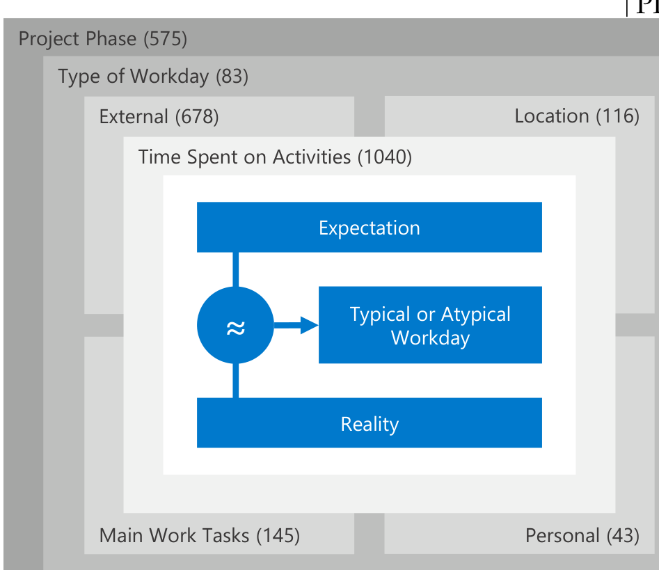

### 5.2.1 Data Analysis

5876 participants responded to the question; 64.2% (N=3770) considered their workday as typical and 35.8% (N=2106) as atypical. 2008 of these 2106 participants (95.3%) then explained what made their workdays atypical. To qualitatively analyze these factors and their relationships, we used the same coding strategy that we described in Section 5.1.1 to characterize good workdays.

### 5.2.2 Conceptual Framework

Here, we describe how we developed the conceptual framework that characterizes typical workdays. As respondents were very vocal about meetings and interruptions to describe main reasons for atypical workdays, we initially thought that a key component for the assessment is whether the developer has control over the factor. However, from our discussions and after coding all responses, we realized that the key component is the match between a developer’s expectation of how a workday will be and how it actually was in reality. Externally influenced factors are just one factor to influence this match. If the mismatch is large, developers consider the workday atypical. Also, we initially thought that the resulting 7 high-level factors that we identified through our Axial and Selective Coding all directly influence the assessment of typical workdays. However, we noticed that they also influence each other: the current project phase impacts the distribution over the different workday types. The workday type and subsequent factors (external, tasks, location and personal) in turn influence the developer’s expectation of how much time is spent in activities. We noticed that it was usually not the activity itself that impacted the assessment, but whether the developer spent more, less, or about the same amount of time on it than usual and what the developer expects. The relationships between the layers (i.e., factors) were discovered through extensive discussions in the whole team during the Axial Coding steps, where we discussed the categories that resulted from the Open Coding process in relation with the representative quotes from each category.

In Figure 2 we visualize the conceptual framework, including the 7 high-level factors as gray layers. The different gray shades show how each layer influences the inner layers above. The counts in parentheses denote the number of participants whose response we coded into the factor (total N=2008). We explain the conceptual framework by providing representative examples and quotes to describe the factors.

#### Project Phase

In 28.6% (N=575) of the responses, developers assessed their previous workday as atypical, providing the current project phase as the reason. In agile software development, an iteration usually starts with a planning and specification phase, is followed by a development or quality/stabilization phase, and then finalized with the release phase. Respondents, however, often perceived their workdays as atypical when the phase was not development (22.3%, N=448). Since non-development phases occur less frequently, are usually shorter, and often let developers code less than in development phases, they are perceived atypical:

> “We are in the planning phase now and each day is different: There is a lot more focus on evaluations, specs, meetings during this phase. This would significantly differ from our workday during coding milestones.” - S2243

Fig. 2. Conceptual framework characterizing typical workdays. The main factors are visualized as layers; the outer layers influence all inner layers.

These non-development phases are perceived as “slower”, which is why developers spend more time on activities that usually fall short during development phases, such as training, evaluating frameworks, writing documentation, or working on low-priority tasks.

Since developers often describe meetings and interruptions as unproductive, prior work concluded that they are bad overall [9], [14], [21], [22], [23], [61]. We are refining these earlier findings with our results that suggest the impact of meetings and interruptions on productivity depends on the project phase. Respondents described that during phases of specification, planning and releases, they are common, but constructive:

> “In planning stage, not development stage. Spent way more time in meetings than normal, but they were productive meetings.” - S1762

As some teams at the studied organization do not employ separate teams dedicated to operations, developers also have to take part in a servicing phase, usually for about one week every couple of weeks. During that week, they are on-call for urgent and unexpected issues, which respondents often also regarded as atypical:

> “I am currently on-call as [an] incident manager. It was typical for on-call rotation, but that happens only once every 12 weeks.” - S2447

While many respondents described the current phase to be atypical, few mentioned that the amount of time they spent on certain activities was unusual for the phase they are currently in. For example, spending an unusually high amount of time with coding during a planning phase felt atypical.

#### Type of Workday

The workday type is another factor that influences whether a developer considers a workday as typical. While this factor is not as prominent as the project phase that influences it, the workday type was emphasized in 4.1% (N=83) of the responses. Certain teams or individuals organize their work into days where they mainly focus on a single activity, such as coding, bug-fixing, planning or training. During these days, developers avoid pursuing activities that distract them from their main activity, such as emails or meetings. Specific days where the team would not schedule any meetings were mentioned most prominently: