# The Design Space of Bug Fixes and How Developers Navigate It

Emerson Murphy-Hill, Thomas Zimmermann, Christian Bird, and Nachiappan Nagappan

Abstract— When software engineers fix bugs, they may have several options as to how to fix those bugs. Which fix they choose has many implications, both for practitioners and researchers: What is the risk of introducing other bugs during the fix? Is the bug fix in the same code that caused the bug? Is the change fixing the cause or just covering a symptom? In this paper, we investigate alternative fixes to bugs and present an empirical study of how engineers make design choices about how to fix bugs. We start with a motivating case study of the Pex4Fun environment. Then, based on qualitative interviews with 40 engineers working on a variety of products, data from 6 bug triage meetings, and a survey filled out by 326 Microsoft engineers and 37 developers from other companies, we found a number of factors, many of them non-technical, that influence how bugs are fixed, such as how close to release the software is. We also discuss implications for research and practice, including how to make bug prediction and localization more accurate.

Index Terms—Design concepts, human factors in software design, maintainability  
——————————  ———————

## 1 INTRODUCTION

As the software systems we create and maintain grow in capability and complexity, software engineers must ensure that these systems work as intended. When systems do not, software engineers fix the “bugs” that cause this unintended behavior.

Traditionally, researchers and practitioners have assumed that the location in the software at which an engineer fixes a bug is the location at which the error was made [1]. For example, Endres [2] makes such an assumption in a study, but cautions the reader that,

> There is, of course, the initial question of how we can determine what the error really was. To dispose of this question immediately, we will say right away that, in the material described here, normally the actual error was equated to the correction made. This is not always quite accurate, because sometimes the real error lies too deep, thus the expenditure in time is too great, and the risk of introducing new errors is too high to attempt to solve the real error. In these cases the correction made has probably only remedied a consequence of the error or circumvented the problem. To obtain greater accuracy in the analysis, we really should, instead of considering the corrections made, make a comparison between the originally intended implementation and the implementation actually carried out. For this, however, we usually have neither the means nor the base material.

Although the software engineering community has suspected that this assumption is sometimes false, there exists

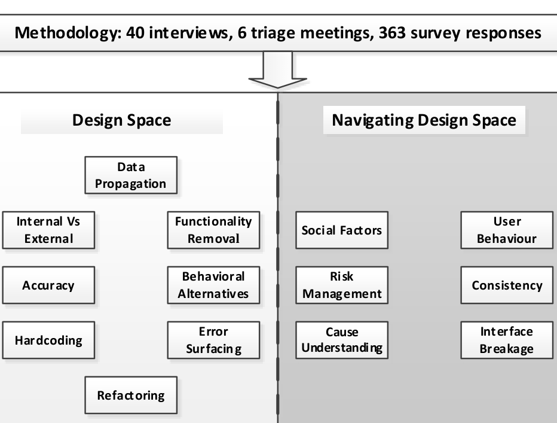

> **Image description:** A conceptual diagram summarizing the study’s synthesis of what options exist when fixing bugs (left) and what influences engineers’ choices among those options (right). At the top the figure notes the study methodology: 40 interviews, 6 triage meetings, and 363 survey responses. The left column, labeled “Design Space,” lists technical/design dimensions of individual fixes (Data Propagation; Internal vs External; Accuracy; Hardcoding; Refactoring; Functionality Removal; Behavioral Alternatives; Error Surfacing). The right column, labeled “Navigating Design Space,” lists contextual and social influences on fix selection (Social Factors; Risk Management; Cause Understanding; User Behaviour; Consistency; Interface Breakage), with a vertical dashed line visually separating the two halves to show how developers navigate from the design options toward a chosen fix.

Refactoring  
Fig. 1. Characterizing the design of bug fixes

little evidence to help us understand under what circumstances it is false. The consequences of this lack of understanding are manifold. Let us provide several examples.

For researchers studying bug prediction [3] and bug localization [4], models of how developers have fixed bugs in the past may not capture the true cause of failures, but may instead only capture workarounds. For practitioners, when a software engineer is evaluated based on how many bugs they fix, the evaluation may not accurately reflect that engineer's effect on software quality. For educators, without teaching future engineers the contextual factors that go into deciding which fix to apply, the future engineers may choose inappropriate fixes.

However, to our knowledge, there has been no empirical research into how bug fixes are designed. In this paper, we seek to understand the design of bug fixes. We define the design of bug fixes as the human process of envisioning several ways to fix the same bug and then judging which of those fixes to apply. As with any software change, an

————————————————

- E. Murphy-Hill is with North Carolina State University, Raleigh, NC 27603. E-mail: emerson@csc.ncsu.edu.
- T. Zimmermann is with Microsoft Research, Redmond, WA 98052. E-mail: tzimmer@microsoft.com.
- C. Bird is with Microsoft Research, Redmond, WA 98052. E-mail: cbird@microsoft.com.
- N. Nagappan is with Microsoft Research, Redmond, WA 98052. E-mail: nachin@microsoft.com.

xxxx-xxxx/0x/$xx.00 © 200x IEEE Pu

---

engineer must deal with a number of competing forces when choosing what change to make. The task is not always straightforward.

An earlier version of this paper appeared as a conference paper [5], which originally had one primary contribution: the first systematic characterization of the design of bug fixes. It analyzed the design space of bug fixes and described how developers navigate that design space, to understand the decisions that go into choosing a bug fix (see Figure 1). The present paper expands on this work, by adding the following three contributions:

- A study of the Pex4Fun game that motivates our work (Section 3).
- A replication of our original survey of Microsoft developers with an additional 37 developers from other companies (Section 4.5).
- Additional vignettes of the design dimensions (Section 5.1) and design navigation choices (Section 5.2), drawn from the original interviews.
- Findings about why developers avoid refactoring (Section 5.1), how they subvert policies implemented to reduce regression bugs, how they decide which analysis methods to use to determine bug frequencies, and who decides on which bug fix design to implement (Section 5.2), drawn from our original survey.

## 2 RELATED WORK

Several researchers have investigated bug fixes. Perhaps the most relevant research Leszak, Perry, and Stoll’s [6] study of the causes of defects, in which the authors classified bug reports by ‘real defect location’:

> ‘Real’ location characterizes the fact that… some defects are not fixed by correcting the ‘real’ error-causing component, but rather by a… ‘work-around’ somewhere else.

While the authors collected real defect locations, the data was not analyzed or reported. Our work explains why one fix would be selected over another; or in other words, why an engineer might choose a workaround instead of a fix at a “real location.”

Ko and Chilana studied 100 contentious open-source bug reports, focusing on argumentation in open source bug fixing, such as the rationale for fixes and the need for moderation when end users were involved in the debate [7]. In contrast, we focus on the design of the bug fix itself, rather than the process by which the decision was made. Our study also complements this study by improving our understanding of the decision making process when fixing bugs, specifically for commercial software and for decisions made outside of the bug report itself.

Breu and colleagues observed in a study of 600 bug reports that 25.3% of discussions in bug reports are spent on the fix itself, discussions involving suggestions, feedback requests, and understanding files [8]. Our study complements this work by exploring the design space of bug fixes. Several other researchers have investigated bug fixing. In a manual inspection of bug fixes, Lucia and colleagues found that some fixes are spread over many lines of code [4]. Bird and colleagues found that bug fixes reported in bug databases are different from fixes not reported in databases [9]. Gu and colleagues investigated the belief that bug fixes themselves are the source of errors and found that bad fixes comprise approximately 9% of bugs [10]. Yin and colleagues investigated why bugs are fixed incorrectly, that is, require a later bug fix to the source code changed by the original fix [11]. Aranda and Venolia investigated 10 closed bugs and surveyed 110 engineers about bug coordination patterns at Microsoft [12]. Spinellis and colleagues attempted to correlate code metrics, such as number of bugs fixed, to evaluate the quality of open source software [13]. Storey and colleagues investigated the interaction of bugs and code annotations [14]. Anvik and colleagues investigated which engineers get assigned to fix bugs [15]. In contrast to these papers, our paper seeks to understand in what way bug fixes differ, and why one fix is chosen over another.

## 3 MOTIVATION

What evidence is there that the same bug can be fixed in multiple ways? To explore this question and to provide motivation for the rest of this paper, we turn to a browser-based learning environment called Pex4Fun where programmers try to solve programming challenges [16]. Programmers are given some code, a method with parameters and a default return value, and are asked to modify the program until it produces the same output as a secret solution originally created by a puzzle creator.

Although playing Pex4Fun is not a bug fixing task, both are activities where an existing program is not behaving as expected and the programmer’s task is to modify the program so that it conforms to a specification that the developer understands only gradually. And although Pex4Fun is a significantly more limited programming context with fewer environmental constraints than bug fixing in the wild, we argue that if variation in solutions is present in Pex4Fun, then even more variation likely exists in bug fixing in the wild.

Let us explore the solutions to an arbitrary Pex4Fun puzzle (Figure 2). Before viewing other programmers’ solutions, the curious reader can try the puzzle herself at the following webpage: http://aka.ms/Pex4Fun_BugFixExample. In the data used for this paper, 475 self-selected players attempted to solve the puzzle and submitted 5,612 attempts. A total of 260 different people were successful in submitting a correct solution. The median time to solve the puzzle was 12.25 minutes.

In browsing the 260 submitted solutions to the problem, we found that no two appeared exactly alike. Many have at least minor differences in whitespace and comments. Yet there are also substantial design differences between many solutions.

Several solutions appear similar to the original hidden solution, as a simple algebraic formula:

```csharp
using System;
public class Program {
public static int Puzzle(int x) {
```

---

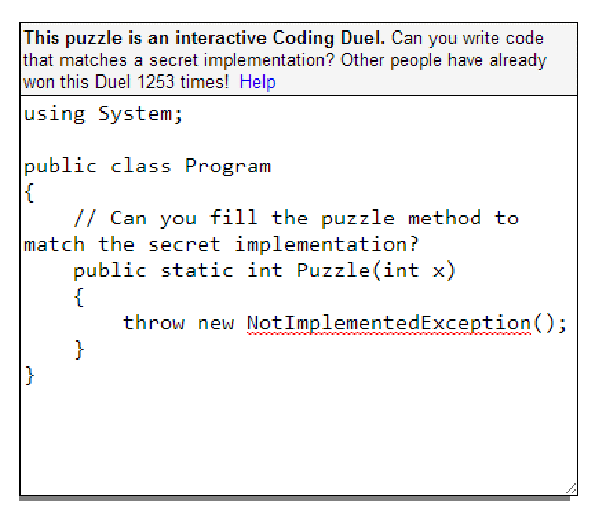

> **Image description:** Screenshot of the Pex4Fun web interface for a coding duel: a bordered editor area with a short prompt at the top (“This puzzle is an interactive Coding Duel. Can you write code that matches a secret implementation? Other people have already won this Duel 1253 times! Help”). The editor displays a C# skeleton: “using System; public class Program { // Can you fill the puzzle method to match the secret implementation? public static int Puzzle(int x) { throw new NotImplementedException(); } }”, with a red squiggly under NotImplementedException and scrollbars visible. In the paper this image illustrates the Pex4Fun task used to motivate the study: players replace the placeholder throw with implementations that match a hidden solution, producing the diverse solutions analyzed by the authors.

Fig. 2. The Pex4Fun user interface.

```c
return x * (x-1) / 2;
}
}
```

Other solutions showed slightly refactored versions of this formula (below, showing just the method body):

```c
return (x*x-x)/2;
```

Some solutions were imperative, and sometimes included special cases:

```c
if (x == 0)
{
    return 0;
}
int t_x = (x * (x / 2));
if ((x & 0x1) == 0)
{
    t_x -= (x / 2);
}
return t_x;
```

Some programmers’ special cases (and comments) apparently arose from their problem-solving process, coding against the input-output pairs provided by the Pex4Fun environment:

```c
if (x==0) return 0;
if (x==1) return 0;
if (x==2) return 1;
if (x==3) return 3;
// if (x==4) return 6;
// if (x==14) return 91;
// if (x==47) return 1081; //23
// if (x==79) return 3081; //39
return (x-1)*x/2;
```

Other programmers submitted iterative solutions:

```c
int sum = 0;
for (int i = x-1; i >= 0; i--)
{
    sum += i;
}
```

## Table 1
METHODOLOGY SUMMARY

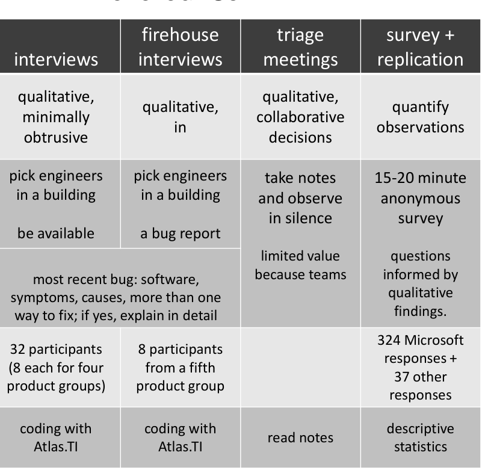

> **Image description:** Four-column summary table that compares the study’s methods: opportunistic interviews, firehouse (in‑situ) interviews, triage meeting observations, and the survey + replication. For each method the table lists the goal/protocol (e.g., “qualitative, minimally obtrusive” for opportunistic interviews; “quantify observations” for the survey), how participants were selected (e.g., “pick engineers in a building” for interviews; monitor recent bug reports for firehouse), the core question prompt (ask about the most recent bug and alternative fixes), participant counts (32 interview participants — 8 each from four product groups; 8 firehouse participants from a fifth product group; and 324 Microsoft survey responses plus 37 other responses), and the analysis approach (coding with Atlas.TI for interviews and firehouse, reading notes for triage meetings, and descriptive statistics for the survey). The triage column also notes that observation value was limited because of team constraints, and the survey column specifies a 15–20 minute anonymous instrument used to quantify the qualitative findings.

```c
}
return sum;
```

Other programmers solved the problem with a while loop instead of a for loop:

```c
int i = 0;
int z = 0;
while (x > 0 && ++i <= x)
{
    z = z + i - 1;
}
return z;
```

Similarly, several programmers solved the problem recursively:

```c
return x == 0 ? 0 : (x-1) + Puzzle(x-1);
```

Finally, one programmer submitted this clever solution:

```c
return Enumerable.Range(0, x).Sum();
```

Although we expected to find diversity in Pex4Fun answers, we were surprised with how much diversity in these “bug fixes” we found. This is especially notable because programmers had no incentive to produce diverse solutions because (a) they were only rewarded for producing a working solution and (b) they could not see each others’ solutions. Although we did not quantitatively assess the diversity, the qualitative diversity in people’s Pex4Fun solutions is readily apparent.

The diversity of Pex4Fun solutions alludes to the diversity that may exist in bug fixes. Indeed, as our data in Section 5.1 suggests, programmers in our study estimated that about half of the bugs that they fix in the wild have multiple possible solutions. In the remainder of this paper, we explore both the diversity in real bug fixes, and the rationale for that diversity. Specifically, we seek to answer two research questions:

RQ1: What are the different ways that bugs can be fixed?  
RQ2: What factors influence which fix an engineer chooses?

---

Table 2
FACTORS FOR SELECTING PRODUCT GROUPS

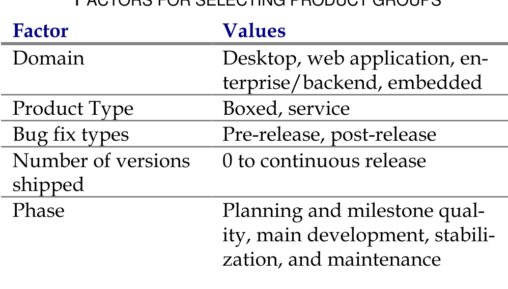

> **Image description:** A two‑column table labeled “FACTORS FOR SELECTING PRODUCT GROUPS” with the left column headed “Factor” and the right column headed “Values.” The table enumerates five selection factors and example values: Domain (Desktop, web application, enterprise/backend, embedded); Product Type (Boxed, service); Bug fix types (Pre‑release, post‑release); Number of versions shipped (0 to continuous release); and Phase (planning and milestone quality; main development; stabilization; maintenance). In the paper this set of dimensions was used to stratify and choose product teams so the interviews covered a broad range of product types and development contexts.

## 4 METHODOLOGY

To answer our two research questions, we conducted a mixed-method study. We used several research methods, rather than a single one, both to study our research questions in as broad a way as possible and to triangulate the answers to improve their accuracy [17]. While we feel that our methods are thorough and rigorous, some threats still exist as we discuss in Section 6. We now discuss our four research methods: opportunistic interviews, firehouse interviews, triage meeting observations, a survey, and a replication of that survey. For each method, we discuss the goal of using that method, how we recruited participants, the protocol we used, how we analyzed data, and a brief summary of the shape of the data we collected. Table 1 summarizes our methodology.

### 4.1 Opportunistic Interviews

With our first method, we asked engineers about a recent bug they had been involved in fixing.

**Goal.** Our goal in performing opportunistic interviews was to rapidly obtain qualitative answers to our research questions in a way that was minimally obtrusive to interviewees.

**Protocol.** We conducted these interviews by having the first author go to a building that housed a particular product group. Armed with a list of office numbers for software engineers, the interviewer walked to each engineer’s office. If the engineer was wearing headphones, was talking to someone else, or had the door closed, the interviewer went to the next office. Otherwise, the interviewer introduced himself, said that he was doing a study, and asked if the interviewee had 10 to 15 minutes to talk. If the engineer consented, the interviewer asked a series of semi-structured questions [17] regarding the last bug that the engineer was involved in fixing. Although interviewees were not offered an incentive, before the interviewer left, interviewees were compensated with a $10 gift card for lunch.

We performed pilot interviews to identify potential problems and rectify them prior to the main study. In doing so, we noticed that pilot interviewees could remember the fix they made, but had difficulty recalling the alternative fixes that they did not make. Some pilot interviewees stated that they fixed the bug the only way that it could have been fixed, even though there clearly were other fixes, even from our perspective as outsiders. We sought to reduce this “hindsight bias” [18] in our interviews using two different techniques. For every odd-numbered interview (the first, the third, and so on), we gave the interviewee an example of three bugs and multiple ways of fixing each bug. For the other half of the interviews, we presented a small program containing a simple bug, and then asked the interviewee to talk us through how she might fix the bug; interviewees typically mentioned several alternative fixes. Comparing the results obtained after starting interviews with these two methods, we noticed no qualitative differences in the responses received, suggesting that both methods were about equally effective. Comparing pilot interview results against real interview results, we feel that this technique significantly helped interviewees think broadly about the design space.

After this introductory exercise, the interviewer asked the interviewee about the most recent bug that they fixed. The interviewer asked about the software that the bug appeared in, the symptoms, the causes, and whether they considered more than one way to fix the bug. If an interviewee did consider multiple fixes, we asked them to briefly explain each one, and justify their final choice. The full interview guide can be found in our companion technical report [19].

**Participants.** To sample a wide variety of engineers, we recruited interviewees using a stratified sampling technique, sampling across several dimensions of the products that engineers create. We first postulated what factors might influence how engineers design fixes; we list those factors in Table 2.

Using these factors, we selected a cross section of Microsoft products that spanned those factors. We chose four products from which to recruit engineers, because we estimated that four products would balance two competing requirements: that we sample enough engineers from each product team to get a good feeling for what bug fixing is like within that team, and that we sample enough product teams that we could have reasonable generalizability. The four product teams that we selected spanned each of the values in Table 2. For example, one team we talked to worked on desktop software, one on web applications, another on enterprise/backend, and the last on embedded systems.

Within each product team, we aimed to talk to a total of 8 software engineers: six were what Microsoft calls “Software Development Engineers” (developers for short) and two were “Software Development Engineers in Test” (testers for short). We interviewed more developers, as developers spend more time fixing bugs than testers. Once we reached our quota of engineers in a team, we moved on to the next product team. In total, we completed 32 opportunistic interviews with engineers.

**Data Analysis.** We prepared the interviews for analysis by transcribing them. We then coded the transcripts [20] using

---

and examples [19].

#### Data Characterization.
Overall, we found software engineers very willing to be interviewed. To obtain 32 interviews, we visited 152 engineers’ offices. Most offices were empty or the engineers appeared busy. In only a few cases, engineers explicitly declined to be interviewed, largely because the engineer was too busy. Interviews lasted between 4 and 30 minutes. In this paper, we refer to participants as P1 through P32.

Most participants reported multiple possible fixes for the bug that they discussed. In a few cases, participants were unable to think of alternative solutions; however, the interviewer, despite being unfamiliar with the bug, was able to suggest an alternative fix. In these cases, the engineer agreed that the fix was possible, but never consciously considered the alternative fix, due to external project constraints.

Interestingly, this opportunistic methodology allowed us to interview three engineers who were in the middle of considering multiple fixes for a bug.

### 4.2 Firehouse Interviews
Using the firehouse research method [21], we interviewed engineers immediately after they fixed a bug. Firehouse research is so called because of the unpredictable nature of the events under study; if one wants to study social dynamics of victims during and immediately after a fire, one has to literally live in the firehouse, waiting for fires to occur. Alternatively, one can purposefully set fires, although this research methodology is generally discouraged. In our case, we do not know exactly when an engineer is considering a fix, but we can observe a just-completed fix in a bug tracker and “rush to the scene” so that the event is fresh in the engineer’s mind.

#### Goal.
Our goal was to obtain qualitative answers to our research questions in a way that maximized the probability that engineers could accurately recall their bug fix design decisions.

#### Protocol.
We first picked one product group at Microsoft, went into the building where most development for that product takes place, and monitored that group’s bug tracker, watching for bugs an engineer marked as “fixed” within the last ten minutes. If the engineer was not located in the building, we moved on to the next most recently closed bug. Otherwise, the interviewer went immediately to the engineer’s office.

When approaching engineers for this study, we were slightly more aggressive than in the opportunistic interviews; if the engineer’s door was closed, we knocked on the door. If the engineer was not in her office by the time we arrived, we waited a few minutes. These interviews were the same as the opportunistic interviews, except that the interviewer insisted that the discussion focus on the bug that they had just closed.

#### Participants.
Our options for choosing a product group to study was fairly limited, because we needed a personal contact within that team that was willing to give us live, read-only access to their bug tracker. We chose one product, which will remain anonymous; the product group was different from any of those chosen in the opportunistic interviews.

We aimed to talk to 8 software engineers in total for these interviews. While we interviewed fewer people than with the opportunistic interviews, these firehouse interviews tended to take much longer to orchestrate, mostly because we wanted to talk to specific people. In retrospect, we did not notice any qualitative differences in engineers’ responses to the two interview types, so for the remainder of the paper, we do not distinguish between these two groups of participants. Nonetheless, you may do so if you wish; participants in the firehouse interviews are labeled P33 through P40.

#### Data Analysis.
We analyzed data in the same way as with the opportunistic interviews.

#### Data Characteristics.
Again, we found engineers to be receptive to being interviewed, although they were usually surprised we asked about a bug they had just fixed. We reassured them that we are from Microsoft Research, and were there to help.

In total, we went to 16 offices, and were able to interview 10 engineers. Two of these we interviewed in error, one because his officemate actually closed the bug, and one because the interviewer misread the bug report. We compensated these engineers for their time with gift cards, but we exclude them from analysis.

### 4.3 Triage Meetings
We hypothesized that not only do individual engineers make decisions about the design of bug fixes, but perhaps that bug fix design happens during bug triage meetings as well. In a bug triage meeting, a team reviews newly reported or reopened bugs and assign a priority and person for working on them. The teams also review and approve bug fixes completed since the last meeting.

#### Goal.
Our goal was to obtain qualitative answers to our

---

### 4.4 Survey

**Goal.** Our goal was to quantify our observations made during the interviews and triage meetings.

**Protocol.** After we performed the interviews and triage meetings, we sent a survey to software engineers at Microsoft. As in the interviews, the survey started by giving examples of bugs that could be fixed using different techniques, where the examples were drawn from real bugs described by interviewees. As suggested by Kitchenham and Pfleeger [22], we constructed the survey to use formal notations and limit responses to multiple-choice, Likert scales, and short, free-form answers.

At the beginning of the survey, we suggested that the respondent browse bugs that they had recently closed to ground their answers. In Section 5, we discuss these questions and engineers’ responses. After piloting the survey, we estimate that it took respondents about 15–20 minutes to fill out the survey. The full text of this survey can be found in our technical report [19].

**Participants.** We sent the survey to 2000 randomly selected recipients from a pool of all employees of Microsoft who had “development” in their job title, and were not interns or contractors. This followed Kitchenham and Pfleeger’s advice to understand whether respondents had enough knowledge to answer the questions appropriately [22]. We incentivized participation by giving $50 Amazon.com gift certificates to two respondents at random.

**Data Analysis.** We analyzed our data with descriptive statistics (for example, the median), where appropriate. We did not perform inferential statistics (for example, the t-test) because our research questions do not necessitate them. When reporting survey data, we omit “Not Applicable” question responses, so percentages may not add up to 100%.

**Data Characteristics.** 324 engineers completed the survey. The response rate of about 16% is within the range of other software engineering surveys [23]. Respondents were from all eight divisions of Microsoft. Respondents reported the following demographics.

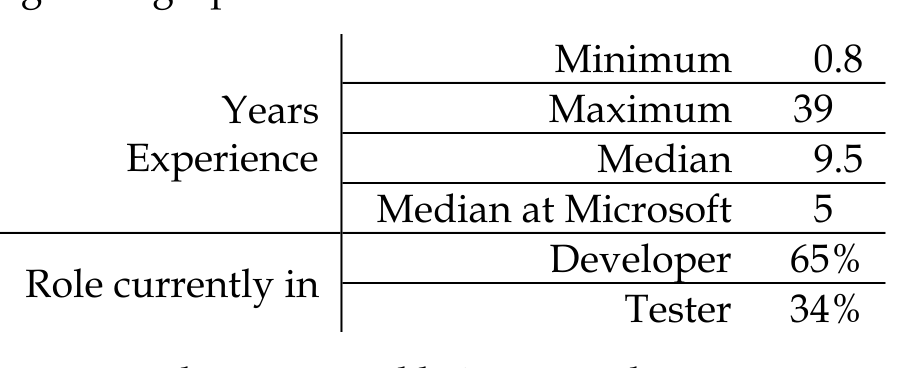

> **Image description:** A small demographic table summarizing survey respondents’ experience and current role. For years of experience the table reports a minimum of 0.8 years, a maximum of 39 years, a median of 9.5 years overall, and a median tenure at Microsoft of 5 years. Role distribution shows 65% identified as Developer and 34% as Tester (the text notes one respondent reported being a product manager). This table appears in the paper’s methodology/demographics section to characterize the survey sample.

Tester 34%  
Also, one respondent reported being a product manager.

### 4.5 Replicated Survey

**Goal.** Our goal was to replicate our quantified findings outside of Microsoft.

**Protocol.** We ported the survey we used inside of Microsoft to a web server at North Carolina State University, then generalized a few of the Microsoft-specific questions. For example, rather than asking a question about “Peer SDETs” as we did at Microsoft, we instead asked about “Peer Testers,” a more generally accepted term referring to roughly the same role. We recognized that participants may fix most of their bugs in either open source projects or in closed-source projects at companies, so we adjusted experience questions accordingly. The survey is included in the Appendix.

**Participants.** We posted the survey as an advertisement on Facebook, a popular social networking site. The advertisement featured a graphic and solicitation to participate in a study about bug fixing, in exchange for the chance to win a $50 Amazon.com gift certificate. We targeted the ad specifically at users in the US and Canada of age 21–64 who spoke English, with interests in software development and a job title related to software development. The potential audience of the advertisement was estimated by Facebook as 86,000 people. After we observed a low click-through rate for Right Column ads, we limited our campaign to ads in the Facebook News Feed.

**Data Analysis.** We analyze the replicated data in the same manner as the original survey. Additionally, we compare data from Microsoft developers to this broader population, and use inferential statistics to evaluate whether differences between the populations exist for specific question responses. Specifically, we use Mann–Whitney U tests to evaluate differences between Likert responses, then use a Benjamini–Hochberg correction for false discovery on the resulting p-values [24]. In the remainder of the paper, to separate results of when we refer to a numerical result from this replicated survey, we will put it in a curly brackets (for example, {32%}).

**Data Characteristics.** In total, the advertisements reached 10,972 developers at a cost of $67.84. From that, we obtained 183 website clicks and 80 survey responses. After removing surveys that were mostly empty, we analyzed data from 37 complete or almost-complete surveys. Over-

---

for each group.

| Years' Experience | Open Source | Closed Source |
| --- | ---: | ---: |
| Minimum | 0.5 | 1 |
| Maximum | 13 | 32 |
| Median | 8.5 | 8 |
| Median in Current Project or Company | 3 | 4 |

All participants but two reported being in the role of “developer”; one reported being in a research role, one in a cross-functional software role.

In the results section, we do not treat open-source developers separately from closed-source developers for this survey. From a theoretical perspective, we treat the two the same because the main effect of interest is not differences between open and closed source, but to what extent Microsoft developers differ from all other developers. From a practical perspective, the main phenomena of interest (measured in terms of the answer to the question “Of the bugs that you fix, what percentage are there multiple potential fixes?”) did not vary significantly between closed- and open-source developers (Mann–Whitney U-test, p = .226). Overall, the replication showed just two statistically significant differences between Microsoft developers’ responses and other developers’ responses in the replicated survey.

## 5 RESULTS

We next characterize the design options that engineers have when selecting a bug fix (Section 5.1), and then describe how engineers choose which fix to implement (Section 5.2).

### 5.1 Description of the Design Space

In our interviews, we asked participants to estimate what percentage of their bugs had multiple possible solutions. The median was 52%, with a wide range of variance, with individual responses ranging from 0% to 100%. Similarly, 62% of interviewees indicated that of their bugs they fix, “more than one fix will satisfy all stakeholders.” Although these numbers should be interpreted as a rough estimate, it suggests that many bugs can be fixed in multiple ways.

With respect to the dimensions of the design space, we obtained answers to this research question by asking interviewees to explain the different fixes that they considered when fixing a single bug. In bold below, we present several dimensions on which bugs may be fixed, a description of each dimension, and example vignettes from our interviews. Note that a single fix can be considered a point in this design space; for example, a fix may have low error surfacing and high refactoring, and simultaneously be placed in the other dimensions. Figure 3 shows an example of a single, hypothetical bug that has two different fixes that illustrate the concept.

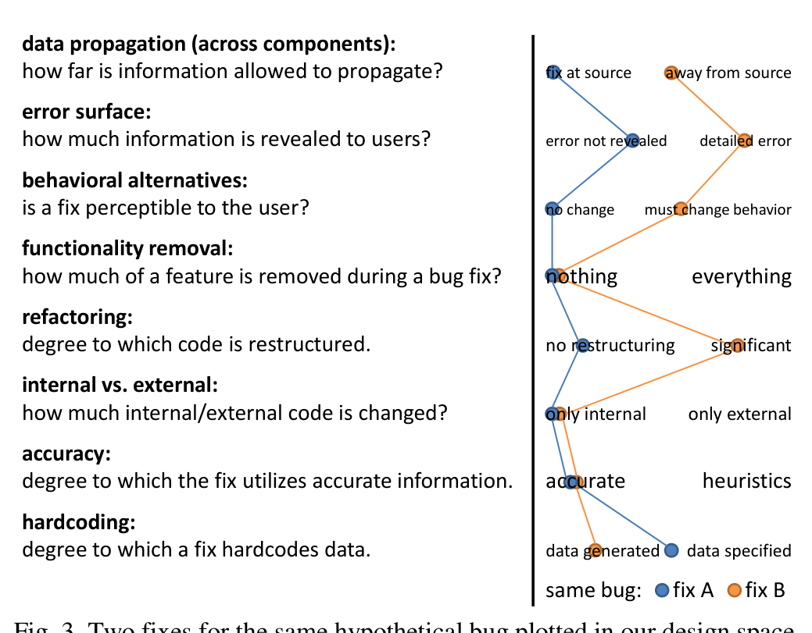

> **Image description:** A multi-dimensional sketch that maps two alternative fixes for the same hypothetical bug (blue = fix A, orange = fix B) across eight design dimensions. Each row shows a labeled axis (e.g., data propagation: “fix at source” → “away from source”; error surface: “error not revealed” → “detailed error”; behavioral alternatives: “no change” → “must change behavior”; functionality removal: “nothing” → “everything”; refactoring: “no restructuring” → “significant”; internal vs. external: “only internal” → “only external”; accuracy: “accurate” → “heuristics”; hardcoding: “data generated” → “data specified”). The plotted polylines indicate that fix A is concentrated toward source-level, internal, accurate, low-impact choices (fix at source, error hidden, no behavioral change, minimal refactor, data generated), whereas fix B is more invasive and external (away from source, detailed error, requires user behavior change, significant refactoring, uses heuristics and hardcoded data). This illustrates how a single bug can be positioned very differently in the authors’ bug-fix design space depending on the chosen remedy.

© Microsoft Corporation same bug: fix A fix B. Fig. 3. Two fixes for the same hypothetical bug plotted in our design space.

We expect that the dimensions are likely not completely independent, and further research is necessary to determine the kind and degree of interdependence. The dimensions are also not intended to be exhaustive, yet we believe that the number of interviews we performed suggests that this list represents a solid foundation on which to build a theory of bug fix design.

#### Data Propagation Across Components

This dimension describes how far information is allowed to propagate across a piece of software, where the engineer has the option of fixing the bug by intercepting the data in any of the components. At one end of the dimension, data is corrected at its source, and at the other, just before it is displayed at its destination, such as the user interface.

For example, P15 described a bug that manifested as an exception that was erroneously reported to the end user. He could have placed a try-catch block anywhere between where the exception was originally thrown and the user interface. Placement of the block at any of these locations would have fixed the bug from the end-user’s perspective by eliminating the exception being thrown.

As another example, P25 worked on software with a layered architecture, with at least four layers, the top-most being the user interface. The bug was that the user interface was reporting disk space sizes far too large, and the engineer found that the problem could be traced back to the lowest-level layer, which was reporting values in kilobytes when the user interface was expecting values in megabytes. The interviewee could have fixed the bug by correcting the calculation in the lowest layer, or by transforming the data (dividing by a thousand) as it is passed through any of the intermediate layers.

#### Error Surfacing

This dimension describes how much error information is revealed to users, whether that information is for end users or other engineers. At one end of the dimension, the user is made aware of detailed error information; at the other, the existence of an error is not revealed.

P28 described a bug in which the software he was developing crashed when the user deleted a file. When fixing the bug, the engineer decided to catch the exception to prevent the crash, but also considered whether or not the user

---

### Table 3
SURVEY RESPONDENTS’ REFACTORING BEHAVIOR

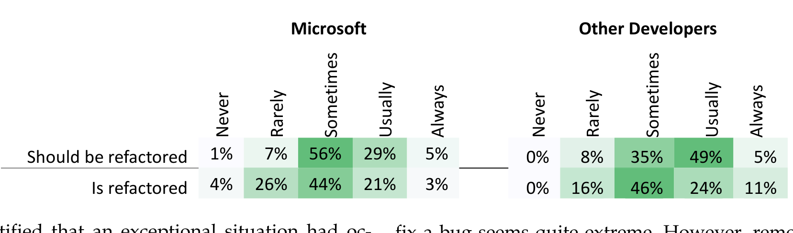

> **Image description:** A two-part heatmap comparing how often developers notice code that should be refactored versus how often they actually refactor it, reported separately for Microsoft (left) and other developers (right). For the question “Should be refactored,” most Microsoft respondents answered Sometimes (56%) or Usually (29%), whereas other developers answered Sometimes (35%) or Usually (49%) with a higher Usually share. For the question “Is refactored,” Microsoft responses cluster at Sometimes (44%) and Rarely (26%) with only 21% Usually and 3% Always, while other developers show Sometimes (46%), Usually (24%) and a larger Always (11%). The figure highlights a gap between noticing refactoring opportunities and performing refactoring, and shows that non‑Microsoft respondents report refactoring at higher rates in the top categories (Usually/Always) than Microsoft respondents.

should be notified that an exceptional situation had occurred. A similar example is P18, who described a bug in which a crash occurred in one process whenever another process stopped generating data. P18 considered whether part of the fix should be to let the user know that the process had stopped generating data.

As another example, P6 described a bug in which she was calling an API that returned an empty collection, where she expected a non-empty collection. The problem was that she passed an incorrect argument to the API, and the empty collection signified an error. However, an empty collection could also signify “no results.” While fixing the bug, the engineer considered changing the API so that it threw an error when an unexpected argument was passed to the API. She anticipated that this would have helped future engineers avoid similar bugs.

### Behavioral Alternatives
This dimension describes whether a fix is perceptible to the user. At one end of the dimension, the fix does not require the user to do anything differently; at the other end, she must significantly modify her behavior.

One example is P11, who described a bug in which the back button in a mobile application was occasionally not working. As part of the fix, he made the back button work, but had to simultaneously disable another feature when the application first loads. P11 stated that having both the back button and the other feature working at the same time was simply not possible; he had to choose which one should be enabled initially.

Another example is P21, who was porting a Linux application to Windows. The application originally used input files that contained colons as path separators, but colons are reserved characters in Windows, and could not be used in a straightforward manner. P21 had to devise an alternative to the problem, and the alternative ultimately required the end user to adjust her behavior, depending on how he fixed the bug.

### Functionality Removal
This dimension describes how much of a feature is removed during a bug fix. At one end of the dimension, the whole software product is eliminated; at the other, no code is removed at all.

As an example, P18 described a bug in which a crash occurred. Rather than fixing the bug, P18 considered removing the feature that the bug was in altogether. We were initially quite surprised when we heard this story, because the notion that an engineer would remove a feature just to

fix a bug seems quite extreme. However, removal of features was mentioned repeatedly as a fix for bugs during our interviews. For instance, when P39’s web application was occasionally not downloading files, he considered eliminating that portion of the application entirely.

To quantify functionality removal, we asked survey respondents to estimate how often they remove or disable features, rather than fixing the bug itself. About 75% {76%} of respondents said they had removed features from their software to fix bugs in the past.

### Refactoring
This dimension describes the degree to which code is restructured in the process of fixing a bug, while preserving its behavior. A bug may be fixed with a simple one-line change, or it may entail significant code restructuring.

As an example, P12 described encountering a piece of code that implemented the double-checked locking pattern that was not implemented correctly in one code location. On one hand, he considered the low-refactoring solution: fix the pattern so that it is implemented correctly. But he also considered a fix that entailed significant refactoring: replace the locking pattern with simple synchronization. As an example, P5 considered refactoring to remove some copy-and-paste duplication, so “you're not only fixing the bug, but you also are kind of improv[ing the code].”

In our survey, we asked respondents to report on refactoring frequency when fixing bugs, as shown in Table 3. Respondents from Microsoft are at left and other developers from the replicated survey are at right. Higher numbers correspond to darker cells, compared to cells in the same row and survey. In the table, “Should be refactored” indicates how often participants “notice code that should be refactored when fixing bugs.” For example, 29% of Microsoft respondents indicated that they usually notice code that should be refactored. The “Is refactored” row indicates how often participants “refactor this code that should be refactored”. For example, 26% reported rarely refactoring code that should be refactored. These results suggest that, although engineers appear to regularly encounter code that should be refactored, much of this code remains unchanged.

To determine why, in the survey we asked “If you do not always refactor code that should be refactored, why not?” We received a response by 203 respondents {24}, some giving multiple reasons for not refactoring. Manually coding these responses, we estimate that respondents gave 332 {35} non-unique reasons for avoiding refactoring. We

---

understand them.

Many respondents cited the risk of accidentally introducing regression bugs into code when refactoring (n=52) {5}. This suggests that either these developers were not using refactoring tools or were using tools that they did not trust. Indeed, Vakilian and colleagues have found that trust influences the use of refactoring tools [25]. Similarly, respondents reported that refactoring is sometimes risky (n=37) {3} and that there may not be enough tests to expose regression bugs (n=21) {1}. Respondents reported that these regression fears were exacerbated by the development phase (n=30); if software is near release, the cost of a regression bug increases. Three Microsoft respondents noted that the reasons for not refactoring parallel the reasons for choosing different bug fix designs (Section 5.2).

Several respondents noted that refactoring takes a significant amount of time (n=74) {15} and that they have tasks of higher priority (n=11) {1}. One respondent implied that refactoring is an unending task, noting that “it can be like draining an ocean with a thimble.” A few respondents (n=7) {3} went even further, saying that refactoring sometimes lacks value, with one respondent noting that refactoring sometimes has “no clear benefits for the cost involved.”

A few respondents noted that one reason to avoid refactoring is for social reasons. For example, in the Microsoft survey, refactoring with too many changes makes code review difficult, so that refactored code “will be requested to be reverted.” Three respondents {1} indicated that version control systems get confused by refactoring, making it difficult for developers to understand the history of the code. In the replicated survey, four participants noted that their managers were averse to refactoring, due to, for instance, difficulty explaining the value of refactoring to management.

### Internal vs. External

This dimension describes how much internal code is changed versus external code is changed as part of a fix. On one end of this dimension, the engineer makes all of her changes to internal code, that is, code for which the engineer has a strong sense of ownership. On the other end, the bug is fixed by changing only code that is external, that is, code for which the engineer has no ownership. The developer defines this ownership subjectively; a developer may be allowed to commit to a codebase, but may feel stronger ownership of certain areas, such as where she has made significant contributions in the past.

While most fixes reported in the interviews were internal, some interviewees mentioned that fixes that involved changes to external code were desirable. One example was P37, who was fixing a bug in which his web application occasionally did not work correctly when the user entered information with an on-screen keyboard. One way to fix this would be to change the way a web browser worked with web applications and on-screen keyboards.

Another example is P33, who maintained a testing framework for devices used by several other teams. The bug was that many devices were not reporting data in a preferred manner, causing undesirable behavior in P33's framework. Part of the fix was immediate and internal (changing the testing framework), but part of it was deferred and external (changing each of the other teams’ device code).

### Accuracy

This dimension captures the degree to which a fix introduces program logic that utilizes accurate information. On one end of this dimension, the fix uses highly accurate information, and on the other, the fix uses heuristics.

One example of this was P23, who was fixing a race condition bug between two threads, and had two options to fix the problem. An accurate fix would be to introduce some explicit synchronization construct between the two threads. The heuristic approach would be to simply have one thread wait a few seconds until the other thread has probably completed.

Another example is P29, who was working on a bug in which web browser printing was not working well. An accurate fix would be one where his print driver retrieves the available fonts from the printer, then modifies the browser’s output based on the available fonts. A less accurate fix was to use a heuristic that produces better, but not optimal, print output.

### Hardcoding

This dimension captures to what degree a fix hardcodes data. On one end of the dimension, data is specified explicitly, and on the other, data is generated dynamically.

One example of fixes on this dimension is P24, who was writing a test harness for a system that received database queries. The bug was that some queries that his harness was generating were malformed. He considered a completely hardcoded solution to the problem, removing the query generator and using a fixed set of queries instead. A more dynamic solution he considered was to modify the generator itself to either filter out malformed queries, or not to generate them at all.

Another example is P6, who was fixing a bug related to incorrect address information in a database. One hardcoded solution to the problem was to modify the records in the database. She also considered two dynamic solutions. One was a stored procedure that could translate incorrect information to correct information. The other dynamic solution was to modify the original code that produced that data in the database.

## 5.2 Navigating the Design Space

While the previous section described the design space of bug fixes, it said nothing about why engineers implement particular fixes within that design space. For instance, when would an engineer refactor while fixing a bug, and when would she avoid refactoring? In an ideal world, we would like to think that engineers make decisions based completely on technical factors, but realistically, a variety of external factors come into play as engineers navigate this bug fixing design space. In this section, we describe those external factors.

Risk Management by Development Phase. A common way that interviewees said that they choose how to design a bug fix is by considering the development phase of the

---

## Table 4
FACTORS THAT INFLUENCE ENGINEERS’ BUG FIX DESIGN

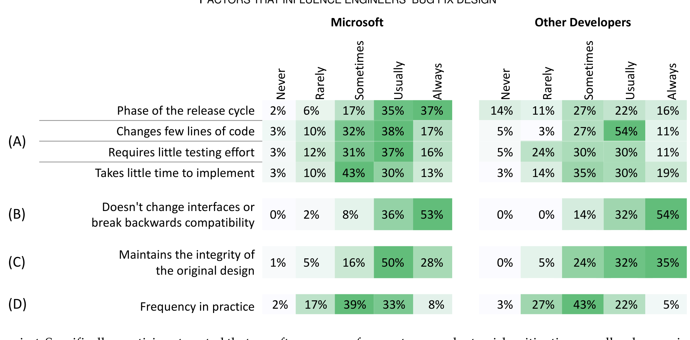

> **Image description:** A side-by-side heatmap (percentages shown in each cell) comparing how often different factors influence which bug fix engineers choose, with columns for Microsoft respondents and for other developers. Rows are grouped into (A) risk/time factors (phase of release, changing few lines, little testing, short implementation time), (B) not changing external interfaces, (C) maintaining original design integrity, and (D) how frequently the situation occurs in practice. Key data visible: Microsoft respondents report the release phase as a strong influence (Usually 35%, Always 37%), whereas other developers report it less (Usually 22%, Always 16%); both groups place very high emphasis on avoiding changes to external interfaces (Microsoft Always 53%, Other Always 54%); Microsoft respondents tend to value keeping design integrity (Usually 50%, Always 28%) more than other developers (Usually 32%, Always 35% combined), and both groups often consider how common the situation is (Microsoft Sometimes 39%/Usually 33%, Other Sometimes 43%/Usually 22%).

project. Specifically, participants noted that as software approaches release, their changes become more conservative. Conversely, participants reported taking more risks in earlier phases, so that if a risk materializes, they would have a longer period to compensate. Two commonly mentioned risks were the risk that new bugs would be introduced and the risk that spending significant time fixing one bug comes at the expense of fixing other bugs.

P12 provided an example of taking a more conservative approach, when he had to fix a bug by either fixing an existing implementation of the double checked locking pattern, or replace the pattern with a simpler synchronization mechanism. He eventually chose to correct the pattern, even though he thought the use of the pattern was questionable, because it was the "least disruptive" way to fix the bug. He noted that if he had fixed the bug at the beginning of the development cycle, he would have removed the pattern altogether.

As another example, P28 fixed a bug in which error messages would queue up before being shown to the user, and the engineer considered implementing a process to watch the queue to reorder the error messages within it. He stated that reordering these messages may have yielded a better user experience, but that making this change would have been too high a risk.

In our survey, we asked engineers several questions relating to risk and development phase, as shown in Table 4A. Here we asked engineers "How often do the following factors influence which fix you choose?", where each factor is listed at left. The table lists the percentage of respondents who choose that frequency level, for both the original Microsoft survey and the replicated one. Note that the factors are not necessarily linked; for instance, an engineer could choose to change very few lines of code for a reason other than the product is late in development. However, our qualitative interviews suggested that these factors are typically linked together, and thus we feel justified in presenting these four factors as a whole. These results suggest that, for most respondents, risk mitigation usually plays an important role in choosing how to fix a bug.

One of the findings that emerged from our interviews is that if engineers are frequently making conservative changes, then they may be incurring technical debt. As P15 put it:

> I wish to do it better, but I'm doing it this way because blah, blah, blah. But then I don't know if we ever go back and kind of "Oh, okay, we had to do this, now we can change it." And I feel that code never goes away, right?

We verified this statement by asking survey respondents how often they think bugs that are initially fixed "suboptimally" should be reconsidered for a more optimal fix in the future. We asked how many of these bugs actually are fixed optimally after the initial fix. Table 5 displays the results. These results suggest that engineers often feel that optimal fixes should be reconsidered in the future, but that those bugs rarely get fixed optimally. As one respondent noted, "although we talk about the correct fix in the next version, it never happens."

One way that Microsoft has dealt with fixing bugs too late in the development process is by instituting "bug caps" in some software teams. A bug cap is a number X such that once a developer is assigned X bugs, she must fix one of her assigned bugs before she can continue any other development work. Bug caps have analogous concepts in other parts of software development, such as "bug bars" in the Microsoft Security Development Lifecycle [26]. The intuition here is that bug caps should ensure that bugs are being fixed continuously throughout the development process and that developers are not waiting until the product is near release to fix bugs. While this intuition seems reasonable, we had heard informally that some developers have subverted the bug cap policy by reducing the number of bugs assigned to them without actually fixing bugs.

We set out to determine how developers subvert bug caps by asking Microsoft survey respondents, "have you

---

## Table 5
### SURVEY RESPONDENTS’ OPTIMAL FIX
Microsoft

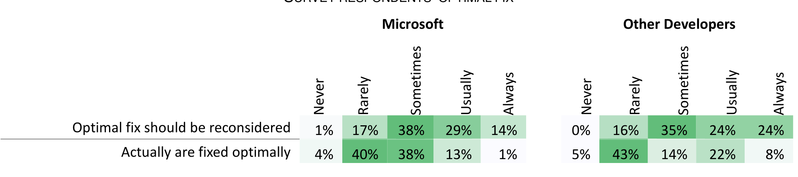

> **Image description:** This heatmap (Table 5) shows survey responses for two items side-by-side: how often respondents think an “optimal fix should be reconsidered” (top row) and how often such bugs “actually are fixed optimally” later (bottom row), with columns Never / Rarely / Sometimes / Usually / Always and separate panels for Microsoft (left) and Other Developers (right). For Microsoft respondents, the “should be reconsidered” row is 1% Never, 17% Rarely, 38% Sometimes, 29% Usually, 14% Always; the “actually are fixed optimally” row is 4% Never, 40% Rarely, 38% Sometimes, 13% Usually, 1% Always. For Other Developers, the “should be reconsidered” row is 0% Never, 16% Rarely, 35% Sometimes, 24% Usually, 24% Always; the “actually are fixed optimally” row is 5% Never, 43% Rarely, 14% Sometimes, 22% Usually, 8% Always. In other words, large majorities in both populations believe optimal fixes should be revisited (about 81–83% responded Sometimes/Usually/Always), but far fewer report that those bugs are ultimately fixed optimally (Microsoft ~14% Usually/Always; Other Developers ~30% Usually/Always), illustrating a gap between desired reconsideration and actual follow-through.

taken any actions to artificially reduce the number of bugs that you were assigned? If yes, what were those actions?

Respondents provided several creative methods that they had used. One described the methods of many of the respondents:

> Yes, of course. Combine multiple bugs into a single bug; resolve bugs as "won't fix" and then reactivate them later; temporarily assign bugs to another developer who has room in their cap.

Other respondents called the first method of combining bugs “coagulation,” using “umbrella reports,” or using “bug buckets.” Some respondents used unorthodox bug reporting techniques to subvert bug caps:

- Pushing bugs to future milestones to keep them out of the management query
- Track bugs by email to myself instead of product studio
- Yes, we've parked bugs in different paths in our database or kept them on the side in an Excel sheet until bug count is reduced. (this is anonymous, right? :) )

A few developers reported other ways of gaming the policy as well. This suggests that the bug cap mechanism may not be working as designed. Researchers in other domains have suggested that workarounds are both indications of poorly designed policies and of positive opportunities for change [27]. How to implement this change, however, remains an open question.

Equally interesting is that several developers appeared to be morally outraged that we even asked this question:

> I've never heard of this happening... My perspective on this is "Wow, that's just evil. Who the heck does that?"

> Never, artificially lowering the bug count that is lying or cheating (it's unethical). The key is to not inject bugs

> Yes, but I was forced to. I did not agree with it. Playing games with bugs/stats to meet a dashboard goal is not a good thing.

To investigate if there is a relation between the reaction of developers towards bug caps and the product that they worked on, we manually coded the open-text responses into whether developers had worked with bug caps. We then built a logistic regression model with current product division, primary work area (test/dev), years at Microsoft, years in the software industry as the independent variables to model whether developers encountered bug caps in their work. None of the coefficients in the regression model were statistically significant.

The contrasting reactions between those who readily practice artificial bug reduction and those who find the practice abhorrent suggests that bug caps are not widely discussed in the company.

Interface Breakage. Another factor that participants said influenced their bug fixes is the degree to which a fix breaks existing interfaces. If a fix breaks an interface that is used by external clients, then an engineer may be less inclined to implement that fix because it entails changes in those external clients.

One example comes from P16, who was working on a bug related to playing music and voice over Bluetooth devices. He said that a better fix for the problem would be to change the Bluetooth standard, but too many clients already depend on it. Another example comes from P25, which we discussed in the Data Propagation section, who fixed a bug in a multi-layer system where a lower layer was producing in kilobytes when the upper layers were expecting values in megabytes. Rather than fixing the bug in the lower layer where the data was being produced, the engineer fixed the bug in a higher layer, because changing interfaces implemented with Microsoft’s Component Object Model is a discouraged practice [28]. Interestingly, P25 was very resistant to change the interface, even though he was confident that no other clients were using it.

We also asked survey respondents how often the following factor influences which fix they choose: “Doesn’t change external interfaces or breaks backwards compatibility.” 89% {86%} reported that “usually” or “always,” suggesting that external interfaces strongly influence choosing which bug fix to implement (Table 4B).

Consistency. This factor describes to what degree a fix will be consistent with the existing software or existing practices. A fix that is not consistent with the existing code may compromise the design integrity of that code, leading to code rot.

One example is from P35, who was fixing a bug in a web portal in which the new version was not backward compatible under certain conditions. During the code review in which this bug was discovered, a colleague told P35 to fix this bug in a way that was consistent with how similar bugs have been fixed before. Another example is P10, who fixed a performance bug in his build system. P10

---

### Table 6
The most frequent mechanisms used by engineers to determine usage frequencies. * Indicates statistically significant differences at p < .05

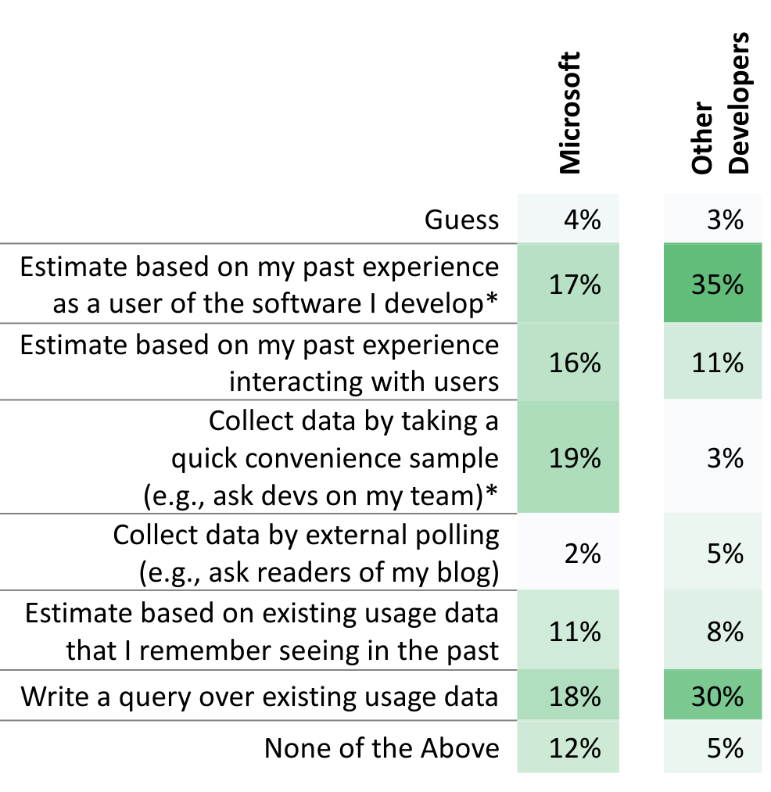

> **Image description:** A two-column heatmap-style table comparing how Microsoft developers and other developers determine how often a situation occurs in practice. For Microsoft respondents the most-reported methods are taking a quick convenience sample (19%), writing a query over existing usage data (18%), and estimating from their own experience as a user (17%); other options range from 2% (external polling) to 12% (None of the Above). For non-Microsoft respondents the largest shares are estimating based on their past experience as a user (35%) and writing queries over usage data (30%), while convenience sampling is rarely used (3%). The figure highlights the contrasts the authors note as statistically significant: Microsoft engineers rely more on quick convenience samples and less on personal-use estimates compared to other developers.

None of the Above 12% 5%

fixed the bug by using the build system in a way consistent with how it was being used by other teams. However, he felt that a change that was inconsistent with the way the build system currently worked would have produced better build performance, at least for his product. Table 4C lists survey respondents’ attitudes towards the importance of maintaining design consistency when fixing bugs.

### User Behavior
This factor describes the effect of how users of the software behave on the fix. If users have strong opinions about the software, or use a certain part of the software heavily, engineers may choose a fix that suits the user better.

One example is from P32, who was fixing a graphical processing unit bug, where large images were being displayed improperly in his software. P32’s team considered disallowing images over a certain size, but immediate customer feedback suggested that some customers would no longer use the software if large images were disallowed.

Another example is from T1, where the team discussed bugs in a code analysis tool. The team wondered how often users used a certain code pattern in practice. They acknowledged that their analysis did not work when the pattern was used, but how they fixed the bug depended on how often users actually wrote code in that pattern. They judged, apparently based either on intuition or experience, that several of these bugs were so unlikely to arise in practice that the effort to implement a comprehensive fix for the problem was not justified.

After hearing about T1 and some interviewees talk about frequency of user behavior, we became interested in how engineers know what users actually do. Thus, we asked two questions in the survey. In the first we asked how often fixes depended on usage frequency (Table 4D). These results suggest that how frequently a situation occurs in practice sometimes influences how engineers design fixes.

The second question was a multiple-choice question about how engineers most often determine frequency (Table 6). In this table, SQM refers to a usage data collector used in a variety of Microsoft products. The most common follow up to answering “None of the Above” was to ask the product manager. In Table 6, we were somewhat surprised to find that so many engineers write queries over usage data. However, it still appears that many engineers use ad-hoc methods for estimating user behavior, including convenience sampling, estimation, and guessing. The data in this table revealed two significant differences between Microsoft developers and other developers (Fisher Exact Test, p<.05); Microsoft developers less often make estimates based on their own experience as users, and more often make decisions based on convenience samples.

We also asked survey respondents about the advantages and disadvantages of each method of determining bug frequency. Overall, respondents reported there being a major tradeoff between accuracy of the data versus the time needed to calculate it. For example, using usage data takes a significant amount of time but accurately reflects the customer’s behavior, whereas making estimates based on a developer’s own experience is quite fast but may also be inaccurate.

Even if developers have sufficient time, respondents reported several other challenges to analyzing usage data. First, respondents noted that frequency is only part of the story because severity matters too; one respondent noted, frequency “doesn't represent how [angry the user gets when the] user meets the bug.” Second, even if usage data is captured, there “there may not be data for the question I want to answer.” Third, usage data is not useful in situations where the software has not yet been released. Fourth, even if usage data exists, “there's still the problem of how to interpret [it].” Finally, in some cases usage data cannot be used to “calculate certain metrics due to privacy concerns.”

### Cause Understanding
This factor describes how thoroughly an engineer understands why a particular bug occurs. In interviews, we were surprised how often engineers fixed bugs without understanding why those bugs occurred. Without thoroughly understanding a bug, the bug may re-appear at some point in the future. On the other hand, gaining a complete understanding of why a bug is occurring can be an extremely time-intensive task.

P3 provided an example of fixing a bug without a full understanding of the problem. The symptom of his bug was that occasionally an error message appeared to the user whenever his software submitted a particular job. Rather than understanding why the error was occurring, he fixed the job by simply resubmitting the job, which usually completed without error. Rather than understanding the problem, as he explained it, “my time is better spent fixing the other ten bugs that I had.”

P39 provided another example, where the engineer was fixing a web application that exhibited a strange bug, where a file was being downloaded through the web browser but the browser was not asking the user whether

---

### Table 7
WHO IS HELPFUL TO COMMUNICATE WITH WHEN CHOOSING AN OPTIMAL FIX

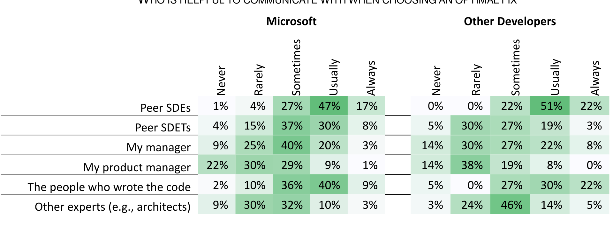

> **Image description:** Heatmap of survey responses showing how often different people are helpful when engineers choose an optimal fix, reported separately for Microsoft respondents and other developers across five frequency categories (Never, Rarely, Sometimes, Usually, Always). Peer software developers (Peer SDEs) are the most frequently cited helpful group (Microsoft: 47% “Usually”, 17% “Always”; Other developers: 51% “Usually”, 22% “Always”). The original authors of the code are also commonly consulted (Microsoft: 40% “Usually”, 9% “Always”; Other: 30% “Usually”, 22% “Always”), with the paper noting that non‑Microsoft respondents report contacting code authors more often. Managers and product managers are reported as least helpful overall (for Microsoft product managers: 22% “Never”, 30% “Rarely”, only 9% “Usually” and 1% “Always”; similar or worse for other developers), while peer testers (SDETs) and other experts show moderate helpfulness concentrated in the “Sometimes”/“Usually” categories.

### Table 8
WHO DECIDES WHICH FIX TO IMPLEMENT

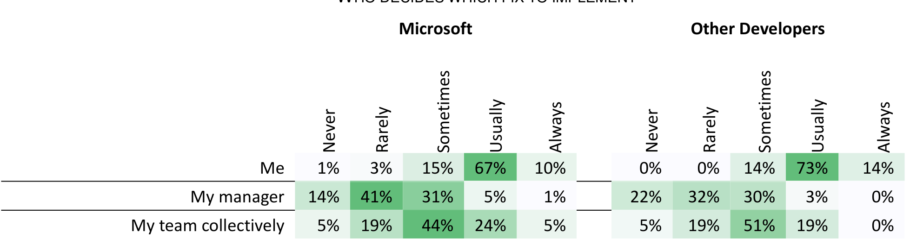

> **Image description:** A side-by-side heatmap table reporting how often different actors decide which fix to implement, comparing Microsoft respondents to other developers. For Microsoft respondents, 67% said “Usually” and 10% “Always” that they (the individual developer) decide the fix (1% Never, 3% Rarely, 15% Sometimes). For other developers the pattern is similar but slightly stronger: 73% “Usually” and 14% “Always” say the individual decides (0% Never, 0% Rarely, 14% Sometimes). Managers are rarely the final decider (Microsoft: 14% Never, 41% Rarely, 31% Sometimes, 5% Usually, 1% Always; Other: 22% Never, 32% Rarely, 30% Sometimes, 3% Usually). Team-level decisions occur most often at the “Sometimes” level (Microsoft 44% Sometimes, 24% Usually; Other developers 51% Sometimes, 19% Usually), indicating that choice of fix is primarily individual but often involves the team to some degree.

She really wanted to download the file. P39 had to ask two other teams at Microsoft to assist with finding the problem, yet the “root cause” of the problem was not found. P39 eventually fixed the problem with a workaround.

We observe that cause understanding is sometimes dependent on the reproducibility of a bug. However, some of our findings suggest that the notion of a clear distinction between reproducible and non-reproducible can sometimes be artificial and appear largely to be a matter of time and resources available. Joorabchi and colleagues [29] presented a first characterization of non-reproducible bugs and more research is needed in this direction.

We asked survey respondents why they do not always make an optimal fix for a bug; 18% indicated that they have not had “time to figure out why the bug occurred.” This suggests that lack of cause understanding is sometimes a problem.

### Social Factors.
A variety of social factors appear to play a role in how bugs are fixed, including mandates from supervisors, ability to find knowledgeable people, and code ownership.

One example of this was P22, who was fixing a bug in a database system where records were not sorting in memory, causing reduced performance. The engineer proposed a fix based on “one week of discussions and bringing new ideas, [and] discussing [it with my] manager.” Other interviewees discussed their bugs with mentors (P28), peer engineers (P28), testers (P39), and development leads (P34).

In the survey we asked how communication with people helps inform the bug fix design (Table 7). The results suggest that peer software development engineers (SDEs) and the people who originally wrote the code related to where the fix might be applied usually play important roles in deciding how a bug gets fixed. Table 8 displays how participants responded about who decides on which bug fix design to implement. The results also suggest that the individual engineers tend to make the final decision about which fix to implement, and that managers rarely make the final design suggestions. Agreement with the statement about communicating with the people who wrote the code was significantly different between Microsoft developers and other developers (Mann–Whitney U Test, p<.05); Microsoft developers tended to communicate with the developers who wrote the code less often.

We also asked survey respondents how they communicate with others about bug design. Respondents indicated that they most often communicate by email (44%) {30%}, in unplanned meetings (38%) {46%}, planned meetings (7%) {3%}, and in the bug report itself (6%) {14%}. This behavior did not differ significantly between Microsoft developers and other developers (Fisher Exact Test, p>.05). A few respondents also indicated that they discussed design with instant messaging, video chat, and during online code review. However, in a study run in parallel with this one, we inspected 200 online code review threads at Microsoft, but found no substantial discussions of bug fix design [30]. We postulate that, by the time a fix is reviewed, engineers have

---

## Table 9
HOW MANY PEOPLE ARE INVOLVED IN BUG FIXING ACTIVITIES

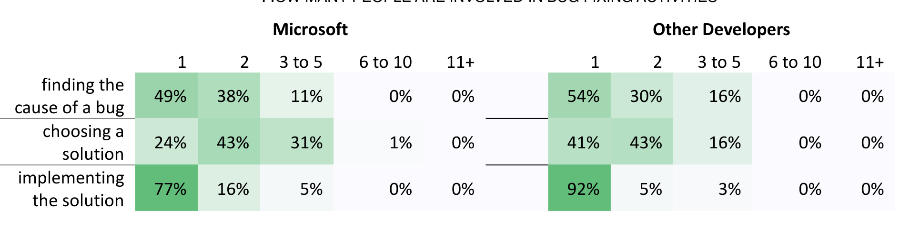

> **Image description:** Heatmap of survey responses showing how many people typically participate in three bug-fixing activities, split by Microsoft (left) and other developers (right). Columns are group sizes (1, 2, 3–5, 6–10, 11+); rows are ‘finding the cause of a bug’, ‘choosing a solution’, and ‘implementing the solution’. For both populations, finding the cause is most often a 1- or 2-person task (Microsoft: 49% one-person, 38% two-person; Other: 54% and 30%), implementing the solution is overwhelmingly single-person (Microsoft 77%, Other 92%), while choosing a solution is more collaborative (Microsoft: 24% one-person, 43% two-person, 31% three–five people; Other: 41% one-person, 43% two-person, 16% three–five people). Very few respondents in either group report teams larger than five people for any of these activities.

already discussed and agreed upon the basic design of that fix.

We asked survey respondents how many people, including themselves, were typically involved in the bug fixing process. Table 9 shows the results. These results suggest that while finding the cause of a bug and implementing a solution are generally 1- or 2-person activities, choosing a solution tends more often to be a collaborative activity.

One of the more surprising things we heard from some interviewees was that when they made sub-optimal changes, they were sometimes hesitant to file new bug reports so that the optimal changes were reconsidered in the future. The rationale for not doing so seemed to be at least partly social – respondents were not sure whether other engineers would find a more optimal fix useful to them as well. For instance, P2 said the optimal fix to his bug would be a change to the way mobile applications are built in the build system, but he was not sure that he would advocate for this change unless other teams would find it useful as well. Ideally, this is what “feature enhancement” bug reports with engineer voting should help with. However, P2 didn’t fill out a bug report for this enhancement at all, because he judged the time he spent filling out the report would be wasted if other engineers didn’t need it. As he put it,

> If I had more data... that other teams did it... if I could eyeball it quickly... then I'd [say], "Hey, you know, other teams are doing this. Clearly, it's a [useful] scenario."

This made us wonder why engineers avoid filing bug reports, so we asked survey respondents to estimate the frequency of several possible rationales that we heard about during the interviews (Table 10). These results suggest that survey respondents rarely avoid filing bugs for reasons that the interviewees discussed. We view these somewhat contradictory findings as inconclusive; more study, likely using a different study methodology, is necessary to better understand how often and why engineers do not file bug reports.

Demographics. For the Microsoft population, we investigated the effect of different demographics (product division, work area, experience at Microsoft, and experience in software industry) on the survey responses. For each Likert-style question, we built logistic regression models to describe whether respondents selected “Usually” or “Always” (binary dependent variable) with the demographics (independent variables). For the following statements, we observed differences that were statistically significant at .01:

- I notice code that should be refactored. (Testers were less likely to agree, p=.0023)
- How often do the following factors influence which fix you choose?

## Table 10
FREQUENCY OF REASONS FOR NOT FILING BUGS
Microsoft

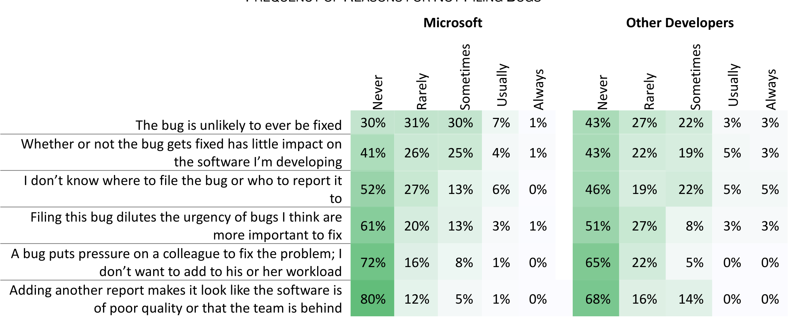

> **Image description:** A side-by-side heatmap compares how often Microsoft respondents and other developers avoid filing bug reports for six stated reasons, with frequency columns Never / Rarely / Sometimes / Usually / Always. Overall most respondents answer “Never” for these reasons (darkest cells): e.g., among Microsoft engineers 80% say they never avoid filing because “adding another report makes it look like the software is of poor quality,” 72% never avoid filing to spare a colleague, and 61% never avoid filing because the bug has little impact. An exception is the item “The bug is unlikely to ever be fixed,” which is more distributed for Microsoft (30% Never, 31% Rarely, 30% Sometimes), indicating some developers sometimes refrain from reporting when they expect no action; other developers show a similar but slightly stronger “Never” tendency across most rows (for example, 68% Never on the ‘adds poor-quality appearance’ item).

---

- Takes little time to implement
  - (Testers were more likely to agree, p = .0068)

- How often does communicating with the following people help you choose the optimal fix?
  - Peer SDETs
    - (Testers were more likely to agree, p < .0001)
  - My product manager
    - (Respondents with more experience at Microsoft were less likely to agree, p = .0007)

- When choosing which fix to apply to your bugs, how often does the decision get made in the following ways?
  - I choose the fix.
    - (Testers were less likely to agree, p = .0048)
  - My team collectively chooses the fix.
    - (Testers were more likely to agree, p = .0087)

For the population of other developers we ran a separate analysis because the demographics questions were different (contributed to OSS, work area, experience in current company, experience in software industry). We observed only one difference that was statistically significant at .05:

- How often do the following factors influence which fix you choose?
  - My peers’ opinions of the fix
    - (Respondents with more experience in software industry were less likely to agree, p = .0399)

## 6 LIMITATIONS

Although our study provides a unique look at how engineers fix bugs, several limitations of our study must be considered when interpreting our results.

An important limitation is that of generalizability beyond the population we studied (external validity). While our results may represent the practices and attitudes at Microsoft, it seems unlikely that they are completely representative of software development practices and attitudes in general. However, because Microsoft makes a wide variety of software products, uses many development methods, and employs an international workforce, we believe that our random and stratified sampling techniques improved generalizability significantly. This interpretation is strengthened by our replicated survey, where Microsoft developers only differed in two significant respects from developers at large.

Three threats are worth noting that specifically affected the replicated survey. First, although we found few statistically significant differences compared to Microsoft developers, this may be due to low statistical power. Use of a power analysis may have helped alleviate this threat, but such analysis confidently requires a priori knowledge of effect sizes. Second, some of the participants recruited through Facebook may have been Microsoft employees, so there may have been overlap between the two samples. We believe that overlap is very unlikely or if present has only a small effect. The potential reach of the Facebook advertisements was 86,000 people, when we restrict that audience to people with Microsoft as employer, Facebook estimated the reach as “Fewer than 1000 people”; that means that at most 1.2% of the Facebook sample were employed by Microsoft. Third, the targeting on Facebook is based on data that is self-reported by its users. For example, users may have falsely stated that their job title was “software developer.” This was not a problem with the Microsoft survey, as we selected participants whose official job titles indicated that they were developers, based on information in the official human resources database.

Giving interviewees’ and survey respondents’ example bugs and multiple-fix examples may have biased participants towards providing answers that aligned with those examples, a form of expectancy bias (internal validity). However, we judged the threat of participants unable to recall implicit or explicit design decisions outweighed this threat. Future researchers may be able to confirm or refute our results by using a research method that is more robust to expectancy bias.

Still, some interviewees struggled with remembering the design decisions they made, and were generally unable to articulate implicit decisions. This type of memory bias is inherent in most retrospective research methods. However, we attempted to control memory bias by asking opportunistic interviewees to recall their most recently fixed bugs, asking firehouse interviewees to discuss a bug they just fixed, and asking survey respondents to look at bugs they had recently fixed.

Although we talked to firehouse interviewees soon after they fixed bugs, this may not have been the most relevant time to ask about the different designs they considered. Since they had implemented one particular fix, they may be less likely to readily admit to considering design alternatives, a form of commitment bias [31]. Future firehouse interviews may be able to find a time closer to the time when multiple designs are being considered.

In keeping with the wishes of participants in the bug triage meetings, we did not keep audio recordings of the meetings. As a consequence, we may have missed information that we otherwise would have noticed if we had been able to analyze audio recordings later.

To meet our goal of not significantly interrupting participants’ workdays, we kept our interview and survey short, which means we were unable to collect contextual information that may have helped us better explain the results. For example, in the interviews, we did not ask questions about gender or team structure, which may have some effect on bug fix designs.

Similarly, a consequence of keeping the survey short is that participants may have misunderstood our questions. For example, in our survey, we asked engineers whether they ever avoided filing a bug report; this question could be interpreted conservatively to mean, “when do you not report software failures?”, when our intent was for “bug reports” to be interpreted broadly to include enhancements. While we tried to minimize this threat by piloting our survey, as with all surveys [17], we may still have miscommunicated with our respondents.

When we asked our research group to code opportunistically, the transcripts we provided them with were precoded by the first author. This may have biased participants to simply confirm the first author’s codings. The research group’s codings did provide some additional value, as every coder provided additional quotes not originally

---

## 7 IMPLICATIONS

The findings we present in this paper have several implications, a handful of which we discuss in this section.

### Additional Factors in Bug Prediction and Localization.

Previous research has investigated several approaches to predicting future bugs based on previous bugs [32][33], including our own [3]. The intuition behind these approaches appears reasonable: how engineers have fixed bugs in the past is a good predictor of how they should fix bugs in the future. However, the empirical results we present in this paper suggest a host of factors can cause a bug to be fixed in one way at one point in time, but in a completely different way at another. For example, a bug fixed just before release is likely to be fixed differently than a bug fixed during the planning phase. As a result, future research in prediction and localization may find it useful to incorporate, when possible, these factors into their models.

### Limits of Bug Prediction and Localization.

Although incorporating some factors, such as development phase, into historical bug prediction may improve the accuracy of these models, some factors appear practically outside the reach of what automated predictors can consider. For example, when analyzing past bugs, it seems unlikely that an automated predictor can know whether or not a past fix was made with an engineer’s full knowledge of why the bug occurred.

### Refactoring while Fixing Bugs.

The results of our study suggest that engineers frequently see code that should be refactored, yet still avoid refactoring. One way that this problem could be alleviated is through wider use of refactoring tools, which should help engineers refactor without spending excessive time doing so and at minimal risk of introducing new bugs. At the same time, such tools remain buggy [34] and difficult to use [35], so more research in that area is necessary.

### Usage Analytics.

In our study, it appeared that engineers often made decisions about how to fix bugs without a data-driven understanding of how real users use their software. While a better understanding would clearly be beneficial, gathering and querying that data appears to be time consuming. Microsoft, like many companies, has been gathering software usage data for some time, but querying that data requires engineers to be able to find and combine the right data sources, and write complex SQL queries. We envision a future where engineers, while deciding the design of a bug fix, can quickly query existing usage data with an easy-to-use tool. To build such a tool, research is first needed to discover what kinds of questions engineers ask about their usage data, beyond existing "questions engineers ask" studies [36].

### Utility Analytics.

Not only can it be difficult for developers to know how users behave, but our results also suggest that developers have difficulty determining whether a more sweeping bug fix is going to be useful to other developers. For instance, participants suggested that, if they knew a new architecture was useful to more than just their team, they would be more likely to implement that architecture.

### Fix Reconsideration.

Engineers in our study reported needing to reconsider bug fixes in the future, but sometimes used ad-hoc mechanisms for doing so, such as writing TODOs in code. Some of these mechanisms may be difficult to keep track of; for example, which TODOs should be considered sooner rather than later. Engineers need a better mechanism to reconsider fixes in the future, as well as the time to do so.

### Microsoft Developers and Other Developers.

As we mentioned earlier, the replication showed only two statistically significant differences between Microsoft developers’ responses and other developers’ responses. With respect to the questions we asked about bug fixing, this suggests that Microsoft developers are similar to the greater developer community, and that in some aspects of bug fixing, Microsoft developers can approximate the greater developer community. Nonetheless, Microsoft developers are likely different in some other dimensions that our survey did not capture.

## 8 CONCLUSION

In this paper, we have described a study that combined opportunistic interviews, firehouse interviews, meeting observation, and a survey. We had initially assumed that the design space was dominated by "root-cause fixes" versus "workarounds," but as the study wore on, the distinction between the two became less and less clear. What has become clear, however, is that the design space of bug fixes is multi-dimensional, and that engineers navigate the space by, for example, selecting the fix that is least disruptive when a release looms near. While our study has not investigated a new practice, we have taken the critical first step towards understanding a practice that engineers have always engaged in, an understanding that will enable researchers, practitioners, and educators to better understand and improve bug fixes.

## ACKNOWLEDGMENT

Emerson Murphy-Hill was a Visiting Researcher at Microsoft when this work was carried out. Thanks to all participants in our study, as well as Alberto Bacchelli, Michael Barnett, Andy Begel, Nicolas Bettenburg, Rob DeLine, Xi Ge, Jeff Huang, Brittany Johnson, Ekrem Kocaguneli, Tamara Lopez, Patrick Morrison, Shawn Phillips, Juliana Saraiva, Jim Shepherd, Nuo Shi, Jonathan Sillito, Gustavo Soares, and Yoonki Song.

---

## REFERENCES

[1] Zeller, A. Causes and Effects in Computer Programs. In Fifth Intl. Workshop on Automated and Algorithmic Debugging (Sept. 24, 2003).

[2] Endes, A. An analysis of errors and their causes in system programs. In International Conference on Reliable Software (1975), 327-336.

[3] Kim, S., Zimmermann, T., Jr., W.J., and Zeller, A. Predicting Faults from Cached History. In Proceedings of ICSE (2007), IEEE Computer Society, 489--498.

[4] Lucia, Thung, F., Lo, D., and Jiang, L. Are faults localizable? In Working Conference on Mining Software Repositories (June 2012), 74--77.

[5] Murphy-Hill, E., Zimmermann, T., Bird, C., and Nagappan, N. The design of bug fixes. In International Conference on Software Engineering (2013), 332-341.

[6] Leszak, M., Perry, D.E., and Stoll, D. A case study in root cause defect analysis. In Proceedings of ICSE (2000), 428--437.

[7] Ko, A.J. and Chilana, P.K. Design, discussion, and dissent in open bug reports. In Proceedings of iConference (2011), ACM, 106--113.

[8] Breu, S., Premraj, R., Sillito, J., and Zimmermann, T. Information needs in bug reports: improving cooperation between developers and users. In Proceedings of the Conference on Computer Supported Cooperative Work (2010), ACM, 301-310.

[9] Bird, C., Bachmann, A., Aune, E., Duffy, J., Bernstein, A., Filkov, V., and Devanbu, P. Fair and balanced?: bias in bug-fix datasets. In Proceedings of ESEC/FSE (2009), ACM, 121--130.

[10] Gu, Z., Barr, E.T., Hamilton, D.J., and Su, Z. Has the Bug Really Been Fixed? In The International Conference on Software Engineering (2011), IEEE.

[11] Yin, Z., Yuan, D., Zhou, Y., Pasupathy, S., and Bairavasundaram, L. How do fixes become bugs? In Proceedings of FSE (2011), ACM, 26--36.

[12] Aranda, J. and Venolia, G. The secret life of bugs: Going past the errors and omissions in software repositories. In Proceedings of ICSE (2009), IEEE Computer Society, 298--308.

[13] Spinellis, D., Gousios, G., Karakoidas, V., Louridas, P., Adams, P.J., Samoladas, I., and Stamelos, I. Evaluating the Quality of Open Source Software. Electronic Notes on Theoretical Computer Science, 233 (Mar. 2009), 5-28.

[14] Storey, M.A., Ryall, J., Bull, R.I., Myers, D., and Singer, J. TODO or to bug. In Proceedings of ICSE (May 2008), 251--260.

[15] Anvik, J., Hiew, L., and Murphy, G.C. Who should fix this bug? In Proceedings of ICSE (2006), ACM, 361--370.

[16] Tillmann, N., De Halleux, J., Xie, T., Gulwani, S., and Bishop, J. Teaching and Learning Programming and Software Engineering via Interactive Gaming. In International Conference on Software Engineering (2013), 1117-1126.

[17] Shull, F., Singer, J., and Sjoberg, D.I.K. Guide to Advanced Empirical Software Engineering. Springer-Verlag New York, Inc., 2007.

[18] Fischhoff, B. and Beyth, R. 'I knew it would happen': Remembered probabilities of once-future things. Organizational Behavior & Human Performance, 13 (Feb. 1975), 1--16.

[19] Murphy-Hill, E., Zimmermann, T., Bird, C., and Nagappan, N. Appendix to the Design of Bug Fixes. MSR-TR-2013-22, Microsoft Research, 2013. http://research.microsoft.com/apps/pubs/?id=183985.

[20] Seaman, C.B. Qualitative methods in empirical studies of software engineering. IEEE Transactions on Software Engineering, 25 (Jul/Aug 1999), 557-572.

[21] Rogers, E.M. Diffusion of Innovations, 5th Edition. Free Press, 2003.

[22] Kitchenham, B.A. and Pfleeger, S.L. Personal Opinion Surveys. In Guide to Advanced Empirical Software Engineering. Springer, 2007.

[23] Punter, T., Ciolkowski, M., Freimut, B., and John, I. Conducting on-line surveys in software engineering. In Proceedings of Empirical Software Engineering (Sept.-1 Oct. 2003), 80-88.

[24] Benjamini, Y. and Hochberg, Y. Controlling the false discovery rate: a practical and powerful approach to multiple testing. Journal of the Royal Statistical Society Series B (1995), 289-300.

[25] Vakilian, M., Chen, N., Negara, S., Rajkumar, B.A., Bailey, B.P., and Johnson, R.E. Use, disuse, and misuse of automated refactorings. Proceedings of the 34th International Conference on Software Engineering (2012), 233-243.

[26] MICROSOFT. Security Development Lifecycle. http://www.microsoft.com/security/sdl/default.aspx. 2013.

[27] Ferneley, E.H. and Sobreperez, P. Resist, comply or workaround? An examination of different facets of user engagement with information systems. European Journal of Information Systems, 15, 4 (2006), 345-356.

[28] MICROSOFT. Changing an Existing Interface. http://msdn.microsoft.com/en-us/library/windows/desktop/aa384156(v=vs.85).aspx. 2012.

[29] Joorabchi, M.E., Mirzaaghaei, M., and Mesbah, A. Works for me! Characterizing non-reproducible bug reports. In Proceedings of MSR'14: 11th Working Conference on Mining Software Repositories (2014), 62-71.

[30] Bacchelli, A. and Bird, C. Expectations, Outcomes, and Challenges of Modern Code Review. In International Conference on Software Engineering (2013), IEEE.

[31] Staw, B.M. "Knee-deep in the Big Muddy: A Study of Escalating Commitment to a Chosen Course of Action.

---

Organizational Behavior and Human Performance, 16, 1, 27–44.

[32] Ostrand, T.J., Weyuker, E.J., and Bell, R.M. Predicting the location and number of faults in large software systems. IEEE Transactions on Software Engineering, 31 (Apr. 2005), 340–355.

[33] Hassan, A.E. and Holt, R.C. The Top Ten List: Dynamic Fault Prediction. In Proceedings of the International Conference on Software Maintenance (2005), IEEE Computer Society, 263–272.

[34] Soares, G., Gheyi, R., and Massoni, T. Automated Behavioral Testing of Refactoring Engines. IEEE Transactions on Software Engineering (2012).

[35] Murphy-Hill, E., Parnin, C., and Black, A.P. How we refactor, and how we know it. In Proceedings of ICSE (2009), IEEE Computer Society, 287–297.

[36] Fritz, T. and Murphy, G.C. Using information fragments to answer the questions developers ask. In Proceedings of ICSE (2010), ACM, 175–184.

## APPENDIX

In the online appendix, the reader will find the survey we distributed via Facebook.

---

## Default Question Block

## North Carolina State University
### INFORMED CONSENT FORM for RESEARCH

Title of Study:  
An Exploration of Bug Fixing

Principal Investigator:  
Dr. Emerson Murphy-Hill

> What are some general things you should know about research studies?  
>  
> You are being asked to take part in a research study. Your participation in this study is voluntary. You have the right to be a part of this study, to choose not to participate or to stop participating at any time without penalty. The purpose of research studies is to gain a better understanding of a certain topic or issue. You are not guaranteed any personal benefits from being in a study. Research studies also may pose risks to those that participate. In this consent form you will find specific details about the research in which you are being asked to participate. If you do not understand something in this form it is your right to ask the researcher for clarification or more information. A copy of this consent form will be provided to you. If at any time you have questions about your participation, do not hesitate to contact the researcher named above.
> 
> ### What is the purpose of this study?  
> The purpose of the research is to assess software developers' attitudes towards bug fixing.
> 
> ### What will happen if you take part in the study?  
> If you decide to participate, you will complete a 20-minute survey that asks about your attitudes.
> 
> ### Risks  
> Participation in this study involves minimal risk or discomfort to you. Risks are minimal and do not exceed those of normal office work. If you experience eyestrain we recommend that you look around the room for about thirty seconds so that your eyes focus at different distances.
> 
> Additionally, you should understand that as an online participant in this research there is always a risk of intrusion, loss of data, identification, or other misuse of data by outside agents. Though these risks may be minimized by the researcher, you should understand they exist.
> 
> ### Benefits  
> It is anticipated you will receive no direct or indirect benefit from participating in this study. Your participation in this study may help to contribute to the body of knowledge concerning bug fixing.
> 
> ### Confidentiality  
> The information in the study records will be kept confidential to the full extent allowed by law. Data will be stored securely in a locked laboratory and on password secure servers. No reference will be made in oral or written reports which could link you to the study. Your participation is completely anonymous so there is no way for your identity to be linked to any of the comments you may make.
> 
> ### Compensation  
> Once you complete the survey, there is a link for a drawing for one of two $50 Amazon.com gift cards.
> 
> ### What if you are a NCSU student?  
> Participation in this study is not a course requirement and your participation or lack thereof, will not affect your class standing or grades at NC State.
> 
> ps://login.qualtrics.com/ControlPanel/Ajax.php?action=GetSurveyPrintPreview&T=3uSbn 1

---

> **What if you are a NCSU employee?**  
> Participation in this study is not a requirement of your employment at NCSU, and your participation or lack thereof will not affect your job.  
> **What if you have questions about this study?**  
> Please contact:  
> Dr. Emerson Murphy-Hill  
> 890 Oval Drive  
> Campus Box 8206  
> Raleigh, NC 27695  
> 919-513-0234  
> emerson@csc.ncsu.edu  
> **What if you have questions about your rights as a research participant?**  
> If you feel you have not been treated according to the descriptions in this form, or your rights as a participant in research have been violated during the course of this project, you may contact Deb Paxton, Regulatory Compliance Administrator, Box 7514, NCSU Campus (919/515-4514).

### You may only participate if the following two statements are true about you.
- [ ] I fix bugs in software
- [ ] I am 18 years old or older

### Of all the bugs I fix, most are fixed in...
- open-source software
- closed-source software

> For this survey, we'd like you to focus only on your work on ${q://QID44/ChoiceGroup/SelectedChoices}.  
> This survey is only one page long. All questions are optional.

### Which best describes your primary work area?
- Development
- Test
- Product Management
- Build
- Design and UX
- Documentation

---

Other

### How many years have you worked at your current company? (type a number below)

### How many years have you worked on your most active open source project? (type a number below)

### How many years have you worked in the software industry? (type a number below)

### How many years have you contributed to open source? (type a number below)

### What percentage of your immediate team works in the same office/location as you? (type a number below)

## Bug Fixes

> Some bugs can be fixed in multiple ways. For example:
> - A bug that propagates bad data through several layers may be fixed in any layer between the source and the user interface.
> - A bug may be fixed by preventing an exception from being thrown, or by catching that exception before the user sees it.
> - A bug may be fixed directly or may be refactored first and then fixed.

---

/2014 Qualtrics Survey Software

### Of the bugs that you fix, approximately what percentage are there multiple potential fixes? (type a number below)

> In the remainder of this survey, we will be asking about only those bugs for which there are multiple fixes.

### Of these bugs you fix, which of the following is most common?
- No fix will satisfy all stakeholders.
- Only one fix will satisfy all stakeholders.
- More than one fix will satisfy all stakeholders.

### How often do you personally feel satisfied with the fix you applied?
- Never
- Rarely
- Sometimes
- Usually
- Always
- N/A

### Once you've found the bug and there are multiple potential fixes, how often is the appropriate fix immediately apparent?
(As opposed to you needing to carefully consider the benefits and drawbacks of each potential fix.)
- Never
- Rarely
- Sometimes
- Usually
- Always
- N/A

---

## How often do the following factors influence which fix you choose?

Never  Rarely  Sometimes  Usually  Always  N/A

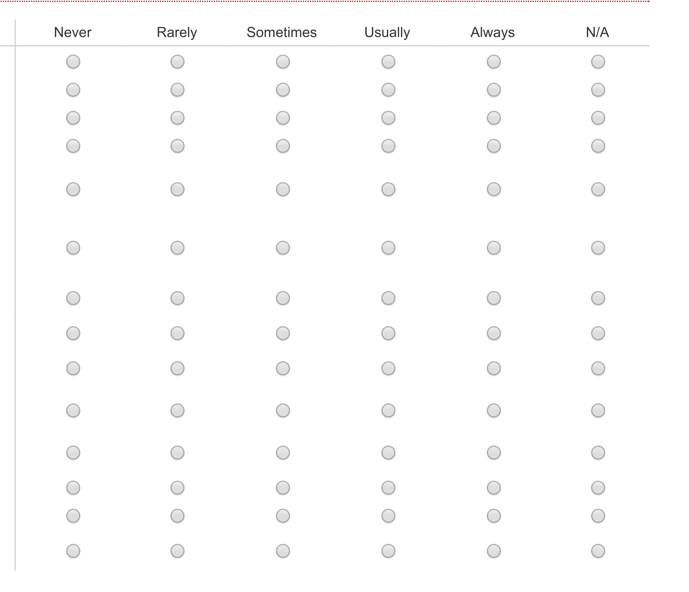

> **Image description:** A survey screenshot showing a Likert-style matrix with six column options (Never, Rarely, Sometimes, Usually, Always, N/A) and a vertical list of factors that might influence which bug fix an engineer chooses. The listed factors (one per row) include: Changes few lines of code; Requires little testing effort; Takes little time to implement; Deployment cost is low; Creates code easy for future developers to understand; Doesn’t change external interfaces or break backward compatibility; Maintains the integrity of the original design; Meets quality standards; Phase of the release cycle my product is in; Whether users will find it intuitive; Whether I’m the most qualified person to implement this fix; My peers’ opinions of the fix; My manager’s opinion of the fix; and There’s a standard fix for this type of bug. Respondents selected a frequency for each factor; these answers were later aggregated in the paper (Table 4) to show, for example, that avoiding changes to external interfaces strongly influenced fix choice (89% of Microsoft respondents answered “usually” or “always”).

- Changes few lines of code
- Requires little testing effort
- Takes little time to implement
- Deployment cost is low
- Creates code that will be easy for future developers to understand
- Doesn't change external interfaces or break backward compatibility
- Maintains the integrity of the original design
- Meets quality standards
- Phase of the release cycle my product is in
- Whether users are going to find it intuitive
- Whether I'm the most qualified person to implement this fix
- My peers' opinions of the fix
- My manager's opinion of the fix
- There's a standard fix for this particular type of bug

If there are any other factors that influence what fix you choose, please enter them here.

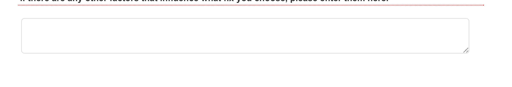

> **Image description:** Screenshot of a survey free-response field labeled, “If there are any other factors that influence what fix you choose, please enter them here:” The image shows a large, empty, rounded-rectangle multi-line text box with a light gray border and a small diagonal resize handle in the lower-right corner. In the paper’s survey this field follows the Likert-style matrix of predefined factors and was provided so respondents could list any additional considerations that affect which bug fix they choose.

## How often do you apply the “optimal” fix for a bug?

An optimal fix is the one you would implement if you were not limited by time.

- Never
- Rarely
- Sometimes
- Usually
- Always
- N/A

---

> For those bugs for which you did not apply the optimal fix, which of the following are reasons for you not doing so?
>
> - [ ] I didn’t have time to figure out why the bug occurred
> - [ ] I didn’t have time to implement the fix
> - [ ] I didn’t have time to completely understand the APIs I’d have to use
> - [ ] I didn’t know where to find the necessary code
> - [ ] I didn’t have permission to modify the code
> - [ ] The software wasn’t important enough
> - [ ] The documentation of the code was poor
> - [ ] The bug appeared so rarely that a non-optimal fix will suffice
> - [ ] I couldn’t find the right person to help me make the fix
> - [ ] The right person to help me make the fix had more important things to do
> - [ ] Other (specify below)

## Reconsidering Fixed Bugs

> For bugs that you fix sub-optimally, how often do you think an optimal fix should be reconsidered in the future?
>
> - Never
> - Rarely
> - Sometimes
> - Usually
> - Always
> - N/A

> What is the most common mechanism you use to make sure that the optimal fix is considered in the future?
>
> - Make a mental note
> - Make a comment in the code (e.g. TODO)
> - Write a comment on a bug report
> - Create a new bug report
> - Keep a private list of the bugs I'd like to see fixed in the future
> - Other

---

2014 Qualtrics Survey Software

What are the advantages and disadvantages of using the mechanism that you selected above?

For bugs that you do not initially fix optimally, how often do they get fixed optimally later?

- Never
- Rarely
- Sometimes
- Usually
- Always
- N/A

## Bug Fixes and Software Usage

How often is your choice of fix dictated by how often the situation in which the bug was reported actually occurs in practice?

For example, if the bug is that database files are deleted when updates are applied over a period that includes midnight, which fix you apply may depend on if users frequently have database files and also install updates at midnight.

- Never
- Rarely
- Sometimes
- Usually
- Always
- N/A

What is the most common mechanism you use to determine the frequency of such situations?

- Guess
- Estimate based on my past experience as a user of the software I develop
- Estimate based on my past experience interacting with users
- Collect data by taking a quick convenience sample (e.g., ask devs on my team)

---

- Collect data by external polling (e.g., ask readers of my blog)
- Estimate based on existing usage data that I remember seeing in the past
- Write a query over existing usage data
- Other

### What are the advantages and disadvantages of using the mechanism that you selected above?

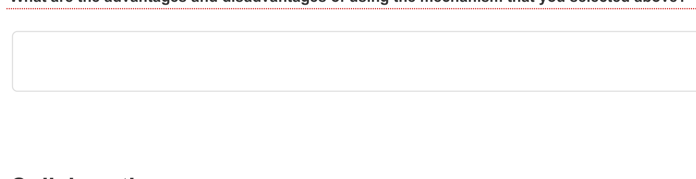

> **Image description:** A screenshot of a survey page asking respondents to describe the advantages and disadvantages of the mechanism they selected for ensuring an optimal fix is reconsidered later. The image shows the question prompt near the top (partially visible) and a large empty, rounded-rectangular free-text input area with a light gray border occupying most of the frame. The box is blank (no response shown); the surrounding page is white with minimal additional UI elements visible. The question relates to the survey section on how developers track sub‑optimal fixes for future reconsideration (e.g., TODOs, bug reports, private lists).

## Collaboration

### When choosing which fix to apply to your bugs, how often does the decision get made in the following ways?

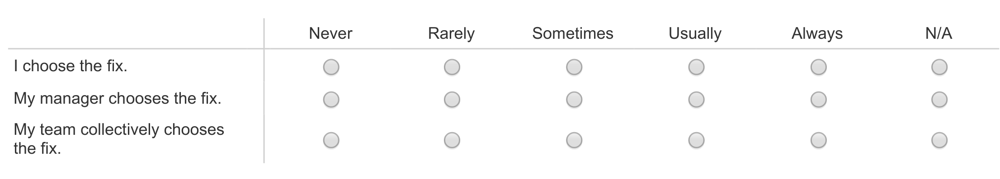

> **Image description:** A survey question grid showing a Likert-style response matrix used to ask participants how often different actors decide which bug fix to apply. The three rows list the decision-makers: “I choose the fix,” “My manager chooses the fix,” and “My team collectively chooses the fix,” and the six response columns are Never, Rarely, Sometimes, Usually, Always, and N/A with circular radio buttons for each cell. This instrument was used in the paper to quantify collaboration in fix selection; the authors report (in the text/Table 8) that individual engineers most often make the final decision while managers rarely do.

### How often does communicating with the following people help you choose the optimal fix?

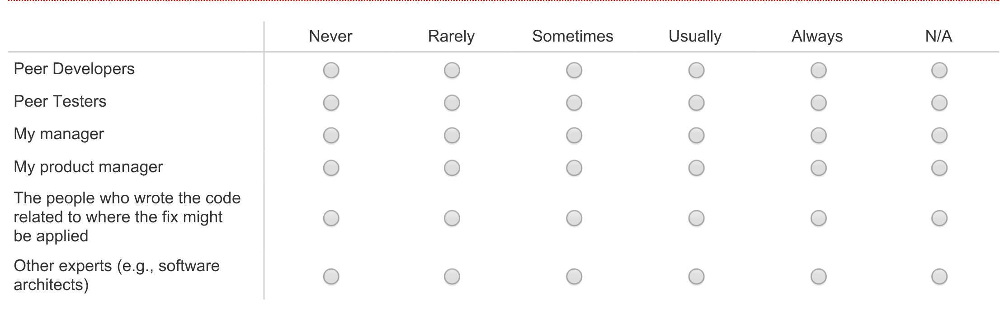

> **Image description:** A screenshot of the survey question that asks respondents how often communicating with various people helps them choose an optimal bug fix. The left column lists roles (Peer Developers; Peer Testers; My manager; My product manager; The people who wrote the code related to where the fix might be applied; Other experts e.g., software architects) and the top row gives frequency options (Never, Rarely, Sometimes, Usually, Always) plus N/A as a column. Each cell is rendered as a radio button, indicating respondents selected one frequency per role; this question produced the data summarized in Table 7 of the paper. The authors used these responses to report that peer developers and the original code authors are commonly considered helpful when deciding how to fix bugs, while managers are less often the deciding influence.

### When discussing which fix to apply with other people, by what means do you most often communicate?

---

- In the bug report
- By email
- Unplanned meetings
- Planned meetings
- Other

For bugs you fix, including yourself, how many people are typically involved in fixing the bug?

1 2 3-5 6-10 11+

- finding the cause of the bug?
- choosing a solution?
- implementing a solution?

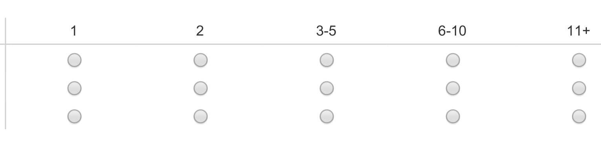

> **Image description:** A survey-style radio-button grid showing five numeric columns (1, 2, 3–5, 6–10, 11+) and three horizontal rows of choices. The matrix is the question from the paper asking, “For bugs you fix, including yourself, how many people are typically involved in fixing the bug?” with separate rows (in the full survey) for the sub-activities: finding the cause of the bug, choosing a solution, and implementing a solution. Respondents select one radio button per row to indicate the typical team size for each activity; the image shows the blank selection controls laid out for those three activities. This element is part of the paper’s survey instrument used to measure how collaborative different bug‑fixing tasks tend to be.

## Other Questions

How often do you choose not to file a bug report for the following reasons?

Never Rarely Sometimes Usually Always N/A

- I don’t know where to file the bug or who to report it to
- The bug is unlikely to ever be fixed
- Adding another report makes it look like the software is of poor quality or that the team is behind
- Whether or not the bug gets fixed has little impact on the software I’m developing
- A bug puts pressure on a colleague to fix the problem; I don’t want to add to his or her workload
- Filing this bug dilutes the urgency of bugs I think are more important to fix

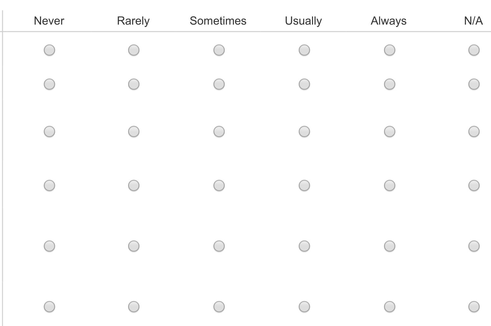

> **Image description:** Screenshot of the Likert-style survey grid used to ask engineers how often various factors influence which bug fix they choose. The horizontal headings are the frequency options: Never, Rarely, Sometimes, Usually, Always, and N/A, and each row corresponds to a different influence (e.g., “Changes few lines of code,” “Requires little testing effort,” “Doesn’t change external interfaces,” etc., as listed in the paper). The image shows the blank radio‑button matrix from the questionnaire (an input form, not results); these respondent choices were later aggregated and reported in Table 4 to quantify how often each factor affects fix design decisions.

How often do you remove or disable the feature that a bug is in, rather than fix the bug itself?

- Never

---

## How often do the following situations occur when you are fixing a bug?

Never  Rarely  Sometimes  Usually  Always

- I notice code that should be refactored.
- I refactor this code that should be refactored.

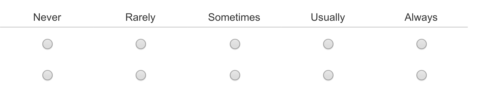

> **Image description:** A horizontal Likert‑style response grid showing five frequency options labeled left to right: Never, Rarely, Sometimes, Usually, Always. Each column contains circular radio buttons, and the example image shows two question rows (each with one radio button per column) so respondents can pick one frequency per item. In the paper this matrix was used in the survey to capture how often situations occur when fixing bugs (for example, “I notice code that should be refactored” and “I refactor this code that should be refactored”), letting engineers indicate frequency of those behaviors.

### If you do not always refactor code that should be refactored, why not?

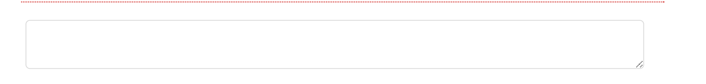

> **Image description:** A large, rounded rectangular open-text input (light gray border with a small diagonal resize handle at the bottom-right) presented as the survey item asking participants to explain why they do not always refactor code that should be refactored. In the paper this box was used to collect 332 non-unique, free-form reasons from respondents; the authors coded common themes such as “takes significant time” (n=74), “risk of introducing regressions” (n=52), “risk given the development phase” (n=30), “insufficient tests” (n=21), plus various social and managerial reasons. Visually the image is a blank, resizable comment field intended to solicit qualitative explanations that the study later summarized and quantified.

### In your opinion, what's the biggest challenge developers face when fixing bugs?


> **Image description:** A large, empty multiline survey text field (rounded rectangle) shown with a faint border and a small diagonal resize grip in the bottom-right corner. In the paper this is the free-response input used on the Qualtrics survey to collect open-ended answers (for example, “What’s the biggest challenge developers face when fixing bugs?”), enabling participants to describe reasons such as limited time, risk of regressions, lack of tests, or social and managerial constraints. The screenshot conveys that the authors gathered qualitative data in addition to fixed-choice items to support their analysis of developers’ motivations and barriers when choosing bug fixes.

### If you have any other comments on bug fixing or this survey, please enter them here:


> **Image description:** A wide, empty multiline text entry field from the paper’s survey instrument, shown as a white rectangular box with a thin grey rounded border and a small diagonal resize handle at the lower-right corner. In the survey context this box follows the prompt “If you have any other comments on bug fixing or this survey, please enter them here,” indicating it was provided for optional free‑form participant comments. The control’s appearance matches a standard web survey open‑response area intended for extended text input.

> When you are satisfied with your answers, please submit this form. You will not have an opportunity to change your answers after submitting.

---

9/7/2014

Qualtrics Survey Software

https://login.qualtrics.com/ControlPanel/Ajax.php?action=GetSurveyPrintPreview&T=3uSbn

11/11