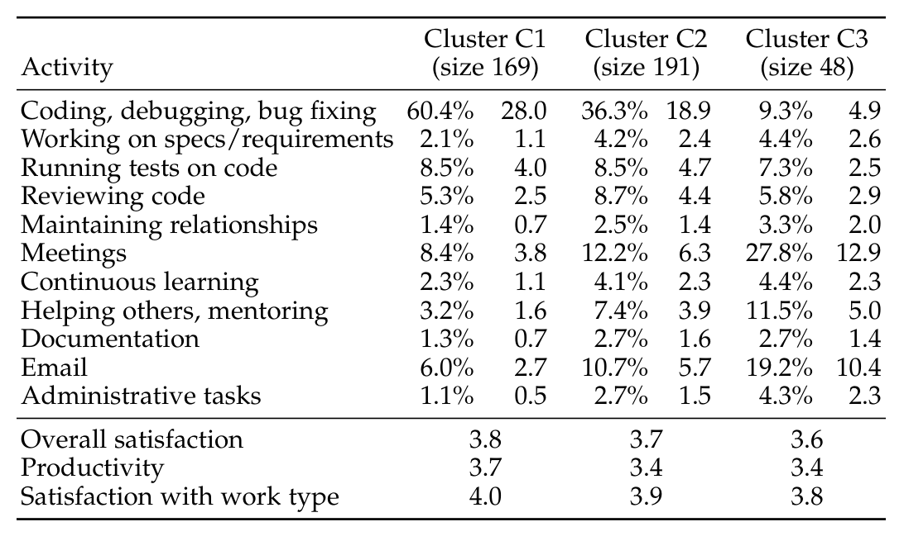

## TABLE 3

The linear regression model with standardized coefficients showing how different factors influence overall job satisfaction for developers. The level of statistical significance is indicated with asterisks: (*) for p < .05, (**) for p < .01, and (***) for p < .001. Adjusted R-squared: 0.581. (RQ3.1)

| Variable | Coeff. |
|---|---:|
| Appreciation and rewards | 0.117 \* |
| Impactful work | 0.248 \*\*\* |
| Important contributor | 0.163 \*\*\* |
| Work culture | 0.198 \*\*\* |
| Work life balance | 0.119 \*\* |
| Perceived Productivity | 0.097 \* |

## TABLE 4

The linear regression model with standardized coefficients showing how different factors influence perceived productivity for developers. The level of statistical significance is indicated with asterisks: (*) for p < .05, (**) for p < .01, and (***) for p < .001. Adjusted R-squared: 0.5585. (RQ3.1)

| Variable | Coeff. |
|---|---:|
| Autonomy | 0.201 \*\*\* |
| Can complete tasks | 0.195 \*\*\* |
| Can switch teams | −0.082 \* |
| Compensation | −0.114 \*\* |
| Engineering system | 0.250 \*\*\* |
| Important contributor | 0.109 \* |
| Impactful work | 0.208 \*\* |
| Job characteristics | −0.103 \*\* |
| Personal technical skills | 0.089 \* |
| Work environment | 0.078 \* |
| Job Satisfaction | 0.122 \* |

In Table 4, we see that many composite factors explain the variation with perceived productivity. The factors with the highest coefficients are engineering system (0.250), impactful work (0.208), autonomy (0.201), and can complete tasks (0.195). Some factors have negative coefficients: can switch teams (−0.082), compensation (−0.114), and job characteristics (−0.103). This means that an increase in these factors is linked with a decrease in how productive developers feel. For example, a developer who is more satisfied with their compensation may work on more challenging tasks that make them feel less productive. Other factors that explain perceived productivity with positive coefficients are important contributor (0.109), personal technical skills (0.089), work environment (0.078), and job satisfaction (0.122).

### RQ3.2: How does work context impact the relationship between job satisfaction and perceived productivity?

For this research question, we investigated if and how work context variables may change which factors influence developers’ job satisfaction and perceived productivity. Since type of work emerged as a key factor during our analysis, we consider time spent on different developer activities (see Section 3.2), as well as seniority of developers in terms of technical experience. We note that this is a departure from previous work where work context has included variables such as managers and pay [39]. Such variables are still included in our list of factors impacting satisfaction and productivity (gathered from literature as described in Section 2). We focused on tenure and type of work as work context since these factors emerged as relevant in our analysis.

## TABLE 5

Three developer clusters based on time spent on work activities, showing % of total time and number of hours spent per week on each activity. (RQ3.1)

and the case company. For example, through discussions with stakeholders with our case company, we learned that the amount of technical experience was a factor that may influence both work and productivity satisfaction. Challenges reported by respondents to the Stack Overflow developer survey also differed by level of experience.

For “developer experience”, we split developers into two groups: junior developers (Jr) that have less than or equal to 5 years of experience (144 in this group), and senior developers (Sr) that have more than 5 years of experience (313 in this group). We use a threshold of 5 years, because in previous internal studies at our case company, we found a marked difference in the responses of those who have been at the company less than and more than 5 years. We computed stepwise linear regressions for these two groups (for satisfaction and perceived productivity) and found that different factors emerge in the models as statistically significant. The regression models are summarized in the RQ3.2 columns of Table 6.

For junior developers, the only statistically significant variable in the job satisfaction regression model is perceived productivity. This is not to suggest that other factors do not impact their overall satisfaction, but rather for these junior developers, productivity explains most of the variation in their job satisfaction responses. Meanwhile, for senior developers, impactful work, work culture, and work life balance, important contributor, and appreciation and rewards explain most of the variation in their job satisfaction scores. Similarly, there are different regression models for perceived productivity. Impactful work, autonomy, can complete tasks, job security, and job satisfaction explain the variation in the junior developers’ perceived productivity, while for senior developers, the variables compensation, work environment, can complete tasks, engineering system, can switch teams, autonomy, and impactful work explain the variation in their perceived productivity.

For the “type of work” demographic, defining different groups was more involved. We used a clustering algorithm to characterize developers according to how they perceive they spend their time on various activities (see Table 5). We found three main clusters. Cluster 1 (C1) includes 169 developers who spend most of their time coding/debugging and testing code, but relatively little time on emails, meetings,