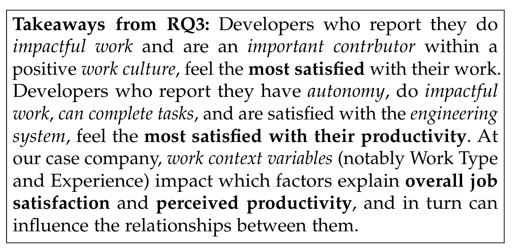

and helping others. Cluster 2 (C2) includes 191 developers who spend about half their time writing/debugging/testing code and more time than Cluster 1 developers on code review, meetings, emails, and helping others. Cluster 3 (C3) includes 48 developers who spend only about 5 hours per week writing code, but much more time in meetings (about 13 hours) and more time on email (about 10 hours).

For C1 and C2 developers, we computed regression models to identify important variables. (C3 contains too few developers to compute a regression model.) For C1 developers, those that spend most of their time coding, job characteristics, work culture, and how their appreciation and rewards are the important variables in the job satisfaction model, while for C2 developers, the variables work culture, important contributor, impactful work, and perceived productivity explain the variation in their job satisfaction scores. In terms of explaining variation in their perceived productivity, for C1 (heavy coders), the variables job characteristics, can complete tasks, engineering system, clear work goals, autonomy, appreciation and rewards and impactful work are important. For C2 developers (those that code less than C1), the variables compensation, personal technical skills, can complete tasks, engineering system, autonomy, important contributor, and job satisfaction explain the variation in their perceived productivity.

We draw several observations from Table 6:

- For job satisfaction, the factors work culture (4 out of 5 models), appreciation and reward (3 out of 5), impactful work (3 out of 5), and important contributor (3 out of 5) are statistically significant in most of the models for different work contexts. The factors work culture and impactful work have the highest coefficients among those factors.
- For perceived productivity, the factors autonomy and can complete tasks are statistically significant in all models (5 out of 5). The factors engineering systems (4 out of 5), impactful work (4 out of 5), and compensation (3 out of 5) are also statistically significant in many models for different work contexts.
- Job satisfaction is statistically significant in 3 out of 5 models for perceived productivity for different work contexts. Similarly, perceived productivity is statistically significant in 3 of the 5 models for job satisfaction for different work contexts. The bi-directional relationship between these two constructs is expected based on the work by Judge et al. [10], where more productive developers may be more satisfied, and more satisfied developers may be more productive. The factor impactful work was important for both job satisfaction and perceived productivity.
- Murphy-Hill et al. [22] found that the three statements that correlated the most with self-rated productivity at Google were “I use the best tools and practices to develop my software”, “I am enthusiastic about my job”, and “My job allows me to use my personal judgment in carrying out my work”. Similarly, in our analysis autonomy and engineering system have a strong influence. While we did not ask about the job enthusiasm, we also find that non-technical factors such as impactful work have a strong influence. (Murphy-Hill et al. did not relate their factors to job satisfaction.)
- Fishbein and Ajzen [40] showed that when people are asked to rate products, the variables that best predict preferences in a regression model do not always match the same participants’ ratings of the importance of factors. This could be interpreted as “people don’t know what’s important to them”. In our analysis, most of the composite factors with high perceived importance (> 90%) are relevant in the regression models: perceived productivity, work culture, personal technical skills, and important contributor. However there is also the factor team skills with high perceived importance that is not present in any of the regression models. The factor work environment was only considered as important by 64.0% but is present in the regression models. We’d like to point out that the absence of a statistically significant correlation does not mean that a factor is unimportant. We next discuss the implications of these findings.

## 7 TOWARDS A THEORY OF DEVELOPER SATISFACTION AND PERCEIVED PRODUCTIVITY

There is a general lack of appreciation and understanding of the impact of theories in software engineering, with many papers focusing on describing what is observed without any interpretation or conceptualization of the scientific contributions behind the findings in a way that helps explain them or helps in making predictions [41]. One way to add value to the findings from a study is to develop or build on an existing theory so that any findings can be used to communicate and further develop ideas with others in the research community. Likewise in industry, a theory may help with decision making in terms of changes to technology or the processes used [42]. There are different types of theory [42]: some theories describe or conceptualize “what is”, while other theories help to explain and/or predict what may happen if changes are made. Theories may also be used to guide design and action.

Several researchers agree that the main elements of a theory [42], [41] are its constructs — the entities that the theory strives to describe (which in turn may be operationalized using particular measures or metrics), relationships between those constructs (that is how constructs are related and why they are related, e.g., through causality or correlations), boundaries to scope the applicability of the theory, propositions, that in the case of predictive theories, represent predictions based on the theory’s constructs and relationships, and finally, hypotheses which may instantiate propositions by replacing constructs with appropriate measures.

Figure 1 shows the main research questions we posed in our study. This figure also suggests an initial theory for developer satisfaction and perceived productivity. The two