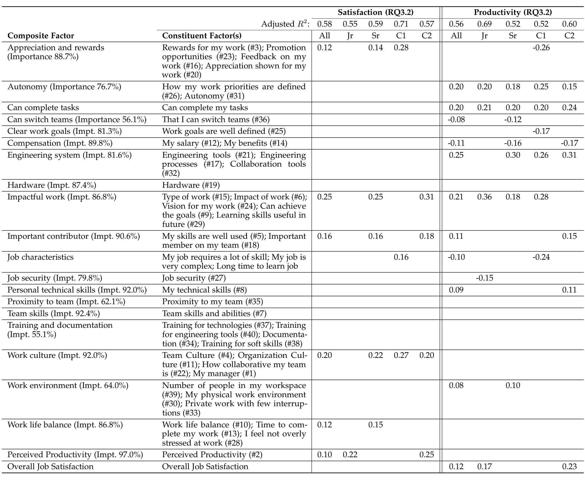

## TABLE 6

The impact of work context on job satisfaction and perceived productivity. The first and second column show the mapping from composite factor to the individual technical/social factors. For each composite factor, the first column shows the average perceived importance (Impt.) of its constituent factors. In the second column, the table shows the rank of the perceived importance of the constituent factors in parenthesis (#). The remaining columns show standardized coefficients of linear regression models for different work contexts: the entire population of developers (All), junior developers (Jr), senior developers (Sr), developers who spent most of their time coding (C1), and developers who spend less time coding and more time on code review, meetings, emails, and helping others (C2). The third developer cluster (C3) contained too few developers to compute a regression model and hence is not included in the table. Blank cells indicate that a factor was removed during the stepwise regression or not statistically significant in the final model. All coefficients are statistically significant at 0.05 or lower.

main constructs in our theory are developer satisfaction and perceived productivity. We anticipated a bi-directional relationship between these two constructs (building on the work by Judge et al.), where more productive developers may be more satisfied, and more satisfied developers may be more productive. Table 6 shows that this bi-directional relationship does exist (although in some cases it is indirect and mediated by other social and technical factors); moreover, work context variables also play a role.

In Fig. 5 we present a generic theory that captures how constructs — social and technical factors (and indirectly challenges) — relate to the job satisfaction and perceived productivity constructs. Which factors and how they impact these relationships may vary according to specific contextual work factors (in our case, we found variations in these factors for type of work and work experience). However, we emphasize that the factors, challenges, and work context variables may be quite different for other companies or development contexts.

We used the meta-study by Judge et al. [10] as a summary of factors that earlier work found contributing to job satisfaction, and built on them in our investigation and theory building. Through our case study and survey, we instantiated the theory for the company we studied, and as such, it is bounded to this context. The developer satisfaction and productivity constructs are operationalized by reported satisfaction and perceived productivity, respectively.

Developing, refining, and deploying the survey at our case company either confirmed or revealed 44 social and technical factors (in answer to RQ1.1) and 24 challenges.