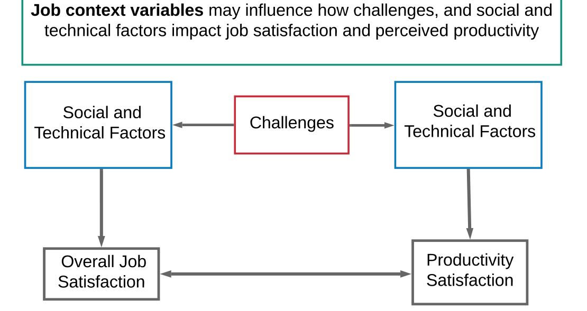
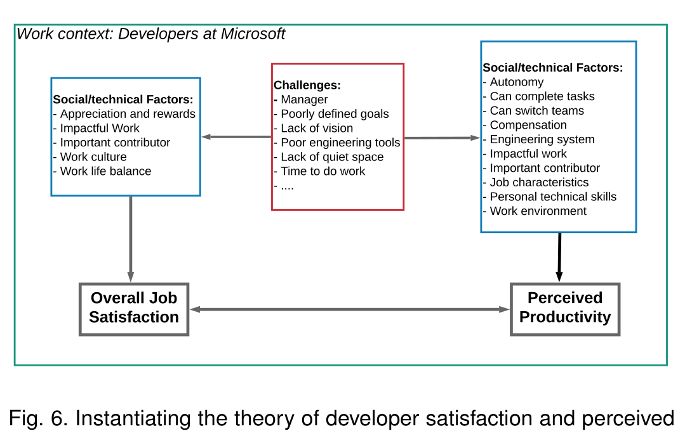
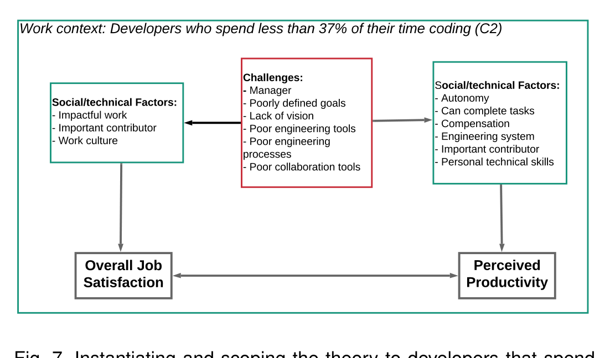

## Job context variables may influence how challenges, and social and technical factors impact job satisfaction and perceived productivity

Fig. 5. Towards a generic theory of developer job satisfaction and perceived productivity. Table 1 lists social and technical factors we found in our study, and Table 2 lists the challenges. The context variables that emerged from our study are tenure and type of work, but other variables such as gender or culture may play a role in this or other cases.

Fig. 6. Instantiating the theory of developer satisfaction and perceived productivity for our case company (for all developers that answered our survey). We find their job satisfaction and perceived productivity are related, and also find which other factors (and indirectly the main challenges) are related to job satisfaction and perceived productivity.

Fig. 7. Instantiating and scoping the theory to developers that spend less than 37% of their time coding (C2). We find their job satisfaction and perceived productivity are related, and which factors (and indirectly which challenges) are related to job satisfaction and perceived productivity.

that impact these factors (in answer to RQ2). To answer RQ3, we identified 20 composite factors that are social and technical factors but represent groups of highly correlated factors. These composite factors were used as the variables in our regression models. The models showed which of these composite factors help explain the variation in overall satisfaction and perceived productivity at our case company.

Figure 6 shows the instantiation of the generic theory for our case company and includes the specific composite factors that appeared in our models, as well as the challenges that we showed (as part of RQ2) that impact these particular factors. A further instantiation and scoping of this theory to developers who spend less than 37% of their time coding/testing/debugging (cluster C2) is shown in Figure 7. In this case, the figure shows which composite social/technical factors and indirectly which challenges relate to the main constructs of job satisfaction and perceived productivity specifically for the developers in the C2 cluster.

We discuss how the factors in our theory and our theory instantiations link to earlier work, as well as the implications from these findings in the next section. Note that our case company as well as different work context variables set a boundary (i.e., scope) for the theory instantiations we present. Consideration of other work context variables (see Table 6) are indicative of other instantiations of the generic theory.

Our instantiations of the theory at our case company now give us a basis to form propositions that could lead to actionable insights for our case company and may suggest actions that could be applied in similar development contexts.

Examples of propositions are:
- A manager that defines clear work priorities and establishes a good work culture should improve developer satisfaction and lead to higher perceived productivity.
- Showing developers how their work has impact and how they are an important contributor may make them feel more satisfied and productive.
- More effective engineering tools and processes should help support higher perceived productivity and job satisfaction; however, other non-technical factors need to be considered.

These propositions may be framed as hypotheses to be tested empirically. Testing such hypotheses would require identifying suitable measures for each of the constructs in the propositions (e.g., more effective engineering tools may be operationalized by asking developers how satisfied they are with their engineering tools). The implications of the propositions and theory for practitioners and researchers are discussed further in the next section of this paper.

## 8 Implications for Practice and Research

Many organizations—our case company included—strive to improve engineering tools and processes with the aim of better productivity and satisfaction. Our research shows that changing one may impact another, and that there are many non-technical factors that may also have an impact. Our survey results lead to some propositions that we discussed above, that may also apply to similar large companies. We discuss the implications of these propositions and mention related work. Lastly, we discuss how our theory and survey instrument may inform future research.

### 8.1 Impact of managers and work culture on developer job satisfaction

The survey respondents at our case company indicated that they believe that manager is the most important factor to them