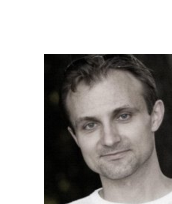
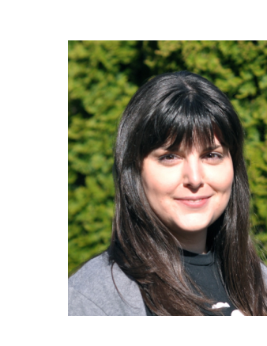

Thomas Zimmermann is a Principal Researcher at Microsoft. He received his Ph.D. degree from the Saarland University in Germany. His research interests include empirical software engineering, data science, and mining software repositories. His work focuses on software productivity, software analytics, and recommender systems for software development. He is a member of the IEEE Computer Society. His homepage is http://thomas-zimmermann.com.

Christian Bird is a Principal Researcher in the Empirical Software Engineering group at Microsoft Research. He focuses on using qualitative and quantitative methods to both understand and help software teams. Christian received his Bachelor's degree from Brigham Young University and his Ph.D. from the University of California, Davis. He lives in Redmond, Washington with his wife and three (very active) children.

Jacek Czerwonka is a Principal Engineering Manager at Microsoft.

Brendan Murphy is a Sr. Principal Researcher at Microsoft.

Eirini Kalliamvakou is a Postdoctoral Fellow at the University of Victoria, Canada.