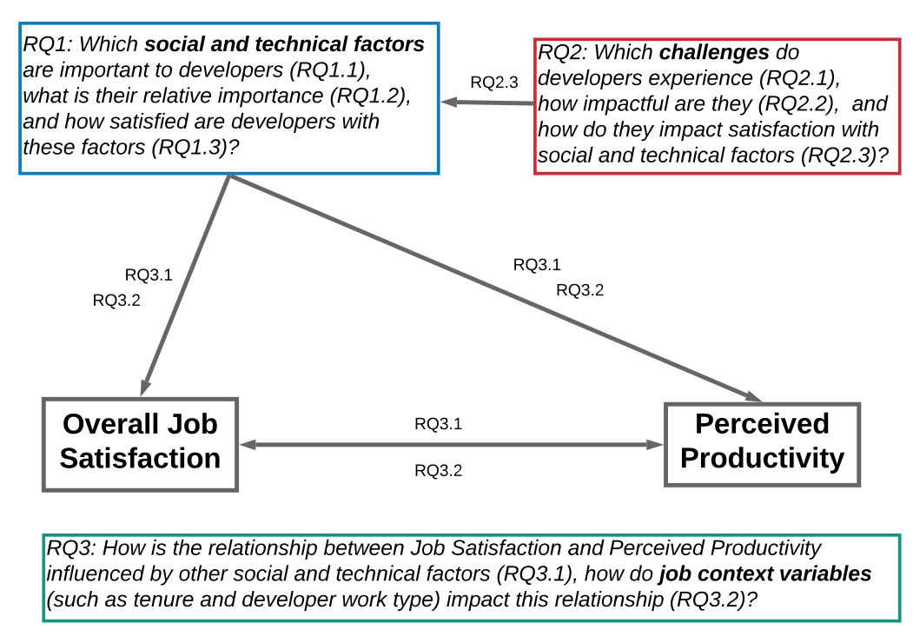

### 3.2 Developer Satisfaction and Productivity Survey

The main goal of the survey was to determine which social and technical factors are important to developers, how satisfied they are with these factors, and which challenges developers experience. The survey was developed in two main iterations (both iterations were also piloted numerous times). From our literature review (see Section 2), as well as insights from our onsite observations and examination of internal survey verbatim comments, we initially identified 30 factors that may impact satisfaction and/or productivity, as well as 15 challenges.

In our survey, using Likert-type scale questions, we asked developers how important the social and technical factors are to them, how satisfied they are currently with these factors in their current job, which challenges impact their work and how much of an impact they have (from very little to a great extent). For perceived productivity we asked how satisfied developers were with their productivity. We phrased the question in this way to be consistent with the phrasing of other questions that probed on satisfaction of factors. We also used open-ended questions to probe for additional factors and challenges in case any new ones might appear.

Following several small pilot studies, we sent a first version of our survey to 4000 software engineers in March 2017. To incentivize participation, survey respondents could enter a raffle of four $50 Amazon.com gift certificates. No reminder emails were sent. We received 591 responses, a response rate of 14% (comparable to the response rates of many other software engineering surveys [32]). Despite running several pilots, we were surprised to find an additional 10 factors and 9 additional challenges when two of the authors coded the answers to the open-ended questions. This prompted us to update the survey to include these additional factors and challenges, and redeploy it in October 2017.

Our initial survey deployment also revealed that “type of work” was a very important factor in terms of overall developer satisfaction, and in turn their productivity. Thus, in the final version of the survey, we added questions to probe how developers spend their time: we asked them to approximate how many hours they spend writing code, testing, reviewing code, writing documentation, working with requirements, attending meetings, answering emails, learning, doing admin tasks, networking, and helping others.

Our final survey was distributed to another 5000 employees in software engineering, program management, and data science, sampled uniformly at random across all product groups and geographic locations, but not including engineers solicited in the earlier pilot surveys. To incentivize participation, survey respondents could enter a raffle of four $50 Amazon.com gift certificates. No reminder emails were sent. We received 640 responses in total, a response rate of 13% (comparable to the response rates of many other software engineering surveys [32]), of which 465 indicated that they were software developers. In this paper, we consider only responses from the 465 developers that answered our survey. The (sanitized) final survey instrument we used in our study is provided in the supplemental material [31], an extract of the survey with the actual responses is shown in Figure 2. We used the answers to the questions “Overall, how satisfied are you with your current job?” (Overall Satisfaction) and “I am satisfied with my productivity at work.” (Perceived

Fig. 1. A summary of the main research questions we explored to inform our theory of developer satisfaction and productivity.

Figure 1 shows the main research questions we aimed to answer through our survey and shows how the answers to those questions helped us form an initial theory about developer job satisfaction and perceived productivity (presented in Section 7). Our survey was developed in an iterative manner to derive, confirm, and investigate the social and technical factors and challenges that impact developer job satisfaction and perceived productivity. In the following, we describe characteristics of the case company we studied, and discuss how we designed and refined the survey, and how we analyzed our data.

### 3.1 The Case Company

Our case company, Microsoft, is a large software company with tens of thousands of developers distributed in offices around the world. The company has significant variety in terms of the products developed, the size and composition of the development teams, as well as the software development tools and processes: some organizations at the case company use traditional waterfall processes, while others use a variety of agile practices.

Microsoft’s leadership team cares deeply about developer satisfaction and productivity, and several teams expend considerable effort to understand the factors that may impede satisfaction and productivity within their sub-organizations. During an initial three-month research visit at the company, the first author attended meetings and informally interviewed members from four different organizations at the company to understand how they conceptualized and aimed to measure productivity and developer satisfaction. Internal surveys were also examined, and pointed to various factors that may impact developer satisfaction and productivity at this company. We found that there was already an emphasis on improving engineering tools and processes, but that other factors played a role, such as challenges with technical dependencies and documentation resources. However, it was not clear how much impact engineering tools or these other factors had on developer satisfaction and productivity, motivating our research.