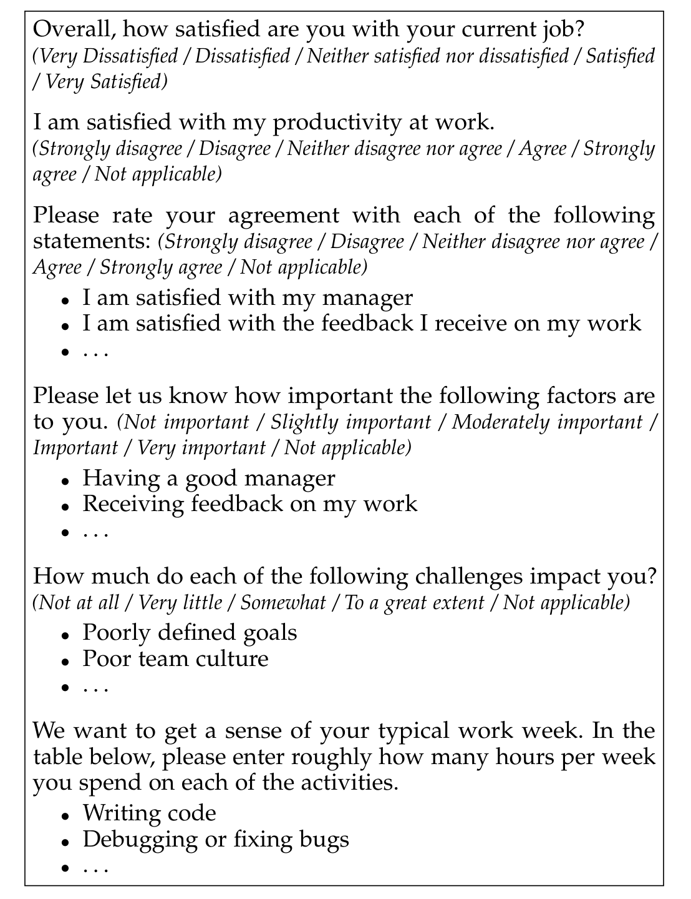

Fig. 2. An extract of the final survey, which asked about job satisfaction, perceived productivity, and importance and satisfaction with a variety of social and technical factors. The survey also asked about challenges and how developers spend their time. The complete survey instrument is provided in the supplemental material [31]. The items in the survey were presented in random order to the survey participants.

Productivity) as the dependent variables for the analysis in this paper.

The 44 factors we included in our survey to investigate job satisfaction and perceived productivity came from a variety of sources. 25 factors (57%) came from reviewed literature. 5 factors (11%) surfaced as relevant during the on-site visit, through discussions with developers and other stakeholders in the case company. 10 factors (23%) came from responses to open-ended questions included in the first main iteration of our survey deployed at the case company in the Spring of 2017. More information on this earlier survey is provided in the description of our methodology. Finally, 4 factors (9%) were added from Shaw and Gupta’s paper on work complexity [30], as the earlier survey indicated that the type of work may have an influence on developer satisfaction and productivity. The complete mapping of factors to where they originated (earlier survey, internal discussions, literature) is provided in table form in the supplemental material [31]. In the survey, the items were presented in random order to the survey participants in order to reduce ordering bias.

### 3.3 Analysis Approach

The data we analyzed in this paper comes exclusively from the responses to the final survey deployed in the Fall of 2017.

We used R to quantitatively analyze the survey data and produce visualizations.

Our initial analyses for both RQ1 and RQ2 examined the distribution of Likert-type scale responses for importance of and satisfaction with each of the social and technical factors, as well as the impact and the frequency of each challenge. Ranking and visualization of these distributions helped identify the factors developers felt were most or least important to them and what challenges were encountered, along with their impact.

One aspect of RQ2 was to explore how the challenges developers experience impact satisfaction with each of the social and technical factors. In this case, we looked for the relationships between 24 challenges and 44 factors. For each possible challenge/factor pair, we performed a correlation analysis and report pairs where there was a statistically significant correlation. Since our analysis was on Likert scores, which may not be normally distributed, we use a Spearman (non-parametric) correlation. Note that since we performed over 1000 correlations, it is likely that spurious statistically significant correlations (p < 0.05) may have occurred by chance. We address this by using Bonferroni p-value correction [33] and only report relationships that are statistically significant at the 0.05 level after such correction. All statistically significant correlations had a positive correlation above 0.75, indicating a strong relationship.

For RQ3.1, we aimed to understand the relationship between individual factors and perceived productivity and satisfaction. To accomplish this, we used statistical analysis to model these relationships, using the factors as independent variables and perceived productivity and overall satisfaction as dependent variables. That is, because each respondent indicated their satisfaction level with each factor and also indicated their overall satisfaction, we were able to model the relationship of each factor with overall satisfaction (and similarly, with perceived productivity).

A common approach for measuring the impact of a number of factors on satisfaction or productivity is to use linear regression [34], [22]. For the analysis of RQ3, we used stepwise linear regression with Overall Satisfaction and Perceived Productivity as the dependent variables. Regression relies on an independence assumption (that the impact of one factor is not affected by the impact of another) and that the impact of a factor is global and consistent across the range of outcome values (if factor X increases satisfaction by 0.5, then it will increase a base satisfaction of 1.0 to 1.5 and from 4.0 to 4.5). To check for the independence of factors we computed correlations between the satisfaction scores for each pair of factors. We then applied hierarchical clustering on the resulting correlation matrix. As distance function between two factors Xa and Xb we used 1 − abs(cor(Xa, Xb)). This distance function puts highly correlated factors into the same clusters. Since correlations can be negative (no factors were), we use the absolute value of the correlation. The result of hierarchical clustering is a dendrogram, i.e., a tree representation that illustrates how the clusters are merged for different distance thresholds. For the analysis of RQ3, we combined factors that were in “highly correlated” clusters, which we defined as a correlation of 0.5 or more (and corresponds to a distance 0.5 or less). As an example, the satisfaction for the factors Engineering processes, Engineering