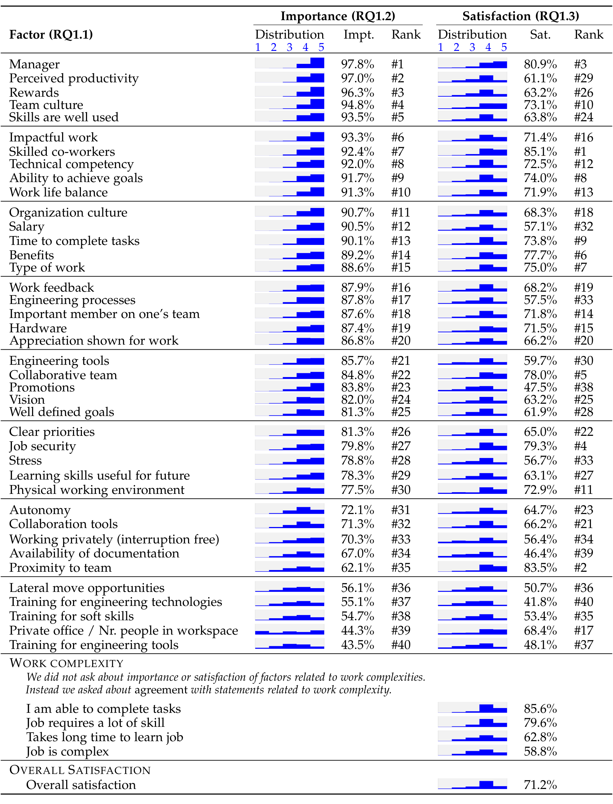

## TABLE 1

Social and technical factors that matter to developers (RQ1.1). Their importance (RQ1.2) was rated on a scale from 1 (not important) to 5 (very important). The factors are sorted by their relative importance. For job satisfaction, developers were asked to indicate agreement that they were satisfied with each factor on a scale from 1 (strongly disagree) to 5 (strongly agree). The percentages are the respondents that answered 4 or 5 for Importance (Impt) and Satisfaction (Sat). Rank is based on ordering of these percentages.

