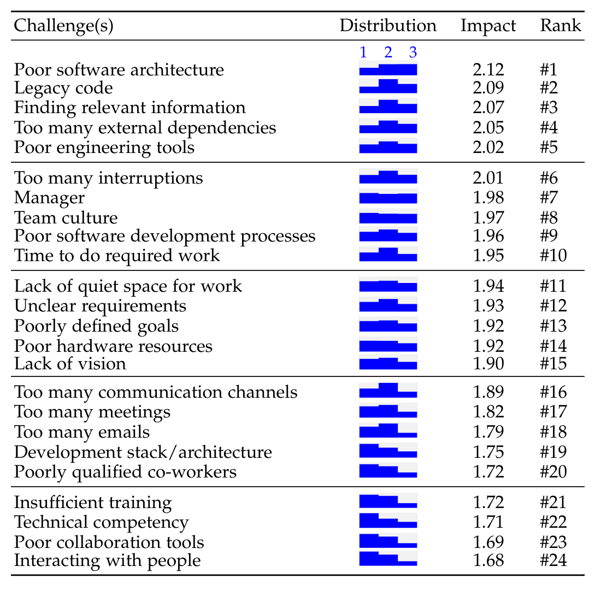

including agreement with statements concerning the complexity of their work. The percentage next to the distribution corresponds to respondents that agree or strongly agree they are satisfied with the particular factor. The rank is how the factor compares to the other factors when ordered by percentage of agreement. For most of the factors, over 50% of the respondents agree or strongly agree that they are satisfied with these factors. 85% agree they can complete their tasks at work, but only 61% said they are satisfied with their productivity, while 97% agree productivity is an important factor to them. There is high satisfaction with team factors (team culture, skilled co‑workers, collaborative team), while the factors about training for engineering technology and tools, availability of documentation, and opportunity for promotion have less than 50% agreement of satisfaction.

> Takeaways from RQ1: Having a good manager, being productive, fair rewards, collaborative team culture, using one’s skills effectively and having impact at work were perceived as most important at our case company. Developer satisfaction with their manager, team culture and skills was high, but satisfaction with personal productivity, engineering tools and processes, training and documentation was relatively low.

## 5 WHICH CHALLENGES DO DEVELOPERS EXPERIENCE? (RQ2)

Related literature discusses not just enablers of developer satisfaction and productivity, but also the challenges or barriers that impede satisfaction and productivity (see Section 2). Although we expected that poor satisfaction with social factors and technical factors can be considered as challenges, we also anticipated additional challenges may emerge.

### RQ2.1: Which challenges impact developers?

In the final survey, we queried about the impact of a list of 24 challenges and again invited the respondents to tell us of any other challenges they experience. This time only one new challenge emerged, which was “poor language skills” (mentioned only once). Table 2 shows the full list of challenges. Not all challenges are the dual of factors, notably challenges such as too many communication channels, too many meetings and too many emails, and challenges about software quality such as poor architecture, legacy code, and too many external dependencies emerged.

### RQ2.2: What impact do these challenges have?

In Table 2, we show the relative distribution of those that responded that a given challenge is either a slight challenge (1), a moderate challenge (2), or a big challenge (3). The table is ranked by the average impact of a challenge. Challenges with software architecture, legacy code, and documentation were perceived as having the most negative impact. Note that the impact of a challenge does not correspond to frequency of a challenge, e.g., a challenge with high impact can be infrequent. The most frequently reported challenges were related to finding relevant information, legacy code, software architecture. The least frequently reported challenges were related to team culture, poorly qualified co‑workers, and managers.

TABLE 2
Challenges reported by developers (RQ2.1) and how impactful they reported these challenges to be (RQ2.2). The rank is based on the average of the impact of the challenge. Impact levels are small (1), moderate (2), and large (3).

7. The origin of the challenges, in terms of the site visit, literature, or coded from the first survey, is shown in the supplemental material [31].

### RQ2.3: How do challenges impact satisfaction of factors?

As many of the challenges were the dual of the social and technical factors we identified, we suspected that a challenge (if reported by many) would show a correlation with the satisfaction scores of its corresponding factor. In Figure 3, we show how some challenges have relationships not just with their corresponding factor (e.g., one would expect that if My manager is a challenge, it would lead to lower satisfaction with the My manager factor), but also have a statistically significant relationship with many other social and technical factors. In all cases, the relationships showed a negative correlation; those who indicated they faced the challenge also indicated a lower level of satisfaction for the factor.

From Fig. 3, we see that when developers report manager as a challenge, they not only report lower satisfaction with their manager, but they also report lower satisfaction with 15 other factors. Some of these relationships are not surprising, as managers impact whether developers may be shown appreciation for their work, how much autonomy they feel, and may influence the team culture. But some correlated factors such as type of work were more surprising to us. Also the correlation of too many external dependencies challenges with the work-life balance factor was not something we expected to find. Conversely, we see that some factors show a relationship with more than one challenge. For example, the factor collaboration tools correlates not just with the challenge of poor collaboration tools, but also with the challenges of poor engineering tools, poorly defined goals, and poor software architecture.