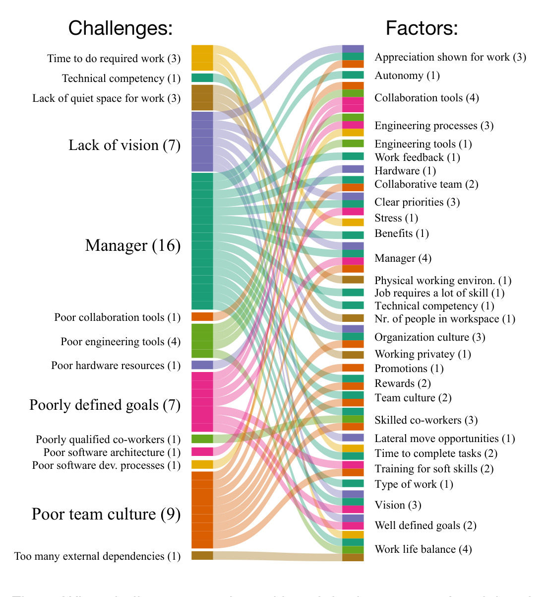
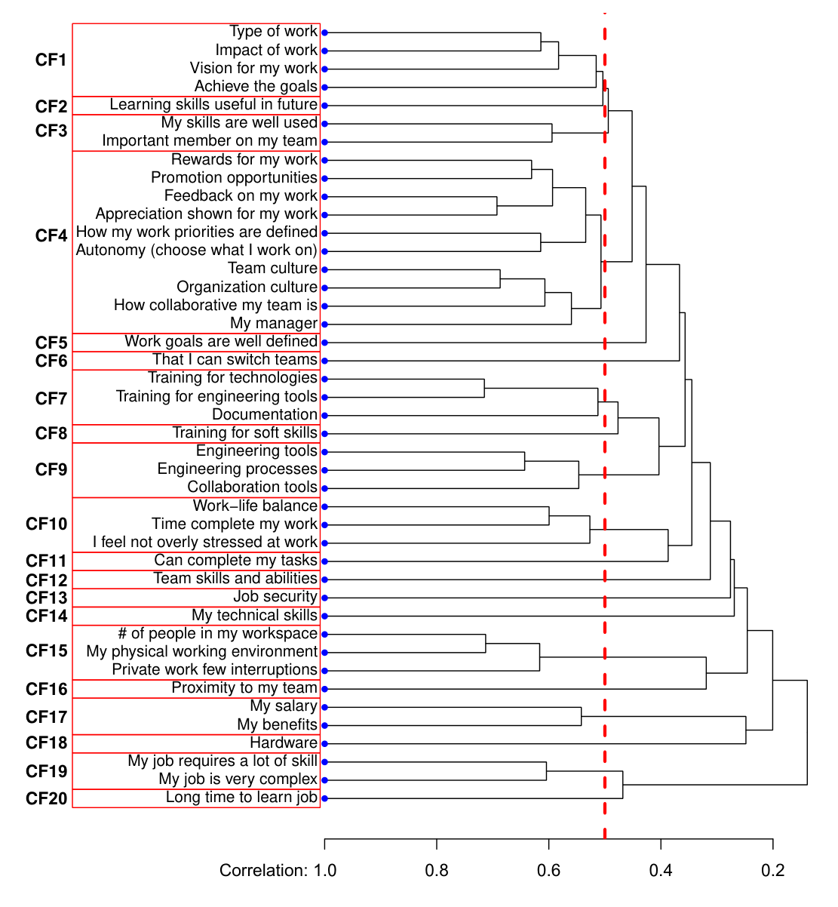

Fig. 3. What challenges correlate with satisfaction scores of social and technical factors. Numbers in () indicate how many relations affect the challenge or factor. (RQ2.3)

Fig. 4. The result of clustering technical/social factors into groups based on their correlations with each other. The correlation cut-off of 0.50 (vertical dashed red line) is used to identify 20 groups CF1..CF20, which are then refined into composite factors by averaging their scores.

> Takeaways from RQ2: At the case company, poor software architecture, legacy code, poor documentation, poor engineering tools, and too many work interruptions are challenges that developers feel have a big impact. The challenge of a poor manager is correlated with lower satisfaction across 16 different social and technical factors.

- We split the cluster CF4 into three composite factors: (1) appreciation and rewards, (2) autonomy, and (3) work culture because they capture different aspects of software developers' work.
- We combined the clusters CF7 (training for technologies; training for engineering tools; documentation) and CF8 (training for soft skills) into the composite factor training and documentation because the two clusters were conceptually related.
- We combined the clusters CF19 (my job requires a lot of skill; my job is very complex) and CF20 (long time to learn job) into the composite factor job characteristics because the two clusters were conceptually related (as discussed by Shaw and Gupta [30]).

The mapping of the resulting composite factors to constituent factors is shown in the first and second column of Table 6.

## 6 HOW IS OVERALL JOB SATISFACTION AND PERCEIVED PRODUCTIVITY RELATED? (RQ3)

We consider this relationship for all developers and how other factors may mediate this relationship (RQ3.1). We then consider how various work context variables (specifically tenure and time coding) impact these relationships (RQ3.2).

For this analysis, we grouped the 44 individual factors into 20 groups as follows. We first identified groups of factors with highly correlated satisfaction scores; each group corresponds to a composite factor, for which we compute a new satisfaction score by averaging the scores of the constituent factors. To identify highly correlated groups, we applied hierarchical clustering to the correlation matrix. Figure 4 shows the dendrogram with the results. The tree structure to the right of the list of factors indicates the order in which factors are merged into groups. For example, type of work is first merged with impact of work, followed by vision for my work and achieve the goals. To identify groups of highly correlated factors, we used a cut-off of 0.5 (indicated by the vertical dashed red line). In the example, we combined the four factors in group CF1 in Fig. 4 into the composite factor impactful work.

We made adjustments to the result of the hierarchical clustering as follows:

### RQ3.1: How do social and technical factors impact relationships between job satisfaction and perceived productivity?

To answer this research question, we computed linear regression models for overall job satisfaction and perceived productivity to model how other factors explain the variation in the responses to these two questions.

We see from Table 3 that the composite factors appreciation and rewards (0.117), impactful work (0.248), important contributor (0.163), work culture (0.198), work life balance (0.119) and perceived productivity (0.097) explain the job satisfaction of developers. The highest coefficient is for the factor impactful work (0.248): thus an increase of one standard deviation in this factor leads to an increase of 0.248 standard deviations of overall job satisfaction.