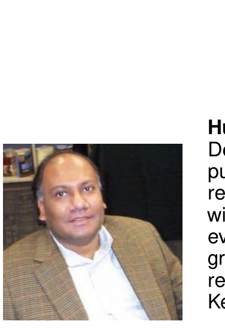
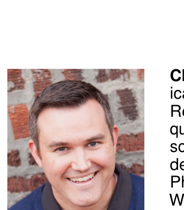

[34] G. Jeong, S. Kim, T. Zimmermann, and K. Yi, "Improving code review by predicting reviewers and acceptance of patches," Research on Software Analysis for Error-free Computing Center, Tech. Rep. ROSAEC MEMO 2009-006, September 2009.

[35] R. Morales, S. McIntosh, and F. Khomh, "Do code review practices impact design quality? A case study of the qt, vtk, and itk projects," in Proc. of the 22nd Int'l Conf. on Software Analysis, Evolution, and Reengineering (SANER), 2015, pp. 171–180.

[36] M. Beller, A. Bacchelli, A. Zaidman, and E. Juergens, "Modern code reviews in open-source projects: Which problems do they fix?" in Proceedings of the 11th Working Conference on Mining Software Repositories, ser. MSR 2014. New York, NY, USA: ACM, 2014, pp. 202–211. [Online]. Available: http://doi.acm.org/10.1145/2597073.2597082

[37] C. Kemerer and M. Paulk, "The impact of design and code reviews on software quality: An empirical study based on psp data," Software Engineering, IEEE Transactions on, vol. 35, no. 4, pp. 534–550, July 2009.

[38] M. Kim and D. Notkin, "Discovering and representing systematic code changes," in Proceedings of the 31st International Conference on Software Engineering, ser. ICSE ’09. Washington, DC, USA: IEEE Computer Society, 2009, pp. 309–319. [Online]. Available: http://dx.doi.org/10.1109/ICSE.2009.5070531

[39] T. Zhang, M. Song, and M. Kim, "Critics: An interactive code review tool for searching and inspecting systematic changes," in Proceedings of the 22Nd ACM SIGSOFT International Symposium on Foundations of Software Engineering, ser. FSE 2014. New York, NY, USA: ACM, 2014, pp. 755–758. [Online]. Available: http://doi.acm.org/10.1145/2635868.2661675

[40] L.-T. Cheng, C. R. de Souza, S. Hupfer, J. Patterson, and S. Ross, "Building collaboration into ides," Queue, vol. 1, no. 9, pp. 40–50, Dec. 2003. [Online]. Available: http://doi.acm.org/10.1145/966789.966803

[41] M. Bernhart, A. Mauczka, and T. Grechenig, "Adopting code reviews for agile software development," in Agile Conference (AGILE), 2010, Aug 2010, pp. 44–47.

[42] "Mylyn reviews," https://projects.eclipse.org/projects/mylyn.reviews, accessed: 2014-12-08.

[43] "Gerrit," https://code.google.com/p/gerrit/, accessed: 2014-12-08.

[44] L. Milanesio, Learning Gerrit Code Review. Packt Publishing Ltd, 2013.

[45] "Phabricator," http://phabricator.org/, accessed: 2014-12-08.

[46] "Google mondrian: web-based code review and storage," http://www.niallkennedy.com/blog/2006/11/google-mondrian.html, accessed: 2014-12-08.

[47] M. Mukadam, C. Bird, and P. C. Rigby, "Gerrit software code review data from android," in Proceedings of the International Working Conference on Mining Software Repositories (Data Track). IEEE, 2013.

[48] J. M. Gonzalez-Barahona, D. Izquierdo-Cortazar, G. Robles, and A. del Castillo, "Analyzing gerrit code review parameters with bicho," ECEASST, pp. –1–1, 2014.

[49] G. Jeong, S. Kim, and T. Zimmermann, "Improving bug triage with bug tossing graphs," in proceedings of the 7th Joint Meeting of the European Software Engineering Conference and the ACM SIGSOFT Symposium on The Foundations of Software Engineering, ser. ESEC/FSE ’09. New York, NY, USA: ACM, 2009, pp. 111–120. [Online]. Available: http://doi.acm.org/10.1145/1595696.1595715

[50] J. Anvik and G. Murphy, "Determining implementation expertise from bug reports," in proceedings of fourth International Workshop on Mining Software Repositories (MSR), 2007 ICSE Workshops MSR ’07, 2007, pp. 2–2.

[51] D. Cubranic, "Automatic bug triage using text categorization," in In SEKE 2004: Proceedings of the Sixteenth International Conference on Software Engineering & Knowledge Engineering. KSI Press, 2004, pp. 92–97.

[52] O. Baysal, M. Godfrey, and R. Cohen, "A bug you like: A framework for automated assignment of bugs," in Program Comprehension, 2009. ICPC ’09. IEEE 17th International Conference on, May 2009, pp. 297–298.

[53] J. Anvik, "Automating bug report assignment," in Proceedings of the 28th International Conference on Software Engineering, ser. ICSE ’06. New York, NY, USA: ACM, 2006, pp. 937–940. [Online]. Available: http://doi.acm.org/10.1145/1134285.1134457

[54] J. Anvik and G. C. Murphy, "Reducing the effort of bug report triage: Recommenders for development-oriented decisions," ACM Trans. Softw. Eng. Methodol., vol. 20, no. 3, pp. 10:1–10:35, Aug. 2011. [Online]. Available: http://doi.acm.org/10.1145/2000791.2000794

[55] M. Zanjani, H. Kagdi, and C. Bird, "Using developer-interaction trails to triage change requests," in Mining Software Repositories (MSR), 2015 IEEE/ACM 12th Working Conference on, May 2015, pp. 88–98.

> Motahareh Bahrami Zanjani is a Ph.D. student and a member of the Software Engineering Research Laboratory (SERL) in the Department of Electrical Engineering and Computer Science at Wichita State University. She received her BSc and MSc degrees from Islamic Azad University, Iran in 2006 and 2010, respectively. Her research interests are in software maintenance and evolution.

> Huzefa Kagdi is an Assistant Professor in the Department of Electrical Engineering and Computer Science at Wichita State University. His research interests are in software engineering with emphasis on software maintenance and evolution, empirical software engineering, program comprehension, and software analytics. He received his Ph.D. in Computer Science from Kent State University, USA.

> Christian Bird is a researcher in the Empirical Software Engineering group at Microsoft Research. He focuses on using qualitative and quantitative methods to both understand and help software teams. Christian received his Bachelor’s degree from Brigham Young University and his Ph.D. from U.C. Davis. He lives in Redmond, Washington with his wife and three children.