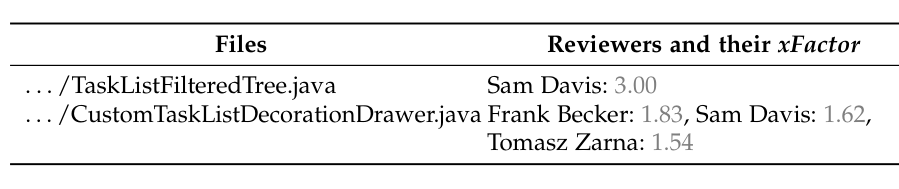

Each reviewer r for a file f has an xFactor score. To obtain the likelihood of the reviewer r, i.e., Score(r), to review the code change, we sum xFactor scores of the unique files in which it appears (see Equation 5). The Score(r) value is calculated for each unique reviewer r in the set D_ru.

In Equation 6, we have a set of candidate reviewers. If the owner of the review occurs in this list, we remove them, as recommending the owner as a reviewer makes little sense because we want to recommend other peers. The reviewers in this set are ranked based on their Score(r) values. Once the reviewers are ranked in descending order of their Score(r) values, we have a ranked list of candidate reviewers. By using a cutoff value of m, we recommend the top m candidate reviewers, i.e., with top m Score(r) values, from the ranked list obtained from the set RF.

RF = {(r, Score(r)), ∀ r ∈ D_ru } (6)

This step concludes cHRev and we have the top m candidate reviewers recommended for the given code change.

We considered a cumulative view of all the files in a patch to recommend reviewers. Therefore, we lower the probability of an empty recommendation because a code change typically has multiple files; however, some files may have not been reviewed in a very long time or added for the very first time to the review process. As a result, there will not be any recommendations at the file level. To overcome this problem, we look for reviewers with review contributions to a package that contains the file, and recommend them instead. If no package-level reviewers can be identified, we turn to the system-level reviewers as the final option. Package here means the immediate directory that contains the file, i.e., we consider the physical organization of source code. The system means a collection of packages. It can be a subsystem or a module (i.e., the top level directory). In this way, we move from the lowest, most specific expertise level (file) to the higher, broader levels of expertise (package then system). According to this approach, we guarantee that our tool always gives a recommendation, unless this is the first ever file added to the system.

### 3.3 Implementation of cHRev

To extract the code review data from Android Platform, Eclipse Platform, and Mylyn, we used the Gerrit JSON API and queried their Gerrit servers[1]. We also engineered a review log, which is akin to a version log from source code repositories. Unfortunately, a review log is not readily available like the version log. It was assembled from the code review history available in Gerrit. Review log entries include the dimensions: reviewer, date and path (e.g., files), involved in review process. After assembling the review log from the available code review history in Gerrit, the review log entries are readily available in the form of XML and straightforward XPath queries are formulated to compute the measures. The measures C_f, W_f, and T_f are computed from the review log. More specifically, the dimensions reviewer’s name, date, and paths of the log entries are used in the computation. The dimension date is used to derive workdays or calendar days. The dimension reviewer’s name is used to derive the reviewer information. The dimension path is used to derive the file information. The measures C_f, W_f, and T_f are similarly computed. The expertise model and scoring functions are implemented in Java.

TABLE 1
The reviewers extracted with cHRev from each of the files related to code change in the review #33689.

### 3.4 A Motivating Example from Mylyn

Here, we demonstrate our approach cHRev using an example from Mylyn. The goal is to show the inner workings of the cHRev mechanisms and compare its results with three other approaches. The first approach REVFINDER is based on reviews. The second approach xFinder is based on commits. The third approach RevCom is based on a combination of commits and reviews (see Section 4.2 for details). The review of interest here is the review #33689: "clean up workspace warnings in tasks.ui". Steffen Pingel is the owner and the code change includes two files. Sam Davis and Tomasz Zarna are the actual reviewers of review #33689 (highlighted in red color with their names postfixed and an asterisk in Table 2).

In cHRev, we first obtained the set D_ru from all of the reviewers recommended for each file f_i that exist in the review #33689 (see Table 1). The set D_ru consists of 3 unique reviewers. A review log is created and all the reviews before this example review have been considered in calculating the expertise metrics and forming the model. Table 1 shows the two related files to the review #33689; for each file f_i there is a set of recommended reviewers with their associated xFactor values calculated by cHRev.

For each of the 3 unique reviewers, the Score value is calculated according to Equation 5. Table 2 shows the top four Score values and the corresponding reviewers, i.e., m = 4 for four approaches: cHRev, REVFINDER, xFinder, and RevCom. Score values for REVFINDER have been calculated in a different way (see section 4.2). Sam Davis has the highest score in the set RF (a value of 4.62 in the first column) for cHRev, so he is the first recommended reviewer. For the remaining reviewers, the value of the function Score is less than Sam Davis’s score, so they all have a rank greater than 1. REVFINDER recommended one of the reviewers at rank 4 and two of the recommended reviewers by REVFINDER do not exist in the recommendation list by cHRev. xFinder did not recommend any of correct reviewers in the golden set. One of the recommended reviewers by xFinder does not exist in the recommendation list by cHRev. RevCom recommended the reviewers but with different (worse) ranking. Clearly, the best result belongs to cHRev because it recommended Sam Davis and Tomasz Zarna with ranks 1 and 3. Based on the degree of file name and path similarity which is determined by string comparison techniques for REVFINDER, Sebastien Dubois has the highest score related to the string similarity score. After investigating the review history and commit history, we ascertained that Sam Davis and Tomasz Zarna did not have any commits on those two files before the creation date of review #33689. Hence, xFinder could not recommend them as candidate reviewers. The most contribution for those

[1] https://gerrit-review.googlesource.com/Documentation/rest-api.html