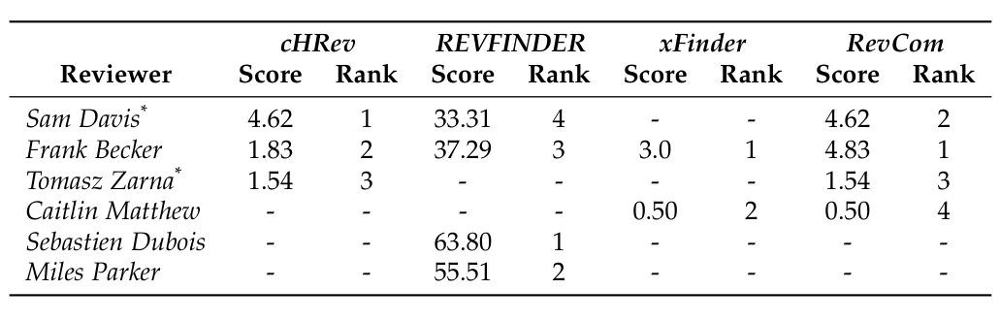

two files according to the commit history belongs to Steffen Pingel (owner) and Frank Becker. One can ask the question if the most contribution belongs to Frank Becker then probably he is the best candidate to review the code based on the findings of previous work [17]. Even considering this point, Table 2 shows that cHRev recommends Frank Becker at rank 2 and REVFINDER recommends him at rank 3. Sam Davis and Tomasz Zarna had acted as reviewers in Mylyn, hence cHRev picked them.

TABLE 2

Top four reviewers recommended to review the review #33689 with their associated ranks and score by cHRev, REVFINDER, xFinder, and RevCom.

## 4 CASE STUDY

The purpose of this study was to investigate how well our cHRev approach recommends correct reviewers to review a given code change and compare with available alternatives: a code review based REVFINDER, a commit based xFinder and a combined RevCom based on commits and reviews. Next, we present the details of the study design, its execution, and observed results.

### 4.1 Design

We conducted a case study to empirically assess our approach according to the design and reporting guidelines presented in [19]. The case of our study is the event of assigning reviewers to code changes in closed and open source systems. The units of analysis are the code changes considered from four systems. Therefore, this study would allow us to compare code reviews and commits with respect to the reviewer recommendation task. We addressed the following research questions:

RQ1: What is the accuracy of cHRev in recommending reviewers on real software systems across closed and open source projects?

RQ2: How do the accuracies of cHRev (trained from the code review history), REVFINDER (also, trained from the code review history, albeit differently), xFinder (trained from the commit history), and RevCom (trained from a combination of the code review and commit histories) compare in recommending code reviewers?

Guided by the Goal-Question-Metric (GQM) method, the main goal of the first part of our study is to assess the effectiveness of our approach, i.e., asking how accurate are the reviewers recommendations when applied to the change requests of real systems across domains? The main focus of the quantitative analysis is on addressing different viewpoints, i.e., theory triangulation, of recommendation accuracy. We collected fixed datasets, i.e., code changes, from the software review archives found in modern peer review systems. We used a data triangulation approach to include a variety of factors from closed and open source subject systems. These systems represent different main implementation languages (e.g., C/C++ and Java), sizes, review systems, and development environments. We used four metrics (precision, recall, F-score, and MRR) to cover different perspectives of accuracy.

### 4.2 Compared Approaches: REVFINDER, xFinder and RevCom

REVFINDER is a recently reported code-review-based reviewer recommendation approach. Its model is based on finding reviewers of source files with similar names and paths to those submitted in a given code change. The degree of file name and path similarity is determined with string comparison techniques and the reviewers are scored with the string similarity score. REVFINDER was shown to perform better than Balachandran’s REVIEWBOT [16]. We also compare with a previous approach, namely xFinder, for developer recommendation that uses past commits on source code. These recommendations are used for reviewer recommendation for the source code submitted for change review. xFinder builds the developer expertise based on the number of commits, and their number of workdays and recency. xFinder subsumes the default reviewer recommender in Gerrit. xFinder was shown to be competitive with other developer recommendation approaches [20]. To assess the potential orthogonality between the commits and review, we devised a combined approach, namely RevCom, which is based on the factors of cHRev and xFinder. RevCom considers three metrics from reviews and another three from commits. The presence of orthogonality between different sources have been leveraged in several other software engineering tasks previously [21], which served as an inspiration to emulate the combination for the reviewer recommendation task.

### 4.3 Subject Systems and Evaluation Datasets

Our evaluation datasets were derived from three open and one closed source systems.

#### 4.3.1 Open Source: Android Platform, Eclipse Platform, and Mylyn

Android contains 7 years of code review related to different subprojects. In this study we considered the code review history of Android Platform^3 subproject between February 7, 2015 and March 26, 2015. During the defined period, there were a total of 2,052 source code changes and 2,680 code reviews that include at least one source file. We considered this period of history because it contains a similar number of code reviews used in the evaluation of REVFINDER on Android. Reviewers provided 23,181 review comments. We considered the author of the commit (and not the committer) for xFinder.

Eclipse contains six different subprojects. In this study, we consider Eclipse Platform, because it has the largest code review history available in comparison with the other subprojects^4. Its code review history in Gerrit is available from