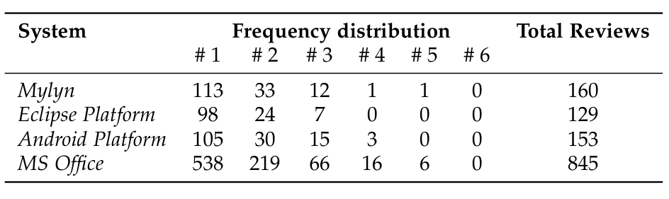

subject system and m number of recommended reviewers, the formula for precision@m, recall@m, and F-score@m are given below:

precision@m = |RR(p) ∩ AR(p)| / |RR(p)| (7)

recall@m = |RR(p) ∩ AR(p)| / |AR(p)| (8)

F-score@m = 2 · precision@m · recall@m / (precision@m + recall@m) (9)

where RR(p) and AR(p) are the recommended reviewers and the actual reviewers who contributed in the review process of the code change p respectively. This metric is computed for recommendation lists of reviewers with different sizes (e.g., m = 1, m = 2, m = 3, and m = 5 reviewers).

Table 3 shows the frequency distribution of reviewers for each subject software system in our benchmark. 69% of code changes for Android Platform, 76% of code changes for Eclipse Platform, 71% of code changes for Mylyn, and 64% of code changes for MS Office are reviewed by a single (and not necessarily the same) reviewer. In such a scenario, each increment to m in pursuit of a correct reviewer could add to the proportion of false positives. A complimentary measure is also needed to assess the potential effort in addressing noise (false positives). We focused on evaluating the ranked positions of the correct reviewers for each code change for each benchmark from a cumulative perspective regardless of the cutoff point m. Mean Reciprocal Rank (MRR) is one such measure that can be used for evaluating any process that produces a list of possible responses to a sample of queries, ordered by probability of correctness. The reciprocal rank of a query response is the multiplicative inverse of the rank of the first correct answer. Intuitively, the lower the value (between 0 and 1), the farther down the list, examining incorrect responses along the way, one needs to search to find a correct response.

MRR = (1 / |n|) · Σ_{i=1}^{|n|} (1 / rank_i) (10)

Here, the reciprocal rank for a query (code change) is the reciprocal of the position of the correct reviewer in the returned ranked list of reviewers (rank_i) and n is the total number of code changes in our benchmark. When the correct reviewer for a code change is not recommended at all, we consider its inverse rank to be a zero. When there are multiple correct reviewers, we consider the highest/first ranked position. The higher the value of MRR, the better it speaks of the potential effort spent in noise. For example, the MRR value of 0.5 suggests that the average correct answer is found at the second rank.

Further, we define the following null hypotheses for our study for both closed and open source domains to assess the statistical validity of the results (the alternative hypotheses can be easily derived from the respective null hypotheses):

TABLE 3
Evaluation benchmarks and the distribution of reviewers per review (code change)

> H-1: There is no SSD between the precision@m, recall@m, F-score@m, and MRR values of cHRev and REVFINDER.  
> H-2: There is no SSD between the precision@m, recall@m, F-score@m, and MRR values of cHRev and xFinder.  
> H-3: There is no SSD between the precision@m, recall@m, F-score@m, and MRR values of cHRev and RevCom.  
> H-4: There is no SSD between the precision@m, recall@m, F-score@m, and MRR values of RevCom and xFinder.  
>
> We applied the One Way ANOVA test to assess the statistically significant difference (SSD) with α = 0.05 between the results of precision, recall and MRR values of the compared approaches. For MRR, we considered the ranks of correct answers of the approaches for each code change (data point). The purpose of the test is to assess whether the distribution of one of the two samples is stochastically greater than the other.

## 4.6 Results

The number of recommended reviewers is the only user defined parameter for our approach. As can be seen from Table 3, the maximum number of reviewers in both closed and open source systems is bounded by five in the benchmarks. Therefore, the experiment was run for m = 1, m = 2, m = 3, and m = 5, where m is the number of recommended reviewers to provide the realistic view of the performance.

To answer the research RQ1, we consult Table 4. The highest precision is for the lowest value of m and the highest recall is for the highest value of m. The decrease or increase in precision and recall with increase in the value of m is gradual (and no drastic changes were noted). Note that while computing recall for lower values of m (e.g., RR(p) = 1 for m = 1), we considered all the correct reviewers for a patch (e.g., AR(p) = 3). Therefore, the recall at such values could be lower despite making all the correct recommendations. Furthermore, the accuracy performance of cHRev is consistent across closed (MS Office) and open source (Android Platform, Eclipse Platform, and Mylyn) systems. With regard to MRR values, we consult Table 6. cHRev gives the value of greater than 0.5 for all the four systems. That is, on average a maximum of two recommendations need to be examined to get the first correct reviewer. These results indicate the stability of cHRev across systems with different sizes, test sets, and domains.

> RQ1 cHRev makes accurate reviewer recommendations in terms of precision and recall. On average, less than two recommendations are needed to find the first correct reviewer in both closed and open source systems.

To investigate the research question RQ2, we computed the metric gain of cHRev (i.e., X equals to precision, recall,