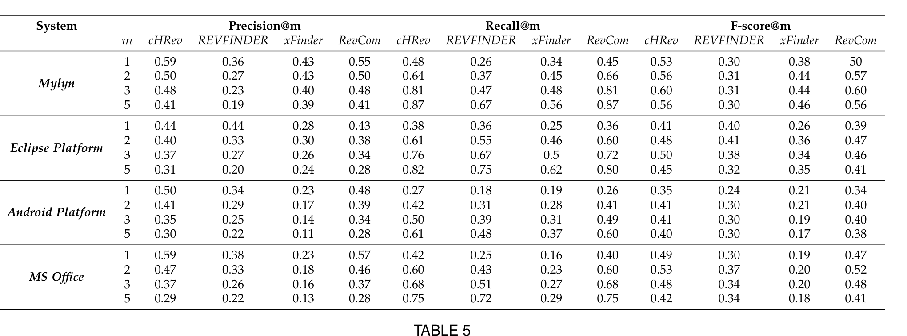
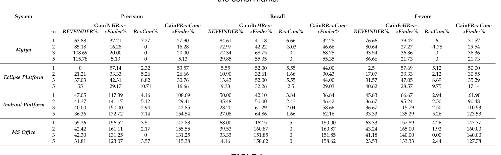
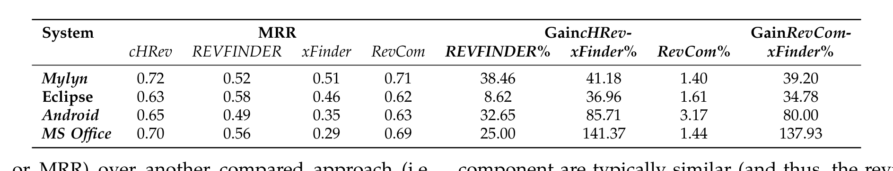

## TABLE 4
Average of precision, recall, and F-score @1, 2, 3 and 5 values of the approaches cHRev, REVFINDER, xFinder, and RevCom measured on the benchmarks.

## TABLE 5
Average of precision, recall, and F-score gains @1, 2, 3 and 5 values of the approaches cHRev, REVFINDER, xFinder, and RevCom measured on the benchmarks.

## TABLE 6
Mean Reciprocal Rank of the approaches cHRev, REVFINDER, xFinder, and RevCom measured on the benchmarks.

F-score, or MRR) over another compared approach (i.e., Y equals to REVFINDER, xFinder, or RevCom) using the following formula:

GainX@m_cHRev−Y = (X@m_cHRev − X@m_Y) / X@m_Y × 100  (11)

Tables 5 and 6 show the precision, recall, F-score, and MRR gain values. Clearly, cHRev outperforms REVFINDER across precision, recall, F-score, and MRR values in all four systems. cHRev records positive gains with statistical significance (with p-values < 0.05) in all cases, except precision@ m = 1, recall@ m = 1, and F-score@ m = 1 for Eclipse Platform (see Tables 7 and 8). In these exceptional cases, both were statistically equivalent. The gains in Eclipse Platform are generally lower than those in Android Platform, Mylyn, and MS Office. We only considered a single component of Eclipse Platform and it was the smallest dataset in our evaluation. The methodology of REVFINDER should have favored such a dataset because the file names in a single component are typically similar (and thus, the reviewers). However, our cHRev approach was able to perform better than REVFINDER in even such a favorable setting. Therefore, these results suggest that the amount of comments, the workdays needed to make them, and their recency contribute to higher accuracy than simply looking at similar file names and paths. Therefore, we find support to reject Hypothesis H-1 in favor of cHRev.

Clearly, cHRev outperforms xFinder across precision, recall, F-score, and MRR values in all four systems. It is remarkable to note that the precision and recall gains of cHRev over xFinder on MS Office (well over 100%) are substantially better than those achieved on Android Platform, Eclipse Platform, and Mylyn (well below 100%). This fact suggests that cHRev could offer a much better solution in the commercial domain. All the precision and recall gains for different values of m (with the exception of Mylyn precision at m = 5), and MRR gains are statistically significant (i.e., p-values < 0.05). The only case of Mylyn where there is no statistically significant gain happens at the largest value of m,